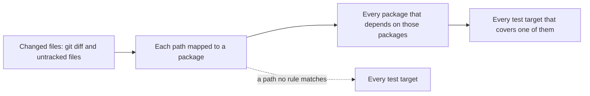
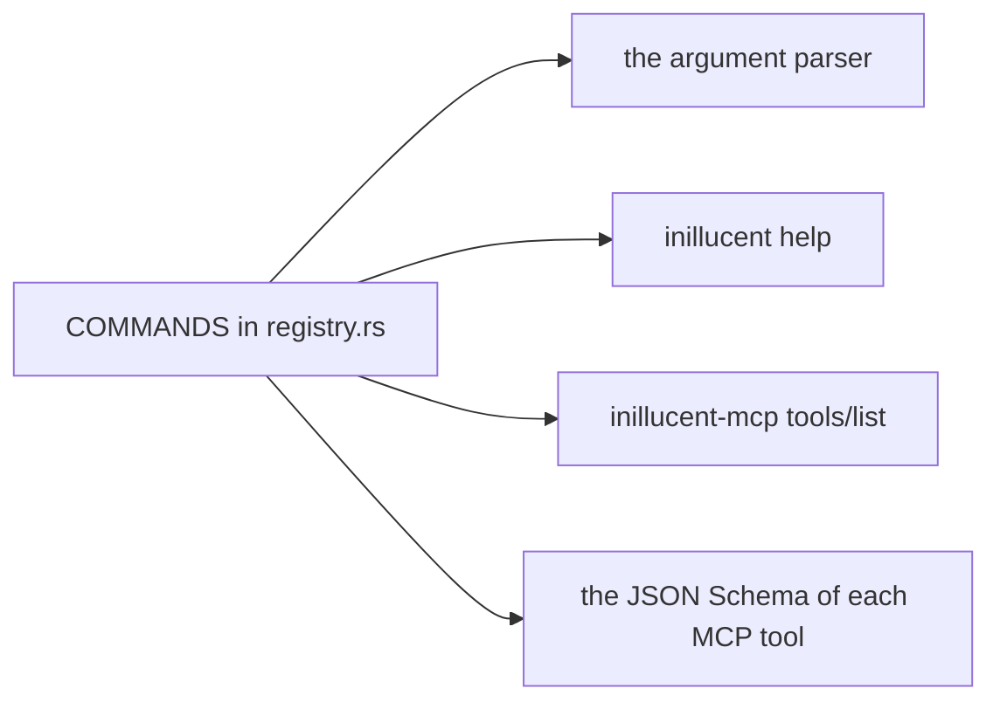

# Working on inillucent

This skill is for an agent that edits the inillucent repository. It covers the five rules a test
checks, how to run the tests, how to add a dependency, a command or a test, the house style, and
what a finished change includes. `AGENTS.md` in the repository root says the same things at more
length.

## Terms used on this page

| Term | Meaning |
|---|---|
| layering | which crate in the workspace may depend on which. `docs/invariants/layering.toml` lists it |
| governed crate | a workspace crate that sets the strict lints: `deny(missing_docs)` and the four panic lints |
| oracle | the pinned SQLite build that differential tests compare answers with |
| prerequisite | something a test suite needs that the workspace cannot build, such as the oracle or a live PostgreSQL |
| MCP | the Model Context Protocol, which `inillucent-mcp` uses to serve commands to an AI agent |

Database terms such as B-tree, WAL and LSM are in [the glossary](../../docs/glossary.md).

## The five rules a test checks

Read the file for a rule before you write the code the rule covers. Each file is short.

| Rule | Where it is written | The test that fails |
|---|---|---|
| Dependencies: only crates on an allowed list | `docs/dependency-policy.md`, `docs/invariants/layering.toml` | `cargo test -p inillucent-compat --test tooling policy::` |
| Layering: which crate may depend on which | `docs/invariants/layering.toml` | `cargo test -p inillucent-compat --test tooling harness::`, `the_workspace_obeys_the_dependency_contract` |
| Test selection: every test target has a row | `tests/selection.toml` | `cargo test -p inillucent-compat --test tooling selection::`; `no_test_hides_outside_the_map` names the target |
| One command table: the command line and MCP are generated from it | `crates/inillucent-cli/src/command/registry.rs` | `cargo test -p inillucent-compat --test tooling command_parity::` |
| The testing standard: where a new test goes and how the suite runs | [`tests/inillucent-testing-tdd.md`](../../tests/inillucent-testing-tdd.md) | none. A reviewer checks it |

## Running the tests

Do not run `cargo test --workspace` while you work. Use the parallel runner, `inillucent-testrun`.
It runs only the test targets your change can affect.

```sh
cargo build -p inillucent-compat --bin inillucent-testrun --features testrun

target/debug/inillucent-testrun --tier smoke            # the smallest tier, while editing
target/debug/inillucent-testrun --changed               # what your uncommitted edits can break
target/debug/inillucent-testrun --changed origin/main   # the same, after you have committed
target/debug/inillucent-testrun --changed --list        # the selection, without running it
target/debug/inillucent-testrun                         # every tier except nightly
target/debug/inillucent-testrun --cadence nightly       # every tier
target/debug/inillucent-testrun --strict                # fail when a prerequisite is missing
```

A git worktree's `.cargo/config.toml` may point cargo at a different target directory. The runner
binary is then in that directory's `debug/` folder.

### How `--changed` picks targets



- `--changed` reads `git diff --name-only` and `git ls-files --others`, so a new file counts.
- `tests/selection.toml` maps each path to a package. The runner adds every package that depends
  on those packages, then runs every target that covers one of them.
- A path that no rule in `tests/selection.toml` matches selects every target except the nightly
  tier.
- Each tier has a cadence. A `change` tier target runs by the closure above. A `durability` or
  `perf` target (cadence `merge`) runs only when a crate you changed is in its `covers`; CI runs
  them all on every push. A `nightly` target never runs on a change: the nightly job runs it, or
  `--tier nightly` by name.
- The build names only the selected targets, so a run that selects no `inillucent-bench` row does
  not compile ONNX Runtime, the tokenizers or oniguruma.
- `--changed` compares against `HEAD` by default. Once your work is committed, `--changed` with no
  revision selects nothing and exits 0. Pass `--changed origin/main`.

### The exit code is the result

Read the exit code, not the last line of output.

| Exit code | Meaning |
|---|---|
| `0` | every selected target ran and passed |
| `1` | the run happened and failed: a target failed, a target could not be read, or `--strict` found a missing prerequisite |
| `2` | the run did not happen. The build failed, a named selection matched nothing, `--filter` matched no test, or cargo could not report what it built. Nothing was graded. Exit code 2 is never a pass |

In a shell, `$?` after a pipeline is the status of the last command in the pipeline.
`inillucent-testrun --changed | tail -40` reports the exit code of `tail`, which is always 0.
Redirect to a file instead:

```sh
target/debug/inillucent-testrun --changed > run.log 2>&1; echo $?
```

### `--strict` before you report a result

Some suites need a prerequisite the workspace cannot build: the pinned SQLite oracle, a fixture
corpus, a live PostgreSQL or MySQL server. Such a suite reports success when its prerequisite is
absent. `inillucent-testrun --strict` counts those suites as failures and names them. Run with
`--strict` before you say a change passes.

Setting `INILLUCENT_STRICT=1` in your shell does not do the same thing. The runner sets
`INILLUCENT_STRICT` in every child process from its own `--strict` flag.

A machine that will never have a prerequisite lists it in the gitignored
`tests/prerequisites.local.toml`, as `absent = ["mysql", "postgres", "go"]`, or passes
`--absent <name>` for one run. A strict run reports the suites whose row requires one of them under "not evidenced on this machine, by declaration" and does not
fail for them. Say which suites that heading named when you report a result.

A new git worktree is missing two gitignored folders:

| Folder | What needs it | How to get it |
|---|---|---|
| `.sqlite-ref/` | every suite graded against the pinned SQLite | copy it from the main checkout, or run `pwsh tools/sqlite-reference.ps1` |
| `_agent_output/fixtures/` | `small.db`, `medium.db` and `large.db`, used by `inillucent-compat::engine::new_engine_log_lead` and `inillucent-compat::tooling::gates_fail_closed` | copy it from the main checkout, or run `tools/build-gate-fixtures.sh` |

## Adding a dependency

You probably cannot add one. Production crates may not link another database engine, SQL parser,
storage engine, B-tree or LSM library, transaction manager, write ahead log or query optimizer. The
check matches on substrings, so renaming a crate does not get it through.

Infrastructure crates are allowed: error handling, operating system calls, numeric kernels. Adding
one takes three steps:

1. Add an `[[external]]` row to `docs/invariants/layering.toml`. The row names the crate, its
   category, and every workspace crate allowed to use it.
2. Add a row to `docs/dependency-policy.md` that says why the crate does no database work.
3. Run the layering check:

```sh
cargo run -p inillucent-compat --bin inillucent-manifest -- layering
```

Read the two worked examples in [`docs/dependency-policy.md`](../../docs/dependency-policy.md)
first. Both are dependencies that were refused and written in this repository instead. The first is
the PostgreSQL and MySQL client in `crates/inillucent-remote`. The second is the download code for
`inillucent setup-embeddings`.

## Adding a command

`crates/inillucent-cli/src/command/registry.rs` holds one table, `COMMANDS`. Everything else about a
command is generated from that table.



`command_parity.rs` fails the build when any of the four stops agreeing with `COMMANDS`. Today the
table has 30 rows. `inillucent-mcp` serves 28 of the CLI's commands as MCP tools. The other two,
`shell` and `mcp`, have `cli_only` set.

To add a command:

1. Add a `Command` row and its `Param` list to `registry.rs`.
2. Write `pub fn <verb>(context: &mut Context, arguments: &Arguments) -> Result<Outcome, Failed>` in
   `crates/inillucent-cli/src/command/verbs.rs`, and name it in the row's `run` field.
3. Nothing else. The MCP tool and the help text come from the row.

Write each description for two readers. One is a person running `inillucent help <verb>`. The other
is a model that reads the description as a tool description and has one attempt at the call. Say
what a parameter is for. Name each trap: `limit` cuts the rows returned and does not change `total`,
and `params` binds `?1`, `?2` and so on in order.

A new command uses three things that already exist:

| Use | For | Why |
|---|---|---|
| `Failed::from_engine` | turning an engine error into a status such as `unsupported` or `syntax` | the driver's `Error::from_engine` is the one place that decides the status. A second copy would disagree with it the next time the engine gains a construct |
| `context.confine(path)` | every path a caller names | it applies `--root` and returns the refusal message |
| `context.confined()` | anything that reaches outside the file system, such as a host, a port or a URL | `--root` confines everything the command can reach. `migrate` from a server refuses under `--root` for this reason |

`context.confine` calls `Root::admit` in `inillucent_vfs::confine`. The same module's
`confine::authorize` runs again inside `OsVfs` before it opens, deletes, renames or reads the size
of any file. So a file opened through `OsVfs` is already confined. Do not add a second check in a
command, and do not open files with `std::fs` directly.

## Adding a test

Section 2.1 of [`tests/inillucent-testing-tdd.md`](../../tests/inillucent-testing-tdd.md) says
where a test goes. The common cases:

| What you are testing | Where it goes | Tier |
|---|---|---|
| one function or module | `#[cfg(test)]` in the crate | `unit` |
| a construct SQLite also has | `inillucent-compat/tests/`, graded against the oracle | `differential` |
| SQL or storage with no SQLite equivalent | `inillucent-compat/tests/` | `engine` |
| what an application does with the public API | `crates/inillucent/tests/` | `e2e` |
| a sequence an application performs, at every configuration | `crates/inillucent/tests/story_*.rs`, through `scenario!` | `e2e` |
| what survives a crash or an injected fault | `inillucent-compat/tests/`, under the simulator | `durability` |
| what every language binding must answer | a case in `drivers/conformance/suite.json` | |
| a cost that must not change | `crates/inillucent/tests/budget.rs` | `perf` |

A new `tests/*.rs` file needs a row in `tests/selection.toml`. Without the row, the `selection` suite
fails and names the target. In `inillucent-compat`, a suite is a module of its tier binary: a file
in `tests/<tier>/`, a `mod` line in `tests/<tier>/main.rs`, and a row with `name = "<tier>"` and
`module = "<file>"`. Its target is `inillucent-compat::<tier>::<file>`.

When a suite needs a prerequisite the workspace cannot build:

1. Add the prerequisite to the row's `requires` in `tests/selection.toml`.
2. Report the skip with `inillucent_base::testing::skipping(reason)`. Inside `inillucent-compat`
   the same function is `inillucent_compat::differential::skipping`. It ends the message with
   `; skipping`, which is the phrase `inillucent-testrun` looks for, and under `--strict` it fails
   the case. `policy.rs`, `every_skip_site_goes_through_the_one_helper`, fails on a skip written any
   other way, such as an `eprintln!` followed by an early return.

The two rules broken most often:

- **A test asserts a value.** `assert!(result.is_ok())` on a migration that published nothing
  passes and proves nothing.
- **A test must be able to fail.** A benchmark that leaves out the change under test, a check whose
  prerequisite is missing, or a limit set so wide nothing crosses it all report success and mean
  nothing.

## House style

Read three neighbouring files before you write a new one. Then follow these rules:

- **Every function has a doc comment that says what it is for**, with `@param` lines. The governed
  crates set `deny(missing_docs)`, and `policy.rs` checks that every module states its invariant.
- **A comment explains why.** Say why the obvious approach is wrong, what was measured, what failed
  before, or what another choice would cost. The comment in `crates/inillucent-remote/src/migrate.rs`
  that explains why the digest is a sum and not an exclusive or is a good model.
- **A comment claims only what its test proves.** This is rule 1.5 of the testing standard.
- **No `unwrap`, `expect`, `panic!` or slice indexing** on any code path that reads SQL text,
  database pages, journal frames, network bytes or file system results. The governed crates deny all
  four and allow them only under `#[cfg(test)]`. Use `.get(..)`, `let ... else` and
  `saturating_add`.
- **`forbid(unsafe_code)`**, unless the crate or file is on the list in `policy.rs`. Each `unsafe`
  block there has a `SAFETY` comment.
- **Run `cargo fmt` before you finish.** `policy.rs` fails on an unformatted governed crate.
- **Documentation follows [the writing style guide](../../docs/writing-style.md).** Short
  sentences, plain words, no dashes used as punctuation, no hyphenated compounds in prose.
- **Never put a ticket number in a published document.** A key such as `task-NNNN` names a card on a
  private board that readers cannot open. This covers `README.md`, `CHANGELOG.md`, `AGENTS.md`,
  `CLAUDE.md`, everything under `docs/`, `agent-skills/` and `packaging/`, and the driver and example
  readmes. Say what the change did, or give a commit hash or a date. `node tools/doc-facts/check.mjs`
  fails on a ticket number. Commit messages, code comments and the design documents under `tasks/`
  are not covered.

## What a finished change includes

1. The code, with doc comments that explain why.
2. Its tests, placed where section 2.1 of the testing standard says, each registered in
   `tests/selection.toml`.
3. `target/debug/inillucent-testrun --changed` exits 0.
4. `cargo fmt` has run.
5. Every rule file the change touches is updated in the same commit: a layering row, a dependency
   argument, a `COMMANDS` entry, a `tests/selection.toml` row. Each has a test that fails on the next
   person's machine if it is left out.
6. Every page that describes the behavior you changed is updated in the same change:
   - the pages under `docs/`;
   - the skills under `agent-skills/`, then `node tools/sync-skills.mjs` to copy them into
     `.claude/skills` and `.agents/skills`;
   - the package readmes under `packages/`;
   - `drivers/README.md`;
   - the chapter in `src/data/documentation.ts` in `sites/inillucent` of the `black-rainbow-labs-sites` repository, which is
     published at https://inillucent.com/docs.
7. `node tools/doc-style/check.mjs` reports no problems, and
   `cargo test -p inillucent-compat --test tooling documentation::` passes.
8. If you measured something, say what the number is and how you took it. If you did not measure,
   do not write a number.
