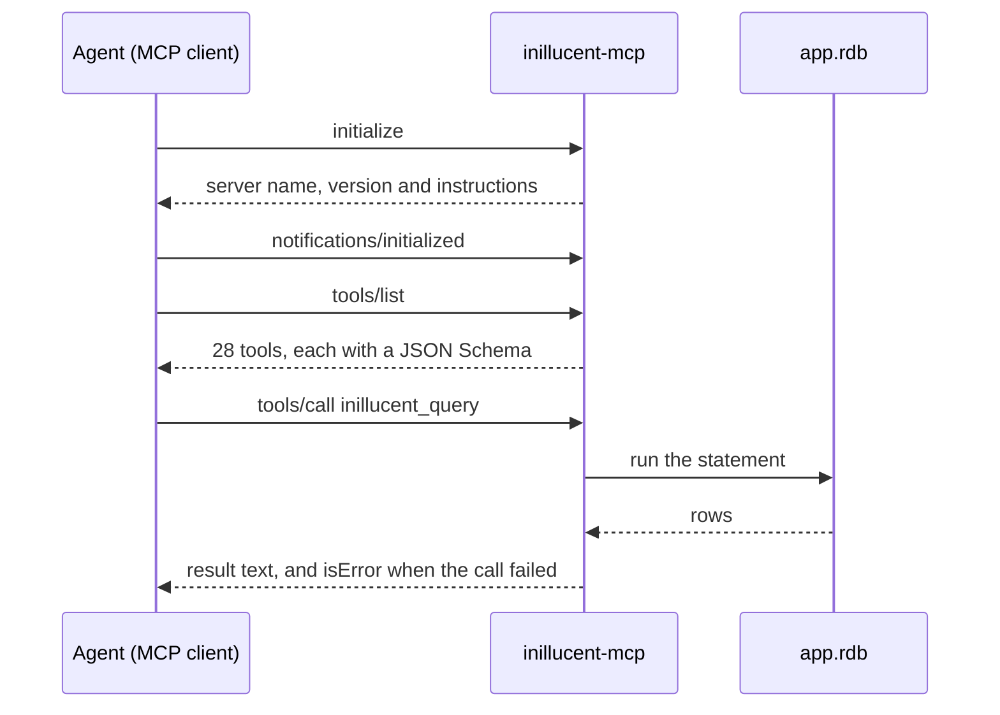

# Giving an agent a database over MCP

`inillucent-mcp` serves 28 of the CLI's commands as MCP tools over standard input and output. The
tools are generated from the same command table as the `inillucent` command line. A test,
`command_parity.rs`, fails the build if the two ever disagree. Each tool's description is the text
`inillucent help <command>` prints.

The two commands that are not served are `shell`, which needs a keyboard and a screen, and `mcp`,
which is the server itself. Use `inillucent_run` in place of `shell`. `inillucent_run` drives the
same shell through a pipe and returns what it printed, dot commands included.

## How an agent talks to `inillucent-mcp`



The messages are JSON-RPC 2.0, one JSON object per line, on the server's standard input and output.

## Adding it to an MCP client

```json
{
  "mcpServers": {
    "inillucent": {
      "command": "inillucent-mcp",
      "args": ["--db", "app.rdb"]
    }
  }
}
```

`inillucent-mcp` takes these options:

| Option | What it does |
|---|---|
| `--db PATH` | the database to serve. `INILLUCENT_DB` also works. The default is `:memory:` |
| `--readonly` | refuse every statement that would change something |
| `--root DIR` | refuse every path that resolves outside `DIR`, following links |
| `--limit N` | how many rows a call gets when it does not set `limit`. The default is 200 |

## The 28 tools

| Group | Tools |
|---|---|
| Read and write | `inillucent_query`, `inillucent_exec`, `inillucent_batch`, `inillucent_run` |
| Look at the schema | `inillucent_tables`, `inillucent_describe`, `inillucent_schema`, `inillucent_indexes`, `inillucent_databases`, `inillucent_explain` |
| Search | `inillucent_search`, `inillucent_vector_search`, `inillucent_setup_embeddings` |
| Files | `inillucent_create`, `inillucent_import`, `inillucent_export`, `inillucent_dump`, `inillucent_backup`, `inillucent_restore`, `inillucent_migrate` |
| Maintenance | `inillucent_checkpoint`, `inillucent_integrity_check`, `inillucent_analyze`, `inillucent_stats` |
| About the engine | `inillucent_capabilities`, `inillucent_functions`, `inillucent_version`, `inillucent_help` |

## Limit what the agent can reach

```json
"args": ["--db", "app.rdb", "--readonly", "--root", "/srv/data"]
```

### `--readonly`

`--readonly` refuses every statement that would change the database, with the status `readonly`.
The engine decides from the parsed statement, so `SELECT 'delete'` runs, and
`SELECT 1; DROP TABLE note` is refused. `inillucent_exec` is refused as a whole.
`inillucent_run` is still served, and the shell behind it refuses each statement that writes, so an
agent on a read only server can still use every dot command.

### `--root DIR`

`--root DIR` refuses every path that resolves outside `DIR`. The check follows each part of the
path through the file system, so a Windows junction or a Unix symbolic link below `DIR` that points
outside `DIR` is refused. A path that does not exist yet is checked through its deepest existing
parent folder, so a new file inside `DIR` is allowed. The file system layer checks the path again
when it opens the file.

`--root` covers every file a request opens: the served database, `create`, `import`, `export`,
`backup`, `restore`, `migrate`, and the SQL statements `ATTACH DATABASE` and `VACUUM INTO`. The check
is in the file system layer, which opens every file, so a command added later is covered too.
Temporary files are made inside `DIR`.

`--root` also refuses a migration from a PostgreSQL or MySQL server, because such a migration
connects to a host and a port. The refusal says so by name, with the status `invalid_state`. Run a
server migration from a command line without `--root`.

`--readonly` and `--root` do not replace file system permissions. They let you give an agent the
reporting database without giving it every file the user can read.

## Making a call

```json
{
  "name": "inillucent_query",
  "arguments": {
    "sql": "SELECT id, body FROM note WHERE created > ?1",
    "params": ["2026-01-01"],
    "limit": 50,
    "output": "json"
  }
}
```

- **`params` binds `?1`, `?2` and so on, in order.** Pasting values into `sql` causes quoting bugs
  the agent cannot see.
- **`limit` caps the rows returned, not the count.** The result's `total` is the real number of
  rows, and `more` is `true` when rows were cut.
- **`output` is `text` by default.** Pass `"output": "json"` to get the result object as the text
  of the tool result.

With `"output": "json"`, the text of the tool result is this object:

```json
{
  "ok": true,
  "command": "query",
  "columns": [{ "name": "one", "type": "integer" }],
  "rows": [[5]],
  "row_count": 1,
  "total": 1,
  "more": false,
  "changes": 0,
  "last_insert_rowid": 0,
  "elapsed_ms": 0.01,
  "text": "one\n---\n5"
}
```

A failed call sets `isError` to `true` in the MCP result. Its JSON object has `ok: false`, a
`status`, a `message` and the `text`.

## Call the tools in this order

1. `inillucent_capabilities`: what this engine can do. A test checks the rows against the running
   engine. Ask before you write an unusual statement.
2. `inillucent_tables`: what the database holds.
3. `inillucent_describe`: one table's columns, keys, indexes, row count and `CREATE TABLE`
   statement. Call it before you write SQL against a table you did not create.
4. `inillucent_query`, with bound parameters.

## Reading a failure

Branch on `status`, not on the message. `status` is one of thirteen names:

| Status | What to do |
|---|---|
| `unsupported` | the engine has not built that feature. The SQL is not wrong, and rewording it does not help. Use another construct, or ask `inillucent_capabilities` |
| `syntax` | the statement did not parse. The message gives the byte offset |
| `not_found` | the file, table or other object does not exist |
| `constraint` | the data was refused. The message names the constraint |
| `readonly` | the server was started with `--readonly` and the statement writes |
| `invalid_state` | the request cannot run here: a path outside `--root`, a destination that already exists, a migration from a server under `--root` |
| `busy` | another writer holds the database. Try again |

The other six are `interrupted`, `corrupt`, `io`, `full`, `too_big` and `internal`.
