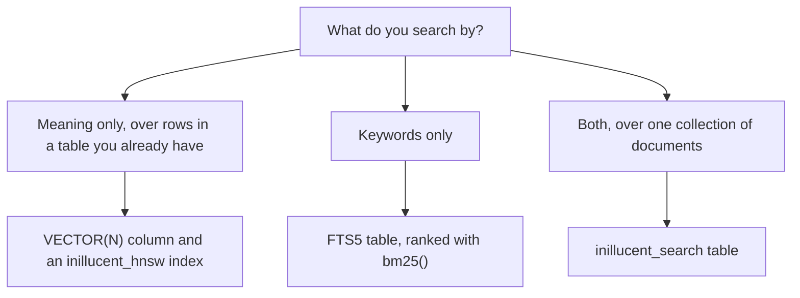

# Search: full text and vectors in the same file

inillucent does keyword search and vector search inside the same `.rdb` file as your tables. There
is no extension to load and no second server to run. A search index and the table it indexes
commit together and roll back together.

This page shows the three ways to search, how to choose between them, and how to make vectors with
`embed()`.

## Terms used on this page

| Term | Meaning |
|---|---|
| vector, embedding | a list of numbers that stands for the meaning of a piece of text. Texts with similar meaning have vectors that are close together |
| nearest neighbor search | finding the stored vectors closest to a query vector |
| cosine distance | a measure of how far apart two vectors point. 0 means the same direction |
| HNSW | the graph index inillucent uses to find near vectors without comparing every row |
| FTS5 | SQLite's full text search table, which inillucent implements |
| BM25 | the formula that scores a keyword match. `bm25()` returns it |
| facet | a column of an `inillucent_search` table that a search can filter on |

The [glossary](../../docs/glossary.md) explains other terms.

## Which one to use



| You want | Use | Why |
|---|---|---|
| nearest neighbor search over vectors in a table you already have | a `VECTOR(N)` column and `CREATE INDEX ... USING inillucent_hnsw` | keeps your schema and your joins |
| keyword search over text | an FTS5 table and `bm25()` | behaves as SQLite's FTS5 does |
| keyword and vector search over one corpus, combined into one ranking | an `inillucent_search` table | one table, one commit, one score |

## Vectors in ordinary SQL

```sql
CREATE TABLE embedding (id INTEGER PRIMARY KEY, source TEXT, v VECTOR(3));
INSERT INTO embedding (id, source, v) VALUES (1, 'note-1', x'0000803f0000000000000000');
CREATE INDEX embedding_v ON embedding USING inillucent_hnsw (v);
SELECT id, source FROM embedding ORDER BY vector_distance_cos(v, ?1) LIMIT 10;
```

Real embeddings are wider. `nomic-embed-text-v1.5` makes vectors of 768 numbers, so its column is
`VECTOR(768)`.

**Writing a vector.** A `VECTOR(N)` column holds N 32 bit floats. You can write one in three ways:

| Form | Example for `VECTOR(3)` |
|---|---|
| a blob of little endian `f32` values, four bytes each | `x'0000803f0000000000000000'` |
| a JSON array of numbers, as text | `'[0.1, 0.2, 0.3]'` |
| a bound parameter | `--params '[[0.1, 0.2, 0.3]]'` on the command line |

A vector of the wrong width is refused with the status `constraint`:

```
Error [constraint]: cannot store this value in embedding.v: it is not a vector of the declared width, and the column is declared VECTOR(3)
```

**Distance functions.**

| Function | Measures |
|---|---|
| `vector_distance_cos(a, b)` | cosine distance |
| `vector_distance_l2(a, b)` | Euclidean distance |
| `vector_dot(a, b)` | inner product |

pgvector's operators also work: `<->` (Euclidean), `<=>` (cosine), `<#>` (negative inner product),
`<+>` (taxicab), `<~>` (Hamming) and `<%>` (Jaccard). A query written for pgvector often runs
unchanged.

**The index.** `CREATE INDEX ... USING inillucent_hnsw (v)` builds the index over the rows already
in the table. Every later insert, update and delete is applied to the index before the commit.

The planner uses the index for `ORDER BY vector_distance_cos(v, ?) LIMIT k`. `EXPLAIN QUERY PLAN`
shows it:

```
SEARCH embedding USING VECTOR INDEX embedding_v (k=10)
```

- An index made with `USING inillucent_hnsw` is approximate by default: the search walks the HNSW
  graph, which is faster on a large table and can miss a true neighbor. `WITH (mode = 'exact')`
  makes it compare every stored vector, so the answer is the true top k. Below about 2,048 rows the
  index compares every vector in either mode, because that is cheaper than the walk.
- `mode` is set on the index, never in a query. `WHERE mode = 'approximate'` fails with
  `no such column: mode`. An index created by inillucent 1.0.29 or earlier is exact, and dropping
  and creating it again makes it approximate.
- On an `inillucent_search` table, `mode = 'exact'` (the default) compares every row, and
  `mode = 'approximate'` walks the HNSW graph.
- With no index, the same query compares every row and still returns the correct answer. Build the
  index when that query becomes slow.

**The metric.** An index uses cosine distance unless it says otherwise:

```sql
CREATE INDEX embedding_l2 ON embedding USING inillucent_hnsw (v) WITH (metric = 'l2');
```

The planner uses an index only when the function in `ORDER BY` matches the index's metric. A
`vector_distance_cos` query over an L2 index compares every row instead. `vector_dot` has no index.
When a query is slower than you expect, check the metric first.

`CREATE INDEX ... USING ivfflat (v)` builds pgvector's other index type beside the graph.

**From the command line.** `inillucent vector-search` writes the query for you:

```sh
inillucent --db app.rdb vector-search embedding --column v --vector '[0.01, -0.42, 0.33]' --k 10 --measure cos
```

`--measure` takes `cos` (the default), `l2` or `dot`. The result has a `distance` column.

## Keyword search with FTS5

```sql
CREATE VIRTUAL TABLE doc USING fts5(title, body);
INSERT INTO doc (title, body) VALUES ('a title', 'some body text');
SELECT title, bm25(doc) AS score FROM doc WHERE doc MATCH 'body OR text' ORDER BY rank;
```

```sh
inillucent --db app.rdb search 'body OR text' --table doc --k 10
```

`inillucent search` writes the `MATCH ... ORDER BY rank` query for you. `--k` defaults to 10.

The query uses FTS5 syntax: bare words must all match, `"a phrase"` matches the words in order, and
`OR` and `NOT` work. The `porter` tokenizer reduces words to their stem, so `run` matches `running`.
Write `tokenize = 'porter unicode61'` in the `CREATE VIRTUAL TABLE` to use it.

To keep an FTS5 table in step with an ordinary table, write triggers on the ordinary table that
insert, update and delete the FTS5 rows by rowid. They commit and roll back with the write that
fired them. `docs/vector-search.md` has the three triggers.

## Keyword and vector search together: `inillucent_search`

```sql
CREATE VIRTUAL TABLE store USING inillucent_search(title, body, dims = 768);
INSERT INTO store (rowid, title, body, vector) VALUES (1, 'a title', 'body text', ?1);

-- keywords only
SELECT title FROM store WHERE store MATCH 'body' ORDER BY rank;
-- vector only
SELECT title FROM store WHERE vector = ?1 AND k = 10;
-- both, combined into one ranking
SELECT title FROM store WHERE store MATCH 'body' AND vector = ?1 AND k = 10 ORDER BY rank;

-- fill the table from an ordinary one, and embed the question in the query
INSERT INTO store (rowid, title, body, vector) SELECT id, title, body, v FROM note;
SELECT title FROM store
WHERE store MATCH ?1 AND vector = embed('search_query: ' || ?1) AND k = 10 ORDER BY rank;
```

Release 1.0.29 refuses the last two statements with the status `unsupported`. With 1.0.29, insert
the rows one `VALUES` row at a time, and run `SELECT embed(?1)` first and bind the bytes.

| Declaration or column | What it does |
|---|---|
| `dims = N` | makes the table hold vectors of N numbers. Without `dims`, an insert with a vector is refused with the status `constraint` |
| `mode = 'exact'` or `mode = 'approximate'` | how the vector half searches. The default is `exact` |
| `vector_weight = 0.5` | fixes the vector list's weight, from 0 to 1, in place of the weight chosen for each query. Added in 1.0.30 |
| `store MATCH '...'` | the keyword query, in FTS5 syntax |
| `vector = ?` | the query vector |
| `k = 10` | how many results to retrieve |
| `ORDER BY rank` | best result first |

When a query has both a keyword part and a vector part, inillucent runs both searches and combines
the two ranked lists into one. A hit whose `origin(store)` is `keyword` has a low `confidence` even
when it is the right answer, so check the origin before using `confidence` to decide that the table
cannot answer. On natural language questions over prose, `vector_weight = 0.5` ranked better and
made `confidence` separate answerable questions from unrelated ones. [Vector search](../../docs/vector-search.md) explains how the lists
are combined and the `confidence` value each hit has.

`inillucent search` also works on an `inillucent_search` table.

### Filtering inside the search with facets

A column declared `FACET` is stored and can be filtered on inside the search. Its text is not
indexed for keywords, so it does not change any score.

```sql
CREATE VIRTUAL TABLE store USING inillucent_search(title, body, live FACET, region FACET, dims = 768);
INSERT INTO store (rowid, title, body, live, region, vector) VALUES (1, 'a title', 'body text', '1', 'eu', ?1);

SELECT title FROM store
 WHERE store MATCH 'body' AND k = 10 AND live = '1' AND region = 'eu'
 ORDER BY rank;
```

**Put the filter on a facet. Do not filter the results afterwards.** A join to another table that
removes rows after the search gives a different answer. The keyword ranking rescores the best
`k * 6` hits, and which hits are in that group depends on which rows the search admitted. On a 400
row corpus measured for [Vector search](../../docs/vector-search.md), the two methods shared one hit
of the top ten. Filtering afterwards also returns fewer rows than `k`.

A facet is also an ordinary column. It comes back from a `SELECT`, and `WHERE live = '0'` works on a
query that is not a search. A table that declares a facet is stored in format 2, and a build older
than the one that added facets refuses to open it, with a message that says so.

## Making vectors with `embed()`

inillucent can make the vectors itself, inside your process, with no embedding server:

```sh
inillucent setup-embeddings all        # ONNX Runtime and nomic-embed-text-v1.5, about 620 MB, once
```

```sql
INSERT INTO note (body, v) VALUES (?1, embed('search_document: ' || ?1));
SELECT id FROM note ORDER BY vector_distance_cos(v, embed('search_query: flight details')) LIMIT 10;
```

`embed(TEXT)` returns the 3,072 bytes a `VECTOR(768)` column holds.

| Situation | What `embed()` does |
|---|---|
| the release archives from inillucent.com, the model installed | returns the vector |
| the release archives, no model installed | fails with the status `invalid_state` and a message that names `inillucent setup-embeddings` |
| a build from source without `--features inillucent-cli/embed` | fails with the status `unsupported` (exit code 3): `embed(TEXT): this build has no embedding support compiled in` |

- **Nothing has to be exported after the install.** The engine finds the runtime and the model
  where `inillucent setup-embeddings` put them. `ORT_DYLIB_PATH` and `INILLUCENT_ONNX_DIR` override
  those locations.
- **`embed()` runs once for a statement when its argument does not change between rows.** `embed`
  is registered as deterministic, so the planner can compute it once.
- **`embed()` cannot be used in a `CHECK` constraint or an index expression.** Loading the model
  there would happen once per row.
- **Add the prefix the model expects.** `nomic-embed-text-v1.5` expects `search_query: ` before a
  question and `search_document: ` before a stored passage.

Loading the model takes 650 to 800 ms. After it is loaded, one embedding takes 12 to 36 ms, and the
model holds about 1.9 GB of memory. `inillucent setup-embeddings --residency` records when the model
stays in memory:

| Residency | When to use it |
|---|---|
| `resident` | a bulk import, or a server that searches all the time |
| `on-demand` | a process that answers one question and exits |
| `idle:<time>`, default `idle:300s` | a person asking a few questions in a row |

[Embeddings](../../docs/embeddings.md) has the details.

### A corpus to try

`examples/rag-agent/cli-example/greek-philosophy.rdb` is already embedded: 80 Wikipedia articles on Greek and
Roman philosophy, split into 2,661 passages, each with a 768 number vector. Install the model and
search it:

```sh
inillucent setup-embeddings all
inillucent --db examples/rag-agent/cli-example/greek-philosophy.rdb query \
  "SELECT title, body FROM passage
   ORDER BY vector_distance_cos(v, embed('search_query: ' || ?1)) LIMIT 5" \
  --params '["who was Seneca"]'
```

`examples/rag-agent/cli-example/AGENTS.md` is a good page to copy when you build a search database for
someone else. `examples/rag-agent/rust-example/` is an MCP server in Rust over the same articles. It
shows overlapping chunks, a sync that embeds only changed documents, and reciprocal rank fusion next
to the `inillucent_search` table.

## How fast it is

[Retrieval quality](../../docs/retrieval-quality.md) compares inillucent with PostgreSQL and
pgvector on 185,078 passages at 768 dimensions, graded on 20 September 2026. Median vector search
time:

| Query | inillucent | pgvector, configured to return full results | pgvector, defaults |
|---|---|---|---|
| no filter | 0.8462 ms | 2.315 ms | 1.492 ms |
| filtered to one source | 0.5820 ms | 36.486 ms | 1.114 ms |

inillucent runs inside the calling process, so it pays no network cost. pgvector pays a round trip
to its server.

## Before you design around a feature

```sh
inillucent capabilities
```

`inillucent capabilities` lists what the engine can do, and a test checks each row against the
running engine. [Feature comparison](../../docs/feature-comparison.md) has the measured comparison
with SQLite.
