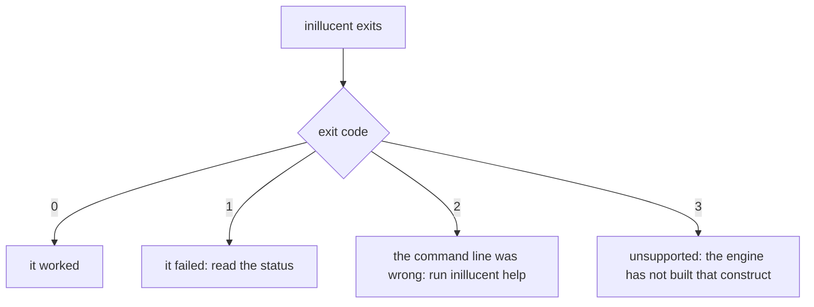

# When inillucent does something you did not expect

This skill explains what an inillucent failure means and what to do next. Start with the class of
the failure, then read the message. Every way of running inillucent reports the class: the exit
code of the `inillucent` command, and the `status` name in `--output json`, in a driver error and in
an MCP result.

## Terms used on this page

| Term | Meaning |
|---|---|
| status | one word that names the class of a failure, such as `unsupported` or `busy`. The drivers, the command line and MCP use the same names |
| `--root` | a flag that confines `inillucent` and `inillucent-mcp` to one directory. Every path must resolve inside it |
| affinity | the rule a column's declared type sets for converting a value on the way in. It does not fix the type of what is stored |
| query plan | the steps the engine chooses to answer a query. `inillucent explain` prints it |
| prerequisite | something a test suite needs that the workspace cannot build, such as the pinned SQLite or a live PostgreSQL |

Other terms are in [the glossary](../../docs/glossary.md).

## Read the exit code and the status first



| Exit code | Status | Meaning |
|---|---|---|
| `0` | | it worked |
| `1` | every status except `unsupported` | it failed, and the status says how |
| `2` | | the command line was not one `inillucent` could act on: an unknown verb or flag, or a missing argument |
| `3` | `unsupported` | the engine has not built that construct |

The statuses you will see most often, each produced by the release build:

| Status | What caused it | An example message |
|---|---|---|
| `unsupported` | a construct the engine has not built | `the new engine's physical pass does not handle a LIMIT or OFFSET that is not a constant yet` |
| `syntax` | the statement is not valid SQL | `near "SELEC": syntax error` |
| `not_found` | no such table, column, index, function or capability | `no such table: nothere` |
| `constraint` | a constraint refused the write | `UNIQUE constraint failed: t.a` |
| `readonly` | a write on a connection opened with `--readonly` | `'exec' changes the database, and this is read only.` |
| `busy` | another process holds the file for writing, for longer than `PRAGMA busy_timeout` | `another process holds the file for writing; ...` |
| `corrupt` | the file is not a database, or is damaged | `database disk image is malformed` |
| `io` | the file system refused a read or a write | |
| `invalid_state` | a misuse the command itself refused: a file that already exists, a path outside `--root`, two statements given to `query` or `exec` | `exec runs one statement and this is several; ... Use batch` |

The driver has four more statuses: `interrupted`, `full`, `too_big` and `internal`. `internal` is a
defect in inillucent. Report it.

With `--output json`, a failure prints one object with these members:

| Member | What it holds |
|---|---|
| `ok` | `false` |
| `command` | the verb that failed |
| `status` | the status name from the table above |
| `message` | what went wrong, in a sentence |
| `feature` | only for `unsupported`: the construct the engine has not built |
| `offset` | only when the failure knows it: the byte in the statement where it went wrong |
| `text` | the same failure as the text output prints it |

Branch on `status` or on the exit code. Do not match on `message`, because the wording of a message
can change between releases.

## "It says unsupported" or "it exited 3"

```sh
inillucent query "SELECT 1 LIMIT 1+1"
```

```text
Error [unsupported]: the new engine's physical pass does not handle a LIMIT or OFFSET that is not a constant yet
  not built yet: a LIMIT or OFFSET that is not a constant
```

The SQL is correct. The engine has not built that construct, so rewording the same construct gets
the same answer. Write the query another way: here, compute the number first and bind it with
`--params`. Ask what the engine supports before you write an unusual statement:

```sh
inillucent capabilities                  # the whole table
inillucent capabilities triggers         # one row
```

`inillucent capabilities` lists 49 capabilities. A test checks every row but two against the running
engine in both directions: a row that says yes and fails, or a row that says no and works, fails the
build. The two unchecked rows are `cancel` and `readonly_open`, and both say `partial`. A name that
is not in the table is the status `not_found` and means no.

[`docs/feature-comparison.md`](../../docs/feature-comparison.md) compares inillucent with the pinned
SQLite 3.53.4, case by case. On the 1.0.29 build, 402 of 416 probed cases produce the same answer.
Of the other fourteen:

| Cases | What they are |
|---|---|
| 6 | vector features SQLite does not have |
| 6 | answers that differ from SQLite's |
| 2 | `DELETE ... LIMIT` and `UPDATE ... LIMIT`, which the pinned SQLite build refuses and inillucent runs |

## "It refuses to write the file"

| Message | What it means | What to do |
|---|---|---|
| `"<path>" already exists. Open it instead of creating it.` | `inillucent create` never replaces a file | open the file with `--db`, or create a different path |
| `"<path>" already exists. This tool never overwrites.` | `inillucent migrate` never replaces its destination | choose another `--destination`. The existing file is untouched |
| `"<path>" is outside <DIR>, which this server is confined to.` | the command runs with `--root`, and the path is outside `<DIR>` | use a path under `<DIR>` |
| `"<path>" resolves to <RESOLVED>, which is outside <DIR>, which this server is confined to.` | the path resolved to `<RESOLVED>`, outside `<DIR>` | compare `<RESOLVED>` with what you typed. When the path you typed is under `<DIR>`, a Windows junction or a symbolic link on the way leads out of `<DIR>` |
| `this surface is confined to a directory with --root, and a migration from a server reaches a host and a port ...` | `--root` also refuses network access | run the server migration without `--root` |
| `'exec' changes the database, and this is read only.` | the connection was opened with `--readonly` | drop `--readonly`, or run a `SELECT` |

`inillucent backup <file>` does replace an existing file at `<file>`. Never give `backup` the path of
the database it is copying: on the 1.0.29 build that fails with `io` and leaves the database
damaged.

`--readonly` decides by what a statement does. The SQL parser classifies the statement, so
`SELECT 'delete' FROM t` runs, and `DELETE FROM t` is refused with `readonly`.

## "The database is busy"

One process writes at a time. A second process waits up to `PRAGMA busy_timeout`, which is 5000
milliseconds by default, and then fails with the status `busy`. On the 1.0.29 build, while one
process held a write transaction open, a second process could not open the file at all. It waited
5013 ms and failed:

```text
Error [busy]: could not open "<path>": another process holds the file for writing; this connection wanted it for reading, and waited 5013 ms of the 5000 ms PRAGMA busy_timeout
```

Find the process that holds a write transaction open, and make it commit or roll back. To wait
longer, run `PRAGMA busy_timeout = <milliseconds>` on the connection that waits.

Inside one Rust program, a `Database` from `inillucent-driver` is neither `Send` nor `Sync`, so it
cannot move between threads. To use one database from several threads, open a `SharedDatabase`.
`SharedDatabase` runs one statement at a time.

## "A query is slower than I expected"

```sh
inillucent --db app.rdb explain "SELECT * FROM n WHERE k = 'a'"
```

```text
SCAN n
```

`SCAN n` means the engine reads every row of `n`. After `CREATE INDEX n_k ON n(k)`, the same
command prints `SEARCH n USING INDEX n_k (k=?)`, which means the engine uses the index.

| Check | Command |
|---|---|
| which indexes a table has | `inillucent --db app.rdb describe n` |
| gather the statistics the query planner reads | `inillucent --db app.rdb analyze` |
| the query plan | `inillucent --db app.rdb explain "<SQL>"` |

Two things cost more than they appear to:

- **`--limit` does not make a query cheaper.** The engine computes the whole result, so `total` is
  exact. `--limit` (200 by default) only cuts the rows printed. Put `LIMIT` in the SQL itself.
- **A vector search with no index reads every row.** The answer is still correct.
  `CREATE INDEX <name> ON <table> USING inillucent_hnsw (<column>)` adds an HNSW index, including
  over rows already in the table.
- **An HNSW index created by inillucent 1.0.29 or earlier also compares every row.** Those releases
  created every `inillucent_hnsw` index in exact mode. `SELECT v FROM <index>_config WHERE k = 'mode'`
  says which mode an index has. Drop the index and create it again to make it walk the graph.

## "A value came back with the wrong type"

Values are typed as in SQLite. A column's declared type sets its affinity: how a value is converted
when it is written. The declared type does not guarantee the type of what is stored.

`--output json` reports each result column's `type` from the values in the result. When the values
have different types, the `type` is `mixed`. That is what was stored. The type in
`inillucent describe` is only the declared type.

A server migration stores some columns as `TEXT` on purpose, to keep every digit:

| Source column | Stored as |
|---|---|
| PostgreSQL `numeric`, MySQL `decimal` or `numeric` | `TEXT`, digit for digit |
| MySQL `BIGINT UNSIGNED` | `TEXT`, because a value above the signed 64 bit range does not fit an `INTEGER` |

The [`inillucent-migrate`](../inillucent-migrate/SKILL.md) skill lists every type.

## "A migration failed"

`inillucent migrate` prints every check, passed or failed. A failed check names the table and says
whether the row count or the digest disagreed.

- Nothing that failed a check is published. The destination path stays empty.
- The staging file `.<name>.staging` stays beside the destination. A server migration also writes
  `<name>.migration-report.md` there. Both are the evidence of what happened.
- A server migration refuses to start while an old staging file is there. It never resumes, because
  the server may have changed since the first run. Move or remove the staging file, then run
  `inillucent migrate` again.

For a SQLite file, a digest that disagrees on a table is explained. The message says how many rows
each side holds, which columns were compared, and up to three rows that only one side holds, written
as `name=value`. A `VIRTUAL` generated column is left out of the digest on both sides, because no
file stores its value. A separate `columns.<table>` check compares the declared column lists.

A server login failure starts with the server's own error code: `postgres 28P01: ...` or
`mysql 1045 (28000): ...`. Match on the code. The rest of the sentence is in the server's language.

## "Is this file damaged?"

```sh
inillucent --db app.rdb integrity-check
```

`inillucent integrity-check` exits 0 with `"ok": true` only when every row of
`PRAGMA integrity_check` is exactly `ok`. Any other answer, including no rows, fails with the status
`corrupt`, and the message lists what is wrong. Examples: a page two tables both claim, a page the
free map lists as free while a table uses it, an index entry with no row, or `Page N: never used`.
A file that cannot be opened at all also fails with `corrupt`.

| Pragma | What it checks |
|---|---|
| `PRAGMA quick_check` | every tree's structure, and which tree owns each page |
| `PRAGMA integrity_check` | the same, then every index against its table. This is the slower one |

A file whose free map chain returns to a page it already read is refused when it is opened, with a
message that names the chain.

## "The test suite passes and I do not believe it"

Some suites need a prerequisite the workspace cannot build: the pinned SQLite, a fixture corpus, a
live PostgreSQL or MySQL server. Such a suite reports success when its prerequisite is absent.

```sh
target/debug/inillucent-testrun --strict
```

`--strict` counts those suites as failures and names them. Set up the prerequisites first:

| Prerequisite | How to get it |
|---|---|
| the pinned SQLite, in `.sqlite-ref/` | `pwsh tools/sqlite-reference.ps1`, or `tools/sqlite-reference.sh` |
| the fixtures in `_agent_output/fixtures/` | `tools/build-gate-fixtures.sh`, or copy them from the main checkout |
| a live PostgreSQL or MySQL | the comments at the top of `crates/inillucent-remote/tests/live_postgres.rs` and `live_mysql.rs` |

## "It printed an error and the exit code was zero"

`inillucent-testrun` has three exit codes:

| Exit code | Meaning |
|---|---|
| `0` | every selected target ran and passed |
| `1` | the run happened and failed |
| `2` | the run did not happen: the build failed, a named selection matched nothing, or `--filter` matched no test. Nothing was graded |

In a shell, `$?` after a pipeline is the exit code of the last command in the pipeline:

```sh
target/debug/inillucent-testrun --changed | tail -40 ; echo $?       # the exit code of tail, always 0
target/debug/inillucent-testrun --changed > run.log 2>&1 ; echo $?   # the exit code of the runner
```

## Where to look next

| Question | Page |
|---|---|
| what SQL the engine supports, and what it refuses | [`docs/sql.md`](../../docs/sql.md) |
| every probed construct, measured against SQLite | [`docs/feature-comparison.md`](../../docs/feature-comparison.md) |
| what is not built yet | [`docs/roadmap.md`](../../docs/roadmap.md) |
| what a driver promises | `drivers/README.md` in the repository, `DRIVER.md` in a release archive |
| how the test runner decides what to run | [`tests/inillucent-testing-tdd.md`](../../tests/inillucent-testing-tdd.md) |
