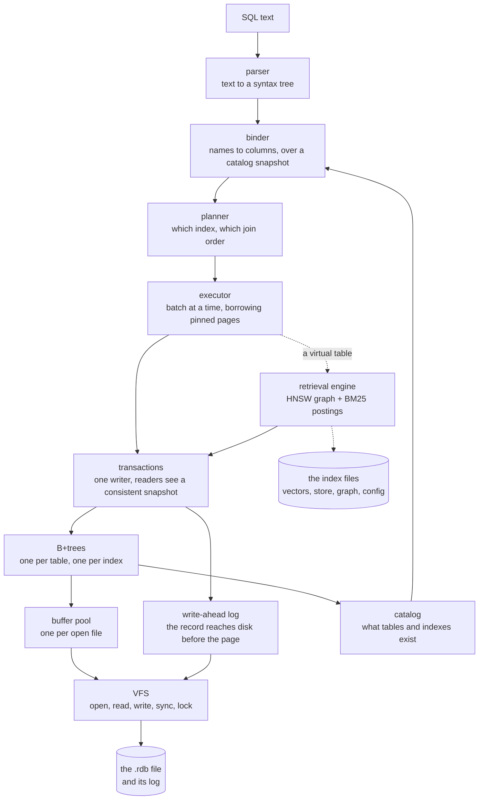

# Architecture in one page

Two engines in one file, and what happens to one query across both of them.

[Architecture](architecture.md) covers the retrieval half in plain terms.
[Relational architecture](relational-architecture.md) covers the SQL half: storage, transactions,
the log, recovery. Nothing sat above them, so a reader who wanted to know what the product *is*
before reading either had nowhere to start. This page is that.

## The two engines

**The relational engine** speaks SQLite's dialect on its own storage. It parses SQL, binds it
against a catalog, plans it, and runs it over B+trees with a write-ahead log underneath. It is not a
fork of SQLite and does not read SQLite's file format: the dialect is the thing that was kept, and
the storage was rewritten. `inillucent migrate` reads a `.db` file into one of these.

**The retrieval engine** searches by meaning. It holds embeddings - a list of 768 numbers per piece
of text - in an HNSW graph, and the words of that text in an inverted index scored by BM25. Given a
query it can find the chunks that mean something similar, the chunks that contain the words, or
both ranked together.

**They are one file and one transaction.** A `CREATE TABLE` with a `VECTOR(768)` column and an
`inillucent_search` index over it is ordinary SQL; the index commits and rolls back with the rows it
indexes, because the module that owns it writes through the same transaction the `INSERT` does. That
is the thing this project is for. The usual arrangement is PostgreSQL with pgvector holding the rows
and `llama.cpp` serving the model over HTTP - two processes, two network hops, and no transaction
that covers both.

Words used below and not explained here are in the [glossary](glossary.md).

## One query, through both halves

The dotted edges are the retrieval half. It hangs off the executor as a **virtual table**: a table
whose rows come from a module rather than from a B+tree, read and written with ordinary SQL. That is
the same mechanism FTS5 and the R-tree use, and it is why the retrieval engine needs no API of its
own. [Relational architecture section 9](relational-architecture.md#9-extensions-and-virtual-tables)
is the protocol; [section 10](relational-architecture.md#10-keeping-a-vector-index-current) is how
the index stays current with the rows.

### The lifecycle, step by step

1. **Parse.** The text becomes a syntax tree. A statement that is not valid SQL stops here with
   `SQLITE_ERROR` and the position it stopped at.
2. **Bind.** Every name is resolved against a snapshot of the catalog: which table, which column,
   what type, which collation. A missing table is reported here. The binder does no I/O and says so
   in its types, so a bind cannot read a page.
3. **Plan.** The planner chooses the access path for each table - a scan, a seek through an index, a
   covering index that answers without touching the table - and the order to join them in.
   `EXPLAIN QUERY PLAN` prints what it chose.
4. **Execute.** The executor walks the plan a batch of rows at a time. A batch **borrows the bytes
   of the pinned page** rather than copying them, so a scan that reads one column of a wide table
   reads one region of each leaf. Values are copied only where an operator has to outlive its input:
   a sort, a hash join, an aggregate.
5. **Read or write.** A read descends a B+tree through the buffer pool, three page reads deep on a
   large table. A write appends a log record, changes the page in the pool, and leaves the file
   itself to a later checkpoint.
6. **Retrieval, if the statement reaches it.** A query against an `inillucent_search` index goes
   through the virtual-table protocol: the module is handed the constraints the planner could not
   answer itself, searches its HNSW graph and its postings, and hands back rows. Those rows join
   against ordinary tables like any others.

### How a transaction commits, in one paragraph

Every change is written to the **log before it is written to the database file** - that is the
write-ahead rule, and it is the whole of why a crash is survivable. `COMMIT` appends a commit record
and syncs the log; at that point the transaction is durable even though the database file has not
changed at all. A **checkpoint**, later, writes the logged pages into the file and retires that part
of the log. A crash between the two leaves a file missing the writes and a log holding them, and the
next open replays the log from the last checkpoint. A crash *during* a checkpoint is the same
situation: recovery applies what the file has not got and skips what it has, decided per page by the
LSN stamped on it. [Relational architecture section 5](relational-architecture.md#5-the-log-and-what-a-crash-costs)
has recovery in full, including what `journal_mode = off` gives up.

Access from **several processes** works, over the same SHARED, RESERVED, PENDING and EXCLUSIVE lock
protocol SQLite uses. **Threads inside one process** do not: a `Database` is neither `Send` nor
`Sync` today, and [the roadmap](roadmap.md) has the step that makes it `Send`.

## Where the bytes live

One database is **one `.rdb` file and its log**. Inside the file:

| | |
|---|---|
| **the meta page** | page 1, written in two copies: the page size, the catalog's root page, the free map's head. It says how to read everything else, so a file whose meta page will not decode is refused rather than believed. |
| **one B+tree per table** | interior pages holding separator keys and pointers, leaves holding the rows in key order. |
| **one B+tree per index** | the same structure, keyed by the indexed columns, with the row's identity at the end of each entry. |
| **blob extents** | the tail of any value too long to sit in a leaf, chained page by page. |
| **the free map** | which pages are not in use, so a new page is taken from inside the file rather than added to the end of it. |

The log is a separate file beside the database, named `<database>-wal.NNNNNNNNNN`; a checkpoint
retires one segment and starts another.

The **retrieval index is four more files**, in a directory of their own:
`vectors.bin` (the embeddings), `store.bin` (the chunk text and its attributes), `graph.bin` (the
HNSW connections) and `config.bin` (what it was built with). Each begins with a marker and a format
number, so a file written by a different version is refused rather than misread. The word index and
the compressed embeddings are not stored, because both are recomputed exactly from the first two
files and recomputing them is cheaper than the disk they would take.
[Architecture section 11](architecture.md#11-saving-and-reopening) has the sizes on the measured
corpus.

## Threads: serialized, not parallel

SQLite's own word for it, and the same promise. `SharedDatabase` in the driver lets any number of
threads use one database, and exactly one statement runs at a time. No statement runs in parallel
with another, no statement is split across threads, and the executor is unchanged. What it buys is
that an application with a thread pool does not need a connection per thread and a protocol for
handing them around.

**The database gets a thread of its own rather than a lock.** A `Database` holds `Rc` - the engine's
state groups, the log, the compiled plans - so it is neither `Send` nor `Sync`. The obvious way to
share one is a mutex and an `unsafe impl Send` whose argument is that the `Rc` graph is reachable
only through the mutex; that argument has a hole, because `Connection::set_authorizer` takes an `Rc`
the caller keeps a clone of. So the database is opened on a thread of its own and never leaves it,
and the handles send it statements. `inillucent-driver` keeps `#![forbid(unsafe_code)]` and the
confinement is the compiler's rather than a paragraph's. The cost is a thread per shared database
and a channel round trip per statement.

**A transaction holds the turn for its whole life.** In this engine a transaction belongs to the
*database* rather than to the handle that opened it, so another thread's statement between a `BEGIN`
and its `COMMIT` would join that transaction and be committed by it. `SharedTransaction` takes a
turn lock when it opens and gives it back when it settles, so every other thread waits for the whole
transaction. That is the cost of the promise.

`drivers/inillucent-driver/tests/threads.rs` asserts the three properties: eight threads inserting a
thousand rows each land eight thousand rows with no two sharing a key; a reader sampling throughout a
thousand-row transaction sees zero rows or a thousand and never a number between; and a database
used and dropped on another thread releases its file, which the reopen afterwards proves.

## What is deliberately not here

- **A second process.** No server, no port, no connection pool. The engine is a library and the
  database is a file.
- **A parallel executor.** One statement runs on one thread, and several threads take turns rather
  than running at once - see the section above. The retrieval engine's index *build* uses several
  threads; nothing on the query path does.
- **SQLite's file format.** `Database::import` reads a `.db` file once, into a new `.rdb`. Opening a
  `.db` directly is not a thing this engine does, and it says so rather than half doing it.
- **Every SQL construct.** What is not built answers exit code 3, or `unsupported` over the driver
  and MCP, which is a different answer from a syntax error on purpose.
  [Feature comparison](feature-comparison.md) has the 416 measured cases and
  [the roadmap](roadmap.md) has what is open.

## Where to read next

| you want | page |
|---|---|
| what it is and who it is for | [Product overview](product-overview.md) |
| the words | [Glossary](glossary.md) |
| the retrieval half, in depth | [Architecture](architecture.md) |
| the SQL half, in depth | [Relational architecture](relational-architecture.md) |
| which SQL runs | [SQL support](sql.md) |
| the crates and the contracts | [Repository](repository.md) |
