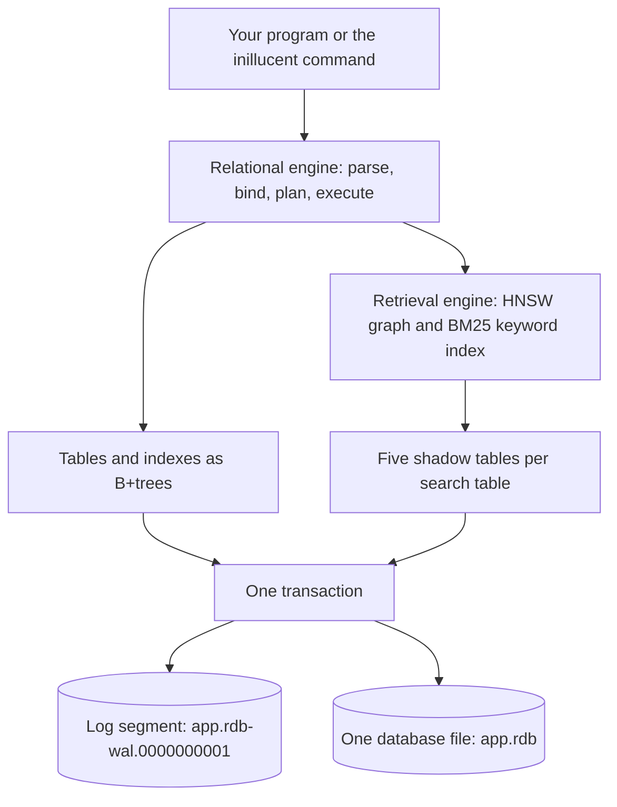
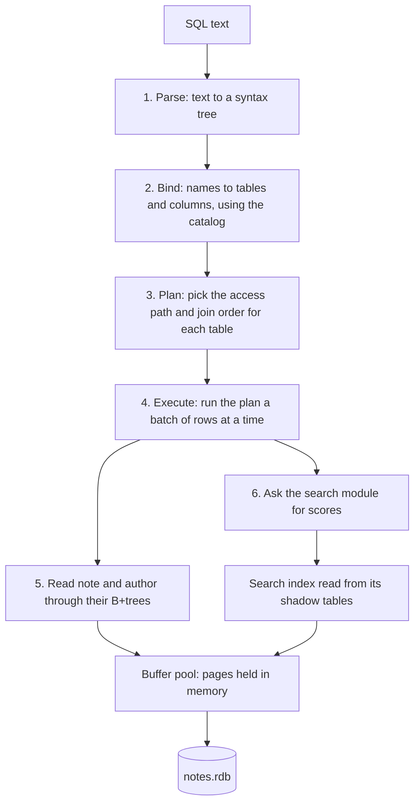
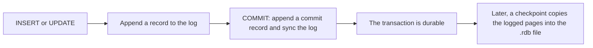
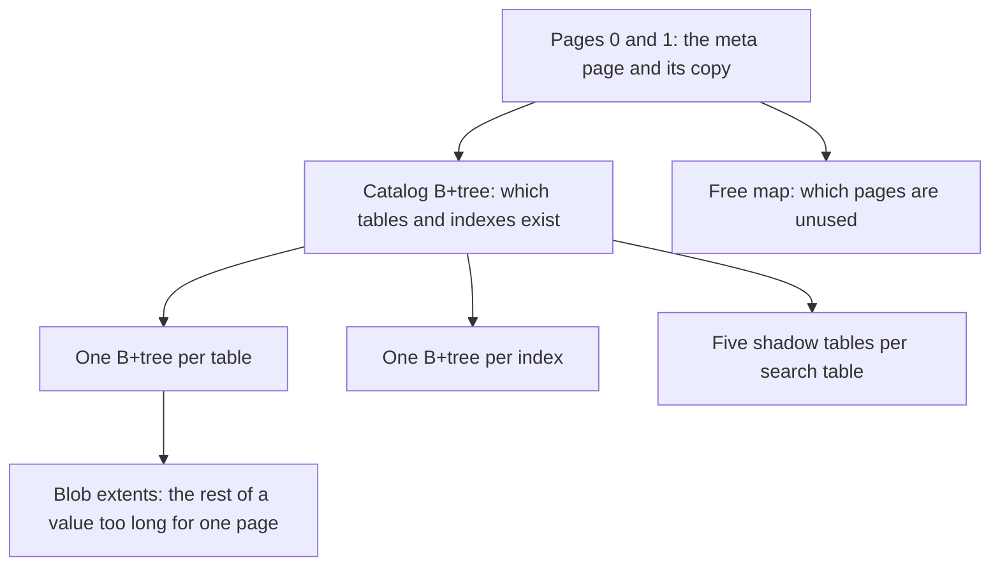

# Architecture in one page

inillucent has two engines, and both keep their data in one `.rdb` file. This page shows how the two
engines fit together, follows one query that uses both of them, and lists where the bytes live on
disk. It is the page to read before [Relational architecture](relational-architecture.md) (the SQL
engine in depth) and [Architecture](architecture.md) (the search engine in depth).

## Terms used on this page

Each term links to its entry group in the [glossary](glossary.md).

| Term | Meaning here |
|---|---|
| [B+tree](glossary.md#storage) | the structure every table and every index is stored in |
| [Page](glossary.md#storage) | the fixed size block the file is divided into. The default is 32 KiB |
| [Buffer pool](glossary.md#storage) | the pages the engine keeps in memory. The default is 128 MiB |
| [Meta page](glossary.md#storage) | the first page of the file, which says how to read the rest |
| [Shadow table](glossary.md#storage) | an ordinary table that a virtual table stores its data in |
| [WAL](glossary.md#transactions-and-the-log) | the write ahead log. Every change is appended to the write ahead log before the database file changes |
| [Checkpoint](glossary.md#transactions-and-the-log) | copying logged changes into the database file |
| [Journal](glossary.md#transactions-and-the-log) | a file of old page images that protects a checkpoint |
| [HNSW](glossary.md#search) | the graph index that makes vector search fast |
| [BM25](glossary.md#search) | the formula that scores a keyword match |
| [Virtual table](glossary.md#sql) | a table whose rows come from a module instead of a B+tree. It is read and written with ordinary SQL |

## The two engines



**The relational engine** runs SQL in SQLite's dialect. It parses the statement, binds names to
tables and columns, plans the query and runs it over B+trees. The relational engine uses its own
file format. It does not open SQLite's `.db` files directly. `inillucent migrate` copies a `.db` file
into a new `.rdb` file.

**The retrieval engine** searches text by meaning and by keyword. It keeps each text's
[embedding](glossary.md#search) in an HNSW graph, and the words of each text in an
[inverted index](glossary.md#search) scored by BM25. A search returns the texts whose embeddings are
closest to the query, the texts that contain the query's words, or both lists combined into one
ranking.

**Both engines share one file and one transaction.** An `inillucent_search` table is a virtual table.
The retrieval engine stores every byte of an `inillucent_search` table as rows in five ordinary
shadow tables inside the same `.rdb` file. So a row in an ordinary table and an entry in a search
table commit together, roll back together, and are recovered together after a crash.

The next example shows the rollback. It adds a note to an ordinary table and to a search table in one
transaction, and then rolls the transaction back. The table definitions are in
[the next section](#one-query-through-both-engines).

```sh
inillucent --db notes.rdb run "BEGIN;
  INSERT INTO note VALUES (4, 2, 'refund for a late parcel');
  INSERT INTO note_search (rowid, body, vector) VALUES (4, 'refund for a late parcel', '[0.1, 0.3, 0.9]');
  SELECT count(*) FROM note_search WHERE note_search MATCH 'refund' AND k = 10;
  ROLLBACK;
  SELECT count(*) FROM note_search WHERE note_search MATCH 'refund' AND k = 10;
  SELECT count(*) FROM note;"
```

```text
2
1
3
```

Inside the transaction the keyword search finds two notes that contain "refund". After `ROLLBACK` the
keyword search finds one note, and the `note` table has its three original rows again.

## One query through both engines

This example makes a database with two ordinary tables and one search table. The search table uses
3 numbers per embedding so the example fits on the page. A real embedding model produces 768 numbers
per text.

```sh
inillucent create notes.rdb
inillucent --db notes.rdb batch "
  CREATE TABLE author (id INTEGER PRIMARY KEY, name TEXT);
  CREATE TABLE note (id INTEGER PRIMARY KEY, author_id INTEGER, body TEXT);
  CREATE VIRTUAL TABLE note_search USING inillucent_search(body, dims = 3);
  INSERT INTO author VALUES (1, 'Ana'), (2, 'Ben');
  INSERT INTO note VALUES (1, 1, 'refund policy for damaged goods'),
                          (2, 2, 'shipping times to Europe'),
                          (3, 1, 'how to return an item');
  INSERT INTO note_search (rowid, body, vector) VALUES
    (1, 'refund policy for damaged goods', '[0.1, 0.2, 0.9]'),
    (2, 'shipping times to Europe',        '[0.9, 0.1, 0.1]'),
    (3, 'how to return an item',           '[0.2, 0.1, 0.8]');"
```

The query asks for notes that match the word "refund" and a query vector, joins each hit to its note
and its author, and orders the rows by the combined search score:

```sh
inillucent --db notes.rdb query "
  SELECT a.name, n.body, s.rank
  FROM note_search AS s
  JOIN note   AS n ON n.id = s.rowid
  JOIN author AS a ON a.id = n.author_id
  WHERE note_search MATCH 'refund' AND s.vector = '[0.1, 0.1, 1.0]' AND s.k = 3
  ORDER BY s.rank"
```

```text
name  body                             rank
----  -------------------------------  --------------------
Ana   refund policy for damaged goods  -1.0
Ana   how to return an item            -0.28771936893463135
Ben   shipping times to Europe         -0.0
```

A lower `rank` is a better match. "how to return an item" does not contain the word "refund". It is
in the result because its vector is close to the query vector. That is the hybrid search: the keyword
list and the vector list are combined into one ranking.

`inillucent explain` prints the plan the engine chose for the same query:

```text
SCAN n
SEARCH a USING INTEGER PRIMARY KEY (rowid=?)
SCAN s VIRTUAL TABLE INDEX
USE TEMP B-TREE FOR ORDER BY
```

### The steps



1. **Parse.** The parser turns the SQL text into a syntax tree. Text that is not valid SQL fails here
   with a syntax error and the byte position where parsing stopped.
2. **Bind.** The binder resolves every name against the [catalog](glossary.md#storage): which table,
   which column, which type. A missing table or column fails here. The error names the column, for
   example `no such column: x`.
3. **Plan.** The planner chooses how to read each table and the order to join them in. In this query
   it reads `note` in the outer loop (`SCAN n`). It finds each note's author by primary key
   (`SEARCH a USING INTEGER PRIMARY KEY`). It hands the constraints on `note_search` to the search
   module (`SCAN s VIRTUAL TABLE INDEX`). It sorts the result by `rank` at the end
   (`USE TEMP B-TREE FOR ORDER BY`).
4. **Execute.** The executor runs the plan a batch of rows at a time. A batch reads values directly
   from the [pinned](glossary.md#storage) page in the buffer pool. Values are copied only when an
   operator has to keep them, such as a sort, a hash join or an aggregate.
5. **Read the B+trees.** The rows of `note` and `author` come from their B+trees. Each page is read
   from the buffer pool, and from the file only when the buffer pool does not hold it.
6. **Search.** The `inillucent_search` module receives the constraints the planner handed it: the
   `MATCH` text, the query vector and `k`. The module scores keyword matches with BM25 and vector
   matches by cosine distance, combines the two lists and returns rows with a `rank`. Those rows join
   to `note` and `author` like rows from any other table. The module reads its index from its shadow
   tables, through the same buffer pool as every other table.

The search module is a virtual table, the same mechanism SQLite uses for FTS5 and the R-Tree. So the
retrieval engine needs no API of its own: `CREATE VIRTUAL TABLE`, `INSERT` and `SELECT` reach
`inillucent_search`. [Relational architecture](relational-architecture.md) describes the virtual table
protocol and how a vector index stays current with the rows it indexes.

### How a write commits



Every change is written to the log before the database file changes. `COMMIT` appends a commit
record and syncs the log to disk. At that moment the transaction is durable, and the `.rdb` file may
not have changed yet. A checkpoint copies the logged pages into the `.rdb` file later. A checkpoint
runs when the log grows past 4 MiB, when `inillucent checkpoint` asks for one, or when a
connection closes. After a crash, the next open replays the log from the last checkpoint. Every page
records the [LSN](glossary.md#transactions-and-the-log) of the last log record it holds, so recovery
skips the records a page already has.

Several processes can use one database file. One process writes at a time. A second writer waits up
to `PRAGMA busy_timeout` (5000 milliseconds by default) and then fails with the status `busy`.
`crates/inillucent-compat/tests/durability/process_concurrency.rs` runs two real writer processes and checks
that the number of rows in the file equals the number of commits the engine acknowledged.

## Where the bytes live

### The files on disk

A new database is one `.rdb` file and one log segment beside it. `inillucent create app.rdb` writes
these two files:

```text
app.rdb                   131072 bytes
app.rdb-wal.0000000001       112 bytes
```

| File | When it exists | What it holds |
|---|---|---|
| `app.rdb` | always | every table, every index, every search table and the catalog |
| `app.rdb-wal.NNNNNNNNNN` | always, one current segment | the write ahead log. The ten digit number goes up as segments are retired and new ones start |
| `app.rdb-journal` | only while a checkpoint runs, in the default `delete` journal mode | old images of the pages the checkpoint is overwriting, so a crash during the checkpoint can put them back |

There is no separate folder or file for a search index. After the example above added two tables and
a search table, the directory still held only `notes.rdb` and its log segment.

`PRAGMA journal_mode` accepts SQLite's six values and the default is `delete`. In inillucent the
write ahead log records every change in every journal mode. The journal mode decides how a
checkpoint is protected. [Relational architecture](relational-architecture.md) covers recovery and
each journal mode in full.

### Inside the `.rdb` file



| Part | What it holds |
|---|---|
| **The meta page** | pages 0 and 1, two copies of the same record: the page size, the page number of the catalog and the start of the free map. A reader uses the copy with a valid checksum and the higher generation number. The engine refuses a file when neither copy is valid. The two copies let a checkpoint replace the meta page without a journal, because the old copy stays valid until the new copy is on disk |
| **The catalog** | a B+tree that records every table, index, view and trigger. `SELECT * FROM sqlite_schema` lists what it holds |
| **One B+tree per table** | [interior pages](glossary.md#storage) hold keys and page numbers. [Leaves](glossary.md#storage) hold the rows in key order |
| **One B+tree per index** | the same structure, keyed by the indexed columns. Each entry ends with the row's key |
| **[Blob extents](glossary.md#storage)** | the rest of a value too long to fit in a leaf, stored as a chain of pages |
| **The [free map](glossary.md#storage)** | the pages that are not in use. A new page is taken from the free map before the file grows |

A new file uses format version 2, written in the meta page. This build also reads format 1.

The page size is 32 KiB unless the file was created with another page size. `inillucent stats`
reports it. For `notes.rdb` above, `inillucent stats` printed `page size: 32768` and
`page count: 11`, and the file is 360,448 bytes, which is 11 times 32,768.

### The five shadow tables of a search table

`CREATE VIRTUAL TABLE note_search USING inillucent_search(...)` creates five ordinary tables. They are
listed in `sqlite_schema` beside `note_search`:

| Shadow table | What it holds |
|---|---|
| `note_search_config` | the definition: columns, vector width, distance, tokenizer, exact or approximate search, and the format number |
| `note_search_content` | every indexed row, with its text and its vector. This is the complete copy the index can be rebuilt from |
| `note_search_delta` | one row per change since the last index build, in commit order |
| `note_search_gen` | the built index (HNSW graph and keyword index), stored as rows. A new build writes a new generation and never edits an old one |
| `note_search_state` | which generation is current and how far that generation covers the delta rows |

An index built with `CREATE INDEX ... USING inillucent_hnsw` on a `VECTOR(N)` column keeps its data
in the same five kinds of shadow table.

### The legacy index directory

The retrieval engine was a separate library before it moved inside the `.rdb` file. That library
saves an index in a folder of its own. Each save writes a numbered subfolder holding five files,
`store.bin`, `vectors.bin`, `config.bin`, `graph.bin` and `lexical.bin`, and a file named `current`
records which subfolder is the latest. inillucent does not write that folder for a database.
`inillucent-migrate` reads such a folder and builds an `.rdb` database from it.
[Architecture](architecture.md) describes the five files.

## Threads

A `Database` in the Rust driver can be used from one thread only. `SharedDatabase` in
`inillucent-driver` lets any number of threads use one database. Exactly one statement runs at a
time. SQLite calls this serialized mode.

`SharedDatabase` opens the database on a thread of its own, and every handle sends its statements to
that thread over a channel. The cost is one thread per shared database and one channel round trip
per statement. `inillucent-driver` keeps `#![forbid(unsafe_code)]`.

A transaction belongs to the database, and any statement run between `BEGIN` and `COMMIT` joins
that transaction. So `SharedTransaction` holds the database's turn from `BEGIN` until the
transaction commits or rolls back, and every other thread waits for the whole transaction.

`drivers/inillucent-driver/tests/threads.rs` checks three properties:

- eight threads that each insert a thousand rows leave eight thousand rows, with no two rows sharing
  a key;
- a reader that samples during a transaction of a thousand rows sees either zero rows or a thousand;
- a database used and dropped on another thread releases its file, and reopening the file proves it.

## What inillucent does not include

| Missing piece | What inillucent does |
|---|---|
| A server process | inillucent is a library and the database is a file. There is no port and no connection pool |
| A parallel executor | one statement runs on one thread. Building an HNSW graph uses several threads. Running a query uses one |
| SQLite's file format | `inillucent migrate` and `Database::import_sqlite` read a `.db` file once, into a new `.rdb` file |
| Every SQL construct | a construct the engine has not built fails with exit code 3, or the status `unsupported` over a driver or MCP. [Feature comparison](feature-comparison.md) has the 416 measured cases and [the roadmap](roadmap.md) lists what is open |

## The crates

Each part of the diagrams is a crate in this repository. [Repository](repository.md) lists every
crate and the layer rules between them.

| Part | Crate |
|---|---|
| Parser, binder and planner | `inillucent-sql` |
| Executor | `inillucent-exec` |
| Catalog | `inillucent-catalog` |
| B+trees | `inillucent-tree` |
| Buffer pool, meta page, free map and blob extents | `inillucent-pool` |
| Write ahead log | `inillucent-wal` |
| Transactions and snapshots | `inillucent-txn` |
| The database: statements, pragmas and virtual tables | `inillucent-engine` |
| The `inillucent_search` virtual table | `inillucent-search` |
| The retrieval engine: HNSW, BM25 and the combined ranking | `inillucent-core` |
| File access on Windows, POSIX and in memory | `inillucent-vfs` |
| The driver an application uses, and its C interface | `inillucent-driver`, `inillucent-driver-capi` |
| The command line, the shell and the MCP server | `inillucent-cli` |

## Where to read next

| You want | Page |
|---|---|
| what inillucent is and who it is for | [Product overview](product-overview.md) |
| the meaning of a term | [Glossary](glossary.md) |
| the retrieval engine in depth | [Architecture](architecture.md) |
| the SQL engine in depth | [Relational architecture](relational-architecture.md) |
| how to write vector and keyword searches | [Vector search](vector-search.md) |
| which SQL runs | [SQL support](sql.md) |
| the crates and the rules between them | [Repository](repository.md) |
