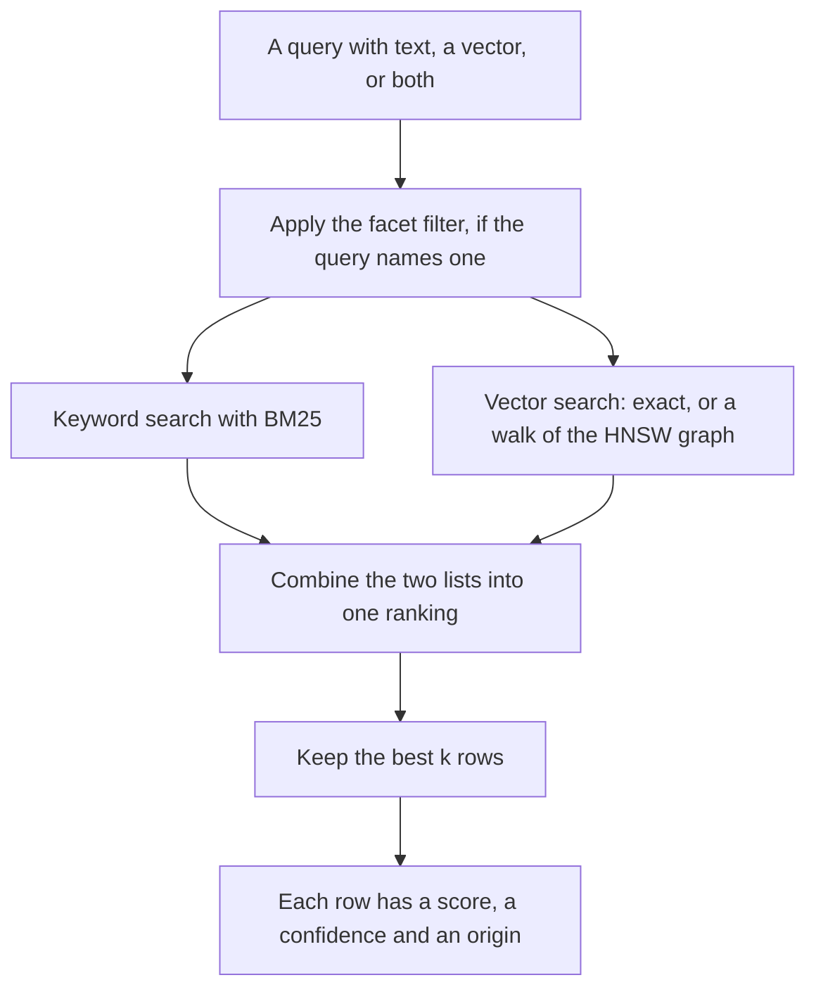
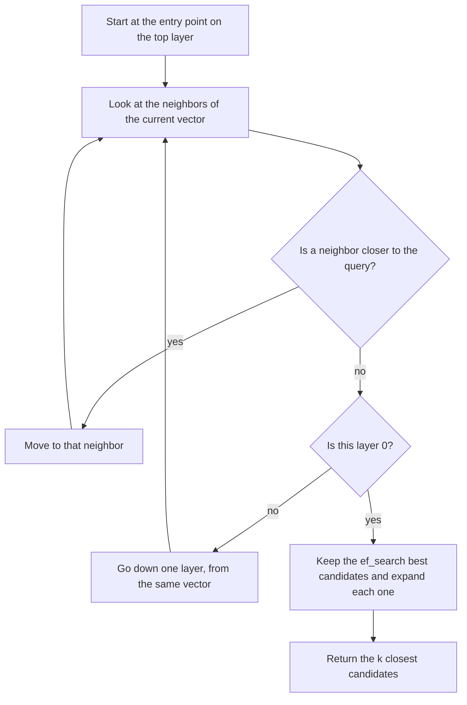
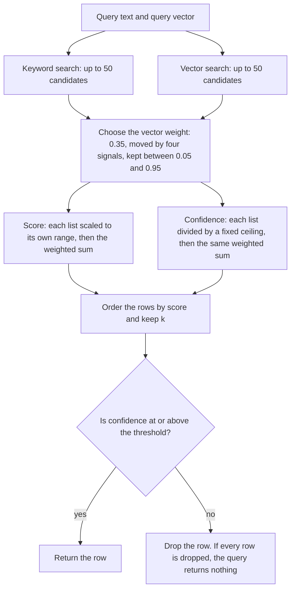

# How the retrieval engine works

inillucent has two engines in one file. This page is about the **retrieval engine**: vector search
with an HNSW index, keyword search with BM25, and the `inillucent_search` table that combines them.
It also covers how a search computes a confidence for each row, and how a query uses that
confidence to return nothing when nothing is good enough.

You need to know SQL. You do not need to know anything about vector search. The other engine, the
SQL engine, is described in [Relational architecture](relational-architecture.md), and
[Architecture overview](architecture-overview.md) shows how the two fit together. For the SQL you
write day to day, read [Vector search](vector-search.md).

## Terms used on this page

The storage and SQL words, such as page, B-tree and write ahead log, are in
[the glossary](glossary.md).

| Term | What it means |
|---|---|
| **Embedding** | A list of numbers that stands for the meaning of a piece of text. A trained model produces it. Two texts about the same topic get similar lists, even when they share no words. |
| **Vector** | The list of numbers itself. In SQL it is a `VECTOR(N)` value or the `vector` column of an `inillucent_search` table. An embedding is one kind of vector. |
| **Dimension** | One position in a vector. A 768 dimension vector is a list of 768 numbers. |
| **Cosine similarity** | How alike two vectors are by direction. 1 means the same direction. 0 means unrelated. |
| **Cosine distance** | 1 minus the cosine similarity. A smaller distance means more alike. |
| **Nearest neighbor search** | Given a query vector, find the stored vectors with the smallest distance to it. |
| **Exact search** | Nearest neighbor search that compares the query with every stored vector. The answer is always correct. The cost grows with the number of rows. |
| **HNSW** | Hierarchical Navigable Small World. A graph that links each vector to a few nearby vectors, so a search can walk toward the answer and compare only a small part of the data. The answer can miss a true neighbor. |
| **`ef_search`** | How many candidates an HNSW walk keeps at once. A larger value finds more of the true neighbors and takes longer. |
| **Recall** | The share of the true nearest neighbors that a search returned. If exact search says the best ten rows are A to J and a search returned eight of them, its recall is 0.8. |
| **BM25** | A formula that scores how well a text matches the words of a query. Rare words count for more than common words. |
| **Stemming** | Reducing a word to its root, so `deploying` and `deployed` both become `deploy` and match each other. |
| **Stopword** | A word so common that it is left out of the index, such as `the` or `and`. |
| **Hybrid ranking** | Combining the vector result list and the keyword result list into one ordered list. |
| **Confidence** | A number from 0 to 1 that each result row gets. It says how well the row matches the query on a fixed scale that is the same for every query. |
| **Abstention** | Returning no rows because no row is good enough. A query abstains by keeping only rows whose confidence reaches a threshold. |
| **Facet** | A column of an `inillucent_search` table that a search can filter on. Its value is stored, but it is not indexed as text. |

## 1. What the retrieval engine does

Keyword search matches words. A page that says "shipping a new version" does not match the query
"release process", because the two share no words. Vector search matches meaning, so it finds that
page. Vector search is weak at exact strings: a query for the ticket key `PROJ-1932` should find that
ticket and not tickets that are about similar things. Keyword search finds it.

The retrieval engine runs both kinds of search and combines the two result lists. Here is one query
that does all of it, run with the release build of inillucent 1.0.29:

```sql
CREATE VIRTUAL TABLE notes USING inillucent_search(body, dims = 3);

INSERT INTO notes(rowid, body, vector) VALUES
  (1, 'how to ship a new release of the app',   '[0.9, 0.1, 0.0]'),
  (2, 'the cafeteria menu for friday',          '[0.0, 0.2, 0.9]'),
  (3, 'release checklist: tag, build, publish', '[0.8, 0.3, 0.1]');

SELECT rowid, body, score(notes) AS score, confidence(notes) AS confidence, origin(notes) AS origin
FROM   notes
WHERE  notes MATCH 'release process' AND vector = '[0.85, 0.2, 0.05]' AND k = 3
ORDER  BY rank;
```

```text
rowid  body                                    score               confidence            origin
-----  --------------------------------------  ------------------  --------------------  ------
1      how to ship a new release of the app    1.0                 0.5928666591644287    both
3      release checklist: tag, build, publish  0.3350878357887268  0.5645571947097778    both
2      the cafeteria menu for friday           0.0                 0.030927207320928574  vector
```

Real embeddings have hundreds of dimensions. Three dimensions keep the example short.

- `notes MATCH 'release process'` runs the keyword search. `vector = ...` runs the vector search. A
  query can name either one or both.
- `k` is how many rows the search returns. It defaults to 10.
- `score(notes)` orders the rows. `ORDER BY rank` sorts by the same number, because `rank` is the
  score negated, so the best row sorts first.
- `confidence(notes)` is the number a query compares with a threshold. Section 8 explains it.
- `origin(notes)` says which search found the row: `vector`, `lexical` or `both`.

The code lives in three crates:

| Crate | What it holds |
|---|---|
| `inillucent-core` | The retrieval engine: the HNSW graph, exact search, the BM25 index, the tokenizer, the ranking and the confidence |
| `inillucent-search` | The `inillucent_search` table: its options, its storage in the database file, and how a SQL query reaches `inillucent-core` |
| `inillucent-ext` | The virtual table interface that `inillucent_search` plugs into, and the shadow tables it stores its data in |

`CREATE INDEX ... USING inillucent_hnsw (v)` on a `VECTOR(N)` column builds an `inillucent_search`
table with a vector width and no text. Everything on this page about the vector side applies to that
index too.

## 2. How a search runs



The keyword search and the vector search can run at the same time on two threads. Each one returns
up to 50 candidates, or `k` candidates when `k` is larger than 50. Both obey the same filter.

## 3. Vector search with HNSW

### Exact search is the default for a search table

An `inillucent_search` table is created with `mode = 'exact'` unless the `CREATE` statement says
otherwise. Exact search compares the query with every stored vector and keeps the closest ones. The
answer is correct by construction. On a large table it is the slower choice.

`mode = 'approximate'` makes the table use its HNSW graph. The graph is built in both modes.

An index made with `CREATE INDEX ... USING inillucent_hnsw` is stored as an `inillucent_search`
table, but it is created with `mode = 'approximate'` unless the statement says
`WITH (mode = 'exact')`. An index created by inillucent 1.0.29 or earlier recorded `exact` and keeps
it.

```sql
CREATE VIRTUAL TABLE docs USING inillucent_search(
    body,
    dims = 768,
    mode = 'approximate',
    m = 16,
    ef_construction = 64,
    ef_search = 128
);
```

### How the walk works

HNSW links every vector to a few vectors that are near it. It builds several layers. The top layer
has few vectors and long links. Layer 0 has every vector and short links. A search starts at the top
and walks down:



The upper layers cover distance quickly. Layer 0 gives precision. The walk compares the query with a
few hundred or a few thousand vectors, not every vector in the table.

### The settings

| Setting | Default | What it does |
|---|---|---|
| `m` | 16 | How many links a vector keeps on each layer above layer 0. Layer 0 keeps `2 * m`, so 32. |
| `ef_construction` | 64 | How many candidates the build considers when it links a new vector. Larger builds a better graph more slowly. |
| `ef_search` | 64 | How many candidates a search keeps. Set it in the `CREATE` statement. There is no session setting for it. |
| `metric` | `cosine` | The distance the graph is built for. `l2` is the other choice. Any other name is refused. |
| `mode` | `exact` for a search table, `approximate` for an `inillucent_hnsw` index | `exact` compares every row. `approximate` walks the graph. |

The build uses every processor core. With `metric = 'cosine'`, each vector is scaled to length 1 as
it is stored, so cosine similarity and the dot product give the same order.

### Trading recall for time

The score card run of 20 September 2026 (commit `cd53317`, 185,078 chunks at 768 dimensions)
measured `ef_search` against exact search, with no filter:

| `ef_search` | recall of the best 10 | median time per vector search |
|---|---|---|
| 64 | 0.8775 | 0.6076 ms |
| 128 | 0.9525 | 1.077 ms |
| 256 | 0.9575 | 1.938 ms |
| 512 | 0.9875 | 3.273 ms |

The same run built a graph with 4 layers and 6,116,033 links in 16.8 seconds.

A query can also ask for a recall target with the `recall` column:

```sql
SELECT rowid FROM docs WHERE vector = ?1 AND k = 10 AND recall = 0.9 ORDER BY rank;
```

The engine turns the target into a wider walk. The width is `k / (1 - recall)`, never less than `k`
and never more than 64 times `k`. So `k = 10` and `recall = 0.9` walk with a width of 100.
`recall = 1` makes the search exact. The target is a setting for how wide the walk is. The engine
does not measure the recall it reached. On an exact table `recall` changes nothing.

## 4. Filters are applied during the walk

A search table can declare facet columns. A facet constraint in the `WHERE` clause is applied inside
the search:

```sql
CREATE VIRTUAL TABLE docs USING inillucent_search(body, source FACET, dims = 768);

SELECT rowid, body
FROM   docs
WHERE  docs MATCH 'release process' AND vector = ?1 AND k = 10 AND source = 'chat'
ORDER  BY rank;
```

A graph walk visits a small part of the table, and it cannot know in advance where the rows that
pass the filter are. The engine follows two rules:

- The walk may step through any vector, whether or not its row passes the filter. A row that fails
  the filter can be the path to a row that passes.
- Only rows that pass the filter are kept as results.

The walk stops when it has collected enough rows that pass. A narrow filter makes the walk longer. It
does not make the result shorter. A walk has a limit of `ef_search` times 64 visits, and never fewer
than 4,096, so a filter that almost nothing passes cannot walk the whole graph.

### When the engine skips the graph

When a filter passes few rows, exact search over those rows is cheaper than a walk. The engine counts
the rows that pass and chooses exact search when:

```text
rows that pass  <  square root of (ef_search × 2 × m × rows in the table)
```

A filter that passes 1,000 rows or fewer always uses exact search. The formula moves when the table
grows or when `ef_search` changes. For example, with `ef_search` 64, `m` 16 and 185,078 rows, the
limit is about 19,500 rows.

In the score card run of 20 September 2026, the engine returned every row each filter allowed, for
every source. Recall of the best 10 inside the filter was 1.000 for jira, 1.000 for github and 1.000
for slack. The configured pgvector baseline reached 0.3280, 0.3320 and 0.6120.
[Retrieval quality](retrieval-quality.md) has every source and the latency.

A `WHERE` condition on a column that is not a facet runs after the search has chosen its rows. That
can return fewer than `k` rows. [Vector search](vector-search.md) has the rules for facets and for
filters on a `VECTOR(N)` column.

## 5. Keyword search with BM25

### Preparing the text

The tokenizer is named `porter` in the table's configuration. It lowercases the text, splits it into
words, drops English stopwords, and reduces each word to its root with the Snowball English stemmer.
The stopword list is PostgreSQL's English list. The result goes into an inverted index: a table from
each root to the rows that contain it.

```text
releas   -> row 1, row 3
checklist -> row 3
menu     -> row 2
```

A query goes through the same steps, so `releasing` in a query finds `release` in a row.

The tokenizer also keeps identifiers whole. A word with a letter and a digit, more than one
separator, or an underscore is kept as one term and also split into its parts. `PROJ-1932`,
`author_id` and `v1.5.2` are kept this way. Plain English with one hyphen, such as `well-known`, is
not. An email address is kept whole and is not stemmed.

### Scoring

A row scores for any query word it contains. It does not need every word. BM25 gives each row a
score from three ideas:

1. **A rare word counts for more than a common word.** The weight of a word is
   `ln(1 + (N - n + 0.5) / (n + 0.5))`, where N is the number of rows and n is the number of rows that
   contain the word.
2. **Repeating a word helps less each time.** The constant `k1` is 1.2.
3. **Long rows do not win because they are long.** The constant `b` is 0.75.

inillucent then adjusts the BM25 score in three ways. Each one was measured on the graded corpus
before it was turned on:

| Setting | Default | What it does |
|---|---|---|
| coverage | 3.0 | Multiplies the score by the share of the query's word weight that the row holds, raised to this power. A row with five words of a six word question ranks above a row with one. |
| proximity | 1.0 | Raises the score of a row where the matched words sit close together. |
| phrase | 0.75 | Raises the score of a row where the matched words appear in the query's order. |
| prefix matching | off | Lets a query word match longer words that start with it. |
| tiers | off | Ranks by how many query words a row holds first, and by score second. |

These are settings of the `inillucent-core` library. An `inillucent_search` table uses the defaults
and has no option to change them.

## 6. Combining the two lists

The vector list and the keyword list use different scales. A cosine similarity of 0.83 and a BM25
score of 14.2 cannot be added. So the engine scales each list before it adds them:

1. **Scale each list to its own range.** The best row in the list becomes 1 and the worst becomes 0.
   The vector list is scaled by cosine similarity. The keyword list is scaled by BM25 score.
2. **Choose the weight for this query.** The vector list starts with a weight of 0.35. The keyword
   list gets the rest, 0.65.
3. **Add.** `score = weight × vector part + (1 - weight) × keyword part`. A row found by only one
   search gets 0 for the other part. A row both searches found usually beats a row only one found.

### How the weight moves

The weight moves for each query, based on four signals the search has already computed. Each signal
moves the weight by 0.10 times its value:

| Signal | Effect on the vector weight |
|---|---|
| Share of query words that look like identifiers | Lowers it, because only keyword search matches an identifier exactly |
| Share of query words that no row contains | Raises it, because keyword search cannot find anything through them |
| Share of the query's word weight that the best keyword row holds | Lowers it, because a row that holds the whole question needs no help |
| How far the best vector row stands above the rest of its list, minus the same for the keyword list | Raises it when the vector list has a clear leader |

The weight always stays between 0.05 and 0.95, so neither search is ever ignored.

### Why this method

The library also has reciprocal rank fusion, which ignores the scores and adds `1 / (60 + position)`
from each list. The score card run of 20 September 2026 compared the two on queries that use a
document's title. Scaling each list to its range reached 0.9819 nDCG at 10. Reciprocal rank fusion
reached 0.9172. The scaled sum is the method `inillucent_search` uses.

The library also limits a result to two chunks from one document, so one long document cannot fill
the list. In an `inillucent_search` table each row is its own document, so the limit has no effect
there.

## 7. Confidence

The score has a problem as a measure of quality. Step 1 above makes the best row in every list worth
1, whether the list is good or useless. A query that nothing in the table answers still gets a top
row with a high score. So the score says where a row stood among the candidates. It does not say how
well the row matched.

Every row therefore gets a second number, its **confidence**. It uses the same weight as the score.
Each part is divided by a fixed ceiling that does not depend on the results:

- **The vector part** is the cosine similarity. Its ceiling is 1. A negative similarity counts as 0.
- **The keyword part** is the BM25 score divided by the highest BM25 score this query could reach.
  That ceiling is the sum, over the query words that appear in the index, of each word's weight times
  2.2 (which is `k1 + 1`). The engine computes it from the query alone. A query with no word in the
  index has a ceiling of 0, and its keyword part is 0.

```text
confidence = weight × vector part + (1 - weight) × keyword part
```

The confidence is always between 0 and 1. The same number means the same thing for every query, so
one threshold works for all of them.

A search that runs only one branch gets 0 from the other branch. Its confidence stays at or below
that branch's weight. A query with only a vector, for example, has no query words, so its weight
stays at 0.35 and its confidence is at most 0.35. Set a threshold for the kind of query you run.

On a cosine table, pass a query vector of length 1. The stored vectors are scaled to length 1, and
the query vector is used as given. A query vector of length 0.5 halves the vector part of the
confidence. The order of the rows does not change. `nomic-embed-text-v1.5` returns vectors of length
1, so `embed()` output needs no change.

## 8. Abstention: returning nothing

A query abstains by keeping only the rows whose confidence reaches a threshold:

```sql
SELECT rowid, body, confidence(notes) AS confidence
FROM   notes
WHERE  notes MATCH 'quarterly tax filing' AND vector = '[0.1, 0.9, 0.1]' AND k = 3
  AND  confidence(notes) >= 0.35
ORDER  BY rank;
```

```text
rowid  body  confidence
-----  ----  ----------
```

Without the last condition, this query returns all three rows of the table from section 1. The best
of them has a confidence of 0.2056. With the condition, it returns nothing. The query from section 1
keeps rows 1 and 3 under the same condition, with confidences of 0.5929 and 0.5646.



The engine has no built in threshold. The query sets it. A good threshold depends on the embedding
model and on the data, so measure it on your own data. The score card does it this way: run
questions that have an answer, take the confidence of the top row of each, and use the fifth
percentile as the threshold. On the score card corpus that threshold was 0.3474.

The score card run of 20 September 2026 then asked 200 questions that nothing in the corpus answers.
inillucent returned a top row above its threshold for 0.0050 of them, which is one question. pgvector,
in both configurations, did so for 1.000 of them, which is all 200.
[Retrieval quality](retrieval-quality.md) has the full comparison.

## 9. Using less memory

These settings belong to the `inillucent-core` library. An `inillucent_search` table stores full
precision vectors and does not use them.

A vector of 768 numbers at 4 bytes each takes 3,072 bytes. The library can also store each number in
1 byte. It walks the graph with the 1 byte form, takes three times as many candidates as it needs,
and then compares those candidates again with the full precision vectors.

The library can also shorten a vector and keep only its first numbers, because the embedding model
`nomic-embed-text-v1.5` was trained so that the start of a vector is a usable vector. The score card
run measured both on a sample of 25,000 chunks, against exact search with full precision vectors:

| Configuration | Bytes per vector | Recall of the best 10 |
|---|---|---|
| 768 numbers, 4 bytes each | 3,072 | 0.9300 |
| 768 numbers, 1 byte each | 772 | 0.9450 |
| 512 numbers, 1 byte each | 516 | 0.6900 |
| 256 numbers, 1 byte each | 260 | 0.5500 |
| 64 numbers, 1 byte each | 68 | 0.3100 |

Storing 1 byte per number kept recall and used a quarter of the memory. Shortening the vector lost
recall at every length measured.

By default the library reads the full precision vectors from the index file as it needs them.
[Where the vectors live](vector-residency.md) compares that with holding them in memory.

## 10. Where the embeddings come from

The retrieval engine stores vectors and searches them. It does not train a model. In a build that
includes the model, the `embed()` SQL function runs `nomic-embed-text-v1.5` inside the same process.
The model was trained with a label in front of each text. `embed()` embeds the text exactly as
given, so write the label yourself: `embed('search_document: ' || body)` for stored text and
`embed('search_query: ' || ?1)` for a query. The library's `embed_documents` and `embed_query` add
the labels for you. [Embeddings](embeddings.md) covers the model files, the runtime, and how to
check that stored vectors match their text.

## 11. Saving and reopening

### Inside a database

An `inillucent_search` table keeps all of its data in five shadow tables in the `.rdb` file:

| Shadow table | What it holds |
|---|---|
| `<name>_config` | The table's definition: columns, `dims`, `metric`, `mode`, the tokenizer, the format number and the release that wrote it |
| `<name>_content` | Every row: its text columns and its vector. The index can be rebuilt from this table alone |
| `<name>_delta` | The changes since the last stored segment, one row per change |
| `<name>_gen` | The stored segments: the built graph and keyword index, cut into rows |
| `<name>_state` | Which segments are current, how far they reach, and the live row count |

These are ordinary rows, so an `INSERT` into the search table commits and rolls back with the rest of
the transaction. A commit that finds 1,024 or more pending changes builds a new segment from those
changes alone. A query combines the live segments and the pending changes into one index before it
searches, so every BM25 score uses word counts from the whole table. The combined index is cached
until the data changes. `INSERT INTO docs(docs) VALUES('compact')` rebuilds everything as one
segment.

The `format` row in `<name>_config` is 1 for a table with no facet column and 2 for a table with a
facet column. A build that meets a format it cannot read refuses that table on every read and every
write, with the status `unsupported`. The message names the format and the release that wrote it.
The command line exits with code 3. The rest of the database still opens, so the table can be
dropped. The test `crates/inillucent-compat/tests/nightly/release_format_history.rs` runs every published
release against a table written by the current build, and checks that each one gives the same
answers.

### The library's index directory

The `inillucent-core` library can also save an index to a directory. Each save writes a new
numbered folder with five files: `store.bin` (the text and attributes), `vectors.bin` (the vectors),
`config.bin` (the settings), `graph.bin` (the HNSW links) and `lexical.bin` (the keyword index).
A file called `current` names the newest folder, and it is replaced last, so a crash during a save
leaves the previous folder in use. Each file starts with a marker and a format number, and a file in
a format the build does not know is refused. The 1 byte vectors are not saved. They are computed
again from `vectors.bin` when the index opens.

On the score card corpus of 185,078 chunks, the full precision vectors take 568.6 MB and the 1 byte
form takes 142.9 MB. [Retrieval quality](retrieval-quality.md) reports the index at 952 MB on disk,
and a saved index opening in 0.8 seconds.

## 12. How the numbers are measured

Every measurement on this page comes from `inillucent-scorecard.md` in the repository root, the
output of the run of 20 September 2026 at commit `cd53317`. The program `inillucent-bench` builds the
index and runs the same queries against inillucent and against PostgreSQL with pgvector. Both
engines read the same vectors, so the embedding model does not affect the comparison.

The correct answers need no person to judge them:

- **Exact search** gives the correct answer for vector search.
- **Direct database queries** give the rows a filter should allow and the rows that contain a word.
- **Document titles** give the correct answer for the whole pipeline. A document's title is the
  query, and any chunk of that document counts as correct.

[Retrieval quality](retrieval-quality.md) explains the baseline's settings, the statistics behind
each verdict, and every family of queries.

## Where to go next

- [Vector search](vector-search.md): the SQL for vector columns, HNSW indexes, facets and hybrid
  search
- [Retrieval quality](retrieval-quality.md): the graded comparison with pgvector
- [Embeddings](embeddings.md): where the vectors come from
- [Where the vectors live](vector-residency.md): vectors in memory or read from the file
- [Relational architecture](relational-architecture.md): the SQL engine
