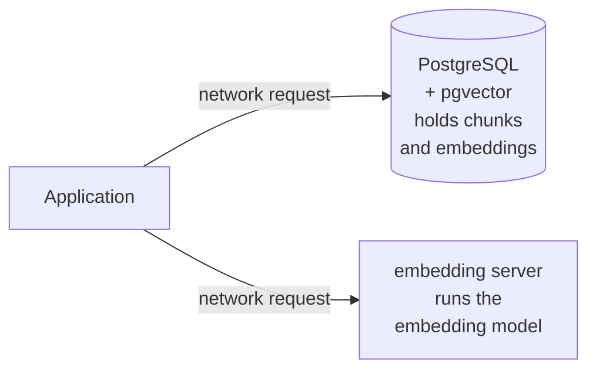
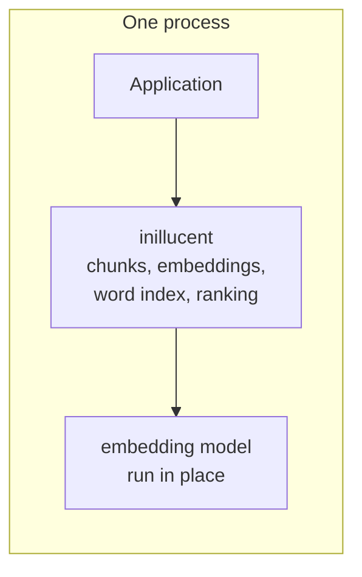
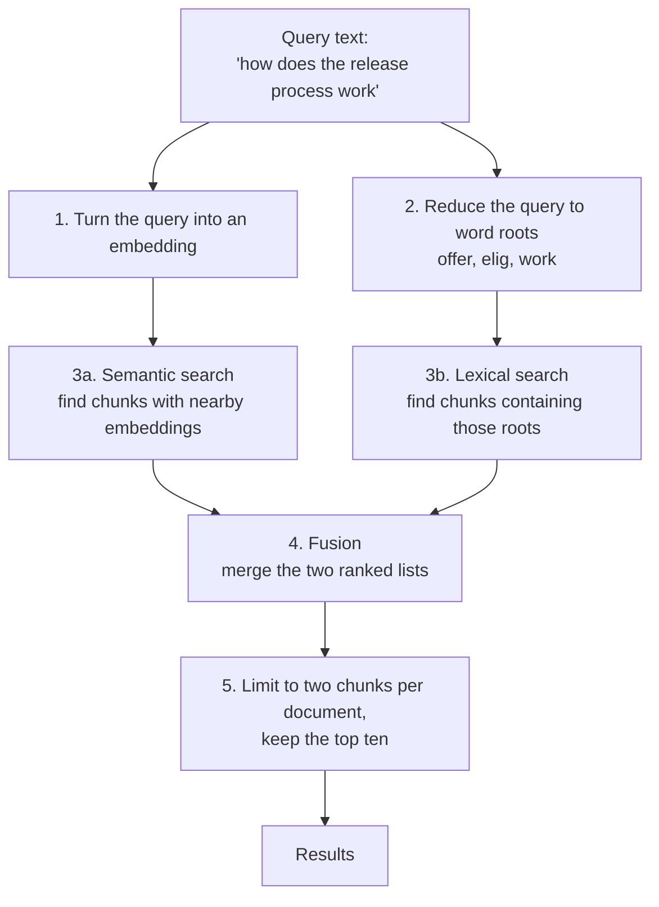
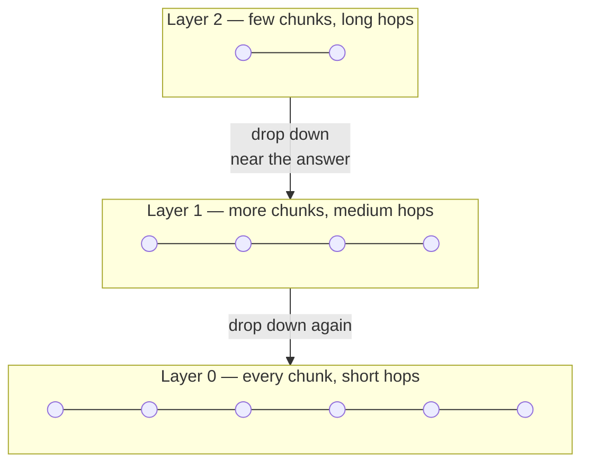
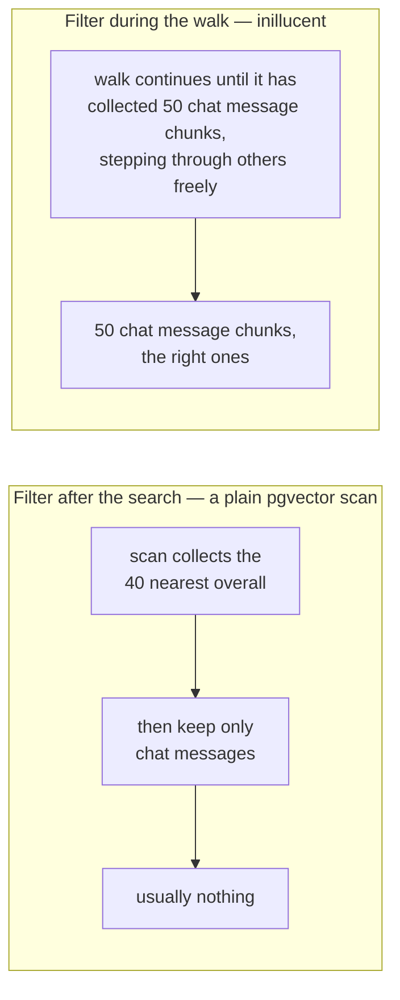

# How the retrieval engine works

This explains the retrieval engine from the beginning, assuming no background in databases or in
machine learning. Read it top to bottom; each section only uses ideas the earlier ones introduced.

inillucent has two engines. This page is the **retrieval** one: semantic search, keyword search,
filters, and the ranking that combines them. The **relational** engine — SQLite's SQL on B+trees, a
page pool, a redo log, snapshot isolation and a vectorised executor — is a separate subject, and
[Relational architecture](relational-architecture.md) is its page, with
[SQL support](sql.md) and [Performance](performance.md) beside it.
[Vector search](vector-search.md) is where the two meet: a `VECTOR(N)` column and an HNSW index
reachable from ordinary SQL.

## 1. The problem it solves

An organisation writes things down in six places: wiki pages, chat messages, issue threads, source files, design files and boards. Someone asks "how does the release process work?" and the answer is in there somewhere, in a page nobody remembers the title of.

Ordinary search matches words. If the page says "shipping a new version" and you searched for "release process", word matching finds nothing, because the two share no words. inillucent is built to find that page anyway, and to also find pages that do share the exact words, because both kinds of matching are useful and they fail in different situations.

## 2. Words to know

Every term in this table appears later in the document. Nothing else is assumed.

| Term | What it means |
|---|---|
| **Corpus** | The whole body of text being searched. Here: 186,781 pieces of text drawn from 39,366 documents, assembled from public sources by this repository so every measurement can be reproduced. |
| **Document** | One page, message, issue or file, as the source system sees it. |
| **Chunk** | A document cut into a searchable piece, roughly a paragraph or a section. Long pages become many chunks so a search can point at the relevant part rather than the whole page. Chunks are what searches actually return. |
| **Embedding** (also **vector**) | A list of 768 numbers that stands for the meaning of a chunk. Produced by a trained model. The useful property: two chunks about similar topics get similar lists of numbers, even when they share no words. |
| **Dimension** | One position in that list of 768 numbers. "768 dimensional" just means the list is 768 long. |
| **Embedding model** | The trained program that turns text into an embedding. inillucent uses `nomic-embed-text-v1.5`. inillucent does not train it, and does not modify it. |
| **Cosine similarity** | A way of measuring how alike two embeddings are, giving 1.0 for identical direction and 0.0 for unrelated. It compares direction only and ignores overall size, which is what you want when comparing meanings. |
| **Cosine distance** | `1 minus cosine similarity`. Small means alike. Used because searching means finding the *smallest* distance. |
| **Semantic search** | Finding chunks whose embedding is near the query's embedding. This is the kind that matches meaning rather than words. |
| **Lexical search** | Finding chunks that contain the query's actual words. This is the kind that matches words rather than meaning. |
| **Nearest neighbour search** | Given a query embedding, find the chunks whose embeddings are closest to it. This is the core operation of semantic search. |
| **Exhaustive search** | Compare the query against every single chunk. Always gives the exactly correct answer. Slow when there are many chunks. |
| **Approximate nearest neighbour search** | Compare the query against a clever subset instead of everything. Much faster, occasionally misses a correct answer. |
| **Recall** | The fraction of the genuinely correct answers that a search actually returned. If exhaustive search says the ten best chunks are A through J, and an approximate search returns eight of them, its recall is 0.8. This is how approximation quality is measured. |
| **HNSW** | Hierarchical Navigable Small World, the specific method inillucent uses for approximate nearest neighbour search. Section 5 explains it. |
| **Inverted index** | A lookup table from each word to the list of chunks containing it. The thing that makes lexical search fast. |
| **BM25** | A formula for scoring how well a chunk matches a set of query words. Section 6 explains it. |
| **Stemming** | Reducing words to a common root so that `deployment`, `deploying` and `deployed` all become `deploy` and therefore match each other. |
| **Stopword** | A word so common it carries no signal, such as `the`, `of`, `and`. Dropped before indexing. |
| **Filter** | A restriction on which chunks a search may return, for example "only chat messages" or "only updated since June". |
| **Predicate** | Another word for the condition inside a filter. "Source equals chat messages" is a predicate. |
| **Selectivity** | How much a filter lets through. "Only chat messages" allows 17,641 of 186,781 chunks, so it is fairly selective. |
| **Fusion** | Combining the semantic result list and the lexical result list into one ranked list. |
| **Quantisation** | Storing each number less precisely to use less memory. Section 8 explains it. |
| **pgvector** | An add on for the PostgreSQL database that gives it the ability to store embeddings and search them. PostgreSQL with pgvector is the alternative inillucent is measured against. |
| **PostgreSQL** | A general purpose database. Combined with pgvector it is the usual way to hold chunks and their embeddings, and it is the baseline here. |
| **Embedding server** | A separate program that runs the embedding model and answers requests over a network connection. `llama.cpp` serving the model over HTTP is the usual arrangement, and it is what the baseline here uses. inillucent runs the model inside its own process instead. |

## 3. What this replaces

The usual way to build this needs two separate programs running alongside the application. PostgreSQL with pgvector holds the chunks and their embeddings, and `llama.cpp` serves the embedding model over HTTP:



inillucent is a library, meaning code that runs inside the application rather than as its own program. There is no separate process, no network connection, and no port to configure:



Both arrangements use the same embedding model, so nothing about the meaning of the embeddings differs. What differs is where the work happens, and how a filter is applied. Section 7 covers the filter, which is the difference that changes results rather than only latency.

## 4. How the parts fit together

A search runs through five stages.



Both kinds of search run against the same chunks, and both obey the same filter. Stage 4 exists because the two kinds of search fail in different situations, so combining them is more reliable than either one alone.

The code is organised to match:

| File | Responsibility |
|---|---|
| `store.rs` | The chunks, the documents, and the attributes filters test against |
| `vectors.rs` | The embeddings, held as one long continuous block of numbers |
| `distance.rs` | Measuring how alike two embeddings are |
| `flat.rs` | Exhaustive search, the exactly correct answer |
| `hnsw.rs` | Approximate search, the fast answer |
| `quantize.rs` | Storing embeddings in less memory |
| `tokenize.rs` | Turning text into word roots |
| `bm25.rs` | The word index and its scoring |
| `rank.rs` | Fusion, and the limit of two chunks per document |
| `filter.rs` | Turning a filter into something cheap to test |
| `index.rs` | The public entry point that ties the above together |
| `embed.rs`, `embed_onnx.rs` | Running the embedding model |
| `persist.rs` | Saving an index to disk and opening it again |

## 5. Semantic search, and the idea that makes it fast

### The slow correct way

You have 186,829 embeddings. A query arrives as an embedding. Compare it against all of them, keep the ten closest. This is exhaustive search. It is exactly correct, and on this corpus it takes a few milliseconds.

inillucent keeps exhaustive search as a real feature rather than only a test, for two reasons. It defines the correct answer that every faster method is graded against. And when a filter is narrow enough, it is genuinely the faster choice, as section 7 explains.

### The fast approximate way

At larger sizes, comparing against everything stops being reasonable. HNSW instead builds a network of connections between chunks, where each chunk is linked to a handful of others that are near it.

Searching then means walking the network. Start anywhere, look at the current chunk's neighbours, step to whichever is closer to the query, and repeat until no neighbour is an improvement. You reach a good answer having examined a few hundred chunks rather than all 186,829.

Walking a single flat network can get stuck in a distant corner, so HNSW stacks several layers. Upper layers have few chunks and long connections, useful for covering ground quickly. Lower layers have every chunk and short connections, useful for precision. A search descends from the top:



On this corpus the network came out with 4 layers and 6,177,312 connections.

**`ef_search`** is the one setting a caller adjusts. It controls how many candidates the walk keeps in mind at once. Larger means more of the network examined, so better recall and more time. Measured on this corpus:

| `ef_search` | Recall (fraction of correct answers found) | Time per search |
|---|---|---|
| 64 | 0.850 | 0.43 ms |
| 128 | 0.907 | 0.65 ms |
| 256 | 0.938 | 1.17 ms |
| 512 | 0.973 | 2.10 ms |

## 6. Lexical search, and why BM25

Semantic search cannot reliably find an exact string. If you search for the issue key `PROJ-1932`, you do not want chunks about vaguely similar tickets, you want that ticket. Word matching handles this, so inillucent does both.

### Preparing the text

Each chunk's text is lowercased, split apart, stripped of stopwords, and reduced to word roots by stemming. The result goes into an inverted index, which is a table from each root to the chunks containing it:

```
elig    -> chunk 41, chunk 902, chunk 1755, ...
offer   -> chunk 7,  chunk 41,  chunk 88,   ...
redeem  -> chunk 88, chunk 1102, ...
```

A query is prepared identically, so `eligibility` in a query finds `eligible` in a chunk. inillucent deliberately uses the same stemming algorithm PostgreSQL uses, which was verified against the live database: both turn `eligibility` and `eligible` into `elig`, and `offers` and `offering` into `offer`. Matching PostgreSQL on this step is what makes the comparison of the *scoring* meaningful.

**One deliberate difference.** PostgreSQL breaks `PROJ-1932` into `proj` and `-1932`, so the issue identifier stops existing as a searchable term. This corpus is full of issue keys, function names and file paths, so inillucent additionally keeps the whole identifier as its own term when a word looks like a name rather than prose. `PROJ-1932`, `author_id`, `v1.5.2` and `src/search/vector` are kept whole as well as split apart. Ordinary hyphenated English such as `well-known` is not, because that would fill the table with terms nobody searches for. Measured effect: finding a rare identifier improved from 0.156 to 0.233. Measured cost: the term table grew from 179,234 entries to 411,698.

### Scoring with BM25

Once you know which chunks contain the query's words, you have to rank them. BM25 scores each chunk on three ideas:

1. **A rare word counts for more than a common word.** A chunk containing `tirzepatide` tells you much more than one containing `system`.
2. **Repetition helps, with diminishing returns.** A chunk mentioning `offer` ten times is more relevant than one mentioning it once, but not ten times more.
3. **Length is accounted for.** A long chunk naturally contains more words, so it should not outrank a short precise chunk merely by being long. This matters here because design file chunks average 2,222 characters while issue thread chunks average 509.

PostgreSQL full text search handles the first idea only. It ranks with `ts_rank_cd`, a coverage density score that does not account for how rare a term is across the corpus or for how long the chunk is. It also joins query terms with AND by default, through `to_tsquery`, so a chunk has to contain every word of the query. That is why long natural questions often return nothing there: requiring all of "how does the release process work" matches a tiny fraction of the chunks that contain `release` or `process`. Joining the terms with OR instead returns more rows, and that variant has not been measured. inillucent scores any matching word and relies on rare words counting for more to keep the results focused.

## 7. Filters, and why they are the hard part

Almost every real search is restricted. An AI application with a search tool per source filters by source on every call: one tool searches only chat messages, another only issue threads. So the filtered search is the common case, not a corner case.

### Why filtering is hard for a graph index

An approximate search works by walking a graph towards the query. The walk visits a small fraction of the corpus, which is what makes it fast, and that is also what makes a filter awkward: the walk cannot know in advance which regions of the graph hold chunks that pass the filter.

pgvector's plain scan resolves this by applying the filter *after* the search. It collects `hnsw.ef_search` candidates, 40 by default, and then discards the ones that do not qualify. When two sources hold three quarters of the chunks, the 40 chunks nearest to any query almost always belong to one of them, so narrowing those 40 to a minority source can leave nothing. Measured on the corpus this repository builds, asking for 50 results from the chat message source that way returned **0.68 results on average, at a recall of 0.060**.

pgvector's own answer to this is `hnsw.iterative_scan`, which keeps restarting the scan with a wider candidate list until enough rows pass the filter. It works: with it enabled, and with `hnsw.scan_mem_multiplier` raised so the scan does not exhaust its memory budget and stop early, a filtered search returns its full 50 rows. What it costs is time. Filling the result set that way took **45 milliseconds** against 1.6 for an unfiltered search, because the work is repeated rather than avoided.

### What inillucent does instead

The filter is applied *during* the walk, with two rules:

- **Any chunk may be walked through**, whether or not it passes the filter. A wiki page chunk can be a step on the route to a chat message chunk, and refusing to step through it cuts the network into disconnected pieces.
- **Only chunks that pass the filter are collected as results.**

Because the stopping condition counts collected results rather than chunks examined, a narrow filter naturally makes the walk continue further instead of returning a short list. The technique comes from a research paper called ACORN.



### Choosing between walking and checking everything

When a filter is narrow, walking the network stops being worthwhile: if only 11,160 chunks qualify, comparing the query against all 11,160 is both exactly correct and quick.

inillucent decides with a calculation rather than a fixed cutoff. Exhaustive search costs one comparison per qualifying chunk. A filtered walk has to examine roughly `ef_search divided by selectivity` chunks before it collects enough that qualify. Setting those two costs equal gives the crossover point:

```text
check everything when   qualifying chunks < square root of (ef_search × 32 × total chunks)
```

A fixed cutoff would be wrong for a corpus ten times this size, and wrong again whenever a caller raises `ef_search`. Both appear in the calculation, so the crossover moves with them. On this corpus at `ef_search` 128 it falls near 27,700 chunks, which sends four of the six sources down the exact path:

| Source | Qualifying chunks | Route chosen | Recall achieved |
|---|---|---|---|
| wiki pages | 93,617 | walk the network | 0.980 |
| source files | 47,533 | walk the network | 0.924 |
| chat messages | 17,675 | check everything | 1.000 |
| issue threads | 11,160 | check everything | 1.000 |
| design files | 9,149 | check everything | 1.000 |
| boards | 7,397 | check everything | 1.000 |

Counting the qualifying chunks therefore happens on every search, so it cannot be done by inspecting all 186,829 chunks. The store keeps a running count per source, and any filter that restricts at most the source reads its answer from that count directly.

## 8. Using less memory

An embedding of 768 numbers, each taking 4 bytes, is 3,072 bytes. Multiplied across 186,829 chunks that is 574 megabytes. Two independent methods reduce it.

**Quantisation** stores each number in 1 byte instead of 4, by recording the largest value in each embedding and expressing the rest as fractions of it. Some precision is lost. inillucent uses the compressed form for the walk and then rechecks the finalists against the full precision embeddings, which recovers the accuracy. Measured on this corpus: **no detectable accuracy loss at a quarter of the memory.**

**Truncation** keeps only the first part of each embedding. This model was trained so that a prefix of an embedding is itself a usable embedding. It is not free here:

| Configuration | Bytes per embedding | Recall against the exact answer |
|---|---|---|
| 768 numbers, 4 bytes each | 3,072 | 0.995 |
| 768 numbers, 1 byte each | 772 | 0.995 |
| 512 numbers, 1 byte each | 516 | 0.770 |
| 256 numbers, 1 byte each | 260 | 0.635 |
| 64 numbers, 1 byte each | 68 | 0.345 |

Reading down that table: compression to 1 byte costs nothing, and shortening the embedding costs a great deal. So inillucent compresses and does not shorten.

## 9. Fusion: combining the two result lists

Semantic search and lexical search each produce a ranked list of 50 chunks. They have to become one list of 10.

The scores cannot be added, because they are not the same kind of number: a cosine similarity of 0.83 and a BM25 score of 14.2 have no common scale. inillucent's default therefore ignores the scores and uses only the positions, giving each chunk `1 divided by (60 plus its position)` from each list and adding those. A chunk both methods rank highly beats a chunk only one of them found. This is called Reciprocal Rank Fusion, and the baseline is given the same method and the same constant, so the comparison measures retrieval rather than a change of ranking policy.

inillucent also implements a second method that rescales each list's scores onto a common range and takes a weighted sum, keeping the score magnitudes that the first method discards. Both are graded, and on this corpus they finish close together.

Finally, at most two chunks from any one document are kept, so a single long page cannot fill the results.

## 10. Where the embeddings come from

inillucent does not train an embedding model, and the model is not part of the engine. The engine takes embeddings and stores them. That is what lets both engines in the comparison be loaded with byte identical vectors, so a difference in scores can only come from indexing and ranking rather than from the embedding model.

In use inillucent runs `nomic-embed-text-v1.5` itself, in the same process, so no embedding server is needed. The model expects text to be labelled by purpose, so a stored chunk is prefixed with `search_document: ` and a query with `search_query: `, which is the labelling the model was trained with.

The model outputs one embedding per *word piece* rather than one per chunk, so inillucent averages them, ignoring padding, and then scales the result to a standard length.

**Whether running the model in the same process is a faithful replacement for a server was measured, not assumed.** 400 chunks were embedded both ways, by `llama.cpp` over HTTP and by inillucent in its own process, giving an average cosine similarity of **0.9860** with none below 0.95. The remaining difference is expected, because `llama.cpp` was serving the model quantized to Q5_K_M while inillucent runs it at full precision.

That measurement was taken when the engine was first graded, against the private corpus whose stored vectors `llama.cpp` had produced. It cannot be rerun from this repository, because the corpus here is embedded in process to begin with and there is no second embedder to disagree with. What this repository checks instead is that the vectors in its cache were produced from the text in its cache, by re-embedding a sample and comparing: agreement is 1.000000 at the minimum over 200 chunks, and the check fails below 0.9995.

These two measurements were taken when the engine was first built, against a corpus that is no longer distributed, because they need both embedders running over the same text and this repository no longer ships a server. They are reported as what they are: the measurement that justified dropping the server, not something this repository can re-run. What it can check is that the vectors in its embedding cache were produced from the text in that cache, which the `embed-check` subcommand does.

The number that decides whether the replacement is safe is not the similarity but the retrieval quality. Running 120 queries through the same index, once with each embedder's vectors:

| Measure | `llama.cpp` over HTTP | inillucent running the model |
|---|---|---|
| Correct answer ranked first | 0.8250 | **0.8250** |
| Correct answer in the top ten | 0.8917 | **0.8917** |
| Average rank quality | 0.8509 | 0.8487 |

Identical on the first two and within 0.002 on the third. The two disagree about which chunk to show first for 12% of queries, but they are equally often right, so the disagreement is reshuffling among equally good answers rather than a loss of quality.

## 11. Saving and reopening

An index is a directory of four files. Each begins with a marker and a format number, so a file written by a different version is refused rather than misread.

| File | Contents | Size on this corpus |
|---|---|---|
| `vectors.bin` | The embeddings, as raw numbers | 573.9 MB |
| `store.bin` | The chunk text and the document attributes | 217.3 MB |
| `graph.bin` | The network of connections | 27.9 MB |
| `config.bin` | The settings the index was built with | 223 bytes |

The word index and the compressed embeddings are not stored, because both can be recomputed exactly from the two files above, and recomputing them is cheaper than the disk they would occupy. The network of connections is stored, because rebuilding that takes three minutes.

Measured: saving takes 0.3 seconds, and reopening a saved index takes **5.3 seconds** against 175 seconds to rebuild from scratch.

## 12. How any of this is known to work

Every number in this document was measured by a test suite built alongside the engine, in a second program called `inillucent-bench`. It drives inillucent and PostgreSQL through one shared interface, so no measurement can accidentally be taken of only one of them.

Correct answers come from three sources, none of which requires a person to judge results:

- **Exhaustive search** defines the correct answer for semantic search, because it compares against everything and cannot be wrong.
- **Direct database queries** define which chunks a filter should allow and which chunks contain a given string.
- **Document identity** defines the correct answer end to end: take a document, use its own title as the query, and any chunk of that document counts as correct. People write titles to describe their own content, so titles behave like real queries. Titles shared by two documents are skipped, because then "correct" would be ambiguous.

### The baseline

Beating a badly configured PostgreSQL would prove nothing, so the baseline is a correctly configured one. It runs the same SQL shape against the same schema, builds its HNSW index with the same parameters, `m = 16` and `ef_construction = 64`, fuses its two result lists with the same Reciprocal Rank Fusion constant, and is loaded with byte identical vectors.

Its scan settings are these, each chosen from a measured sweep against an exhaustive comparison rather than by feel:

| setting | filtered search | unfiltered search | why this value |
|---|---|---|---|
| `hnsw.iterative_scan` | `relaxed_order` | `off` | Without it a filtered search returns almost nothing. Turning it on for an unfiltered search changes nothing worth having: recall at 50 was identical with it off and on at every `hnsw.ef_search` tried, and latency moved from 5.85 ms to 5.98 ms, because the only clause left excludes 298 chunks of 186,827. It is off there because it buys nothing, not because it costs much. |
| `hnsw.ef_search` | 400 | 100 | A scan cannot return more rows than it collected, so this has to be at least the number of rows requested. Raising it further raises recall inside a filter. |
| `hnsw.max_scan_tuples` | 40,000 | not applicable | Measured against 200,000, mean recall was 0.788 either way, so the larger value only costs latency. |
| `hnsw.scan_mem_multiplier` | 4 | not applicable | At the pgvector default of 1 the iterative scan exhausts its memory budget and stops early, returning as few as 30 rows of 50 and holding mean recall to 0.788. At 4 the short results stop and mean recall reaches 0.856. At 8 nothing changes. |
| ordering | `relaxed_order` rather than `strict_order` | not applicable | 0.856 against 0.727 mean recall at the same cost. Nothing downstream depends on the within scan ordering, because Reciprocal Rank Fusion recomputes the ranking. Those figures come from the private corpus this engine was first graded on, measured against a different database. They are the reason the setting has the value it has, not a result this repository reproduces. |

`hnsw.scan_mem_multiplier` is the one most easily missed. Missing it produces a baseline that looks tuned and is not, which is why the settings are written down here.

When the iterative scan is off, `hnsw.max_scan_tuples` and `hnsw.scan_mem_multiplier` are reset rather than left set, so an unfiltered query on the same connection cannot inherit a filtered query's scan budget.

A second PostgreSQL configuration is graded alongside it, running pgvector's extension defaults with no iterative scan. It is reported to show what the extension does before it is configured, and no comparison is scored against it.

**Which run these numbers come from.** The PostgreSQL figures on this page are from the first full
graded run, whose baseline had `hnsw.ef_search` at 100 on filtered searches rather than 400,
`hnsw.max_scan_tuples` at 200,000, iterative scan left on for unfiltered searches, and
`hnsw.scan_mem_multiplier` never set. Each of those makes the baseline weaker than the settings in
the table above, so the PostgreSQL figures quoted here understate a correctly configured one, most of
all on filtered recall.

**[Retrieval quality](retrieval-quality.md) carries the corrected run**, against the settings in that
table, and it is the page to read for any comparison against pgvector. This page keeps the earlier
figures because they are what the explanations above were written against, and the form of every
finding is unchanged. inillucent's own measurements — latency, memory, disk, the quantisation ladder,
the `ef_search` sweep and the correctness gates — do not depend on the baseline at all.

The engine has 118 tests of its own and the measurement program has 62. Nine of the engine's tests
cover the embedding model running in process, so they need the `onnx` feature;
`cargo test -p inillucent-core` alone runs the other 109. [Repository](repository.md) covers the rest
of the assurance program.

## Where to go next

- [Vector search](vector-search.md) — using this engine, from SQL and from the library
- [Retrieval quality](retrieval-quality.md) — the graded comparison against pgvector
- [Embeddings](embeddings.md) — where the vectors come from
- [Where the vectors live](vector-residency.md) — held in memory or read from the file
- [SQL support](sql.md) and [Performance](performance.md) — the other engine
