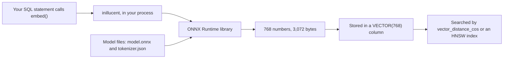

# Embeddings

An embedding is a list of numbers that stands for the meaning of a piece of text. Two texts with
similar meanings get lists that are close together. inillucent stores these lists in `VECTOR(N)`
columns and searches them, as [Vector search](vector-search.md) explains.

You can make the vectors anywhere and insert them. inillucent can also make them itself, inside your
own process, with the SQL function `embed(TEXT)`. There is no embedding server and no network call.
This page covers `embed(TEXT)`, how to install the model it runs, and how the model was measured.

## Terms used on this page

| Term | Meaning |
|---|---|
| embedding model | a program that turns text into a vector. inillucent runs `nomic-embed-text-v1.5` |
| weights | the model's learned numbers, stored in the file `model.onnx` (522 MB) |
| ONNX Runtime | a library from Microsoft that runs a model stored in the ONNX file format |
| session | the model loaded into memory by ONNX Runtime, ready to answer |
| residency | when the model is held in memory and when it is dropped |
| execution provider | the part of ONNX Runtime that runs the model on one kind of processor, such as a CUDA graphics card |
| cosine similarity | a score from minus one to one of how close two vectors point. 1.0 means the same direction |

Other terms are in [the glossary](glossary.md).

## Where the model runs



`embed(TEXT)` hands the text to ONNX Runtime. ONNX Runtime runs `nomic-embed-text-v1.5` from the
model files on disk. The result is a vector of 768 numbers, stored as 3,072 bytes. That is the format
a `VECTOR(768)` column holds, so the value can be inserted and searched with no conversion.

## Install the model

```sh
inillucent setup-embeddings all
```

`inillucent setup-embeddings all` downloads two things into a folder in your user profile:

- ONNX Runtime 1.22.0, the shared library that runs the model;
- the `nomic-embed-text-v1.5` weights and tokenizer, from Hugging Face.

The download is about 620 MB the first time. A later run finds the files and downloads nothing.
Every file is checked against a SHA-256 digest written into the inillucent source. A file with the
wrong digest is deleted, and the error names both digests. A download goes to a `.part` file that is
renamed only after its digest matches.

After `inillucent setup-embeddings all`, `embed(TEXT)` works with no environment variable set:

```sh
inillucent create notes.rdb
inillucent --db notes.rdb query "SELECT length(embed('hello')) AS bytes"
```

```
bytes
-----
3072
```

`inillucent setup-embeddings` with no component downloads nothing. It prints what is installed and
the command to install what is missing.

### The command and its flags

`inillucent help setup-embeddings` prints these. The same command is the MCP tool
`inillucent_setup_embeddings`, with the same parameters.

| Command or flag | What it does |
|---|---|
| `inillucent setup-embeddings all` | installs ONNX Runtime and the weights |
| `inillucent setup-embeddings runtime` | installs ONNX Runtime only |
| `inillucent setup-embeddings model` | installs the weights only |
| `inillucent setup-embeddings` | reports what is installed and downloads nothing |
| `--status` | reports what is installed, where, and the residency profile, and downloads nothing |
| `--residency <profile>` | records when the model is held in memory: `resident`, `on-demand`, `idle` or `idle:<time>` such as `idle:90s`. See [When the model is in memory](#when-the-model-is-in-memory) |
| `--gpu` | installs the ONNX Runtime build that has the CUDA execution provider. It exists for Windows and Linux on x86-64 only. See [Graphics cards](#graphics-cards) |
| `--force` | downloads and installs again even when the files are present and their digests match |
| `--onnxruntime-version <version>` | installs another ONNX Runtime version. A version with no digest in the source is installed and reported as unverified |
| `--dir <path>` | installs somewhere other than the folder in your user profile |
| `--output json` | prints the result as JSON |

### Where the files go

| Platform | Folder |
|---|---|
| Windows | `%LOCALAPPDATA%\inillucent` |
| macOS | `~/Library/Application Support/inillucent` |
| Linux | `$XDG_DATA_HOME/inillucent`, or `~/.local/share/inillucent` when `XDG_DATA_HOME` is not set |

Set `INILLUCENT_HOME` to use another folder for every command. Inside the folder:

```
runtime/onnxruntime-1.22.0/lib/    the ONNX Runtime shared library
models/nomic-embed-text-v1.5/      model.onnx, tokenizer.json, model.json, config.json and two tokenizer files
embeddings.json                    what is installed, and the residency profile
```

### Environment variables

| Variable | What it does |
|---|---|
| `INILLUCENT_HOME` | the install folder, in place of the one in your user profile |
| `INILLUCENT_ONNX_DIR` | a model folder to use first. inillucent uses the folder only when it holds the model asked for |
| `INILLUCENT_MODEL_ROOTS` | more folders to search for model folders, separated by `;` on Windows and `:` elsewhere |
| `ORT_DYLIB_PATH` | the ONNX Runtime library to load. When `ORT_DYLIB_PATH` is set, the installed runtime is ignored |
| `INILLUCENT_EMBED_RESIDENCY` | the residency profile for one process |

inillucent looks for the model folder in this order: `INILLUCENT_ONNX_DIR`, the install folder, the
folders in `INILLUCENT_MODEL_ROOTS`, then `~/.cache/inillucent-models`. A folder counts only when it
holds both the weights and the tokenizer.

### Why these versions

ONNX Runtime 1.22.0 is the version the measurements on this page were taken with. ONNX Runtime
1.22.0 is also the last release with one `universal2` archive for macOS that runs on both Intel and
Apple processors.

The weights are the full precision export, `onnx/model.onnx`. The Hugging Face repository has other
exports of the same model. The `model_int8.onnx` export gives query vectors with a cosine similarity
of 0.9727 to the full precision ones. That changes search results, so inillucent installs the full
precision file.

## The build needs the `embed` feature

`embed(TEXT)` is compiled in only when the command line is built with the `embed` feature. The
release archives are built with it: `packaging/release-all.ps1` and `packaging/release.ps1` pass
`--features inillucent-cli/embed`. The feature adds about 3.2 MB to the program. A machine with no
ONNX Runtime installed still runs every command that does not embed, because ONNX Runtime is loaded
only when `embed(TEXT)` is first called.

A build without the feature answers with the status `unsupported` and exit code 3:

```
Error [unsupported]: unsupported: embed(TEXT): this build has no embedding support compiled in
```

To check a build, run `inillucent functions`. A build with the feature lists `embed`. A build from a
checkout gets the feature with:

```sh
cargo build --release -p inillucent-cli --features inillucent-cli/embed
```

A Rust application turns it on through the `inillucent` crate:

```toml
[dependencies]
inillucent = { version = "1.0", features = ["embed"] }
```

The feature compiles `embed(TEXT)` into the engine. The model is not part of the build. It is
loaded when `embed(TEXT)` is first called, from the folder `inillucent setup-embeddings all`
installs it in. Release 1.0.29 and earlier have no `embed` feature on the `inillucent` crate. With
those, add `inillucent-engine = { version = "1.0.29", features = ["embed"] }` beside `inillucent`.
Cargo turns a feature on for every user of a crate in the build, so the engine that `inillucent`
uses gets it too.

## Using `embed(TEXT)` in SQL

`embed(TEXT)` can go anywhere an expression can go: a `SELECT` list, `WHERE`, `ORDER BY`, a `VALUES`
row, `UPDATE ... SET`, `RETURNING` and `INSERT ... SELECT`.

```sql
CREATE TABLE note (id INTEGER PRIMARY KEY, body TEXT, v VECTOR(768));

INSERT INTO note (body, v) VALUES (?1, embed('search_document: ' || ?1));

UPDATE note SET v = embed('search_document: ' || body) WHERE v IS NULL;

SELECT id, body FROM note
ORDER BY vector_distance_cos(v, embed('search_query: ' || ?1))
LIMIT 10;
```

It works the same way on an `inillucent_search` table, in the row you insert, in an
`INSERT ... SELECT` that fills the table from another one, and as the query vector of a search:

```sql
CREATE VIRTUAL TABLE note_search USING inillucent_search(body, dims = 768);

INSERT INTO note_search (rowid, body, vector)
SELECT id, body, embed('search_document: ' || body) FROM note;

SELECT rowid, body FROM note_search
WHERE note_search MATCH ?1 AND vector = embed('search_query: ' || ?1) AND k = 10
ORDER BY rank;
```

Release 1.0.29 refuses three of these with the status `unsupported`: `embed(TEXT)` in a `VALUES` row
of an `inillucent_search` or FTS5 table, an `INSERT ... SELECT` into either kind of table, and
`vector = embed(...)` in a search. With 1.0.29, run `SELECT embed(?1)` first and bind the bytes it
returns.

`nomic-embed-text-v1.5` was trained with a prefix on every text. Put `search_document: ` in front of
text you store and `search_query: ` in front of a question. `embed(TEXT)` embeds exactly the text it
is given, so the SQL adds the prefix.

`embed(NULL)` returns `NULL`.

### A question is embedded once for the whole statement

In the `ORDER BY` above, `embed('search_query: ' || ?1)` has the same argument for every row.
`embed(TEXT)` is registered as deterministic: the same text always gives the same vector. So
inillucent computes the value once and uses it for every row. SQLite applies
[the same rule](https://sqlite.org/deterministic.html) to deterministic functions.

| The argument reads | When the call runs |
|---|---|
| only literals | once, when the statement is compiled |
| a bound parameter such as `?1` | once each time the statement runs |
| a column | once for each row |

This matters for speed. Over the 2,661 passages in `examples/rag-agent/cli-example`, one search took 105.7
seconds when the question was embedded once per row, and 1.50 seconds when it was embedded once.

Once means once for each place the call is written. A query that writes the distance in the select
list and orders by its alias, `SELECT id, vector_distance_cos(v, embed(?1)) AS d FROM chunk ORDER
BY d`, embeds the question twice. Measured over the 3,696 chunks in `examples/rag-agent`, that took
77 ms against 44 ms for the same query written with the distance once, inside a derived table:

```sql
SELECT id, d
FROM (SELECT id, vector_distance_cos(v, embed('search_query: ' || ?1)) AS d FROM chunk)
ORDER BY d LIMIT 5;
```

A function you register yourself is computed once only if you set `FunctionFlags::deterministic`.
The default is `false`, because a function such as `random()` must run for every row.

### When the model is not installed

```
Error [invalid_state]: embed: no embedding model is installed. Run `inillucent setup-embeddings`
to download nomic-embed-text-v1.5 and the ONNX Runtime it needs, or set INILLUCENT_ONNX_DIR to a
directory that already holds them
```

The status is `invalid_state` and the exit code is 1. The SQL is correct and the feature is built.
The machine is missing the model, and `inillucent setup-embeddings all` fixes that.

When the weights are installed and ONNX Runtime is missing or will not load, `embed(TEXT)` fails with
a second message: `embed: an embedding model is installed but did not run`. That message names
`inillucent setup-embeddings runtime` as the usual fix. What ONNX Runtime said is kept in the
diagnostic detail, which a caller reads by opening the database with diagnostics on.

## When the model is in memory

Loading the model into memory takes 650 to 800 ms. After it is loaded, one embedding takes 12 to 36
ms. A loaded model holds about 1.9 GB of memory. The residency profile decides when to pay which
cost.

| Profile | First query after a pause | Next query straight after | Memory held between queries | Use it for |
|---|---|---|---|---|
| `resident` | 12 to 36 ms | 12 to 36 ms | about 1.9 GB | a bulk import, or a server that searches all the time |
| `on-demand` | about 800 ms | about 800 ms | none | a process that answers one question and exits |
| `idle:<time>` | about 800 ms | 12 to 36 ms | about 1.9 GB until the timer ends | a person asking a few questions in a row |

The default is `idle` with a timer of 5 minutes, shown as `idle:300s`.

```sh
inillucent setup-embeddings --residency idle:5m        # recorded for this machine
INILLUCENT_EMBED_RESIDENCY=on-demand inillucent ...     # for one process
```

inillucent picks the profile in this order: `INILLUCENT_EMBED_RESIDENCY`, then the profile
`inillucent setup-embeddings --residency` recorded, then `idle:300s`.

`on-demand` suits an MCP server that an agent starts for each session. Such a process usually
answers two or three questions and exits, and several can run at once. Paying 800 ms per question is
cheaper than holding 1.9 GB in each process. [Vector residency](vector-residency.md) makes the same
choice for stored vectors.

### What loading costs

`inillucent-bench embed-residency` measures this. The run recorded on 10 September 2026 used
Windows, an RTX 5090 and weights on a local disk, with five load and drop cycles per row and twenty
embeddings per session. Each number is a median.

```sh
./target/release/inillucent-bench embed-residency \
  --model-dir ~/.cache/inillucent-models/nomic-embed-text-v1.5 \
  --devices cpu,cuda:0 --repeats 5 --steady 20
```

| Configuration | Weights | Open | First embed | Later embed | Drop | Load, embed, drop | Embed while loaded | Cosine to fp32 |
|---|---:|---:|---:|---:|---:|---:|---:|---:|
| fp32, all optimizations, cpu | 522 MB | 793 ms | 70.7 ms | 36.4 ms | 66 ms | **929 ms** | 36.4 ms | 1.0000 |
| fp32, extended optimizations, cpu | 522 MB | 787 ms | 74.5 ms | 41.0 ms | 63 ms | 924 ms | 41.0 ms | 1.0000 |
| fp32, basic optimizations, cpu | 522 MB | 698 ms | 62.1 ms | 33.4 ms | 50 ms | 810 ms | 33.4 ms | 1.0000 |
| fp32, no optimization, cpu | 522 MB | 681 ms | 60.2 ms | 38.9 ms | 50 ms | 792 ms | 38.9 ms | 1.0000 |
| fp32, graph optimized ahead of time, cpu | 522 MB | 673 ms | 61.4 ms | 38.5 ms | 49 ms | **784 ms** | 38.5 ms | 1.0000 |
| fp32, 1 thread, cpu | 522 MB | 734 ms | 55.4 ms | 54.4 ms | 48 ms | 838 ms | 54.4 ms | 1.0000 |
| fp32, 4 threads, cpu | 522 MB | 731 ms | 20.8 ms | 21.4 ms | 55 ms | 806 ms | **21.4 ms** | 1.0000 |
| fp16, cpu | 261 MB | 469 ms | 287.9 ms | 116.0 ms | 77 ms | 834 ms | 116.0 ms | 1.0000 |
| int8, cpu | 131 MB | 477 ms | 34.5 ms | 18.7 ms | 32 ms | **543 ms** | 18.7 ms | **0.9727** |
| fp32, all optimizations, cuda:0 | 522 MB | 774 ms | 15.5 ms | 12.0 ms | 28 ms | 818 ms | **12.0 ms** | 1.0000 |
| fp32, graph optimized ahead of time, cuda:0 | 522 MB | 665 ms | 13.5 ms | 12.0 ms | 29 ms | **707 ms** | 12.0 ms | 1.0000 |
| fp16, cuda:0 | 261 MB | 753 ms | 18.6 ms | 17.4 ms | 27 ms | 799 ms | 17.4 ms | 1.0000 |
| int8, cuda:0 | 131 MB | 712 ms | 55.9 ms | 28.9 ms | 35 ms | 804 ms | 28.9 ms | **0.9669** |

What the run found:

- **Loading takes most of a second, and no setting changes that much.** Turning off graph
  optimization saves about 15%. Saving the optimized graph and loading that saves the same 15% and
  keeps the fast embeddings. It still takes 673 ms. That is why there are three residency profiles.
- **Four threads is the fastest processor setting.** One embedding takes 21.4 ms with four threads,
  36.4 ms with the default and 54.4 ms with one thread. Loading costs the same. The thread count is
  `OnnxOptions::intra_threads`.
- **fp16 is slow on a processor.** One embedding takes 116 ms, three times the fp32 time, because the
  processor has no fp16 instructions for this work and converts every weight. On a graphics card
  fp16 works and is still no faster than fp32.
- **int8 is faster and gives different vectors.** Load, embed and drop takes 543 ms and an embedding
  takes 18.7 ms, against 929 ms and 36.4 ms for fp32. Its query vectors have a cosine similarity of
  0.9727 to fp32. Nobody has measured what that does to search results with `grade-embedding`, so
  int8 is not the default.
- **The first CUDA session in a process takes about 1.6 s** instead of 774 ms, because the graphics
  driver starts up at the same time.

`Optimization::All` sets ONNX Runtime's `ORT_ENABLE_ALL`, which is the value 99. The `ort` crate's
`Level3` is the value 3, `ORT_ENABLE_LAYOUT`, which ONNX Runtime added in 1.23. ONNX Runtime 1.22.0
refuses the value 3 with `graph_optimization_level is not valid` and the session does not open.

## Graphics cards

`embed(TEXT)` in SQL runs on the processor. The embedder that `embed(TEXT)` uses opens its session on
the processor, and no setting changes that.

A graphics card is used by `inillucent-bench`, the tool that embeds a whole corpus. It takes
`--devices` with `cpu`, `cuda`, `cuda:1`, or several separated by commas.

`inillucent setup-embeddings --gpu` installs the ONNX Runtime build that includes the CUDA execution
provider. That build exists for Windows and Linux on x86-64. It is a larger download and needs CUDA
installed separately. On any other platform `--gpu` fails with
`there is no CUDA build of ONNX Runtime for <os> on <arch>. Run the command without --gpu.`

| Setting | What it does |
|---|---|
| `INILLUCENT_CUDA_BIN` | a folder to load the CUDA libraries from, in place of searching `PATH` |
| `INILLUCENT_CUDNN_BIN` | a folder to load the cuDNN libraries from, in place of searching `PATH` |

When the CUDA execution provider cannot start, the session fails with an error. The `ort` crate's
default is to log the failure and run on the processor, which makes a one hour job take a day with
no message. inillucent turns that default off with `error_on_failure`.

CoreML, Apple's execution provider, does not work with this model. It registers, cannot compile the
rotary embedding operators because `attention_mask` has a dimension of unknown size, falls back to
the processor, and runs slower than the plain processor build.

## Embedding a whole corpus

`inillucent-bench` is a developer tool in this repository. It is not in the release archives.
`inillucent-bench synth-embed` embeds a corpus file and writes the vectors to a cache file:

```sh
./target/release/inillucent-bench synth-embed \
  --corpus  ~/.cache/inillucent-corpus/corpus.jsonl \
  --cache   ~/.cache/inillucent-corpus/corpus.cache \
  --devices cuda:0,cuda:1 --batch 64 --window-batches 16
```

Run the same command again after a stop and it continues where it stopped.

`synth-embed` sorts texts by length before it groups them into batches. Every text in a batch is
padded to the length of the longest one, and the corpus runs from 6 to 6,227 characters a chunk.

With several devices, each device gets its own session. Each group of batches is split across the
devices by total text length, longest first, to whichever device has the least work. A slower card
gets less of the next group. The cache is still written in corpus order, so chunk N is record N
whichever device ran it.

**185,078 chunks took 7 minutes 10 seconds** on graphics cards, against eight to twelve hours on a
laptop processor. On an 18,685 chunk corpus at batch size 64:

| Configuration | Time |
|---|---|
| one session, one card | 38 s |
| two sessions, one card | 17 s |
| two sessions, two cards | 18 s |
| four sessions, two cards | 22 to 27 s |

Two sessions are 2.1 times faster than one. A second card adds nothing over a second session on the
first card. A model of 137 million numbers does not keep a modern card busy. The second session
helps because it runs while the first does work on the processor between calls: splitting text into
tokens, and averaging a `[batch, seq, 768]` result into one vector per text. Four sessions are slower
than two, because that processor work starts to compete with itself.

### A batch is limited by tokens

The memory a batch needs grows with the square of its longest text. The attention step keeps one
score for each pair of positions in the text, for each attention head. A limit on the number of
texts does not bound that memory. 64 texts at the 1,900 token limit need 64 × 12 × 1900² × 4 bytes,
which is 11.1 GB in one allocation. A corpus run failed 45% of the way through for this reason.

So `synth-embed` splits every text into tokens first, sorts by token count, and groups texts so that
*texts in the batch × longest text in tokens, squared* stays under `--max-batch-cells`. A single text
over the limit still runs on its own, so no chunk is dropped.

`--max-batch-cells` defaults to 24,000,000. The limit counts cells, and the memory per cell depends
on the model's number of attention heads. ONNX Runtime needs roughly `cells × heads × 4 bytes × 2.4`.
The default is about 2.8 GB with 12 heads and 3.7 GB with 16. `qwen3-embedding-0.6b` has 16 heads
and ran out of memory twice on a 32 GB card at the default: once on one text of 5,327 tokens (28.4
million cells, 3.76 GB) and once on 29 texts of 895 tokens (23.2 million cells, 3.61 GB). For that
model, `--max-batch-cells 8000000` brings the largest batch to 1.1 GB.

`--max-batch-cells` is a flag and has no field in the model manifest. The limit depends on the card.
A manifest field would change the manifest digest every time somebody tuned it, and every cache
written before would stop matching.

## Checking that a cache matches its text

```sh
./target/release/inillucent-bench embed-check --cache ~/.cache/inillucent-corpus/corpus.cache
```

`inillucent-bench embed-check` checks that the vectors in a cache were made from the text in that
cache. The text and the vectors are made in separate steps, and embedding takes hours. If somebody
rebuilds the text and does not embed it again, every vector sits next to the wrong chunk. The index
still builds and queries still return rows, and every search result is wrong.

`embed-check` embeds a sample spread across the corpus again and compares it with the cache:

| Test | What it catches |
|---|---|
| the median cosine similarity is at least **0.9995** | the sample as a whole does not reproduce |
| at most **1%** of the sample is below 0.9995 | one part of the corpus has moved away from its text |
| every chunk below 0.9995, embedded again on its own, is at least **0.99** | a vector made from different text |

The third test embeds one text per request, so the other texts in a batch cannot affect it. Every
chunk under 0.9995 is embedded that way, and both numbers are printed.

There is no test on the lowest score in the sample. An earlier version had one, and it failed a
correct cache. With `nomic-embed-text-v2-moe` over an 18,685 chunk corpus, one sampled chunk scored
0.999409 while the other 1,999 scored above 0.99998. Embedding the corpus again gave 0.999409 again.
That chunk's stored vector scores 0.999998 against the same chunk embedded on its own, and the
closest of the other 18,684 stored vectors scores 0.881. The cache was correct.

The cause was `llama-server`. `llama-server` reuses the cached work of an earlier request when a new
request starts with the same tokens, and every corpus text starts with the same document prefix. On
one cache: the first check after the server started read 0.999735, every later check read 0.999409,
and three checks against a server started with `--slot-prompt-similarity 0` read 0.999738, 0.999734
and 0.999738.

So when a chunk served by `llama-server` scores below 0.9995 and passes when embedded on its own, the
cache is correct. Start `llama-server` with `--slot-prompt-similarity 0` to remove the effect.

## Comparing embedding models

`inillucent-bench grade` keeps the embeddings fixed and compares search engines.
`inillucent-bench grade-embedding` does the opposite: it keeps the engine fixed and compares models.

### A model is described by a manifest

Each model folder has a `model.json` next to the weights:

```json
{
  "id": "nomic-embed-text-v1.5",
  "dims": 768,
  "mrl_widths": [64, 128, 256, 512, 768],
  "prefixes": { "query": "search_query: ", "document": "search_document: " },
  "pooling": "mean",
  "max_tokens": 1900,
  "model_file": "model.onnx",
  "token_type_ids": true,
  "backend": "onnx",
  "output": "token_embeddings",
  "tokenizer_sha256": "d241a60d…",
  "weights_sha256": "147d5aa8…"
}
```

`inillucent-bench models --dir <d>` writes the manifest and fills in the two file digests.

The manifest holds everything needed to run a model the way its authors intended. That lets eight
different models run through one code path. The embedder fills in the inputs that the model file
itself declares.

`"backend"` says how a model runs. `nomic-embed-text-v2-moe` has no ONNX export on Hugging Face, so
its manifest says `"backend": "llama_cpp"` and it runs through `llama-server`.

### A cache records where it came from

```
INLCACH4  corpus 110858c33ffd  model nomic-embed-text-v1.5  manifest db59adb9504a
          185078 chunks  768 dims  1900 max tokens  34 truncated  seeds d28c510dda24
```

```sh
./target/release/inillucent-bench grade-embedding \
  --cache-set caches/nomic-embed-text-v1.5.cache \
  --cache-set caches/gte-modernbert-base.cache \
  --baseline nomic-embed-text-v1.5 --device cuda:0 --out embedding-scorecard.md
```

`grade-embedding` reads every cache header before it loads any vector. It stops with a named error
when:

- two caches were made from different corpora, chunk counts or query seeds;
- a cache's width differs from its manifest;
- a manifest was edited after the vectors were made;
- a cache has no header.

### What it measures

| Part | What it measures |
|---|---|
| Dense | cosine similarity against every chunk, with no index and no keyword search. The model on its own |
| Hybrid | the full search with the default ranking settings from `IndexConfig::default()`, the same for every model |
| Cost | chunks per second on the processor and on `cuda:0`, size on disk, tokens per chunk, and the share of chunks cut short |
| Narrowed widths | each model's ranking at a shorter width against its own full width ranking |

Dense search skips the index because the index finds 0.925 of the exact nearest neighbors on this
corpus. That difference would be larger than the differences between models.

Cost is timed on different chunks. Timing the same chunk over and over reports about three times the
real rate, because repeated text is cached. The share of chunks cut short is printed next to the
speed, because a model that reads less of each chunk is faster for that reason alone.

Each result is compared with the same paired bootstrap and randomization test `grade` uses, with the
same 0.01 threshold. Each query's result goes to `runs/<id>/per-query.jsonl` with a `model / lane`
column.

### Two problems the comparison found

`snowflake-arctic-embed-m-v2.0` has padding and a 512 token cutoff set inside its own
`tokenizer.json`. Its first run reported exactly 512 tokens for every chunk, when the median chunk is
about 240. Every text was padded, and every text was cut at 512 tokens before the tool could see its
real length. inillucent now turns off padding and truncation in every tokenizer when it loads one,
so the manifest's `max_tokens` is the only limit.

The manifest digest covers every field. Adding a field in the middle of an embedding run changed
every digest, and every cache written before it stopped matching. `synth-embed` resumes from the
vectors on disk and writes the header again. `embed-check` then checks a sample and fails unless the
stored vectors match what the current manifest produces.

## Was running the model in process safe

inillucent once used a separate embedding server that ran the model quantized to Q5_K_M. Running the
full precision model in process gave these results. Over 400 chunks embedded both ways, the mean
cosine similarity was **0.9860**, and none was below 0.95. Over 120 queries through the same index:

| Measure | Embedding server over HTTP | inillucent, same process |
|---|---|---|
| correct answer ranked first | 0.8250 | 0.8250 |
| correct answer in the top ten | 0.8917 | 0.8917 |
| overall rank quality | 0.8509 | 0.8487 |

The two disagree on the first result for 12% of queries, and each is right equally often. These
numbers used a corpus that is no longer distributed and a server this repository no longer ships,
so they cannot be run again. [Checking that a cache matches its text](#checking-that-a-cache-matches-its-text) describes the check that can be run.

## Shorter vectors

`nomic-embed-text-v1.5` supports using only the first part of its vector. On the graded corpus,
shortening cost accuracy, and storing one byte per number did not:

| Configuration | Bytes per vector | Accuracy |
|---|---|---|
| full, four bytes per number | 3,072 | 0.995 |
| full, one byte per number | 772 | **0.995** |
| first 512 numbers | 516 | 0.770 |
| first 256 numbers | 260 | 0.635 |
| first 64 numbers | 68 | 0.345 |

One byte per number uses a quarter of the memory at the same accuracy. Shortening the vector is not
recommended for this corpus.

## Where to go next

- [Vector search](vector-search.md): what the engine does with these vectors
- [Retrieval quality](retrieval-quality.md): the graded comparison with pgvector
- [Synthetic corpus](../tests/synthetic-corpus.md): how the corpus these numbers use is built
