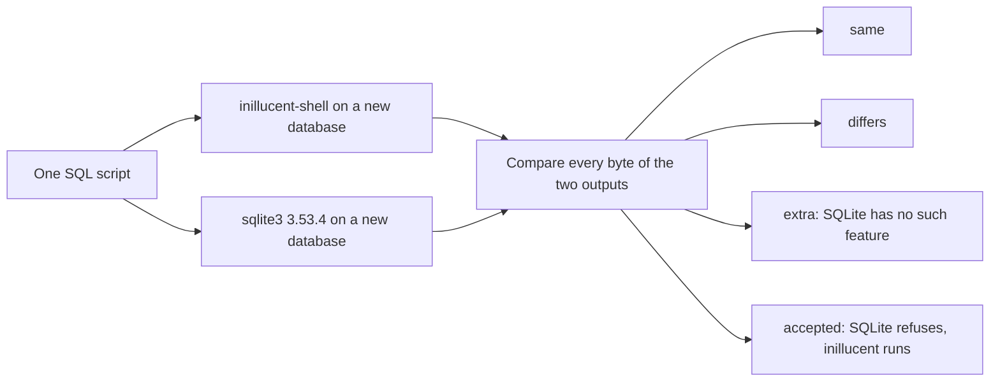

# Feature comparison

This page compares inillucent with SQLite 3.53.4, one feature at a time. It also compares the
retrieval engine's vector search with PostgreSQL and pgvector. Use it to look up whether a feature
you need behaves the same way it does in SQLite.

The SQL rows come from the 416 case probe in
[`tools/feature-probe/`](../tools/feature-probe/README.md). The results on this page are from the
probe run of 24 September 2026 against commit `d38fa00`, which is version 1.0.29.

## Terms used on this page

| Term | Meaning |
|---|---|
| the probe | the script in `tools/feature-probe/` that runs every case through both engines and compares the output |
| case | one SQL script the probe runs, with a name such as `select.basic` |
| the reference | the pinned SQLite 3.53.4 build that every case is compared against |
| pragma | a `PRAGMA` statement, which reads or changes a database setting |
| collation | a rule for comparing and sorting text, such as `NOCASE` |
| affinity | the storage class SQLite prefers for a column, which decides how a value is converted when it is stored |
| FTS5 | SQLite's full text search module |
| HNSW | the graph index used for nearest neighbor vector search |
| recall@10 | how many of the true ten nearest rows a search returned, from 0 to 1 |
| p50, p95 | the median time and the time 95% of queries finish within |

Other terms are in [the glossary](glossary.md).

## Summary

402 of 416 probed cases produce exactly the same bytes as SQLite: the same rows, the same
formatting and the same error text. None of the 416 cases is refused. The other 14 cases fall into
three groups.

| Cases | Result | What it means |
|---:|---|---|
| 402 | same | inillucent prints exactly what SQLite prints |
| 6 | differ | both engines answer and the answers are not the same. Each one is explained in [The six differences](#the-six-differences) |
| 6 | extra | vector search features SQLite does not have. All six work. There is no SQLite output to compare them with |
| 2 | accepted | `DELETE` and `UPDATE` with `ORDER BY ... LIMIT`. The reference build refuses them and inillucent runs them. See [The two accepted cases](#the-two-accepted-cases) |

Leave out the 6 vector cases and the 2 accepted cases, and 402 of the remaining 408 are the same.
That is 98.5%.

This is how the probe grades one case:



A case where both engines refuse counts as the same only when the two error messages are the same
text.

## How to read the tables

Each area has a table with one row per case. The `case` column is the name of the case in the
probe's results file, `_agent_output/feature-probe/results.json`. The `result` column uses these
words:

| Result | Meaning |
|---|---|
| **same** | the same output as SQLite, byte for byte, including the error message when both refuse |
| **differs** | both answer, and the answers are not the same. The row links to the reason |
| **extra** | inillucent has the feature and SQLite does not |
| **accepted** | SQLite refuses the statement and inillucent runs it |

## Results by area

| Area | Cases | Same | Not the same |
|---|---:|---:|---|
| [SELECT](#select) | 19 | 19 | |
| [Joins](#joins) | 15 | 15 | |
| [Compound selects, subqueries and CTEs](#compound-selects-subqueries-and-ctes) | 24 | 24 | |
| [Window functions](#window-functions) | 11 | 11 | |
| [INSERT, UPDATE and DELETE](#insert-update-and-delete) | 24 | 22 | 2 accepted |
| [UPSERT](#upsert) | 7 | 7 | |
| [CREATE TABLE](#create-table) | 18 | 18 | |
| [CREATE INDEX](#create-index) | 12 | 12 | |
| [Views and triggers](#views-and-triggers) | 15 | 15 | |
| [ALTER TABLE](#alter-table) | 8 | 8 | |
| [Constraints](#constraints) | 16 | 16 | |
| [Types and storage classes](#types-and-storage-classes) | 19 | 19 | |
| [Operators](#operators) | 12 | 12 | |
| [Collations](#collations) | 5 | 5 | |
| [Scalar functions](#scalar-functions) | 19 | 19 | |
| [Aggregate functions](#aggregate-functions) | 8 | 8 | |
| [Date and time functions](#date-and-time-functions) | 9 | 9 | |
| [Math functions](#math-functions) | 4 | 4 | |
| [JSON functions](#json-functions) | 11 | 11 | |
| [Table valued functions](#table-valued-functions) | 5 | 5 | |
| [PRAGMA statements](#pragma-statements) | 35 | 34 | 1 differs |
| [EXPLAIN](#explain) | 5 | 4 | 1 differs |
| [Transactions](#transactions) | 11 | 11 | |
| [ATTACH and temporary objects](#attach-and-temporary-objects) | 11 | 11 | |
| [FTS5, FTS4 and FTS3](#fts5-fts4-and-fts3) | 14 | 14 | |
| [R-Tree](#r-tree) | 3 | 3 | |
| [Other modules](#other-modules) | 6 | 6 | |
| [Schema tables, VACUUM and integrity checks](#schema-tables-vacuum-and-integrity-checks) | 8 | 8 | |
| [Syntax and parameters](#syntax-and-parameters) | 10 | 10 | |
| [Limits](#limits) | 7 | 7 | |
| [The shell](#the-shell) | 39 | 35 | 4 differ |
| [Vector features](#vector-features) | 6 | 0 | 6 extra |
| **Total** | **416** | **402** | **14** |

## The areas

### SELECT

| case | feature | result |
|---|---|---|
| `select.basic` | SELECT with WHERE, ORDER BY, LIMIT | same |
| `select.distinct` | SELECT DISTINCT | same |
| `select.groupby` | GROUP BY with HAVING | same |
| `select.groupby.expr` | GROUP BY expression | same |
| `select.orderby.ordinal` | ORDER BY ordinal | same |
| `select.orderby.nulls` | ORDER BY NULLS FIRST and NULLS LAST | same |
| `select.limit.offset` | LIMIT with OFFSET, both forms | same |
| `select.values` | VALUES as a statement and in FROM | same |
| `select.nofrom` | SELECT with no FROM | same |
| `select.star.qualified` | Qualified star and table alias | same |
| `select.alias` | Column and expression aliases | same |
| `select.agg.empty` | Aggregate over empty set | same |
| `select.groupby.orderagg` | GROUP BY with an ORDER BY on an aggregate | same |
| `select.bare.column` | Bare column with an aggregate | same |
| `select.distinct.multi` | DISTINCT over several columns | same |
| `select.distinct.orderby` | DISTINCT with an ORDER BY on a column not selected | same |
| `select.orderby.window` | ORDER BY a window function | same |
| `select.having.alias` | HAVING referring to a select alias | same |
| `select.count.distinct.two` | count(DISTINCT) with two arguments | same |

### Joins

| case | feature | result |
|---|---|---|
| `join.inner` | INNER JOIN with ON | same |
| `join.left` | LEFT OUTER JOIN | same |
| `join.right` | RIGHT OUTER JOIN | same |
| `join.full` | FULL OUTER JOIN | same |
| `join.cross` | CROSS JOIN | same |
| `join.natural` | NATURAL JOIN | same |
| `join.using` | JOIN ... USING | same |
| `join.self` | Self join | same |
| `join.four` | Four table join | same |
| `join.left.where` | LEFT JOIN with a WHERE on the right table | same |
| `join.comma` | Comma join with a WHERE | same |
| `join.left.subquery` | LEFT JOIN on a subquery | same |
| `join.left.using` | LEFT JOIN ... USING | same |
| `join.natural.left` | NATURAL LEFT JOIN | same |
| `join.using.three` | USING with three tables | same |

A `USING` or `NATURAL` join merges the named column into one. `*` and an unqualified name show the
merged column once. A qualified name such as `b.k` still reads the right table's own copy, which
is NULL in a `LEFT JOIN` row with no match. SQLite does the same.

### Compound selects, subqueries and CTEs

| case | feature | result |
|---|---|---|
| `compound.union` | UNION | same |
| `compound.unionall` | UNION ALL | same |
| `compound.except` | EXCEPT | same |
| `compound.intersect` | INTERSECT | same |
| `compound.limit` | Compound with LIMIT | same |
| `compound.three` | A compound of three selects | same |
| `subq.scalar` | Scalar subquery | same |
| `subq.in` | IN with a subquery | same |
| `subq.notin.null` | NOT IN with NULLs | same |
| `subq.exists` | EXISTS and NOT EXISTS | same |
| `subq.correlated` | Correlated scalar subquery | same |
| `subq.derived` | Derived table in FROM | same |
| `subq.rowvalue` | Row value comparison | same |
| `subq.rowvalue.in` | Row value IN | same |
| `subq.rowvalue.subq` | Row value with a subquery | same |
| `subq.correlated.limit` | Subquery in SELECT list with a correlated LIMIT | same |
| `cte.simple` | WITH, one term | same |
| `cte.multi` | WITH, several terms | same |
| `cte.recursive` | WITH RECURSIVE | same |
| `cte.recursive.tree` | Recursive tree walk | same |
| `cte.column.list` | CTE column list | same |
| `cte.materialized` | MATERIALIZED and NOT MATERIALIZED | same |
| `cte.on.insert` | WITH on INSERT | same |
| `cte.on.dml` | WITH on UPDATE and DELETE | same |

### Window functions

| case | feature | result |
|---|---|---|
| `win.rank` | row_number, rank, dense_rank | same |
| `win.dist` | ntile, cume_dist, percent_rank | same |
| `win.lag` | lag and lead | same |
| `win.value` | first_value, last_value, nth_value | same |
| `win.partition` | PARTITION BY | same |
| `win.frame.rows` | ROWS frame | same |
| `win.frame.range` | RANGE frame | same |
| `win.frame.groups` | GROUPS frame | same |
| `win.frame.exclude` | EXCLUDE clauses | same |
| `win.filter` | Aggregate with FILTER over a window | same |
| `win.named` | Named WINDOW clause reused | same |

`windows_match_the_oracle` in `crates/inillucent-compat/tests/differential/advanced_sql.rs` also compares window
queries with the reference row for row. A window function inside a derived table in `FROM`, a common
table expression or a view runs, so a rank computed in an inner query can be filtered in an outer
one.

### INSERT, UPDATE and DELETE

| case | feature | result |
|---|---|---|
| `dml.insert.values` | INSERT VALUES with several rows | same |
| `dml.insert.select` | INSERT ... SELECT | same |
| `dml.insert.default` | INSERT DEFAULT VALUES | same |
| `dml.insert.or.ignore` | INSERT OR IGNORE | same |
| `dml.insert.or.replace` | INSERT OR REPLACE | same |
| `dml.insert.or.rollback` | INSERT OR ROLLBACK inside a transaction | same |
| `dml.insert.or.fail` | INSERT OR FAIL | same |
| `dml.insert.or.abort` | INSERT OR ABORT | same |
| `dml.replace` | REPLACE INTO | same |
| `dml.update` | UPDATE with a WHERE | same |
| `dml.update.from` | UPDATE ... FROM | same |
| `dml.update.or.ignore` | UPDATE OR IGNORE onto a unique key | same |
| `dml.update.or.replace` | UPDATE OR REPLACE onto a unique key | same |
| `dml.delete` | DELETE with a WHERE | same |
| `dml.delete.all` | DELETE all rows | same |
| `dml.delete.limit` | DELETE ... ORDER BY ... LIMIT | **accepted**. See [The two accepted cases](#the-two-accepted-cases) |
| `dml.update.limit` | UPDATE ... ORDER BY ... LIMIT | **accepted**. See [The two accepted cases](#the-two-accepted-cases) |
| `dml.returning.insert` | RETURNING on INSERT | same |
| `dml.returning.updel` | RETURNING on UPDATE and DELETE | same |
| `dml.returning.expr` | RETURNING with an expression | same |
| `dml.insert.without.rowid` | INSERT into a WITHOUT ROWID table | same |
| `dml.upsert.without.rowid` | Upsert on a WITHOUT ROWID table | same |
| `dml.update.correlated` | A correlated UPDATE subquery | same |
| `dml.returning.trigger` | RETURNING beside a trigger | same |

### UPSERT

| case | feature | result |
|---|---|---|
| `upsert.nothing` | ON CONFLICT DO NOTHING | same |
| `upsert.update` | ON CONFLICT DO UPDATE with excluded | same |
| `upsert.update.where` | ON CONFLICT DO UPDATE with a WHERE | same |
| `upsert.secondary` | ON CONFLICT on a secondary unique index | same |
| `upsert.no.target` | Upsert without a conflict target | same |
| `upsert.two.clauses` | Two ON CONFLICT clauses | same |
| `upsert.returning` | Upsert with RETURNING | same |

With two `ON CONFLICT` clauses, the write takes the first clause whose target names the constraint
that failed. The last clause may leave out its target and then catches every other conflict. This
is SQLite's rule.

### CREATE TABLE

| case | feature | result |
|---|---|---|
| `ddl.table.basic` | CREATE TABLE with typed columns | same |
| `ddl.table.ifnotexists` | CREATE TABLE IF NOT EXISTS | same |
| `ddl.table.as.select` | CREATE TABLE ... AS SELECT | same |
| `ddl.table.without.rowid` | WITHOUT ROWID | same |
| `ddl.table.strict` | STRICT | same |
| `ddl.table.strict.any` | STRICT with ANY | same |
| `ddl.table.generated.virtual` | Generated column, VIRTUAL | same |
| `ddl.table.generated.stored` | Generated column, STORED | same |
| `ddl.table.default` | DEFAULT expressions | same |
| `ddl.table.quoted` | Quoted identifiers and reserved words as names | same |
| `ddl.table.typeless` | Typeless columns | same |
| `ddl.table.drop` | DROP TABLE and IF EXISTS | same |
| `ddl.table.pk.composite` | A PRIMARY KEY constraint over two columns | same |
| `ddl.default.timestamp` | DEFAULT CURRENT_TIMESTAMP and friends | same |
| `ddl.check.subquery` | CHECK containing a subquery | same |
| `ddl.pk.desc` | INTEGER PRIMARY KEY DESC is not a rowid alias | same |
| `ddl.without.rowid.rowid` | A rowid reference in a WITHOUT ROWID table | same |
| `ddl.without.rowid.nopk` | A WITHOUT ROWID table with no primary key | same |

### CREATE INDEX

| case | feature | result |
|---|---|---|
| `ddl.index.basic` | CREATE INDEX | same |
| `ddl.index.unique` | CREATE UNIQUE INDEX | same |
| `ddl.index.desc` | Descending index | same |
| `ddl.index.partial` | Partial index | same |
| `ddl.index.expr` | Index on an expression | same |
| `ddl.index.without.rowid` | Index on a WITHOUT ROWID table | same |
| `ddl.index.collate` | Index with COLLATE | same |
| `ddl.index.composite` | Composite index | same |
| `ddl.index.drop` | DROP INDEX | same |
| `ddl.index.reindex` | REINDEX | same |
| `ddl.index.indexed.by` | INDEXED BY and NOT INDEXED | same |
| `ddl.index.analyze` | ANALYZE writes sqlite_stat1 | same |

### Views and triggers

| case | feature | result |
|---|---|---|
| `ddl.view.basic` | CREATE VIEW | same |
| `ddl.view.columns` | CREATE VIEW with a column list | same |
| `ddl.view.drop` | DROP VIEW | same |
| `ddl.view.instead.of` | Writing through an INSTEAD OF trigger | same |
| `ddl.view.join` | A view over a join | same |
| `trg.after.insert` | AFTER INSERT trigger | same |
| `trg.before.update` | BEFORE UPDATE trigger with OLD and NEW | same |
| `trg.after.delete` | AFTER DELETE trigger | same |
| `trg.when` | Trigger WHEN clause | same |
| `trg.update.of` | UPDATE OF column trigger | same |
| `trg.raise.abort` | RAISE(ABORT) in a trigger | same |
| `trg.raise.ignore` | RAISE(IGNORE) in a trigger | same |
| `trg.recursive` | Recursive triggers | same |
| `trg.drop` | DROP TRIGGER | same |
| `trg.cascade` | Trigger firing an UPDATE on another table | same |

### ALTER TABLE

| case | feature | result |
|---|---|---|
| `alter.rename.table` | ALTER TABLE RENAME TO | same |
| `alter.rename.column` | ALTER TABLE RENAME COLUMN | same |
| `alter.add.column` | ALTER TABLE ADD COLUMN | same |
| `alter.drop.column` | ALTER TABLE DROP COLUMN | same |
| `alter.rename.propagates` | Rename propagates into a view and a trigger | same |
| `alter.add.notnull` | ADD COLUMN NOT NULL DEFAULT on a populated table | same |
| `alter.add.notnull.nodefault` | ADD COLUMN NOT NULL with no default | same |
| `alter.add.unique` | ADD COLUMN UNIQUE | same |

### Constraints

| case | feature | result |
|---|---|---|
| `con.notnull` | NOT NULL | same |
| `con.unique` | UNIQUE | same |
| `con.check.insert` | CHECK on INSERT | same |
| `con.check.update` | CHECK on UPDATE | same |
| `con.check.table` | A CHECK constraint over two columns | same |
| `con.autoincrement` | PRIMARY KEY AUTOINCREMENT | same |
| `con.on.conflict.clause` | A constraint carrying its own ON CONFLICT | same |
| `con.notnull.replace` | NOT NULL ON CONFLICT REPLACE with a DEFAULT | same |
| `con.fk.immediate` | Foreign key, immediate | same |
| `con.fk.cascade` | Foreign key ON DELETE CASCADE | same |
| `con.fk.setnull` | Foreign key ON DELETE SET NULL and SET DEFAULT | same |
| `con.fk.update.cascade` | Foreign key ON UPDATE CASCADE | same |
| `con.fk.deferred` | Deferred foreign key | same |
| `con.fk.check` | PRAGMA foreign_key_check | same |
| `con.fk.list` | PRAGMA foreign_key_list | same |
| `con.two.unique` | A row colliding on two unique indexes | same |

### Types and storage classes

| case | feature | result |
|---|---|---|
| `types.affinity.int` | Affinity: text into INTEGER | same |
| `types.affinity.text` | Affinity: number into TEXT | same |
| `types.affinity.real` | Affinity: integer into REAL | same |
| `types.affinity.blob` | Affinity: BLOB column keeps the class | same |
| `types.affinity.numeric` | Affinity: NUMERIC | same |
| `types.affinity.rowid` | Affinity through an INTEGER PRIMARY KEY | same |
| `types.cast` | CAST between every class | same |
| `types.compare.classes` | Comparison across storage classes | same |
| `types.int.overflow` | Integer overflow becomes real | same |
| `types.real.format` | Real formatting | same |
| `types.int.division` | Integer division and modulo | same |
| `types.hex` | Hex integer literals and blob literals | same |
| `types.boolean` | TRUE, FALSE and NULL keywords | same |
| `types.unicode` | Unicode text round trip | same |
| `types.null` | NULL ordering and arithmetic | same |
| `types.large.value` | A value wider than a page | same |
| `types.large.blob` | A blob wider than a page | same |
| `types.ieee` | IEEE special values | same |
| `types.large.in` | A very large IN list | same |

### Operators

| case | feature | result |
|---|---|---|
| `op.arith` | Concatenation and arithmetic | same |
| `op.bitwise` | Bitwise operators | same |
| `op.is` | IS, IS NOT, IS DISTINCT FROM | same |
| `op.between` | BETWEEN and NOT BETWEEN | same |
| `op.in.list` | IN with a list | same |
| `op.like` | LIKE with and without ESCAPE | same |
| `op.glob` | GLOB | same |
| `op.regexp` | REGEXP without a registered function | same |
| `op.case` | CASE, both forms | same |
| `op.json.arrow` | JSON -> and ->> | same |
| `op.precedence` | Operator precedence | same |
| `op.string.compare` | String comparison and BINARY collation | same |

### Collations

| case | feature | result |
|---|---|---|
| `coll.builtin` | BINARY, NOCASE and RTRIM | same |
| `coll.column` | COLLATE in a column definition | same |
| `coll.orderby` | COLLATE in ORDER BY | same |
| `coll.unique.nocase` | A unique index under NOCASE | same |
| `coll.list` | PRAGMA collation_list | same |

`PRAGMA collation_list` reports five collations in both engines: `decimal`, `BINARY`, `NOCASE`,
`RTRIM` and `uint`. `decimal` compares numeric strings by value, and `uint` compares strings of
digits by size.

**`NOCASE` and a NUL byte.** SQLite's `NOCASE` stops comparing at a NUL byte and then compares the
lengths. So `x'0061'` sorts before `x'000079'`, and `x'0061'` equals `x'0062'`. inillucent follows
the same rule in a scan, in an index walk, in a range, in `GROUP BY` and in `DISTINCT`. The test
is `inillucent-compat::ordering::nocase_stops_at_an_embedded_nul_as_sqlite_does`. Text can only
hold a NUL through `CAST(x'..' AS TEXT)` or a bound parameter, because a SQL string literal cannot
contain one.

An index on `COLLATE NOCASE` built by version 0.1.2 or earlier over text that holds a NUL is stored
in the old order. `PRAGMA integrity_check` reports the index, and `REINDEX` on that index fixes
it. An index over text with no NUL is not affected.

**An index under `BINARY` does not answer a `NOCASE` order.** `ORDER BY s COLLATE NOCASE`,
`GROUP BY s COLLATE NOCASE` and `SELECT DISTINCT s COLLATE NOCASE` sort or group by `NOCASE` even
when the scan reads an index on `s` under `BINARY`. The test is
`inillucent-compat::ordering::a_binary_walk_does_not_answer_a_nocase_order`.

### Scalar functions

| case | feature | result |
|---|---|---|
| `fn.numeric` | abs, sign, round, max, min | same |
| `fn.string1` | length, substr, instr, replace | same |
| `fn.string2` | upper, lower, trim, ltrim, rtrim | same |
| `fn.printf` | printf and format | same |
| `fn.encoding` | quote, hex, unhex, char, unicode | same |
| `fn.conditional` | coalesce, ifnull, nullif, iif | same |
| `fn.meta` | typeof, likelihood, likely, unlikely | same |
| `fn.blob` | zeroblob, randomblob length, octet_length | same |
| `fn.changes` | changes, total_changes and last_insert_rowid | same |
| `fn.concat` | concat and concat_ws | same |
| `fn.match` | glob and like as functions | same |
| `fn.version` | sqlite_version and sqlite_source_id exist | same |
| `fn.load.extension` | load_extension | same |
| `fn.printf.quote` | printf %q, %Q and %w | same |
| `fn.substr.negative` | substr with negative and omitted lengths | same |
| `fn.abs.min` | abs of the smallest integer | same |
| `fn.round.digits` | round to negative and large digits | same |
| `fn.char.edge` | char with zero and with code points out of range | same |
| `fn.blob.ops` | instr and length on blobs | same |

### Aggregate functions

| case | feature | result |
|---|---|---|
| `fn.agg.basic` | count, sum, total, avg | same |
| `fn.agg.text` | max, min, group_concat, string_agg | same |
| `fn.agg.distinct` | DISTINCT inside an aggregate | same |
| `fn.agg.filter` | FILTER on an aggregate | same |
| `fn.agg.orderby` | group_concat with an ORDER BY argument | same |
| `fn.agg.null` | Aggregates over NULLs | same |
| `fn.agg.sum.text` | sum of text and of a mixed column | same |
| `fn.agg.sum.overflow` | Integer sum overflowing | same |

### Date and time functions

| case | feature | result |
|---|---|---|
| `fn.time.basic` | date, time, datetime on a fixed instant | same |
| `fn.time.epoch` | julianday and unixepoch | same |
| `fn.time.strftime` | strftime, the whole specifier table | same |
| `fn.time.frac` | strftime fractional seconds | same |
| `fn.time.mod1` | Modifiers: days, months, years | same |
| `fn.time.mod2` | Modifiers: start of, weekday | same |
| `fn.time.mod3` | Modifiers: ceiling, floor, subsec, auto | same |
| `fn.time.timediff` | timediff | same |
| `fn.time.roundtrip` | Julian day round trip | same |

The `localtime` and `utc` modifiers convert between the machine's time zone and UTC, as SQLite
does. The answer depends on the operating system's time zone data and on the zone the process runs
in, so the same query gives different answers on two machines. That is true in SQLite too. If a
query must give the same answer everywhere, store the offset with the value and convert it in the
application. `date_and_time_functions_match_the_oracle` in
`crates/inillucent-compat/tests/differential/advanced_sql.rs` compares both engines on one machine.

### Math functions

| case | feature | result |
|---|---|---|
| `fn.math.trig` | Trigonometric functions | same |
| `fn.math.hyp` | Hyperbolic functions | same |
| `fn.math.log` | Logs, powers and roots | same |
| `fn.math.round` | ceil, floor, trunc, mod, pi, degrees, radians | same |

### JSON functions

| case | feature | result |
|---|---|---|
| `fn.json.valid` | json and json_valid | same |
| `fn.json.build` | json_array, json_object, json_quote | same |
| `fn.json.extract` | json_extract and json_type | same |
| `fn.json.modify` | json_insert, json_replace, json_set, json_remove | same |
| `fn.json.misc` | json_patch, json_array_length, json_pretty | same |
| `fn.json.group` | json_group_array and json_group_object | same |
| `fn.json.each` | json_each | same |
| `fn.json.tree` | json_tree | same |
| `fn.json.b` | jsonb round trip | same |
| `fn.json.error` | json_error_position | same |
| `fn.json.column` | JSON stored in a column and queried | same |

### Table valued functions

| case | feature | result |
|---|---|---|
| `tvf.series` | generate_series | same |
| `tvf.series.limit` | generate_series with LIMIT and no stop | same |
| `tvf.pragma` | pragma_table_info as a table | same |
| `tvf.pragma.index` | pragma_index_list and pragma_index_info | same |
| `tvf.json.join` | json_each joined against a table | same |

`json_each(t.d)` joined against a table reads a column of the outer row, so it runs once for each
outer row. The same path serves `generate_series(1, t.a)` and any other table valued function
given a column.

### PRAGMA statements

| case | feature | result |
|---|---|---|
| `prag.table.info` | PRAGMA table_info | same |
| `prag.table.xinfo` | PRAGMA table_xinfo with a generated column | same |
| `prag.table.list` | PRAGMA table_list | same |
| `prag.index` | PRAGMA index_list, index_info, index_xinfo | same |
| `prag.database.list` | PRAGMA database_list | same |
| `prag.integrity` | PRAGMA integrity_check and quick_check | same |
| `prag.versions` | PRAGMA user_version and application_id | same |
| `prag.page` | PRAGMA page_size, page_count, freelist_count | **differs**: 32768, 5 and 0 where SQLite prints 4096, 2 and 0. See [page size](#1-the-page-size) |
| `prag.cache` | PRAGMA cache_size and synchronous | same |
| `prag.journal.mode` | PRAGMA journal_mode | same |
| `prag.locking` | PRAGMA locking_mode and temp_store | same |
| `prag.encoding` | PRAGMA encoding | same |
| `prag.autovacuum` | PRAGMA auto_vacuum and incremental_vacuum | same |
| `prag.secure` | PRAGMA secure_delete and cell_size_check | same |
| `prag.fk.switches` | PRAGMA foreign_keys, defer_foreign_keys, ignore_check_constraints | same |
| `prag.trigger.switches` | PRAGMA recursive_triggers and legacy_alter_table | same |
| `prag.like.switches` | PRAGMA case_sensitive_like and reverse_unordered_selects | same |
| `prag.schema.version` | PRAGMA schema_version and data_version | same |
| `prag.maintenance` | PRAGMA optimize, shrink_memory, wal_checkpoint | same |
| `prag.runtime` | PRAGMA busy_timeout, threads, query_only | same |
| `prag.memory` | PRAGMA mmap_size, soft_heap_limit, hard_heap_limit | same |
| `prag.max.page` | PRAGMA max_page_count | same |
| `prag.schema.switches` | PRAGMA trusted_schema and writable_schema | same |
| `prag.planner` | PRAGMA analysis_limit and automatic_index | same |
| `prag.introspect` | PRAGMA module_list, function_list, pragma_list exist | same |
| `prag.compile.options` | PRAGMA compile_options exists | same |
| `prag.qualified` | PRAGMA schema.table_info qualified by database | same |
| `prag.user.version` | PRAGMA user_version round trip | same |
| `prag.application.id` | PRAGMA application_id round trip | same |
| `prag.table.info.view` | PRAGMA table_info on a view | same |
| `prag.index.info.pk` | PRAGMA index_info on the index a PRIMARY KEY creates | same |
| `prag.journal.default` | PRAGMA journal_mode reported by default | same |
| `prag.wal.truncate` | PRAGMA wal_checkpoint(TRUNCATE) | same |
| `prag.deprecated` | PRAGMA count_changes and other deprecated ones | same |
| `prag.collation.list` | PRAGMA collation_list after a CREATE | same |

`node tools/feature-probe/pragmas.js` asks both engines every pragma SQLite lists. On this build it
prints:

```
67 pragmas SQLite lists
{ answers: 59, silent: 8 }

answers in SQLite, silent here:
answers in SQLite, refused here:
```

Both lists are empty. The eight silent pragmas print nothing in both engines: `case_sensitive_like`,
`data_store_directory`, `foreign_key_check`, `foreign_key_list`, `incremental_vacuum`,
`optimize`, `shrink_memory` and `temp_store_directory`. Each of them changes something and has
no result to print. SQLite has `data_store_directory` on Windows only, and so does inillucent.
`registers.rs::the_pragma_register_agrees_exactly` compares the two lists on Windows and on Linux.

Three defaults match SQLite and one does not:

| Pragma | SQLite | inillucent |
|---|---|---|
| `journal_mode` | `delete` | `delete`. All six modes can be selected, and a database left in `wal` mode opens in `wal` mode again |
| `locking_mode` | `normal` | `normal`. `exclusive` also works, for a program that never opens a second connection |
| `foreign_keys` | off | off |
| `cache_size` | `-2000`, which is 2 MiB | `-131072`, which is 128 MiB. Set a smaller value to use less memory |

### EXPLAIN

| case | feature | result |
|---|---|---|
| `xp.scan` | EXPLAIN QUERY PLAN, full scan | same |
| `xp.index` | EXPLAIN QUERY PLAN, index search | same |
| `xp.join` | EXPLAIN QUERY PLAN, join | same |
| `xp.sort` | EXPLAIN QUERY PLAN, sort | same |
| `xp.bytecode` | EXPLAIN, the bytecode form | **differs**: the same columns, holding this engine's steps. See [EXPLAIN](#3-explain) |

### Transactions

| case | feature | result |
|---|---|---|
| `txn.commit` | BEGIN, COMMIT | same |
| `txn.rollback` | BEGIN, ROLLBACK | same |
| `txn.modes` | DEFERRED, IMMEDIATE and EXCLUSIVE | same |
| `txn.savepoint` | SAVEPOINT, RELEASE, ROLLBACK TO | same |
| `txn.savepoint.nested` | Nested savepoints | same |
| `txn.ddl.rollback` | DDL rolled back | same |
| `txn.drop.rollback` | DROP TABLE rolled back | same |
| `txn.statement.atomic` | A statement failing part way leaves nothing behind | same |
| `txn.commit.none` | COMMIT with no transaction | same |
| `txn.begin.nested` | Nested BEGIN | same |
| `txn.end` | END as a synonym for COMMIT | same |

### ATTACH and temporary objects

| case | feature | result |
|---|---|---|
| `att.basic` | ATTACH a second file and query across it | same |
| `att.join` | Join across two databases | same |
| `att.txn` | A transaction spanning two databases | same |
| `att.rollback` | A rollback spanning two databases | same |
| `att.memory` | ATTACH an in memory database | same |
| `att.database.list` | PRAGMA database_list after ATTACH | same |
| `temp.table` | CREATE TEMP TABLE | same |
| `temp.view.trigger` | CREATE TEMP VIEW and TEMP TRIGGER | same |
| `temp.not.main` | Temporary table is not in the main schema | same |
| `temp.as.select` | CREATE TEMP TABLE ... AS SELECT | same |
| `temp.shadow` | A temp table shadowing a main table | same |

### FTS5, FTS4 and FTS3

| case | feature | result |
|---|---|---|
| `fts.basic` | CREATE VIRTUAL TABLE ... fts5 and MATCH | same |
| `fts.phrase` | FTS5 phrase and NEAR queries | same |
| `fts.boolean` | FTS5 boolean operators and prefix | same |
| `fts.bm25` | FTS5 bm25 ranking | same |
| `fts.highlight` | FTS5 highlight and snippet | same |
| `fts.columns` | FTS5 column filter and multiple columns | same |
| `fts.delete` | FTS5 delete and update | same |
| `fts.rank` | FTS5 rank and the rowid | same |
| `fts.external` | FTS5 external content table | same |
| `fts.contentless` | FTS5 contentless table | same |
| `fts.commands` | FTS5 'optimize' and 'rebuild' commands | same |
| `fts.tokenizer` | FTS5 tokenizer options | same |
| `fts.vocab` | fts5vocab | same |
| `fts.fts4` | FTS3/FTS4 | same |

Some FTS5 options are refused with exit code 3 instead of being accepted and ignored:

| Option | What happens |
|---|---|
| `tokenize='trigram'`, `tokenize='icu'` | refused. The tokenizers are `unicode61`, `ascii` and `porter`. A different tokenizer would change what `MATCH` finds, so a name this build does not have is refused by name |
| `detail='none'`, `detail='column'` | refused. The index stores full positions |
| `columnsize=0` | refused. The index stores one size per column |

`highlight()` and `snippet()` mark each phrase match, as SQLite does. `MATCH 'quick brown'` marks
two ranges, because it is two phrases. `MATCH '"quick brown"'` marks one, because it is one phrase
of two words. FTS3 and FTS4 tables use the same index as FTS5, with `docid`, `snippet()`,
`offsets()` and `matchinfo()`.

### R-Tree

| case | feature | result |
|---|---|---|
| `rtree.basic` | CREATE VIRTUAL TABLE ... rtree and a window query | same |
| `rtree.i32` | rtree_i32 | same |
| `rtree.aux` | An R-Tree with an auxiliary column | same |

`geopoly` is built on the same R-Tree code, as it is in SQLite. Its thirteen functions and one
aggregate follow `ext/rtree/geopoly.c`, including its sine approximation. So
`geopoly_regular(0,0,10,4)` is `10.0007` wide in both engines.

### Other modules

| case | feature | result |
|---|---|---|
| `ext.dbstat` | dbstat | same |
| `ext.dbpage` | sqlite_dbpage | same |
| `ext.geopoly` | geopoly | same |
| `ext.csv` | The CSV module | same |
| `ext.offset` | sqlite_offset | same |
| `ext.session` | The session extension (changeset) | same |

`dbstat`, `sqlite_dbpage`, `bytecode`, `tables_used`, `sqlite_stmt` and `completion` are
answered by the engine itself, because each one reads the file or the connection. `fsdir` reads the
file system, so only the shell registers it, as in SQLite. A program that wants `fsdir` registers it
with `Database::register_module`.

### Schema tables, VACUUM and integrity checks

| case | feature | result |
|---|---|---|
| `sch.schema.table` | sqlite_schema and sqlite_master | same |
| `sch.schema.sql` | The schema of an index and a trigger | same |
| `sch.vacuum` | VACUUM | same |
| `sch.vacuum.into` | VACUUM INTO | same |
| `sch.rowid.aliases` | Rowid, oid and _rowid_ aliases | same |
| `sch.sqlite.sequence` | sqlite_sequence after AUTOINCREMENT | same |
| `int.check.wide` | integrity_check over an index and a WITHOUT ROWID table | same |
| `int.check.limit` | integrity_check with a row limit argument | same |

`VACUUM` rebuilds the file. It copies the schema and every row into a new file beside the original,
then renames the new file over the original. `VACUUM INTO 'copy.rdb'` writes the rebuilt file to a
new name, checks every tree in it before it returns, and refuses to overwrite a file that exists.
`VACUUM` inside a transaction is refused with SQLite's message, `cannot VACUUM from within a
transaction`.

### Syntax and parameters

| case | feature | result |
|---|---|---|
| `syn.comments` | Comments, both forms | same |
| `syn.case` | Keyword case insensitivity | same |
| `syn.quoting` | Identifier quoting, all four forms | same |
| `syn.reserved` | Reserved words as column names | same |
| `syn.strings` | String literals with embedded quotes | same |
| `syn.dquote.fallback` | A string in double quotes read as a literal | same |
| `syn.nested` | Deeply nested expression | same |
| `syn.no.semicolon` | Statements without a trailing semicolon | same |
| `syn.long` | A very long identifier and a very long string | same |
| `par.spellings` | Parameters through .parameter set, all spellings | same |

### Limits

| case | feature | result |
|---|---|---|
| `lim.columns` | A table with 1000 columns | same |
| `lim.compound` | A 100 term compound select | same |
| `lim.nesting` | A 100 deep nested expression | same |
| `lim.join` | A 40 term join | same |
| `lim.recursive` | Recursive CTE bounded by a LIMIT | same |
| `lim.attach` | Thirty attached databases | same |
| `lim.big.text` | A 2 MB text value | same |

`.limit` in the shell prints the same thirteen limits. One line differs, and
[The six differences](#2-the-trigger-depth-limit) explains why.

### The shell

| case | feature | result |
|---|---|---|
| `sh.tables` | `.tables` | same |
| `sh.schema` | `.schema` and .schema TABLE | same |
| `sh.fullschema` | `.fullschema` | same |
| `sh.indexes` | `.indexes` | same |
| `sh.databases` | `.databases` | same |
| `sh.headers` | `.headers` on | same |
| `sh.mode.csv` | `.mode` csv | same |
| `sh.mode.json` | `.mode` json | same |
| `sh.mode.line` | `.mode` line | same |
| `sh.mode.column` | `.mode` column | same |
| `sh.mode.insert` | `.mode` insert | same |
| `sh.mode.rest` | `.mode` quote, markdown, box, table, html | same |
| `sh.separator` | `.separator` and .nullvalue | same |
| `sh.dump` | `.dump` | same |
| `sh.import` | `.import` a CSV file | same |
| `sh.output` | `.output` to a file and back | same |
| `sh.once` | `.once` | same |
| `sh.read` | `.read` a script file | same |
| `sh.backup` | `.backup` and .restore | same |
| `sh.save` | `.save` | same |
| `sh.clone` | `.clone` | same |
| `sh.changes` | `.changes` on | same |
| `sh.echo` | `.echo` on | same |
| `sh.bail` | `.bail` on | same |
| `sh.eqp` | `.eqp` on | same |
| `sh.width` | `.width` | same |
| `sh.parameter` | `.parameter` set and a named parameter | same |
| `sh.sha3sum` | `.sha3sum` | same |
| `sh.lint` | `.lint fkey-indexes` | same |
| `sh.limit` | `.limit` | **differs** on one of 13 lines: `trigger_depth 1000` where SQLite prints 100. See [`.limit`](#2-the-trigger-depth-limit) |
| `sh.vfs` | `.vfsinfo` and `.vfslist` | **differs**: two file systems where SQLite lists six. See [`.vfslist`](#4-vfslist) |
| `sh.stats` | `.stats` on | **differs**: this engine's page cache counters. See [`.stats`](#5-stats) |
| `sh.timeout` | `.timeout` | same |
| `sh.recover` | `.recover` | **differs** on one of 17 lines: `PRAGMA page_size = '32768'`. See [page size](#1-the-page-size) |
| `sh.selftest` | `.selftest` | same |
| `sh.log` | `.log` | same |
| `sh.open` | `.open` a second file | same |
| `sh.help` | `.help` exists | same |
| `sh.unknown` | An unknown dot command | same |

The probe runs 39 shell cases. `inillucent-shell` has 63 of the reference's 65 dot commands. These
dot commands are outside the probe's cases:

| Dot command | In inillucent |
|---|---|
| `.dbconfig` | the same 22 flags, listed and set as in SQLite. `defensive` is on by default in both |
| `.cd`, `.shell`, `.system`, `.excel`, `.www` | the same |
| `.crlf`, `.prompt`, `.explain`, `.nonce` | the same |
| `.testcase`, `.check` | the same, including the summary line |
| `.scanstats`, `.trace` | the same |
| `.auth ON\|OFF` | the same. It installs an authorizer on the connection |
| `.dbinfo`, `.dbtotxt`, `.intck`, `.filectrl` | the same reports, over this file's own numbers. Five of `.dbinfo`'s 22 lines name SQLite header fields this file format does not have |
| `.connection` | the same: five slots, with `ACTIVE` on the current one |
| `.imposter INDEX TABLE` | the same. It reads an index as a `WITHOUT ROWID` table |
| `.load FILE` | prints SQLite's message for a library it cannot open. inillucent has no C extension interface, so it cannot load a SQLite extension |
| `.progress N` | accepts the same options and shows them in `.show`. It does not stop a statement part way, because inillucent has no bytecode steps to count |
| `.expert` | **not in inillucent**. It suggests indexes from SQLite's own cost model |
| `.session` | **not in inillucent**. The session extension (changesets, patchsets and conflict handling) is not built |

`.help TOPIC` searches the same way SQLite's does. A prefix that matches one command prints its full
help. A prefix that matches several prints one line for each. A word that matches no command name is
looked for inside the help text.

### Vector features

| case | feature | result |
|---|---|---|
| `vec.column` | VECTOR(n) column and distance functions | **extra** |
| `vec.distance` | vector_distance_l2 and vector_dot | **extra** |
| `vec.index` | CREATE INDEX ... USING inillucent_hnsw | **extra** |
| `vec.filtered` | A vector ORDER BY with a WHERE predicate | **extra** |
| `vec.search.vtab` | The inillucent_search virtual table | **extra** |
| `vec.pgvector.ops` | pgvector's operator spellings | **extra** |

These six cases have no SQLite answer to compare with. The probe checks that each one runs.
[Vector search against pgvector](#vector-search-against-pgvector) compares them with PostgreSQL.

## The six differences

Six cases answer differently from SQLite. Two of them come from one choice, the page size. The
other four print numbers that describe how SQLite itself is built, which inillucent cannot print
because SQLite is not linked into it.

`crates/inillucent-compat/tests/differential/semantics.rs` has a case for each difference that expects the
difference. If one of them starts to match SQLite, or changes in another way, that test fails.
`crates/inillucent-compat/tests/tooling/escapes.rs` checks that this page and `semantics.rs` name the same
differences.

| Difference | Cases | Can it be closed? |
|---|---|---|
| [The page size](#1-the-page-size) | `prag.page`, `sh.recover` | Yes, at a measured cost in speed |
| [The trigger depth limit](#2-the-trigger-depth-limit) | `sh.limit` | No. The two SQLite reference programs disagree with each other |
| [EXPLAIN](#3-explain) | `xp.bytecode` | No. SQLite prints its own bytecode program |
| [`.vfslist`](#4-vfslist) | `sh.vfs` | No. SQLite prints the sizes of its own C structures |
| [`.stats`](#5-stats) | `sh.stats` | No. SQLite prints its own memory allocator's counters |

### 1. The page size

```sql
PRAGMA page_size;       -- inillucent: 32768   SQLite: 4096
PRAGMA page_count;      -- inillucent: 5       SQLite: 2
PRAGMA freelist_count;  -- inillucent: 0       SQLite: 0
```

inillucent writes 32 KiB pages by default. SQLite writes 4 KiB pages. `PRAGMA page_size` reports the
size the file really uses. `PRAGMA page_count` also differs, because the two file formats lay out
the same five rows differently.

`.recover` prints the same 17 lines of SQL in both engines except one:
`PRAGMA page_size = '32768'` where SQLite prints `PRAGMA page_size = '4096'`.

The default was measured both ways on the medium performance gate, when the weighted result stood
at 3.83x. With 32 KiB pages the gate read 3.83x and the `schema` family read 1.15x. With 4 KiB pages
and the same memory budget the gate read 3.44x, and `schema` read 0.94x. That is below the 1.00x
floor the performance contract requires for every family, so the default stayed at 32 KiB. The
measurement has not been repeated on the current build.

### 2. The trigger depth limit

`.limit` prints thirteen limits. Twelve are the same. The thirteenth is `trigger_depth`:
inillucent prints 1000 and the downloaded `sqlite3.exe` prints 100.

The two SQLite programs the tests use disagree with each other here. The downloaded `sqlite3.exe`
was built with `SQLITE_MAX_TRIGGER_DEPTH=100`, and its own `PRAGMA compile_options` says so. The
SQLite source code sets 1000 by default, and the locally built `sqlite-oracle.exe` prints 1000.
`compat/limits.toml` names that locally built program as the one to match, and
`differential::every_limit_matches_sqlites_default` checks the limits against it. Whichever value
inillucent printed, one of the two SQLite programs would disagree.

### 3. EXPLAIN

`EXPLAIN` prints the same eight columns as SQLite, with the same widths and the same header line:
`addr opcode p1 p2 p3 p4 p5 comment`. The rows are different. SQLite compiles a statement into a
bytecode program and lists its instructions. inillucent does not compile to bytecode, so it lists
the steps it runs. For `EXPLAIN SELECT 1`, SQLite prints five instructions and inillucent prints
two, `Init` and `Halt`.

Use `EXPLAIN QUERY PLAN` to compare plans. All four of its cases are the same as SQLite.

### 4. `.vfslist`

`.vfslist` prints four lines for each file system layer, in SQLite's format. inillucent lists two
layers, `win32` and `memdb`, on Windows. SQLite lists six, including `apndvfs` and three long path
variants. The `szOsFile` line is the size of a C structure inside SQLite, so the numbers cannot
match.

### 5. `.stats`

`.stats on` prints a two column report after each statement. SQLite prints 24 lines about its
memory allocator, lookaside slots and prepared statement sizes. inillucent prints 9 lines about its
own page cache: bytes, fetches, hits, misses, rewarms, frames cooled, frames evicted, pages read and
pages written.

### `sqlite_offset`

`sqlite_offset(X)` works in both engines, and the probe case `ext.offset` is the same: a column of a
real table has an offset and a literal does not. The number itself differs. SQLite returns the byte
offset of the row's record in the file. inillucent returns the offset of the page the row is read
from. inillucent stores each column of a page in its own run of bytes, so one row has no single
record offset. SQLite's documentation says its own value can point into the table or into an index,
depending on the query plan, so a program cannot rely on the number in either engine. `semantics.rs`
records this difference as its seventh case, `functions.sqlite.offset`.

## The two accepted cases

```sql
DELETE FROM log ORDER BY created LIMIT 1000;
UPDATE job SET state = 'done' ORDER BY id LIMIT 10;
```

SQLite runs these statements only when it is compiled with `SQLITE_ENABLE_UPDATE_DELETE_LIMIT`. The
pinned 3.53.4 build is not, so it answers `near "ORDER": syntax error`. inillucent runs them the way
a SQLite build with that option does. A loop of `DELETE ... LIMIT 1000` deletes rows from a large
table in small transactions. An `ORDER BY` with no `LIMIT` is refused, as it is in SQLite.

## Is the list of cases complete?

The 416 cases are a list somebody wrote. A feature with no case would not show up in it. So a second
check starts from the lists SQLite prints about itself, and calls every name on those lists in both
engines. `node tools/feature-probe/registers.js` runs it. On this build it prints:

| List | How it is read | SQLite | inillucent | Names missing from inillucent |
|---|---|---:|---:|---|
| SQL functions | `pragma_function_list` | 218 | 190 | 46, all described below |
| pragmas | `pragma_pragma_list` | 67 | 67 | none |
| virtual table modules | `pragma_module_list` | 19 | 20 | `fts4aux`, `fts3tokenize` |
| collations | `pragma_collation_list` | 5 | 5 | none |
| shell dot commands | `.help` | 65 | 63 | `.expert`, `.session` |

`pragma_module_list` in SQLite also names `pragma_module_list` itself, and inillucent does not. The
four modules only inillucent lists are `inillucent_search`, `ivfflat`, `json_each` and `json_tree`.
The 18 functions only inillucent lists are the vector functions, such as `vector_distance_cos` and
`l2_distance`.

`cargo test --release -p inillucent-compat --test differential registers::` runs the same comparison on every
build, against the SQLite library. A name that differs must be listed in that test with the reason,
or the test fails.

### The 46 function names inillucent does not list

| Names | Why |
|---|---|
| `base64`, `base85`, `is_base85`, the `decimal` functions, the `ieee754` functions, `sha1`, `sha1b`, `sha1_query`, `sha3`, `sha3_agg`, `sha3_query`, `regexpi`, `zipfile`, `zipfile_cds`, `readfile`, `writefile`, `edit`, `lsmode`, `realpath`, `usleep`, `stmtrand`, `strtod`, `dtostr` and the four `shell_` helpers | These 41 are defined in SQLite's shell program, `shell.c`, and not in the library, `sqlite3.c`. A program that links SQLite does not get them either. They are missing only for someone who uses `inillucent-shell` in place of `sqlite3` |
| `fts3_tokenizer` | Registers a tokenizer through a C pointer. inillucent has no C extension interface. The SQLite library does not include it either |
| `fts5` | Returns a C pointer to FTS5's programming interface. There is nothing in inillucent for the pointer to point at |
| `fts5_locale`, `fts5_get_locale`, `fts5_insttoken` | FTS5's locale support is not built |

The last four answer `unable to use function ... in the requested context` when they are called, so
the names are known and refused.

### Calling every function with no arguments

The check also calls each of the 216 functions it can call with no arguments, which tests that each
name exists and how it reports a missing argument.

| Result | Count |
|---|---:|
| the same answer as SQLite | 135 |
| only valid in a special context, such as a window or an FTS5 query. These are then called properly, and they match | 13 |
| not in inillucent: the 41 shell functions and `fts3_tokenizer` | 42 |
| answered differently | 26 |

The 26 that answer differently with no arguments:

| Functions | What differs |
|---|---|
| `count`, `format`, `printf`, `strftime`, `geopoly_svg`, `json_extract`, `json_insert`, `json_remove`, `json_replace`, `json_set`, `json_array_insert`, and the six matching `jsonb_` functions | SQLite answers a call with no arguments: `count()` returns 1 and the others return NULL. inillucent refuses the call with `wrong number of arguments`. With their normal arguments all of them match, as the probe's function cases show |
| `fts5`, `fts5_locale`, `fts5_insttoken` | a different error message |
| `fts5_get_locale`, `rtreecheck` | the same message, printed as a parse error with the position of the error |
| `sqlite_source_id`, `fts5_source_id` | each names its own build |
| `random`, `julianday` | the value changes on every call, in both engines |

## Constructs the probe does not reach

`inillucent capabilities` lists 49 capabilities reported by the engine. 16 of them are `no`: the
engine refuses the construct with exit code 3. None of these is one of the 416 cases. Most of them
run in SQLite. One, writing to a view, is refused by SQLite too.

| Capability | What is refused |
|---|---|
| `attach_with_key` | `ATTACH ... KEY`, which SQLite runs only with its encryption extension |
| `row_value_in_subquery` | `(a, b) IN (SELECT x, y FROM s)` |
| `computed_limit` | an expression in `LIMIT` or `OFFSET`, such as `LIMIT 1 + 1` |
| `load_extension` | `load_extension()`. There is no C extension interface |
| `compound_ordered_by_expression` | a compound select ordered by an expression |
| `multi_column_vector_index` | a vector index over more than one column |
| `writing_to_a_view` | `INSERT`, `UPDATE` or `DELETE` on a view with no `INSTEAD OF` trigger. SQLite refuses it too |
| `nested_explain` | `EXPLAIN EXPLAIN ...` |
| `on_conflict_partial_index` | an `ON CONFLICT` target with a `WHERE` clause |
| `on_conflict_expression_index` | an `ON CONFLICT` target with an expression |
| `correlated_in_over_a_grouped_block` | a correlated `IN` subquery that groups, limits or is a compound select |
| `returning_inside_a_trigger` | `RETURNING` inside a trigger body |
| `fts5_unavailable_tokenizer` | an FTS5 tokenizer other than `ascii`, `unicode61` and `porter` |
| `fts5_detail_option` | FTS5 `detail='none'` or `detail='column'` |
| `fts5_columnsize_option` | FTS5 `columnsize=0` |
| `changing_a_schema_row` | `UPDATE` or `DELETE` on `sqlite_schema` |

Run `inillucent capabilities` to see the note on each one.

## Architecture and operations

These cannot be tested with a SQL script. Each row comes from the source code or from the programs.

| | SQLite 3.53.4 | inillucent |
|---|---|---|
| file format | the SQLite format | its own `.rdb` file and write ahead log. A SQLite file cannot be opened. It is copied with `inillucent migrate` |
| copy from SQLite | | `inillucent migrate app.db --destination app.rdb` |
| copy to SQLite | | `.dump` in `inillucent-shell` prints SQL that `sqlite3` can run |
| processes per file | many | many. A second writer waits for `PRAGMA busy_timeout` and then gets `busy` |
| writers | one at a time. In WAL mode a reader does not wait for a writer | one at a time. A reader also waits for a writer |
| threads | three threading modes | one thread per database. Confine a connection to one thread, or serialise the calls |
| journal modes | `DELETE`, `TRUNCATE`, `PERSIST`, `MEMORY`, `WAL`, `OFF` | all six, and `delete` by default. `ROLLBACK` works under every mode, including `OFF` |
| page size | 512 bytes to 64 KiB, 4 KiB by default | 32 KiB from SQL. The Rust engine API `Database::open_at` also accepts 8, 16 and 64 KiB |
| page cache | `PRAGMA cache_size` is `-2000`, which is 2 MiB | `PRAGMA cache_size` is `-131072`, which is 128 MiB |
| C API | `sqlite3.h`, about 290 functions | `inillucent_driver.h`, 53 functions, listed in `drivers/abi.toml` |
| language bindings | many | Python, Node, Go, PHP and C, all over the one C library. See [`drivers/README.md`](../drivers/README.md) |
| backup | `sqlite3_backup_*` | `inillucent_backup_to` in the C API, `.backup` in the shell |
| authorizer and cancel | `sqlite3_set_authorizer`, `sqlite3_interrupt` | an authorizer in the Rust driver, and `inillucent_cancel` in the C API |
| not provided | | serialize and deserialize, incremental blob I/O, update, commit, rollback and preupdate hooks, tracing, `unlock_notify`, snapshots, a custom VFS |
| encryption at rest | SEE, a paid extension | none. `ATTACH ... KEY` is refused by name |
| functions and collations written by the application | yes | yes, scalar and aggregate functions and collations, through the driver |
| virtual table modules written by the application | `sqlite3_create_module` | `Database::register_module` in the Rust driver |

### Moving an application from SQLite

`inillucent migrate` reads a SQLite file and writes a new `.rdb`. It copies tables, `WITHOUT ROWID`
tables, generated columns, partial indexes, foreign keys, views, triggers, FTS5 indexes and
`sqlite_sequence`. It checks each table's row count and a digest of every stored column before it
publishes the new file. A `VIRTUAL` generated column is not stored by either engine, so the digest
leaves it out, and `crates/inillucent-compat/tests/e2e/migrate_realistic.rs` compares those columns
value by value with SQLite.

An FTS5 index declared with `content=''` or with `content=` naming another table keeps no copy of
its text. There is nothing in the file to rebuild the index from, so the migration reports that
index as a failed check and does not publish. [Migrating](migrating.md) has the full steps.

## Vector search against pgvector

Every number in this section is from one run of the retrieval benchmark, on 20 September 2026 at
commit `cd53317`. `inillucent-scorecard.md` in the repository root is that run's output.
[Retrieval quality](retrieval-quality.md) explains the method.

Both engines read the same vectors and get the same embedded query, so the embedding model does not
affect the result. Each row compares inillucent with the better of two pgvector configurations: the
extension's defaults, and a configuration tuned to return every row a filter allows.

**17 graded comparisons: 15 better, 1 equivalent, 1 inconclusive, 0 worse. Every correctness check
passes.**

### Ranking quality

Higher is better in every row except abstention, where lower is better.

| Family | Measurement | inillucent | Best pgvector | Difference |
|---|---|---:|---:|---|
| Lexical | rare identifiers, mean reciprocal rank | **0.5455** | 0.1357 | 302% higher |
| Two sources | evidence in two sources, evidence recall@10 | **0.6212** | 0.1923 | 223% higher |
| Filtered | `source = jira`, recall@10 inside the filter | **1.000** | 0.3280 | 205% higher |
| Filtered | `source = github`, recall@10 inside the filter | **1.000** | 0.3320 | 201% higher |
| Passage | one transposed character, graded nDCG@10 | **0.6788** | 0.3969 | 71% higher |
| Filtered | `source = slack`, recall@10 inside the filter | **1.000** | 0.6120 | 63% higher |
| Passage | three keywords, graded nDCG@10 | **0.6259** | 0.4651 | 35% higher |
| Lexical | natural language headings, mean reciprocal rank | **0.7222** | 0.5896 | 22% higher |
| Hybrid | document identity, nDCG@10 | **0.9774** | 0.8148 | 20% higher |
| Hybrid | natural language headings, nDCG@10 | **0.7458** | 0.6271 | 19% higher |
| Passage | passage evidence, graded nDCG@10 | **0.7055** | 0.6027 | 17% higher |
| Filtered | `source = miro`, recall@10 inside the filter | **1.000** | 0.8840 | 13% higher |
| Filtered | `source = confluence`, recall@10 inside the filter | 1.000 | 0.9760 | inconclusive: the 95% interval on the difference is 0.0040 to 0.0480, and its low end is under the 0.01 threshold |
| Filtered | `source = figma`, recall@10 inside the filter | 1.000 | 1.000 | equivalent |
| Abstention | questions with no answer, confident answer rate | **0.0050** | 1.000 | 99.5% fewer confident wrong answers |

**inillucent returned every row a filter allows, on every source.** Each query asked for 50 rows.
pgvector at its defaults returned fewer than 50 on 25 of 25 queries for all six sources. Configured,
it still returned fewer than 50 on github (12 of 25 queries), jira (9 of 25) and miro (1 of 25).

### Latency

Time per query in milliseconds, measured inside the calling process.

| Query | inillucent | pgvector configured | inillucent is | pgvector defaults | inillucent is |
|---|---:|---:|---|---:|---|
| no filter, p50 | **0.8462** | 2.315 | 174% faster | 1.492 | 76% faster |
| no filter, p95 | **1.522** | 3.568 | 134% faster | 2.276 | 50% faster |
| `source = slack`, p50 | **0.5820** | 36.486 | 6,169% faster | 1.114 | 91% faster |
| `source = slack`, p95 | **0.7109** | 89.848 | 12,539% faster | 2.075 | 192% faster |

inillucent is a library in the calling process. pgvector is reached over a loopback network
connection, and that round trip is part of its time.

### Disk and processes

| | inillucent | PostgreSQL with pgvector | Difference |
|---|---|---|---|
| index on disk, 185,078 chunks | 952 MB, with vectors stored as 8 bit integers | 800 MB: 722 MB of HNSW and 78 MB of GIN | 19% more on disk |
| everything the queries read | the 952 MB index | a 1,750 MB database | 46% less on disk |
| memory of the serving process | 1,216 MiB, one process. Opening the saved index takes 0.8 s | a PostgreSQL server. `shared_buffers` alone is set to 10,240 MiB on the test machine | not comparable: PostgreSQL's shared memory is counted in each of its processes |
| processes to run | none: it is a library | PostgreSQL, and an embedding server | 2 fewer |

### SQL compared with pgvector

| pgvector | inillucent |
|---|---|
| operators `<->`, `<#>`, `<=>`, `<+>`, `<~>`, `<%>` | all six, with PostgreSQL's precedence: tighter than a comparison and looser than `+`. So `WHERE v <=> q < 0.5` and `ORDER BY v <=> q` read as expected. `<#>` returns the negative inner product, as in pgvector, so a smaller value is always closer |
| `l2_distance`, `inner_product`, `cosine_distance`, `l1_distance`, `hamming_distance`, `jaccard_distance` | all six, under the same names. inillucent's own names are `vector_distance_cos`, `vector_distance_l2` and `vector_dot` |
| `vector_dims`, `vector_norm`, `l2_normalize`, `binary_quantize`, `subvector` | all five. `binary_quantize` writes one bit per component, highest bit first in each byte, as pgvector's `bit` type does |
| `avg(vector)`, `sum(vector)` | both, one component at a time, when the column is declared as a vector |
| `+`, `-`, `*` and concatenation on vectors | the operators, and `vector_add`, `vector_sub`, `vector_mul` and `vector_concat`. The operators act on vectors only when the column is declared as a vector, so `x'00' + x'00'` is still SQLite's integer `0`. `v * 2` scales a vector |
| types `vector`, `halfvec`, `bit`, `sparsevec` | `VECTOR(N)`. `HALFVEC(N)`, `BIT(N)` and `SPARSEVEC(N)` are accepted as type names so a pgvector schema runs, and all of them store 32 bit floats |
| HNSW and IVFFlat indexes | both. `CREATE INDEX ... USING inillucent_hnsw (v)` and `CREATE INDEX ... USING ivfflat (v) WITH (lists = 20, probes = 3)` |
| `WITH (m = ..., ef_construction = ...)`, `SET hnsw.ef_search` | `WITH (...)` takes `m`, `ef_construction`, `ef_search`, `metric`, `threads` and `compact`. An unknown name is refused. `ef_search` is set on the index, and there is no session setting |
| operator classes such as `vector_l2_ops` | `WITH (metric = 'cosine')` or `WITH (metric = 'l2')` on the index, cosine by default. The index is used only when the `ORDER BY` distance matches its metric. `vector_dot` always scans |
| an error on vectors of different sizes | the same: `different vector dimensions 4 and 3` |
| filtered search with `hnsw.iterative_scan` | no setting needed. See below |
| no embedding function | `embed(TEXT)` runs `nomic-embed-text-v1.5` in the database process and returns a 768 component vector. Release builds include it. A build from source needs `--features inillucent-cli/embed`, and without it `embed()` is refused with exit code 3. `inillucent setup-embeddings` downloads the model |
| transactions, backups, many writers, replication | PostgreSQL's. inillucent has one writer at a time and many processes |

### Filtered vector search

For `WHERE ... ORDER BY v <=> ? LIMIT k`, the search asks the index for `k` rows and applies the
`WHERE` clause to them. If fewer than `k` rows pass, it asks for four times as many and tries again.
It stops when it has `k` rows or has read the whole index. This does the same job as pgvector's
`hnsw.iterative_scan` and needs no setting.

`a_filtered_vector_search_keeps_every_row_the_exhaustive_plan_finds` in
`crates/inillucent-compat/tests/engine/vector.rs` checks it on 400 rows. With filters that keep 100%, 50%,
5% and 1% of the rows, at `LIMIT` 1, 10 and 100, the indexed search returns the same rows as a full
scan in all 12 combinations.

## Speed and memory against SQLite

These numbers are from the graded run of 23 September 2026 on `main` at `6f84ce6`, four runs of 30
paired rounds at 100,000 rows, with both engines on the same processor cores and the same 128 MiB
memory budget. Each figure is the median of the four runs. [Performance](performance.md) has every
workload, the method and the later runs.

| | SQLite 3.53.4 | inillucent | Result |
|---|---|---|---|
| elapsed time, weighted over ten workload families | the reference | 4.97x | **397% faster** |
| elapsed time, the 95% lower bound the gate grades | | 4.62x | 362% faster. The bar asks for 200% faster: met on all four runs |
| processor time for one round of the whole plan | 1,082 ms | 555 ms | **50% less processor**. The bar asks for 60% less: missed on all four runs |
| peak memory for one round of the whole plan | 37.22 MiB | 40.76 MiB | **9.5% more memory**. The bar asks for 5% less: missed |
| the database file, the same data imported | 16,830,464 bytes | 17,432,576 bytes | 3.6% larger |

Memory is the one result where inillucent is worse than SQLite. About 3.6 MiB of the process is what
any Rust program on the test machine uses before the engine does anything, and most of the rest is
the page cache and one `CREATE INDEX`. [Performance](performance.md#memory) breaks it down.

| Family | Weight | Result | Bar |
|---|---:|---|---|
| `read.point` | 16% | 29.85x, 2,885% faster | met |
| `large.values` | 4% | 12.35x, 1,135% faster | met |
| `read.analytical` | 10% | 10.71x, 971% faster | met |
| `read.range` | 12% | 5.02x, 402% faster | met |
| `read.join` | 8% | 4.21x, 321% faster | met on the per round bound, missed on the pooled bound |
| `write` | 20% | 3.04x, 204% faster | met |
| `transaction` | 10% | 2.37x, 137% faster | met |
| `extension` | 8% | 1.73x, 73% faster | met |
| `open.prepare` | 8% | 1.69x, 69% faster | missed: the bar asks for 5.00x |
| `schema` | 4% | 1.31x, 31% faster | missed: the bar asks for 3.00x |

## Known gaps

| Gap | Where it stands |
|---|---|
| Memory is 9.5% more than SQLite's | open. See [Performance](performance.md#memory) |
| Processor time misses its bar | open. 50% less than SQLite, where the bar asks for 60% less |
| `open.prepare` and `schema` miss their speed bars | open. Both are faster than SQLite |
| A correlated `IN` subquery over many outer rows is much slower than SQLite | open. Write it as a join. See [Performance](performance.md) |
| The C API has 53 functions where SQLite has about 290 | open. The list of what is missing is in [Architecture and operations](#architecture-and-operations) |
| One thread per database | open |
| A SQLite file cannot be opened directly | by design. `inillucent migrate` copies it |
| No encryption at rest | the same as a SQLite build without its encryption extension |
| `fts4aux`, `fts3tokenize`, `.expert`, `.session` and four FTS5 functions | open. See [Is the list of cases complete?](#is-the-list-of-cases-complete) |
| The retrieval index uses 1,216 MiB of memory for 185,078 chunks | open. Nothing has been done yet to reduce it |

[Roadmap](roadmap.md) lists what is planned.

## Reproducing these results

The probe is in [`tools/feature-probe/`](../tools/feature-probe/README.md). It needs a release build
of `inillucent-shell` and the pinned SQLite in `.sqlite-ref/`.

```sh
cargo build --release --bin inillucent-shell   # the engine under test
tools/sqlite-reference.sh                      # the pinned SQLite, if .sqlite-ref/ is missing

node tools/feature-probe/run.js                # the 416 cases through both shells
node tools/feature-probe/pragmas.js            # every pragma SQLite lists, asked of both
node tools/feature-probe/registers.js          # every function, pragma, module, collation and dot command SQLite lists
node tools/feature-probe/vector-features.js    # the pgvector features, one at a time
```

On Windows, `pwsh tools/sqlite-reference.ps1` fetches the pinned SQLite. The probe writes to
`_agent_output/feature-probe/`, which git ignores. `results.json` holds each case's script, both
outputs and the result, and names the commit it ran against. `tools/feature-probe/README.md`
explains how to add a case.

`crates/inillucent-compat/tests/differential/semantics.rs` holds 242 cases that run in the test suite and compare
both engines the same way. A difference the probe finds becomes a case there.

The retrieval numbers come from `inillucent-bench grade`, and the speed and memory numbers from
`inillucent-fullgate`. [Retrieval quality](retrieval-quality.md) and
[Performance](performance.md) give the commands.

## Other pages

| Page | What it covers |
|---|---|
| [`docs/README.md`](README.md) | the documentation index |
| [`docs/sql.md`](sql.md) | the SQL inillucent runs, and how it differs from SQLite |
| [`docs/performance.md`](performance.md) | speed, processor time, memory and file size against SQLite |
| [`docs/retrieval-quality.md`](retrieval-quality.md) | the graded comparison with pgvector |
| [`docs/vector-search.md`](vector-search.md) | how to use vector and keyword search |
| [`docs/roadmap.md`](roadmap.md) | what is not built yet |
| [`drivers/README.md`](../drivers/README.md) | the C library and the language bindings |
| [`compat/README.md`](../compat/README.md) | the parity manifest and the tests that fill it |
