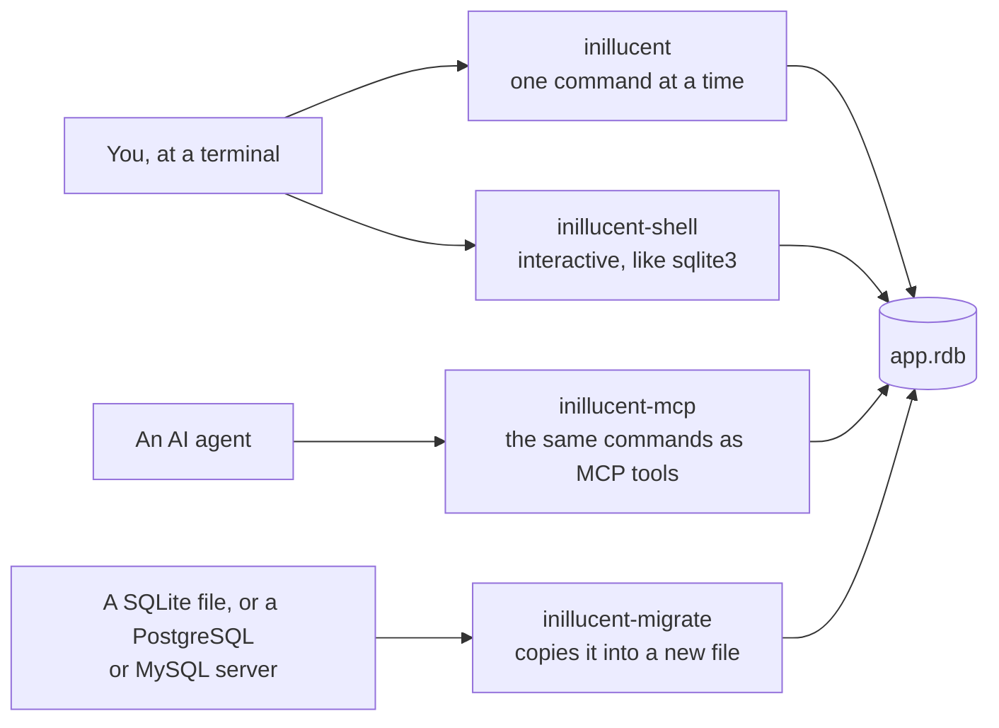

# Getting started

This page shows how to install inillucent, create a database, run SQL against it, and read what the
programs print when something fails.

The tutorial at [inillucent.com/docs](https://inillucent.com/docs) covers the same ground in 24
chapters, with the expected output beside every command.

Words such as MCP, pragma and exit code are explained in the [glossary](glossary.md).

## Install

On Windows, in PowerShell:

```powershell
irm https://inillucent.com/downloads/install.ps1 | iex
```

On macOS and Linux:

```sh
curl -fsSL https://inillucent.com/downloads/install.sh | sh
```

| Script | Installs into | Puts the programs on your path by |
|---|---|---|
| `install.ps1` | `%LOCALAPPDATA%\Programs\inillucent` | adding its `bin` folder to your user `Path` |
| `install.sh` | `~/.local/share/inillucent` | linking the four programs into `~/.local/bin` |

Both scripts download the archive for your machine, check it against the release's published
`SHA256SUMS`, and need no administrator rights. Both take `--version` (`-Version` on Windows) to
install a specific release and `--uninstall` (`-Uninstall`) to remove it.

### Package managers

| Manager | Command |
|---|---|
| npm | `npm install -g inillucent`, or `npx inillucent help` to try it with nothing installed |
| pip | `pip install inillucent` |
| Homebrew | `brew install black-rainbow-labs/inillucent/inillucent` |
| Go | `go install github.com/Black-Rainbow-Labs/Inillucent/packages/go/cmd/inillucent-install@latest`, then run `inillucent-install` |
| Composer | `composer require black-rainbow-labs/inillucent`, then run `vendor/bin/inillucent-install` |
| cargo | `cargo install inillucent-cli` |

The other package managers install all four programs. `cargo install inillucent-cli` builds
`inillucent`, `inillucent-shell` and `inillucent-mcp` from source on any platform with a Rust
toolchain, and `cargo install inillucent-migrate` builds the fourth. A build from `cargo install` has no `embed()` function unless
you add `--features embed`. The release archives are built with `embed()`.

### Other downloads

The [GitHub release](https://github.com/Black-Rainbow-Labs/Inillucent/releases/latest) and
inillucent.com also carry:

- a plain archive for every platform,
- a `.deb` and an `.rpm` package for Linux,
- a universal macOS build for Apple silicon and Intel, as a `.tar.gz` archive and as a `.pkg`
  installer signed with an Apple Developer ID and notarized by Apple.

To check a download by hand:

```sh
minisign -Vm SHA256SUMS -p inillucent.pub     # inillucent.com/downloads/inillucent.pub
sha256sum -c SHA256SUMS --ignore-missing
```

## The four programs



| Program | What it is for |
|---|---|
| `inillucent` | The command line. It has 30 commands, such as `query`, `exec`, `describe`, `import`, `export`, `search`, `explain`, `backup`, `migrate` and `setup-embeddings`. Every command takes `--output json`. |
| `inillucent-shell` | An interactive shell that works like `sqlite3`. It answers 63 of its 65 dot commands. It knows all 48 of `sqlite3`'s command line options: it acts on 30 and refuses 18 by name, because the engine has nothing they could control. |
| `inillucent-mcp` | 28 of the same commands served to an AI agent over MCP, on standard input and output. |
| `inillucent-migrate` | Builds a database from a SQLite file, a running PostgreSQL or MySQL server, or a retrieval index saved by an older version. `inillucent migrate` does the same job from the command line. |

`inillucent shell` starts the shell, and `inillucent mcp` starts the MCP server, so the
`inillucent` program alone is enough.

## A first database

```sh
inillucent create app.rdb
inillucent --db app.rdb exec "CREATE TABLE note (id INTEGER PRIMARY KEY, body TEXT)"
inillucent --db app.rdb exec "INSERT INTO note (body) VALUES (?1)" --params '["hello"]'
inillucent --db app.rdb query "SELECT * FROM note"
inillucent --db app.rdb describe note
```

`create` makes an empty file. `exec` runs a statement that changes something and prints how many
rows changed. `query` runs a `SELECT` and prints the rows. `describe` prints a table's columns,
indexes, row count and `CREATE` statement.

To see every command, or every option of one command:

```sh
inillucent help
inillucent help migrate
```

To work interactively:

```sh
inillucent-shell app.rdb
```

The shell answers 63 of `sqlite3`'s 65 dot commands, including `.tables`, `.schema`, `.mode`,
`.import` and `.dump`. The two it does not have are `.expert` and `.session`.

## Bind parameters

```sh
inillucent --db app.rdb exec "INSERT INTO note (body) VALUES (?1)" --params '["it'\''s fine"]'
```

`--params` takes a JSON array. Its first value fills `?1`, its second fills `?2`, and so on. A
bound value is never read as SQL, so a quote inside it cannot break the statement or inject
another one.

A blob is written as `{"blob":"<hex>"}`:

```sh
inillucent --db app.rdb exec "CREATE TABLE file (data BLOB)"
inillucent --db app.rdb exec "INSERT INTO file (data) VALUES (?1)" --params '[{"blob":"00ff7f80"}]'
```

A query returns a blob in the same form, so bytes read from one result can be bound into the next
statement unchanged.

## Reading results as JSON

```sh
inillucent --db app.rdb query "SELECT * FROM note" --output json
```

```json
{
  "ok": true,
  "command": "query",
  "columns": [
    { "name": "id", "type": "integer" },
    { "name": "body", "type": "text" }
  ],
  "rows": [
    [1, "hello"]
  ],
  "row_count": 1,
  "total": 1,
  "more": false,
  "changes": 0,
  "last_insert_rowid": 0,
  "elapsed_ms": 0.0859,
  "text": "id  body\n--  -----\n1   hello"
}
```

| Field | What it holds |
|---|---|
| `ok` | `true` when the command succeeded |
| `columns` | each column's name and the storage class its values came back as |
| `rows` | the values, typed: numbers are numbers and a null is `null` |
| `row_count` | how many rows are in `rows` |
| `total` | how many rows the query produced, whatever `--limit` was set to |
| `more` | `true` when `--limit` cut the result short. The default limit is 200 rows, and `--limit 0` returns every row |
| `elapsed_ms` | how long the statement took. It differs on every run |
| `text` | the table a terminal would print |

A failure has `"ok": false`, a `status` and a `message`:

```json
{
  "ok": false,
  "command": "query",
  "status": "not_found",
  "message": "no such table: missing",
  "text": "Error [not_found]: no such table: missing"
}
```

A script should read these fields and branch on `status`. The `text` field is for people.

## Exit codes

| Code | Meaning | Example |
|---|---|---|
| `0` | The command succeeded. | a query that returned rows |
| `1` | The command ran and failed. | bad SQL, a constraint, a missing table, a file that cannot be read |
| `2` | The command line could not be acted on. | a mistyped command, an unknown option |
| `3` | The engine has not built that feature yet. | `SELECT * FROM note LIMIT 1 + 1` |

Exit code 3 means "not built yet". A script can check for it without reading the message. Rewording
the SQL will not help. Over MCP and the language bindings, the same case has the status
`unsupported`. The command line's JSON result names the missing feature in a `feature` field.

## What the first word means

`inillucent` reads its first word as a command. When the word is not a command but could be a file
name, `inillucent` opens it as a database in the shell, the way `sqlite3 app.rdb "SELECT 1"` does.

```sh
inillucent app.rdb "SELECT 1"
```

| The first word | What `inillucent` does |
|---|---|
| `:memory:` | opens a database held in memory |
| a URI such as `file:app.rdb?mode=ro` | opens the database the URI names |
| a word that is already a file on disk | opens that file |
| a word containing a path separator, such as `./ledger` or `data/app` | opens that path |
| a word starting with a drive letter, such as `C:\tmp\app` | opens that path |
| a word with an extension, such as `app.rdb` | opens that file, and creates it when it is missing |
| any other word | refuses it with exit code 2 |

Any other word is taken as a mistyped command, and nothing is opened or created:

```text
inillucent: 'qeury' is not a command, and it does not name a database file.
  Did you mean: query?
  Run 'inillucent help' for the 30 commands there are.
  To open a file of that name as a database, write it as a path: inillucent ./qeury
```

`inillucent-shell` treats an unknown option the same way. A word that starts with a dash and is not
one of its options is refused, as `sqlite3` refuses it:

```text
Error: unknown option: --db
Use -help for a list of options.
```

To open a file whose name starts with a dash, put `--` before it: `inillucent-shell -- -ledger.rdb`.

## Ask the engine what it can do

```sh
inillucent capabilities
```

`inillucent capabilities` lists 49 features, each marked `yes`, `partial` or `no`. A test runs
every row against the engine, so the list matches what the engine does.

## Bring in an existing database

```sh
inillucent migrate legacy.db                                --destination app.rdb
inillucent migrate "postgres://user@127.0.0.1:5432/corpus" --destination corpus.rdb
inillucent migrate "mysql://root@127.0.0.1:3306/app"        --destination app.rdb
```

A path is read as a SQLite file. A `postgres://` or `mysql://` URL is read from a running server.
`inillucent migrate` never writes to the source and never overwrites the destination.
[Migrating](migrating.md) explains what is copied and how each table is checked.

## Use it from an application

The Rust library is the `inillucent` crate:

```rust
use inillucent::{Database, Value};

let database = Database::open("app.rdb")?;
let connection = database.session();
connection.execute("CREATE TABLE note (id INTEGER PRIMARY KEY, body TEXT)", &[])?;
connection.execute("INSERT INTO note (body) VALUES (?1)", &[Value::Text("hello".to_string())])?;
let rows = connection.query("SELECT id, body FROM note", &[], 200)?;
```

The last argument of `query` is the most rows to return.

Python, Node, Go and PHP packages call the same engine through its C library. The
[`inillucent-embed` skill](../agent-skills/inillucent-embed/SKILL.md) shows each language.

## Where to go next

| You want | Page |
|---|---|
| the words these pages use | [Glossary](glossary.md) |
| how the two engines fit in one file | [Architecture in one page](architecture-overview.md) |
| which SQL runs, and where it differs from SQLite | [SQL support](sql.md) |
| vector columns, HNSW indexes and hybrid search | [Vector search](vector-search.md) |
| the speed measurements against SQLite | [Performance](performance.md) |
