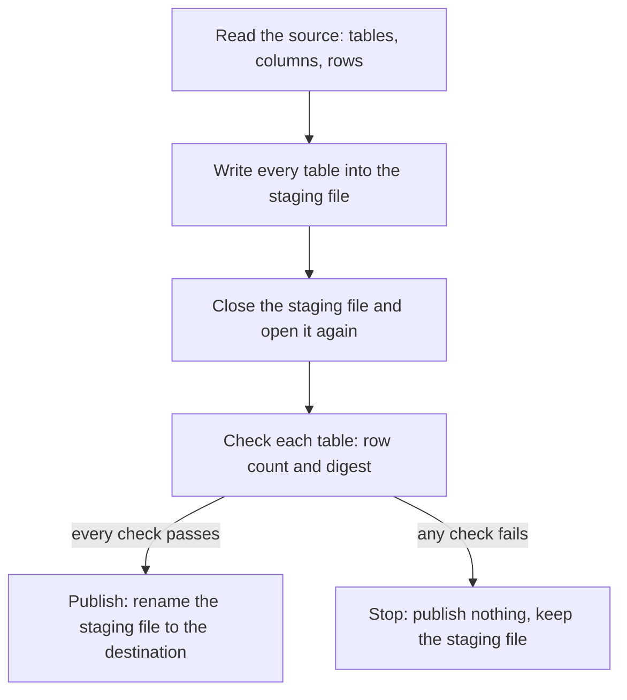

# Migrating into inillucent

`inillucent migrate` builds a new inillucent database from a SQLite file, a running PostgreSQL
server or a running MySQL server. It checks every table against the source and publishes the new
file only when every check passes.

```sh
inillucent migrate legacy.db                                --destination app.rdb
inillucent migrate "postgres://user@127.0.0.1:5432/corpus" --destination corpus.rdb
inillucent migrate "mysql://root@127.0.0.1:3306/app"        --destination app.rdb
```

A path is a SQLite file. A `postgres://` or `mysql://` URL is a running server, which inillucent
reads over the server's own network protocol.

This page is the summary. The operator's page is
[`agent-skills/inillucent-migrate`](../agent-skills/inillucent-migrate/SKILL.md). It has the full
table of how each value type is carried and how to read the report.

## Terms used on this page

| Term | Meaning |
|---|---|
| source | the SQLite file or server the rows come from. inillucent never writes to it |
| destination | the `.rdb` file the migration builds |
| staging file | the file the migration builds first, named `.<destination>.staging`, in the same folder as the destination |
| publish | rename the staging file to the destination name. A rename in one folder happens in one step, so an application sees either no file or the finished file |
| digest | a SHA-256 hash over every row of a table. Two tables with the same digest hold the same values |
| snapshot | a view of the server's data as of one moment. Changes other clients commit later are not seen |
| TLS | the encryption layer under HTTPS and under an encrypted database connection |
| loopback address | an address that stays on the same machine: `127.0.0.1`, `::1`, `localhost` |

Other terms, such as FTS5, are in [the glossary](glossary.md).

## How a migration runs



Three rules hold for every source:

1. **The source is never written to.** No flag changes this, and no step deletes anything. To go
   back, open the source again. It has not changed.
2. **The destination is never overwritten.** When the destination file already exists, the
   migration stops before it reads anything:

   ```text
   Error [invalid_state]: "app.rdb" already exists. This tool never overwrites.
   ```

3. **Nothing unverified is published.** Every table is checked by row count and by digest. A count
   alone misses a migration that moved the right number of rows with the wrong values. When a check
   fails, the migration exits with code 1, publishes nothing, and leaves the staging file for you to
   inspect.

## The flags

| Flag | Meaning |
|---|---|
| `[source]` | the SQLite file, or a `postgres://` or `mysql://` URL. Leave it out to read the URL from `INILLUCENT_SOURCE_URL`, or write `-` to read one line from standard input. Both keep a password out of the process list |
| `--destination <file>` | the `.rdb` to build. Required |
| `--kind <kind>` | `sqlite`, `postgres`, `mysql` or `index`. The default comes from the source: `sqlite` for a path, and the URL scheme for a URL |
| `--batch <n>` | rows per destination transaction when copying from a server. Default 10000. It changes how long the migration takes and nothing about the result |
| `--insecure-plaintext` | allow an unencrypted connection to a server that is not on this machine. It works only together with `sslmode=disable` in the URL. See [Encryption](#encryption) |
| `--output json` | print the result as JSON, with every check |

`inillucent help migrate` prints the same list. `inillucent-mcp` serves the same command as the
`inillucent_migrate` tool.

## From SQLite

```sh
inillucent migrate legacy.db --destination app.rdb --output json
```

This is part of the JSON for a SQLite file with one table, one FTS5 table and `PRAGMA user_version`
set to 7:

```json
{
  "ok": true,
  "command": "migrate",
  "destination": "app.rdb",
  "checks": [
    { "name": "columns.note", "passed": true, "detail": "4 columns, in the order the source declares" },
    { "name": "count.note", "passed": true, "detail": "3 rows" },
    { "name": "digest.note", "passed": true, "detail": "9a02e0926c1cd9a092a23f47c01ded55d009f0b2a686011c3185d753eec7c9a1" },
    { "name": "carried.docs", "passed": true, "detail": "2 rows rebuilt through this engine's own fts5" },
    { "name": "pragma.application_id", "passed": true, "detail": "0 carried from the source" },
    { "name": "pragma.user_version", "passed": true, "detail": "7 carried from the source" }
  ]
}
```

What comes across:

| Object | What happens |
|---|---|
| tables, indexes, views, triggers | copied |
| `PRAGMA application_id`, `PRAGMA user_version` | copied, and checked by `pragma.application_id` and `pragma.user_version` |
| FTS5 tables | rebuilt. The text is read from the SQLite table's `<name>_content` table and indexed again by inillucent's FTS5. The row ids stay the same |
| an FTS5 table with `content=''` or `content='other'` | the migration fails. SQLite keeps no copy of the text in that table, so there is nothing to rebuild from |
| a virtual table using any other module, such as `rtree` | the migration fails, and the check `carried.<name>` names the module |

This is the failure for a file that holds an R-Tree table:

```text
Error [corrupt]: app.rdb was not published: carried.r: r uses the rtree module, whose storage is SQLite's own; this engine has no content table to rebuild it from
```

The SQLite file is read by `inillucent-sqlite-reader`, which is part of inillucent. No SQLite
library is needed.

## From PostgreSQL or MySQL

```sh
inillucent migrate "postgres://user@db.example:5432/corpus" --destination corpus.rdb
inillucent migrate "mysql://app@db.example:3306/app" --destination app.rdb
```

`--kind postgres` or `--kind mysql` overrides the URL scheme.

**The whole read happens in one read only, repeatable read snapshot.** The snapshot opens before the
schema is read. Every table and the schema itself are read as of the same moment. Rows that other
clients commit during the migration are not seen.

Rows are read through a cursor and written in batches of `--batch` rows. Memory use depends on the
batch size and does not grow with the size of a table.

### The password

The password comes from the URL, from `PGPASSWORD` for PostgreSQL, or from `MYSQL_PWD` for MySQL. It
is removed from everything the migration prints: the terminal, the report file and the MCP result.

### What comes across

| Object | What happens |
|---|---|
| tables | copied, with their columns in order, `NOT NULL`, and the primary key |
| views, materialized views, sequences, foreign tables, partitioned tables, triggers, stored routines | not copied. Each is listed in the report and in `notCarried` in the JSON |
| a PostgreSQL schema other than `public` | the schema name is joined to the table name as `schema__table`, because inillucent has one namespace |

### How values are carried

A value is carried as the matching inillucent type when one exists. When none exists, the value is
carried as the server's own text for that value.

| Source type | Carried as |
|---|---|
| integers | `INTEGER` |
| `real`, `double`, `float` | `REAL` |
| `numeric`, `decimal`, and MySQL `BIGINT UNSIGNED` above the signed range | `TEXT`, digit for digit |
| `boolean`, MySQL `TINYINT(1)` | `INTEGER`, 0 or 1 |
| `bytea`, `BLOB`, `BINARY`, `VARBINARY` | `BLOB` |
| dates, times, `uuid`, `json`, arrays, ranges, enums and every other type | `TEXT`, exactly as the server prints it |

A `numeric(38,10)` value converted to a floating point number loses digits, and no check would
notice. As `TEXT` it keeps every digit `psql` prints. To use it as a number, cast it in the
destination.

### The checks

A server migration runs these checks after it has closed and opened the staging file again:

| Check | What it compares |
|---|---|
| `structure.integrity` | every table's B-tree reads back in key order |
| `source.count.<table>` | a separate `COUNT` on the server against the number of rows the migration read |
| `count.<table>` | rows in the destination against rows read from the server |
| `digest.<table>` | the digest of the destination rows against the digest of the rows read from the server |

The server digest is a sum of one SHA-256 hash per row, so it does not depend on row order.

### The report

A server migration writes `<destination>.migration-report.md` beside the destination, whether it
passed or failed. The report has the source URL without its password, the server version, the
transport (`verified-tls` or `plaintext`), one row per table with its row count and digest, every
check, and every object that was not carried.

The JSON result has the same facts in `transport`, `source`, `server`, `rows`, `tables`, `checks`
and `notCarried`.

A failed check exits with code 1 and prints:

```text
verification failed; nothing was published. The staging file is at <path>
```

A server migration always starts from the beginning. The server can change between two runs, so a
staging file left from an earlier run is refused. Move or delete the staging file, then run the
migration again.

## Encryption

A migration from a server that is not on this machine uses TLS. The server's certificate chain and
host name are checked. If TLS is not available, the migration stops. It never falls back to an
unencrypted connection.

| What the URL and flags say | What happens |
|---|---|
| nothing about encryption, and the host is not a loopback address | verified TLS |
| `sslmode=require`, `verify-ca` or `verify-full`, or MySQL's `ssl-mode=REQUIRED` | verified TLS |
| nothing about encryption, and the host is `127.0.0.1`, `::1` or `localhost` | no encryption |
| `sslmode=disable` and `--insecure-plaintext` | no encryption |
| `sslmode=disable` alone | refused |
| `--insecure-plaintext` alone | refused |
| `sslmode=prefer` or `allow`, or MySQL's `preferred` | refused |

An unencrypted connection to another machine needs both `sslmode=disable` and
`--insecure-plaintext`. Either one alone is easy to type by accident, for example in a copied URL.
A loopback address needs neither, because nothing leaves the machine. inillucent decides loopback
from the address, so a host named `localhost.evil.example` gets TLS.

`sslmode=prefer` is refused because it means "encrypt only if the server allows it". With `prefer`,
a server setting nobody can see decides whether the password is sent unencrypted.

```text
Error [invalid_state]: sslmode=disable would send this migration's credentials and every row it reads to db.example:5432 in the clear. Pass --insecure-plaintext as well if that is really what you want, or drop sslmode=disable to use verified TLS.
```

**The certificate is checked before the password is sent.** PostgreSQL and MySQL both switch to TLS
before their login step. A certificate that fails the check stops the connection before any user
name or password reaches the server.

**A private certificate authority** goes in `sslrootcert=<file>`. `ssl-ca=<file>` also works. When
you name one, that authority is the only trusted root for the connection.

TLS comes from the operating system: SChannel on Windows, and the system OpenSSL on Linux and macOS.
A machine with neither gets an error that names what to install.
[Dependency policy](dependency-policy.md) explains why inillucent uses the operating system's TLS.

<a id="mysql-caching_sha2_password"></a>

## MySQL `caching_sha2_password`

MySQL 8 uses `caching_sha2_password` by default. When the server has not cached the account's
password, the server asks for an RSA exchange that inillucent does not support. The migration stops
with an error that names the two ways around it:

- Connect once with the `mysql` client. The server then caches the account.
- Run the migration as an account created `IDENTIFIED WITH mysql_native_password`.

## What the checks prove

The digest of the source rows and the digest of the destination rows come from two different
readers. The source rows come from the server's network protocol, or from the SQLite file. The
destination rows come from inillucent's own table scan. When the two digests match, every value the
migration read reached the destination unchanged.

The checks do not prove that the source was read correctly, because the copy and the source digest
use the same reader. Other tests check that reader against a third program:

| Source | Test | Third program |
|---|---|---|
| PostgreSQL | `crates/inillucent-remote/tests/live_postgres.rs` | `psql` |
| MySQL | `crates/inillucent-remote/tests/live_mysql.rs` | the `mysql` client |
| SQLite | `inillucent-compat::e2e::migrate_realistic` | the pinned `sqlite3` program |

## The PostgreSQL and MySQL clients are part of inillucent

`crates/inillucent-remote` speaks the PostgreSQL and MySQL network protocols itself. It depends on
four crates in this repository, and on `libc` and `windows-sys` for TLS. It uses no PostgreSQL or
MySQL library. So `inillucent migrate` works from the shipped `inillucent` program and from
`inillucent-mcp` with nothing else installed. [Dependency policy](dependency-policy.md) explains the
choice.

## From a legacy retrieval index

A retrieval index from an older version of inillucent is migrated by a separate program,
`inillucent-migrate`, because that program links the retrieval engine:

```sh
inillucent-migrate <source-index-dir> <destination.db> [--no-publish]
```

`inillucent migrate --kind index` exits with code 3 and prints this command. `inillucent-migrate`
keeps a manifest and continues from the last committed batch when a run is interrupted. A directory
does not change between runs, so a resumed run reads the same data.

## Where to go next

- [`agent-skills/inillucent-migrate`](../agent-skills/inillucent-migrate/SKILL.md): the full
  operator's page
- [Getting started](getting-started.md): using the new database
- [SQL support](sql.md): what the destination can do
- [Dependency policy](dependency-policy.md): why the network clients and TLS are written this way
