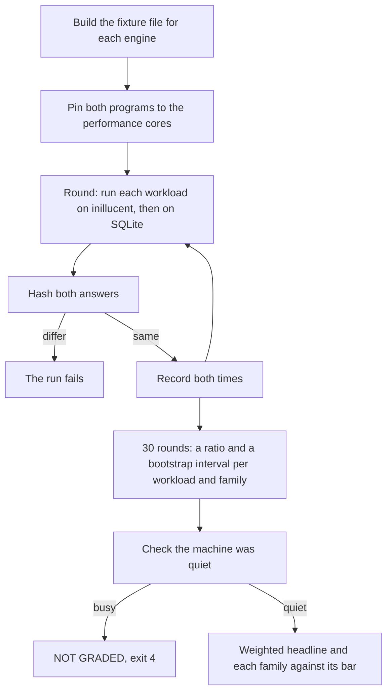

# Performance against SQLite

This page says how fast inillucent is next to SQLite 3.53.4, how much processor time and memory it
uses, and how big its file is. It starts with the results. The method, the machine and the older
measurements come after them. The per workload results of each run are on this page.
[Feature comparison](feature-comparison.md) compares what each engine can do.

## Summary

| | |
|---|---|
| **What was compared** | inillucent against SQLite 3.53.4, built from the official source and run as a separate program over the same data, with the same SQL |
| **Settings on both engines** | `synchronous = FULL`. A 128 MiB page cache: 4,096 frames of 32 KiB for inillucent, `PRAGMA cache_size = -131072` for SQLite. No plan cache on either |
| **Data** | the medium fixture, 100,000 rows |
| **Machine** | Windows 11 on x64, Intel Core Ultra 9 285 (8 performance cores, 16 efficiency cores). Both engines ran on the same eight performance cores |
| **Method** | `inillucent-fullgate`, 34 workloads in ten weighted families, 30 paired rounds a run, four runs in a row, the median of the two middle runs |
| **Correctness check** | every workload's answer is hashed and compared with SQLite's before its time counts. All 34 workloads agreed on every round of all four runs |
| **Run** | 23 September 2026, `main` at `6f84ce6` with `7f93661` applied. This is the newest graded run and every number on this page comes from it unless a section gives another date |

| Measure | SQLite 3.53.4 | inillucent | Result |
|---|---|---|---|
| **Elapsed time**, weighted over the ten families | the reference | 4.97x | **397% faster** |
| **Elapsed time**, 95% lower bound | | 4.62x | **362% faster**. The contract asks for 200% |
| **Processor time**, one round of the whole plan | 1,082 ms | 555 ms | **50% less processor time**, the gate's ratio of 0.500. The contract asks for 0.400, so this bar is missed |
| **Peak resident memory**, one round of the whole plan | 37.22 MiB | 40.76 MiB | **9.5% more**. The one loss |
| **Database file**, the same imported fixture | 16,830,464 B | 17,432,576 B | **3.6% larger** (1.036x) |

The four runs read 4.94x, 5.03x, 4.93x and 5.01x, with 95% lower bounds of 4.72x, 4.70x, 4.46x and
4.53x.

**Slower than SQLite.** Thirty workloads count toward the headline. Twenty four are faster than
SQLite. Six are slower: `prepare.trivial` (75% slower), `join.range` (19% slower),
`extension.fts.build` (5%), `range.lookaside` (4%), `extension.json` (3%) and `txn.autocommit` (2%).
Four more workloads, the correlated subqueries, do not count toward the headline and are far slower.
[The workloads that are slower](#the-workloads-that-are-slower) has each one.

**A later run, not graded.** A run on 24 September 2026 at `52c4b5f` was refused by the gate because
the machine was busy. It does not replace these figures.
[Measured again at `52c4b5f`](#measured-again-at-52c4b5f-on-2026-09-24-and-not-graded) has what it
showed.

## Terms used on this page

| Term | Meaning |
|---|---|
| workload | one timed task, such as `point.rowid` (read one row by rowid) |
| family | a group of workloads that measure one kind of work, such as `read.point`. Each family has a weight in the headline |
| ratio | SQLite's time divided by inillucent's time. 2.00x means inillucent took half as long. A ratio under 1.00x means inillucent is slower |
| paired round | one run of every workload on both engines, one after the other. A ratio is taken from each round |
| gate | a program that runs the plan on both engines and grades the result, such as `inillucent-fullgate` |
| bar | the ratio the performance contract (`compat/perf/contract.toml`) asks of a family |
| floor | 1.00x. No family may be slower than SQLite |
| 95% lower bound | the low end of a bootstrap interval around a ratio. The contract grades the lower bound |
| performance core, efficiency core | the two kinds of processor core on this machine. Performance cores are faster |
| resident memory | the memory the process holds in RAM. The peak is the highest point during a round |
| `fsync` | the system call that waits until data is on the disk. A durable commit needs one |
| [WAL](glossary.md) | the write ahead log. A commit appends to it. It is copied into the file at a checkpoint |
| page pool | inillucent's page cache in memory |
| delta area | space in a leaf page where new rows wait before they are sorted into the page |
| compaction | rewriting a leaf page so the rows in its delta area join its sorted rows |

## How a gate run works



## By family

`weight` is the family's share of the headline. `bar` is the ratio the contract asks of the
family.

The "per round" lower bound is the statistic every gate uses now. It is the lowest and highest of four
pinned passes of `main` at `16c01a4` on 23 September 2026. The "pooled" lower bound is the statistic
the gates used before, from the four runs of the headline.
[How a family's interval is computed](#how-a-familys-interval-is-computed) explains both.

| family | weight | what it measures | result | 95% lower bound, pooled | 95% lower bound, per round | bar |
|---|---|---|---|---|---|---|
| `read.point` | 16% | one row by rowid, by integer key, and through a secondary index | **2,885% faster** (29.85x) | 26.75x | 28.43x to 29.26x | 2.00x, met |
| `large.values` | 4% | text and blobs across the size where a value stops fitting in a leaf | **1,135% faster** (12.35x) | 9.14x | 9.56x to 12.26x | 1.50x, met |
| `read.analytical` | 10% | scans, aggregates, `GROUP BY`, `DISTINCT`, sorts | **971% faster** (10.71x) | 8.45x | 10.39x to 10.81x | 5.00x, met |
| `read.range` | 12% | selective ranges, forward and reverse, covering and not | **402% faster** (5.02x) | 3.95x | 4.79x to 4.99x | 3.00x, met |
| `read.join` | 8% | two table and four table joins | **321% faster** (4.21x) | 2.80x | 4.08x to 4.27x | 3.00x, met on the per round bound, missed on the pooled bound |
| `write` | 20% | insert, update, delete, upsert, with and without indexes | **204% faster** (3.04x) | 2.42x | 2.62x to 2.80x | 1.50x, met |
| `transaction` | 10% | autocommit, small batches, large batches, savepoints | **137% faster** (2.37x) | 1.89x | 1.86x to 1.99x | 1.00x, met |
| `extension` | 8% | JSON, FTS5, R-Tree | **73% faster** (1.73x) | 1.55x | 1.54x to 1.67x | 1.50x, met on all four per round passes, by 2.7% at the narrowest |
| `open.prepare` | 8% | parse, bind, step one row, reset | **69% faster** (1.69x) | 1.27x | 1.66x to 1.69x | 5.00x, missed |
| `schema` | 4% | `CREATE INDEX` and its backfill | **31% faster** (1.31x) | 0.94x | 0.85x to 1.30x | 3.00x, missed |

**The release condition is that no family is below the 1.00x floor.** `schema`'s lower bound read
0.94x, 0.81x and 0.95x on the first three runs and 1.30x on the fourth. `schema` is one workload,
`schema.index`, run once a round, so its bootstrap has three values and the widest interval on the
page. No other family went under the floor on any run.

**`extension`** reads lower bounds of 1.56x, 1.48x, 1.54x and 1.57x on the pooled statistic across the
four runs. Its workloads: `extension.rtree.query` 4.88x, `extension.rtree.insert` 2.32x,
`extension.fts.query` 1.44x, `extension.json` 0.97x (3% slower) and `extension.fts.build` 0.95x
(5% slower, 10.9 µs a document against 10.4).

**`read.join`** reads pooled lower bounds of 2.73x, 2.83x, 2.78x and 2.90x across the four runs.
`join.selective` reads 20.94x and `join.range` 0.84x (19% slower). The pooled bound is set by how far
apart those two workloads are. Under the per round statistic, four pinned passes read 4.27x, 4.08x,
4.18x and 4.19x, so the family meets its 3.00x bar.
[`read.join`'s bar under the per round statistic](#readjoins-bar-under-the-per-round-statistic) has
the decision to keep the bar at 3.00x.

**`transaction`** reads 2.37x. A commit is one append to the log and one `fsync` of the log. The log
is copied into the file when it has grown past 4 MiB, when a caller asks, or when the connection
closes. On the gate's own counters, `txn.autocommit`'s hundred statements make 100 log writes, 100
log syncs, no data file syncs and no checkpoints. `txn.autocommit` reads 0.98x (2% slower), 1.17 ms a
statement against SQLite's 1.15 ms. Both engines do one `fsync` a commit, and on this disk the
`fsync` is most of the millisecond. `txn.batched` reads 3.56x and `txn.large` 3.80x, 2.76 ms a round
against SQLite's 10.50 ms.

### What moved since 2026-09-20

| family | 2026-09-20 | 2026-09-23 | change |
|---|---:|---:|---|
| `write` | 2.12x | **3.04x** | 43% faster |
| `open.prepare` | 1.46x | **1.69x** | 16% faster |
| `extension` | 1.57x | **1.73x** | 10% faster |
| `large.values` | 11.93x | 12.35x | 4% faster |
| `read.point` | 29.34x | 29.85x | 2% faster |
| `read.analytical` | 10.48x | 10.71x | 2% faster |
| `transaction` | 2.36x | 2.37x | no change |
| `read.join` | 4.22x | 4.21x | no change |
| `read.range` | 5.06x | 5.02x | 1% slower |
| `schema` | 1.37x | 1.31x | 5% slower, inside its own noise |
| **weighted** | **4.53x** | **4.97x** | **10% faster** |

Most of the gain is in `write`. A leaf's delta area is now sized by the page's free space instead of
a cap of 32 rows. A compaction whose rows fit the page's existing column widths now adds the new rows
in place instead of rewriting the page. `write.insert.batch` went from about 0.60x to **1.47x** (7.0
µs a row against 10.2), `write.update.indexed` to 3.37x and `write.delete` to 4.16x.
`extension.fts.build` went from 0.69x to 0.95x through the same change. `open.prepare` moved because
`prepare.trivial` went from 0.49x to 0.57x after a compile went from 24 allocations to 13.

The processor figure went from 0.400 of SQLite's to 0.500. The plan gained the four
`read.correlated` workloads since 2026-09-20. They take 182 ms of each round on inillucent against
under half a millisecond on SQLite. They do not count toward the elapsed time headline, but the
processor figure is one round of the whole plan, so they are in it. The four runs read 0.470, 0.520,
0.500 and 0.500 against a bar of 0.400, so the processor bar is missed on all four.

## The workloads that are slower

Thirty workloads count toward the headline. Twenty four are faster than SQLite. These six are not:

| workload | family | ratio | how much slower | time per operation | why |
|---|---|---|---|---|---|
| `prepare.trivial` | `open.prepare` | 0.57x | **75% slower** | 729 ns against 407 | `SELECT 1` is compiled on every call. `inillucent-prepareprofile` counts 13 allocations on the path the gate times. Nine of the thirteen are part of the compiled statement: the bound result columns, the column name, the `Box<BoundSelect>`, the projection expression tree and the output names |
| `join.range` | `read.join` | 0.84x | **19% slower** | 57.1 µs against 48.6 | an index range and a probe per entry. SQLite spreads one statement's overhead over two hundred rows |
| `extension.fts.build` | `extension` | 0.95x | **5% slower** | 10.9 µs a document against 10.4 | FTS5's build is four ordinary row writes a document, so it follows the write path. It was 45% slower on 2026-09-20 |
| `range.lookaside` | `read.range` | 0.96x | **4% slower** | 57.4 µs against 55.7 | 200 rowid probes, the same pattern as `join.range` |
| `extension.json` | `extension` | 0.97x | **3% slower** | 289 ns a call against 282 | the extraction, plus one uncontended mutex and two comparisons a call. The parse of a repeated document and path is already cached |
| `txn.autocommit` | `transaction` | 0.98x | **2% slower** | 1.17 ms a statement against 1.15 | one `fsync` a commit on each engine. On this disk an `fsync` is most of the millisecond |

**Four more workloads are far slower, and the contract does not weight them.** They are the
`read.correlated` family: a subquery that names a column of the outer query and is answered once per
outer row. They are graded against the join that asks the same question, so they have no family bar
and no place in the headline. They are in the plan, so they are in the processor and memory figures.

| workload | inillucent | SQLite | how much slower |
|---|---|---|---|
| `correlated.exists`, `EXISTS` over 400 outer rows | 59.69 ms | 0.29 ms | **21,332% slower** |
| `correlated.in`, `IN (SELECT ...)` over the same | 118.19 ms | 0.10 ms | **118,020% slower** |
| `correlated.exists.selective`, a filter keeps 4 outer rows | 2.11 ms | 0.022 ms | **9,395% slower** |
| `correlated.scalar.selective`, a scalar subquery, 4 outer rows | 2.11 ms | 0.021 ms | **9,839% slower** |

These four figures are from the graded 23 September run. A later change removed a 3.2 MB allocation
that each execution made and freed. In the ungraded 24 September run the four read 0.40 ms, 0.92 ms,
19.5 µs and 17.9 µs. The two selective forms are faster than SQLite there. A correlated `IN` over
400 outer rows is still 809% slower, so write a correlated `IN` against a large table as a join.

`correlated.exists` is the one workload the core count changed: 59.69 ms on the 8 performance cores,
46.35 ms on the 16 efficiency cores and 38.74 ms with all 24 cores available. `read.correlated` uses
more than one thread. Every other workload was faster on the performance cores.

The fastest workloads in the same run: `point.miss` 52.48x, `scan.aggregate` 52.09x, `large.read`
44.69x, `point.rowid` 30.74x, `scan.group` 27.72x, `join.selective` 20.94x, `point.index` 16.34x,
`range.reverse` 15.63x and `range.covering` 8.41x.

## Memory

**Peak resident memory is 40.76 MiB against SQLite's 37.22 MiB, 9.5% more.** The contract asks for
5% less, so this bar is missed. It is the same figure as on 2026-09-20.

Each engine's figure comes from one child process that opens a finished file the parent built and
runs one round of the plan. The processor figure is measured the same way. Neither figure is a
difference taken inside a running program.

The peak after each workload, from the second run of the 23 September set, which is the run the
headline is taken from:

| workload | peak MiB | rise MiB | page pool MiB | everything else MiB |
|---|---:|---:|---:|---:|
| the file opened and the pool warmed | 25.21 | 25.21 | 16.56 | 8.65 |
| every read workload before the correlated ones | 25.27 | at most 0.02 | 16.56 | 8.70 |
| `correlated.exists` | 28.33 | 3.06 | 16.56 | 8.71 |
| `correlated.in` | 31.46 | 3.13 | 16.56 | 8.73 |
| `schema.index` | **40.79** | **9.33** | 22.88 | 11.26 |

The write family does not raise the peak, because the correlated workloads run first and hold more
than the writes need. The correlated workloads take memory and give it back: the resident set reads
25.29 MiB after `correlated.in` while the peak reads 31.46 MiB. `schema.index` sets the peak.

Where the 3.7 MiB difference is:

| | inillucent | SQLite | what it is |
|---|---|---|---|
| the cached database | 16.56 MiB | about 16 MiB | the `.rdb` is 1.036x the size of the `.db`. Under 0.6 MiB of the difference is here |
| the process floor | 8.65 MiB | about 4.2 MiB | 3.62 MiB is what any Rust program costs on this machine before the engine starts. A 130 KB program whose `main` reads its own working set and returns peaks at 3.62 MiB over five runs, 0.66 MiB of it private. The other 5.03 MiB is the engine's code, its statics and opening the file |
| `schema.index`'s rise | 9.33 MiB | about 15.9 MiB | the pages of the new index plus the sort's arena. inillucent's rise is smaller than SQLite's |

Most of the difference is the operating system's cost of a process. The engine's own allocator is
not part of it. The same 130 KB program built with `inillucent-alloc` as its global allocator
measures 3.62 MiB, with 0.66 MiB private. `inillucent-alloc` is a free list per size class. Each list
starts empty and hands a block back to the system allocator when the class is full, so it reserves
nothing up front.

The one remaining place to save memory is the index build's sort arena. An earlier design measured
spilling the sorted run to a temporary file at about 8 ms on a 27 ms statement. That would put the
`schema` family under the 1.00x floor, so it is not done.

[Memory, earlier measurements](#memory-earlier-measurements) has how the figure went from 102% more
to 9.5% more.

## Disk

| | inillucent | SQLite |
|---|---|---|
| the medium fixture, imported | 17,432,576 B | 16,830,464 B |

inillucent's file is 1.036x SQLite's, 3.6% larger.

An integer column in a leaf is as wide as its values need: 1, 2, 4 or 8 bytes, the narrowest that
holds every value in the leaf. A file written before that change reads unchanged, because its pages
say 8 bytes. Tree by tree over the medium fixture, at 32 KiB pages:

| tree | pages at 8 bytes | pages now | entries per page |
|---|---|---|---|
| `main_table` | 468 | **388** | 241 |
| `main_category` | 85 | **34** | 2,941 |
| `main_key` | 57 | **23** | 3,704 |
| `side_table` | 30 | **16** | 1,190 |
| `side_owner` | 15 | **4** | 4,167 |
| `wide`, a text column | 58 | 58 | 6.9 |

`main_category` leads on a column with 64 distinct values, so its width is one byte and it saves the
most. `wide` holds text and does not change, which checks that nothing narrowed that should not.

A table built with `INSERT ... SELECT` instead of an import is larger: 200,000 rows are 15.9 MB in
inillucent against 8.7 MB in SQLite, at 32 KiB pages. The redo log shrinks to 0.0 MB at a
checkpoint. It used to keep 94.6 MB across two segments.

## Other table sizes

The headline uses the medium fixture, 100,000 rows. The small and large fixtures were measured in the
same window on 23 September 2026, pinned the same way, two runs each:

| | 5,000 rows | 100,000 rows | 600,000 rows |
|---|---|---|---|
| weighted | 3.87x, **287% faster** | 4.97x, **397% faster** | 5.34x, **434% faster** |
| 95% lower bound | 3.78x | 4.62x | 5.10x |
| `write` | 1.05x, **5% faster**, under the floor on one run | 3.04x | 6.32x, **532% faster** |
| `extension` | 1.82x, lower bound 1.66x | 1.73x, lower bound 1.55x | 2.00x, lower bound 1.88x |
| processor, inillucent against SQLite | 242 ms against 840, **71% less** | 555 against 1,082, **50% less** | 1,227 against 945, **30% more** |
| peak memory, inillucent against SQLite | 16.23 MiB against 9.36, **73% more** | 40.76 against 37.22, **9.5% more** | 188.13 against 181.83, **3.5% more** |

`write` improves as the table grows, because a bigger table spreads a statement's setup cost over
more of a page. At 5,000 rows three of the five `write` workloads are slower than SQLite. At 600,000
rows inillucent uses more processor time than SQLite for the whole plan, although it finishes sooner.
At 5,000 rows the memory figure is mostly the process floor described under [Memory](#memory).

## Linux

**The same binary measured 53% faster than SQLite on Linux when Windows measured 279% faster.** The
Linux figure has not been measured again since. The Windows headline is now 397%, so compare the two
old figures with each other, and not with the headline.

The cause is SQLite's side, and the allocator on inillucent's side. With a free list per size class
in place of the system allocator, a `SELECT 1` compile goes from 46.95 ms to 38.97 ms on Windows (17%
faster) and from 39.91 ms to 38.20 ms on Linux (4% faster). The two platforms then run at the same
speed. On the Windows compile, the C runtime's heap was 59% of the time. SQLite does work with the
operating system on every statement, and Windows charges more for that work than Linux does. SQLite's
time is the denominator of every ratio, so the ratio changes between platforms while inillucent's own
time does not.

Neither the allocator change, which took the Windows medium gate from 3.24x to 3.86x, nor any later
change has been measured on Linux.

## What this page does not measure

- **The API an application uses.** The gate calls the engine's `plan`, `prepare` and `pipeline`
  functions directly. It never calls `Database::open`, never opens a `Connection` and never steps a
  `Statement`. So no figure here includes the plan cache lookup, the parameter count, a `String` per
  result column per execution, the dirty frame walk on release, or the file lock a statement takes
  outside a transaction under `locking_mode = normal`. `inillucent-fullgate --api connection` drives
  `Connection::prepare` and `Statement::step`. `--api both` runs the two in the same round, so the
  difference is paired. `inillucent-prepareperf` measures the lock cost: `SELECT 1` once cost 132,884
  ns outside a transaction against 1,126 ns inside one, on the same connection and file, and costs
  10,095 against 727 now. Both readings were taken on a busy machine, so the ratio between them is
  the result and the nanoseconds are not.
- **A table larger than the page pool.** Every family here fits in the pool.
  `story_large_table_nightly` in the `nightly` test tier builds a table larger than the pool, then
  scans, sorts and deletes half of it.
- **More than one machine.** One Windows 11 x64 machine. `tests/performance-history.tsv` records the
  machine in its `machine` column as `machine-` and eight hex digits, a digest of the machine's name.
  Rows from two machines can be told apart without publishing the name. `INILLUCENT_MACHINE` sets the
  label directly, for example `ci-linux-x64`.
- **A disk that keeps up.** Part way through a sequence of four runs, `txn.batched` (200 commits and
  200 `fsync` calls) went from 309 ms to 895 ms on SQLite's own side, with the same fixture and the
  same binary, because the disk stopped keeping up with the couple of gigabytes a sequence writes.
  The pattern held in all twelve runs across three sequences. That row is published beside every run
  so a reader can tell a slow disk from a slow engine.
- **Processor time per workload.** The gate reports it, but Windows counts it in scheduler ticks of
  15.625 ms. Quote only the per round totals.

## Method

### Both engines on the performance cores

The Core Ultra 9 285 has 8 performance cores and 16 efficiency cores. `inillucent-fullgate` runs
inillucent in its own process and SQLite in a child process. On 2026-09-23, with no affinity set,
Windows ran the gate on the efficiency cores and the SQLite child on the performance cores. Nothing
in the gate's output showed this. The same gate pinned each way, read families, milliseconds for
inillucent and for SQLite:

| workload | both on performance cores | both on efficiency cores | not pinned |
|---|---|---|---|
| `scan.aggregate` | 1.76 and 92.9 | 2.97 and 115.9 | **2.95** and **92.9** |
| `scan.group` | 2.77 and 76.5 | 6.48 and 90.9 | **6.31** and **77.9** |
| `scan.sort` | 22.5 and 116.6 | 32.2 and 153.8 | **31.7** and **120.9** |
| `join.range` | 28.4 and 24.1 | 34.2 and 34.2 | **33.7** and **25.1** |

Not pinned, inillucent ran at its efficiency core speed and SQLite at its performance core speed.

**The published run pins both engines.** The gate process was started with affinity mask
`0xC03C03`: logical processors 0, 1, 10, 11, 12, 13, 22 and 23, the eight that Windows reports with
the higher efficiency class. The SQLite child inherits the mask. The weighted headline three ways,
four runs each unless marked:

| where both engines ran | weighted | 95% lower bound |
|---|---|---|
| **both on the performance cores**, the published figure | **4.97x** | 4.62x |
| both on the efficiency cores, two runs | 5.72x | 5.35x |
| not pinned: inillucent on efficiency cores, SQLite on performance cores | 4.40x | 4.27x |

The published figure compares the two engines on the same hardware, the fastest this machine has.
The 4.40x is what an unpinned run on this machine can report. It depends on where the scheduler puts
each process, so it describes neither engine.

The core type also explains an apparent slowdown. Two gates of `420e68a` on 2026-09-22 read
`scan.aggregate` at 1.80 and 1.76 ms. Later passes of the same commit on 2026-09-23 read 2.96 to 2.98
ms. The 2026-09-20 run read 1.70 to 1.73 ms against SQLite's 92.5 to 93.8 ms. The difference is the
core type each run happened to use.

The gates now pin themselves; [Reproducing it](#reproducing-it) has the options. The 23 September run
was taken before that change, with the same mask set on the gate process from outside.

### How a ratio is taken

The gate pairs the two engines round by round and reports the median of the thirty paired ratios.
The figure on this page is the median of the two middle runs of four. An absolute time beside it is
the median of the four runs' own medians. These are two summaries of one set of rounds, so dividing
the printed times gives a number close to the printed ratio. For `scan.sort`, 22.88 ms and 125.22 ms
divide to 5.47, and the paired figure is 5.43x. The contract grades the paired figure, and this page
quotes it.

The headline is a weighted geometric mean of the family ratios, with the weights in
[By family](#by-family).

### How a family's interval is computed

**Every gate grades a family on one value per round.** That value is the mean of the round's log
ratios over the family's workloads. The bootstrap resamples the rounds. The headline has always
treated each family this way, in `weighted_headline`. `perf::family_interval` computes it for
`inillucent-fullgate`, `inillucent-readgate`, `inillucent-writegate`, `inillucent-scorecard`,
`inillucent-analytical` and `inillucent-prepareperf`. A round in which any workload of the family has
no usable time is left out whole, so every round has the same mix of workloads.

**The gates used to pool the rounds.** They put every workload's every round into one list and
bootstrapped that list. A resample draws the workloads in random proportions. When a family's
workloads are far apart, the proportion moves the mean more than timing noise does. The pooled
interval then measures the distance between the workloads. `read.join` is the clearest case:
`join.selective` reads about 21x and `join.range` about 0.86x, and the pooled interval was about
2.8x to 6.5x. The pooled bound can be predicted from the two workload ratios alone, as
`exp(m - 1.96 * (d / 2) / sqrt(60))`, where `m` is the mean of the two log ratios and `d` is the gap
between them. The prediction matched the printed bound to within 0.07x on every clean pass at every
build.

**Measured on 2026-09-23**, 20:21:56 to 20:52:09Z, in a quiet window: 22 passes, medium fixture, 30
rounds, the full gate at a 32 KiB page, every pass pinned to `0xC03C03` with the mask read back from
the SQLite child. `main` was `16c01a4` with the per round change applied, built to print both
statistics from the same samples. Four passes of `main`, in order:

| family | bar | family ratio | pooled lower bound | met | per round lower bound | met | per round width over pooled width |
|---|---|---|---|---|---|---|---|
| `open.prepare` | 5.00x | 1.71, 1.69, 1.69, 1.71 | 1.28, 1.27, 1.27, 1.30 | 0 of 4 | 1.68, 1.67, 1.66, 1.69 | 0 of 4 | 0.05 to 0.07 |
| `read.point` | 2.00x | 29.63, 29.66, 29.02, 29.21 | 26.76, 26.92, 26.37, 26.52 | 4 of 4 | 28.62, 29.26, 28.60, 28.43 | 4 of 4 | 0.13 to 0.30 |
| `read.range` | 3.00x | 4.97, 4.91, 4.97, 5.04 | 3.87, 3.85, 3.90, 3.94 | 4 of 4 | 4.86, 4.79, 4.91, 4.99 | 4 of 4 | 0.04 to 0.11 |
| `read.join` | 3.00x | 4.37, 4.15, 4.22, 4.23 | 2.90, 2.75, 2.78, 2.81 | **0 of 4** | 4.27, 4.08, 4.18, 4.19 | **4 of 4** | 0.02 to 0.05 |
| `read.analytical` | 5.00x | 10.95, 10.56, 10.56, 10.70 | 8.54, 8.26, 8.24, 8.39 | 4 of 4 | 10.81, 10.39, 10.48, 10.62 | 4 of 4 | 0.03 to 0.06 |
| `write` | 1.50x | 3.22, 3.20, 3.20, 3.29 | 2.81, 2.79, 2.72, 2.80 | 4 of 4 | 2.75, 2.80, 2.62, 2.72 | 4 of 4 | 0.95 to 1.20 |
| `transaction` | 1.00x | 2.26, 2.33, 2.21, 2.21 | 1.88, 1.93, 1.82, 1.78 | 4 of 4 | 1.93, 1.99, 1.98, 1.86 | 4 of 4 | 0.52 to 0.83 |
| `schema` | 3.00x | 1.19, 1.44, 1.48, 1.19 | 0.94, 1.30, 1.30, 0.85 | 0 of 4 | 0.94, 1.30, 1.30, 0.85 | 0 of 4 | 1.00 |
| `extension` | 1.50x | 1.63, 1.70, 1.67, 1.63 | 1.45, 1.55, 1.51, 1.47 | **2 of 4** | 1.54, 1.67, 1.60, 1.54 | **4 of 4** | 0.14 to 0.46 |
| `large.values` | 1.50x | 13.81, 12.10, 10.93, 12.84 | 9.92, 8.78, 7.60, 9.22 | 4 of 4 | 12.26, 11.79, 9.56, 11.43 | 4 of 4 | 0.08 to 0.47 |

The read gate on `main`, two passes, reads `read.join` at 2.86x and 2.81x pooled against 4.19x and
4.06x per round, and meets every other read family's bar under both statistics. The write gate, two
passes, meets both its bars under both.

- **Families that pass only under the per round statistic.** On `main`: `read.join` on all six passes
  of the two gates that grade it, and `extension` on two of the four full gate passes. On older
  builds: `read.analytical` at `f9e2374` on all four passes and at `b0ba286` on both full gate
  passes, and `read.range` at `b0ba286` on one full gate pass of two (2.99x pooled, 3.61x per round).
- **No family goes from met to missed** on any pass of any build, and no family changes side of the
  1.00x floor. `schema` has one workload, so both statistics give it the same interval.
- **`write` is the one family whose bound goes down.** Its per round interval is 0.95 to 1.20 times
  as wide as the pooled one. Its five workloads are slow in the same rounds and fast in the same
  rounds. The pooled list treated each value as independent and so claimed more precision than
  `write` has.

Five tests were written down before the passes ran:

| test | result |
|---|---|
| 1. The two statistics agree on the centre | held: the read gate's per round centre matched the pooled mean to the second decimal on all eight family readings |
| 2. A family of one workload does not change | held: `schema`'s two intervals are identical on all ten full gate passes |
| 3. The width is timing noise. For k workloads with log half widths h, the per round log half width falls between `0.5 * sqrt(sum(h^2)) / k` and `1.5 * max(h)` | held for every family on all 22 passes. For `read.join` the per round log half width is 0.010 to 0.057 and the pooled one is 0.31 to 0.42 |
| 4. The per round bound orders builds the way the family ratio does | held on the full plan (`b0ba286` < `a8f45b1` < `main` < `f9e2374` by both). On the read gate's plan it held for `57e87b0` at the top and `main` at the bottom. The three builds between have family ratios of 4.51x, 4.49x and 4.56x and per round bounds of 4.385x, 4.38x and 4.38x. The pooled bound put `b0ba286` (3.09x) above `f9e2374` (3.005x), the reverse of their family ratios |
| 5. Repeat passes of one build give closer per round bounds than pooled ones | **failed**: the per round bound varied more between passes in 33 of 62 groups of one build, one gate and one family |

The per round statistic is kept despite test 5. The pooled bound is the family ratio minus a width
set by the distance between the workloads. That distance does not change between passes, so the
pooled bound moves only when the family ratio moves. The per round bound also moves with each pass's
noise. Test 5 therefore favoured the statistic that ignores noise, which is what test 3 rejects. The
pooled bound fails test 3 by a factor of ten on `read.join`.

**One pass's interval does not cover the next pass.** On the four full gate passes of `main`, the
family ratio moved between passes by more than the per round half width in eight of the ten
families. `read.join` read 4.15x to 4.37x, 5.2% apart, with a per round half width of about 1.5%.
Something that is constant within a pass and different between passes moves every round of that pass
together, and no statistic inside one pass can see it. The next section is what it turned out to be.

### How a verdict should be taken

**What moves a family between passes is mostly how busy the machine is.** SQLite's side is the same
`sqlite-bench.exe` in every pass, so its speed against its own fastest pass measures the machine.

**Twelve passes in one quiet window**, 2026-09-24 00:43:28 to 01:12:07Z, medium fixture, 30 rounds,
mask `0xC03C03`, every workload agreeing on every pass. The order was A B B A A B B A A B B A. A is
the default. B is `--engine-child`, which runs inillucent's side of each round in a new process, the
way SQLite's side always runs. SQLite's speed stayed within 0.4% to 1.4% of its fastest pass for all
29 minutes.

| family | A centres, 6 passes | B centres, 6 passes | one pass's interval contains another pass's ratio, A | the same, B |
|---|---|---|---|---|
| `open.prepare` | 1.67 to 1.72 | 1.65 to 1.67 | 87% | 93% |
| `read.point` | 28.97 to 30.15 | 29.50 to 29.76 | **57%** | 90% |
| `read.range` | 4.96 to 5.07 | 4.97 to 5.04 | 77% | 87% |
| `read.join` | 4.19 to 4.27 | 4.23 to 4.28 | **67%** | 100% |
| `read.analytical` | 10.62 to 10.77 | 10.51 to 10.73 | 80% | **57%** |
| `write` | 2.89 to 3.49 | 2.90 to 3.49 | 100% | 100% |
| `transaction` | 2.04 to 2.38 | 2.04 to 2.29 | 100% | 97% |
| `schema` | 1.32 to 1.63 | 0.90 to 1.20 | 70% | 100% |
| `extension` | 1.68 to 1.79 | 1.52 to 1.76 | 80% | 83% |
| `large.values` | 10.63 to 12.78 | 9.87 to 12.79 | 73% | 70% |

The centres are the per round geometric means from the raw samples. The two coverage columns compare
each pass's ratio with every other pass's interval, 30 pairs a mode. The expected coverage is about
83%: two passes that differ only by round noise differ by √2 times one pass's spread, and a 95%
interval around one contains the other about 83% of the time. A figure well under 83% means a
component that stays constant within a pass and changes between passes.

1. **In mode A, inillucent's side moves between passes more than SQLite's.** The log standard
   deviation of the pass centres was 0.0110 against 0.0033 for `read.point`, 0.0068 against 0.0057
   for `read.range`, 0.0047 against 0.0033 for `read.analytical` and 0.0070 against 0.0068 for
   `read.join`. The movement is in short workloads: across the six A passes `point.rowid` spans
   6.9%, `point.miss` 6.4%, `extension.rtree.query` 5.3%, `scan.distinct` 3.9%, `range.reverse`
   3.3% and `join.selective` 2.4%.
2. **Mode B removes most of that.** Pooled over the ten families, the between pass standard deviation
   of the family log ratio fell from 0.0119 in A to 0.0020 in B. `point.miss` went from 6.4% to 1.3%,
   `extension.rtree.query` from 5.3% to 1.0%, `scan.distinct` from 3.9% to 1.0% and `join.selective`
   from 2.4% to 0.4%. Two results do not fit: `point.rowid` still spans 5.2% in B, and
   `read.analytical` covers worse in B (57%) than in A (80%). One explanation that fits is memory
   layout, which is fixed when a process starts. The passes did not test it.
3. **Mode B is a different measurement, so it is not the default.** A new process pays for the first
   touch of every page inside the clock. inillucent took about 157,400 page faults a round in B and
   about 147,400 in A. SQLite's child took 11,634 to 11,640 on every pass. In B, `schema` fell under
   the 1.00x floor on all six passes (lower bounds 0.52x to 0.96x) and `extension` missed its 1.50x
   bar on five of six (lower bounds 1.26x to 1.48x). `--engine-child` stays a diagnostic option.

**Five passes on a busy machine**, 2026-09-24 05:19:03 to 05:33:10Z. Processor load was 16% to 37%
before and between the loads, and Memory Compression held 12.7 GB. Each arm's figure is the geometric
mean over the 12 read workloads of that pass's median time, over the median of the six A passes of
the quiet window. Bold values are outside the quiet window's range, and every one is above it.

| pass | SQLite | inillucent | `read.join` | `read.analytical` | `read.range` | `read.point` |
|---|---|---|---|---|---|---|
| quiet window, six A passes | reference | reference | 4.19 to 4.27 | 10.62 to 10.77 | 4.96 to 5.07 | 28.97 to 30.15 |
| 1 | +20.0% | +10.6% | **4.57** | **11.30** | **5.44** | **32.16** |
| 2, after a write load (1.74 GB) | +9.9% | +5.8% | **4.42** | **11.20** | **5.32** | 29.42 |
| 3 | +7.7% | +5.9% | **4.38** | **11.10** | 5.06 | 28.99 |
| 4, after a build load (80 s) | +8.5% | +5.5% | **4.34** | **11.12** | **5.14** | 29.16 |
| 5 | +8.1% | +4.8% | **4.48** | **11.14** | **5.12** | 29.37 |

**A busy machine slows SQLite's side about twice as much as inillucent's, so it makes inillucent
look faster.** The first pass of the 23 September family statistic window, which put `read.join` at
4.37x, had SQLite's side 5% to 7% slow. Why SQLite suffers more is not established. It is not page
faults. One difference is that SQLite's side is a new process each round and fills its cache while a
workload is timed. inillucent's pool is warmed before the clock starts.

The rules the gates follow:

1. **A verdict comes from one pass on a machine that pass shows was quiet.** Consecutive passes share
   the machine's state, so their mean carries the same bias with a narrower interval.
2. **The gates check the machine.** `inillucent-fullgate`, `inillucent-readgate` and
   `inillucent-writegate` print a section with SQLite's speed index over the point, range, join and
   analytical workloads, the reference file and when it was recorded. Over the twelve quiet passes
   that index was at most 1.39%. On every busy pass it was at least 4%. Above 3%, every verdict reads
   NOT GRADED and the gate exits 4. Exit 1 is a miss and exit 2 is a run that measured nothing.
3. **The reference is kept per machine**, outside the checkout, at
   `%LOCALAPPDATA%\inillucent\quiet-reference\<host>\<scale>.tsv` (or under `XDG_DATA_HOME` or
   `~/.local/share` on Linux). `INILLUCENT_QUIET_REFERENCE_DIR` overrides the folder. Run a gate
   with `--record-quiet-reference` while the machine is idle to write it. With no reference the pass
   is graded and the section says the machine was not checked. `--quiet-threshold <percent>` changes
   the 3% limit.
4. **On a quiet machine one pass is enough for every verdict today.** The between pass standard
   deviation of the family log ratio is 0.3% to 1.1% for the read families, 1.35% for `extension` and
   3.2% for `large.values`. The family closest to its bar is `extension`, at 1.68x to 1.79x against
   1.50x, more than eight standard deviations away. On the quiet window its lowest per round bound in
   six A passes was 1.58x.
5. **No bound is widened and no bar moves.** The bias from a busy machine is upward, so a wider
   interval around an inflated centre can still pass.

The 147,400 page faults a round in mode A came from one allocation, since removed. 93% of them were
in `correlated.in` (91,390 an execution) and `correlated.exists` (45,414). A correlated subquery reads
the outer row through parameters numbered from 100,000, and the parameter set was one vector indexed
by number, so the first such write grew it to 100,001 entries, 3.2 MB. Each execution made and freed
58 of them. The engine's own slots are now a separate list (`physical::Slots`). On the medium fixture
the full plan now takes 4,196 to 4,285 faults a round after the first, against SQLite's 11,638, and
3,131 of those are `schema.index`. In a debug build `correlated.exists` went from 75 ms an execution
to 7.2 ms and `correlated.in` from 138 ms to 17.7 ms. Every graded `read.correlated` ratio on this
page predates this change.

### `read.join`'s bar under the per round statistic

**The bar stays at 3.00x.** The family's lower bound on five builds back to `57e87b0`, pinned, two
passes each except `main`:

| build | full plan, per round | full plan, pooled | read gate plan, per round | read gate plan, pooled | `join.selective` and `join.range`, full plan |
|---|---|---|---|---|---|
| `57e87b0`, the first build graded | no full gate | no full gate | 4.69x, 4.52x | 3.23x, 3.18x | no full gate |
| `b0ba286` | **3.23x, 3.18x** | 2.42x, 2.38x | 4.42x, 4.35x | 3.11x, 3.07x | 11.15x and 0.97x, 11.03x and 0.95x |
| `a8f45b1` | 4.17x, 4.07x | 2.78x, 2.76x | 4.39x, 4.37x | 2.91x, 2.96x | 20.89x and 0.85x, 20.32x and 0.85x |
| `f9e2374` | 4.33x, 4.21x | 2.92x, 2.82x | 4.56x, 4.20x | 3.04x, 2.97x | 21.27x and 0.90x, 20.62x and 0.87x |
| `main` at `16c01a4` | 4.27x, 4.08x, 4.18x, 4.19x | 2.90x, 2.75x, 2.78x, 2.81x | 4.19x, 4.06x | 2.86x, 2.81x | 20.36x to 21.68x and 0.86x to 0.88x |

Every build since the family was first graded meets 3.00x on both plans under the per round
statistic. Under the pooled statistic no build ever met it on the full plan. The reasons to keep
3.00x:

1. **3.00x is the number the contract meant, on the statistic it meant.** It is the "low estimate"
   column of `tasks/task-1816-rearchitecture-tdd.md`, where a family's ratio is the geometric mean
   over its workloads. The per round statistic grades exactly that. Nine of the ten family bars come
   from that column. The tenth is `read.analytical`, at 5.00x against a low estimate of 8x.
2. **Moving the bar now would choose it from the measurement.** `main` reads 4.08x at its lowest, and
   a bar of 4.00x would be that reading rounded down. `compat/perf/contract.toml` says why a
   threshold that moves toward the measurement is not a threshold.
3. **Builds that existed met 3.00x by a small margin.** `b0ba286` met it on the full plan at 3.18x
   and 3.23x, with `join.selective` at 11x. With today's `join.range` of 0.86x, the family drops under
   3.00x if `join.selective` falls from about 21x to about 10.5x, or if `join.range` falls to about
   0.43x. Either is a loss of half a workload's speed.
4. **The bar does not catch the 26% of its time `join.range` lost since `b0ba286`.** That loss moved
   the family 8% on the read gate's plan (4.71x at `57e87b0` to 4.32x on `main`, the mean of two
   passes each).

`join.range` is still slower than SQLite, at 0.84x to 0.88x. The design document expected the hash
join to fix its 0.015x. It went from 0.015x to 0.86x.

## Reproducing it

```sh
cargo build --release

# the pinned SQLite 3.53.4 reference build
pwsh tools/sqlite-reference.ps1      # Windows
bash tools/sqlite-reference.sh       # Linux

# The fixtures are not checked in (1.2 MB, 17 MB and 94 MB). Each gate run needs its own copy:
# schema.index leaves an index behind on the SQLite side, so a second run against the same file
# stops on `index main_label already exists`.
bash tools/build-gate-fixtures.sh <dir>
cp <dir>/medium.db <dir>/medium-run1.db

target/release/inillucent-fullgate <dir>/medium-run1.db --scale medium --rounds 30 \
    --page-size 32768 --frames 4096
target/release/inillucent-readgate  <dir>/medium-read.db  --scale medium
target/release/inillucent-shellrss                        # peak memory, one shell each, same data
```

**Every program that times inillucent against SQLite pins itself to one class of core before it
times anything.**

| Option or output | What it does |
|---|---|
| `--cores performance` | the default. The processors with the highest `EfficiencyClass` that `GetSystemCpuSetInformation` reports on Windows, or the highest `cpu_capacity` or `cpuinfo_max_freq` on Linux |
| `--cores efficiency` | the other class |
| `--cores any` | no pinning, to take the unpinned figure on purpose |
| a machine with one class of core, or macOS | not pinned. macOS has no call for it |
| `## configuration` block (`inillucent-fullgate`, `inillucent-writegate`, `inillucent-searchgate`), `## cores` block (the other programs) | prints the class and the mask, for example `performance - 8 of 24 logical processors, mask 0xC03C03` |
| `cores` column of `tests/performance-history.tsv` | records the same |
| a child such as `sqlite-bench` | inherits the mask. The launcher reads the child's mask back and refuses to time it when the mask differs. `crates/inillucent-compat/tests/tooling/affinity.rs` fails if a child can run on other processors |

Pinning makes `correlated.exists` slower, as [the workloads that are
slower](#the-workloads-that-are-slower) shows.

The gate programs and the shell install `inillucent-alloc` as their global allocator. It is part of
the build in the same way as fat link time optimisation and a single codegen unit. SQLite ships its
own memory allocator, so measuring inillucent on the platform allocator would measure a build
setting. `inillucent-alloc` is worth 3.24x to 3.86x on the medium gate.

`inillucent-fullgate` also takes `--samples <file>`, which appends every round's raw time for both
engines and every workload, with each round's process costs and page fault count, and
`--engine-child`, described under [How a verdict should be taken](#how-a-verdict-should-be-taken).
Both are off by default.

[Repository](repository.md) covers the other measurement programs and the test runner.

## Earlier and supporting measurements

The sections below are measurements behind the figures above, and measurements of single changes.
Each gives its own date and method. None of them replaces the headline.

### Measured again at `52c4b5f` on 2026-09-24, and not graded

Four full gate passes of `main` at `52c4b5f`, pinned to the performance cores, 30 rounds each. **The
gate refused to grade all four.** SQLite's side ran 6.71% to 7.42% slower than the machine's recorded
idle reference, against a limit of 3%. Firefox and WebView used about 1.2 cores throughout. A busy
machine slows SQLite's side more than inillucent's, so every ratio from these passes is too high.
They read 5.31x to 5.47x weighted. That figure is not a headline and is not compared with 4.97x.

Against the graded 23 September run, SQLite's own times in these passes are 2% to 5% slower on most
workloads and inillucent's are 2% to 8% faster. Some workloads moved far more than a 7% bias:

| workload | graded 2026-09-23 | at `52c4b5f`, not graded | SQLite at `52c4b5f` |
|---|---|---|---|
| `correlated.exists`, 400 outer rows | 59.69 ms | **0.40 ms** | 0.30 ms |
| `correlated.in`, 400 outer rows | 118.19 ms | **0.92 ms** | 0.10 ms |
| `correlated.exists.selective` | 2.11 ms | **19.5 µs** | 23.7 µs |
| `correlated.scalar.selective` | 2.11 ms | **17.9 µs** | 22.3 µs |
| `join.range`, a probe | 57.1 µs | **53.7 µs** | 51.2 µs |
| `range.lookaside`, a probe | 57.4 µs | **52.4 µs** | 57.8 µs |
| processor time, one round of the plan | 555 ms | **367 ms** | 1,102 ms |
| peak resident set, one round of the plan | 40.76 MiB | 40.88 MiB | 37.22 MiB |

- **The correlated subqueries are 99% cheaper.** Each execution used to grow a slot array to 100,001
  entries (3.2 MB), and `correlated.exists` made and freed 58 of them each time it ran: 45,414 page
  faults an execution, and 91,390 for `correlated.in`. Those faults are now 0. The two selective
  forms are faster than SQLite. `correlated.exists` is 35% slower and `correlated.in` 809% slower,
  where they were 21,332% and 118,020% slower.
- **Processor time follows.** The four correlated workloads took 182 ms of each round on 23 September
  and take under 2 ms now. One round of the plan is 367 ms against SQLite's 1,102 ms, a ratio of
  0.335, under the contract's 0.400 bar. The pass was not graded, so the bar is not claimed as met.
- **`join.range` is 6% cheaper a probe**, because a leaf column is read once and a probe key whose
  affinity changes nothing is no longer copied. It reads 0.95x, inside the busy machine's bias.
- **`range.lookaside` reads 1.10x**, faster than SQLite, but also inside the bias. It stays on the
  list of slower workloads until a graded pass says otherwise.
- **Memory did not move.** A busy machine does not bias the memory figure.

The workloads that depend on the disk moved between the four passes by more than any engine change.
`txn.autocommit` read 1.88x, 1.91x, 0.99x and 1.00x, and `extension.fts.build` 0.63x, 0.69x, 0.99x
and 0.99x, mostly because SQLite's side changed. Nothing is concluded from them.

### Runs of one family alone, 2026-09-15 and 2026-09-20

A family measured on its own is a different measurement from the same family inside the whole plan.
The plan's other workloads decide what is in the page pool when the family runs. The contract grades
the whole plan. The roadmap quotes these runs.

| run | `extension` | 95% lower bounds | `extension.fts.build` | `extension.fts.query` |
|---|---|---|---|---|
| `extension` alone, 2026-09-15, four runs | 1.58x, 1.60x, 1.59x, 1.67x | 1.40x, 1.39x, 1.39x, 1.45x | 0.56x to 0.58x | 1.70x to 1.85x. 1.77x run on its own, against 1.43x with the reverted segment format |
| whole plan, 2026-09-20, four runs | 1.57x | 1.17x, 1.33x, 1.38x, 1.45x | 0.69x | |
| whole plan, 2026-09-23, four runs | 1.73x | 1.56x, 1.48x, 1.54x, 1.57x | 0.95x | 1.44x |

| run | `read.join` | 95% lower bounds | `join.selective` | `join.range` |
|---|---|---|---|---|
| `read.join` alone (`--families read.join`), 2026-09-15, four runs | 6.46x, 6.26x, 6.14x, 5.60x | 4.11x, 4.00x, 4.02x, 3.67x | 35.49x | 1.17x |
| `read.join` alone, before the chain reuse change | | 2.97x, 3.00x, 3.00x, 2.99x | | |
| whole plan, 2026-09-23, four runs | 4.21x | 2.73x, 2.83x, 2.78x, 2.90x (pooled) | 20.94x | 0.84x |

### Why `read.join` misses its 3.00x bar, and when it last met it

This section explains the pooled bound's misses. Under the per round statistic the family meets its
bar ([`read.join`'s bar under the per round
statistic](#readjoins-bar-under-the-per-round-statistic)).

**Method.** 60 passes on 2026-09-23, `inillucent-readgate` and `inillucent-fullgate`, medium
fixture, 30 rounds, every pass pinned from outside to `0xC03C03`, the mask read back from the SQLite
child as `0xC03C03` all 60 times. Builds from before the gates pinned themselves cannot pin
themselves, so HEAD was pinned the same way. Passes 1 to 3 ran at 6% to 9% machine load from another
test. The rest ran on an idle machine.

**The 3.00x bar was never measured.** It is the "low estimate" column of the performance contract in
`tasks/task-1816-rearchitecture-tdd.md`, written when `read.join` read 0.154x.
`inillucent-readgate` first graded it at `57e87b0`, which read the family at 4.87x with a lower bound
of 3.32x.

**The pooled bound mostly measures the distance between the two workloads.** On HEAD each workload
is measured to within 2%: `join.selective` 20.30x to 22.14x and `join.range` 0.85x to 0.89x. The
pooled family interval beside them is 2.76x to 6.67x. For the pooled bound to reach 3.00x,
`0.3735 * ln(join.selective) + 0.6265 * ln(join.range)` has to reach `ln 3`. On two pinned passes
of HEAD the per round statistic read 4.15x [4.11x, 4.21x] and 4.17x [4.16x, 4.25x].

**`join.range` lost 26% of inillucent's time, in four steps.** On the read gate's plan, pinned,
inillucent in milliseconds, forward sweep / reverse sweep, with SQLite at 23.9 to 24.6 ms on every
pass:

| build | `join.range` | step |
|---|---|---|
| `57e87b0` | 22.21, 23.00, 22.39, 22.00 | the build the bar was first met on |
| `b0ba286` | 22.37 / 22.62 | |
| `ea03335` | 23.44 / 23.36 | **+1.0 ms** in the 15 commits before it |
| `3322436`, `1334b80`, `59ccf91` | 23.27 to 23.72 | |
| `71d014a` | 24.12 / 24.15 | **+0.8 ms** in the 30 commits before it |
| `566c688`, the narrow integer slot change | 24.23 / 24.01 | |
| `a8f45b1`, five follow on changes | 27.03 / 26.77 | **+2.8 ms in this one commit** |
| `f9e2374` | 25.86 / 26.05 | 1.0 ms back |
| `b3ad244` to `a07036b` | 26.07 to 26.53 | |
| `dcc65f2` | 27.37 / 27.52 | **+1.0 ms** in the 25 commits before it |
| `36939dd`, `5353eb4` | 27.03 to 27.59 | |
| `d389021` | 27.96 / 27.88 | **+0.9 ms** in the 25 first parent commits before it (41 with the merged branches) |
| HEAD | 27.88 / 28.00 | |

The two sweeps agree at every build to within 0.4 ms. The full gate's plan shows the same drift:
25.61 and 25.41 ms at `b0ba286`, 27.55 and 27.38 at `f9e2374`, and 28.08 to 28.43 on HEAD.

On the read gate's plan the pooled bound last met 3.00x at `57e87b0` and `b0ba286`, where
`join.range` read 1.04x to 1.10x and the pooled bound 3.03x to 3.28x. On the full plan no build met it
pinned. `b0ba286` read 2.20x and 2.38x, because `join.selective` was 11x then.

#### The +2.8 ms at `a8f45b1`

`a8f45b1` did five things. Three have a switch: the constant `FRAME_OF_REFERENCE`, the `(u16, u16)`
heap pair `heap_slot_width`, and the release profile's `panic = "abort"` with `strip = true`
(`CARGO_PROFILE_RELEASE_PANIC` and `CARGO_PROFILE_RELEASE_STRIP` override them). 39 passes of
`inillucent-readgate` in two quiet windows on 2026-09-23 and 24, medium fixture, 30 rounds, pinned
to `0xC03C03` from outside, the SQLite child's mask read back each time. SQLite read 23.7 to 24.6 ms
on every pass after the machine settled. inillucent's `join.range` in milliseconds, in the order run:

| build | window 1 | window 2 |
|---|---|---|
| `a8f45b1` | 27.35, 26.52, 26.67 | 27.04, 26.66, 26.63 |
| `a8f45b1`, frame of reference off | 27.27, 26.59, 26.63 | |
| `a8f45b1`, `(u16, u16)` heap pair off | 26.93, 26.69, 26.71 | |
| `a8f45b1`, `panic = "unwind"`, `strip = false` | 25.64, 25.58, 25.45 | 25.58, 25.80, 26.51 |
| `a8f45b1`, `panic = "unwind"`, `strip` kept | | 26.36, 25.58, 25.56 |
| `a8f45b1`, all three off | | 25.32, 25.53, 25.34 |
| `566c688` | 24.28, 23.97, 24.07 | 24.34, 24.24, 24.15 |
| `566c688`, `panic = "abort"`, `strip = true` | | 25.34, 25.41, 25.25 |
| HEAD (`40ca955`) | | 28.07, 28.18, 28.27 |
| HEAD, `panic = "unwind"` | | 27.91, 28.73, 28.70 |

- **The two file format changes cost nothing.** Frame of reference off moved `join.range` by -0.07 to
  +0.08 ms and the narrow heap pair off by -0.17 to +0.42 ms, against a 0.5 ms threshold. They took
  the imported file from 573 pages to 532, and they are kept.
- **`panic = "abort"` cost about 1.1 ms at `a8f45b1` and costs nothing at HEAD.** Added to `566c688`
  alone it costs 1.00, 1.17 and 1.10 ms. `strip` has no measurable effect. At HEAD, `panic =
  "unwind"` reads +0.16, -0.55 and -0.43 ms against `panic = "abort"`, under the 0.4 ms threshold, so
  `panic = "abort"` stays for the smaller binary.
- **The read code in follow on changes 4 and 5 cost about 1.2 ms.** `a8f45b1` with all three switched
  off writes the same 573 pages as `566c688` and is still 0.98, 1.29 and 1.19 ms slower. The code
  added a `base == 0` test in every integer read, a width match in every heap slot read, a `Vector`
  eight bytes wider, and a fourth lookup of the column directory entry on every `LeafRef::column`
  call.

**The column read fix.** `LeafRef::column` runs on every probe, and it located and bounds checked the
same directory entry four times. It now reads the entry once. HEAD (`40ca955`) against HEAD with that
change, alternated, pinned, every workload agreeing with SQLite on all eight passes:

| | HEAD | HEAD, entry read once |
|---|---|---|
| `join.range`, ms | 28.43, 28.35, 28.53, 28.14 | 26.18, 26.16, 25.98, 26.11 |
| `range.lookaside`, ms (passes 204 and 206) | 28.33, 0.94x | 24.52, 1.11x |
| `point.index` (the same passes) | 16.14x | 18.53x |
| `join.selective` (the same passes) | 20.52x | 23.11x |
| point probe, warm (the same passes) | 344.5 ns | 306.9 ns |
| `read.join` family (the same passes) | 4.19x [4.13x, 4.25x] | 4.67x [4.61x, 4.73x] |

`join.range` is 2.04 to 2.55 ms faster in every adjacent pair, against a 0.5 ms threshold. It reads
0.92x after the fix. One `join.selective` and one `join.range` make 512 `column` calls at every build
from `566c688` to HEAD, so the number of calls did not change. The cost of each call did.

#### Where the rest of `join.range`'s time went after `57e87b0`

The whole history was measured again with the column read fix applied at every build. **Method:**
`inillucent-readgate`, medium fixture, 30 rounds, one pass per build per sweep, pinned from outside to
`0xC03C03` with the SQLite child's mask read back on every pass. 83 builds in two windows on
2026-09-24: 108 passes from 03:12 to 03:54Z and 101 from 06:06 to 06:44Z, each build once forward and
once reversed. A pass counts only if SQLite read 26.5 ms or less in it. That rule refused 28 of 108
passes in window 1 and 18 of 101 in window 2. The machine read about 3% slower than on 2026-09-23, so
these figures compare with each other and not with the tables above.

| from | to | step | where |
|---|---|---|---|
| `57e87b0` 22.73 | `b0ba286` 22.71 | 0 | |
| `b0ba286` 22.71 | `ea03335` 23.76 | **+1.05** | spread over `34e026e` and `9d3d84d` |
| `59ccf91` 23.88 | `71d014a` 24.44 | **+0.56** | between `c401bb2` and `71d014a` |
| `566c688` 24.06 | `a8f45b1` 26.21 | **+2.15** | `a8f45b1` itself (window 2, reverse sweep) |
| `a8f45b1` | `a07036b` 26.58 | about 0 | |
| `a07036b` 26.58 | `dcc65f2` 26.26 | -0.32 | |
| `5353eb4` 26.43 | `d389021` 27.30 | **+0.87** | `6f84ce6` |
| `d389021` 27.30 | HEAD 27.17 | -0.13 | |

HEAD (`01f37bb`) read 27.17 ms against 22.73 ms for `57e87b0`, both with the fix.

- **`dcc65f2`**: without the fix `a07036b` read 26.95 ms and `dcc65f2` 28.37 (+1.42). With it, 26.58
  and 26.26. The fix saves 0.37 ms a round at `a07036b` and 2.11 ms at `dcc65f2`: at least 1.4 ns a
  call before and at least 8 ns after, over 500 runs of at most 512 calls. The call count is 512 per
  pair at `566c688`, `59ccf91`, `71d014a`, `a07036b`, `dcc65f2`, `5353eb4`, `d389021` and HEAD. The
  same code became more expensive to call, which fits a change in how `column` is compiled and
  inlined. The fix removes it.
- **`6f84ce6`** is the change where an index seek converts its key the way SQLite does. It fixed four
  wrong answers. Of the 21 builds between `5353eb4` and `d389021`, the one step over 0.5 ms in both
  sweeps is `6833582` to `6f84ce6`: 26.38 to 27.07 ms reversed, and 27.37 to 28.81 forward, or 1.013
  to 1.072 as a ratio to SQLite's time. That is about 0.7 to 1.4 ms a round, 7 to 14 ns a probe over
  100,500 probes.
- **`a8f45b1`** is still about 2.2 ms with the fix at both ends: 24.06 to 26.21 ms reversed in window
  2, and 0.940 to 1.043 as a ratio to SQLite over both sweeps. The `566c688..a07036b` walk, a build
  every 19 commits, found no other step over 0.5 ms. Its builds read from about 0.8 ms below
  `a8f45b1` (`03fdb42`, `4e8a78f`) to 0.9 ms above it (`a07036b` reversed).
- **`b0ba286` to `ea03335`** is +1.05 ms with the fix and +1.29 without. Over four passes each,
  `356ef19` reads 22.99 to 23.14, `34e026e` 23.00 to 23.61, `9d3d84d` 23.64 to 24.16 and `d5ea139`
  23.61 to 24.34. About 0.7 ms is spread over `34e026e` (a shadow read copies the row once) and
  `9d3d84d` (a wide value is spilled).
- **`59ccf91` to `71d014a`** is +0.56 ms with the fix. Window 2 put `c401bb2` to `71d014a` at +0.35
  and +0.54. `71d014a`'s descending direction check costs nothing: 24.96 and 24.95 ms without it
  against 24.93 and 24.60 with it. The three commits between (`6e19c0b`, `81855a7`, `0f24df5`) do not
  compile, so the step cannot be placed more finely. `81855a7` and `0f24df5` change
  `inillucent-pool`'s `pool.rs` for the rollback journal and file locking, which is on every page
  fetch.

Of HEAD's 4.4 ms over `57e87b0`: about 2.2 ms is `a8f45b1`, about 0.9 ms is `6f84ce6`, about 1.05 ms
is `34e026e` and `9d3d84d`, and about 0.5 ms is `c401bb2..71d014a`.

#### Two of those steps, measured at `52c4b5f`

`6f84ce6` passes a nested loop's probe key through `ApplyAffinity` once per probe. `ApplyAffinity`
copied the key into an owned `Value` and back even when nothing changed. It now returns an unchanged
value as it is. Four builds of the read gate, medium fixture, 30 rounds, pinned to `0xC03C03`, run in
the order v0 v1 v2 v3 v3 v2 v1 v0 v0 v1 v2 v3. **The machine was busy**: Firefox and WebView held about
2.2 cores, and SQLite's speed index read 9.3% to 11.2%, so the gate graded none of the passes. The
builds are compared with each other only.

| build | `join.range`, ms a round | mean |
|---|---|---|
| v0: HEAD's probe | 26.94, 26.88, 27.16 | 26.99 |
| v1: `ApplyAffinity` returns an unchanged value | 26.69, 26.89, 26.71 | 26.76 |
| v2: v1 with the frame of reference and the four byte heap pair both off | 26.16, 25.92, 26.15 | 26.08 |
| v3: v2 without the `base == 0` test and the width match | 26.52, 26.43, 26.87 | 26.60 |

- The affinity change saves about 0.23 ms a round, 2.3 ns a probe. The passes of v0 and v1 do not
  overlap.
- The two read branches cost nothing measurable: v3 is no faster than v2.
- Turning the two file formats off saved about 0.7 ms here, where the full history walk found
  nothing. That would trade file size for speed, and it is not done. The quiet repeat is in the next
  section, and it found 0.4 ms.

#### The two formats and the older steps, measured again at `fc92827`

Four builds of the read gate at `fc92827`, medium fixture, 30 rounds, pinned to `0xC03C03` from
outside, the SQLite child's mask read back as `0xC03C03` on every pass. The passes ran in four quiet
windows on 2026-09-25, with the order reversed on every cycle. The gate graded every pass counted
here as quiet: SQLite's speed index read between -21.8% and -23.7%. The first five passes of the
third window ran while the machine settled after another run stopped, read -14.8% to -21.1%, and are
left out. Every pass agreed with SQLite.

| build | `join.range`, ms a round, windows 1 and 2 | windows 3 and 4 | mean |
|---|---|---|---|
| `fc92827` | 26.02, 25.62, 26.19, 25.65, 25.63, 25.91, 26.00, 26.37, 25.83, 25.76 | 25.96, 25.81, 25.83, 25.65, 25.77, 25.70 | 25.90, 25.79 |
| the frame of reference and the four byte heap pair both off | 25.65, 25.54, 25.28, 25.17, 25.53, 25.15, 25.60, 25.81, 25.50, 25.61 | | 25.48 |
| `LeafRef::has_extents` always false | 25.30, 25.28, 24.98, 25.03, 24.93, 25.05, 25.09, 25.37, 25.13, 25.09 | 25.37, 25.15, 25.20, 24.89, 24.93, 24.83 | 25.13, 25.06 |
| out of line values attached only to a leaf that has some | | 24.87, 24.56, 24.95, 24.86, 24.77, 24.59, 24.54 | 24.73 |

- **The two file formats cost about 0.4 ms a round on a quiet machine**, 1.6% of `join.range`,
  where the busy machine above said 0.7 ms. The slowest pass with the formats off (25.81) is slower
  than the fastest pass at `fc92827` (25.62), so the two ranges touch. The formats make the imported
  file 7% smaller, 532 pages against 573. They stay on. Turning them off changes the file format,
  and that is a decision for a person, not for a measurement of one workload.
- **The out of line value plumbing cost about 1.1 ms a round, and it is removed.** It is the likely
  cause of the `b0ba286` to `ea03335` step, which was the same size. `9d3d84d` made every walk call
  `read_extents` and `with_extents` on every leaf it opened. For a
  leaf with no out of line values that built an empty `Extents`, attached it and dropped it. None of
  the medium fixture's leaves has one: a build that counted found the flag set 0 times in about 2.1
  million checks over a three round run of the whole gate. `join.range` opens a leaf for every probe
  of `side_table`. `PagedTree::with_leaf_extents` now tests the flag first and
  attaches nothing to a leaf without the flag. It is 1.06 ms faster than `fc92827` over the same
  windows, and no pass of the two builds overlaps. It is also faster than the build with the flag
  test removed, so the flag test itself costs nothing measurable.
- **`34e026e`'s change is no longer on this path.** The copy it removed is in
  `crates/inillucent-engine/src/vtab/shadow.rs`, which only a virtual table module reading its own
  shadow tree runs. `join.range` reads two ordinary tables.
- **Nothing `81855a7` and `0f24df5` added runs in the read gate's timed loop.** The rollback journal
  is written only when a page is written back or checkpointed. The file lock is taken and released in
  `ImportedDatabase::enter` and `leave`, around each statement run through a connection, and the read
  gate calls the prepared `Statement::run` directly, so it takes no lock. Whatever the
  `c401bb2..71d014a` step was, it is not those commits' code running at HEAD. The step cannot be
  placed more finely, because the commits between do not compile.

### Where `write.insert.batch`'s time and log volume go

Measured 2026-09-20 with `inillucent-writelogattrib` on the medium fixture at a 32 KiB page: 2,000
inserts into `main_table`, which has two secondary indexes, in one transaction. The log is read back
from disk with the decoder recovery uses, so the byte counts are exact. The same run with the two
indexes dropped gives what they cost.

| | with both indexes | without either | the two indexes |
|---|---:|---:|---:|
| wall | 50.43 ms | 15.47 ms | **34.96 ms, 69%** |
| applying the changes to pages | 46.37 ms | 11.77 ms | 34.60 ms |
| log written | 1,563.9 KiB | 1,163.4 KiB | 400.5 KiB |
| leaf compactions | 181 | 58 | 123 |
| splits | 9 | 8 | 1 |

| record kind | records | bytes | share of the log |
|---|---:|---:|---:|
| `Structural` (a split) | 9 | 864.7 KiB | **55%** |
| `InsertRow` | 6,000 | 687.5 KiB | 44% |
| `CompactLeaf` | 181 | 11.3 KiB | 0.7% |
| `AllocPage`, `Commit` | 10 | 0.4 KiB | 0.03% |

The indexes are where the time is. The split records are where the log bytes are. A split record
holds the left page, the right page and the parent in full: 98,384 bytes at a 32 KiB page. A logical
split record would take 55% off the log's size and about 2% off the workload's time, because the log
is written and synced once at the commit.

`WriteStats::room_nanos` times `make_room`, which compacts or splits a leaf:

| | with both indexes | without either | the two indexes |
|---|---:|---:|---:|
| wall | 44.17 ms | 15.68 ms | 28.49 ms |
| **making room** | **23.97 ms** | 5.10 ms | **18.87 ms** |

Making room was 54% of the transaction then. It later fell to 36%, 10.57 ms of 29.60. Its four
passes, medians of five runs, same fixture:

| | with both indexes | without either |
|---|---:|---:|
| making room | 10.57 ms | 4.12 ms |
| building the image | 7.77 | 1.59 |
| the merge, which rows are live | 1.98 | 0.50 |
| reading every live row | 1.90 | 0.33 |
| the sizing pass | 1.16 | 0.12 |
| the encode | 2.22 | 0.35 |

The merge works per delta row, so it does not grow with the page size. The other three passes roughly
double between an 8 KiB page and a 32 KiB page, because a 32 KiB leaf holds four times as many rows.
The gate runs at 32 KiB.

The sizing pass went from 4.00 ms to 1.16 ms, and the transaction from 33.91 ms to 29.60 ms, when
`fit_all_widths` replaced a row by row check with one pass. A compaction only needs to know whether
all live rows fit one page. The price of a run of rows never falls as rows are added, so a leaf that
fits whole had every prefix fit, and the two checks cannot disagree.

At the gate, four runs alternating that build with a control:

| | control | with the one pass sizing |
|---|---|---|
| `write.insert.batch`, inillucent's time | 38.34 ms, 36.95 ms | **33.14 ms, 32.93 ms** |
| the same workload's ratio | 0.46x, 0.58x | **0.56x, 0.63x** |
| the `write` family | 1.54x, 1.74x | **1.67x, 1.80x** |

The machine was busy for those runs. SQLite's time drifted from 18.49 ms to 21.33 ms while
inillucent's varied by 3.8% in the control and 0.6% with the change. On inillucent's own time the
change is 12.2% faster, 37.65 ms to 33.04 ms as medians, which matches `inillucent-writelogattrib`.

`LeafRef::locate` walks each leaf's unsorted delta area on every insert. Counted directly at an 8 KiB
page: 8,329 calls, 119,645 entries walked, 5.1 ms, 14.4 entries a call, against 66.8 ms of apply time.
That is under 8%.

### The cost of each secondary index

`main_table` has two secondary indexes, so `write.insert.batch` measures one index count.
`inillucent-writeprofile --sweep` inserts 5,000 rows in one transaction into a 100,000 row table with
0, 2, 5 and 10 indexes, in one process, with the write path's counters.
`inillucent-perfhistory --only insert.indexes` inserts 20,000 rows into a 20,000 row table with the
same index counts, beside SQLite. The indexes are built after the rows are loaded on both engines.

One quiet window, the fastest of five interleaved rounds, microseconds a row:

| indexes | before | delta area sized by free space | and the compaction splice |
|---:|---:|---:|---:|
| 0 | 7.93 | 5.04 | 5.14 |
| 2 | 18.28 | 10.47 | 9.12 |
| 5 | 33.45 | 17.16 | 15.50 |
| 10 | 73.06 | 39.97 | 37.20 |
| cost per index at 2 | 5.17 | 2.71 | 1.99 |
| leaf compactions at 10 indexes | 1,624 | 423 | 423, 391 of them spliced |
| time making room at 10 indexes | 194.03 ms | 66.18 ms | 49.49 ms |

The ratio against SQLite, net of process startup, from `tests/performance-history.tsv`:

| indexes | before | delta area sized by free space | and the splice |
|---:|---:|---:|---:|
| 0 | 0.09x | 0.14x | 0.14x |
| 2 | 0.08x | 0.18x | 0.19x |
| 5 | 0.08x | 0.25x | 0.19x |
| 10 | 0.43x | 1.20x | 1.28x |

Measured again on 2026-09-23 with both engines on the performance cores: 5.09, 9.15, 15.33 and 36.37
µs a row at 0, 2, 5 and 10 indexes, with the same 423 compactions and 391 splices at 10 indexes. The
ratios for that run read 0.15x, 0.18x, 0.22x and 1.13x.

The delta area change is most of the gain. The delta area used to compact every 32 rows, and an index
leaf holds thousands of entries. With a directory in key order, a lookup in the delta area is a
binary search, the area can use all the free space, and compactions fall by 3.7x. The splice adds 7%
to 15% at two indexes and more: most compactions keep the page's column widths and write only the
new rows. SQLite's own time jumps at 10 indexes on this table, from 64 ms at 5 to 525 ms.

On the gate: `inillucent-fullgate`, medium fixture, 32 KiB page, the base commit against the change,
30 rounds each, alternated twice in one quiet window:

| workload | base | base | after | after |
|---|---:|---:|---:|---:|
| `write.insert.batch` | 0.88x | 0.81x | 1.52x | 1.52x |
| `write.update.indexed` | 2.13x | 2.10x | 3.77x | 3.52x |
| `write.delete` | 3.75x | 3.47x | 4.69x | 4.61x |
| `extension.fts.build` | 0.70x | 0.73x | 0.98x | 0.99x |
| `extension.rtree.insert` | 2.02x | 1.99x | 2.37x | 2.40x |
| `txn.large` | 4.06x | 4.15x | 3.84x | 3.59x |
| `join.range` | 0.90x | 0.87x | 0.87x | 0.84x |
| the `write` family | 2.43x | 2.33x | 3.28x | 3.24x |
| the weighted headline | 4.96x | 4.84x | 5.10x | 5.16x |

The `extension` family's lower bound went from 1.49x to 1.59x. `read.join`'s pooled lower bound went
from 3.14x and 3.04x to 2.92x and 2.98x. These passes were not pinned. The next section measures
`txn.large` and `join.range` again, pinned.

### The two workloads the format 2 leaf was suspected of slowing

`inillucent-fullgate`, medium fixture, 32 KiB page, 30 rounds, builds alternated, pinned to
`0xC03C03` with the SQLite child's mask read back as `0xC03C03` on every pass. 14:50 to 15:18:51Z on
2026-09-23. The rule, written before the passes: a slowdown is real only if the mean is at least 3%
slower **and** every pass is slower than every pass of the build before. The fix counts only if it is
at least 2% faster on the mean **and** every pass is faster. The fix makes a lookup past a leaf's
last delta key cost one comparison. inillucent's time in milliseconds:

| build | `txn.large`, each pass | mean | `join.range`, each pass | mean |
|---|---|---:|---|---:|
| before the delta area change (`420e68a`) | 2.838, 2.803 | 2.821 | 27.55, 27.37 | 27.46 |
| the delta area change (`abf042c`) | 2.845, 2.837, 2.899, 2.827 | 2.852 | 27.46, 27.43, 27.53, 27.59 | 27.50 |
| the fix | 2.726, 2.672, 2.726 | 2.708 | 27.46, 27.25, 27.27 | 27.33 |

- **`txn.large` did not slow down.** The delta area change is 1.1% slower on the mean, and its fastest
  pass (2.827) is faster than the slowest pass before it (2.838).
- **`join.range` did not slow down**, 0.1% on the mean. SQLite read 23.8 to 24.1 ms on every pinned
  pass, and the `read.join` pooled lower bound read 2.80x to 2.86x on all three builds.
- **The fix is 5.0% faster than the delta area change on `txn.large`**, and its slowest pass is faster
  than the delta area change's fastest.

| workload | before the delta area change | the delta area change | the fix |
|---|---:|---:|---:|
| `write.insert.batch` | 24.47 | 14.02 | 13.90 |
| `write.update.indexed` | 33.91 | 20.35 | 20.40 |
| `write.delete` | 20.49 | 16.08 | 16.28 |

Every pass of each build is inside 15.8 to 16.4 ms for `write.delete`.

Why the fix works: three in four of `txn.large`'s updates look up a rowid past the end of
`side_table` and land in its last leaf. `write.insert.autocommit` appended 100 rows to that leaf
earlier in the round, and those rows stay in the delta area until the free space fills.
`LeafRef::delta_search` now compares the last directory entry first. A key above it is past the
whole delta area and is answered after that one comparison.

27 unpinned passes (11:35 to 12:13:31Z and 12:35 to 13:06Z) gave the same answers at efficiency core
speed: `txn.large` 3.12 and 3.20 ms before the delta area change, 3.20 and 3.19 with it, and 3.04
with the fix. `join.range` read 33.0 to 33.6 ms on every build, while SQLite drifted from 24.8 to
31.6 ms and moved the `read.join` lower bound between 2.57x and 3.16x.

### What a statement costs before it reaches a tree

With the tree write removed from the update path, `txn.large` measured 1.54 µs against 1.53 µs.
Its gap was in statement setup:

| `UPDATE side_table SET note = ?2 WHERE id = ?1` | ns each | heap allocations |
|---|---|---|
| before | 2,219 | 33.7 |
| a layout shared instead of copied three times a statement | 1,896 | 21.3 |
| the row space, assignments and declarations built once per compiled statement | 1,318 | 14.3 |
| the undo image taken from the caller | **1,235** | **13.3** |
| the same statement, where no row matches | **615** | **7.0** |

A parameter is read when the expression is evaluated. An `Expr::Parameter` reads a cell the
statement refreshes on each execution, so a compiled statement can run again with new values.

### The workload that was measuring nothing

`txn.batched` and `txn.large` ran the same statement over the same rowids with the same text. By the
time `txn.large` ran, every row it touched already held the bytes it was about to write. It measured
2,000 updates that changed nothing.

That hid a defect. `only_change` returned `None` both when no column differed and when several did,
so an update that changed nothing took the most expensive path: a tombstone, a delta insert, and a
compaction every 32 writes. The same `UPDATE` run twice over the same rows:

| pass | ns each | allocations | inserted | in place |
|---|---|---|---|---|
| values differ | 1,723 | 13.3 | 0.00 | 0.25 |
| values identical, before | 4,067 | 56.7 | 0.25 | 0.00 |
| values identical, after | **867** | **10.8** | 0.00 | 0.00 |

An update that changes nothing is no longer written. `changes()` still counts the row, both trigger
times still fire, `RETURNING` still returns, and an index entry that did not move is skipped as
before.

The workload was corrected too. `txn.batched` and `txn.large` now reset `side_table.note` first,
outside the timed region on both engines. `txn.large` reads **0.09x** on the old workload with the old
engine, **0.59x** on the old workload with the current engine, and **3.63x** on the corrected
workload. SQLite's own time goes from 834 µs to 9.65 ms when it has to perform the 2,000 updates.

A heap slot used to accept only a value of exactly the same length, and `txn.large` replaces an 8
byte `note 1234` with a 42 byte `row 1234 lorem ipsum ...`. A longer value is now written at the
bottom of the leaf's heap after the tombstone bitmap and the delta area move down by its length, and
the slot points to it. A shorter value is written in place and the slot's length is lowered. The next
compaction reclaims the unused bytes. The log record did not change.

### Where a retrieval index's resident bytes go

Measured 2026-09-15 with `inillucent-indexresidency` on the 600,589 chunk corpus at 768 dimensions,
1,705,097 terms, with the vectors left in the file (the default). Each part is read in the order an
open reads it, and the resident set is sampled between parts. Two runs agreed to a tenth of a
mebibyte.

| part | on disk MiB | resident MiB | share of resident |
|---|---:|---:|---:|
| `lexical.bin`, the BM25 postings | 614.8 | **890.3** | **53%** |
| `store.bin`, the chunks and their dictionaries | 564.8 | 620.3 | 37% |
| `graph.bin`, the HNSW adjacency | 87.7 | 154.2 | 9% |
| `vectors.bin` | 1,759.5 | 0.0 | none |
| total | 3,026.9 | **1,664.9** | |

The postings are the largest part and the graph is the smallest.
[The roadmap](roadmap.md#2-memory-held-by-a-retrieval-index) uses these figures.

### Memory, earlier measurements

The peak memory figure was 102% more than SQLite's, then 43% more, then 14% more, and now 9.5% more.

- **102% to 43%**: a 512 KiB limit on the redo buffer, an index build that holds one copy of the tree
  instead of three, collecting a version log that nothing collected, and a byte limit on the
  allocator's free list.
- **43% to 14%**: a smaller file.
- **14% to 9.5%**: the index build writes pages to the file directly instead of through the page pool
  (design 2 of [the performance design](../tasks/task-2000-inillucent-performance-tdd.md)).

| | before design 2 | after |
|---|---:|---:|
| the child's peak | 42.45 MiB | **40.76 MiB** |
| `schema.index` raises the peak by | 12.50 MiB | **10.53 MiB** |
| the pool at that point holds | 24.66 MiB | **22.91 MiB** |

The peak after each workload, MiB, on the plan of that time:

| workload | peak, before | pool | everything else | peak, after | pool | everything else |
|---|---|---|---|---|---|---|
| the file opened and the pool warmed | 31.50 | 22.59 | 8.90 | **26.74** | **17.84** | 8.90 |
| every read workload | 31.54 | 22.59 | 8.95 | 26.79 | 17.84 | 8.94 |
| `write.insert.batch` | 34.73 | 22.94 | 11.55 | 30.92 | 18.19 | 12.20 |
| `schema.index` | **51.35** | 29.84 | 12.23 | **46.61** | 24.66 | 12.78 |

The "everything else" column does not move. The 4.74 MiB came out of the page pool, because the file
got smaller.

On 2026-09-20, four runs, before the correlated workloads joined the plan:

| workload | peak MiB | this workload added |
|---|---|---|
| the file opened and the pool warmed | 24.95 | 24.95 |
| every read workload, all eleven | 25.00 | 0.05 in total |
| `write.insert.batch` | 28.20 | 3.20 |
| the other four write workloads | 29.21 | 1.01 in total |
| `txn.batched` | 30.20 | 0.98 |
| **`schema.index`** | **40.75** | **10.53** |
| every remaining workload | 40.75 | nothing |

The plan held 30.20 MiB until it built an index. The index build added 10.53 MiB, and 12.5 MiB before
design 2. On 2026-09-23 the plan holds 31.46 MiB before the index build, because of the correlated
workloads, and the build adds 9.33 MiB to reach the same 40.8 MiB. One statement and its sort arena
decide the peak.
