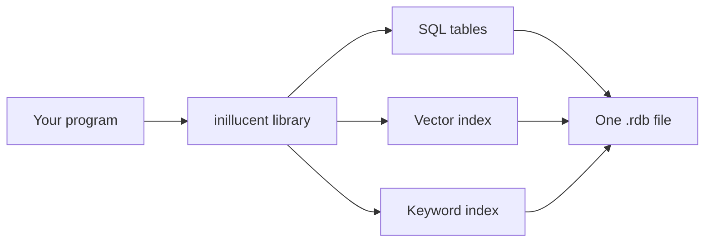

# Product overview

This page says what inillucent is, who it is for, and how it compares with PostgreSQL and pgvector.
To install inillucent and run a query, go to [Getting started](getting-started.md).

## Terms used on this page

| Term | Meaning |
|---|---|
| Embedded database | A database that runs as a library inside your program. There is no server. |
| Embedding | A list of numbers that stands for the meaning of a piece of text. Texts with similar meaning get similar lists. |
| Vector search | Finding the stored embeddings closest to the embedding of a question. |
| HNSW | A graph index that makes vector search fast by visiting only part of the data. |
| BM25 | The standard way to rank documents for a keyword search. |
| pgvector | The PostgreSQL extension that adds vector columns and HNSW indexes to PostgreSQL. |
| MCP | Model Context Protocol, the way an AI agent calls tools such as a database. |

The [glossary](glossary.md) has every other term.

## What inillucent is

inillucent is an embedded database written in Rust. It speaks SQLite's SQL on its own storage
engine. One `.rdb` file holds your tables, a vector index (HNSW) over an embedding column, and a
keyword index (BM25) over your text. The tables and both indexes commit and roll back together.

inillucent has no server, no port and no connection string. An install gives you four programs:

| Program | What it does |
|---|---|
| `inillucent` | the command line |
| `inillucent-shell` | an interactive shell that works like `sqlite3` |
| `inillucent-mcp` | an MCP server, so an AI agent can use a database |
| `inillucent-migrate` | builds a database from a legacy retrieval index. `inillucent migrate` copies a SQLite file, a PostgreSQL database or a MySQL database |

Several processes can use one `.rdb` file at the same time. They lock the file with the same
SHARED, RESERVED, PENDING and EXCLUSIVE locks SQLite uses, under `PRAGMA locking_mode = normal`,
which is the default. A commit made by one process is visible to the next statement in another
process. `crates/inillucent-compat/tests/durability/process_concurrency.rs` runs two writer processes against
one file and checks that the rows in the file match the commits the engine acknowledged.

## Who it is for

**People running a local AI agent.** The agent searches written material such as a wiki, a code
repository, tickets or chat history. The agent needs to search by meaning and by exact term, and it
runs several searches for one answer, so each search must be fast. The usual setup for this is
PostgreSQL, the pgvector extension, and an embedding model served by a separate process.
inillucent replaces all three with one library.

**People who use SQLite and want it faster.** inillucent runs the same SQL. The
[feature comparison](feature-comparison.md) runs 416 SQL cases through both engines:

| Result | Cases |
|---|---|
| Same answer as SQLite, byte for byte | 402 |
| A different answer | 6 |
| Vector search features SQLite does not have | 6 |
| `DELETE ... LIMIT` and `UPDATE ... LIMIT`, which the pinned SQLite build refuses and inillucent runs | 2 |

No case is refused. The storage engine is where inillucent differs from SQLite, and at 100,000 rows
inillucent is 397% faster than SQLite 3.53.4.

## The measurements

Each number below comes from the page linked beside it. The SQLite numbers are from the run on
2026-09-23 at 100,000 rows: four runs of 30 paired rounds, both engines on the same performance
cores. Each workload's answer is hashed and compared with SQLite's before its time counts. The
pgvector numbers are from the graded run on 2026-09-20 over 185,078 passages at 768 dimensions,
with both engines reading the same vectors.

| Result | Detail | Source |
|---|---|---|
| **397% faster than SQLite 3.53.4** | 4.97x, weighted over ten workload families | [Performance](performance.md) |
| **49% less processor time** | 555 ms against 1,082 ms for one round of the same plan | [Performance](performance.md) |
| **9.5% more memory** | 40.76 MiB against 37.22 MiB peak, with the same 128 MiB cache. SQLite wins this one | [Performance](performance.md#memory) |
| **A file 3.6% larger** | 17,432,576 bytes against 16,830,464 bytes for the same imported data | [Performance](performance.md#disk) |
| **402 of 416 SQL cases give SQLite's exact answer** | each case runs through both shells on a new database, and the output bytes are compared | [Feature comparison](feature-comparison.md) |
| **Better than pgvector on 15 of 17 graded comparisons** | equivalent on 1, inconclusive on 1, worse on none | [Retrieval quality](retrieval-quality.md) |
| **174% faster than pgvector without a filter** | median 0.8462 ms against 2.315 ms | [Retrieval quality](retrieval-quality.md#latency) |
| **6,169% faster than pgvector with a filter** | median 0.5820 ms against 36.486 ms, for `source = slack` | [Retrieval quality](retrieval-quality.md#latency) |

Six of the thirty weighted workloads are slower than SQLite. Four correlated subquery workloads,
which the performance contract does not weight, are far slower: a correlated `EXISTS` over 400
outer rows took 59.69 ms against 0.29 ms for SQLite in the graded run.
[The workloads that are slower](performance.md#the-workloads-that-are-slower) lists each one and the
reason.

## inillucent compared with PostgreSQL and pgvector

PostgreSQL with pgvector is the usual choice for vector search. Every retrieval number above is
measured against it. The setup is PostgreSQL for storage, pgvector for the vector index, and a
separate server, such as llama.cpp, running the embedding model. The setup works. It has four costs
that tuning does not remove.

**pgvector applies a `WHERE` filter after the index scan.** A plain HNSW scan returns
`hnsw.ef_search` candidates, and the filter then removes the rows that fail. A search restricted to
a small source can end with almost no rows. pgvector's fix is `hnsw.iterative_scan`, which repeats
the scan until enough rows pass. The repeated scans cost time: with `source = slack`, the configured
pgvector took 36.486 ms at the median.

inillucent applies the filter during the graph walk. A node that fails the filter is still used as a
step to reach its neighbors, but it is never added to the results. The walk continues until it has
enough rows that pass. The same `source = slack` search took 0.5820 ms.

**pgvector does not switch to an exact scan when a filter is narrow.** When a filter admits a few
thousand rows, comparing the query with every admitted row gives the exactly correct answer and is
faster than walking a graph over the whole corpus. inillucent counts the rows the filter admits and
chooses the exact scan when it costs less. A narrow filter is therefore the case where inillucent's
results are exactly correct. [The retrieval engine](architecture.md) shows the calculation.

**The embedding model runs in a separate process.** With pgvector, every query waits for a request
to the embedding server before the search starts, and there are two servers to keep running.
inillucent runs the embedding model inside your process through ONNX Runtime. See
[Embeddings](embeddings.md).

**PostgreSQL does work a retrieval index does not need.** A retrieval index is rebuilt from the
source documents, so it does not need a server, a network protocol, multiversion concurrency control
or a cost based planner. inillucent's index for the 185,078 passage corpus is 952 MB on disk, and
the process serving it holds 1,216 MiB of memory. The pgvector database for the same corpus is
1,750 MB.

## What you give up

- **One writer at a time.** Several processes share the file, but they take turns to write. A
  second writer waits up to `PRAGMA busy_timeout`, which is 5,000 milliseconds by default, and is
  then refused with `busy`. A reader in another process also waits for the writer, because
  inillucent has no shared memory index that would let the reader find the log.
- **Statements do not run in parallel inside one process.** `SharedDatabase` lets any number of
  threads use one database, and it runs one statement at a time.
- **inillucent has its own file format.** `inillucent migrate` imports a SQLite file once. inillucent
  does not open a SQLite file in place. See [Migrating](migrating.md).
- **inillucent is a library.** It has no replication and no network protocol. A backup is a checked
  copy of the file.
- **Writes to an `inillucent_search` table pay for its delta log.** New rows go into a delta log.
  When the delta log reaches 1,024 entries, which is the default, a commit builds the entries into a
  segment of the index. The table's size does not change that cost. A table that needs a different
  limit declares `compact = N`.
  [Keeping a vector index current](relational-architecture.md#10-keeping-a-vector-index-current)
  explains how to choose `N`, and [Closed items](closed-items.md#a-generation-is-one-blob) has the
  measurements.
- **Six of the thirty weighted workloads are slower than SQLite.**
  [Performance](performance.md#the-workloads-that-are-slower) lists them.

## Where to go next

- [Getting started](getting-started.md): install inillucent and run a query
- [The retrieval engine](architecture.md): how vector search and keyword search work
- [SQL support](sql.md): what runs, what differs and what is refused
- [Vector search](vector-search.md): vector search from SQL and from the library
- [Roadmap](roadmap.md): what is not built yet
