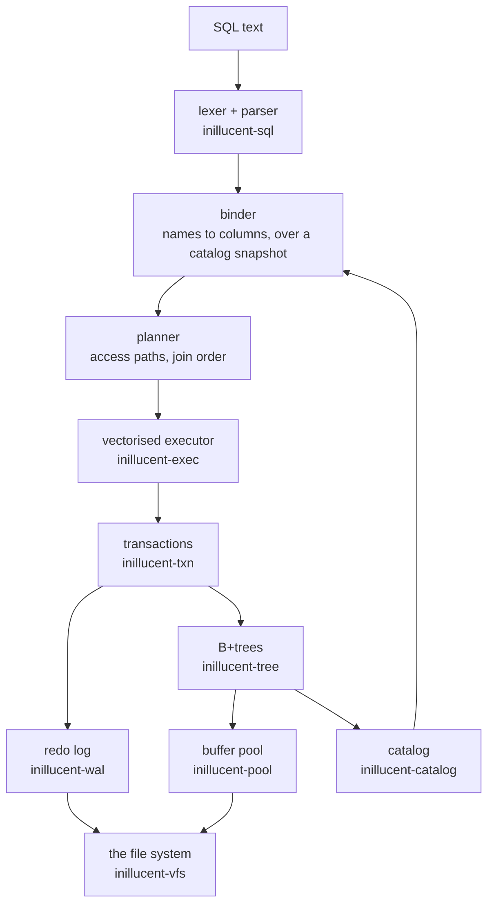

# How the relational engine works

This is the SQL half of inillucent: the storage, the transactions, the log, the recovery and the
execution that sit under `CREATE TABLE` and `SELECT`. [Architecture](architecture.md) is the other
half, the retrieval engine, and it is a separate subject with a separate page because the two share
a file and almost nothing else.

It is written for someone who has to reason about the engine rather than only use it — an operator
deciding what a crash can cost them, or an engineer changing it. Every invariant below names the
test group that checks it, because an invariant nothing checks is a description of what somebody
intended.

---

## 1. The shape of it

The direction of every arrow is checked. `docs/invariants/layering.toml` declares which crate may
depend on which, and `cargo test -p inillucent-compat --test policy` walks the workspace manifests
and fails on an edge that is not declared. That is what makes the picture above a fact rather than a
drawing.

Two arrows are worth reading twice, because the obvious arrangement is the wrong one:

- **The log does not depend on the pool.** A record would then be able to carry a `PageId`, and an
  edge from the log to the crate that owns pages says the opposite of what the write-ahead rule
  says: the log is written *before* any page is. A record carries a page's number as a `u64`, and
  the pool is *told* a durable LSN and refuses to write a page whose LSN is at or above it.
- **The parser is below the catalog.** A catalog cannot be built without a parser — it parses the
  `CREATE` text it stores — but a parse does not need a catalog. So the binder is written against
  an immutable catalog *view*, performs no I/O, and says so in its types.

---

## 2. Who owns what

| layer | crate | what it knows | what it must not know |
|---|---|---|---|
| file system | `inillucent-vfs` | files, locks, clocks, randomness | anything above it |
| buffer pool | `inillucent-pool` | frames, page headers, the free map, blob extents | what a column is called |
| B+trees | `inillucent-tree` | pages, keys, byte records, collations | what a column is called |
| redo log | `inillucent-wal` | segments, the record codec, group commit, the recovery scan | pages, trees |
| transactions | `inillucent-txn` | snapshots, the writer slot, undo, savepoints, the commit gate | SQL |
| SQL front end | `inillucent-sql` | lexing, parsing, binding, planning | I/O |
| execution | `inillucent-exec` | operators, batches, expressions | names |
| catalog | `inillucent-catalog` | `sqlite_schema`, roots, declared types | plans |
| the database | `inillucent-engine` | all of the above, assembled into something a caller opens | — |

**`inillucent-vfs` is the only crate in the workspace that touches a file.** That is not tidiness:
it is what lets a deterministic simulator replace the disk without any layer above noticing, which
is how the crash and fault campaigns inject a failure at a chosen write or sync. It is also where
`--root` confinement is enforced (§8), for the same reason — one choke point rather than a list of
call sites somebody has to remember to extend.

**Checked by:** `cargo test -p inillucent-compat --test policy`, which fails on an undeclared
dependency edge, an unformatted governed crate, an `unsafe` block outside the operating-system
boundary, and a module with no stated invariant.

---

## 3. A statement, from text to rows

1. **Lex and parse.** No catalog, no I/O. A parse failure carries a byte offset into the statement.
2. **Bind.** Names resolve to columns against an immutable catalog snapshot. This is where a
   statement is classified as reading or writing — which is what `--readonly` refuses on, rather
   than a scan of the text, so `SELECT … ; DROP TABLE …` does not slip past and a `SELECT`
   containing the word "delete" is not refused.
3. **Plan.** Access paths and join order. `EXPLAIN QUERY PLAN` prints what it chose.
4. **Compile.** The plan becomes an operator chain. Compiled forms are cached by statement text, so
   preparing the same statement again is a hash lookup.
5. **Execute.** Batches of columns flow up the chain. A pipeline breaker — a sort, a hash join
   build, an aggregate — collects rows and emits batches again through one function, which is the
   one place a transpose happens and the one place a request's budget is counted (§7).

**Statements materialise.** A statement runs whole on its first step and then walks the rows it
produced. That is why `total` in a result is *exact* rather than an estimate: it was counted, not
guessed, which is what lets a grid say "1-200 of 4,317" honestly. It is also why the row and byte
budgets in §7 are the shape they are.

**Checked by:** the `engine` and `differential` tiers — `target/debug/inillucent-testrun --tier
differential` grades 416 cases against a pinned SQLite 3.53.4, in both directions.

---

## 4. Transactions and isolation

One writer at a time, many readers, snapshot isolation. A reader takes a snapshot and sees the
database as it was at that instant for the length of its transaction; a writer takes the writer slot
and publishes before-images into a version log so readers can still see what they started with.

The version log is collected on a threshold rather than after every commit, because collecting walks
the whole log and doing it per commit would be quadratic in the images a batch publishes.

**`DETACH` is refused inside a transaction**, and that is a rule rather than a limitation being
worked around: schemas are numbered in attachment order, an open transaction's participant set is
recorded by those numbers, and removing one from the middle would renumber a set that is already
being counted.

**Checked by:** `inillucent-txn`'s own `transactions` and `durability` suites, the
`multi_database_commit` and `multi_database_participants` suites, and
`crates/inillucent-model` — an executable model of the transactional semantics whose dependency
list is one crate long *on purpose*: a reference implementation that linked the engine could share
a bug with it, and the two agreeing would then be evidence of nothing.

---

## 5. The log, and what a crash costs

Write-ahead: the log record is durable before the page it describes is written. The rule is tied
together in `inillucent-txn` rather than in either the pool or the log, because it is the only thing
that holds a file and a log at the same time — it calls `Pool::set_durable_lsn` after every sync of
the log and never before one, and neither of the other two knows the other exists.

Recovery scans from the meta page's `checkpoint_lsn` and replays forward. Three properties hold, and
each is a place a plausible implementation goes wrong:

1. **Replay is idempotent.** A page carries the LSN of the last record applied to it, so a record
   the page already has is skipped. Recovery can therefore run twice.
2. **A record for a page that no longer exists is skipped rather than applied**, because the page
   may have been freed and the file truncated.
3. **A stamp that cannot have come from this log is refused rather than obeyed.** Property 1 is only
   sound while a page's stamp is a position in *this* stream. A page stamped by a stream that was
   abandoned reads as "already has it" for every record, so every later write to it would be
   discarded with no error at all.

**The free map is replayed in log order.** This is the one that bit a real corpus. Recovery used to
collect `AllocPage` records into one list and `FreePage` records into another and apply the frees
last, so a page **freed and then allocated again inside the replayed range** came back marked free
while it was live — and the next allocation was handed a page something else already owned. It is
silent at write time: the statement that takes the page reports success, and nothing is wrong until
something reads a row whose value lived there. A free-map bit carries no LSN, so nothing below
recovery can catch a wrong answer about it. Fixed in task-1888; the case study in
[Removing PostgreSQL from a 5.8 GB Gmail assistant](real-world-use-cases/nikaya-postgres-to-inillucent.md)
is where it was diagnosed.

**Checked by:** `crates/inillucent-compat/tests/new_engine_free_map_recovery.rs`,
`new_engine_recovery_shapes.rs`, `wal_crash.rs`, `multi_database_crash.rs`, and the `durability`
tier's fault campaigns, which crash at a chosen sync and then read back what the *file* holds.

---

## 6. Backup, restore and copies

- **`VACUUM`** folds the log into the file. It is a checkpoint rather than SQLite's rebuild: pages
  are reclaimed by the free map as they are released, so what is left is making everything durable.
  `PRAGMA freelist_count` says what is free either way.
- **`VACUUM INTO`** writes a compacted copy by *rebuilding* rather than copying bytes, because a
  byte copy reproduces the free pages and half-empty leaves it was asked to remove. It never
  overwrites, which is what makes it safe in a backup script.
- **Neither may run inside an explicit transaction.** A checkpoint folds committed frames into the
  file and an open transaction's are not committed.
- Both paths are confined by `--root` (§8).

`integrity-check` walks every tree. **It is not a proof that a database opens**: the case study
above records a file that answered `ok` and could not be opened, because the damage was in the log
rather than in the file. If you are checking a database you are about to rely on, open it.

---

## 7. What one request may spend

`inillucent_base::budget` bounds rows, bytes and time, and carries the flag a cancel sets. It is read
at two points, and the two answer different questions:

- **every batch a result collects** — this bounds what a caller is handed;
- **every leaf of a scan** — this bounds what the engine *does on the way there*, so a `SELECT`
  whose `WHERE` rejects everything after scanning a hundred million rows still stops. A row ceiling
  alone would let that run to the end and then report zero rows.

**Unbounded by default, and that is deliberate.** An application that has linked the engine into its
own process is not protecting itself from itself. A *server* handing a database to somebody else is
the case that needs a bound, which is why `inillucent-mcp` asks for one and the command line does
not: 10,000 rows, `limit=0` refused by name, a 1 MiB request line, an 8 MiB reply and a 60-second
deadline.

`cancel` sets the flag from any thread; the statement fails `interrupted` and the connection stays
usable. `inillucent capabilities` reports it as **partial**, and the limit it is reporting is *when*
rather than whether: a single operator part-way through one indivisible piece of work finishes it
first.

**Checked by:** `crates/inillucent-compat/tests/budgets.rs`, which drives the shipped MCP binary
over JSON-RPC — including a case asserting the command line has *no* ceiling, without which the
others would pass for a change that put the ceiling everywhere.

---

## 8. Confinement

`--root DIR` states that no file outside `DIR` is opened on behalf of a request. It is enforced in
`inillucent-vfs`, which is the only thing that opens a file, so `ATTACH DATABASE`, `VACUUM INTO`,
`backup`, `restore`, `import`, `export`, the database named on the command line and every file
operation added later are covered by one decision.

**The check resolves the path rather than reading it.** Every component is followed through the file
system as it is appended, so a Windows junction or a Unix symbolic link below the root is replaced
by what it points at before the check happens, and `..` pops the *resolved* path rather than the
text. A path that does not exist yet stops at its deepest existing ancestor, which is what lets the
same service authorise a file about to be created.

**Checked by:** `crates/inillucent-compat/tests/confinement.rs`, which drives the shipped binaries
and first proves the escape route works *without* `--root` — so the refusal is the confinement
working rather than a junction the platform silently did not make.

---

## 9. Extensions and virtual tables

A module is handed the roots of its shadow tables by the host that already resolved them. It never
resolves a name and never opens a transaction of its own, which is what keeps FTS5 and the R-Tree —
databases inside a database, whose indexes live in ordinary tables — from needing to reach the
catalog or the session.

`inillucent-search` is registered one layer higher than the other modules, at the connection, because
`Registry::with_builtins` sits two crates below the retrieval engine and registering it there would
drag a vector index into every database that only wanted SQL.

**Checked by:** `fts5.rs`, `rtree.rs`, `vtab.rs`, `new_engine_vtab.rs` and `new_engine_vtab_stream.rs`.

---

## 10. Keeping a vector index current

A `inillucent_search` table keeps its index in five shadow tables. `%_content` holds the rows,
`%_delta` is a log of what changed, `%_gen` holds published generations of the built index, `%_state`
names which generation is current and how far it covers, and `%_config` records the declaration.

Four things happen to that index, and they cost different amounts.

**A write appends.** An `INSERT`, `UPDATE` or `DELETE` writes the row and one delta row. It does not
touch the graph at all.

**A query merges.** It loads the current generation, applies the delta rows above what that
generation covers, and answers from the one index that results. BM25 scores are relative to a corpus,
so a hit scored against the generation and a hit scored against a five row delta are two numbers on
two scales and cannot be ordered together; merging first is the only version of this that gives a
correct ranking. The merged index is cached on the connection and keyed by the exact delta entries
that produced it, so a second query at the same snapshot costs nothing.

**A commit folds.** When the delta log has passed its threshold, the committing transaction loads the
current generation, inserts each pending entry into it, and publishes the result as the next
generation. **The graph work is one insert per delta entry**, not one per row in the table.

**`compact` and `rebuild` build.** `INSERT INTO docs(docs) VALUES('compact')` reads every row and
inserts every chunk into a fresh graph, which is how the chunks a fold tombstoned leave the index.
The command is an ordinary write, so it lands atomically in the caller's transaction like any other.

Until task-1894 the commit path did the single-pass build. One ordinary `INSERT` could therefore pay
a whole-corpus graph construction — nine and a half minutes over 598,560 chunks — inside a
transaction the application could neither schedule nor interrupt.

### What the two cost

`inillucent-foldgate` runs both behaviours side by side: same corpus, same vectors, same commit
boundaries, same generation sizes, one row per transaction, each arm in its own process. The `build`
arm is the pre task-1894 behaviour, reproduced by declaring `compact = 0` and issuing the `compact`
command at exactly the commits where the `fold` arm folds.

40,000 documents, 64 dimensions, `mode = 'approximate'`, one row per transaction, on a
24 core Windows machine:

| | fold | build |
|---|---:|---:|
| chunks inserted into the graph, whole run | 35,579 | 255,989 |
| chunks inserted by the worst single publish | 4,447 | 35,579 |
| generations published | 19 | 19 |
| commit latency, median | 5.0 ms | 5.3 ms |
| commit latency, 99th percentile | 17.1 ms | 17.2 ms |
| commit latency, worst | 5,189.0 ms | 4,085.1 ms |
| recall at ten, against the exhaustive scan | 0.704 | 0.637 |
| peak resident memory | 180.9 MiB | 196.4 MiB |
| database file | 204.6 MiB | 204.6 MiB |
| reopen and answer the query set | 2,875.6 ms | 3,015.4 ms |
| concurrent reads served | 14,700 at 5.2 ms median | 17,912 at 5.0 ms median |
| concurrent reads refused | 0 | 0 |

Both arms answered the query set identically after being closed and opened again, with a reader on a
second connection running throughout.

The graph rows are what the change is about: folding does 7.2x less graph work over the run,
and its worst single publish is 8.0x smaller. Recall did not pay for it — 0.704 against
0.637 over 24 query vectors, so the folded graph answered at least as well as the one
built in a single pass — and peak memory is lower, because a fold never holds every row's chunk and
vector beside the index it is building.

**One number went the wrong way, and it is the worst commit.** 5,189.0 ms against 4,085.1 ms.
Publishing a generation is proportional to the corpus whichever way the graph was made: both arms
serialise the whole index and write it, and a fold additionally reads and deserialises the generation
it is folding into. At this corpus size those bytes are most of that commit, and the deserialise costs
more than the 8.0x fewer graph inserts save. The median commit is 5.0 ms against
5.3 ms and the 99th percentile is 17.1 ms against 17.2 ms, so it is the single
publishing commit that is slower, not ordinary writes.

The gap narrows as the corpus grows — at 12,000 documents it was 1,215 ms against 881 ms, and at
40,000 it is 5,189.0 ms against 4,085.1 ms — because graph construction grows faster than a byte copy
does. Segmented generations would close it rather than narrow it, and they are not built; the
paragraph below says what they are.

### The supported operating range

| declaration | what it does | what it costs |
|---|---|---|
| no `compact` clause | the delta log is `max(1024, rows / 8)`, so it grows with the table | a commit's graph work grows with the table too: one commit in every eight rows pays `rows / 8` inserts |
| `compact = N` | the delta log is pinned at `N` entries | the graph work per published generation is pinned at `N` inserts, and the generation is written every `N` rows instead of every `rows / 8` |
| `compact = 0` | nothing is published automatically | the delta log grows without limit, and every query pays the whole log until `compact` is run. This is what a bulk load wants, and it is what the migration declares |
| `threads = N` | a fold and a build use `N` cores | `threads = 1` keeps the engine on one core, which is what the rest of it does, and makes a fold roughly `N` times slower |
| `mode = 'exact'` (the default) | every vector search compares every candidate | recall is 1.000 by construction and folding cannot change an answer. `mode = 'approximate'` is what makes a vector search use the graph, and what a corpus past a few tens of thousands of rows wants |

**Choosing `N`.** A generation is one serialised index, so publishing one reads and writes the whole
thing. `N` is a trade between how long the worst commit takes and how often the file is rewritten,
and the default resolves it as a share of the table rather than a constant because a constant would
rewrite a large index far too often. Pin `N` when a bounded write latency matters more than write
throughput; leave it alone otherwise.

**What is not built.** Segmented generations — many small immutable segments merged at read time, the
way an LSM tree works — would make the bytes written proportional to the batch as well. Until that
exists the bytes are proportional to the corpus, and the fold bounds only the graph.
[Roadmap](roadmap.md) records it.

### What an application can read back

`%_state` is an ordinary table and these are ordinary rows:

| key | what it says |
|---|---|
| `rows` | live rows in `%_content` |
| `chunks` | chunks in the current generation, live and tombstoned |
| `inserted` | chunks the last generation build inserted into the graph |
| `folds` | folds this generation lineage has taken; zero after a `compact` or `rebuild` |
| `generation` | which generation is current |
| `covered` | the highest delta sequence that generation already contains |

`chunks` minus `rows` is how many chunks the graph still holds that no live row points at. An update
tombstones the old chunk and appends a new one, and only a single-pass build removes the old one. A
large difference, or a large `folds`, is what says a `compact` is due.

### What a failure leaves

Publishing a generation is a sequence of ordinary writes inside the caller's transaction, so a crash
anywhere in it leaves the old generation named by the old state rows and the delta log untouched —
the same index, reachable by exactly the same reads. The superseded generation's rows stay in the
file until `drop-old-generations` is run, because a snapshot opened before the swap is still reading
them.

A generation that cannot be read back is an error the query reports, and `rebuild` is the recovery:
`%_content` is the authoritative copy of every row, so the index can always be built again from the
database alone. `integrity-check` compares the recorded row count against the rows, checks
every vector's width, and names any delta entry whose row is not there.

**Checked by:** `search.rs`, `search_crash.rs`, `vector.rs`, `new_engine_search.rs`, the graph's own
cases in `crates/inillucent-core/src/hnsw.rs`, and `inillucent-foldgate` for the numbers.

---

## 11. Where to look next

| question | page |
|---|---|
| which SQL runs, and what differs from SQLite | [SQL support](sql.md) |
| how fast, and on what | [Performance](performance.md) |
| the 416 measured cases | [Feature comparison](feature-comparison.md) |
| the retrieval engine | [Architecture](architecture.md) |
| what a crate may link | [Dependency policy](dependency-policy.md) |
| what is not built yet | [Roadmap](roadmap.md) |
| the crates, one by one | [Repository](repository.md) |
