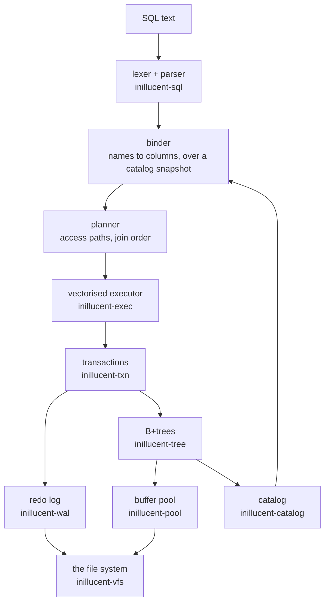

# How the relational engine works

This is the SQL half of inillucent: the storage, the transactions, the log, the recovery and the
execution that sit under `CREATE TABLE` and `SELECT`. [Architecture](architecture.md) is the other
half, the retrieval engine, and it is a separate subject with a separate page because the two share
a file and almost nothing else.

It is written for someone who has to reason about the engine rather than only use it — an operator
deciding what a crash can cost them, or an engineer changing it. Every invariant below names the
test group that checks it, because an invariant nothing checks is a description of what somebody
intended.

---

Words used here and not explained here - page, frame, pin, B+tree, leaf, WAL, LSN, checkpoint,
affinity, collation - are in [the glossary](glossary.md), one sentence each.
[Architecture in one page](architecture-overview.md) is the shorter version of this document with
the retrieval half beside it.

## 1. How the parts fit together

The direction of every arrow is checked. `docs/invariants/layering.toml` declares which crate may
depend on which, and `cargo test -p inillucent-compat --test policy` walks the workspace manifests
and fails on an edge that is not declared. That is what makes the picture above a fact rather than a
drawing.

Two arrows go the other way from the obvious arrangement:

- **The log does not depend on the pool.** A record would then be able to carry a `PageId`, and an
  edge from the log to the crate that owns pages says the opposite of what the write-ahead rule
  says: the log is written *before* any page is. A record carries a page's number as a `u64`, and
  the pool is *told* a durable LSN and refuses to write a page whose LSN is at or above it.
- **The parser is below the catalog.** A catalog cannot be built without a parser — it parses the
  `CREATE` text it stores — but a parse does not need a catalog. So the binder is written against
  an immutable catalog *view*, performs no I/O, and says so in its types.

---

## 2. Who owns what

| layer | crate | what it knows | what it must not know |
|---|---|---|---|
| file system | `inillucent-vfs` | files, locks, clocks, randomness | anything above it |
| buffer pool | `inillucent-pool` | frames, page headers, the free map, blob extents | what a column is called |
| B+trees | `inillucent-tree` | pages, keys, byte records, collations | what a column is called |
| redo log | `inillucent-wal` | segments, the record codec, group commit, the recovery scan | pages, trees |
| transactions | `inillucent-txn` | snapshots, the writer slot, undo, savepoints, the commit gate | SQL |
| SQL front end | `inillucent-sql` | lexing, parsing, binding, planning | I/O |
| execution | `inillucent-exec` | operators, batches, expressions | names |
| catalog | `inillucent-catalog` | `sqlite_schema`, roots, declared types | plans |
| the database | `inillucent-engine` | all of the above, assembled into something a caller opens | — |

**`inillucent-vfs` is the only crate in the workspace that touches a file.** That is not tidiness:
it is what lets a deterministic simulator replace the disk without any layer above noticing, which
is how the crash and fault campaigns inject a failure at a chosen write or sync. It is also where
`--root` confinement is enforced (§8), for the same reason — one choke point rather than a list of
call sites somebody has to remember to extend.

**Checked by:** `cargo test -p inillucent-compat --test policy`, which fails on an undeclared
dependency edge, an unformatted governed crate, an `unsafe` block outside the operating-system
boundary, and a module with no stated invariant.

---

## 3. A statement, from text to rows

1. **Lex and parse.** No catalog, no I/O. A parse failure carries a byte offset into the statement.
2. **Bind.** Names resolve to columns against an immutable catalog snapshot. This is where a
   statement is classified as reading or writing — which is what `--readonly` refuses on, rather
   than a scan of the text, so `SELECT … ; DROP TABLE …` does not slip past and a `SELECT`
   containing the word "delete" is not refused.
3. **Plan.** Access paths and join order. `EXPLAIN QUERY PLAN` prints what it chose.
4. **Compile.** The plan becomes an operator chain. Compiled forms are cached by statement text, so
   preparing the same statement again is a hash lookup.
5. **Execute.** Batches of columns flow up the chain. A pipeline breaker — a sort, a hash join
   build, an aggregate — collects rows and emits batches again through one function, which is the
   one place a transpose happens and the one place a request's budget is counted (§7).

**Statements materialise.** A statement runs whole on its first step and then walks the rows it
produced. That is why `total` in a result is *exact* rather than an estimate: it was counted, not
guessed, which is what lets a grid say "1-200 of 4,317" honestly. It is also why the row and byte
budgets in §7 are the shape they are.

**Checked by:** the `engine` and `differential` tiers — `target/debug/inillucent-testrun --tier
differential` grades 416 cases against a pinned SQLite 3.53.4, in both directions.

---

## 4. Transactions and isolation

`inillucent-txn`, the transaction manager, implements one writer at a time, many readers and
snapshot isolation: a reader takes a snapshot and sees the database as it was at that instant for the
length of its transaction, and a writer takes the writer slot and publishes before-images into a
version log so readers can still see what they started with.

**What a connection of the shipped engine gets is the first half of that and not the second.**
`ImportedDatabase` holds the log directly rather than going through the transaction manager, and it
takes the file's EXCLUSIVE lock for the length of a write. So one writer at a time holds across
processes, and a reader of another process waits for that writer rather than reading a snapshot past
it - there is no shared-memory index through which a reader could find the log. A reader that will
not wait is refused with `busy` after `PRAGMA busy_timeout`. `docs/roadmap.md` has the protocol that
would make the second half true across processes as well.

The version log is collected on a threshold rather than after every commit, because collecting walks
the whole log and doing it per commit would be quadratic in the images a batch publishes.

**`DETACH` is refused inside a transaction**, and that is a rule rather than a limitation being
worked around: schemas are numbered in attachment order, an open transaction's participant set is
recorded by those numbers, and removing one from the middle would renumber a set that is already
being counted.

**Checked by:** `inillucent-txn`'s own `transactions` and `durability` suites, the
`multi_database_commit` and `multi_database_participants` suites, and
`crates/inillucent-model` — an executable model of the transactional semantics whose dependency
list is one crate long *on purpose*: a reference implementation that linked the engine could share
a bug with it, and the two agreeing would then be evidence of nothing.

---

## 5. The log, and what a crash costs

Write-ahead: the log record is durable before the page it describes is written. The rule is tied
together in `inillucent-txn` rather than in either the pool or the log, because it is the only thing
that holds a file and a log at the same time — it calls `Pool::set_durable_lsn` after every sync of
the log and never before one, and neither of the other two knows the other exists.

Recovery scans from the meta page's `checkpoint_lsn` and replays forward. Three properties hold, and
each is a place a plausible implementation goes wrong:

1. **Replay is idempotent.** A page carries the LSN of the last record applied to it, so a record
   the page already has is skipped. Recovery can therefore run twice.
2. **A record for a page that no longer exists is skipped rather than applied**, because the page
   may have been freed and the file truncated.
3. **A stamp that cannot have come from this log is refused rather than obeyed.** Property 1 is only
   sound while a page's stamp is a position in *this* stream. A page stamped by a stream that was
   abandoned reads as "already has it" for every record, so every later write to it would be
   discarded with no error at all.

**The free map is replayed in log order.** This is the one that bit a real corpus. Recovery used to
collect `AllocPage` records into one list and `FreePage` records into another and apply the frees
last, so a page **freed and then allocated again inside the replayed range** came back marked free
while it was live — and the next allocation was handed a page something else already owned. It is
silent at write time: the statement that takes the page reports success, and nothing is wrong until
something reads a row whose value lived there. A free-map bit carries no LSN, so nothing below
recovery can catch a wrong answer about it. This is fixed; the case study in
[Removing PostgreSQL from a 5.8 GB Gmail assistant](real-world-use-cases/nikaya-postgres-to-inillucent.md)
is where it was diagnosed.

**A journal is not gone until the directory says so.** This one corrupted a database that had
already committed cleanly, and it was found by pointing the old engine's crash campaigns at this one
for the first time. Every connection opens in `DELETE` journal mode for a moment before
`PRAGMA journal_mode = wal` switches it, and that moment creates a rollback journal.
`Journal::finish()`'s `Delete` arm then dropped the file handle and unlinked the file **without
syncing either**: the pre-images that same checkpoint's flush had just written sat unsynced in the
device's write-behind cache, and the unlink passed `sync_dir: false`, so the directory entry removal
was not durable either. A power loss in that window leaves the directory still naming a journal that
looks perfectly hot and whose last bytes are torn - and the next cold open's `replay_hot_journal`
puts that garbled pre-image back over a good page. The result is `database disk image is malformed`
on a database whose commit had completed, which reads like a recovery failure and is not one. This
is fixed: the journal's own bytes are synced before the handle goes, and the unlink syncs the
directory.

**Then the same campaigns were run in `TRUNCATE` and `PERSIST` mode, which nothing had ever done,
and found three more - and closing the gap that hid them found a fourth in `wal`.** Every one could
destroy a database that the power loss itself had left whole, so they are written out here rather
than summarised.

**The journal was never synced before a page was overwritten.** `Pool::checkpoint` sealed the
journal at its head. That is before `flush` has saved a single pre-image, because pre-images are
saved by the writeback loop `flush` runs next - so the seal synced an empty file, and every
pre-image the checkpoint wrote afterwards was still in the file's buffers while the same loop
overwrote the pages those pre-images belonged to. `flush` now takes two passes under a rollback
journal: save every pre-image, sync once, then write the pages. A checkpoint of a thousand pages
still pays for one sync, and `writeback` asks for the sync per page only because the page evictor
reaches it with no flush around it.

**The journal had no checksums, so recovery wrote torn bytes over a good database.** At the cut
point where the campaign failed, the database file was correct - page 3 stored the checksum
`b59f5196` and computed `b59f5196` - and the `database disk image is malformed` the test reported
had been manufactured by recovery, out of a journal whose seventeen sectors the crash model had left
Torn, Garbage and Dropped. There was nothing in the format that could tell a replay that a
pre-image was not the bytes somebody wrote. Every record now carries a CRC over the transaction's
nonce, the page id and the image; the header carries one over itself; and `replay_hot_journal` stops
at the first record that fails. That restores everything the journal owes, because a record is only
unverifiable if it was written after the last sync, and a page is only overwritten after the sync
covering its own pre-image - so a failing record names a page the crash never reached, as does every
record appended after it. The nonce is what stops `PERSIST` mode's leftover records from a previous
transaction passing this one's check. The magic is `RDBJRNL2`; a journal an older build left behind
is removed rather than replayed.

**The two meta pages were the only pages a checkpoint overwrote without a pre-image.** With the
first two fixed the campaigns reached cut point 47 and recovered a database with no tables in it.
The journal had correctly put the data pages back to before the checkpoint, and the meta page still
read `generation 5, checkpoint_lsn 17160` - a checkpoint that never finished. Redo believed that
number, started above it, and skipped the very records that would have re-applied what the journal
had undone. The catalog's own root page was one of the pages the journal put back, which is why the
tables went. The shadow meta page does not protect against this: `checkpoint` writes the *same*
image to both slots, so the second one is a second chance for the new record to survive rather than
an older copy to fall back on. A checkpoint now journals `META_PAGE` and `SHADOW_PAGE` and syncs
before writing them, so the record that claims a checkpoint happened is undone by the same mechanism
as the pages it describes.

`Journal::finish` also synced at `SyncMode::Normal` in its `truncate` and `persist` arms. What makes
a journal stop being hot in those two modes is a change to the journal file itself, and `Normal` is
the level that is allowed not to reach the media - so until it lands, the next open still finds
pre-images naming a database whose commit already completed. Both are `Full` now, which is what the
`delete` arm does.

**A write-ahead log does not remove the need for a rollback journal, and that is a consequence of
this log being logical.** With the campaigns above reaching further into the checkpoint, `wal_crash.rs`
and `search_crash.rs` both failed at cut 32 - different files, different workloads, the same call. A
checkpoint writes pages into the data file *in place*. Once a page's content is below the recorded
checkpoint point, the records that built it are redundant and their segments are retired, so the log
no longer describes it; a page the checkpoint half wrote before a power loss is then content nothing
can rebuild. The meta record was correct - it still named the previous checkpoint - and the log still
held every record above it. Recovery failed on the one page neither could supply:
`page 3 checksum fe9063aa is not the computed f53956bb`.

SQLite is not exposed to this for a structural reason: its log holds whole page images and a
checkpoint is a copy, so an interrupted one is simply redone. Here a connection in `wal` takes a
`delete` journal (`journal_for` in `crates/inillucent-engine/src/engine/locks.rs`), which holds the pre-images
for the duration of a checkpoint and removes the file once the checkpoint's meta record is durable.
That is the cost the default mode already pays, and it makes an interrupted checkpoint undoable in
every mode rather than in three of the five. `off` is the one mode that gets nothing, because that
is what it asks for.

All four are fixed now, and the evidence is checked in: `tests/crash/truncate-full-crash.txt`
and `tests/crash/persist-full-crash.txt` record 101 cut points each, every one recovering to the old
database or the new one, with no detected damage at any of them. The files are seeded, so a diff on
them is a change in what the engine does under failure.

**Checked by:** `crates/inillucent-compat/tests/new_engine_free_map_recovery.rs`,
`new_engine_recovery_shapes.rs`, `wal_crash.rs`, `multi_database_crash.rs`, and the `durability`
tier's fault campaigns, which crash at a chosen sync and then read back what the *file* holds.
Those campaigns drove the retired engine until it was deleted; re-pointing them at this one is
what found the journal defect above, and `new_engine_recovery_shapes.rs` did not, because it crashes
at one fixed point rather than at every cut of a commit.

---

## 5a. What a file's format version promises

The first eight bytes of a database are `RDB2` and four zero bytes, and the four bytes after them
are the **format version**, which this build writes as `2`. It reads `2` and `1`.

The rule it stands for:

- **A point release reads every file an earlier point release of the same minor version wrote.**
  `0.1.4` opens a `0.1.0` file. The version does not move for a bug fix, and a release that changed
  the layout of a page, a record or the header without moving it would be a release that could not
  say which files it can read.
- **A change to that layout raises the number, and that is a minor version.** Where the new build
  can read the old layout it does, as it does format 1 (below); where it cannot, the migration is
  `inillucent-migrate`, which reads the older file and writes a new one rather than rewriting it in
  place, because an upgrade in place is a rewrite that a crash can catch halfway.
- **A build that meets a higher number says so rather than reading the file as damage.** The refusal
  is `this database is format version N and this build reads version 2; upgrade inillucent to open
  it`, it carries the status `unsupported`, and the command line exits 3 - the same answer every
  other "this build has not got that" gives. A number below 1 is reported as corruption, because
  there is no earlier format: a zero there is a header that has been overwritten.

### Format 2: what changed, and how a format 1 file still opens

Two things in a page changed, and a build of format 1 can read neither:

- **A leaf's delta area has a directory.** The delta area holds the rows written to a leaf since it
  was last packed. In format 1 it was a run of rows in arrival order, capped at 32 and scanned on
  every lookup. In format 2 it opens with a directory of two-byte entries in key order, a lookup is
  a binary search, and the area is as large as the free gap - which is what stopped an index leaf of
  thousands of rows compacting after every 32 writes. `crates/inillucent-tree/src/leaf/delta.rs`
  has the layout.
- **A page's checksum covers its LSN.** Format 1's covered bytes 12 onward and left the eight-byte
  LSN out, so a flipped bit there was a page that read as valid while telling recovery the wrong
  thing about which log records it held. `crates/inillucent-pool/src/page.rs` has the rule.

**This build reads format 1, page by page.** A leaf carries a flag, `LEAF_DELTA_DIRECTORY`, that
says which layout its delta area is in, and a page's checksum is accepted under either rule. A leaf
format 1 wrote is read as it is and **written by format 1's rules until a compaction or a split
rewrites it**, and that rewrite is logged with the page's image. The reason is recovery: it replays
the log onto the pages the file holds, and for a file an earlier release wrote those are format 1
pages, so a replay has to follow the rules the log was written under to land on the same bytes. The
file's own number becomes 2 the next time this build writes the meta record, which a checkpoint
does. `tests/interop/` holds a file from every release, and `release_format.rs` reads each one,
writes to it, crashes, and recovers.

**No release before this one reads a format 2 file, and each of them refuses it.** 0.1.5, 0.1.6
and 0.1.7 answer `Error [unsupported]: this database is format version 2 and this build reads
version 1; upgrade inillucent to open it`. 0.1.1, 0.1.2 and 0.1.3 predate that refusal and answer
`database disk image is malformed: neither meta page is readable`. None of them reads the file and
answers from it. `release_format_history.rs` asserts both, against the released binaries.

The number lives at byte 8 of the meta page, which is covered by the meta record's checksum, so a
file whose version has been edited by hand fails the checksum rather than opening.

### What an extent reference's class bits are, and why the number did not move

An **extent reference** is the sixteen bytes a leaf holds for a value stored outside its page: a
page number and a length. It also carries, in the two bits above the page number,
what the value reads back as - `CLASS_STATED`, and beside it `CLASS_TEXT`. Without them the column's
declaration was the only thing that could say whether the bytes were text or a blob, so a column
that would say the wrong thing could not have a value outside its page at all: `CREATE TABLE t (a)`
is BLOB affinity, a text in it stayed inline however long it was, and at the default 32,768 byte
page a text of about 32 KB could not be stored.

**The format version stays 1, and the rule above is why it can.** A reference states its class only
when the column's own answer would be wrong. Every other reference - a text in a column declared
`TEXT`, bytes in one declared `BLOB` - is encoded as the same sixteen bytes it always was. So:

- **A build from before this reads every file an earlier build wrote, unchanged**, because no file
  an earlier build wrote contains a reference with these bits set: the only values that produce one
  are values an earlier build refused to store.
- **A build from before this that is handed a file written by this one** meets a stated reference as
  a page number above 2^62. It is not a page any file has, the fetch fails, and it reports the
  failure. It does not answer.
- **That last point is why the bits are in the page word and not the length word.** The length word
  has spare bits too - above the 48-bit length and below the packed-into-a-shared-page flag - and a
  build from before this would read the page and the length out of such a reference correctly and
  hand the bytes back labelled by the column. For exactly the values these bits exist for, that is
  the wrong label on the right bytes: a text coming back as a blob, with nothing to say so.

A file this build writes is therefore readable by an earlier one everywhere an earlier one could
have written it, and refused rather than misread everywhere it could not. `ExtentClass` in
`crates/inillucent-pool/src/extent.rs` holds the encoding; `extent_class_for` and `extent_datum` in
`crates/inillucent-tree/src/leaf/layout.rs` are the writer's and the reader's halves of the rule,
written beside each other because a disagreement between them is a wrong value rather than an error.

### The layouts inside the file, and what they promise separately

The format version at byte 8 covers the pages, the records and the header. It does **not** cover
what a virtual table keeps inside its own shadow tables, and treating it as though it did is what
made the one compatibility break this project has had invisible.

The break: the FTS5 index layout changed in 0.1.2. `%_idx`'s third column used to hold an integer
naming the `%_data` row a term's doclist lived in, and now it holds the doclist itself. Nothing
about the page format moved, so the format version correctly stayed at 1 - and 0.1.1 opens a file a
later build wrote, reads its tables, reads its `WITHOUT ROWID` entries, reads a blob stored over a
page, reads the row that exists only in the log, reads `SELECT count(*) FROM note_fts` as 5 and
`SELECT rowid, title FROM note_fts` as all five rows. The only thing it gets wrong is
`WHERE note_fts MATCH 'segment'`, which comes back as **no rows at all**: it read the doclist blob
as a page number, found no such page, and a term with no doclist is a term in no documents.

That is the worst answer a compatibility break can give. An empty result set is a legitimate answer
to a search, so an application has nothing to tell it apart from "there are no matching documents".
0.1.1 is published and its answer can never be fixed. What changed is the next one.

**Every durable layout in the file now names itself, and a reader that meets one it has not got
refuses with the status `unsupported` and names the release that wrote it.** Three places, three
records:

| what | where the number is | what a newer number does |
|---|---|---|
| the pages, records and header | byte 8 of the meta page, `crates/inillucent-pool/src/meta.rs` | the database will not open: `this database is format version N and this build reads version 2; upgrade inillucent to open it` |
| an FTS5 index | a `%_data` row, `crates/inillucent-ext/src/vtab/fts5/layout.rs` | the database opens and the table's rows read; `MATCH`, any write, and `fts5vocab` refuse with `the full-text index on T is in layout N, written by inillucent X.Y.Z, and this build reads layouts up to 2` |
| an `inillucent_search` index | the `format` row of `%_config`, `crates/inillucent-search/src/options.rs` | the database opens; every read and every write of the table refuses with `the table is in format N, written by inillucent X.Y.Z, and this build reads formats 1 and 2` |

There are two numbers for a search table because there are two shapes of one. A table that declares
no facet column stores `1`, which is what every build has always written and every build reads. A
table that declares one stores `2`, so a build that does not know the word refuses it by name
instead of reading the facet's value as ordinary indexed text and answering a ranking the table was
not written to answer. Raising the one number would have refused every table already on disk, which
is a wider refusal than the change deserves.

All three carry `unsupported`, so the command line exits 3 and a driver reports the status
`unsupported` - the same answer every other "this engine has not built that" gives, and the reason
an application can tell "upgrade and try again" from "your query is wrong", and either of those from
"there are no matching rows".

The two virtual table records refuse the *table* rather than the *file*, and that is deliberate: a
database has to open before the table in it can be dropped, and a database holding one index a
reader cannot use is still a database whose other tables it can read perfectly well.

**A missing record means "some layout up to and including this build's", and is read rather than
refused.** Every file published before the change that made every durable layout name itself has no FTS5 layout record, and a reader that
refused them would refuse every database in existence. The FTS5 record is written at
`CREATE VIRTUAL TABLE` and again by `rebuild` and `delete-all` - the two places the whole index is
written from scratch - and deliberately **not** by an ordinary insert, because a file 0.1.2 through
0.1.7 wrote may hold rows in both layouts at once and a record stamped on the next write would be
claiming something the file cannot support. Those mixed files are read by the per-row rule in
`fts5/index.rs::term_value`, which decides from the value's own type.

### The promise, in four sentences

- **A point release reads every file an earlier point release of the same minor version wrote**, and
  every layout inside it.
- **A build reads a file written by any earlier build, or refuses it by name.** There is no version
  this project has dropped: the file format version was 1 from the first release until a later
  release made it 2, and this build reads both. How far back that is *checked* is 0.1.1, the oldest release
  with a fixture in `tests/interop/` - 0.1.0 was withdrawn the day after it was published and nobody
  is running it.
- **A build reads a file written by a later build where the later build changed nothing, and refuses
  it by name where it did.** That is the direction the records above exist for, and it is the
  direction that costs somebody their afternoon: an application that upgrades one machine and not
  another has both builds pointed at the same file.
- **A layout change is a minor version with a documented migration**, and the migration is
  `inillucent-migrate` reading the older file and writing a new one, rather than an upgrade in place
  that a crash can catch halfway.

### What holds the promise

`crates/inillucent-compat/tests/release_format_history.rs` runs every published release's own
downloaded binary against a database this build just wrote, and asks it `tests/interop/verify.sql`
and `tests/interop/retrieval.sql`. `tests/interop/<version>/` holds a database each release's own
binary wrote, which the current build is asked the same questions of. The 0.1.1 `MATCH` difference
is a row in that file's `KNOWN_GAPS`, asserted to **still happen** - a published binary's answer can
never be fixed, so a change that made 0.1.1 read the new index turns the suite red and gets the row
deleted. `crates/inillucent-compat/tests/format_refusal.rs` manufactures a record from a build that
does not exist and checks each refusal, including through the command line's exit code.

---

## 6. Backup, restore and copies

- **`VACUUM`** is a *logical* rebuild, the same shape SQLite's own `sqlite3RunVacuum` takes: the
  schema is replayed by running its `CREATE` statements again, the rows are copied back in through
  the ordinary write path, and the result is written beside the database and **renamed** over it -
  a single directory-entry update a crash cannot catch halfway, where the byte copy this used to do
  could be interrupted at any offset. See `crates/inillucent-engine/src/rebuild.rs`.
- **`VACUUM INTO`** writes a compacted copy the same way - by rebuilding rather than copying bytes,
  because a byte copy reproduces the free pages and half-empty leaves it was asked to remove. It
  never overwrites, which is what makes it safe in a backup script.
- **Neither may run inside an explicit transaction.** A rebuild reads a schema and its rows, and a
  transaction still open has neither committed.
- Both paths are confined by `--root` (§8).
- **Both act on the connection's own `Vfs`**, every step of the way: the rebuilt file is created
  through it, the swap is `Vfs::rename`, the old log segments are deleted through it, and both
  reopens carry the same handle. An application that supplies an encrypting or in-memory `Vfs` gets
  a `VACUUM` that stays inside it.
- **`Vfs::rename` is on the trait for this.** It is documented as an atomic replace of the target;
  `OsVfs` is `std::fs::rename` plus the directory flush Unix needs and Windows does not, `MemoryVfs`
  moves one entry of its directory map, and `SimVfs` delegates with a failpoint so a campaign can
  cut inside it. The segments are removed by generating their names from the database's own name
  rather than by listing the directory, because `inillucent_wal::segment::segment_name` makes the
  name a function of the base path and a sequence number - so no listing method was needed on the
  trait.
- **This was not always true.** Until the review before the
  public release caught this, the rebuild used `std::fs` directly and `vacuum_in_place` reopened with `ImportedDatabase::open`,
  which constructs a fresh `OsVfs`. A connection on any other `Vfs` therefore got one of two
  things from `VACUUM` or `PRAGMA incremental_vacuum`: a failure to find its own database, or - if a
  real file happened to exist at the path string - a silent move onto the operating system's file
  system for the rest of the session. `crates/inillucent-compat/tests/vacuum_on_vfs.rs` is the test
  that says it cannot happen again, and `vacuum_crash.rs` is the crash campaign that became
  possible: it runs on `SimVfs` like every other one, and one of its cases cuts the machine inside
  the rename.

`PRAGMA integrity_check` reads the file three times over, and the three find different things:

- **every tree on its own** - each leaf parses, keys increase within a leaf and across the sibling
  chain, every interior separator is the first key of the child it precedes, and the sibling chain
  reaches as many leaves as the interior levels do;
- **every page against every other page, and against the free map** - a page two trees both reach,
  a page a tree reaches that the free map calls free, and a page the free map calls allocated that
  no tree reaches;
- **every index against its table** - a duplicate under one key in a `UNIQUE` index, a row whose
  entry is missing, an entry naming a row the table does not hold.

**The page pass is there because the other two cannot see a page two tables both own.** Each tree
is a well formed tree and neither is an index of the other, so both of them pass over a file where
`SELECT count(*) FROM p` answers with `q`'s rows. That state loses rows durably and without a
symptom at the time, and `PRAGMA integrity_check` called it `ok` until this check was added.

**The third of those is a leak - dead space rather than lost data - and it reached the pragma only
later, when a fix made a dropped tree, an abandoned `CREATE` and a `REINDEX` all give their pages
back**, because until then the engine left that state behind itself in two places, both measured
earlier, when the integrity check was extended to account for every page. A rolled-back `CREATE TABLE` or `CREATE INDEX` kept its tree's root page: the
undo is row-level, so nothing gave the allocation back. And `DROP TABLE` kept every page the table's
out-of-line values sat on, because `release_tree` gave back the interior pages and the leaves and
`paged::free_extent` is reached only from the tree's own write paths. `DELETE FROM t` before the drop
gave that space back, and so did `VACUUM`.

Both are closed. An open transaction now records every tree it builds, and abandoning it gives those
pages back to the in-memory free map - no log record, because an allocation that was never committed
is one recovery never replays. And the list a commit drains now carries a dropped tree's out-of-line
values as the references their leaves held, so the commit calls `paged::free_extent` for each: a
value written as a run of whole pages takes its pages with it, and a value packed onto a page shared
with other trees clears its slot and gives the page back only when the last live slot on it goes.

Neither fix moves that boundary. A drop's frees still happen at the commit and
not at the statement, and a build's pages are released only on the path where there is going to be
no commit. `ImportedDatabase::report_leaked_pages` is still there as a public entry point, because a
leak is now the one state of the three that no statement produces - so showing the arm one means
damaging a file on purpose.

**Wiring the arm to the pragma immediately found a third leak, which is the argument for having
built the walk at all.** `REINDEX` rebuilds an index into a freshly allocated tree under a *new*
handle and rewrites the catalog row to name it, and nothing released the tree it replaced: one
tree's worth of pages per rebuild. Releasing it then turned up what the leak had been hiding.
`rewrite` replaces a catalog entry and leaves the recorded *handle* alone - correct for every other
caller, because they rewrite a row that goes on naming the tree it already named - so after a
`REINDEX` the connection went on reading the index it had just replaced, and only a reopen moved it
onto the new one. The rows agreed, so there was no symptom; the leaked page was the only trace. That
is the same shape as the earlier bug where a dropped page could be freed before its transaction
committed, and it is why a page that nothing reaches is worth reporting even
though it loses no data.

**`PRAGMA quick_check` reads every tree and accounts for every page, and leaves out the index
pass.** The two pragmas used to be one pass under two names, because there was no cheaper variant to
offer. The obvious candidate for the cheaper one was to drop the page pass, and counting it said
otherwise: over a table of sixty out-of-line values the whole page walk cost 4 page fetches on top
of 133. It reads a tree's interior pages and its leaves, and it takes an out-of-line value's pages
from the reference in the leaf it is already holding rather than by reading the value. The index
pass is the expensive one - it walks each index and the table it is on and merges them - so that is
what `quick_check` leaves out.

The pinned SQLite draws its line in the same place: its `quick_check` omits index content against
table content, `UNIQUE`, `CHECK` and `NOT NULL`, and still accounts for every page of the file.

**Neither is a proof that a database opens**: the case study above records a file that answered `ok`
and could not be opened, because the damage was in the log rather than in the file. If you are
checking a database you are about to rely on, open it.

---

## 7. What one request may spend

`inillucent_base::budget` bounds rows, bytes and time, and carries the flag a cancel sets. It is read
at two points, and the two answer different questions:

- **every batch a result collects** — this bounds what a caller is handed;
- **every leaf of a scan** — this bounds what the engine *does on the way there*, so a `SELECT`
  whose `WHERE` rejects everything after scanning a hundred million rows still stops. A row ceiling
  alone would let that run to the end and then report zero rows.

**Unbounded by default, and that is deliberate.** An application that has linked the engine into its
own process is not protecting itself from itself. A *server* handing a database to somebody else is
the case that needs a bound, which is why `inillucent-mcp` asks for one and the command line does
not: 10,000 rows, `limit=0` refused by name, a 1 MiB request line, an 8 MiB reply and a 60-second
deadline.

`cancel` sets the flag from any thread; the statement fails `interrupted` and the connection stays
usable. `inillucent capabilities` reports it as **partial**, and the limit it is reporting is *when*
rather than whether: a single operator part-way through one indivisible piece of work finishes it
first.

**Checked by:** `crates/inillucent-compat/tests/budgets.rs`, which drives the shipped MCP binary
over JSON-RPC — including a case asserting the command line has *no* ceiling, without which the
others would pass for a change that put the ceiling everywhere.

---

## 8. Confinement

`--root DIR` states that no file outside `DIR` is opened on behalf of a request. It is enforced in
`inillucent-vfs`, which is the only thing that opens a file, so `ATTACH DATABASE`, `VACUUM INTO`,
`backup`, `restore`, `import`, `export`, the database named on the command line and every file
operation added later are covered by one decision.

**The check resolves the path rather than reading it.** Every component is followed through the file
system as it is appended, so a Windows junction or a Unix symbolic link below the root is replaced
by what it points at before the check happens, and `..` pops the *resolved* path rather than the
text. A path that does not exist yet stops at its deepest existing ancestor, which is what lets the
same service authorise a file about to be created.

**Checked by:** `crates/inillucent-compat/tests/confinement.rs`, which drives the shipped binaries
and first proves the escape route works *without* `--root` — so the refusal is the confinement
working rather than a junction the platform silently did not make.

---

## 9. Extensions and virtual tables

A module is handed the roots of its shadow tables by the host that already resolved them. It never
resolves a name and never opens a transaction of its own, which is what keeps FTS5 and the R-Tree —
databases inside a database, whose indexes live in ordinary tables — from needing to reach the
catalog or the session.

`inillucent-search` is registered one layer higher than the other modules, at the connection, because
`Registry::with_builtins` sits two crates below the retrieval engine and registering it there would
drag a vector index into every database that only wanted SQL.

**Checked by:** `fts5.rs`, `rtree.rs`, `vtab.rs`, `new_engine_vtab.rs` and `new_engine_vtab_stream.rs`.

---

## 10. Keeping a vector index current

A `inillucent_search` table keeps its index in five shadow tables. `%_content` holds the rows,
`%_delta` is a log of what changed, `%_gen` holds published generations of the built index, `%_state`
names which generation is current and how far it covers, and `%_config` records the declaration.

`%_content` holds one column per declared column, facets among them, so a facet costs a stored value
per row and nothing else. What a facet changes is the build: its value goes into the index as an
attribute of the row rather than into the text, which is what lets a search constrain it before it
ranks. `%_config` records which columns those are, by name, so a reopen agrees with the build.

Four things happen to that index, and they cost different amounts.

**A write appends.** An `INSERT`, `UPDATE` or `DELETE` writes the row and one delta row. It does not
touch the graph at all.

**A query merges.** It loads the current generation, applies the delta rows above what that
generation covers, and answers from the one index that results. BM25 scores are relative to a corpus,
so a hit scored against the generation and a hit scored against a five row delta are two numbers on
two scales and cannot be ordered together; merging first is the only version of this that gives a
correct ranking. The merged index is cached on the connection and keyed by the exact delta entries
that produced it, so a second query at the same snapshot costs nothing.

**A commit folds.** When the delta log has passed its threshold, the committing transaction loads the
current generation, inserts each pending entry into it, and publishes the result as the next
generation. **The graph work is one insert per delta entry**, not one per row in the table.

**`compact` and `rebuild` build.** `INSERT INTO docs(docs) VALUES('compact')` reads every row and
inserts every chunk into a fresh graph, which is how the chunks a fold tombstoned leave the index.
The command is an ordinary write, so it lands atomically in the caller's transaction like any other.

The commit path used to do the single-pass build. One ordinary `INSERT` could therefore pay
a whole-corpus graph construction — nine and a half minutes over 598,560 chunks — inside a
transaction the application could neither schedule nor interrupt.

### What the two cost

`inillucent-foldgate` runs both behaviours side by side: same corpus, same vectors, same commit
boundaries, same generation sizes, one row per transaction, each arm in its own process. The `build`
arm is the original single-pass behaviour, reproduced by declaring `compact = 0` and issuing the `compact`
command at exactly the commits where the `fold` arm folds.

40,000 documents, 64 dimensions, `mode = 'approximate'`, one row per transaction, on a
24 core Windows machine:

| | fold | build |
|---|---:|---:|
| chunks inserted into the graph, whole run | 35,579 | 255,989 |
| chunks inserted by the worst single publish | 4,447 | 35,579 |
| generations published | 19 | 19 |
| commit latency, median | 5.0 ms | 5.3 ms |
| commit latency, 99th percentile | 17.1 ms | 17.2 ms |
| commit latency, worst | 5,189.0 ms | 4,085.1 ms |
| recall at ten, against the exhaustive scan | 0.704 | 0.637 |
| peak resident memory | 180.9 MiB | 196.4 MiB |
| database file | 204.6 MiB | 204.6 MiB |
| reopen and answer the query set | 2,875.6 ms | 3,015.4 ms |
| concurrent reads served | 14,700 at 5.2 ms median | 17,912 at 5.0 ms median |
| concurrent reads refused | 0 | 0 |

Both arms answered the query set identically after being closed and opened again, with a reader on a
second connection running throughout.

The graph rows are what the change is about: folding does 7.2x less graph work over the run,
and its worst single publish is 8.0x smaller. Recall did not pay for it — 0.704 against
0.637 over 24 query vectors, so the folded graph answered at least as well as the one
built in a single pass — and peak memory is lower, because a fold never holds every row's chunk and
vector beside the index it is building.

**One number went the wrong way, and it is the worst commit.** 5,189.0 ms against 4,085.1 ms.
Publishing a generation is proportional to the corpus whichever way the graph was made: both arms
serialise the whole index and write it, and a fold additionally reads and deserialises the generation
it is folding into. At this corpus size those bytes are most of that commit, and the deserialise costs
more than the 8.0x fewer graph inserts save. The median commit is 5.0 ms against
5.3 ms and the 99th percentile is 17.1 ms against 17.2 ms, so it is the single
publishing commit that is slower, not ordinary writes.

The gap narrows as the corpus grows — at 12,000 documents it was 1,215 ms against 881 ms, and at
40,000 it is 5,189.0 ms against 4,085.1 ms — because graph construction grows faster than a byte copy
did. **Segmented generations closed the gap**, and the paragraph below says what they cost
instead.

### The supported operating range

| declaration | what it does | what it costs |
|---|---|---|
| no `compact` clause | the delta log is **1,024 entries, a constant** | a commit's cost no longer grows with the table: a flush builds a segment out of its own batch and writes nothing else |
| `compact = N` | the delta log is pinned at `N` entries | the graph work per flush is pinned at `N` inserts. Raising it trades more work per flush for fewer segments to fold at query time; lowering it does the opposite |
| `compact = 0` | nothing is published automatically | the delta log grows without limit, and every query pays the whole log until `compact` is run. This is what a bulk load wants, and it is what the migration declares |
| `threads = N` | a fold and a build use `N` cores | `threads = 1` keeps the engine on one core, which is what the rest of it does, and makes a fold roughly `N` times slower |
| `mode = 'exact'` (the default) | every vector search compares every candidate | recall is 1.000 by construction and folding cannot change an answer. `mode = 'approximate'` is what makes a vector search use the graph, and what a corpus past a few tens of thousands of rows wants |

**Choosing `N`.** A flush builds a segment out of its own batch and writes nothing else, so `N` is
how much work one flush does rather than how much of the file it rewrites. Raising it means fewer,
larger segments — less to fold at query time, more work in the commit that flushes. Lowering it means
the opposite. Leave it alone unless one of those two is what you are short of.

**The default stopped being a share of the table.** It was `max(1024, rows / 8)`, and the
reason was sound at the time: a flush rewrote the whole base generation, so flushing often was
expensive and the trigger had to grow with the table to keep a write's amortised cost independent of
its size. Segments removed that premise — and while the trigger was still proportional to the table,
**so was the batch each flush built**, which is exactly the cost segments exist to remove. Measured on
100,000 documents, one row per commit, with segments in place: the median commit went from 0.152 ms to
**0.032 ms** and the 99th percentile from 0.923 ms to **0.097 ms** when the trigger became the
constant 1,024.

### What an application can read back

`%_state` is an ordinary table and these are ordinary rows:

| key | what it says |
|---|---|
| `rows` | live rows in `%_content` |
| `chunks` | chunks in the current generation, live and tombstoned |
| `inserted` | chunks the last generation build inserted into the graph |
| `folds` | folds this generation lineage has taken; zero after a `compact` or `rebuild` |
| `generation` | which generation is current |
| `covered` | the highest delta sequence that generation already contains |

`chunks` minus `rows` is how many chunks the graph still holds that no live row points at. An update
tombstones the old chunk and appends a new one, and only a single-pass build removes the old one. A
large difference, or a large `folds`, is what says a `compact` is due.

### What a failure leaves

Publishing a generation is a sequence of ordinary writes inside the caller's transaction, so a crash
anywhere in it leaves the old generation named by the old state rows and the delta log untouched —
the same index, reachable by exactly the same reads. The superseded generation's rows stay in the
file until `drop-old-generations` is run, because a snapshot opened before the swap is still reading
them.

A generation that cannot be read back is an error the query reports, and `rebuild` is the recovery:
`%_content` is the authoritative copy of every row, so the index can always be built again from the
database alone. `integrity-check` compares the recorded row count against the rows, checks
every vector's width, and names any delta entry whose row is not there.

**Checked by:** `search.rs`, `search_crash.rs`, `vector.rs`, `new_engine_search.rs`, the graph's own
cases in `crates/inillucent-core/src/hnsw.rs`, and `inillucent-foldgate` for the numbers.

---

## 11. Where to look next

| question | page |
|---|---|
| which SQL runs, and what differs from SQLite | [SQL support](sql.md) |
| how fast, and on what | [Performance](performance.md) |
| the 416 measured cases | [Feature comparison](feature-comparison.md) |
| the retrieval engine | [Architecture](architecture.md) |
| what a crate may link | [Dependency policy](dependency-policy.md) |
| what is not built yet | [Roadmap](roadmap.md) |
| the crates, one by one | [Repository](repository.md) |
