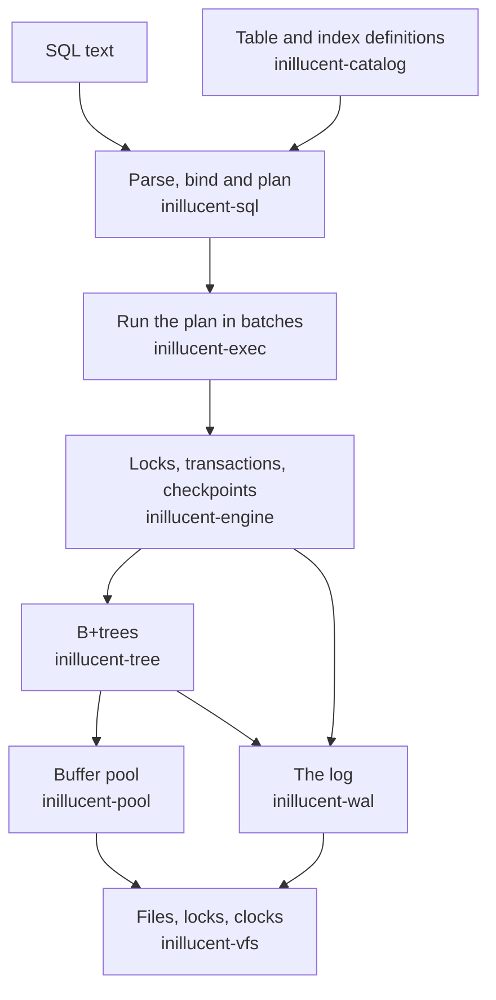
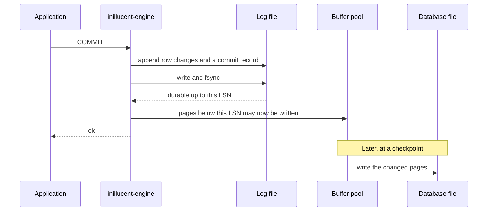
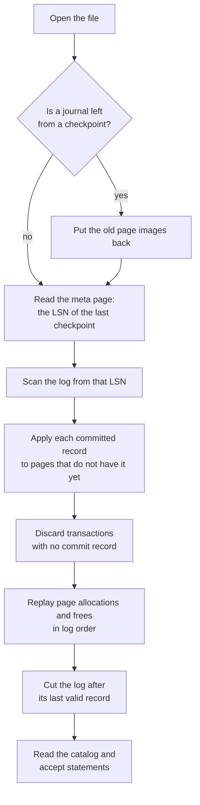
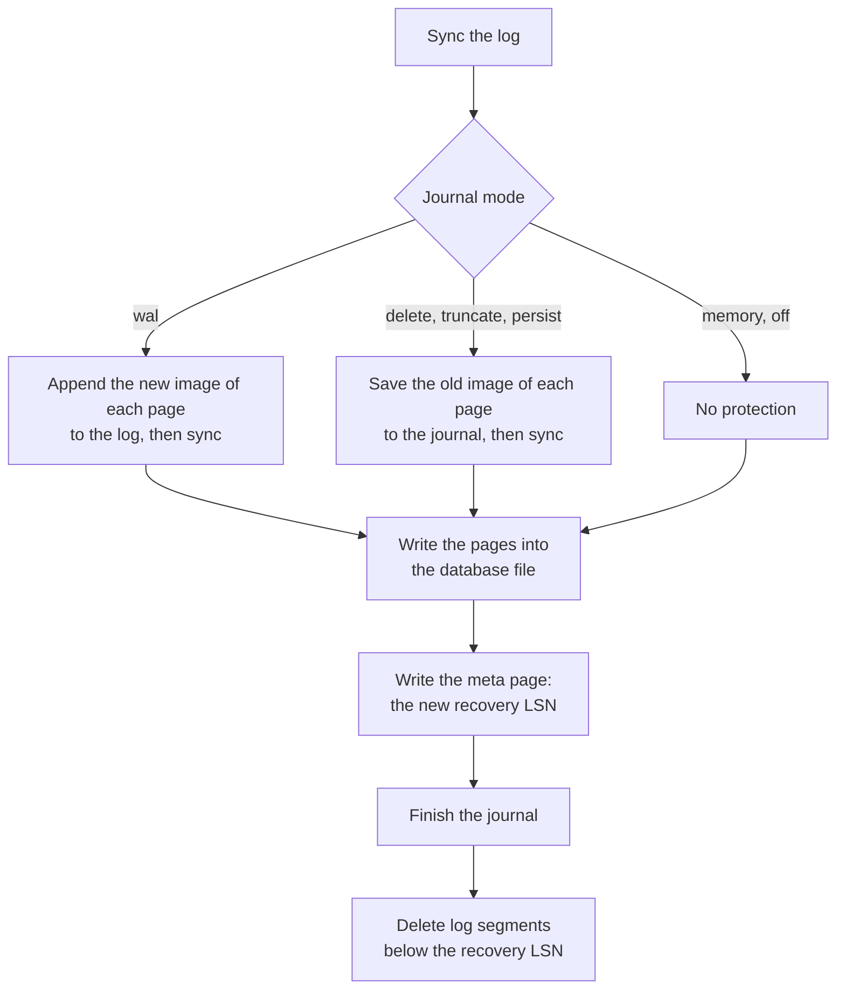

# How the relational engine works

This page describes the SQL half of inillucent: how rows are stored, how a transaction commits, what
the log holds, what happens on the next open after a crash, and what a checkpoint, a backup and
`--root` do. [Architecture](architecture.md) describes the other half, the retrieval engine.
[Architecture in one page](architecture-overview.md) is a shorter version of both.

The page is for two readers. One is an operator who needs to know what a crash can cost. The other
is an engineer who is about to change the engine. Neither needs to have built a database before.
Each rule on this page names the test that checks it.

## Terms used on this page

| Term | What it means here |
|---|---|
| **Page** | The fixed size block the database file is divided into. Every read and write moves whole pages. The default is 32,768 bytes. |
| **Frame** | One slot in the buffer pool. A frame holds one page. |
| **Buffer pool** | The pages the engine keeps in memory, so a read does not go to the disk. `PRAGMA cache_size` sets its size. |
| **Pin** | Holding a page in its frame while code reads it, so the buffer pool cannot evict that page during the read. |
| **B+tree** | The structure a table or an index is stored in. Rows sit only in the bottom pages, and the pages above hold keys and page numbers. |
| **Leaf** | A page at the bottom of a B+tree. Leaves hold the rows. |
| **WAL** | The write ahead log. Records are appended to it before the database file changes. In inillucent it exists in every journal mode, in files named `<database>-wal.NNNNNNNNNN`. |
| **LSN** | Log sequence number: the byte position of a record in the log. Every page stores the LSN of the last record applied to it. |
| **Redo** | Applying a log record to a page during recovery, so the page gets a change the file did not have yet. |
| **Undo** | Putting back what a transaction changed when it rolls back. |
| **Checkpoint** | Writing the changed pages from memory into the database file, then deleting the log that is no longer needed. The engine code calls this a fold. |
| **fsync** | The operating system call that makes written bytes reach the disk. It is the slow part of a commit. |
| **Snapshot** | The state of the database at one moment. A reader with a snapshot sees the same rows for the whole of its transaction. |
| **Group commit** | Several commits that share one log write and one fsync. |
| **Journal mode** | `PRAGMA journal_mode`. In inillucent it chooses how a checkpoint is protected against a crash. It does not change where a commit goes: a commit always goes to the log. |

[The glossary](glossary.md) has these terms and more, one sentence each.

## Defaults

These are the values a new connection starts with. Each was read from the source and printed by
`PRAGMA <name>` against the 1.0.29 release build.

| Setting | Default | Where the source sets it |
|---|---|---|
| `page_size` | `32768` bytes. `PRAGMA page_size = N` and `VACUUM` do not change it. The engine API `Database::open_at` can create a file with 8192, 16384 or 65536 byte pages | `PAGE_SIZE` in `crates/inillucent-engine/src/connect.rs`, `PageSize::DEFAULT` in `crates/inillucent-pool/src/page.rs` |
| `cache_size` | `-131072`, which is 131,072 KiB: 4,096 frames of 32 KiB, or 128 MiB | `DEFAULT_FRAMES` in `crates/inillucent-engine/src/lib.rs` |
| largest `cache_size` | 262,144 frames. A larger request fails with the status `too_big` | the `CacheSize` row in `crates/inillucent-base/src/limits.rs` |
| `journal_mode` | `delete` | `Pragmas::fresh`, and the `journal_mode` handler in `crates/inillucent-engine/src/pragma/tuning.rs` |
| `synchronous` | `2`, which is `FULL` | `Synchronous` in `crates/inillucent-wal/src/writer.rs` |
| `busy_timeout` | `5000` milliseconds | `DEFAULT_BUSY_MILLIS` in `crates/inillucent-pool/src/file.rs` |
| `locking_mode` | `normal` | the `locking_mode` handler in `crates/inillucent-engine/src/pragma/tuning.rs` |

Run the same check yourself:

```sh
inillucent create demo.rdb
inillucent --db demo.rdb query "PRAGMA page_size"      # 32768
inillucent --db demo.rdb query "PRAGMA cache_size"     # -131072
inillucent --db demo.rdb query "PRAGMA journal_mode"   # delete
inillucent --db demo.rdb query "PRAGMA synchronous"    # 2
inillucent --db demo.rdb query "PRAGMA busy_timeout"   # 5000
inillucent --db demo.rdb query "PRAGMA locking_mode"   # normal
```

---

## 1. How the parts fit together



A statement moves down this picture in five steps.

1. **Parse.** `inillucent-sql` turns the text into a syntax tree. It reads no file and needs no
   catalog. A parse error carries a byte offset into the statement.
2. **Bind.** Names become columns, checked against a snapshot of the catalog. The binder decides
   here whether the statement reads or writes. `--readonly` refuses on that decision, so
   `SELECT 1; DROP TABLE t` is refused and a `SELECT` that contains the word "delete" is not.
3. **Plan.** The planner picks an access path and a join order. `EXPLAIN QUERY PLAN` prints its
   choice.
4. **Compile.** The plan becomes a chain of operators. The compiled form is cached by statement text,
   so preparing the same text again is a lookup.
5. **Run.** Batches of column values flow up the chain. A statement runs to the end on its first
   step and keeps the rows it produced. That is why `total` in a result is an exact count.

**Checked by:** the `engine` and `differential` test tiers. The `differential` tier runs the same SQL
through inillucent and a pinned SQLite 3.53.4 and compares the answers.

---

## 2. Who owns what

Each crate knows about the layer below it and nothing above it.

| Layer | Crate | What it knows | What it must not know |
|---|---|---|---|
| file system | `inillucent-vfs` | files, locks, clocks, randomness | anything above it |
| buffer pool | `inillucent-pool` | frames, page headers, the free map, values stored outside a page, the rollback journal | what a column is called |
| log | `inillucent-wal` | log segments, the record format, group commit, the recovery scan | pages and trees |
| B+trees | `inillucent-tree` | pages, keys, row bytes, collations | what a column is called |
| transactions | `inillucent-txn` | snapshots, the writer slot, undo, savepoints | SQL |
| SQL front end | `inillucent-sql` | parsing, binding, planning | files |
| execution | `inillucent-exec` | operators, batches, expressions | names |
| catalog | `inillucent-catalog` | `sqlite_schema`, root pages, declared types | plans |
| the database | `inillucent-engine` | all of the above, assembled into a database a caller opens | nothing is above it inside the engine |

Three rules follow from this table.

- **`inillucent-vfs` is the only crate that touches a file.** A test can therefore replace the disk
  with a simulated one, and the crash tests use that to fail a chosen write or sync. `--root` is
  enforced in `inillucent-vfs` for the same reason (section 8).
- **The log does not depend on the buffer pool.** A log record stores a page number as a plain
  `u64`. The pool is told the highest LSN that is safe on disk, and it refuses to write a page whose
  LSN is at or above that number. The log therefore reaches the disk before any page it describes.
- **The parser sits below the catalog.** The catalog uses the parser to read the `CREATE` text it
  stores. A parse needs no catalog, so the binder works against a read only view of the catalog and
  does no file access.

**Checked by:** `docs/invariants/layering.toml` lists which crate may depend on which.
`cargo test -p inillucent-compat --test tooling policy::` reads every crate's manifest and fails on a
dependency the file does not allow. The same test fails on an unformatted crate, on `unsafe` code
outside the operating system layer, and on a module that does not state its invariant.

---

## 3. Storage: pages and the buffer pool

A database is one file of equal sized pages. Page 0 and page 1 are the two copies of the meta page,
which records the page size, the catalog's root page, the free map and the log position of the last
checkpoint. The format version is at byte 8 of the meta page (section 6). Every other page belongs to
a B+tree, to the free map, or to a value too large to fit in its leaf.

Every page carries a checksum and the LSN of the last log record applied to it. A page whose
checksum fails is reported as damage. Recovery also treats a page whose checksum fails as a page
with no LSN, so every log record for that page is applied again.

### The buffer pool

The buffer pool holds pages in frames. A frame's memory is taken the first time the frame is used,
so a large `cache_size` costs little until pages are read into it.

| What you want | What to run |
|---|---|
| See the pool size | `PRAGMA cache_size`. A negative number is KiB, a positive number is pages |
| Make the pool larger | `PRAGMA cache_size = -524288` for 512 MiB |
| Make the pool smaller | a smaller `cache_size`. The pool keeps the memory it has and uses fewer frames |
| See hits, misses and evictions | `.stats` in `inillucent-shell` |

`PRAGMA cache_size` above 262,144 frames fails with `too_big`. At 32 KiB pages that ceiling is
8 GiB.

A changed page stays in its frame until a checkpoint writes it out. A transaction can change more
pages than the pool holds. The pool then writes some of that transaction's pages to the file early.
That early write is protected by a rollback journal, so a crash before the commit can put the old
page back. In `wal` mode the journal file is still created for this case.

---

## 4. Transactions and isolation

inillucent allows one writer at a time for each file. Other processes can read the file between
writes.

| Setting | What it does |
|---|---|
| `locking_mode = normal` (default) | a statement takes the file lock when it starts and releases it when it ends. A read takes a shared lock. A write takes an exclusive lock. An open transaction keeps the lock from its first write to its `COMMIT` |
| `locking_mode = exclusive` | the connection keeps the lock until it closes. No other process can use the file |
| `busy_timeout` | how long a statement waits for a lock another process holds. After 5000 milliseconds by default, the statement fails with the status `busy` |

A reader in another process waits while a writer holds the exclusive lock. It does not read an older
snapshot past that writer. `inillucent-txn` contains a snapshot implementation, and the shipped
engine does not use it between processes. There is no shared memory index a reader in another
process could use to find the log, so the engine holds the file lock instead. [The roadmap](roadmap.md) describes the change that would let a
reader of another process read a snapshot while a writer works.

When a connection takes the lock, it checks whether another process changed the file or the log
since it last looked. If either moved, it drops its cached pages and replays the log from the file's
last checkpoint before it reads anything.

`ROLLBACK` is done from the log. It works the same way in every journal mode, including `off`.

Two statements are refused inside an open transaction:

| Statement | Error |
|---|---|
| `DETACH` | `cannot DETACH database within transaction` |
| `VACUUM` | `cannot VACUUM from within a transaction` |

`DETACH` is refused because a transaction records the files it touches by their attachment number,
and removing one would renumber the others. `VACUUM` is refused because it reads committed rows,
and an open transaction has not committed.

A transaction that writes to more than one attached file is decided by a super journal outside those
files. Each file's log holds a vote. Recovery reads the super journal to learn whether the vote
became a commit.

**Checked by:** `inillucent-txn`'s own `transactions` and `durability` suites, and the
`multi_database_commit` and `multi_database_participants` suites in `inillucent-compat`. The model in
`crates/inillucent-model` is a second, separate implementation of the transaction rules. It depends
on one crate only, so it cannot share a bug with the engine.

---

## 5. The log, and what a crash costs

### What a commit does



The rule is **write ahead**: a log record reaches the disk before the page it describes. A commit
appends its row changes and a commit record to the log, then writes and syncs the log. The changed
pages stay in the buffer pool. A later checkpoint writes them into the database file. Until then an
acknowledged commit exists only in the log, and the log is enough to rebuild it.

`inillucent-engine` connects the two halves. After every sync of the log it tells the buffer pool the
new durable LSN. The buffer pool refuses to write a page whose LSN is at or above that number.

**Group commit.** Several connections that commit at the same moment share one log write and one
fsync. The first committer writes and syncs the log for all of them. The others wait until their own
records are on disk. A single connection does one write and one sync for each commit under
`synchronous = FULL`.

**A failed write stops the log.** If a log write or sync fails, the log keeps the error and every
later call returns it. The engine then refuses to start new work, because a log with a gap in its
durable records cannot be trusted.

The log is stored in segment files beside the database: `app.rdb-wal.0000000001`,
`app.rdb-wal.0000000002`, and so on. A segment holds up to 64 MiB before the log moves to the next
one. A checkpoint deletes the segments it no longer needs. After a clean close, one small segment
file stays beside the database.

### `PRAGMA synchronous`: what a crash can lose

| `synchronous` | When the log is synced | A crash of the process | A power loss |
|---|---|---|---|
| `2`, `FULL` (default) | on every commit | loses nothing that was acknowledged | loses nothing that was acknowledged |
| `1`, `NORMAL` | when 64 MiB of log has built up, before a checkpoint, and when a statement that wrote releases the file lock | loses nothing that was acknowledged | may lose the most recent commits, and does not damage the database |
| `0`, `OFF` | never | the source makes no promise | may lose commits and may damage the database |

`PRAGMA synchronous = 3` (`EXTRA`) is accepted and behaves as `FULL`.

These rules come from `NORMAL_SYNC_BYTES` and the `Synchronous` type in
`crates/inillucent-wal/src/writer.rs`. Under `NORMAL` a commit is acknowledged when its record has
been written to the operating system. The operating system keeps those bytes when the process dies.
A power loss can drop them.

### Recovery on open



Recovery runs on every open, before anything reads a page. It runs the same way for the main
database and for every file `ATTACH` opens. When recovery replayed committed transactions, the command
line prints a line such as this one:

```text
recovered the log: 3 records scanned, 2 applied, 1 transactions committed, 0 discarded.
```

Four rules make recovery safe:

1. **Replay can run twice.** A page stores the LSN of the last record applied to it, so a record the
   page already has is skipped.
2. **A record for a page that no longer exists is skipped.** The page may have been freed and the
   file made shorter.
3. **A page stamped with an LSN this log cannot have written is refused.** Such a page would skip
   every later record, and those writes would be lost with no error.
4. **Allocations and frees are replayed in log order.** A page that was freed and then allocated
   again inside the replayed range must come back allocated. If all frees were replayed last, a live
   page would be marked free, and the next allocation would give it to a second owner.

A read only connection replays the log into its own memory and writes nothing to the disk. If a read
only connection finds a journal left by an interrupted checkpoint, it refuses to open, because
putting the old pages back is a write.

**Checked by:** `crates/inillucent-compat/tests/durability/new_engine_free_map_recovery.rs`,
`new_engine_recovery_shapes.rs`, `wal_crash.rs`, `multi_database_crash.rs`, and the `durability` tier.
The `durability` tier stops a simulated machine at a chosen write or sync, then reads back what the
file holds.

### Checkpoints

A checkpoint writes the changed pages from the buffer pool into the database file, records the new
recovery point in the meta page, and deletes the log segments that are no longer needed.



A checkpoint runs at four moments:

| When | What starts it |
|---|---|
| The log has grown by 4 MiB since the last checkpoint | a statement that wrote, as it releases the file lock. The number is `RECLAIM_BYTES` in `crates/inillucent-engine/src/checkpoint.rs` |
| The connection closes | the connection holds pages the file does not have, or a journal with old page images in it |
| Somebody asks | `PRAGMA wal_checkpoint`, `inillucent checkpoint`, `VACUUM`, `inillucent backup`, an integrity check, or the driver's `checkpoint` |
| The journal mode or the locking mode changes | `PRAGMA journal_mode` or `PRAGMA locking_mode` |

A checkpoint writes pages in place. If the power fails halfway, some pages hold new bytes and some
hold old bytes. The log alone cannot always repair that, because most log records hold row changes
and not whole pages. The journal mode decides what protects the checkpoint:

| `journal_mode` | What protects a checkpoint | After the checkpoint | After a crash during a checkpoint |
|---|---|---|---|
| `delete` (default) | old page images in `<database>-journal`, synced before any page is written | the journal file is deleted, and the directory is synced | the old images are put back, then recovery replays the log |
| `truncate` | the same journal | the journal is cut to zero bytes | the same as `delete` |
| `persist` | the same journal | the journal's header is zeroed | the same as `delete` |
| `wal` | the new image of every page, appended to the log and synced before any page is written | nothing to finish | recovery installs the page images from the log |
| `memory` | nothing | nothing to finish | a half written checkpoint stays half written |
| `off` | nothing | nothing to finish | the same as `memory` |

In `wal` mode a `<database>-journal` file is still created when a transaction's pages outgrow the
buffer pool (section 3). Writing an uncommitted page early needs an old image to undo it, and a log
of new images cannot undo.

`inillucent` and `inillucent-shell` turn on `PRAGMA defensive`. Under `PRAGMA defensive`,
`PRAGMA journal_mode = off` is refused, and the pragma answers with the mode already in force.

The journal has a checksum on its header and on every record. Recovery stops at the first record
that fails its checksum. A record can fail only if it was written after the journal's last sync, and
no page is overwritten before the sync that covers its old image. So every record from the failure
onward names a page the checkpoint had not reached. Each record also carries the transaction's
nonce, so `persist` mode cannot replay a record left from an earlier transaction. The two meta pages
are journaled like any other page, so an interrupted checkpoint cannot leave a meta page that names
a checkpoint which never finished.

### The evidence

The crash campaigns stop a simulated machine at every write and every sync of a workload, then
recover and compare the result. Each campaign runs from a fixed seed and writes its result into
`tests/crash/`. A change to one of these files is a change in what the engine does under failure.

| File in `tests/crash/` | What it records |
|---|---|
| `delete-full-crash.txt` | 94 cut points, 56 acknowledged commits, no detected damage, nothing lost |
| `truncate-full-crash.txt` | 166 cut points, 55 acknowledged commits, no detected damage, nothing lost |
| `persist-full-crash.txt` | 166 cut points, 55 acknowledged commits, no detected damage, nothing lost |
| `delete-full-checkpoint-crash.txt` | 55 cut points inside a checkpoint, every one recovered to the committed state |
| `truncate-full-checkpoint-crash.txt` | 54 cut points inside a checkpoint, every one recovered to the committed state |
| `persist-full-checkpoint-crash.txt` | 54 cut points inside a checkpoint, every one recovered to the committed state |
| `wal-commit.tsv` | 32 cut points in `wal` mode: 29 recovered the old state, 3 the new state, none damaged |
| `wal-checkpoint.tsv` | 62 cut points in a `wal` checkpoint: 29 old, 33 new, none damaged |

**Checked by:** `crates/inillucent-compat/tests/durability/durability.rs` and `wal_crash.rs` write those files.
`crash_reports.rs` fails when a campaign reports fewer cut points than the number a person accepted.
`new_engine_log_retire.rs` checks that a checkpoint deletes the log it no longer needs.

---

## 6. What a file's format version promises

The first eight bytes of a database are `RDB2` and four zero bytes. The next four bytes are the
**format version**. This build writes format `2` and reads formats `1` and `2`. The number is covered
by the meta page's checksum, so a hand edited version fails the checksum.

| Rule | What it means |
|---|---|
| A point release reads every file an earlier point release of the same minor version wrote | a bug fix never changes the format version |
| A change to the layout of a page, a record or the header raises the format version | that is a minor version, and it comes with a migration |
| A build that meets a higher version refuses the file by name | the error is `this database is format version N and this build reads version 2; upgrade inillucent to open it`, with the status `unsupported`. The command line exits 3 |
| A version below 1 is reported as damage | there is no format 0, so a zero means the header was overwritten |

A migration is `inillucent-migrate`, which reads the older file and writes a new one. It does not
rewrite the file in place, because a crash could stop a rewrite halfway.

### Format 2, and how a format 1 file still opens

Format 2 changed two things in a page:

- **A leaf's delta area has a directory.** The delta area holds rows written to a leaf since it was
  last packed. Format 2 starts it with a list of two byte entries in key order, so a lookup is a
  binary search, and the area can use the leaf's whole free space. The layout is in
  `crates/inillucent-tree/src/leaf/delta.rs`.
- **A page's checksum covers its LSN.** In format 1 a flipped bit in the LSN went undetected. The
  rule is in `crates/inillucent-pool/src/page.rs`.

This build reads a format 1 file page by page. A leaf carries the flag `LEAF_DELTA_DIRECTORY` that
says which layout its delta area uses, and a checksum is accepted under either rule. A format 1 leaf
keeps format 1's rules until a compaction or a split rewrites it. That rule exists because recovery
replays the log onto the pages the file holds, and it must produce the same bytes the log was written
against. The file's own version becomes 2 at the next checkpoint.

Releases 0.1.5, 0.1.6 and 0.1.7 refuse a format 2 file with
`this database is format version 2 and this build reads version 1; upgrade inillucent to open it`.
Releases 0.1.1, 0.1.2 and 0.1.3 answer `database disk image is malformed: neither meta page is
readable`. None of them reads the file.

### Values stored outside a page

A value too large for its leaf is stored on other pages. The leaf keeps a sixteen byte **extent
reference**: a page number and a length. Two bits above the page number, `CLASS_STATED` and
`CLASS_TEXT`, say whether the value is text or a blob when the column's declared type would give the
wrong answer. A column declared with no type, as in `CREATE TABLE t (a)`, is such a case.

Every other reference is written exactly as before. A build older than the class bits reads a stated
reference as a page number above 2^62, fails to fetch it, and reports an error. It never returns the
bytes with the wrong type. `ExtentClass` in `crates/inillucent-pool/src/extent.rs` holds the
encoding. `extent_class_for` and `extent_datum` in `crates/inillucent-tree/src/leaf/layout.rs` write
and read it.

### Layouts inside the file

The format version covers pages, records and the header. It does not cover what a virtual table
stores in its shadow tables. Those layouts carry their own numbers:

| Layout | Where its number is | What a newer number does |
|---|---|---|
| pages, records and header | byte 8 of the meta page, `crates/inillucent-pool/src/meta.rs` | the database does not open |
| an FTS5 index | a `%_data` row, `crates/inillucent-ext/src/vtab/fts5/layout.rs` | the database opens and the table's rows read. `MATCH`, any write, and `fts5vocab` fail with `the full-text index on T is in layout N, written by inillucent X.Y.Z, and this build reads layouts up to 2` |
| an `inillucent_search` index | the `format` row of `%_config`, `crates/inillucent-search/src/options.rs` | the database opens. Every read and write of the table fails with `the table is in format N, written by inillucent X.Y.Z, and this build reads formats 1 and 2` |

All three refusals carry the status `unsupported`, so the command line exits 3. An application can
then tell "upgrade and try again" apart from a wrong query and from an empty result.

A search table with no facet column stores format `1`. A search table with a facet column stores
format `2`, so a build that does not know facets refuses that table by name.

A missing FTS5 layout record means "a layout this build can read". Files written before the record
existed have none, and they open. The record is written by `CREATE VIRTUAL TABLE`, `rebuild` and
`delete-all`. An ordinary insert does not write it, because a file written by 0.1.2 through 0.1.7 can
hold rows in both FTS5 layouts. `term_value` in `crates/inillucent-ext/src/vtab/fts5/index.rs`
reads such a file one row at a time.

Release 0.1.1 is the one published build that misreads a later file. It answers
`WHERE note_fts MATCH 'segment'` with no rows on a file whose FTS5 index a later build wrote. Every
other query on that file answers correctly in 0.1.1.

**Checked by:** `crates/inillucent-compat/tests/nightly/release_format_history.rs` runs every published
release's own binary against a file this build wrote. The 0.1.1 `MATCH` answer is a row in its
`KNOWN_GAPS` list. `tests/interop/<version>/` holds a file each release wrote, and
`release_format.rs` opens each one, writes to it, crashes, and recovers. `format_refusal.rs` builds a
record from a future build and checks each refusal, including the command line's exit code.

---

## 7. Backup, `VACUUM` and integrity checks

| Command | What it does |
|---|---|
| `inillucent backup <file>` | runs a checkpoint, copies the database file to `<file>`, then opens the copy and checks every tree in it. A file already at `<file>` is replaced |
| `inillucent restore <file>` | points this session at `<file>`. It changes no file. To replace a database, copy the backup over it |
| `VACUUM` | rebuilds the database: it runs the stored `CREATE` statements again, copies every row back through the normal write path, writes the result beside the database, and renames it over the database |
| `VACUUM INTO '<file>'` | writes a compacted copy the same way. It refuses a file that already exists, with `output file already exists` |
| `inillucent checkpoint` | runs `PRAGMA wal_checkpoint`. Run it before you copy a database file by hand |

A rename replaces a directory entry in one step, so a crash leaves either the old file or the new
one. `VACUUM` and `VACUUM INTO` both fail inside an open transaction. `--root` confines both
(section 8).

`VACUUM` does all its file work through the connection's own `Vfs`: it creates the new file, renames
it with `Vfs::rename`, and deletes the old log segments through the same `Vfs`. An application that
supplies an encrypting or in memory `Vfs` therefore gets a `VACUUM` that stays inside it. The code is
in `crates/inillucent-engine/src/rebuild.rs`.

**Checked by:** `crates/inillucent-compat/tests/engine/vacuum_on_vfs.rs`, and `vacuum_crash.rs`, which
crashes a simulated machine inside the rename.

### `PRAGMA integrity_check` and `PRAGMA quick_check`

| Pass | What it finds | `quick_check` | `integrity_check` |
|---|---|---|---|
| every tree on its own | a leaf that does not parse, keys out of order, a separator that does not match its child, a sibling chain that skips a leaf | yes | yes |
| every page against every other page and the free map | a page two trees both reach, a page a tree reaches that the free map calls free, a page marked allocated that no tree reaches | yes | yes |
| every index against its table | a duplicate in a `UNIQUE` index, a row with no index entry, an index entry for a row that is not there | no | yes |

The page pass finds a page that two tables share. Each tree looks correct on its own in that case,
so only the page pass can report it.

A page that is allocated and that no tree reaches is lost space. No data is lost with it. No
statement leaves such a page behind: a dropped table, a `CREATE` that rolled back, and a `REINDEX`
all give their pages back.

Both checks read and never repair. Neither proves the database opens, because damage in the log is
outside the file they read. To check a database before you rely on it, open it.

---

## 8. Limits on one request, and `--root`

### What one request may spend

`inillucent_base::budget` limits the rows, the bytes and the time one request may use, and holds the
flag `cancel` sets. The engine checks the budget at two points:

- every batch a result collects, which limits what the caller receives;
- every leaf a scan reads, which limits the work done on the way. A `SELECT` whose `WHERE` rejects
  every row still stops.

| Program | Rows scanned | Row bytes | Time | Rows one call returns | Request and reply size |
|---|---|---|---|---|---|
| a Rust application, a driver, `inillucent`, `inillucent-shell` | no limit | no limit | no limit | no limit | no limit |
| `inillucent-mcp` | 10,000,000 | 256 MiB | 60 seconds | 10,000. `limit=0` is refused by name. The default is 200 | a request line up to 1 MiB, a reply up to 8 MiB |

An application that links the engine has no reason to limit itself. A server that hands a database to
an agent does, so only `inillucent-mcp` sets limits. The numbers are `Limits::served` in
`crates/inillucent-base/src/budget.rs` and `MAX_ROWS`, `MAX_REQUEST_BYTES` and `MAX_RESPONSE_BYTES`
in `crates/inillucent-cli/src/mcp.rs`.

`cancel` sets its flag from any thread. The statement fails with the status `interrupted`, and the
connection stays usable. `inillucent capabilities` reports `cancel` as `partial`, because an operator
finishes the piece of work it is in before it sees the flag.

**Checked by:** `crates/inillucent-compat/tests/e2e/budgets.rs`, which drives the shipped
`inillucent-mcp` over `JSON-RPC`. One case checks that the command line has no limit, so a change
that put the limit everywhere fails.

### `--root` confinement

```sh
inillucent --root /srv/data --db /srv/data/app.rdb backup /tmp/copy.rdb
# Error [invalid_state]: "/tmp/copy.rdb" resolves to /tmp/copy.rdb, which is outside /srv/data,
# which this server is confined to.
```

`--root DIR` means no file outside `DIR` is opened for a request. `inillucent-vfs` enforces it, and
`inillucent-vfs` is the only crate that opens files. So `ATTACH DATABASE`, `VACUUM INTO`, `backup`,
`restore`, `import`, `export` and the database named with `--db` all follow the same rule.

The check resolves the real path. Each part of the path is followed through the file system, so a
Windows junction or a Unix symbolic link inside the root is replaced by its target before the
check. `..` removes the last part of the resolved path. A path that does not exist yet is checked up
to its deepest existing parent, so a file about to be created can be allowed.

**Checked by:** `crates/inillucent-compat/tests/e2e/confinement.rs`, which drives the shipped programs.
It first shows that each escape works without `--root`, so a refusal proves the confinement works.

---

## 9. Extensions and virtual tables

The host hands a virtual table module the root pages of its shadow tables. The module never looks up
a name and never opens a transaction of its own. FTS5 and the R-Tree keep their indexes in ordinary
tables, and this rule keeps them away from the catalog and the session.

`inillucent_search` is registered at the connection, one layer above the other modules.
`Registry::with_builtins` sits two crates below the retrieval engine, and registering it there would
link a vector index into every database.

**Checked by:** `fts5.rs`, `rtree.rs`, `vtab.rs`, `new_engine_vtab.rs` and
`new_engine_vtab_stream.rs`.

---

## 10. Keeping a vector index current

An `inillucent_search` table keeps its index in five shadow tables:

| Shadow table | What it holds |
|---|---|
| `%_content` | the rows, one column per declared column, facets included |
| `%_delta` | a log of the rows that changed since the index was last built |
| `%_gen` | the published generations of the built index |
| `%_state` | which generation is current and how far it covers |
| `%_config` | the declaration, including which columns are facets |

A facet's value goes into the index as an attribute of the row, so a search can filter on it before
it ranks.

Four operations touch the index, and each costs a different amount:

| Operation | What it does |
|---|---|
| a write | an `INSERT`, `UPDATE` or `DELETE` writes the row and one delta row. It does not touch the HNSW graph |
| a query | loads the current generation, applies the delta rows it does not cover, and answers from the merged index. BM25 scores depend on the whole corpus, so the delta must be merged before ranking. The merged index is cached on the connection for the same delta entries |
| a commit that folds | when the delta log passes its limit, the commit inserts each pending entry into the current generation and publishes the result as the next generation. The graph work is one insert per delta entry |
| `compact` or `rebuild` | `INSERT INTO docs(docs) VALUES('compact')` reads every row and builds a new graph. It removes the chunks earlier folds marked as deleted. It runs inside the caller's transaction like any other write |

### The settings

| Declaration | What it does | What it costs |
|---|---|---|
| no `compact` clause | the delta log folds at 1,024 entries (`COMPACT_FLOOR` in `crates/inillucent-search/src/options.rs`) | a fold builds a segment from its own batch and writes nothing else, so a commit's cost does not grow with the table |
| `compact = N` | the delta log folds at `N` entries | a larger `N` means fewer, larger segments: less work at query time, more work in the commit that folds |
| `compact = 0` | nothing folds automatically | the delta log grows without limit, and every query reads all of it until `compact` runs. A bulk load wants this, and the migration declares it |
| `threads = N` | a fold and a build use `N` cores | `threads = 1` keeps the engine on one core and makes a fold about `N` times slower |
| `mode = 'exact'` (the default for a table declared `USING inillucent_search`) | a vector search compares every row | recall is 1.000, and a fold cannot change an answer |
| `mode = 'approximate'` (the default for an index made with `CREATE INDEX ... USING inillucent_hnsw`) | a vector search walks the HNSW graph | recall depends on the graph |

### What folding costs

`inillucent-foldgate` runs two arms on the same corpus, vectors and commit boundaries, one row per
transaction, each arm in its own process. The `fold` arm folds. The `build` arm declares
`compact = 0` and runs `compact` at the commits where `fold` folds, which is the older behavior. The
run below used 40,000 documents of 64 dimensions, `mode = 'approximate'`, on a 24 core Windows
machine. It was recorded on this page on 9 September 2026.

| | fold | build |
|---|---:|---:|
| chunks inserted into the graph, whole run | 35,579 | 255,989 |
| chunks inserted by the largest single publish | 4,447 | 35,579 |
| generations published | 19 | 19 |
| commit time, median | 5.0 ms | 5.3 ms |
| commit time, 99th percentile | 17.1 ms | 17.2 ms |
| commit time, slowest | 5,189.0 ms | 4,085.1 ms |
| recall at ten, against an exact scan | 0.704 | 0.637 |
| peak memory | 180.9 MiB | 196.4 MiB |
| database file | 204.6 MiB | 204.6 MiB |
| reopen and answer the query set | 2,875.6 ms | 3,015.4 ms |
| reads served by a second connection during the run | 14,700 at 5.2 ms median | 17,912 at 5.0 ms median |
| reads refused | 0 | 0 |

Both arms answered the query set the same way after a close and a reopen. Folding did 7.2 times less
graph work over the run, and its largest publish was 8.0 times smaller. The slowest commit was
slower with folding, because a fold reads and decodes the generation it folds into before it writes
the new one. The median and 99th percentile commits were the same or faster.

Segmented generations then made the default fold limit a constant 1,024 entries. Measured on
100,000 documents, one row per commit, the median commit went from 0.152 ms to 0.032 ms and the
99th percentile from 0.923 ms to 0.097 ms. That run was recorded on this page on 13 September 2026.

### What an application can read back

`%_state` is an ordinary table:

| Key | What it says |
|---|---|
| `rows` | live rows in `%_content` |
| `chunks` | chunks in the current generation, live and deleted |
| `inserted` | chunks the last build inserted into the graph |
| `folds` | folds since the last `compact` or `rebuild` |
| `generation` | which generation is current |
| `covered` | the highest delta sequence the current generation contains |

`chunks` minus `rows` is how many chunks the graph holds that no live row points at. An update marks
the old chunk deleted and adds a new one, and only `compact` or `rebuild` removes the old one. When
that difference or `folds` is large, run `compact`.

### What a failure leaves

Publishing a generation is a set of ordinary writes inside the caller's transaction. A crash during
a publish leaves the old generation current and the delta log unchanged. The replaced generation's
rows stay in the file until `drop-old-generations` runs, because a snapshot opened before the switch
may still read them.

If a generation cannot be read back, the query fails with an error, and `rebuild` repairs it.
`%_content` holds every row, so the index can always be built again from the database alone.
`integrity-check` compares the recorded row count with the rows, checks every vector's width, and
names any delta entry whose row is missing.

**Checked by:** `search.rs`, `search_crash.rs`, `vector.rs`, `new_engine_search.rs`, the graph's own
tests in `crates/inillucent-core/src/hnsw.rs`, and `inillucent-foldgate` for the numbers.

---

## 11. Where to go next

| Question | Page |
|---|---|
| Which SQL runs, and what differs from SQLite? | [SQL support](sql.md) |
| What does each pragma do? | [Pragmas](pragmas.md) |
| How fast is it, and on what machine? | [Performance](performance.md) |
| What do the 416 measured cases show? | [Feature comparison](feature-comparison.md) |
| How does the retrieval engine work? | [Architecture](architecture.md) |
| What may a crate link? | [Dependency policy](dependency-policy.md) |
| What is not built yet? | [Roadmap](roadmap.md) |
| What is each crate for? | [Repository](repository.md) |
| What does a term mean? | [Glossary](glossary.md) |
