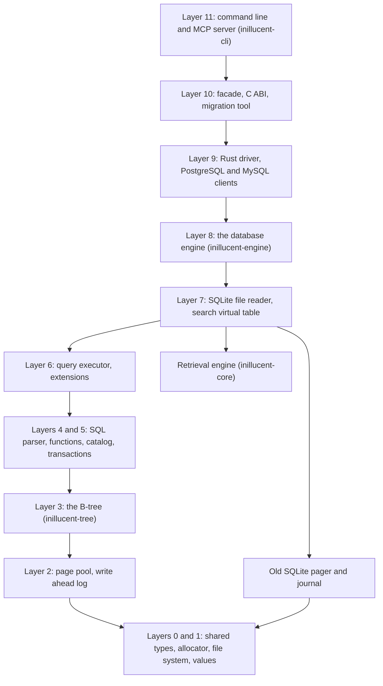

# The repository

This page describes how the source code is laid out, how to build it, and how to run the tests. It
is for someone who wants to read or change the code.

If you are changing the code, read [`AGENTS.md`](../AGENTS.md) section 2 and
[`agent-skills/inillucent-develop`](../agent-skills/inillucent-develop/SKILL.md) first. Both are
shorter than this page. They list the five rules a test checks, and a change that breaks one of
those rules fails the build.

## Terms used on this page

| Term | Meaning |
|---|---|
| crate | one Rust package. The repository is a Cargo workspace of 29 crates |
| layer | a number in `docs/invariants/layering.toml`. A crate may depend only on the crates its row lists |
| page pool | the buffer pool: the part of the engine that keeps database pages in memory |
| log | the write ahead log. Every change is written to the log before any page changes |
| oracle | the pinned SQLite 3.53.4 build that the differential tests compare against |
| fuzz target | a program that feeds random bytes to a decoder to find inputs that crash it |
| region | a unit of code coverage: one stretch of code that runs as a whole |

The [glossary](glossary.md) explains B-tree, WAL, HNSW, BM25 and the other storage and search terms.

## Building

```sh
cargo build --release
```

That command builds the engine and the four programs: `inillucent`, `inillucent-shell`,
`inillucent-mcp` and `inillucent-migrate`.

Two optional cargo features need extra files on the machine:

| Feature | What it adds | What it needs |
|---|---|---|
| `onnx` | the embedding model, run inside the process | the ONNX Runtime shared library |
| `embed` | `embed(TEXT)` as a SQL function | ONNX Runtime and the model weights |

One command installs both, on Windows, Linux and macOS:

```sh
inillucent setup-embeddings all
```

The engine looks in the folders that `inillucent setup-embeddings` writes to, so nothing has to be
exported afterwards. `ORT_DYLIB_PATH` and `INILLUCENT_ONNX_DIR` override those folders on a machine
that already has a copy somewhere else. [Embeddings](embeddings.md) covers both features.

**On Windows**, Git Bash does not inherit the MSVC `INCLUDE` and `LIB` variables. The `onig_sys`
crate compiles C code and needs them. Read them out of `vcvars64.bat` once and export them in the
shell before `cargo build`. The test runner described below does this for you.

## The crates

Each crate sits on a numbered layer in `docs/invariants/layering.toml`. A crate may depend only on
crates in lower layers, and only on the ones its row names. The test
`the_workspace_obeys_the_dependency_contract` fails on any other dependency.



An arrow means "may depend on". `inillucent-core` is on layer 0 and depends on nothing in the
workspace. `inillucent-search`, `inillucent-migrate`, `inillucent-cli`, `inillucent-compat` and `inillucent-bench` depend on `inillucent-core` directly. The old pager and
journal are reached by `inillucent-sqlite-reader` and `inillucent-catalog`.

All 29 workspace members, as `Cargo.toml` lists them:

| Crate | Layer | What it is for |
|---|---:|---|
| `inillucent-alloc` | 0 | a counting allocator with size classes. The memory measurements go through it |
| `inillucent-base` | 0 | checked integers, identifiers, buffers, limits, and the error codes every layer shares |
| `inillucent-core` | 0 | the retrieval engine: HNSW vectors, a BM25 inverted index, and the store under both |
| `inillucent-vfs` | 1 | the file system layer. It is the only crate that touches files, clocks and randomness |
| `inillucent-value` | 1 | values, affinities, collations and record encoding |
| `inillucent-pool` | 2 | the page pool: frames, latches, writeback, the free map and large value extents |
| `inillucent-wal` | 2 | the write ahead log: segments, the record format, group commit and recovery |
| `inillucent-storage` | 2 | the old engine's SQLite file pager. `inillucent-sqlite-reader` reads SQLite files through it |
| `inillucent-tree` | 3 | the B-tree: pages, keys and records, with no knowledge of column names |
| `inillucent-transaction` | 3 | the old engine's journal and locks, kept for the same reason as `inillucent-storage` |
| `inillucent-txn` | 4 | transactions: snapshots, the writer slot, undo, savepoints and the commit order |
| `inillucent-sql` | 4 | the lexer, parser, binder and planner |
| `inillucent-scalar` | 5 | arithmetic, type conversion and the built in scalar functions such as `substr` and `strftime` |
| `inillucent-catalog` | 5 | tables, indexes and other schema objects, and the statistics the planner reads |
| `inillucent-exec` | 6 | the query executor. It runs the plan `inillucent-sql` produces |
| `inillucent-ext` | 6 | JSON functions, virtual tables, FTS5, R-Tree and the extension registry |
| `inillucent-sqlite-reader` | 7 | opens a SQLite 3 file for reading. It never writes to the file |
| `inillucent-search` | 7 | puts the retrieval engine behind SQL as a virtual table, inside the same transactions |
| `inillucent-engine` | 8 | the database: open, recover, import a SQLite file, and run statements |
| `inillucent-driver` | 9 | the public Rust API that applications and language bindings use |
| `inillucent-remote` | 9 | reads a running PostgreSQL or MySQL server so it can be migrated |
| `inillucent` | 10 | the facade crate. It contains `pub use inillucent_driver::*;` and nothing else |
| `inillucent-driver-capi` | 10 | the C ABI over `inillucent-driver`, built as a dynamic and a static library |
| `inillucent-migrate` | 10 | the `inillucent-migrate` program: verified migration from SQLite, PostgreSQL, MySQL and retrieval indexes |
| `inillucent-cli` | 11 | the `inillucent`, `inillucent-shell` and `inillucent-mcp` programs |
| `inillucent-sim` | 11 | test only: a simulated file system that injects faults on a fixed seed |
| `inillucent-compat` | 12 | test only: the parity manifest, the SQLite comparison, the gates and the test runner |
| `inillucent-model` | 12 | test only: a model of what the engine should do, and the traces that drive it |
| `inillucent-bench` | 12 | test only: the grading harness for search quality |

### The public Rust API

`inillucent-driver` is the public Rust API, and the `inillucent` crate is another name for
`inillucent-driver`. `cargo add inillucent` gives these types: `Database::open`,
`Database::session`, `Connection::query`, `Connection::prepare`, `Connection::begin`, and the
`Transaction` that rolls back when it is dropped. The C ABI and the four language packages reach the
engine through `inillucent-driver` too.

`inillucent-driver` is built on `inillucent_engine::connect::Database`, which `inillucent-cli` also
calls directly. `Database::open` creates or opens a file and recovers it. `Database::import` reads a
SQLite file. `Database::session` returns a connection with `execute_batch`, `query`,
`prepare_with_tail`, `explain` and `begin`. The method is named `session` because two sessions can
share one transaction.

The engine that came before the current one is deleted.
[Closed items](closed-items.md#the-old-engine-is-deleted) lists its crates and says what reads a
SQLite file now.

## The other folders

| Folder | What it holds |
|---|---|
| `drivers/` | the part an application binds to. `drivers/inillucent-driver` is the Rust API, `drivers/inillucent-driver-capi` is the C ABI, and `drivers/README.md` is the starting page for someone writing a binding |
| `compat/` | the pinned SQLite manifest, the source register, the fixtures every differential suite reads, the recorded baselines, and the performance contract in `compat/perf/contract.toml` |
| `tests/` | the shared test data, the crash schedules, the workload traces, the test selection map, and [the testing standard](../tests/inillucent-testing-tdd.md) |
| `tools/` | the scripts that build the pinned SQLite, the feature probe, the gate fixture builder, and the documentation checks |
| `packaging/` | the release script and the files each package format needs |
| `agent-skills/` | one page per job, written for an AI agent |
| `examples/` | worked examples, each a project of its own outside the Cargo workspace. `examples/rag-agent/cli-example/` is a Greek philosophy database with its embeddings already built, which an agent searches with the command line. `examples/rag-agent/rust-example/` is an MCP server in Rust that builds and syncs its own database from the same corpus. `examples/todo-mvc/` is a todo service with a REST API in Rust. `examples/coffee-shop/` is a coffee shop's orders, stock and double entry books, as a REST API in Rust. `examples/rag-agent/cli-example/greek-philosophy.rdb` is the one committed `.rdb` file, and `.gitignore` says why |
| `fuzz/` | 16 libFuzzer targets over the decoders and parsers, built and run separately |
| `docs/invariants/layering.toml` | the layer of every crate and the dependencies each may have |

## Running the tests

Do not run `cargo test --workspace` while you work. Use the parallel runner. It runs only the tests
your change can affect:

```sh
cargo build -p inillucent-compat --bin inillucent-testrun --features testrun

target/debug/inillucent-testrun --tier smoke            # the smallest tier, while editing
target/debug/inillucent-testrun --changed               # what your uncommitted edits can break
target/debug/inillucent-testrun --changed origin/main   # the same, after you have committed
target/debug/inillucent-testrun --changed --list        # the selection, without running it
target/debug/inillucent-testrun                         # every tier except nightly
target/debug/inillucent-testrun --cadence nightly       # every tier
target/debug/inillucent-testrun --strict                # fail when a prerequisite is missing
```

The exit code is the result. Exit code 0 means every selected target passed. Exit code 1 means a
target failed. Exit code 2 means the run did not happen, for example because the build failed.
[`AGENTS.md`](../AGENTS.md) section 2 explains each exit code.

Each tier has a cadence. `change` tiers run on every change that can reach them. The `durability`
and `perf` tiers are `merge`: a change run selects one of their targets only when a crate that
actually changed is in its `covers`, and CI runs all of them on every push. The `nightly` tier runs
once a night in `packaging/nightly.ps1`, which also builds the release and runs the gates. The runner
builds only the targets it selected.

`inillucent-compat`'s integration tests are one binary per tier, with one module per suite:
`tests/engine/new_engine_log_lead.rs` is the target `inillucent-compat::engine::new_engine_log_lead`.
The runner still starts each suite in a process of its own.

If you use `cargo test --workspace`, pass `--no-fail-fast`. Without `--no-fail-fast`, cargo stops at
the first test binary that fails and the rest of the suite never runs.

### Tests that need something extra

Some suites need a program or a file that the workspace cannot build. Without it, such a suite skips
its cases and reports success. `--strict` turns each of those skips into a failure and names the
suite.

So a `--strict` run on a new machine names several suites. The number depends on what is installed.
A machine that will never have some of them lists them in the gitignored
`tests/prerequisites.local.toml`, as `absent = ["mysql", "postgres"]`. A strict run then reports the
suites that need only those under their own heading and does not fail for them.
The table below lists every prerequisite that a row of `tests/selection.toml` declares, how many rows
declare it, and how to get it. `cargo test -p inillucent-compat --test tooling documentation::` fails when a
prerequisite in `tests/selection.toml` is missing from this table or has a different count.

<!-- requires:begin -->

| prerequisite | rows | what provides it |
|---|---:|---|
| `oracle` | 31 | the pinned SQLite 3.53.4 comparison process: `pwsh tools/sqlite-reference.ps1` or `bash tools/sqlite-reference.sh` |
| `shell` | 9 | the pinned `sqlite3` 3.53.4 shell, built by the same two scripts |
| `tracked-fixtures` | 5 | the files under `compat/fixtures/`, which are committed. A new clone has them. The row is for a checkout that has lost them |
| `onnx` | 3 | ONNX Runtime and the embedding weights: `inillucent setup-embeddings all` |
| `python` | 3 | Python with the `ssl` module, for the TLS server, the `ctypes` conformance runner and the workload extractor |
| `fixtures` | 2 | the gate fixtures, 1.2 MB and 120 MB, which are not committed: `bash tools/build-gate-fixtures.sh _agent_output/fixtures` |
| `directory-link` | 2 | permission to create a directory link. Windows gives it to an elevated shell or a machine in developer mode |
| `node` | 1 | Node.js, for the npm package's conformance runner: https://nodejs.org/ |
| `go` | 1 | a Go toolchain, for the Go package's conformance runner: https://go.dev/dl/ |
| `php` | 1 | PHP, for the PHP package's conformance runner: https://www.php.net/downloads |
| `asan` | 1 | an address sanitizer in the C toolchain: MSVC with its `clang_rt.asan` runtime on Windows, or `cc -fsanitize=address` on Linux x86-64 or aarch64. The Rust side uses the pinned compiler with `RUSTC_BOOTSTRAP=1`, so no nightly is needed. `INILLUCENT_CAPI_ASAN=1` makes its absence a failure |
| `embed` | 1 | a build with `inillucent-engine/embed` turned on. The runner builds it from the target's `features` row. `tools/coverage.mjs` does not, because the feature needs `inillucent-core/onnx` and `inillucent-core` is left out of the coverage run |
| `baseline` | 1 | a recorded performance baseline: `cargo run -p inillucent-compat --bin inillucent-baseline -- capture` |
| `btree-corpus` | 1 | the saved sequences under `compat/corpus/btree/`, which are committed |
| `cc` | 1 | a C compiler on `PATH`, for the program that links the C ABI |
| `local-timezone` | 1 | a local time zone set in the operating system: `localtime_r` on Unix, `SystemTimeToTzSpecificLocalTime` on Windows |
| `mysql` | 1 | a running MySQL server, named by `INILLUCENT_TEST_MYSQL_URL` |
| `narrow-slots` | 1 | the narrow integer slots compiled in, set by a constant in `crates/inillucent-tree/src/leaf.rs` |
| `network` | 1 | outbound network access, turned on by setting `INILLUCENT_NETWORK_TESTS` |
| `nikaya` | 1 | a local checkout of the application the replay workload comes from. The extracted workload is committed, so this is only needed to check whether the extract is out of date |
| `openssl` | 1 | the `openssl` command, which makes the certificates the TLS suite serves |
| `postgres` | 1 | a running PostgreSQL server, named by `INILLUCENT_TEST_POSTGRES_URL` |
| `previous-release` | 1 | a published release's binary, downloaded and checked by `pwsh tools/build-interop-fixture.ps1 -Version <version>` into `tools/cross/bin/releases/`, which git ignores |
| `sqlite-bench` | 1 | the pinned benchmark driver, built by the same two scripts as the oracle |
| `testrun` | 1 | the runner itself: `cargo build -p inillucent-compat --bin inillucent-testrun --features testrun`. A plain `cargo test` does not build it |

<!-- requires:end -->

A row with no prerequisite runs everywhere. `cargo test -p inillucent-compat --test tooling selection::`
fails when a suite can skip and its row declares no prerequisite. It also fails when a row declares
a prerequisite and its suite cannot skip. Those two checks keep this table equal to the suites.

## What the tests cover

The workspace has 3,499 tests across 234 test targets. There are 234 rows in `tests/selection.toml`,
and each row is one `[[target]]` that the runner runs. `tools/doc-facts/check.mjs` fails when this
page gives a different count from `tests/selection.toml`.

The tests fall into these classes:

| Class | What it checks |
|---|---|
| Differential tests | the same SQL runs through inillucent and the pinned SQLite 3.53.4, and the results are compared. `semantics.rs` holds 208 cases and the feature probe holds 416 |
| SQLLogicTest subset | expected results were recorded from the pinned SQLite, so the suite grades inillucent against SQLite on a machine with no SQLite installed. The generator never reads inillucent's output |
| Model tests | a `BTreeMap` model runs the same operation traces as the engine, and the results must match |
| Fault injection | a simulated file system under the page pool, the log and the transaction engine. It must lose an unsynced write sometimes and a synced write never, for every seed. A recorded schedule must replay the same trace, event for event |
| Crash tests | a crash on either side of a checkpoint or a log retirement must recover to the same database |
| Fuzz targets | 16 libFuzzer targets run on a nightly toolchain. Four codecs also have a seeded version that runs under `cargo test`: the `fuzz_seeded.rs` files in `inillucent-base`, `inillucent-pool`, `inillucent-tree` and `inillucent-wal`. Each one sends twenty thousand fixed inputs through a decoder and fails when too few of them reach the decoder |
| Locking tests | two real processes take locks on one file, because advisory locks belong to a process. A dead process must release its locks |
| File system conformance | one suite runs against the in memory file system, the real file system and the simulator |

`inillucent-pool` and `inillucent-tree` are the two crates with the most coverage: 93.4% and 92.0% of
regions, and 94.3% and 93.8% of lines. Those numbers come from the table below.

29 of the 29 crates deny `unwrap`, `expect`, `panic` and slice indexing, and 21 forbid `unsafe`.
Those lints cover every path that reads SQL text, database pages, log frames, network bytes or file
system results. The lints go on each crate root: `lib.rs` for a library and `main.rs` for
`inillucent-bench`, which is a program.

### How much of the code the tests cover

The table below was measured on 2026-09-15 at commit `f9d1433`, which is the `v0.1.3` tag. The
command is `tools/validate.ps1 -Coverage` on Windows or `tools/validate.sh --coverage` on Unix. It
runs every suite under `cargo llvm-cov` and takes about an hour. The workspace is now at version
1.0.29 and the table has not been measured again.

The table shows region and line coverage. Branch coverage needs `-Z coverage-options=branch`, a
nightly compiler option, and `rust-toolchain.toml` pins a stable compiler.

<!-- coverage:begin -->

| crate | regions | region coverage | lines | line coverage |
|---|---:|---:|---:|---:|
| `inillucent-compat` | 32,756 | 40.6% | 19,940 | 42.3% |
| `inillucent-exec` | 22,980 | 90.3% | 13,552 | 92.0% |
| `inillucent-sql` | 21,174 | 86.1% | 13,065 | 88.2% |
| `inillucent-engine` | 17,737 | 87.3% | 11,377 | 88.9% |
| `inillucent-tree` | 16,992 | 92.0% | 8,465 | 93.8% |
| `inillucent-cli` | 13,208 | 48.4% | 7,836 | 50.1% |
| `inillucent-storage` | 14,409 | 82.9% | 7,751 | 82.8% |
| `inillucent-scalar` | 11,724 | 84.8% | 6,441 | 84.9% |
| `inillucent-ext` | 10,877 | 83.8% | 6,269 | 83.7% |
| `inillucent-remote` | 8,145 | 80.8% | 4,609 | 78.5% |
| `inillucent-pool` | 8,062 | 93.4% | 4,176 | 94.3% |
| `inillucent-search` | 5,481 | 82.0% | 3,300 | 82.4% |
| `inillucent-transaction` | 6,193 | 85.3% | 3,143 | 88.5% |
| `inillucent-value` | 5,425 | 95.4% | 3,073 | 95.6% |
| `inillucent-vfs` | 4,539 | 80.3% | 2,572 | 81.1% |
| `inillucent-migrate` | 4,330 | 77.5% | 2,418 | 79.4% |
| `inillucent-base` | 4,376 | 88.7% | 2,348 | 89.0% |
| `inillucent-catalog` | 3,458 | 78.2% | 2,068 | 80.4% |
| `inillucent-wal` | 2,650 | 93.7% | 1,683 | 96.8% |
| `inillucent-txn` | 2,527 | 89.8% | 1,464 | 88.0% |
| `inillucent-sim` | 2,146 | 95.0% | 1,317 | 95.4% |
| `inillucent-driver` | 1,806 | 65.1% | 1,185 | 64.6% |
| `inillucent-driver-capi` | 1,112 | 0.8% | 851 | 0.9% |
| `inillucent-sqlite-reader` | 432 | 86.6% | 228 | 89.9% |
| `inillucent-alloc` | 355 | 91.3% | 165 | 84.8% |
| **total** | **222,894** | **77.2%** | **129,296** | **77.8%** |

<!-- coverage:end -->

`tools/coverage.mjs --per-crate --write` writes the table between the two marker comments. The
table has 25 rows and the workspace has 29 crates. Three crates are left out of the run by name, and
the fourth is `inillucent`, the facade, whose only content is one `pub use` line, so it has no regions to
measure. `cargo test -p inillucent-compat --test tooling documentation::` fails when a workspace member has no
row, is not in the `EXCLUDED` list in `tools/coverage.mjs`, and is not named in a sentence here.

The three crates left out are `inillucent-core`, `inillucent-bench` and `inillucent-model`. They
need ONNX Runtime and a text corpus. On a machine without those, they would add uninstrumented zeros
to the table.

Two groups of rows need an explanation:

- `inillucent-driver-capi` shows 0.8%. The C ABI has a conformance suite, but that suite drives the
  functions from a C program linked against the built library. The coverage run measures only the
  Rust test programs, and no Rust test calls the C ABI functions.
- `inillucent-compat` and `inillucent-cli` hold many programs that run by hand or on a schedule: the
  gates, the profilers and the benchmarks. `cargo test` does not run those programs. The library
  code in both crates is covered by the suites that use it.

## The rules a test checks

| Rule | Where it is written | The test that fails |
|---|---|---|
| **Dependencies**: only crates on an allowed list | [`docs/dependency-policy.md`](dependency-policy.md) | `cargo test -p inillucent-compat --test tooling policy::` |
| **Layering**: which crate may depend on which | `docs/invariants/layering.toml` | `the_workspace_obeys_the_dependency_contract` in the same suite |
| **Test selection**: every test target has a row | `tests/selection.toml` | `cargo test -p inillucent-compat --test tooling selection::`, which names the target |
| **One command table**: the command line and MCP are generated from it | `crates/inillucent-cli/src/command/registry.rs` | `cargo test -p inillucent-compat --test tooling command_parity::` |
| **The testing standard**: where a new test goes and how the suite runs | [`tests/inillucent-testing-tdd.md`](../tests/inillucent-testing-tdd.md) | none. A reviewer checks it |

## Reproducing the measurements

```sh
# the pinned SQLite 3.53.4 oracle
pwsh tools/sqlite-reference.ps1      # Windows
bash tools/sqlite-reference.sh       # Linux

# the performance gates
bash tools/build-gate-fixtures.sh <dir>
cp <dir>/medium.db <dir>/medium-run1.db
target/release/inillucent-fullgate <dir>/medium-run1.db --scale medium --rounds 30 \
    --page-size 32768 --frames 4096
target/release/inillucent-readgate    <dir>/medium-read.db --scale medium
target/release/inillucent-shellrss
target/release/inillucent-vectorprobe --rows 20000 --dims 256
# prints the search cost on this engine's storage; it reports and always exits 0 unless it errors
target/release/inillucent-searchgate  --documents 500 --rounds 30
# the prepare family alone; it imports its own copy of the SQLite fixture
target/release/inillucent-prepareperf <dir>/medium-prepare.db 30

# the parity manifest and the dependency rules
cargo run -p inillucent-compat --bin inillucent-manifest -- check
cargo run -p inillucent-compat --bin inillucent-manifest -- report
cargo run -p inillucent-compat --bin inillucent-manifest -- layering
```

[Performance](performance.md#reproducing-it) lists the settings each gate runs under.
[Retrieval quality](retrieval-quality.md#running-it) has the graded search comparison, and
[Synthetic corpus](../tests/synthetic-corpus.md) builds the corpus it runs on.

## House style

Read three neighbouring files before you write a new one. Then follow these rules:

- **Every function has a doc comment that says what it is for**, with `@param` lines. The governed
  crates set `deny(missing_docs)`, and a test checks that every module states its invariant.
- **A comment explains why.** Say why the obvious approach is wrong, what was measured, what failed
  before, or what another choice would cost.
- **A comment claims only what its test proves.**
- **A test asserts a value.** `assert!(result.is_ok())` on a migration that published nothing passes
  and proves nothing.
- **A test must be able to fail.** A benchmark that leaves out the change under test, a check whose
  prerequisite is missing, or a limit set so wide nothing crosses it all report success and mean
  nothing.
- **Run `cargo fmt` before you finish.** `policy.rs` fails on an unformatted governed crate.
