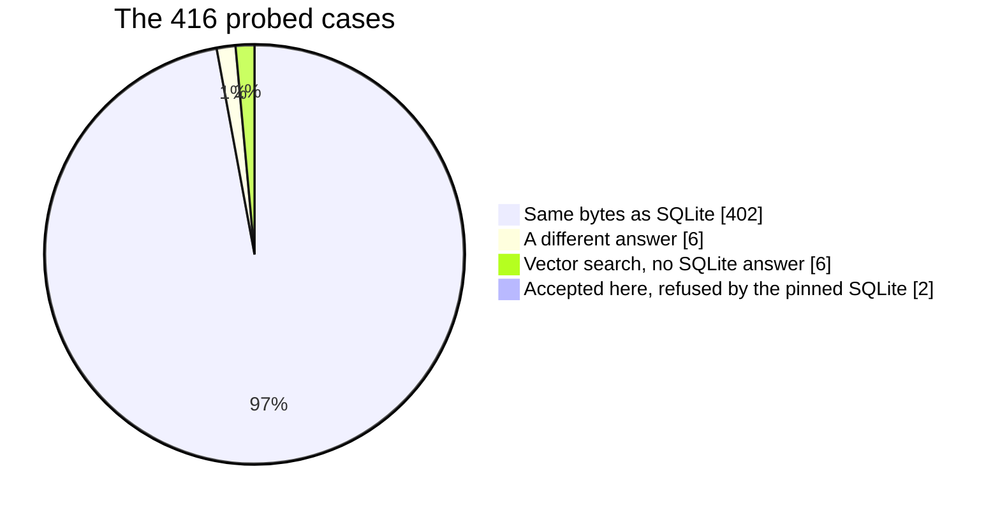

# SQL support

inillucent reads and runs SQLite's dialect of SQL on its own storage. This page lists the SQL that
runs, the places where the answer differs from SQLite's, and the statements inillucent refuses by
name.

The comparison is against a pinned build of SQLite 3.53.4. [Feature comparison](feature-comparison.md)
has every probed case, table by table. [Pragmas](pragmas.md) lists every pragma.

## Terms used on this page

| Term | Meaning |
|---|---|
| [pragma](glossary.md) | a SQLite statement that reads or changes a setting of the database, such as `PRAGMA page_size` |
| [collation](glossary.md) | a rule for comparing and sorting text, such as `NOCASE` |
| [affinity](glossary.md) | the type a column prefers, applied to a value when it is written |
| [rowid](glossary.md) | the integer key of a row in an ordinary table |
| [storage class](glossary.md) | the type a single stored value has: `NULL`, `INTEGER`, `REAL`, `TEXT` or `BLOB` |
| [WAL](glossary.md) | write ahead log: changes are written to a log first and copied into the file later |
| [HNSW](glossary.md) | the graph index inillucent uses for nearest neighbor vector search |
| probe | a script of SQL run through `inillucent-shell` and through the pinned `sqlite3`, with the two outputs compared byte by byte |
| exit code 3 | the code the command line returns for a construct the engine has not built. Over a binding or MCP the status is `unsupported` |

## How much matches SQLite

The feature probe runs 416 SQL scripts through `inillucent-shell` and through the pinned `sqlite3`.
Each script gets its own fresh database. The probe compares every byte of standard output and
standard error.



| Result | Cases | What it means |
|---|---|---|
| Same bytes as SQLite | 402 | 402 of 416 probed cases produce SQLite's exact output. That is 96.6% of all cases and 98.5% of the 408 cases SQLite can answer |
| A different answer | 6 | both engines answer, and the output differs. Each one is listed [below](#the-fourteen-cases-that-differ) |
| Only inillucent answers | 6 | vector search. SQLite has no vector search, so there is no SQLite output to compare |
| Accepted here, refused by the pinned SQLite | 2 | `DELETE` and `UPDATE` with `ORDER BY ... LIMIT` |
| Refused here, answered by SQLite | 0 | no probed case |

The probe is `tools/feature-probe/`. Many of its cases are also checked in as tests in
`crates/inillucent-compat/tests/differential/semantics.rs`. A change to one of those answers, in either
direction, fails the build.

The 416 cases are a list somebody wrote. Some constructs are outside that list, and inillucent
refuses 17 of them by name. They are listed in [What is refused](#what-is-refused).

### Counted against SQLite's own lists

A second tool, `node tools/feature-probe/registers.js`, asks SQLite for its own lists of functions,
pragmas, modules, collations and dot commands, and asks inillucent for the same lists.

| List | SQLite 3.53.4 | inillucent | What is missing here |
|---|---|---|---|
| Pragmas in `pragma_list` | 67 | 67 | none |
| Function names in the library | 177 | 172 of the 177, plus 18 vector functions | `fts3_tokenizer`, `fts5`, `fts5_get_locale`, `fts5_insttoken`, `fts5_locale` |
| Modules for `CREATE VIRTUAL TABLE` | 19 | 16 of the 19, plus 4 of its own | `fts3tokenize`, `fts4aux`, `pragma_module_list` |
| Collations | 5 | 5 | none |
| Shell dot commands | 65 | 63 | `.expert`, `.session` |

The register holds the 68 pragmas this engine recognises. That is SQLite's 67 plus `defensive`.
SQLite sets `defensive` through `sqlite3_db_config`, and inillucent also answers it as a pragma.
`tools/doc-facts/check.mjs` fails when a page names a different count.

### Where the function counts come from

`PRAGMA function_list` in SQLite's own shell reports 218 names. 41 of them are extensions the
`sqlite3` shell program adds, such as `readfile`, `writefile`, `sha3`, `zipfile`, `ieee754`, the
`decimal` functions and the `shell_*` helpers. An application that links the SQLite library does
not get them. That leaves 177 library names.

inillucent answers 172 of those 177. The five it does not have are FTS5 and FTS3 internals:

- `fts5` and `fts3_tokenizer` hand a C pointer to the caller.
- `fts5_locale`, `fts5_get_locale` and `fts5_insttoken` belong to FTS5's locale support, which
  inillucent does not have.

inillucent's register holds 190 built in function names: the 172, plus 18 vector functions SQLite
does not have. `inillucent functions` prints 213 rows, because it prints one row for each name and
argument count.

```sh
inillucent functions --output json
node tools/feature-probe/registers.js    # compares both registers name by name
```

`inillucent functions` also lists what the connection registered: functions an application added
through `create_scalar_function` or `create_aggregate_function`, and `embed(TEXT)` in a build with
the `embed` feature. Those rows have `builtin = 0`. The release build checked for this page has no
`embed` feature, so `embed('hello')` returns exit code 3.

### Where a registered function may be called

A function an application registers carries two flags, `direct_only` and `innocuous`. The flags
decide whether the schema may call the function. The schema means a `DEFAULT`, a `CHECK`, a
generated column, an index expression, the `WHERE` of a partial index, a view or a trigger.

| Flags on the function | Called from a statement | Called from the schema |
|---|---|---|
| `direct_only` (the default for an application's function) | yes | refused with `may only be used from top-level SQL` |
| `innocuous` | yes | yes |
| neither | yes | only while `PRAGMA trusted_schema` is on |
| a built in function | yes | yes |

`PRAGMA trusted_schema` is off by default in this build, as it is in the pinned SQLite. The refusal
comes when the statement that reads the schema is bound. For an index expression the refusal comes
at `CREATE INDEX`, because that is when inillucent evaluates the expression.

`embed(TEXT)` is `direct_only`. `embed(TEXT)` loads a 275 MB model, so a `CHECK` that named it would
load the model on every insert.

## What runs

Every row in this table ran through the probe with the same output as SQLite, unless the row says
otherwise.

| Area | What runs |
|---|---|
| Queries | `SELECT` with `WHERE`, `GROUP BY`, `HAVING`, `DISTINCT`, `ORDER BY` with `NULLS FIRST` and `NULLS LAST`, `LIMIT` and `OFFSET`. `VALUES` as a statement and in `FROM` |
| Joins | inner, `LEFT`, `RIGHT` and `FULL OUTER`, `CROSS`, `NATURAL`, `USING`, self joins. The planner picks a hash join, an index nested loop or a scan |
| Compound queries | `UNION`, `UNION ALL`, `EXCEPT`, `INTERSECT` |
| Subqueries | in `WHERE`, `IN`, `EXISTS`, as a value, and as a table in `FROM`, correlated or not. Row values in comparisons and in `IN` with a value list |
| Common table expressions | `WITH`, `WITH RECURSIVE`, `MATERIALIZED` and `NOT MATERIALIZED`, and `WITH` on `INSERT`, `UPDATE` and `DELETE` |
| Window functions | all eleven window functions, `PARTITION BY`, `ROWS`, `RANGE` and `GROUPS` frames, every `EXCLUDE` clause, `FILTER`, and named `WINDOW` clauses |
| Writes | `INSERT`, `UPDATE`, `DELETE` and `REPLACE`, every `OR` conflict clause, `RETURNING`, `UPDATE ... FROM`, and `ON CONFLICT ... DO UPDATE` and `DO NOTHING` |
| Tables | `CREATE TABLE`, `CREATE TABLE ... AS SELECT`, `WITHOUT ROWID`, `STRICT`, `VIRTUAL` and `STORED` generated columns, `AUTOINCREMENT` |
| Indexes | unique, descending, partial, on an expression, with `COLLATE`, on a `WITHOUT ROWID` table. `REINDEX`, `INDEXED BY`, and `ANALYZE`, which writes `sqlite_stat1` |
| Views and triggers | `CREATE VIEW`. `CREATE TRIGGER` with `BEFORE`, `AFTER` and `INSTEAD OF`, `UPDATE OF`, `WHEN`, `RAISE`, and recursive triggers |
| `ALTER TABLE` | `RENAME TO`, `RENAME COLUMN`, `ADD COLUMN` and `DROP COLUMN` |
| Constraints | `NOT NULL`, `UNIQUE`, `PRIMARY KEY`, `CHECK`, `DEFAULT`, and foreign keys with all five actions, immediate or deferred, and `PRAGMA foreign_key_check` |
| Values | type affinity on write, `CAST`, the `BINARY`, `NOCASE` and `RTRIM` collations, `LIKE`, `GLOB`, values larger than a page |
| Functions | 190 built in function names, including 30 JSON functions, the maths functions and the date and time functions. Functions, aggregates and collations an application defines |
| Transactions | `BEGIN`, `COMMIT`, `ROLLBACK`, `SAVEPOINT`, `RELEASE`, `ROLLBACK TO`. A `ROLLBACK` also undoes `CREATE` and `DROP TABLE` |
| Several databases | `ATTACH` and `DETACH`, joins across files, and one transaction that commits to two files or to neither. Temporary tables, views and triggers |
| Schema and maintenance | `sqlite_schema` and `sqlite_master`, `VACUUM`, `VACUUM INTO`, `integrity_check` and `quick_check` |
| Plans | `EXPLAIN QUERY PLAN` in SQLite's format. Plain `EXPLAIN` runs and prints a different program, see [below](#five-follow-from-how-inillucent-is-built) |
| Table valued functions | `generate_series`, `json_each`, `json_tree`, the `pragma_*` functions such as `pragma_table_info('t')`, and any module an application registers |

### Rules a reader asks about

**`HAVING` with no `GROUP BY`.** A query that has an aggregate in its result columns is one group
over the whole table. `SELECT count(*) AS n FROM t HAVING n > 0` filters that one group. A query
with no `GROUP BY` and no aggregate is refused with `HAVING clause on a non-aggregate query`, which
is SQLite's message.

**A correlated `IN` subquery.** inillucent answers `a IN (SELECT ...)` with a correlated subquery by
rewriting it as `EXISTS`. The rewrite keeps SQLite's `NULL` rules:

| Left side | Subquery rows | Result |
|---|---|---|
| any value, including `NULL` | none | false |
| `NULL` | one or more | `NULL` |
| a value with no match | a list that holds a `NULL` | `NULL` |

A correlated `IN` subquery that uses `GROUP BY`, `LIMIT` or a compound query is refused with exit
code 3. The rewrite moves the equality into the subquery's `WHERE`, and a `WHERE` runs before
grouping and before a limit, so the answer would be wrong.

## Extensions

| Extension | What is there |
|---|---|
| JSON | a binary storage form, and all 30 function names, `json_*` and `jsonb_*` |
| FTS5 | full text search with `MATCH`, `bm25()`, `highlight()`, `snippet()`, external content and contentless tables, and `fts5vocab`. The tokenizers are `ascii`, `unicode61` and `porter` |
| FTS3 and FTS4 | the `fts3` and `fts4` modules with `matchinfo()` and `offsets()`. `fts4aux` and `fts3tokenize` are missing |
| R-Tree | `rtree`, `rtree_i32` and `geopoly` |
| Others | `dbstat`, `sqlite_dbpage`, `bytecode`, `tables_used`, `completion`, `zipfile`, `fsdir` |
| `inillucent_search` | inillucent's own table that combines vector and keyword search. [Vector search](vector-search.md) covers it |

The internal tables of every extension are stored in the same file as ordinary tables. They commit
and roll back with the transaction that wrote them.

## The fourteen cases that differ

14 of the 416 probed cases do not produce SQLite's bytes.

| Case | What inillucent does | What SQLite 3.53.4 does | Why |
|---|---|---|---|
| `VECTOR(n)` column with `vector_distance_cos` | answers | has no vector type | vector search |
| `vector_distance_l2` and `vector_dot` | answers | has no such functions | vector search |
| `CREATE INDEX ... USING inillucent_hnsw` | builds an HNSW index | has no vector index | vector search |
| a vector `ORDER BY` with a `WHERE` filter | answers through the index | has no vector index | vector search |
| `CREATE VIRTUAL TABLE ... USING inillucent_search` | creates the table | has no such module | vector search |
| the operators `<->`, `<#>`, `<=>`, `<+>`, `<~>`, `<%>` | answers, with pgvector's meanings | has no such operators | vector search |
| `DELETE ... ORDER BY ... LIMIT` | deletes the rows | the pinned build refuses it | accepted |
| `UPDATE ... ORDER BY ... LIMIT` | updates the rows | the pinned build refuses it | accepted |
| `PRAGMA page_size`, `page_count` | `32768`, and 5 pages | `4096`, and 2 pages | page size |
| `.recover` | one line of 17 differs: `PRAGMA page_size = '32768'` | `PRAGMA page_size = '4096'` | page size |
| `EXPLAIN SELECT 1` | inillucent's operator list in SQLite's columns | SQLite's bytecode program | no bytecode |
| `.vfslist` | two file systems, `win32` and `memdb` | four file systems | no SQLite library |
| `.stats on` | inillucent's page cache counters | SQLite's memory allocator counters | no SQLite library |
| `.limit` | `trigger_depth 1000` | `trigger_depth 100` | the reference build |

### Six are vector search

SQLite has no vector search. The six vector cases all answer in inillucent. There is no SQLite
output for them to match, so they never count as the same. [Vector search](vector-search.md)
describes the features.

### Two are accepted here and refused by the pinned SQLite

SQLite answers `DELETE` and `UPDATE` with `ORDER BY ... LIMIT` only when the library is compiled
with `SQLITE_ENABLE_UPDATE_DELETE_LIMIT`. The pinned build is compiled without that option and
refuses both with a syntax error. Many other SQLite builds have the option. inillucent always
accepts both. inillucent refuses an `ORDER BY` with no `LIMIT` on a `DELETE` or `UPDATE`, as SQLite
does.

### Five follow from how inillucent is built

**`PRAGMA page_size` reports 32768.** inillucent writes 32 KiB pages. SQLite's default is 4096.
`PRAGMA page_count` differs for the same reason. `.recover` prints the page size in one of its 17
lines, so `.recover` differs on that one line. `PRAGMA page_size = 4096` on a new file does not
change the page size in this build.

**`EXPLAIN` prints inillucent's operators.** SQLite compiles a statement into a bytecode program,
and `EXPLAIN` lists that program. inillucent does not compile bytecode. Its `EXPLAIN` uses SQLite's
eight columns, header and widths (`addr opcode p1 p2 p3 p4 p5 comment`), and the rows are
inillucent's own chain of operators. The `bytecode('...')` table function reads the same rows.

**`.vfslist` lists the two file systems this build has.** The output uses the reference's format,
four lines per file system. `szOsFile` is the size of a C structure inside the SQLite library, and
that library is not part of inillucent, so the numbers differ.

**`.stats` prints inillucent's own counters.** The output uses the same two columns. The counters
are page cache bytes, fetches, hits, misses and rewarms, frames cooled and evicted, and pages read
and written. SQLite's lookaside slots and page cache overflow bytes describe SQLite's memory
allocator, which inillucent does not have.

Printing SQLite's numbers in these cases would report facts about a library that is not in the
program. None of these five will change.

### One is two reference builds that disagree

`.limit` reports `trigger_depth 1000` here. The downloaded `sqlite3.exe` reports 100, because it
was compiled with `SQLITE_MAX_TRIGGER_DEPTH=100`, as its own `PRAGMA compile_options` shows. The
pinned SQLite source defaults to 1000, and a reference built locally from that source reports 1000.
The other twelve lines of `.limit` agree. No value can match both references.

## What is refused

A construct inillucent has not built fails with exit code 3 and the status `unsupported`. A real
error, such as a missing table, fails with exit code 1. A script can tell the two apart without
reading the message. `inillucent capabilities` lists each refused construct as a row with the value
`no`.

### SQL that SQLite 3.53.4 answers and inillucent refuses

Each row was run against the release build and against the pinned `sqlite3`. Each fails here with
exit code 3.

| Construct | Example | What to write instead |
|---|---|---|
| `ATTACH ... KEY` | `ATTACH 'x.db' AS k KEY 'secret'` | `ATTACH` without `KEY`. inillucent has no encryption |
| a row value `IN` a subquery | `(a, b) IN (SELECT x, y FROM s)` | `EXISTS (SELECT 1 FROM s WHERE x = a AND y = b)` |
| an expression in `LIMIT` or `OFFSET` | `LIMIT 1 + 1` | a constant or a bound parameter |
| a window function inside a table subquery in `FROM` | `SELECT * FROM (SELECT row_number() OVER () FROM t)` | the same query as a common table expression |
| a partial index as an `ON CONFLICT` target | `ON CONFLICT(b) WHERE b > 0` | a full unique index |
| an expression as an `ON CONFLICT` target | `ON CONFLICT(lower(a))` | a stored column with a unique index |
| a correlated `IN` subquery with `GROUP BY`, `LIMIT` or a compound query | `a IN (SELECT a FROM t i WHERE i.id = o.id LIMIT 1)` | `EXISTS` with the condition written out |
| an FTS5 tokenizer inillucent does not have | `tokenize='trigram'` | `ascii`, `unicode61` or `porter` |
| FTS5 `detail='none'` or `detail='column'` | `fts5(body, detail='none')` | leave `detail` out. The index stores full positions |
| FTS5 `columnsize=0` | `fts5(body, columnsize=0)` | leave `columnsize` out |

### Refused by both engines

These rows are listed in `inillucent capabilities` as `no`. The pinned `sqlite3` refuses each of
them too.

| Construct | inillucent's message |
|---|---|
| a compound query ordered by an expression | `ORDER BY term does not match any column in the result set` |
| `INSERT`, `UPDATE` or `DELETE` on a view | `unsupported: writing to a view`. An `INSTEAD OF` trigger writes through a view |
| `EXPLAIN EXPLAIN` | `unsupported: nested EXPLAIN` |
| `RETURNING` inside a trigger | `unsupported: RETURNING is not available in triggers` |
| `UPDATE` or `DELETE` of a `sqlite_schema` row | `only an INSERT into sqlite_schema is built, not an UPDATE or a DELETE` |

### Refused for other reasons

| Construct | Why |
|---|---|
| `load_extension()` | inillucent has no C extension interface. FTS5, R-Tree and vector search are built in |
| `CREATE INDEX ... USING inillucent_hnsw (a, b)` | a vector index covers one column. SQLite has no vector index |
| `.expert` and `.session` | the two of `sqlite3`'s 65 dot commands the shell does not have |
| `fts5()`, `fts5_locale()`, `fts5_get_locale()`, `fts5_insttoken()` | a call fails with `unable to use function ... in the requested context` |
| `fts3_tokenizer()` | a call fails with `no such function` |
| the modules `fts4aux` and `fts3tokenize` | `CREATE VIRTUAL TABLE` fails with `no such module`. `fts5vocab` is the FTS5 equivalent and is present |
| opening a SQLite file | inillucent writes its own file format. Import a SQLite file with [`inillucent migrate`](migrating.md) |

## How inillucent behaves differently from SQLite

These differences change how an application runs, and they do not show up in a probe's output.

| Topic | inillucent | SQLite 3.53.4 |
|---|---|---|
| File format | `.rdb`, with its own log segments | SQLite's format |
| Page size | 32 KiB | 4 KiB by default |
| Page cache | 4,096 frames of 32 KiB, 128 MiB, fixed when the file is opened. `PRAGMA cache_size` reports `-131072`. A frame's memory is allocated the first time the frame is used | `cache_size`, 2 MiB by default |
| Journal modes | all six. `delete` is the default. `PRAGMA journal_mode = wal` selects the write ahead log, and the file reopens in WAL mode | all six, `delete` by default |
| Writers | one at a time. A second writer waits up to `PRAGMA busy_timeout` (5000 ms by default) and then fails with `busy` | one at a time |
| Readers during a write | a reader waits for the writer, and fails with `busy` after `PRAGMA busy_timeout` | in WAL mode, a reader does not wait |
| Processes on one file | several, with `PRAGMA locking_mode = normal`, the default | several |
| Threads | one. The engine is single threaded | serialised or multithreaded |
| A transaction larger than the page cache | allowed under `delete`, `truncate` and `persist`. Under `wal`, `memory` and `off`, the transaction fails when it changes more pages than the cache holds | spills to the journal |
| A `SELECT` result | computed when the first row is stepped. Later steps return rows already computed | computed one row per step |

**Multiple processes.** Two processes can write the same file, one at a time. The number of rows in
the file equals the number of commits acknowledged. `crates/inillucent-compat/tests/durability/process_concurrency.rs`
checks this with two real writer processes. [Roadmap](roadmap.md) describes the change that would let a
reader run while a writer works.

**`PRAGMA locking_mode = exclusive`.** `normal` is the default, as in SQLite. With `exclusive`, the
engine keeps the file locked between statements, so a second process waits for the first to close.
A program that never opens a second connection can use `exclusive` to save work: under `normal`, the
engine reads the file header and the end of the log again before each statement.

**A large transaction.** Under `wal`, `memory` and `off`, a changed page cannot be written to the
file before its commit, and it cannot be dropped from memory either. The transaction fails with an
error that names how many pages it changed. A larger page cache, or the `delete` journal mode, lifts
the limit.

### Smaller differences

| Topic | inillucent | SQLite 3.53.4 |
|---|---|---|
| `SELECT * FROM pragma_foreign_keys` | fails with `no such table: pragma_foreign_keys`. Use `PRAGMA foreign_keys` | returns one row with the setting |
| an index on a `VIRTUAL` generated column | refused with `an index on a column the tree does not carry`. A `STORED` generated column can be indexed | allowed. The index stores the computed value |
| `inillucent vector-search` result columns | the primary key appears twice: once as the table's column, and once as the column the search adds | no vector search |
| an `inillucent_search` insert with a vector of the wrong length | fails with status `syntax` and the message `SQL logic error`, which does not name the vector | no vector search |

A vector written to an `inillucent_search` table as JSON text, such as `'[1,0,0,0]'`, is accepted
and stored as a blob.

## Reproducing the probe

```sh
cargo build --release --bin inillucent-shell
pwsh tools/sqlite-reference.ps1          # the pinned SQLite 3.53.4, on Windows
bash tools/sqlite-reference.sh           # the same, on Linux
node tools/feature-probe/run.js          # all 416 cases
node tools/feature-probe/registers.js    # SQLite's own lists against inillucent's
```

The results are written to `_agent_output/feature-probe/results.json`. The file holds each script,
both outputs and the verdict. [Repository](repository.md) covers the test runner and the other
checks.
