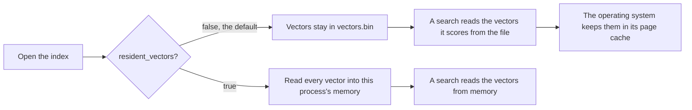

# Where the vectors live

A retrieval index saved by the Rust library can keep its vectors in two places: in the process's
memory, or in the index file, read back as a search needs them. This page explains the two
choices, what each costs, and how to choose. The setting is `IndexConfig::resident_vectors`, and it
is off by default.

## Terms used on this page

| Term | Meaning |
|---|---|
| vector | The list of numbers stored for each chunk of text. At 768 dimensions one vector is 3,072 bytes |
| chunk | One passage of text in the index, with one vector |
| resident | Held in this process's own memory (its heap) for as long as the index is open |
| filed | Left in the index file and read from it as a search scores them |
| page cache | Memory the operating system uses to keep recently read file data. It can take that memory back when another program needs it |
| exact scan | A search that compares the query with every vector |
| graph search | A search that walks the HNSW graph and compares the query with a few hundred vectors. See [the glossary](glossary.md) |
| p50, p95 | The median time, and the time 95% of searches finish within |

## Which indexes this page is about

`resident_vectors` belongs to the retrieval engine in the `inillucent-core` crate. It applies to an
index that a program builds with that crate and saves to a directory, then opens again with
`inillucent_core::persist::load` or `load_with`. The vectors of such an index are in a file named
`vectors.bin`.

It does not apply to SQL. An `inillucent_search` table and an index made with
`CREATE INDEX ... USING inillucent_hnsw` store their vectors in tables inside the `.rdb` file. A
search on them reads the index segments it needs from the file into this process's memory.
[Vector search](vector-search.md) covers those. The first search in a process pays for that read,
and [The first search in a process](vector-search.md#the-first-search-in-a-process) gives the cost
and how `compact` reduces it.

## The two modes



| | `resident_vectors: false` (default) | `resident_vectors: true` |
|---|---|---|
| where the vectors are | in `vectors.bin`, read as they are scored | in this process's heap |
| what keeps them in memory | the operating system's page cache, which it can take back | this process, which keeps them until the index is closed |
| what opening the index reads | the chunk store, the keyword index and the graph | those, plus every vector |
| what an exact scan does | reads the vectors in blocks from the file, then compares | compares |

Both modes return the same rows in the same order, with the same distances. The test
`a_filed_set_returns_what_the_resident_set_returns` in `crates/inillucent-core/src/flat.rs` checks
this. It runs both modes over more vectors than one block holds, for every kind of filter and three
values of k, and compares every result.

## What each mode costs

This was measured on 9 September 2026, on a production index of 600,589 chunks at 768 dimensions.
The vectors of that index take 600,589 × 768 × 4 bytes, which is 1.85 GB.

The measurement ran two interleaved rounds and discarded the first pass of each, so the page cache
was warm for both modes. Each search asked for the top 20 over the whole corpus. The query vector
was computed before the clock started, and the matched chunks were not read back, so the times are
for the index alone. Peak memory is the highest point the process reached, from Windows'
`PeakWorkingSet64`.

| Search | Vectors | p50 | p95 | Peak memory |
|---|---|---:|---:|---:|
| exact scan | filed (default) | 19.03 ms | 23.70 ms | 2,080 MB |
| exact scan | resident | 17.79 ms | 21.69 ms | 3,840 MB |
| graph search | filed (default) | 4.22 ms | 6.19 ms | 2,080 MB |
| graph search | resident | 3.82 ms | 5.75 ms | 3,839 MB |

**Resident vectors cost about 1.76 GB of memory.** They make an exact scan about 6% faster at the
median. On a graph search the difference was smaller than the difference between the two rounds.

The two results agree. An exact scan reads all 600,589 vectors, so where the vectors are makes up a
large part of its work. The resident mode was faster in both rounds, by about 1.5 ms. A graph search
reads a few hundred vectors, so the read is a small part of its work, and which mode was faster
changed between rounds.

Two cases the table does not measure. Both favor resident vectors:

- **The first search after a restart.** With filed vectors, that search reads `vectors.bin` from
  disk. With resident vectors, opening the index already paid for that read.
- **A machine short of memory.** The operating system can take page cache back from filed vectors.
  The next exact scan then reads from disk. Resident vectors stay in memory.

## Which to choose

Turn `resident_vectors` on when all of these are true:

- the machine has the memory to spare, and nothing else needs it;
- one long running process opens the index once;
- search latency matters more to you than memory.

Leave `resident_vectors` off, the default, when any of these is true:

- several processes open the same index. Each resident copy costs the full 1.85 GB, while filed
  vectors share one copy in the page cache;
- the process is short lived, such as a server started once for each session. Reading 1.85 GB at
  open would then be most of its work;
- other programs on the machine need the memory;
- the vectors do not fit comfortably in memory.

## How to set it

```rust
use inillucent_core::index::IndexConfig;

let config = IndexConfig { resident_vectors: true, ..IndexConfig::default() };
```

`resident_vectors` is saved with the index, so an index built with it on opens with it on. An
index saved before the setting existed opens with its vectors filed.

The program that opens the index can choose for itself.
`inillucent_core::persist::load_with(dir, Some(true))` opens with resident vectors, `Some(false)`
opens with filed vectors, and `None` uses what the index was saved with.
`inillucent_core::persist::load(dir)` is the same as `load_with(dir, None)`.

## How filed vectors are read

- **One vector** is one positional read of `dims × 4` bytes, which is 3,072 bytes at 768
  dimensions.
- **An exact scan** reads blocks of 2,730 vectors, which is 8 MB at 768 dimensions. Each block is
  independent, so the scan still runs on every core. Each thread reads its own block with a
  positional read, so the threads never share a file position.
- **The file is read with ordinary reads.** A file mapped into memory cannot be deleted while it is
  mapped, and the index deletes old versions of its files.
- **You can still add chunks to an index with filed vectors.** New vectors stay in memory until the
  index is saved. The save writes them into the file, and the next open finds them filed like the
  rest. Memory holds only what arrived since the last save.
- **Building an index always holds the vectors in memory**, because the build has just produced
  them. `resident_vectors` changes what opening a saved index does. It does not change the peak
  memory of a build.

The block size is `BLOCK_VECTORS` in `crates/inillucent-core/src/vectors.rs`. The default is set in
`IndexConfig::default` in `crates/inillucent-core/src/index.rs`.

## Where to go next

- [Vector search](vector-search.md): vector columns, indexes and search tables in SQL
- [Architecture](architecture.md): how the retrieval engine stores and searches an index
- [Performance](performance.md): speed and memory next to SQLite
