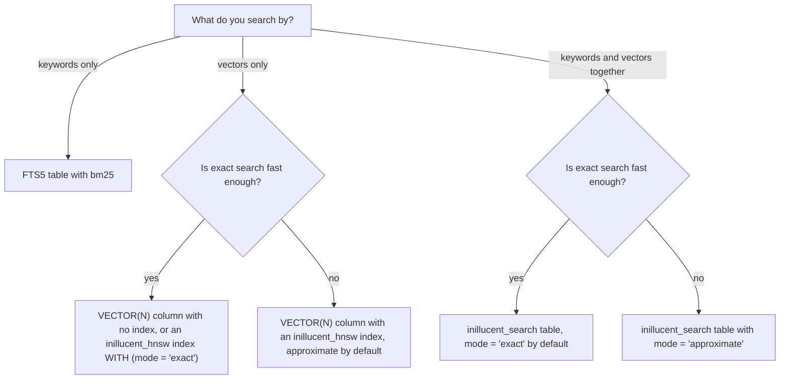

# Vector search and keyword search

inillucent can find rows by meaning and by keyword, from SQL, in the same `.rdb` file as your other
tables. A search index and the table it covers commit and roll back together. There is no extension
to load and no second server to run.

This page shows how to store vectors, how to search them, how to add keyword search, and how to
combine the two. Every example on this page was run against inillucent 1.0.29, and the output shown
is what that build printed.

## Terms used on this page

| Term | Meaning |
|---|---|
| vector | A list of numbers that stands for the meaning of a piece of text. A model produces it. [Embeddings](embeddings.md) explains how |
| `VECTOR(N)` | A column type that holds a vector of exactly N numbers |
| nearest neighbor | The stored vector closest to a query vector |
| cosine distance | How far apart two vectors point, from 0 (same direction) to 2 (opposite). The default measure |
| L2 distance | The straight line distance between two vectors |
| exact search | Comparing the query with every stored vector. The answer is always the true nearest rows |
| HNSW | A graph of vectors that a search can walk to find near neighbors without comparing every vector. See [the glossary](glossary.md) |
| recall | The share of the true nearest rows that a search returned. Exact search has recall 1.000 |
| FTS5 | SQLite's full text search table |
| BM25 | The standard formula for ranking keyword matches. See [the glossary](glossary.md) |
| hybrid search | One search that ranks rows by keyword and by vector together |
| facet | A column of a search table that a search can filter on inside the search |

## Choose a method



| You want | Use | Section |
|---|---|---|
| nearest rows by vector, in a table you already have | a `VECTOR(N)` column, and later an `inillucent_hnsw` index | [Store vectors](#store-vectors) |
| rows that match keywords | an FTS5 table and `bm25()` | [Keyword search](#keyword-search-with-fts5-and-bm25) |
| one ranking that uses keywords and vectors | an `inillucent_search` table | [Hybrid search](#hybrid-search) |
| a search from a script, without writing SQL | `inillucent search` or `inillucent vector-search` | [From the command line](#search-from-the-command-line) |

Exact search is correct by construction. Start with it. Switch to approximate mode when a measured
search is too slow.

## Store vectors

```sql
CREATE TABLE passage (id INTEGER PRIMARY KEY, body TEXT, v VECTOR(3));

INSERT INTO passage (body, v) VALUES
  ('red apple',   '[1, 0, 0]'),
  ('green apple', '[0.9, 0.1, 0]'),
  ('blue sky',    '[0, 0, 1]'),
  ('grey cloud',  '[0, 0.2, 0.9]');
```

A `VECTOR(N)` column holds N 32 bit floating point numbers. A real embedding model produces 384,
768 or more numbers. The examples here use three so the output fits on the page.

You can write a vector three ways. All three store the same bytes:

| Form | Example |
|---|---|
| a JSON array of numbers | `'[1, 0, 0]'` |
| a blob of little endian 32 bit floats | `x'0000803F0000000000000000'`, which is what `hex(v)` prints |
| a bound parameter | `--params '[[1, 0, 0]]'` on the command line, or a byte string from a driver |

```sql
SELECT hex(v), vector_dims(v), vector_norm(v) FROM passage WHERE id = 1;
```

```
hex(v)                    vector_dims(v)  vector_norm(v)
------------------------  --------------  --------------
0000803F0000000000000000  3               1.0
```

The engine refuses a bad vector when you write it. The statement fails with a `constraint` error
that names the column, and the command line exits with code 1:

| You write | The error |
|---|---|
| a vector of the wrong width, `'[1, 0]'` | `cannot store this value in passage.v: it is not a vector, and the column is declared VECTOR(3)` |
| a value that is not a vector, `'hello'` | the same message |
| a component that is NaN or infinite | `cannot store this value in passage.v: one of its components is not a finite number, and the column is declared VECTOR(3)` |

A NaN component would make every distance to that row NaN and would make a later `CREATE INDEX`
fail, so the engine stops it at the write.

A row whose vector is NULL is allowed. It is left out of any vector index on the column.

## Find the nearest rows

```sql
SELECT id, body, vector_distance_cos(v, '[1, 0, 0]') AS d
FROM passage
ORDER BY d
LIMIT 2;
```

```
id  body         d
--  -----------  --------------------
1   red apple    0.0
2   green apple  0.006116265828075562
```

With no index, this query compares the query vector with every row. That is an exact search. The
answer is always correct. It gets slower as the table grows.

### The vector functions

`inillucent functions` lists every function the engine has. These are the vector functions:

| Function | What it returns |
|---|---|
| `vector_distance_cos(a, b)` | cosine distance. Also spelled `cosine_distance(a, b)` |
| `vector_distance_l2(a, b)` | L2 (straight line) distance. Also spelled `l2_distance(a, b)` |
| `vector_dot(a, b)` | the inner product. Also spelled `inner_product(a, b)` |
| `l1_distance(a, b)` | the sum of the absolute differences |
| `hamming_distance(a, b)`, `jaccard_distance(a, b)` | distances over binary vectors, as in pgvector |
| `vector_dims(v)` | the number of components |
| `vector_norm(v)` | the length of the vector |
| `l2_normalize(v)` | the vector scaled to length 1 |
| `vector_add(a, b)`, `vector_sub(a, b)`, `vector_mul(a, b)` | the vector computed component by component |
| `vector_concat(a, b)`, `subvector(v, start, count)` | a longer or shorter vector |
| `binary_quantize(v)` | a binary vector with one bit per component |

The pgvector operators also work: `<=>` is cosine distance, `<->` is L2 distance, `<#>` is the
negative inner product, `<+>` is L1 distance, and `<~>` and `<%>` are Hamming and Jaccard distance.

```sql
SELECT vector_distance_cos('[1,0,0]', '[0,1,0]') AS cos,
       vector_distance_l2('[1,0,0]', '[0,1,0]')  AS l2,
       vector_dot('[1,2,3]', '[4,5,6]')           AS dot,
       '[1,2,3]' <#> '[4,5,6]'                    AS neg_ip;
```

```
cos  l2                  dot   neg_ip
---  ------------------  ----  ------
1.0  1.4142135623730951  32.0  -32.0
```

## Add an index: `USING inillucent_hnsw`

```sql
CREATE INDEX passage_v ON passage USING inillucent_hnsw (v);

EXPLAIN QUERY PLAN
SELECT id, body FROM passage ORDER BY vector_distance_cos(v, '[1, 0, 0]') LIMIT 2;
```

```
id  parent  notused  detail
--  ------  -------  -------------------------------------------------
0   0       0        SEARCH passage USING VECTOR INDEX passage_v (k=2)
1   0       0        USE TEMP B-TREE FOR ORDER BY
```

The query itself does not change. The planner sees `ORDER BY` a distance function with a `LIMIT`,
and asks the index for the nearest `k` rows. `SEARCH ... USING VECTOR INDEX` in the plan shows that
the index was used.

What `CREATE INDEX ... USING inillucent_hnsw` does:

- It fills the index from the rows already in the table.
- Every later `INSERT`, `UPDATE` and `DELETE` on the table updates the index in the same
  transaction. The table and the index commit together and roll back together.
- The index takes exactly one column, and that column must be declared `VECTOR(N)`.

### Exact and approximate search with an index

There are two ways to answer a nearest neighbor query:

| Mode | What a query does | Recall | Time as the table grows |
|---|---|---|---|
| exact | compares the query with every stored vector | always 1.000 | grows in step with the table |
| approximate | walks the HNSW graph toward closer vectors and compares the query only with the vectors it visits | can be below 1.000, because the walk can miss a true neighbor | grows slowly |

Recall is the share of the true nearest rows that a query returns. A query for 10 rows that returns
9 of the true 10 has a recall of 0.9.

**A new `inillucent_hnsw` index is approximate.** A query walks the HNSW graph, the way a query on a
pgvector `USING hnsw` index does. To compare every vector instead, say so when you create the index:

```sql
CREATE INDEX passage_exact ON passage USING inillucent_hnsw (v) WITH (mode = 'exact');
```

`mode` belongs to the index. It is not a column, so `WHERE mode = 'approximate'` in a query fails
with `no such column: mode`. To change the mode of an existing index, drop the index and create it
again. `mode` on a `USING ivfflat` index is refused, because an inverted file has no exact mode.

**An index created by inillucent 1.0.29 or earlier stays exact.** Those releases created every
`inillucent_hnsw` index in exact mode and had no `mode` setting. Each index records its mode when it
is created and reads it back every time the database opens, so an upgrade does not change the rows an
existing index returns. Drop the index and create it again to make it approximate.

**A small table is searched exactly in either mode.** When the table holds fewer rows than
`ef_search` times `2m` (64 times 32, or 2,048 rows, with the default settings), comparing every
vector costs less than walking the graph, and the index does that instead. The graph is walked once
the table is larger. The same rule decides a filtered query: the index compares every row the filter
keeps when that number is small enough.

### What the two modes cost

`inillucent-vectorprobe` times `ORDER BY vector_distance_cos(v, ?) LIMIT 10` through an index, and
checks each answer against a cosine it computes itself over the same vectors. These numbers are from
25 September 2026, with the process pinned to the performance cores and nothing else running. Each
row is 200 queries. A 20,000 row time is the mean of the medians of two runs. The vectors are 256
numbers drawn uniformly at random.

| Rows | Mode | Median time | Recall of the top 10 |
|---|---|---|---|
| 20,000 | exact | 0.537 ms | 1.000 |
| 20,000 | approximate, `ef_search = 64` | 0.401 ms (34% faster) | 0.36 |
| 200,000 | exact | 3.952 ms | 1.000 |
| 200,000 | approximate, `ef_search = 64` | 0.858 ms (361% faster) | 0.074 |

Exact search grows in step with the table, and the graph walk grows much more slowly. At 20,000 rows
the difference is small.

**Random vectors are the hardest case for a graph, so treat these recall numbers as the floor.** In
random vectors every point is almost the same distance from every other point, so the walk has
nothing to follow. Real embeddings form clusters. On the 185,078 chunk corpus at 768 dimensions in
[Exact and approximate mode](#exact-and-approximate-mode), the same graph code has recall 0.8775 at
`ef_search = 64` and 0.9875 at 512. On the random vectors at 20,000 rows, raising `ef_search`
raises recall from 0.36 at 64 to 0.55 at 128, 0.75 at 256 and 0.91 at 512. At 200,000 random
rows, `ef_search = 512` raises it from 0.074 to 0.36.

Measure recall on your own vectors before you rely on approximate mode. Compare an index's answers
with the same query on a table that has no index, or on an index created `WITH (mode = 'exact')`.
If recall is too low, raise `ef_search`, or use exact mode.

### Index settings

```sql
CREATE INDEX passage_l2 ON passage USING inillucent_hnsw (v) WITH (metric = 'l2', m = 32);
```

| Setting | What it does | Default |
|---|---|---|
| `mode` | `'approximate'` walks the HNSW graph. `'exact'` compares the query with every stored vector | `'approximate'` |
| `metric` (or `distance`) | the distance the index is built for: `'cosine'` or `'l2'` | `'cosine'` |
| `m` | how many neighbors each node of the HNSW graph links to | 16 |
| `ef_construction` | how many candidates the graph build considers for each new node | 64 |
| `ef_search` | how many candidates a graph walk keeps. A larger number raises recall and costs time. An index in exact mode does not walk the graph, so it ignores this | 64 |
| `threads` | how many threads a build uses | every core |
| `compact` | how many pending changes a commit collects before it writes them into the index | 1,024 |

An `ivfflat` index takes `lists` and `probes` instead. Any other name fails with
`no such index setting`. The defaults come from `HnswParams::default` in
`crates/inillucent-core/src/hnsw.rs` and `COMPACT_FLOOR` in `crates/inillucent-search/src/options.rs`.

**The planner uses the index only when the `ORDER BY` function matches the index's metric.**
`vector_distance_cos` (or `<=>`) uses a cosine index. `vector_distance_l2` (or `<->`) uses an L2
index. Any other pairing, and any ordering by `vector_dot`, runs as a scan:

```sql
EXPLAIN QUERY PLAN
SELECT id FROM passage ORDER BY vector_distance_l2(v, '[1, 0, 0]') LIMIT 2;
```

```
id  parent  notused  detail
--  ------  -------  ----------------------------
0   0       0        SCAN passage
1   0       0        USE TEMP B-TREE FOR ORDER BY
```

The table has only the cosine index `passage_v`, so the L2 ordering scans. The answer is still
correct. If a query scans where you expected the index, check the metric first.

The metric is fixed when the index is built. A cosine index scales every vector to length 1 before
it stores it. An L2 index must keep the original length, because L2 distance depends on it.

`CREATE INDEX ... USING ivfflat (v)` builds pgvector's other index type. It groups the vectors into
`lists` clusters and searches the `probes` clusters nearest to the query.

## Keyword search with FTS5 and bm25

```sql
CREATE VIRTUAL TABLE note USING fts5(title, body);

INSERT INTO note (title, body) VALUES
  ('Release process', 'Tag the commit, then run the release script.'),
  ('Parser notes',    'parse_headers reads the request headers.'),
  ('Lunch',           'The cafe closes at three.');

SELECT title, round(bm25(note), 3) AS score
FROM note
WHERE note MATCH 'release OR headers'
ORDER BY rank;
```

```
title            score
---------------  ------
Parser notes     -0.702
Release process  -0.656
```

FTS5 in inillucent reads and writes the same tables as SQLite's FTS5. `bm25()` returns a negative
number, and a lower number is a better match, so `ORDER BY rank` puts the best match first.

The query syntax is FTS5's. Bare words must all match. `"a phrase"` matches the words in order. `OR`
and `NOT` are available. The `porter` tokenizer adds stemming, so `release` also matches
`released`.

`highlight()` and `snippet()` mark where the words matched:

```sql
SELECT highlight(note, 1, '[', ']') AS body FROM note WHERE note MATCH 'release';
SELECT snippet(note, 1, '[', ']', '...', 4) AS body FROM note WHERE note MATCH 'headers';
```

```
body
----------------------------------------------
Tag the commit, then run the [release] script.
body
----------------------------
parse_[headers] reads the...
```

### Keeping an FTS5 table in step with a table

Triggers on the content table can write the FTS5 table, the way SQLite's FTS5 documentation shows.
Each write to `todo` then updates `todo_fts` in the same transaction, so both commit or roll back
together:

```sql
CREATE TABLE todo (id INTEGER PRIMARY KEY, title TEXT NOT NULL, notes TEXT NOT NULL DEFAULT '');
CREATE VIRTUAL TABLE todo_fts USING fts5(title, notes);

CREATE TRIGGER todo_fts_insert AFTER INSERT ON todo BEGIN
  INSERT INTO todo_fts (rowid, title, notes) VALUES (NEW.id, NEW.title, NEW.notes);
END;
CREATE TRIGGER todo_fts_delete AFTER DELETE ON todo BEGIN
  DELETE FROM todo_fts WHERE rowid = OLD.id;
END;
CREATE TRIGGER todo_fts_update AFTER UPDATE ON todo BEGIN
  UPDATE todo_fts SET title = NEW.title, notes = NEW.notes WHERE rowid = NEW.id;
END;
```

The same works for an `inillucent_search` table. inillucent makes a trigger's writes to a virtual
table after the statement's writes to ordinary tables and before the commit. A statement that fails
undoes both.

## Hybrid search

An `inillucent_search` table holds text and vectors together. It is a virtual table: it looks like
a table to SQL, and the engine stores its rows and its index in tables of its own inside the file. One query can rank its rows by
keyword, by vector, or by both at once.

```sql
CREATE VIRTUAL TABLE docs USING inillucent_search(title, body, region FACET, dims = 3);

INSERT INTO docs (rowid, title, body, region, vector) VALUES
  (1, 'Release process',  'Tag the commit, then run the release script.', 'eu', '[1, 0, 0]'),
  (2, 'Parser notes',     'parse_headers reads the request headers.',     'us', '[0, 1, 0]'),
  (3, 'Release calendar', 'The next release ships in May.',               'us', '[0.9, 0.1, 0]');
```

An `INSERT ... SELECT` fills the table from an ordinary table in one statement. Here `page` holds
the same four columns and a `VECTOR(3)` column `v`:

```sql
INSERT INTO docs (rowid, title, body, region, vector)
SELECT id, title, body, region, v FROM page;
```

The query is read in full before the first row is written. Release 1.0.29 refuses this statement
with the status `unsupported`. [Embeddings](embeddings.md) shows the same statement with
`embed(TEXT)` computing the vectors.

Keyword only:

```sql
SELECT rowid, title FROM docs WHERE docs MATCH 'release' ORDER BY rank;
```

```
rowid  title
-----  ----------------
3      Release calendar
1      Release process
```

Vector only:

```sql
SELECT rowid, title FROM docs WHERE vector = '[1, 0, 0]' AND k = 2;
```

```
rowid  title
-----  ----------------
1      Release process
3      Release calendar
```

Both, combined into one ranking:

```sql
SELECT rowid, title,
       round(score(docs), 3) AS score,
       round(confidence(docs), 3) AS confidence,
       origin(docs) AS origin
FROM docs
WHERE docs MATCH 'release' AND vector = '[1, 0, 0]' AND k = 3
ORDER BY rank;
```

```
rowid  title             score  confidence  origin
-----  ----------------  -----  ----------  ------
3      Release calendar  0.998  0.753       both
1      Release process   0.296  0.736       both
2      Parser notes      0.0    0.0         vector
```

**Give a cosine table a query vector of length 1.** The table scales the stored vectors to length 1,
and the query vector is used as you pass it. The order of the hits does not change with the query
vector's length, but `confidence(docs)` does. On the table above, the query `'[0.2, 0, 0]'` returns
the same order with a confidence of 0.517 for row 3, against 0.753 for `'[1, 0, 0]'`. Most embedding
models already return vectors of length 1. `l2_normalize(v)` scales any other vector to length 1.

### What a search query can name

| Hidden column | As a constraint | Meaning |
|---|---|---|
| the table's own name | `docs MATCH 'text'` | the keyword query, in FTS5 syntax |
| `vector` | `vector = ?1`, or `vector = embed('search_query: ' \|\| ?1)` | the query vector |
| `k` | `k = 20` | how many hits the search collects. Defaults to 10 |
| `recall` | `recall = 0.9` | in approximate mode, widens the graph walk to reach this recall. Exact mode ignores it |
| `rank` | `ORDER BY rank` | the combined ranking. Ascending order is best first, as in FTS5 |

The same arguments also work as a table function, in the order query text, `k`, vector, recall:
`SELECT rowid, title FROM docs('release', 2)`.

`k` and `LIMIT` are different. `k` decides how many hits the search collects. `LIMIT` trims the
rows the query returns.

Three functions describe each hit:

| Function | What it returns |
|---|---|
| `score(docs)` | the combined score that decided the order |
| `confidence(docs)` | how good the hit is on an absolute scale, from 0 to 1. See [below](#confidence-is-a-separate-number-from-score) |
| `origin(docs)` | which search found the row: `lexical` (the keyword search), `vector` or `both` |

### Table options

| Option | What it does | Default |
|---|---|---|
| `dims = N` | the vector width. Without it the table is keyword only and refuses a vector | none |
| `mode` | `'exact'` compares every vector. `'approximate'` walks the HNSW graph | `'exact'` |
| `vector_weight` | a fixed weight from 0 to 1 for the vector list in a search with both parts. See [How the two rankings are combined](#how-the-two-rankings-are-combined) | chosen for each query |
| `metric` (or `distance`) | `'cosine'` or `'l2'`. Any other value is refused | `'cosine'` |
| `m`, `ef_construction`, `ef_search` | the HNSW graph settings, as in [Index settings](#index-settings) | 16, 64, 64 |
| `tokenize` | the tokenizer. `porter` is the only one | `porter` |
| `compact` | how many pending changes a commit collects before it writes them into the index | 1,024 |
| `segment_merge` | how many segments of one size are merged into one larger segment | 4 |
| `merge_budget` | how many rows one commit may merge before it leaves the rest for a later commit | 8,192 |
| `threads` | how many threads a build uses | every core |

The table records its options in the `<table>_config` table, so you can read back what a table was
declared with: `SELECT k, v FROM docs_config`.

### Exact and approximate mode

```sql
CREATE VIRTUAL TABLE docs_fast USING inillucent_search(body, dims = 3, mode = 'approximate');
```

`mode = 'exact'` is the default for a table declared with `USING inillucent_search`. It compares the
query with every stored vector and returns the true nearest rows. An index made with
`CREATE INDEX ... USING inillucent_hnsw` has the opposite default, `'approximate'`, as
[Exact and approximate search with an index](#exact-and-approximate-search-with-an-index) says.

`mode = 'approximate'` walks the HNSW graph. It compares far fewer vectors, so it is faster on a
large table, and it can miss some true neighbors. `ef_search` sets how wide the walk is. The
default is 64. A larger `ef_search` finds more of the true neighbors and takes longer.

These numbers are from the graded run recorded in `inillucent-scorecard.md` (20 September 2026,
commit `cd53317`), over 185,078 chunks at 768 dimensions with no filter. Recall is measured against
an exact search over the whole corpus:

| `ef_search` | Recall of the top 10 | Median time per vector search |
|---|---|---|
| 64, the default | 0.8775 | 0.61 ms |
| 128 | 0.9525 | 1.08 ms |
| 256 | 0.9575 | 1.94 ms |
| 512 | 0.9875 | 3.27 ms |

In approximate mode the engine still uses exact search when a filter leaves few enough rows. It
counts the rows the filter admits and compares the cost of the two methods. For a narrow filter the
exact search is both faster and correct.

### Filtering a search table: facet columns

A column declared `FACET` is stored with the row, and a search can filter on it. Its value is not
indexed as text, so it does not change the keyword ranking.

```sql
SELECT rowid, title FROM docs
WHERE docs MATCH 'release' AND region = 'us' AND k = 10
ORDER BY rank;
```

```
rowid  title
-----  ----------------
3      Release calendar
```

**Filter with a facet column, inside the search.** A filter written anywhere else runs after the
ranking and gives a different answer. The keyword ranking rescores its best `k * 6` hits by where
the query words sit, and which hits reach that group depends on which rows the search admitted.
When the filtering change was measured on a 400 row corpus, a filter applied after the search shared
one hit of the top ten with the same filter applied inside it. A filter after the search can also
return fewer rows than `k`.

Rules for facet columns:

- Several facet constraints joined by `AND` must all hold.
- A facet value is compared as text, so `region = 1` and `region = '1'` select the same rows.
- Write a value for every row. A facet left NULL reads back as the empty string, so no ordinary
  filter matches it.
- `FACET` must be the last word of the column's declaration. `"live facet"` in quotes is one column
  named `live facet`. `"live" FACET` is a facet named `live`.
- A filtered search first counts the rows that pass the filter, which is one pass over the table.
  That count decides between the graph walk and exact search.
- A table with a facet column is stored in format 2. A build older than the one that added facets
  refuses to open it and names the release to install. A table with no facet column stays in
  format 1.

### How the two rankings are combined

The keyword list and the vector list are each scaled to the range 0 to 1, then added. The vector
list gets a weight of 0.35 by default. The engine adjusts that weight for each query, between 0.05
and 0.95, from signals in the query itself. A query full of identifiers such as `parse_headers`
moves the weight toward keywords. These defaults are in `IndexConfig::default` in
`crates/inillucent-core/src/index.rs`.

Combining the two lets one table answer an exact identifier and a question in plain language. A
vector search alone ranks `parse_headers` below passages about similar functions. A keyword search
alone misses a passage that uses different words for the same idea.

The default weights were measured on a different corpus, with the queries described in the comments
of `IndexConfig::default`. Questions in plain language, asked of prose that uses different words,
can need a larger vector weight. `vector_weight = 0.5` in the declaration fixes the weight for that table and
turns off the adjustment for each query:

```sql
CREATE VIRTUAL TABLE chunk_search USING inillucent_search(title, text, dims = 768, vector_weight = 0.5);
```

Measured on `examples/rag-agent`: 3,696 chunks of 80 Wikipedia articles about Greek and Roman
philosophy, 20 questions the articles answer and 3 on other subjects, with each question's words
joined by `OR` as the keyword query. A question counts as found when a chunk of the right article is
in the top 5.

| Vector weight | Found | Mean reciprocal rank | Lowest `confidence` of an answerable question | Highest `confidence` of a question on another subject |
|---|---|---|---|---|
| chosen for each query (the default) | 19 of 20 | 0.681 | 0.0065 | 0.060 |
| 0.35, fixed | 19 of 20 | 0.708 | 0.005 | 0.053 |
| 0.5 | 19 of 20 | 0.789 | 0.332 | 0.235 |
| 0.65 | 18 of 20 | 0.793 | 0.430 | 0.379 |
| 0.8 | 18 of 20 | 0.789 | 0.528 | 0.466 |

A search of a plain `VECTOR(768)` column holding the same vectors found 18 of 20 with a mean
reciprocal rank of 0.798. Measure a weight on your own questions before you set one. The option was
added in release 1.0.30, and release 1.0.29 or earlier cannot open a database with a table that
declares it.

### Confidence is a separate number from score

`score` decides the order. `confidence` says whether the best hit is any good.

The usual way to combine two lists scales each list so that its best hit scores 1.0. That happens
even when nothing in the table answers the question, so a scaled score cannot tell an agent to stop.
`confidence` divides each side by a fixed upper bound instead. Cosine similarity cannot exceed 1.
BM25 cannot exceed the score a chunk would get if it held every query word. A confidence near 0
means nothing in the table matched well.

Set an abstention threshold on `confidence`, and order by `score`.

In the graded comparison in [Retrieval quality](retrieval-quality.md), asked 200 questions the
corpus does not answer, inillucent returned a confident top result for one of them. PostgreSQL with
pgvector returned one for all 200.

**`confidence` is low for a hit that only the keyword list found.** Such a hit has no cosine
similarity in the sum, so its confidence is its BM25 score over the ceiling, times the keyword
weight. A question of many words joined by `OR` has a high ceiling, because no chunk holds every
word, so that share stays small. On the corpus in the table above, with the default weight, the top
hit of 4 of the 20 answerable questions was found by keywords alone, and their confidence was 0.0065
to 0.1017. The three questions on other subjects scored 0.009 to 0.060, so no threshold separated the
two groups.

Check `origin(docs)` before you trust a low `confidence`. When the top hit's origin is `keyword`,
the number says little about whether the table can answer. Two things worked on that corpus:

- a fixed `vector_weight = 0.5`, which put a hit found by both lists first for every answerable
  question. Every answerable question then scored 0.332 or more and every other one 0.235 or less;
- the cosine distance of the best hit from a plain `VECTOR` column. Every answerable question was
  0.341 or closer and the questions on other subjects were 0.417 to 0.530.

### Maintenance commands

A maintenance command is an `INSERT` into the table's own name column, as in FTS5:

```sql
INSERT INTO docs(docs) VALUES('compact');
```

| Command | What it does |
|---|---|
| `compact` | builds one clean index from every row in one pass, and drops deleted rows from the graph |
| `rebuild` | rebuilds the whole index from the stored rows and discards every older version. Use it when an index segment cannot be read |
| `drop-old-generations` | frees the space held by index versions no reader needs |
| `integrity-check` | checks the index against the rows and fails with the problem it found |

An `inillucent_hnsw` index takes the same commands through its own name:
`INSERT INTO passage_v(passage_v) VALUES('compact')`.

### The first search in a process

The first search of an `inillucent_search` table in a process reads the table's index into memory.
Later searches in the same process use that copy until a write changes the table. The index is
stored as segments, plus the rows written since the last compaction. On the first search the engine
joins the segments into one and adds those rows to it, and that is most of the cost.

Measured on the `examples/rag-agent` database after a first sync: 3,696 chunks with 768 number
vectors, stored as 3 segments and 472 rows not yet compacted.

| Search | Before `compact` | After `compact` |
|---|---|---|
| the first keyword search in a new process | 848 ms | 106 ms |
| the next search in the same process | under 1 ms | under 1 ms |
| the example's first search, not counting the 780 ms that loading the embedding model takes | about 990 ms | about 115 ms |

`compact` took 0.54 seconds and did not change any answer. A search of a plain `VECTOR` column reads
no such index: the first one took 26 ms on the same file. A table collects rows until the `compact`
option's count, 1,024 by default, so a program that opens the database often can run `compact` after
a large load to keep the first search short.

## Search from the command line

`inillucent search` runs a keyword search on an FTS5 or `inillucent_search` table:

```sh
inillucent --db app.rdb search 'release' --table note --k 5
```

```
rowid  title            body
-----  ---------------  --------------------------------------------
1      Release process  Tag the commit, then run the release script.
```

`inillucent vector-search` finds the nearest rows to a vector you supply, over a `VECTOR(N)` column.
It uses an index on the column when there is one:

```sh
inillucent --db app.rdb vector-search passage --column v --vector '[1, 0, 0]' --k 2
```

```
id  id  body         v                                    distance
--  --  -----------  -----------------------------------  --------------------
1   1   red apple    {"blob":"0000803f0000000000000000"}  0.0
2   2   green apple  {"blob":"6666663fcdcccc3d00000000"}  0.006116265828075562
```

| Parameter | `search` | `vector-search` |
|---|---|---|
| first argument | the query, in FTS5 syntax | the table |
| `--table` | the table to search | |
| `--column` | | the `VECTOR(N)` column |
| `--vector` | | the query vector, a JSON array with exactly N numbers |
| `--k` | how many results. Defaults to 10 | how many results. Defaults to 10 |
| `--measure` | | `cos` (the default), `l2` or `dot` |
| `--output json` | the result as JSON | the result as JSON |

The MCP server has the same two commands as the tools `inillucent_search` and
`inillucent_vector_search`.

## Keyword ranking settings in the Rust library

The ranking of an `inillucent_search` table comes from the retrieval engine in the
`inillucent-core` crate. A program that uses that crate directly can change five keyword weights in
`IndexConfig`. Setting each one to 0 or `false` gives plain BM25:

| Setting | What it does | Default |
|---|---|---|
| `lexical_coverage` | ranks a chunk higher when it holds more of the query's rare words. The value is an exponent | 3.0 |
| `lexical_proximity` | ranks a chunk higher when the matched words sit close together | 1.0 |
| `lexical_phrase` | ranks a chunk higher when the matched words appear in the query's order | 0.75 |
| `lexical_tier` | ranks first by how many query words a chunk holds, then by score | off |
| `lexical_prefix` | lets a query word match longer words that start with it | off |

## Space after deletes

Deleting rows from a table with a vector index and inserting them again makes the file grow.
`VACUUM` gives the space back after two maintenance commands.

Measured with inillucent 1.0.29 on 24 September 2026: 2,000 rows of `VECTOR(16)` with an
`inillucent_hnsw` index. Each cycle deletes 1,000 rows and inserts the same 1,000 in one
transaction, then checkpoints.

| After | File size in bytes |
|---|---|
| the build | 1,605,632 |
| 1 cycle | 2,064,384 |
| 3 cycles | 4,325,376 |
| 5 cycles | 5,242,880 |
| 10 cycles | 8,781,824 |
| `compact` | 9,568,256 |
| `drop-old-generations` | 9,568,256 |
| `VACUUM` | 1,966,080 |

The table held 2,000 rows at every step. `compact` writes a new version of the index, so the file
grows again. `drop-old-generations` frees pages inside the file without shrinking the file.
`VACUUM` then shrinks the file. The final size matches a fresh build of the same 2,000 rows followed
by `VACUUM`, which was also 1,966,080 bytes. Run the three in this order:

```sql
INSERT INTO passage_v(passage_v) VALUES('compact');
INSERT INTO passage_v(passage_v) VALUES('drop-old-generations');
VACUUM;
```

## Where to go next

- [Embeddings](embeddings.md): produce the vectors inside inillucent with `embed()`
- [Retrieval quality](retrieval-quality.md): the graded comparison with PostgreSQL and pgvector
- [Where the vectors live](vector-residency.md): vectors held in memory or read from the file
- [Architecture](architecture.md): how the HNSW graph, the filter and the combined ranking work
