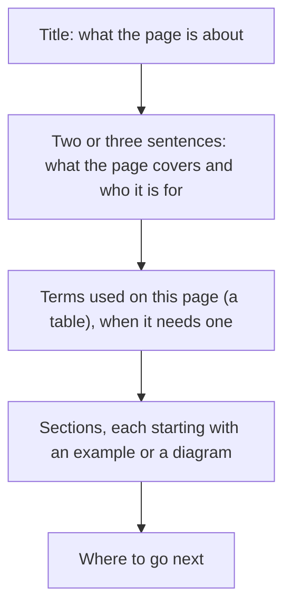

# How to write inillucent documentation

This page is the style guide for every page in this repository and for the documentation chapters
on inillucent.com. Read it before you write or change a page.

Most readers are programmers who have used a database but have never written one. They know what a
table and a query are. They may not know what a B-tree, a write ahead log or an HNSW index is. Write
for that reader.

## The rules

1. **Short declarative sentences.** One idea per sentence. If a sentence has two clauses joined by a
   dash, a semicolon or "which", split it into two sentences.
<!-- doc-style: off -->
2. **Plain words.** Use the common word: "write" instead of "materialise", "show" instead of
   "surface", "use" instead of "reach for".
<!-- doc-style: on -->
3. **Name the thing every time.** Write "`PRAGMA busy_timeout` controls how long a writer waits",
   and in the next sentence write `PRAGMA busy_timeout` again. Do not write "the setting", "it" or
   "this" when the reader could lose track of what you mean.
4. **Say what is true and stop.** Do not add a contrast clause to make a sentence sound stronger.
   "The log is written before any page" is complete. "The log is written before any page, not
   after" adds nothing.
5. **Explain a term the first time a page uses it**, or link it to [the glossary](glossary.md). A
   page that uses more than three specialist terms starts with a table of them.
6. **Show, then explain.** Put a command, a query or a diagram near the top of a section, then
   describe what it did.
7. **Every number has a source.** A number is either printed by a program in this repository, or
   measured and recorded in [Performance](performance.md) or
   [Retrieval quality](retrieval-quality.md). Say which run and which date when the number is a
   measurement.
8. **Present tense, about the current release.** Describe what the engine does now. The history of
   how it got there belongs in `CHANGELOG.md` in the repository root and
   [Closed items](closed-items.md).

## What not to write

`tools/doc-style/rules.txt` lists the phrases below, and a test fails when one appears in a page.

<!-- doc-style: off -->

| Do not write | Why | Write instead |
|---|---|---|
| An em dash or an en dash | It joins two sentences that should be separate | Two sentences |
| A spaced hyphen used as a dash, like "fast - and small" | Same as above | Two sentences |
| Words joined by a hyphen, like "read-only" or "built-in" | They read as invented terms | "read only", "built in" |
| "X, not Y" or "X rather than Y" when Y is only there for contrast | It adds a second idea the reader did not need | "X" |
| "It is not A, it is B" | Same as above | "It is B" |
| "load bearing", "first class", "battle tested" | Invented technical words | Say what the thing does |
| "worth noting", "to be clear", "honestly", "put simply" | It announces a sentence instead of writing it | Delete the announcement |
| "the whole point", "which is the point" | Emphasis with no information in it | State the reason once |
| "the shape of", "surface", "vocabulary" | A vague noun where a concrete one exists | "the list of values", "the list endpoint" |
| "blows up", "takes down", "kills" for a failure | Dramatic words for an error | "the statement fails with `SQLITE_BUSY`" |
| An idiom, a metaphor or a saying | The reader has to translate it | The fact it stands for |

<!-- doc-style: on -->

A hyphen is fine inside a name somebody else chose: B-tree, R-Tree, Mach-O, p-value, and anything in
backticks such as `inillucent-shell` or `--output json`.

## How a page is laid out

- **Diagrams.** Use a mermaid diagram when a reader needs to see how parts connect or in what order
  things happen: the path a query takes, what happens during a commit, how a search combines two
  rankings. Keep a diagram under about twelve boxes. Every box label is plain words.
- **Tables.** Use a table for anything the reader will look up: terms, options, exit codes,
  commands, results.
- **Code blocks.** Every command and query can be copied and run as written. Show the output when
  the output is what the reader needs to check.

## Keeping pages correct

Documentation goes stale when the code changes and nobody updates the page. Three checks help:

| Check | What it does |
|---|---|
| `cargo test -p inillucent-compat --test tooling documentation::` | Fails on a broken link, a page missing from the index, a command that does not exist, a skill copy that differs from its source, and any phrase this guide bans |
| `node tools/doc-style/check.mjs` | The same writing rules, in a second, for one page or all of them. `--site <path>` also checks the inillucent.com chapters |
| `node tools/doc-facts/check.mjs --site <path>` | Runs the built programs and fails when a count in a page (commands, MCP tools, functions, capabilities, probe cases) differs from what the programs report |

None of these can tell whether a sentence is still true. That is the job of whoever changes the
code. **A change that alters what a user sees updates the pages that describe it in the same
commit**: the page under `docs/`, the skill under `agent-skills/`, the package readme, and the
chapter in `src/data/documentation.ts` in the inillucent.com repository.
