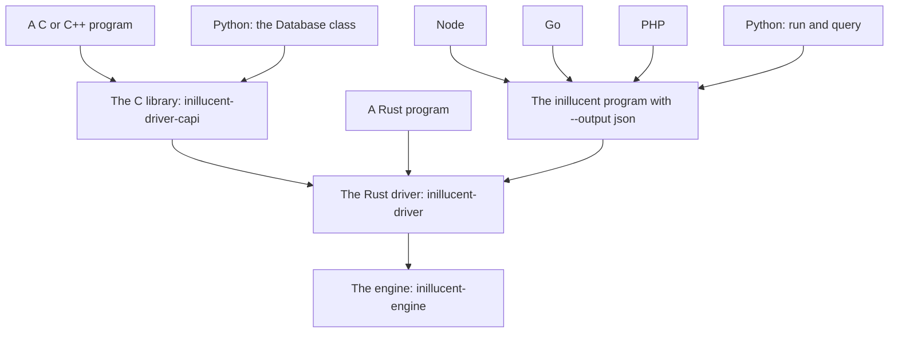

# The inillucent driver

This page is for a programmer who wants to use inillucent from an application, or who is writing a
binding for a new language. It covers the Rust driver, the C library over it, and how the Python,
Node, Go and PHP packages reach the engine. You do not need to read the engine's code.

If you are writing a binding, this page and
[`inillucent-driver-capi/include/inillucent_driver.h`](inillucent-driver-capi/include/inillucent_driver.h)
are all you need.

## Terms used on this page

| Term | Meaning |
|---|---|
| driver | The Rust crate `inillucent-driver`. Every call an application makes goes through the driver. |
| C library | The crate `inillucent-driver-capi`. It wraps the driver in plain C functions that any language can call. |
| ABI | The list of C functions, constants and types in `inillucent_driver.h`. A binding compiled against the ABI keeps working while the ABI keeps the same major version. |
| binding | Code in another language that calls the C library, or runs the `inillucent` program, and gives that language its own objects. |
| handle | An opaque pointer the C library returns, such as `inillucent_db *`. You free each handle with its `_free` or `_close` function. |
| session | The scope that `temp.` tables, `ATTACH` and connection pragmas belong to. |
| capability | One row in the driver's table of what the engine can do, with a support level of `yes`, `partial` or `no`. |
| `unsupported` | The status the engine returns for a construct it has not built. |

## How each language reaches the engine



| Language | How it reaches the engine |
|---|---|
| Rust | It calls the driver directly. |
| C and C++ | They call the C library. |
| Python | Both ways. The `Database` class calls the C library. The functions `run` and `query` at the top of the module start the `inillucent` program. |
| Node, Go, PHP | They start `inillucent --output json` and parse the JSON it prints. |

The two routes return values in different forms.

- A binding on the C library gets typed values. A blob is bytes. An integer is a 64 bit integer.
- A binding that starts the program gets a JSON document. JSON has no byte string, and many JSON
  parsers store every number as a 64 bit float.

So on Node, Go, PHP and the Python `run` and `query` functions, a value is whatever
`--output json` prints and the language's JSON parser reads:

- **A blob is `{"blob": "<hex>"}`** in both directions. `SELECT x'00ff'` prints
  `{"blob": "00ff"}`.
- **An integer larger than 2^53 is exact in some languages and rounded in others.** PHP's
  `json_decode` and Python's `json.loads` keep it exact. JavaScript's `JSON.parse` rounds it. Go's
  `encoding/json` rounds it unless the decoder calls `UseNumber()`.

`inillucent-driver` depends on `inillucent-engine` and on no other crate in the workspace.
`inillucent-driver-capi` depends on `inillucent-driver` and on no other crate in the workspace. An
application that uses the driver does not change when crates below the engine move.

## Two rules for every application

1. **Handle `unsupported` on its own.** The engine returns `unsupported` (`INILLUCENT_UNSUPPORTED` in
   C, `Status::Unsupported` in Rust) for a construct it has not built. A mistyped statement gets a
   different status, such as `syntax`. A binding that turns both into one general error cannot tell
   "not built yet" from "wrong". For example, `SELECT 1 LIMIT 1 + 1` returns `unsupported`, because
   `LIMIT` takes only a constant or a bound parameter. The 416 case differential probe, which runs
   each case on inillucent and on the pinned SQLite 3.53.4, has no case that returns `unsupported`.
   Write the `unsupported` branch anyway, because the capability table lists 19 constructs the
   engine refuses.
2. **Read the capability table before you write unusual SQL.** The table lists what the engine can
   do, with a sentence about each row. See [The capability table](#the-capability-table).

The Python conformance runner prints the size of the table when it finishes:

```
$ python drivers/bindings/python/run_conformance.py
49 capabilities reported
```

The 49 rows are 28 `yes`, 2 `partial` and 19 `no`. The two `partial` rows are:

| Capability | Why it is `partial` |
|---|---|
| `cancel` | A running statement stops at the next leaf of a scan or the next batch of results. An operator in the middle of one indivisible step finishes that step first. |
| `readonly_open` | The driver refuses any statement that is not a query. The file itself is still open for writing, so another handle could write to it. |

## Files in this directory

| Path | What it holds |
|---|---|
| `inillucent-driver/` | The driver, in Rust. Every decision about behavior is made here. |
| `inillucent-driver-capi/` | The C library over the driver, built as a `cdylib` and a `staticlib`. |
| `inillucent-driver-capi/include/inillucent_driver.h` | The header a binding compiles against. |
| `abi.toml` | Every C symbol, with its stability and the version it first appeared in. |
| `conformance/suite.json` | The driver's expected behavior, written as test cases in JSON. |
| `bindings/python/` | The reference binding. It uses only the Python standard library. |

## Rust

```rust
use inillucent_driver::{Database, Status, Value};

let database = Database::open("app.rdb")?;
let connection = database.session();

connection.execute("CREATE TABLE people (id INTEGER PRIMARY KEY, name TEXT)", &[])?;
connection.execute(
    "INSERT INTO people VALUES (?1, ?2)",
    &[Value::Integer(1), Value::Text("Ada".into())],
)?;

let rows = connection.query("SELECT id, name FROM people", &[], 200)?;
println!("{} of {}{}", rows.rows.len(), rows.total, if rows.more { "+" } else { "" });

// `limit` is a count. query(.., 0) returns no rows, with `total` set to the real count.
// Use query_all to get every row.
let everything = connection.query_all("SELECT id, name FROM people", &[])?;

// Every construct the engine has not built returns Status::Unsupported.
match connection.query_all(statement, &[]) {
    Err(why) if why.status == Status::Unsupported => {
        println!("not yet: {}", why.feature.unwrap_or_default());
    }
    other => { other?; }
}
```

`Database::session` returns a `Connection`. The older name `Database::connect` still works and is
deprecated.

`embed(TEXT)` is compiled in only with the `embed` feature, on `inillucent` or on
`inillucent-driver`:

```toml
[dependencies]
inillucent = { version = "1.0", features = ["embed"] }
```

The feature forwards to `inillucent-engine`. Releases up to 1.0.29 have no `embed` feature on
`inillucent` or `inillucent-driver`. With those, add
`inillucent-engine = { version = "1.0.29", features = ["embed"] }` beside the dependency, and Cargo
turns the feature on for the engine the driver uses. The model is not part of the build.
`docs/embeddings.md` says how to install it.

Rust calls the driver directly. It does not go through the C library. Going through the C library
would add a pointer conversion and a panic guard to every call, and would turn Rust errors into C
integers and back.

### Six behaviors to design around

| Behavior | What it means for your code |
|---|---|
| **Values are typed.** | A value is one of `Null`, `Integer`, `Real`, `Text` or `Blob`. The driver does not turn numbers into text. |
| **`Null` is its own variant.** | `Value::Null` and an empty `Value::Text` are different values. |
| **`total` is exact.** | The engine builds the whole result before it returns. `limit` caps the rows handed back. `total` counts every row the statement produced, and `more` is true when `limit` left rows out. A query over a large table costs the whole result, so put a `LIMIT` in the SQL when that matters. |
| **A batch is one transaction, checked before the commit.** | `Connection::transaction(work, check)` runs every statement, passes the changed row counts to `check`, and commits only when `check` returns `Ok`. Any failure rolls back all of it. `Connection::begin` returns a `Transaction` you drive one statement at a time. Dropping a `Transaction` without `commit` rolls it back. |
| **One file has one buffer pool, and the engine runs on one thread.** | A `Database` is neither `Send` nor `Sync`. |
| **Read only is enforced by the driver.** | With `OpenOptions::read_only` set, the driver refuses any statement that does not bind to a query, including a `PRAGMA`. The binder decides this, so whitespace or a comment in the SQL does not change the result. The file is still open for writing, so the `readonly_open` capability says `partial`. |

`Database::open` uses these defaults from `OpenOptions`:

| Option | Default |
|---|---|
| `create` | `true` |
| `read_only` | `false` |
| `cache_frames` | 4,096 frames, which is 128 MiB at the engine's 32 KiB page |
| `diagnostics` | `false` |
| `limits` | unbounded |
| `statement_cache` | 1,000 compiled statements per connection |

## The capability table

```rust
for entry in inillucent_driver::CAPABILITIES {
    println!("{:24} {:8} {}", entry.name, entry.support.name(), entry.note);
}
if inillucent_driver::supports("cancel") != Some(Support::Yes) {
    // do not promise that a Stop button is instant
}
```

In C, `inillucent_capability_count()` and `inillucent_capability(nth, ...)` read the same table, and
`inillucent_supports(name)` looks up one row. The command `inillucent capabilities --output json`
prints the same table.

An unknown name returns `None` in Rust and `INILLUCENT_SUPPORT_UNKNOWN` in C. Treat an unknown name
as "no". A capability that was never declared was never tested.

### How the table is tested

`inillucent-driver/tests/capability.rs` runs a probe for every row against a real database. The test
fails in both directions:

- A row says `yes` and its probe fails. The table claims something the engine does not do.
- A row says `no` and its probe succeeds. The engine has gained the feature, and the failure names
  the row to update.

Every row has a probe. The rows for registering a function and a collation register one, then call
it from SQL.

## The conformance suite

`conformance/suite.json` describes the driver's behavior as test cases. Two runners read the same
file:

```bash
# Rust
cargo test --manifest-path <repo>/Cargo.toml -p inillucent-driver --test conformance

# Python, through the C library
cargo build --manifest-path <repo>/Cargo.toml -p inillucent-driver-capi
python drivers/bindings/python/run_conformance.py
```

When the two runners disagree, one of the bindings is wrong.

The `about` section at the top of `suite.json` explains the format:

- A case has `setup` statements and `steps`.
- A step checks only the keys it contains.
- A value is an object with one key: `{"int": 7}`, `{"text": "one"}`, `{"null": true}`,
  `{"blob": [0, 255]}`. This keeps NULL and the empty string apart in the file.
- A case with `"connection": "per_call"` asks the runner to open a new connection for every step.

**Add a case when you fix a bug.** For example, the case `returning_gives_rows_and_a_count` was
added when `INSERT ... RETURNING a, b` returned its rows with no column names.

## Writing a binding

Every binding follows the same six steps.

1. **Load the library and check the major version from `inillucent_abi_version()`.** The value is
   `major * 1000000 + minor * 1000 + patch`. Refuse a different major version with an error that
   names both versions. Calling a function whose signature has changed fails in ways nobody can
   read.
2. **Wrap each handle in your language's resource type.** Give it a finalizer that calls the
   matching `_free`. Make the finalizer safe to run twice.
3. **After every call that takes an `inillucent_error **`, check the status first.** When it is
   not `INILLUCENT_OK`, build your exception from `inillucent_error_status`,
   `inillucent_error_message`, `inillucent_error_feature` and `inillucent_error_offset`. Then call
   `inillucent_error_free` in a `finally` block, so building the exception cannot leak the error.
4. **Map `INILLUCENT_UNSUPPORTED` to its own exception type.** The Python binding calls it
   `Unsupported`.
5. **Copy every `const char *` into your own string.** The pointer points inside a handle, and the
   caller may free that handle.
6. **Run `conformance/suite.json`.** A binding has not been tested until the suite passes.

### Status codes

| Constant | Value | Meaning |
|---|---|---|
| `INILLUCENT_OK` | 0 | Success |
| `INILLUCENT_UNSUPPORTED` | 1 | The engine has not built this construct |
| `INILLUCENT_SYNTAX` | 2 | The statement is not valid SQL |
| `INILLUCENT_NOT_FOUND` | 3 | No such table, column or index |
| `INILLUCENT_CONSTRAINT` | 4 | A constraint refused the write |
| `INILLUCENT_READONLY` | 5 | A write on a read only database |
| `INILLUCENT_BUSY` | 6 | Another writer holds the database |
| `INILLUCENT_INTERRUPTED` | 7 | The statement was cancelled |
| `INILLUCENT_CORRUPT` | 8 | The file is damaged |
| `INILLUCENT_IO` | 9 | The operating system reported an error |
| `INILLUCENT_FULL` | 10 | The disk is full |
| `INILLUCENT_TOO_BIG` | 11 | A value or result exceeds a limit |
| `INILLUCENT_INVALID_STATE` | 12 | The caller broke the ABI's contract. `INILLUCENT_MISUSE` is the same value |
| `INILLUCENT_INTERNAL` | 13 | A defect in inillucent. Please report it |

### The three ownership rules

1. A handle that has a `_free` or `_close` function is yours to free, exactly once. Freeing `NULL`
   does nothing, so a finalizer does not need to check.
2. A pointer the library **returns** points inside the handle you asked. It stays valid until that
   handle is freed. You never free it. A result is complete when it is returned, so a pointer into
   row 0 stays valid while you read row 900,000.
3. The library copies every pointer you **pass in** before the call returns. You may free your
   buffer on the next line.

Text is not terminated by a NUL byte. A text value may contain a NUL byte, so
`inillucent_value_bytes` returns the length through an output parameter.

### Lifetimes in a garbage collected language

A connection is valid only while its database is open. A garbage collector may finalize objects in
any order, so hold a strong reference from child to parent:

- A connection object keeps its database object alive.
- A statement object keeps its connection object alive.
- A result object keeps nothing alive. A result holds all its own data, and a result is the object
  most likely to outlive its statement in a loop such as `for row in query(...)`.

`inillucent_close` returns `INILLUCENT_INVALID_STATE` while any connection is still open. A wrong
order is an error your code can see, and the process does not crash.

### Threads

One file has one buffer pool, and the engine runs on one thread. Keep an `inillucent_db` and every
handle made from it on one thread, or guard every call with a lock your binding owns. The C library
has no lock inside it. `inillucent_cancel` is the one call that is safe from another thread while a
statement runs. Two databases on two files are independent.

### Sessions, and a connection per call

A session is what `temp.` tables, `ATTACH` and the connection pragmas belong to. In C,
`inillucent_connect` opens a session and the `inillucent_conn` handle keeps it. Every call on that
handle runs in the same session.

A Rust caller that holds a connection for a long time needs one more step. `Connection<'d>` borrows
the `Database`, so one Rust struct cannot hold both. Such a caller holds the `Database`, makes a
connection for each call, and passes the session number along:

```rust
let session = database.session().session();
// later, for every call:
let connection = database.session_as(session);
```

Without `session_as`, every call is a new session. A `CREATE TEMP TABLE` typed into a query console
is then gone by the next statement. The conformance case `a_temp_table_survives_a_connection_per_call`
tests this. It is the one case that sets `"connection": "per_call"`.

### Libraries to start from

| Language | Library |
|---|---|
| Python | `ctypes` from the standard library. `bindings/python/inillucent.py` is the reference binding. |
| Node | `koffi`, or N-API if a compiled addon is acceptable. |
| Go | `cgo`, or `purego` to avoid cgo. |
| Java | The Foreign Function and Memory API on Java 22 and later, and JNI before that. |
| C# | `DllImport` with `SafeHandle` subclasses, which follow the lifetime rule above. |

## ABI stability

`abi.toml` gives each of the 53 symbols in the header a stability and a `since` version.
`inillucent-driver-capi/tests/abi.rs` checks that the header, `abi.toml` and the Rust code name the
same symbols. It also checks that every numeric constant in the header equals the driver's own enum
value. A status renumbered in Rust without the header changing would make every binding read every
error wrongly, and both sides would still compile.

| Stability | Promise |
|---|---|
| stable | The signature will not change, and the symbol will not be removed. |
| provisional | The symbol exists and may change in a minor version. `inillucent_cancel` is the only provisional symbol. It asks a running statement to stop, and the statement then fails with `INILLUCENT_INTERRUPTED`. |

The ABI version is 1.0.0, and `inillucent_abi_version()` returns 1000000.

## Building the C library

```bash
cargo build --manifest-path <repo>/Cargo.toml -p inillucent-driver-capi
```

The build writes these files to `target/<profile>/`:

| File | Use |
|---|---|
| `inillucent_driver_capi.dll`, `libinillucent_driver_capi.so`, `libinillucent_driver_capi.dylib` | The shared library a binding loads |
| `inillucent_driver_capi.lib`, `libinillucent_driver_capi.a` | The static library a C or C++ program links |

The header needs only `stdint.h` and `stddef.h`.
