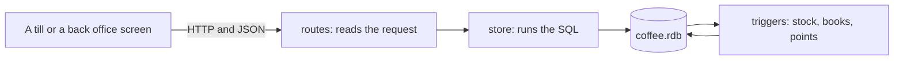
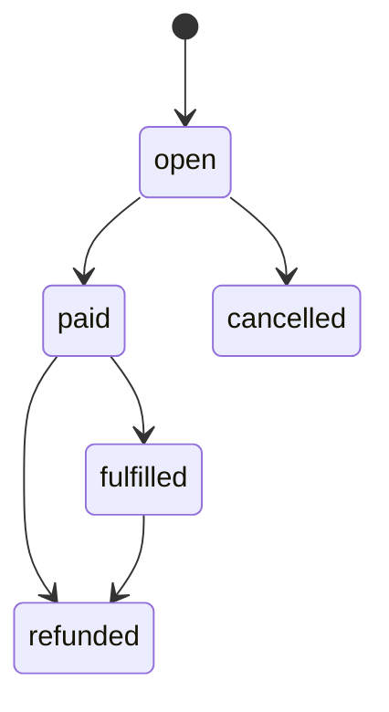

# A coffee shop's orders and books, in Rust

`coffee-server` runs the till and the back office of a small coffee shop. It takes orders at the
counter, prices them, takes cash and cards, and keeps the stock and a full set of double entry books
up to date as it goes. It answers HTTP requests with JSON, and it keeps everything in one inillucent
database file.

The program uses the `inillucent` crate from crates.io, exactly as an application outside the
inillucent repository would. It is about 4,400 lines of Rust and 700 lines of tests, and every SQL statement is in
`src/store/` or `src/schema.rs`. This page explains what the program does, why each SQL statement
is written the way it is, and shows what each one returned on the seed data.

## Terms used on this page

| Term | Meaning |
|---|---|
| double entry bookkeeping | every movement of money is written twice: once as a debit to one account and once as a credit to another. A journal entry is correct when its debits equal its credits |
| journal entry, journal line | one business event in the books, such as a sale, and its lines, one per account it touches |
| debit, credit | the two sides of a journal line. Assets and expenses grow with debits. Liabilities, equity and revenue grow with credits |
| cost of goods sold | what the ingredients in the things sold cost. Selling a latte turns milk and coffee on the shelf into an expense |
| weighted average cost | an ingredient's cost per gram, averaged over everything bought so far, weighted by quantity |
| float | the cash left in the drawer overnight, so the first customer can be given change |
| Z report | the end of day summary a till prints when the day is closed |
| tip pool | the day's tips, shared among the staff by how long each worked |
| CTE | a common table expression: a named query written in `WITH` before the main one. A recursive CTE repeats itself, here to make a calendar |
| window function | a function such as `rank()` or `sum() OVER (...)` that reads other rows of the result without merging them into one row |
| trigger | SQL that the database runs by itself when a row is inserted, updated or deleted |

## 1. The solution in one page



A request goes through three layers. `src/routes/` reads the request. `src/store/` runs SQL
against the database in one transaction. The schema's triggers then write everything that follows
from the change, inside that same transaction.

The service writes only what a person decided: an order and its lines, a payment, a delivery, a stock
count, a closed day. The database works out the rest. When an order is paid, the `order_paid`
trigger uses up the ingredients of every drink, posts the sale to the books, and gives the customer
points. Nothing in Rust can pay an order and forget one of those three.

These decisions shape the rest of the code:

| Decision | Why |
|---|---|
| Money is an integer number of cents, in columns named `*_cents` | A `REAL` cannot hold 0.10 exactly. Books that must balance to the cent cannot be built from sums of numbers that are each slightly wrong. Tax and card fees are rates in basis points, and rounding is integer arithmetic: `(amount * 825 + 5000) / 10000` is 8.25% rounded half up |
| The books are written by triggers | A sale, its stock and its journal entry change together or not at all, whatever code path paid the order |
| Journal lines and entries can never be changed or deleted | Four `RAISE(ABORT, ...)` triggers refuse it. A mistake is corrected by a new entry, so the books keep their history |
| Every transaction that posts to the books reads `unbalanced_entry` before it commits | The view lists entries whose debits and credits differ. It must be empty, and a transaction that would leave a row in it is rolled back |
| The schema enforces every rule it can | A negative price, a second open shift, a line added to a paid order and a refund of a refund are refused by a `CHECK`, a `UNIQUE` index or a trigger. `src/error.rs` turns the engine's `constraint` status into `409` with the engine's message |
| A batch arrives as one JSON parameter | Several payments, the lines of a delivery or a stock count are bound as one JSON array and read with `json_each` inside an `INSERT ... SELECT`: one statement, however many rows |
| Reports are the rows of one query | A report's JSON is the query's result, one object per row and one field per column. What the README shows under a query is what the query returned |
| Every write takes an optional time, `at` | The seed can make up a week of trading, and the tests can fix the clock |

## 2. Install, fill and start

You need a Rust toolchain from [rustup.rs](https://rustup.rs). This example needs no embedding model.

```sh
cd examples/coffee-shop
cargo build --release
cargo run --release -- seed          # a menu, stock, staff, customers and a week of trading
cargo run --release -- serve         # http://127.0.0.1:3000
```

The first build compiles inillucent from crates.io and takes a few minutes. `seed` takes about 30
seconds, and prints a summary:

```json
{
  "from": "2026-09-21",
  "to": "2026-09-27",
  "orders": 270,
  "paid": 264,
  "journal_entries": 329,
  "balance_sheet": { "assets_cents": 1723394, "liabilities_cents": 101492, "equity_cents": 1621902, "balances": true },
  "check": true
}
```

| Option | What it does | Default |
|---|---|---|
| `--db` | the database file, for both commands | `data/coffee.rdb` |
| `--addr` | the address `serve` listens on. Port `0` picks a free port | `127.0.0.1:3000` |
| `--until` | `seed`: the day after the last day of trading. The same day gives the same data | `2026-09-28` |
| `--days` | `seed`: how many days of trading | `7` |

The seed makes up seven days, from Monday 21 September 2026 to Sunday 27 September. Each day has a
bakery delivery, shifts, 30 to 50 orders with cash, cards, tips, promotion codes and points, a few
cancelled orders, a refund every other day, waste at closing and a closed day. The last day is left
open, with orders still in the barista queue. The answers below are from that data.

## 3. The schema

```text
THE MENU     category ──< menu_item ──< menu_price (one row per size) ──< recipe >── ingredient
             modifier: oat milk replaces whole milk, an extra shot adds coffee

THE COUNTER  orders ──< order_line ──< order_line_modifier >── modifier
               ├──< payment             cash or card; a refund is a negative payment
               ├── customer ──< loyalty_entry
               ├── staff ──< shift
               └── promotion

THE BACK     purchase ──< purchase_line >── ingredient ──< stock_movement
OFFICE       day_close ──< tip_payout >── staff

THE BOOKS    account ──< journal_line >── journal_entry
```

`src/schema.rs` has every statement, with a comment on each part. What the schema enforces, and why
it is written that way:

| Part | What it does | Why this SQL |
|---|---|---|
| `STRICT` tables | a text value in an `INTEGER` column is refused | without `STRICT`, `'12.50'` in `price_cents` is stored as text and sorts and sums wrongly |
| `WITHOUT ROWID` on `menu_price`, `recipe`, `setting`, `account` | the table is stored in the order of its primary key, with no second copy | these tables are always read by their key |
| `FOREIGN KEY (menu_item_id, size) REFERENCES menu_price` on `recipe` and `order_line` | a recipe or an order line can only name a size the item is sold in | a foreign key can name more than one column, and a single column key could not say "this size of this item" |
| `business_day TEXT GENERATED ALWAYS AS (date(opened_at)) STORED` | the day an order belongs to is worked out, never written | the service cannot put an order on the wrong day, and `UNIQUE (business_day, ticket)` can index it |
| `total_cents GENERATED ALWAYS AS (subtotal_cents - discount_cents + tax_cents) STORED` | the total cannot disagree with its parts | the same reason |
| `change_cents GENERATED ... (tendered_cents - amount_cents - tip_cents) VIRTUAL` | the change is worked out from the cash handed over | nobody types the change |
| `CHECK (opened_at IS strftime('%Y-%m-%dT%H:%M:%SZ', opened_at))` | a time that is not a real time in that exact format is refused | `strftime` returns NULL for `2026-02-30`, and `IS` compares NULL as a value, so the check fails. With `=` it would be NULL, and a NULL check passes |
| `CREATE UNIQUE INDEX shift_one_open ON shift (staff_id) WHERE ended_at IS NULL` | a person can be clocked in once | a partial index covers only the open shifts, so any number of finished shifts can share a `staff_id` |
| `UNIQUE (source, source_id)` on `journal_entry` | a sale is posted once, a refund once, a supplier invoice paid once | a retried request fails with `409` before it can post twice |
| `refund_of INTEGER UNIQUE REFERENCES payment (id)` | a payment can be refunded once | the refund row names the payment it gives back |
| `CHECK ((debit_cents = 0) <> (credit_cents = 0))` on `journal_line` | a line has an amount on exactly one side | comparing two booleans with `<>` is an exclusive or |
| `day_close` with `business_day` as its primary key | a day can be closed once | the primary key is the lock, and two triggers read it to refuse orders and payments on a closed day |

### The triggers

| Trigger | When | What it does |
|---|---|---|
| `order_paid` | an order moves from `open` to `paid` | inserts the stock used by every line, the sale's journal entry and the customer's points |
| `order_refunded` | a paid order moves to `refunded` | inserts a journal entry that reverses the sale, and takes the points back |
| `stock_movement_applies` | a stock movement is inserted | adds its change to the ingredient's `on_hand` |
| `order_status_moves_forward` | any status change | refuses a change the lifecycle below does not have |
| `order_line_needs_open_order`, `order_line_frozen_after_open`, `order_line_kept_after_open` | a line is added, changed or removed | refuses it unless the order is open |
| `orders_on_open_day`, `payment_on_open_day` | an order or a payment is inserted | refuses it when its day is closed |
| `order_redeems_points_it_has` | an order is set to spend points | refuses more points than the customer has |
| `journal_entry_is_permanent` and three more | any update or delete in the books | refuses it |



## 4. Taking an order

```sh
curl -s -X POST localhost:3000/orders -H 'Content-Type: application/json' -d '{
  "customer_id": 1, "staff_id": 3, "at": "2026-09-27T17:40:00Z",
  "lines": [ { "menu_item_id": 3, "size": "large", "modifiers": [2, 1] }, { "menu_item_id": 10 } ] }'
```

A large latte with an extra shot and oat milk, and a croissant. Then the customer asks for a second
latte made the same way, with the modifiers in the other order:

```sh
curl -s -X POST localhost:3000/orders/271/lines -H 'Content-Type: application/json' \
  -d '{ "menu_item_id": 3, "size": "large", "modifiers": [1, 2] }'
```

```json
{
  "id": 271, "ticket": 46, "business_day": "2026-09-27", "status": "open", "customer_name": "Maya",
  "lines": [
    { "id": 413, "name": "Latte", "size": "large", "quantity": 2, "unit_price_cents": 685, "line_total_cents": 1370, "modifiers": "Extra shot, Oat milk", "taxable": 1 },
    { "id": 414, "name": "Croissant", "size": "regular", "quantity": 1, "unit_price_cents": 375, "line_total_cents": 375, "modifiers": null, "taxable": 0 }
  ],
  "subtotal_cents": 1745, "discount_cents": 0, "tax_cents": 113, "total_cents": 1858
}
```

The receipt above is shortened. The second latte became a quantity of 2 on the first line. This is
the statement that adds a line:

```sql
INSERT INTO order_line (order_id, menu_item_id, size, modifier_key, quantity, unit_price_cents, taxable)
SELECT ?1, p.menu_item_id, p.size,
       coalesce((SELECT group_concat(value, ',' ORDER BY value) FROM (SELECT DISTINCT value FROM json_each(?4))), ''),
       ?5,
       p.price_cents + coalesce((SELECT sum(price_cents) FROM modifier WHERE id IN (SELECT value FROM json_each(?4))), 0),
       m.taxable
FROM menu_price p
JOIN menu_item m ON m.id = p.menu_item_id
WHERE p.menu_item_id = ?2 AND p.size = ?3
ON CONFLICT (order_id, menu_item_id, size, modifier_key) DO UPDATE SET quantity = quantity + excluded.quantity
RETURNING id, quantity
```

| Part | Why |
|---|---|
| `INSERT ... SELECT` from `menu_price` | the line copies the price the menu has now. A later price change does not reach an order that is already open |
| `modifier_key`, the modifier ids sorted and joined | `[2, 1]` and `[1, 2]` both become `'1,2'`, so the same drink is the same key whatever order the modifiers were tapped in |
| `json_each(?4)` | the modifiers arrive as one JSON array bound to one parameter, however many there are |
| `ON CONFLICT ... DO UPDATE SET quantity = quantity + excluded.quantity` | this is UPSERT. `UNIQUE (order_id, menu_item_id, size, modifier_key)` sends a second identical drink into `DO UPDATE`, and `excluded` is the row that would have been inserted |
| `RETURNING id, quantity` | the id of the line, new or old, without a second query, for inserting its modifiers |

The ticket number, 46, is worked out when the order is opened. It starts again at 1 each day:

```sql
INSERT INTO orders (opened_at, ticket, channel, customer_id, staff_id)
SELECT ?1, coalesce(max(ticket), 0) + 1, coalesce(?2, 'counter'), ?3, ?4
FROM orders WHERE business_day = date(?1)
RETURNING id
```

`UNIQUE (business_day, ticket)` stops two orders sharing a number. Thirty orders opened in parallel
got thirty different tickets: the store opens each order in a transaction, and a transaction holds
the database until it commits.

## 5. Pricing: promotion codes, points and tax

```sh
curl -s -X POST localhost:3000/orders/271/promotion -H 'Content-Type: application/json' -d '{"code": "morning"}'
```

```json
{ "promotion_code": "MORNING", "subtotal_cents": 1745, "discount_cents": 100, "tax_cents": 107, "total_cents": 1752 }
```

`MORNING` takes 100 cents off an order of 800 cents or more. The code is matched ignoring case,
because `promotion.code` is `COLLATE NOCASE`. Every change to an open order is priced again by three
statements, in order:

```sql
UPDATE orders SET subtotal_cents = (SELECT coalesce(sum(line_total_cents), 0) FROM order_line WHERE order_id = ?1)
WHERE id = ?1 AND status = 'open';

UPDATE orders SET discount_cents = min(subtotal_cents,
  coalesce((SELECT CASE p.kind WHEN 'percent' THEN (orders.subtotal_cents * p.value + 50) / 100 ELSE p.value END
            FROM promotion p
            WHERE p.id = orders.promotion_id
              AND orders.business_day BETWEEN p.starts_on AND p.ends_on
              AND orders.subtotal_cents >= p.min_subtotal_cents), 0)
  + redeem_points / 100 * 500)
WHERE id = ?1 AND status = 'open';

UPDATE orders SET tax_cents = coalesce(
  (SELECT ((t.taxed - orders.discount_cents * t.taxed / orders.subtotal_cents) * s.value + 5000) / 10000
   FROM (SELECT sum(line_total_cents) AS taxed FROM order_line WHERE order_id = ?1 AND taxable = 1) t,
        setting s
   WHERE s.key = 'tax_rate_bp' AND orders.subtotal_cents > 0), 0)
WHERE id = ?1 AND status = 'open';
```

| Part | Why |
|---|---|
| three statements | each reads the column the one before it wrote. Inside one `UPDATE`, every `SET` expression sees the row as it was before the statement, so the tax would be worked out from the old subtotal |
| `min(subtotal_cents, ...)` | `min` with two arguments is the scalar minimum. The discount can never be more than the subtotal, and a `CHECK` on the table says so as well |
| the promotion's rules in the `WHERE` of a subquery | an order that no longer qualifies, such as one whose croissant was removed, gets no discount without an error. Applying a code the order does not qualify for is refused with `409` |
| `redeem_points / 100 * 500` | 100 points take 500 cents off. A `CHECK` on `orders` refuses a number that is not a multiple of 100, and a trigger refuses more points than the customer has |
| `t.taxed - discount * t.taxed / subtotal` | only the lattes are taxed, so only their share of the discount lowers the tax: `100 * 1370 / 1745` is 78 cents in integer division. The tax is 8.25% of 1292, which is 106.59, so 107 |

## 6. Paying, and what the triggers write

```sh
curl -s -X POST localhost:3000/orders/271/pay -H 'Content-Type: application/json' -d '{
  "at": "2026-09-27T17:41:00Z",
  "payments": [ { "method": "cash", "amount_cents": 1000, "tendered_cents": 2000 }, { "method": "card", "tip_cents": 100 } ] }'
```

```json
{
  "status": "paid", "total_cents": 1752,
  "payments": [
    { "id": 265, "method": "cash", "amount_cents": 1000, "tip_cents": 0, "tendered_cents": 2000, "change_cents": 1000 },
    { "id": 266, "method": "card", "amount_cents": 752, "tip_cents": 100, "tendered_cents": null, "change_cents": null }
  ],
  "points": { "earned": 16, "redeemed": 0, "reversed": 0, "balance": 106 }
}
```

The customer paid 10.00 of it in cash with a 20.00 note, and the rest by card with a 1.00 tip. The
card payment left out its amount, so the service filled in what the cash left. The payments go in with
one statement:

```sql
INSERT INTO payment (order_id, method, amount_cents, tip_cents, tendered_cents, at)
SELECT ?1, value ->> '$.method', value ->> '$.amount_cents', value ->> '$.tip_cents', value ->> '$.tendered_cents', ?2
FROM json_each(?3)
```

`->>` reads a field of a JSON object as an SQL value, so a JSON number arrives in an `INTEGER`
column as an integer. Then the service checks that the payments add up to the total, with the same
`sum()` the books will use, and answers `409` when they do not:

```json
{ "error": "conflict", "message": "the payments add up to 500 cents, and order 271 comes to 1752" }
```

The payments are rolled back with the rest of the transaction. When they do add up, one `UPDATE`
moves the order to `paid`, and the `order_paid` trigger writes three things in the same transaction.

**The stock.** Each line uses its recipe, except that a modifier can replace an ingredient: oat milk
replaces whole milk, in the quantity the recipe uses. Every modifier then adds its own ingredient.

```sql
INSERT INTO stock_movement (ingredient_id, change, cost_cents, reason, order_id, at)
SELECT u.ingredient_id, -sum(u.quantity), -((sum(u.quantity) * i.unit_cost_micros + 5000) / 10000),
       'sale', NEW.id, NEW.paid_at
FROM (
  SELECT r.ingredient_id AS ingredient_id, r.quantity * l.quantity AS quantity
  FROM order_line l
  JOIN recipe r ON r.menu_item_id = l.menu_item_id AND r.size = l.size
  WHERE l.order_id = NEW.id
    AND NOT EXISTS (SELECT 1 FROM order_line_modifier lm JOIN modifier m ON m.id = lm.modifier_id
                    WHERE lm.line_id = l.id AND m.replaces_ingredient_id = r.ingredient_id)
  UNION ALL
  SELECT m.ingredient_id, coalesce(r.quantity, m.quantity) * l.quantity
  FROM order_line l
  JOIN order_line_modifier lm ON lm.line_id = l.id
  JOIN modifier m ON m.id = lm.modifier_id
  LEFT JOIN recipe r ON r.menu_item_id = l.menu_item_id AND r.size = l.size
                    AND r.ingredient_id = m.replaces_ingredient_id
  WHERE l.order_id = NEW.id AND m.ingredient_id IS NOT NULL
) u
JOIN ingredient i ON i.id = u.ingredient_id
GROUP BY u.ingredient_id
HAVING sum(u.quantity) > 0;
```

| Part | Why |
|---|---|
| `NOT EXISTS (...)` | leaves out the recipe's whole milk on a line that has a modifier replacing it |
| `UNION ALL` | stacks the recipe's ingredients and the modifiers' ingredients into one list before they are summed |
| `LEFT JOIN recipe ... coalesce(r.quantity, m.quantity)` | a replacing modifier takes the quantity of the ingredient it replaces, and an adding one uses its own |
| `GROUP BY u.ingredient_id` | one movement per ingredient per sale, however many lines used it |
| `unit_cost_micros` and `+ 5000) / 10000` | an ingredient's cost is in millionths of a dollar per unit, because a gram of coffee costs less than a cent. The product is rounded to the cent once, per ingredient |

`GET /inventory/3/movements` shows the oat milk this sale used, with the stock after each movement
from a running `sum(change) OVER (ORDER BY id)`:

```json
{ "id": 898, "at": "2026-09-27T17:41:00Z", "reason": "sale", "ticket": 46, "change": -720, "cost_cents": -238, "on_hand_after": 38900 }
```

Two large lattes use 360 ml each. 720 ml at 0.33 cents a millilitre is 237.6 cents, so 238.

**The journal entry.** `GET /journal?day=2026-09-27` shows the entry the trigger posted:

| Account | Debit | Credit |
|---|---|---|
| 1000 Cash drawer | 1000 | |
| 1010 Card clearing | 852 | |
| 4100 Discounts | 100 | |
| 4000 Sales | | 1745 |
| 2000 Sales tax payable | | 107 |
| 2100 Tips payable | | 100 |
| 5000 Cost of goods sold | 609 | |
| 1200 Inventory | | 609 |

The debits and the credits both come to 2561. The lines come from one `INSERT ... SELECT` over a
`UNION ALL` of eight rows, one per account, with `WHERE x.debit > 0 OR x.credit > 0` leaving out the
accounts this sale did not touch. The cost of goods, 609 cents, is the sum of the stock movements the
statement before it wrote. The tip is a liability, because it belongs to the staff until it is paid
out when the day is closed.

**The points.** One point per whole dollar paid for goods after the discount: `(1745 - 100) / 100`
is 16. `GET /customers/1` shows Maya's history, with the balance after each entry from a running sum:

```sql
SELECT le.id, le.at, le.reason, le.points, o.ticket, o.business_day,
       sum(le.points) OVER (ORDER BY le.id) AS balance
FROM loyalty_entry le
LEFT JOIN orders o ON o.id = le.order_id
WHERE le.customer_id = ?1
ORDER BY le.id
```

```json
[
  { "at": "2026-09-21T05:00:00Z", "reason": "welcome", "points": 50, "balance": 50 },
  { "at": "2026-09-21T09:09:00Z", "reason": "earn", "points": 6, "ticket": 11, "balance": 56 },
  { "at": "2026-09-23T06:35:00Z", "reason": "earn", "points": 3, "ticket": 2, "balance": 101 },
  { "at": "2026-09-23T07:17:00Z", "reason": "redeem", "points": -100, "ticket": 8, "balance": 1 },
  { "at": "2026-09-23T07:17:00Z", "reason": "earn", "points": 7, "ticket": 8, "balance": 8 }
]
```

The history above is shortened. A balance is never stored as a number that code adds to. It is the
sum of the entries, so it always matches its history.

Once an order is paid, its lines are frozen by a trigger:

```json
{ "error": "conflict", "message": "lines can only be added to an open order" }
```

## 7. The barista queue

`GET /orders/queue?now=2026-09-27T17:45:00Z` lists the paid orders still to be made, oldest first:

```sql
SELECT o.id, o.ticket, o.channel, c.name AS customer_name, o.paid_at,
       (unixepoch(?1) - unixepoch(o.paid_at)) / 60 AS waiting_minutes,
       group_concat(l.quantity || ' ' || l.size || ' ' || m.name, ', ' ORDER BY l.id) AS items,
       row_number() OVER (ORDER BY o.paid_at, o.id) AS place
FROM orders o
LEFT JOIN customer c ON c.id = o.customer_id
JOIN order_line l ON l.order_id = o.id
JOIN menu_item m ON m.id = l.menu_item_id
WHERE o.status = 'paid'
GROUP BY o.id
ORDER BY place
```

```json
[
  { "place": 1, "ticket": 44, "items": "1 regular Blueberry muffin", "waiting_minutes": 47, "customer_name": null },
  { "place": 2, "ticket": 45, "items": "1 large Cold brew, 1 regular Flat white", "waiting_minutes": 20, "customer_name": null },
  { "place": 3, "ticket": 46, "items": "2 large Latte, 1 regular Croissant", "waiting_minutes": 4, "customer_name": "Maya" }
]
```

`group_concat(... ORDER BY l.id)` folds each order's lines into one string, in the order they were
added. `row_number()` runs over the grouped rows, so it numbers orders and not lines. `unixepoch()`
turns both times into seconds, so the difference is exact. The index on `orders (status, paid_at)`
finds the paid orders.

## 8. Refunds

`POST /orders/271/refund?at=2026-09-27T17:50:00Z` gives the money back. The service inserts a refund
payment for each payment, by the same method:

```sql
INSERT INTO payment (order_id, method, amount_cents, tip_cents, at, refund_of)
SELECT order_id, method, -amount_cents, -tip_cents, ?2, id
FROM payment WHERE order_id = ?1 AND refund_of IS NULL
ORDER BY id
```

Then it moves the order to `refunded`, and the `order_refunded` trigger posts the reversing entry:

```sql
INSERT INTO journal_line (entry_id, account_code, debit_cents, credit_cents)
SELECT r.id, l.account_code, l.credit_cents, l.debit_cents
FROM journal_line l
JOIN journal_entry s ON s.id = l.entry_id AND s.source = 'sale' AND s.source_id = NEW.id
JOIN journal_entry r ON r.source = 'refund' AND r.source_id = NEW.id
WHERE l.account_code NOT IN ('5000', '1200')
ORDER BY l.id
```

`l.credit_cents, l.debit_cents` in that order swaps the two sides of every line of the sale. The cost
of goods and the inventory lines are left out, because the drinks were made: the milk is gone
whether or not the customer paid for it. The points the order earned are taken back:

```json
{
  "payments": [
    { "id": 265, "method": "cash", "amount_cents": 1000, "tip_cents": 0, "refund_of": null },
    { "id": 266, "method": "card", "amount_cents": 752, "tip_cents": 100, "refund_of": null },
    { "id": 267, "method": "cash", "amount_cents": -1000, "tip_cents": 0, "refund_of": 265 },
    { "id": 268, "method": "card", "amount_cents": -752, "tip_cents": -100, "refund_of": 266 }
  ],
  "points": { "earned": 16, "redeemed": 0, "reversed": -16, "balance": 90 }
}
```

`refund_of` is `UNIQUE`, so a second refund of the same payment is refused.

## 9. Deliveries, waste and stock counts

```sh
curl -s -X POST localhost:3000/purchases -H 'Content-Type: application/json' -d '{
  "supplier": "Northside Roasters", "invoice": "NR-2026-09-27", "at": "2026-09-27T17:55:00Z",
  "lines": [ { "ingredient_id": 1, "quantity": 5000, "cost_cents": 12500 } ] }'
```

A delivery moves each ingredient's average cost toward what was paid, before the stock arrives,
because the formula needs the quantity on hand before the delivery:

```sql
UPDATE ingredient
SET unit_cost_micros = (max(ingredient.on_hand, 0) * ingredient.unit_cost_micros + pl.cost_cents * 10000)
                       / (max(ingredient.on_hand, 0) + pl.quantity)
FROM purchase_line pl
WHERE pl.purchase_id = ?1 AND pl.ingredient_id = ingredient.id
```

`UPDATE ... FROM` joins the table being updated to another table, so one statement updates every
ingredient on the invoice. Then one `INSERT ... SELECT` from `purchase_line` writes a stock movement
per line, and a journal entry puts 125.00 of stock on the books against accounts payable. Paying
the supplier later is `POST /purchases/13/pay`, which posts from accounts payable to the bank. The
journal's `UNIQUE (source, source_id)` stops the same invoice being paid twice.

`POST /inventory/waste` writes stock off at its average cost. A litre of milk past its date:

```json
{ "id": 902, "ingredient_id": 2, "change": -1000, "cost_cents": -110, "reason": "waste", "note": "milk past its date" }
```

`POST /inventory/count` sets the stock to what was counted. One statement joins the counts to the
ingredients and writes a movement for each one that differs:

```sql
INSERT INTO stock_movement (ingredient_id, change, cost_cents, reason, note, at)
SELECT i.id, c.counted - i.on_hand,
       CASE WHEN c.counted > i.on_hand THEN ((c.counted - i.on_hand) * i.unit_cost_micros + 5000) / 10000
            ELSE -(((i.on_hand - c.counted) * i.unit_cost_micros + 5000) / 10000) END,
       'count', 'counted ' || c.counted || ', expected ' || i.on_hand, ?2
FROM (SELECT value ->> '$.ingredient_id' AS ingredient_id, value ->> '$.counted' AS counted FROM json_each(?1)) c
JOIN ingredient i ON i.id = c.ingredient_id
WHERE c.counted <> i.on_hand
```

Counting 38,800 ml of oat milk where the books expected 38,900, two more cups than expected, and the
right number of tea bags gave `{"movements": 2, "value_change_cents": -15}`. The tea bags were right,
so they have no movement.

`GET /inventory?day=2026-09-27` shows every ingredient, with what the last seven days used and how
long the stock lasts at that rate:

```json
{ "name": "Cold brew concentrate", "on_hand": 2900, "reorder_level": 3000, "low": 1, "used_last_7_days": 9100, "days_of_cover": 2.2, "value_cents": 1450, "rank_by_value": 10 }
```

## 10. Closing the day

`POST /days/2026-09-26/close` with `{"counted_cash_cents": 31634}` closes Saturday. A day that still
has an open order is refused. Closing Sunday while ticket 47 was open answered:

```json
{ "error": "conflict", "message": "2026-09-27 still has open orders: tickets 47. Pay or cancel them first" }
```

Then, in one transaction, it shares the tips, counts the drawer, banks the cash above the float and
settles the cards. Each step is a journal entry.

**The tip pool.** The day's tips are shared by the minutes each person worked, to the cent:

```sql
WITH worked AS (
  SELECT staff_id, sum((unixepoch(ended_at) - unixepoch(started_at)) / 60) AS minutes
  FROM shift
  WHERE date(started_at) = ?1 AND ended_at IS NOT NULL
  GROUP BY staff_id
),
pool AS (
  SELECT coalesce(sum(tip_cents), 0) AS cents FROM payment WHERE business_day = ?1
),
share AS (
  SELECT w.staff_id, w.minutes,
         pool.cents * w.minutes / (SELECT sum(minutes) FROM worked) AS base,
         pool.cents * w.minutes % (SELECT sum(minutes) FROM worked) AS remainder
  FROM worked w, pool
)
SELECT share.staff_id, s.name, share.minutes AS minutes_worked,
       share.base + CASE WHEN row_number() OVER (ORDER BY share.remainder DESC, share.staff_id)
                              <= (SELECT cents FROM pool) - sum(share.base) OVER ()
                         THEN 1 ELSE 0 END AS tip_cents
FROM share JOIN staff s ON s.id = share.staff_id
ORDER BY share.staff_id
```

```json
[
  { "staff_id": 1, "name": "Ana", "minutes_worked": 480, "tip_cents": 699 },
  { "staff_id": 3, "name": "Chloe", "minutes_worked": 435, "tip_cents": 633 },
  { "staff_id": 4, "name": "Dev", "minutes_worked": 510, "tip_cents": 743 }
]
```

The pool was 2075 cents. Each person first gets the whole cents of their share, `base`, which leaves
a few cents over. The people with the largest fractions left over get one cent each until the pool is
used up. `row_number()` puts them in that order, and `sum(share.base) OVER ()` is the total already
handed out. This is the largest remainder method: 699 + 633 + 743 is exactly 2075.

**The drawer and the cards.** The cash expected in the drawer is the drawer account's balance in the
books once the day's entries and the tips paid out of it are counted. Counting 316.34 against 316.34
expected posts nothing to `5300 Cash over and short`. Everything above the 200.00 float goes to the
bank, and the day's card payments move from card clearing to the bank less the 2.90% fee. The
`day_close` row, written last, stops any more orders or payments on the day:

```json
{ "error": "conflict", "message": "that business day is closed" }
```

**The Z report.** `GET /days/2026-09-26` answers from the orders, the payments and the books. Its
first part counts the day's orders in one scan with `FILTER`:

```sql
SELECT count(*) FILTER (WHERE paid_at IS NOT NULL) AS orders_paid,
       count(*) FILTER (WHERE status = 'refunded') AS orders_refunded,
       count(*) FILTER (WHERE status = 'cancelled') AS orders_cancelled,
       count(*) FILTER (WHERE status = 'open') AS orders_open,
       coalesce(sum(subtotal_cents) FILTER (WHERE paid_at IS NOT NULL), 0) AS gross_sales_cents,
       coalesce(sum(discount_cents) FILTER (WHERE paid_at IS NOT NULL), 0) AS discounts_cents,
       coalesce(sum(tax_cents) FILTER (WHERE paid_at IS NOT NULL), 0) AS tax_cents,
       coalesce(sum(total_cents) FILTER (WHERE paid_at IS NOT NULL), 0) AS takings_cents,
       CAST(round(avg(total_cents) FILTER (WHERE paid_at IS NOT NULL)) AS INTEGER) AS average_ticket_cents,
       min(opened_at) AS first_order_at,
       max(paid_at) AS last_payment_at
FROM orders WHERE business_day = ?1
```

```json
{
  "orders": { "orders_paid": 48, "orders_refunded": 1, "orders_cancelled": 1, "orders_open": 0, "gross_sales_cents": 39470,
              "discounts_cents": 1068, "tax_cents": 2488, "takings_cents": 40890, "average_ticket_cents": 852,
              "first_order_at": "2026-09-26T06:45:00Z", "last_payment_at": "2026-09-26T16:28:00Z" },
  "payments": { "cash_cents": 13559, "card_cents": 27331, "tips_cents": 2075, "refunded_cents": 1137, "payments": 48 },
  "close": { "counted_cash_cents": 31634, "expected_cash_cents": 31634, "over_short_cents": 0, "deposit_cents": 11634,
             "card_settled_cents": 28119, "card_fee_cents": 815 },
  "top_items": [ { "name": "Latte", "sold": 19, "revenue_cents": 9585 }, { "name": "Cappuccino", "sold": 11, "revenue_cents": 5260 },
                 { "name": "Croissant", "sold": 8, "revenue_cents": 3000 } ]
}
```

The report above is shortened. `count(*) FILTER (WHERE ...)` counts only the rows that pass its
filter, so one scan of the day's orders gives every number. The report also has a `books` section
with each account's debits and credits for the day, where a difference between the till and the
ledger would show.

## 11. Sales by day and by hour

`GET /reports/sales?from=2026-09-20&to=2026-09-27`:

```sql
WITH RECURSIVE calendar (day) AS (
  SELECT ?1
  UNION ALL
  SELECT date(day, '+1 day') FROM calendar WHERE day < ?2
),
movements (day, orders, net_cents, refunds_cents) AS (
  SELECT date(paid_at), 1, subtotal_cents - discount_cents, 0 FROM orders WHERE paid_at IS NOT NULL
  UNION ALL
  SELECT date(refunded_at), 0, -(subtotal_cents - discount_cents), subtotal_cents - discount_cents
  FROM orders WHERE refunded_at IS NOT NULL
),
daily AS (
  SELECT day, sum(orders) AS orders, sum(net_cents) AS net_cents, sum(refunds_cents) AS refunds_cents
  FROM movements WHERE day BETWEEN ?1 AND ?2 GROUP BY day
)
SELECT c.day,
       CASE strftime('%w', c.day) WHEN '0' THEN 'Sun' WHEN '1' THEN 'Mon' WHEN '2' THEN 'Tue' WHEN '3' THEN 'Wed'
            WHEN '4' THEN 'Thu' WHEN '5' THEN 'Fri' ELSE 'Sat' END AS weekday,
       coalesce(d.orders, 0) AS orders,
       coalesce(d.net_cents, 0) AS net_sales_cents,
       coalesce(d.refunds_cents, 0) AS refunds_cents,
       coalesce(d.net_cents, 0) - lag(coalesce(d.net_cents, 0)) OVER by_day AS change_cents,
       sum(coalesce(d.net_cents, 0)) OVER by_day AS running_cents,
       CAST(round(avg(coalesce(d.net_cents, 0)) OVER (ORDER BY c.day ROWS BETWEEN 6 PRECEDING AND CURRENT ROW)) AS INTEGER)
         AS average_7_days_cents
FROM calendar c
LEFT JOIN daily d ON d.day = c.day
WINDOW by_day AS (ORDER BY c.day)
ORDER BY c.day
```

| day | weekday | orders | net_sales_cents | refunds_cents | change_cents | running_cents | average_7_days_cents |
|---|---|---|---|---|---|---|---|
| 2026-09-20 | Sun | 0 | 0 | 0 | null | 0 | 0 |
| 2026-09-21 | Mon | 39 | 29533 | 0 | 29533 | 29533 | 14767 |
| 2026-09-22 | Tue | 36 | 28178 | 350 | -1355 | 57711 | 19237 |
| 2026-09-23 | Wed | 34 | 24732 | 0 | -3446 | 82443 | 20611 |
| 2026-09-24 | Thu | 32 | 22490 | 995 | -2242 | 104933 | 20987 |
| 2026-09-25 | Fri | 30 | 24972 | 0 | 2482 | 129905 | 21651 |
| 2026-09-26 | Sat | 48 | 37352 | 1050 | 12380 | 167257 | 23894 |
| 2026-09-27 | Sun | 46 | 31726 | 1645 | -5626 | 198983 | 28426 |

| Part | Why |
|---|---|
| the recursive CTE `calendar` | one row per day, so the Sunday before trading began is a row of zeros and not a missing row |
| `movements` with `UNION ALL` | a sale counts on the day it was paid and a refund on the day it was refunded, which is what the books do |
| `lag(...) OVER by_day` | the change from the day before. The first day has no day before, so it is NULL |
| `sum(...) OVER by_day` | a running total. A window `ORDER BY` with no frame sums from the first row to the current one |
| `ROWS BETWEEN 6 PRECEDING AND CURRENT ROW` | the average of the last seven days. The frame is counted in rows, and the calendar has one row per day, so it is seven days |
| `WINDOW by_day AS (...)` | names a window once for the two functions that use it |

`GET /reports/hourly?day=2026-09-26` uses a second recursive CTE for the hours from 06:00 to 18:00,
and scales a text bar to the busiest hour with `max(...) OVER ()`:

```json
[
  { "hour": "06:00", "orders": 4, "takings_cents": 3093, "percent_of_day": 7.6, "bar": "###########" },
  { "hour": "07:00", "orders": 9, "takings_cents": 6555, "percent_of_day": 16.0, "bar": "#########################" },
  { "hour": "08:00", "orders": 4, "takings_cents": 3006, "percent_of_day": 7.4, "bar": "###########" },
  { "hour": "09:00", "orders": 11, "takings_cents": 9766, "percent_of_day": 23.9, "bar": "##############################" }
]
```

The answer above is shortened to the first four hours.

## 12. What sells, and what each item earns

`GET /reports/items?from=2026-09-21&to=2026-09-27` ranks every item by revenue:

```sql
SELECT c.name AS category, m.sku, m.name,
       sum(l.quantity) AS quantity,
       sum(l.line_total_cents) AS revenue_cents,
       rank() OVER (ORDER BY sum(l.line_total_cents) DESC) AS rank,
       rank() OVER (PARTITION BY c.id ORDER BY sum(l.line_total_cents) DESC) AS rank_in_category,
       round(100.0 * sum(l.line_total_cents) / sum(sum(l.line_total_cents)) OVER (), 1) AS percent_of_sales,
       round(100.0 * sum(sum(l.line_total_cents)) OVER (ORDER BY sum(l.line_total_cents) DESC, m.sku ROWS UNBOUNDED PRECEDING)
             / sum(sum(l.line_total_cents)) OVER (), 1) AS cumulative_percent
FROM order_line l
JOIN orders o ON o.id = l.order_id
JOIN menu_item m ON m.id = l.menu_item_id
JOIN category c ON c.id = m.category_id
WHERE o.status IN ('paid', 'fulfilled') AND o.business_day BETWEEN ?1 AND ?2
GROUP BY m.id
ORDER BY rank, m.sku
```

| name | quantity | revenue_cents | rank | rank_in_category | percent_of_sales | cumulative_percent |
|---|---|---|---|---|---|---|
| Latte | 94 | 47690 | 1 | 1 | 23.2 | 23.2 |
| Cappuccino | 52 | 26280 | 2 | 2 | 12.8 | 35.9 |
| Flat white | 45 | 21190 | 3 | 3 | 10.3 | 46.2 |
| Mocha | 28 | 15200 | 4 | 4 | 7.4 | 53.6 |
| Americano | 36 | 14415 | 5 | 5 | 7.0 | 60.6 |
| Chai latte | 27 | 14130 | 6 | 6 | 6.9 | 67.4 |
| Cold brew | 28 | 13660 | 7 | 7 | 6.6 | 74.1 |
| Croissant | 32 | 12000 | 8 | 1 | 5.8 | 79.9 |
| Blueberry muffin | 30 | 11850 | 9 | 2 | 5.8 | 85.6 |
| Pain au chocolat | 27 | 11475 | 10 | 3 | 5.6 | 91.2 |
| Banana bread | 20 | 8500 | 11 | 4 | 4.1 | 95.3 |
| Espresso | 22 | 6600 | 12 | 8 | 3.2 | 98.5 |
| Pot of tea | 10 | 3000 | 13 | 9 | 1.5 | 100.0 |

| Part | Why |
|---|---|
| `rank() OVER (ORDER BY ...)` and `rank() OVER (PARTITION BY c.id ...)` | two rankings of the same rows: across the menu, and within each category. `PARTITION BY` starts the count again for each category without a `GROUP BY` that would merge the rows |
| `sum(sum(...)) OVER ()` | the inner `sum` is the item's revenue, from the `GROUP BY`. The outer `sum ... OVER ()` adds up every group, so each row can be divided by the total |
| `ROWS UNBOUNDED PRECEDING` in `cumulative_percent` | the share of sales from the best seller down to this item. The first seven of thirteen items make 74.1% of sales |

`?top=2` keeps the first two of each category. The same answer has an `unsold` list: the menu minus
what sold, with `EXCEPT`. It was empty for this week.

`GET /reports/margins` prices each size's recipe at today's average costs. The `menu_margin` view
does it with a correlated subquery per size:

```sql
CREATE VIEW menu_margin AS
SELECT m.id AS menu_item_id, m.sku, m.name, c.name AS category, p.size, p.price_cents,
       coalesce((SELECT (sum(r.quantity * i.unit_cost_micros) + 5000) / 10000
                 FROM recipe r JOIN ingredient i ON i.id = r.ingredient_id
                 WHERE r.menu_item_id = p.menu_item_id AND r.size = p.size), 0) AS cost_cents
FROM menu_item m
JOIN category c ON c.id = m.category_id
JOIN menu_price p ON p.menu_item_id = m.id;
```

```json
[
  { "sku": "TEA", "size": "regular", "price_cents": 300, "cost_cents": 24, "margin_cents": 276, "margin_percent": 92.0, "rank_on_menu": 1 },
  { "sku": "AMERICANO", "size": "small", "price_cents": 350, "cost_cents": 52, "margin_cents": 298, "margin_percent": 85.1, "rank_on_menu": 2 },
  { "sku": "ESPRESSO", "size": "regular", "price_cents": 300, "cost_cents": 52, "margin_cents": 248, "margin_percent": 82.7, "rank_on_menu": 3 },
  { "sku": "LATTE", "size": "medium", "price_cents": 475, "cost_cents": 85, "margin_cents": 390, "margin_percent": 82.1, "rank_on_menu": 4 }
]
```

The answer above is shortened to the first four sizes and seven fields.

## 13. Customers

`GET /customers` ranks the customers by what they spend:

```sql
SELECT c.id, c.name, c.email, c.created_at,
       coalesce(o.visits, 0) AS visits,
       coalesce(o.spent_cents, 0) AS spent_cents,
       o.last_visit,
       p.points,
       rank() OVER (ORDER BY coalesce(o.spent_cents, 0) DESC) AS spend_rank,
       ntile(4) OVER (ORDER BY coalesce(o.spent_cents, 0) DESC, c.id) AS spend_quarter
FROM customer c
JOIN customer_points p ON p.customer_id = c.id
LEFT JOIN (SELECT customer_id, count(*) AS visits, sum(total_cents) AS spent_cents, max(paid_at) AS last_visit
           FROM orders WHERE status IN ('paid', 'fulfilled') GROUP BY customer_id) o ON o.customer_id = c.id
ORDER BY spend_rank, c.id
```

| name | visits | spent_cents | points | spend_rank | spend_quarter |
|---|---|---|---|---|---|
| Leo | 29 | 21978 | 41 | 1 | 1 |
| Tom | 22 | 17753 | 107 | 2 | 1 |
| Ines | 19 | 17713 | 5 | 3 | 2 |
| Maya | 20 | 15979 | 90 | 4 | 2 |
| Priya | 16 | 13286 | 69 | 5 | 3 |
| Noor | 15 | 10631 | 44 | 6 | 4 |

The orders are summed in a derived table grouped by customer and joined once. Joining `orders` and
`loyalty_entry` directly would repeat each order once for every points entry and count the spend
several times. `ntile(4)` puts each customer in a quarter by spend. `GET /customers/{id}` adds the
customer's favourite item, from a correlated subquery that groups their lines by item, sorts by how
many they bought and keeps the first with `LIMIT 1`.

## 14. The books: trial balance, income statement and balance sheet

The three statements start from the same CTE: each account's balance on its normal side.

```sql
WITH balances AS (
  SELECT a.code, a.name, a.type,
         sum(l.debit_cents) AS debit_cents, sum(l.credit_cents) AS credit_cents,
         sum(CASE WHEN a.type IN ('asset', 'expense') THEN l.debit_cents - l.credit_cents
                  ELSE l.credit_cents - l.debit_cents END) AS balance_cents
  FROM account a
  JOIN journal_line l ON l.account_code = a.code
  JOIN journal_entry e ON e.id = l.entry_id
  WHERE e.business_day BETWEEN ?1 AND ?2
  GROUP BY a.code
)
SELECT code, name, type,
       max(debit_cents - credit_cents, 0) AS debit_cents,
       max(credit_cents - debit_cents, 0) AS credit_cents
FROM balances
UNION ALL
SELECT 'total', '', '', sum(max(debit_cents - credit_cents, 0)), sum(max(credit_cents - debit_cents, 0))
FROM balances
ORDER BY code
```

That is the trial balance, `GET /reports/trial-balance?as_of=2026-09-27`:

| code | name | debit_cents | credit_cents |
|---|---|---|---|
| 1000 | Cash drawer | 34468 | 0 |
| 1010 | Card clearing | 20197 | 0 |
| 1020 | Bank | 1601254 | 0 |
| 1200 | Inventory | 79241 | 0 |
| 2000 | Sales tax payable | 0 | 12912 |
| 2100 | Tips payable | 0 | 800 |
| 2200 | Accounts payable | 0 | 100280 |
| 3000 | Owner equity | 0 | 1520000 |
| 4000 | Sales | 0 | 205990 |
| 4100 | Discounts | 7007 | 0 |
| 5000 | Cost of goods sold | 54892 | 0 |
| 5100 | Waste | 38685 | 0 |
| 5150 | Stock count changes | 422 | 0 |
| 5200 | Card fees | 3550 | 0 |
| 5300 | Cash over and short | 266 | 0 |
| total | | 1839982 | 1839982 |

`max(a, b)` with two arguments is the scalar maximum, so each account shows its net amount on one
side. The total row is added with `UNION ALL`, and its two columns are equal because every journal
entry balances. The code `'total'` sorts after the four digit account codes.

`GET /reports/income-statement?from=2026-09-21&to=2026-09-27` reads the same balances for the
revenue and expense accounts, and totals them with `FILTER`:

```json
{
  "sales_cents": 205990, "discounts_cents": -7007, "net_revenue_cents": 198983,
  "cost_of_goods_cents": 54892, "gross_profit_cents": 144091, "gross_margin_percent": 72.4,
  "other_expenses_cents": 42923, "net_income_cents": 101168
}
```

The week sold 1,989.83 of goods after discounts, and kept 1,011.68 once the ingredients, waste and
card fees were paid for. Waste was 386.85, mostly pastries thrown out at closing.

`GET /reports/balance-sheet?as_of=2026-09-27` lists assets, liabilities and equity, and adds the
earnings so far as one more equity line with `UNION ALL`:

```json
{
  "lines": [
    { "code": "1000", "name": "Cash drawer", "type": "asset", "balance_cents": 34468 },
    { "code": "1020", "name": "Bank", "type": "asset", "balance_cents": 1601254 },
    { "code": "2200", "name": "Accounts payable", "type": "liability", "balance_cents": 100280 },
    { "code": "3000", "name": "Owner equity", "type": "equity", "balance_cents": 1520000 },
    { "code": "3900", "name": "Earnings to date", "type": "equity", "balance_cents": 101168 }
  ],
  "totals": { "assets_cents": 1735160, "liabilities_cents": 113992, "equity_cents": 1621168, "balances": true }
}
```

The lines above are shortened. Assets equal liabilities plus equity, 1,735,160 = 113,992 +
1,621,168, which is the check that the books were kept right.

`GET /accounts/1000/ledger?from=2026-09-26&to=2026-09-26` lists one account's lines with the balance
after each one. The balance starts from the account's balance before the first day, bound as a
parameter, and adds a running `sum()`:

```json
[
  { "memo": "sale, ticket 49 of 2026-09-26", "debit_cents": 790, "credit_cents": 0, "balance_cents": 33709 },
  { "memo": "tips paid out, 2026-09-26", "debit_cents": 0, "credit_cents": 2075, "balance_cents": 31634 },
  { "memo": "bank deposit, 2026-09-26", "debit_cents": 0, "credit_cents": 11634, "balance_cents": 20000 }
]
```

The drawer ends the day at the 200.00 float.

## 15. Checking that everything agrees

`GET /ledger/check` runs three checks, and every list in the answer should be empty:

```json
{
  "ok": true,
  "stock_mismatches": [],
  "unbalanced_entries": [],
  "inventory": { "ledger_cents": 79241, "movements_cents": 79241, "valuation_cents": 79274 }
}
```

| Check | SQL | What it proves |
|---|---|---|
| `stock_mismatches` | `SELECT id, on_hand FROM ingredient EXCEPT SELECT i.id, coalesce(sum(m.change), 0) FROM ingredient i LEFT JOIN stock_movement m ... GROUP BY i.id` | every ingredient's `on_hand` equals the sum of its movements, so the trigger that keeps it missed nothing. `EXCEPT` returns the rows of the first query that the second does not have |
| `unbalanced_entries` | `SELECT * FROM unbalanced_entry` | every journal entry balances |
| `inventory` | the `1200 Inventory` balance against the sum of `stock_movement.cost_cents` | the books and the stock record the same value. `valuation_cents`, the stock on hand at today's average costs, differs by 33 cents: each movement was rounded to the cent when it was written |

The service also refuses a manual journal entry that does not balance, before it writes anything:

```json
{ "error": "conflict", "message": "the debits come to 100 cents and the credits to 90; they must be equal" }
```

## 16. Every route

| Method and path | What it does |
|---|---|
| `GET /health` | `{"ok": true, "now": "..."}` once the database is open |
| `GET /menu` | every item on the menu under its category, with its prices by size, and the modifiers. `?all=true` includes items taken off the menu |
| `POST /menu/items`, `GET /menu/items/{id}`, `PATCH /menu/items/{id}` | add an item with its prices and recipes; one item with each size's margin and its recipe; `{"active": false}` takes it off the menu |
| `PUT /menu/items/{id}/prices` | `{"small": 450}` changes or adds the price of each size named |
| `POST /menu/modifiers` | add a modifier |
| `POST /orders`, `GET /orders` | open an order, with lines, a code and points; the orders of `?day=`, optionally of one `?status=` |
| `GET /orders/queue` | the paid orders still to be made, oldest first. `?now=` fixes the time the wait is measured to |
| `GET /orders/{id}` | an order as a receipt: lines, payments and points |
| `POST /orders/{id}/lines`, `PATCH` and `DELETE /orders/{id}/lines/{line}` | add a line or more of one; set a line's quantity; remove a line |
| `POST /orders/{id}/promotion`, `POST /orders/{id}/redeem` | apply a code; spend points |
| `POST /orders/{id}/pay` | take one or more payments and close the sale |
| `POST /orders/{id}/fulfil`, `/cancel`, `/refund` | hand it over; cancel an open order; refund a paid one. Each takes `?at=` |
| `GET /customers`, `POST /customers`, `GET /customers/{id}` | every customer ranked by spend; add one with 50 points; one with their favourite, points history and last orders |
| `GET /staff`, `POST /staff`, `POST /staff/{id}/clock-in`, `POST /staff/{id}/clock-out` | staff with the minutes worked on `?day=`; add a person; start and end a shift |
| `GET /promotions`, `POST /promotions` | every promotion with how often it was used; add one |
| `POST /ingredients`, `GET /inventory`, `GET /inventory/{id}/movements` | add an ingredient; the stock, low first; one ingredient's movements with a running stock |
| `POST /inventory/waste`, `POST /inventory/count` | write stock off; set it to what was counted |
| `POST /purchases`, `GET /purchases/{id}`, `POST /purchases/{id}/pay` | receive a delivery; one delivery; pay the supplier |
| `GET /journal`, `POST /journal`, `GET /journal/{id}` | a day's journal entries; a manual entry; one entry |
| `GET /accounts`, `GET /accounts/{code}/ledger` | every account's balance; one account's lines between `?from=` and `?to=` |
| `POST /days/{day}/close`, `GET /days/{day}` | close a day; its Z report |
| `GET /ledger/check` | the checks in section 15 |
| `GET /reports/sales`, `/hourly`, `/items`, `/margins`, `/tips` | the reports in sections 10 to 12 |
| `GET /reports/trial-balance`, `/income-statement`, `/balance-sheet` | the statements in section 14 |

Every error has the same body. The status comes from the engine's own status when the database
refused the request:

| HTTP status | When |
|---|---|
| `400` | the body, the query string, a time or an id in the path does not parse |
| `404` | the row does not exist |
| `409` | a constraint or a trigger refused the write, or the request conflicts with the data, such as payments that do not add up |
| `500` | a check the service runs on its own writes failed, such as a journal entry that does not balance. Nothing was saved |
| `501` | the engine answered `unsupported`: this build has not implemented a construct the SQL uses |

## 17. What inillucent 1.0.30 got wrong, and what this example does about it

Building this example found these differences from SQLite 3.53.4. Each was checked against the
pinned SQLite shell, and each is reported to the inillucent maintainers. The example avoids each one
and says so in a comment where it does.

| Problem | What SQLite does | What the example does instead |
|---|---|---|
| In a grouped query, `ORDER BY quantity` sorts by the table's `quantity` column when `quantity` is also the alias of `sum(quantity)` | sorts by the result column | the Z report's best sellers name the count `sold` |
| `SharedDatabase` starts a new session for every statement. Each statement costs about 2.8 ms more than through one `Connection`, and a TEMP table is gone by the next statement | not applicable: SQLite connections keep their session | nothing. Section 18 has the numbers |
| A view is never flattened, so `SELECT * FROM view WHERE id = ?` builds every row of the view first | flattens the view and uses the primary key | a receipt reads the base tables. The `order_summary` view is used only for whole days |
| `json_each(s.value)`, where `s` is another `json_each`, and a join on `c.value ->> '$.field'`, fail with "bad parameter or other API misuse" | runs both | recipes are inserted one statement per size, and the stock count reads the JSON in a derived table before it joins |
| A correlated subquery in the select list is refused when the query has a window function | runs it | the queue joins and groups its lines |
| A query with a window function cannot be ordered by an expression | runs it | the inventory is ordered by name, and Rust moves the low items first |
| A window function inside a derived table, a CTE or a view is refused | runs it | "the top two of each category" and "this customer's rank" rank everything and pick rows in Rust |
| `RAISE(ABORT, ...)` refuses a message that is not a string literal | accepts any expression | every trigger's message is fixed text |
| An index on a `VIRTUAL` generated column is refused | indexes it | `business_day` is `STORED` |
| A trigger that reads `json_each` is refused | runs it | no trigger reads JSON |
| `json_group_array(json_object(...))` gives an array of strings | gives an array of objects | the menu groups its items under categories in Rust |

## 18. Performance

Measured on 25 September 2026 on the seed database, 270 orders, on the development machine:

| What | Time |
|---|---|
| a report query, run in the process through one `Connection` | 0.1 to 7 ms |
| a trivial `SELECT` through `SharedDatabase` | 2.8 ms median, 46 ms at the 90th percentile |
| opening an order over HTTP, with two lines | 116 to 279 ms |
| paying it, which fires the `order_paid` trigger | 176 to 218 ms |
| `seed`, 270 orders and their deliveries, payments and closes | 30 seconds |
| thirty orders opened and paid in parallel over HTTP | 2.3 seconds |

Almost all of the time in a request is the new session `SharedDatabase` starts for each statement.
The same statements through one `Connection` take a hundredth of it.

## 19. Tests

```sh
cargo test --release
```

`tests/e2e.rs` starts the built server on a free port, with a new database in a folder of its own,
and calls it over HTTP. Nothing reaches into the server's code, so the tests check what a client
sees. The expected numbers are worked out by hand in each test's comments, from the prices and costs
the test sets up. The seven tests take about 35 seconds, most of it the seeded week.

| Test | What it checks |
|---|---|
| `an_order_is_priced_paid_and_posted_to_the_books` | merging the same drink, modifier prices, tax on the taxed lines only, split tender with change, the sale's eight journal lines, the stock each ingredient lost at its average cost, points, and that the books and the stock agree |
| `the_order_lifecycle_is_enforced_by_the_schema` | every status change the lifecycle refuses, payments that do not add up rolled back, lines frozen after payment, a price change that does not reach an open order, a refund with its reversing entry, and an item off the menu |
| `promotions_and_points` | codes matched ignoring case, a code replaced, a minimum that stops applying and applies again, tax on a discounted order, points refused, earned, spent and shown as a running balance, and a free order |
| `stock_purchases_waste_and_counts` | weighted average cost, a duplicate invoice, paying a supplier once, waste, a stock count that gains and loses, a running stock, low stock first, and the inventory account against the movements |
| `closing_a_day` | a second clock in refused, closing refused with an open order, the tip pool to the cent, over and short, the deposit, the card fee, the Z report, a closed day refusing orders, and the three statements |
| `reports_on_a_seeded_week` | the sales calendar, running totals and the seven day average, rankings and the Pareto share, the hourly bars, the queue, the customers, and the same trial balance after a restart |
| `bad_requests_are_refused_with_a_reason` | bad times, unknown fields and routes, and each `CHECK`, `UNIQUE` and foreign key answering `409` with its own message |

## 20. Where the code is

| File | What it does |
|---|---|
| `src/main.rs` | the command line: `serve` and `seed` |
| `src/routes/` | every route, in `counter.rs`, `back_office.rs` and `reports.rs` |
| `src/error.rs` | one error type, and how an engine status becomes an HTTP status |
| `src/schema.rs` | the tables, indexes, triggers and views |
| `src/store/mod.rs` | opening the database, the `Sql` helpers, and turning rows into JSON |
| `src/store/menu.rs` | the menu, prices, recipes, modifiers, promotions and margins |
| `src/store/orders.rs` | orders, lines, codes, points, pricing, receipts and the queue |
| `src/store/payments.rs` | paying, fulfilling, cancelling and refunding |
| `src/store/people.rs` | customers and their points, staff and their shifts |
| `src/store/inventory.rs` | ingredients, deliveries, supplier payments, waste, counts and the checks |
| `src/store/ledger.rs` | manual entries, account ledgers, the tip pool and closing a day |
| `src/store/reports.rs` | the Z report, sales by day and hour, items and the three statements |
| `src/seed.rs` | the week of demo trading |

## 21. Looking inside the database

The file is an ordinary inillucent database, and the `inillucent` command line can open it while the
server is running. Use version 1.0.30 or later, which reads the file format the crate writes:

```sh
inillucent --db data/coffee.rdb tables
inillucent --db data/coffee.rdb query "SELECT source, count(*) AS entries FROM journal_entry GROUP BY source ORDER BY 2 DESC"
inillucent-shell data/coffee.rdb
```

`inillucent describe orders` lists the stored columns, and leaves out the generated ones,
`business_day` and `total_cents`, as SQLite's `PRAGMA table_info` does. `PRAGMA table_xinfo(orders)`
lists them.

## Licence

The code in this folder is under the MIT licence, like the rest of the repository.
