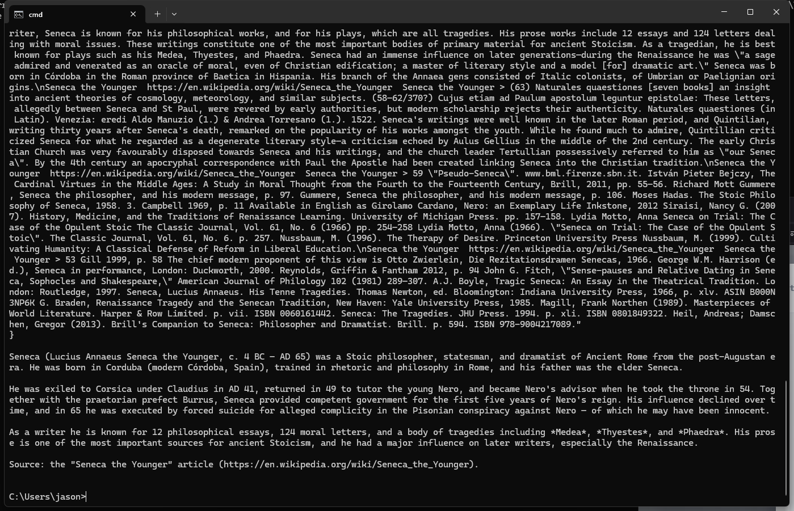
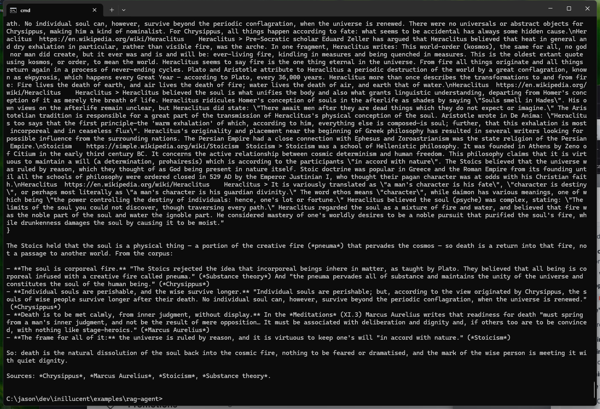

# A RAG example your agent can run

A database of Greek philosophy that is **already built and already embedded**. Install the embedding
model, point your coding agent at this directory, and ask it a question. There is no corpus to
download, nothing to index, and no code to write.

```
you:    who was Seneca?

agent:  $ inillucent --db greek-philosophy.rdb query \
          "SELECT p.title, p.url, p.body
           FROM passage p, (SELECT embed('search_query: ' || ?1) AS q) AS probe
           ORDER BY vector_distance_cos(p.v, probe.q) LIMIT 5" \
          --params '["who was Seneca"]'

        Seneca the Younger (c. 4 BC - AD 65) was a Stoic philosopher, statesman, and
        dramatist of Ancient Rome. Born in Corduba, he was trained in rhetoric and
        philosophy in Rome, exiled to Corsica in AD 41 under Claudius, returned in 49
        to tutor Nero, and became Nero's advisor when Nero took the throne in 54. His
        influence waned, and in 65 he was executed by forced suicide for alleged
        complicity in the Pisonian conspiracy against Nero.

        Source: Seneca the Younger (https://en.wikipedia.org/wiki/Seneca_the_Younger)
```

That is what a local Qwen answered the first time it was asked, through opencode, with nothing to go
on but `AGENTS.md` and the question — screenshots below. It is reproduced as it ran, which is why the
query has the question in a subquery: writing `embed` directly in the `ORDER BY` used to
call the model once per row and take 105 seconds instead of one and a half. Both shapes still
return the same five passages; the plain one is the one to write now.

## Setup

One command, and about 620 MB the first time.

```sh
inillucent setup-embeddings all
```

That fetches ONNX Runtime and the `nomic-embed-text-v1.5` weights into a per-user directory, checks
every byte against a digest pinned in the build, and leaves the engine able to answer `embed(TEXT)`.
Nothing has to be exported afterwards — the engine looks where the command put things. Check it:

```sh
inillucent query "SELECT length(embed('hello'))"
3072
```

If that says `no such function: embed`, the binary you have was built without the embedding feature,
which is what the published 0.1.1 archives are. The 0.1.2 archives carry it, because
`packaging/release-all.ps1` passes `--features inillucent-cli/embed`, so upgrading fixes it. Building
the command line from a checkout is the other way:
`cargo build --release -p inillucent-cli --features inillucent-cli/embed`.

Then start your agent with this directory as its working directory. `AGENTS.md` is here for it
(`CLAUDE.md` imports the same file), and it carries the two commands and the one rule that is easy to
get wrong.

## An agent actually doing it

Both of these are opencode driving a local Qwen through llama.cpp, in this directory, with no
instruction beyond the question. It read `AGENTS.md`, ran `inillucent`, and answered from what came
back.



Asked something the corpus only answers in pieces, it gathers the pieces and says where each came
from — Chrysippus on the soul as fire, Marcus Aurelius on meeting death, the Stoicism and Substance
theory articles for the frame:



## What is in the database

| | |
|---|---|
| articles | 80 Wikipedia pages on Greek and Roman philosophy |
| passages | 2,661, about 1,100 characters each |
| embeddings | `nomic-embed-text-v1.5`, 768 dimensions, full precision |
| indexes | an FTS5 table over the text. No vector index — see below |
| size | 21 MB, committed |

```sql
CREATE TABLE passage (
  id    INTEGER PRIMARY KEY,
  title TEXT NOT NULL,   -- the Wikipedia article
  url   TEXT NOT NULL,   -- where it came from
  body  TEXT NOT NULL,   -- "Plato > the passage"
  v     VECTOR(768)
);
CREATE VIRTUAL TABLE passage_fts USING fts5(id, title, body);
```

The articles are the ancient tradition end to end — Thales to Proclus, with the Stoics, Epicureans,
Cynics, Sceptics and Neoplatonists in between — and the concept pages the questions land on.
`corpus/ATTRIBUTION.md` lists every one of them with a link, and `scripts/select-corpus.py` says why
it is a list of titles rather than a rule.

## The two searches

### By meaning

```sh
inillucent --db greek-philosophy.rdb query \
  "SELECT title, url, body FROM passage
   ORDER BY vector_distance_cos(v, embed('search_query: ' || ?1)) LIMIT 5" \
  --params '["what did the Stoics believe about death"]'
```

Finds passages that are *about* the question. "you cannot step into the same river twice" returns
Heraclitus without the word Heraclitus appearing in the question.

**The `search_query: ` prefix is not decoration.** `nomic-embed-text-v1.5` is trained with
`search_query: ` on questions and `search_document: ` on stored text, and the passages here were
stored with the second one. Leaving the prefix off still returns rows. They are quietly worse, which
is the kind of mistake that never announces itself.

### There is no HNSW index on this table

That is the other thing [vector search](../../docs/vector-search.md) tells you to build, and it is
left off here on purpose: 2,661 passages is an exhaustive cosine over 8 MB of vectors, and that page
already says to build the index when the search is slow rather than before it is.

Building one works. It used to not work, and the way it failed is the reason
`scripts/verify-indexed.sh` exists: an index built over a table that already held rows reported those
rows in the session that built it and held none the next time the file was opened, and an empty
vector index answers zero rows rather than failing — so `CREATE INDEX` silently turned a working
search into one that returned nothing. `scripts/verify-indexed.sh` asks the ten questions below
through an index built over this same corpus, and requires the same articles.

### By word

```sh
inillucent --db greek-philosophy.rdb search 'Metrodorus' --table passage_fts --k 5
```

For an exact name or term. Semantic search is bad at rare tokens — a query for `Metrodorus` wants
that name, not passages about vaguely similar ones — so there is a BM25 index beside the vectors.

## What it cannot do, and why the distance will not tell you

A nearest-neighbour search always returns the number of rows you asked for, however far away they
are. Ask this corpus about Kant and five passages come back; they are the five least unrelated things
in a database with no Kant in it.

The obvious defence is the distance:

```sh
inillucent --db greek-philosophy.rdb query \
  "SELECT round(min(vector_distance_cos(v, embed('search_query: ' || ?1))), 4) AS nearest
   FROM passage" \
  --params '["who was Seneca"]'
```

Measured on this corpus, it catches half of what you would want it to:

| question | nearest |
|---|---:|
| the allegory of the cave | 0.153 |
| who was Seneca | 0.186 |
| man is the measure of all things | 0.203 |
| what did the Stoics believe about death | 0.239 |
| **what did Kant think about the categories of understanding** | **0.189** |
| the best recipe for sourdough bread | 0.441 |
| who won the 1994 World Cup | 0.500 |
| how do I configure a Kubernetes ingress controller | 0.533 |

A question from another subject stands out. **A philosophy question this corpus cannot answer does
not** — Kant scores as close as Seneca, because the corpus is philosophy and so is the question. So a
large distance is worth acting on and a small one proves nothing, and the only thing that catches the
Kant case is reading the passages. `AGENTS.md` says so to the agent, in those words.

This is the same argument `docs/vector-search.md` makes with a different mechanism: a score
normalised per result list maps the best hit of every list to 1.0, whether the list is good or
hopeless, which is why the retrieval engine computes a separate confidence on absolute bounds. A
plain `ORDER BY vector_distance_cos` has no such thing.

## Checking it still works

```sh
scripts/verify.sh
```

Ten questions, each with the article its answer has to come from, plus the keyword case and the
vector width. Run it after an engine change — it is what catches the failure where a rebuilt corpus
is paired with vectors made from the old one, which produces an index that looks entirely healthy
and is entirely wrong.

## Rebuilding it

Nobody needs to. The database is committed. This is here so it can be rebuilt after an engine change,
and so the commands that made it are readable:

```sh
scripts/build-database.sh
```

It chunks the committed corpus, loads it with `inillucent import`, embeds every passage in one
`INSERT ... SELECT`, and builds the full-text table — using nothing but this command line. **8 minutes
28 seconds** on the machine it was built on, of which about eight are the embedding.

`scripts/select-corpus.py` is the step above that: it picks the articles out of the Wikipedia
extracts `scripts/fetch-public-corpus.sh` produces at the top of this repository. Those extracts are
1.5 GB and are not committed, so that script is provenance rather than a step in the build.

## Licence

The passages are Wikipedia text under
[CC BY-SA 4.0](https://creativecommons.org/licenses/by-sa/4.0/), redistributed here under that
licence. `corpus/ATTRIBUTION.md` names every article and links to the page history its authors are
in. Everything else in this directory is under the repository's own licence.
