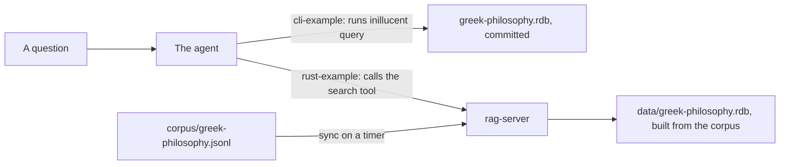

# A RAG agent over Greek philosophy, built two ways

Both examples in this folder let a coding agent answer questions about Greek and Roman philosophy
from 80 Wikipedia articles. RAG (retrieval augmented generation) means the agent searches the
articles first and writes its answer from the passages the search returned, citing each one.

The two examples search the same articles. They differ in how the agent reaches the database and in
who builds it.

| | [`cli-example/`](cli-example/README.md) | [`rust-example/`](rust-example/README.md) |
|---|---|---|
| how the agent searches | runs the `inillucent` command line, as `AGENTS.md` shows it | calls tools on an MCP server |
| the database | committed, already embedded | built by the server from the corpus on its first start |
| keeping it current | rebuild it with `scripts/build-database.sh` | the server syncs on a timer and embeds only what changed |
| chunks | about 1,100 characters, one sentence of overlap | about 1,000 characters, about 200 characters of overlap |
| searches | by meaning, and by keyword | by meaning and keyword fused with reciprocal rank fusion (the default), by meaning, by keyword, and the `inillucent_search` table's own combined ranking |
| telling the agent there is no answer | the cosine distance, which the agent adds to its query | the cosine distance on every hit, measured against 24 questions |
| code to write | none | a Rust program of about 2,700 lines, a third of them comments |
| first answer | a minute after installing the model | after a build of a few minutes and a first sync of about nine minutes |



## The corpus

[`corpus/greek-philosophy.jsonl`](corpus/greek-philosophy.jsonl) holds one article per line, with
its `title`, `url` and `text`. [`corpus/ATTRIBUTION.md`](corpus/ATTRIBUTION.md) lists every article
with its source and its licence, CC BY-SA 4.0.

## Before either example

```sh
npm install -g inillucent          # or brew, pip, cargo, or an install script
inillucent setup-embeddings all    # about 620 MB, once per machine
```

Each example's README has the full list of ways to install inillucent and the steps from there.
