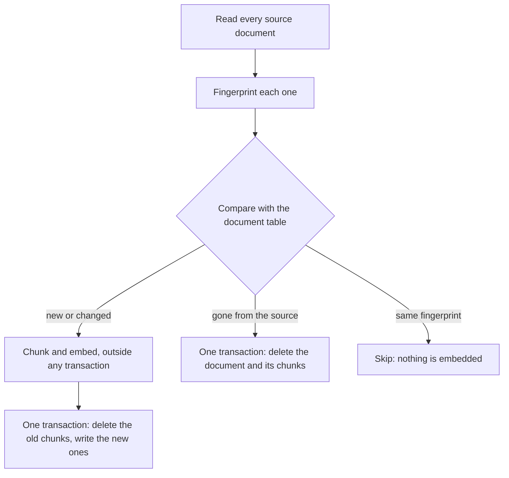

# An MCP server that searches Greek philosophy, in Rust

`rag-server` gives a coding agent five tools for answering questions about Greek and Roman
philosophy. It reads the 80 Wikipedia articles in [`../corpus/`](../corpus/ATTRIBUTION.md), cuts
them into overlapping chunks, embeds each chunk with the model inillucent runs in process, and
stores everything in one inillucent database. It keeps that database in step with the articles on a
timer, embedding only what changed. The agent reaches it over MCP (the Model Context Protocol).

The program uses the `inillucent` crate from crates.io, exactly as an application outside the
inillucent repository would. It is about 2,700 lines of Rust, and the comments explain each step.

[`../cli-example/`](../cli-example/README.md) answers the same questions with no code at all, from a
database that is already built. This example shows what it takes to build and maintain that database
yourself, and how to put a search behind MCP tools.

## Terms used on this page

| Term | Meaning |
|---|---|
| MCP | the Model Context Protocol. An agent's client starts a server program and calls its tools with JSON messages over the program's stdin and stdout |
| embedding | a list of 768 numbers that stands for the meaning of a text. Texts with similar meanings get similar lists |
| chunk | a piece of an article, about 1,000 characters, that gets one embedding and that a search returns |
| overlap | the text two neighbouring chunks share, so an answer that crosses a cut is whole in one of them |
| cosine distance | how far apart two embeddings point. 0 is the same direction |
| BM25 | the formula a keyword search uses to rank the chunks that contain the search words |
| RRF | reciprocal rank fusion. Two ranked lists are merged by adding `1 / (60 + rank)` for each list a chunk appears in |
| residency | when the embedding model is held in memory. [Embeddings](../../../docs/embeddings.md#when-the-model-is-in-memory) defines the profiles |

## 1. Install

You need three things: a Rust toolchain, the `inillucent` command line, and the embedding model.

```sh
# Rust, from https://rustup.rs, if you do not have it.

# The inillucent command line. Pick one.
npm install -g inillucent
brew install black-rainbow-labs/inillucent/inillucent
pip install inillucent
irm https://inillucent.com/downloads/install.ps1 | iex          # Windows
curl -fsSL https://inillucent.com/downloads/install.sh | sh     # macOS and Linux

# The embedding model: about 620 MB, once per machine.
inillucent setup-embeddings all
```

The server does not run the `inillucent` command line. It needs the command line only for
`setup-embeddings`, which puts the model and ONNX Runtime in a folder in your user profile. The
server's own copy of inillucent comes from crates.io and finds the model in that folder.

## 2. Build and fill the database

```sh
cd examples/rag-agent/rust-example
cargo build --release
cargo run --release -- sync
```

The first build compiles inillucent from crates.io and takes a few minutes. `sync` reads
`../corpus/greek-philosophy.jsonl`, writes `data/greek-philosophy.rdb`, and prints what it did:

```json
{
  "started_at": "2026-09-25T14:25:17Z",
  "finished_at": "2026-09-25T14:34:01Z",
  "source": "../corpus/greek-philosophy.jsonl",
  "documents_in_source": 80,
  "added": [
    "Alcidamas",
    "Alexander of Aphrodisias",
    "Allegory of the cave",
    "... and 77 more"
  ],
  "updated": [],
  "removed": [],
  "unchanged": 0,
  "chunks_written": 3696,
  "chunks_before": 0,
  "chunks_after": 3696,
  "embed_seconds": 521.08,
  "total_seconds": 524.426,
  "errors": []
}
```

You can skip this step. `serve` runs the same sync when it starts, in the background, and answers
searches from whatever is indexed so far. Running `sync` first means the agent's first question sees
every article.

## 3. Connect your agent

`.mcp.json` registers the server with Claude Code, and `opencode.json` with opencode. Both run the
same command:

```json
{
  "mcpServers": {
    "philosophy": {
      "command": "cargo",
      "args": ["run", "--release", "--quiet", "--", "serve", "--residency", "idle:10m"]
    }
  }
}
```

Start the agent in this folder and ask it a question:

```sh
claude            # Claude Code asks once whether to trust the project's MCP server
```

```
you:    what did Epictetus teach about the things we cannot control?
```

The agent calls `search`, reads the passages, and answers with the article titles and URLs.
[`AGENTS.md`](AGENTS.md) tells it which tool to use when and how to cite, and `CLAUDE.md` points
Claude Code at `AGENTS.md`. Any MCP client works. Give it the built program
`target/release/rag-server` with the argument `serve`, and this folder as the working directory.

| `serve` option | What it does | Default |
|---|---|---|
| `--db` | the database file | `data/greek-philosophy.rdb` |
| `--corpus` | a JSONL file, or a folder of `.md` and `.txt` files | `../corpus/greek-philosophy.jsonl` |
| `--sync-every` | how often to sync: `90s`, `15m`, `2h`, or `off` | `15m` |
| `--mode` | the search mode when the agent names none | `rrf` |
| `--residency` | when the model is in memory: `resident`, `on-demand`, `idle`, `idle:<time>` | `idle:300s`, from `inillucent setup-embeddings` |
| `--warm` | run one search at start, so the first question waits for neither the model nor the file | off |
| `--context` | what goes in front of each chunk before it is embedded: `title` or `lead` | `title` |
| `--chunk-chars`, `--overlap-chars` | the chunk length and the overlap, in bytes | 1000, 200 |

`rag-server search "who was Seneca" --mode keyword` runs one search from the shell, and
`rag-server evaluate` runs the evaluation in [Four search modes, measured](#four-search-modes-measured).

### The agent at work

These three runs are Claude Code (Sonnet), started in this folder with `.mcp.json` on 25 September
2026, over the full corpus. The agent had the question, `AGENTS.md` and the tool descriptions, and
nothing else.

| Question | The tool calls the agent made | What it answered |
|---|---|---|
| what did Epictetus teach about the things we cannot control? | `search` with `{"query": "Epictetus things we cannot control dichotomy of control", "k": 6}` | that external events are outside our control and our judgments and responses are within it, citing the Epictetus article |
| who was Metrodorus, and which school did he belong to? | `search` with `{"query": "Metrodorus", "mode": "keyword", "k": 5}` | one of Epicurus's closest disciples and a leader of the Garden, citing the Epicurus and Epicureanism articles. The agent chose keyword mode for the rare name on its own, as `AGENTS.md` suggests |
| what did Kant think about the categories of understanding? | `search` with `{"query": "Kant categories of understanding", "k": 5}` | Kant's twelve categories in four classes, citing the Metaphysics and Epistemology articles, with a note that Kant is outside the corpus's subject and these two articles happen to cover him |

## What the agent sends and receives

MCP messages are JSON-RPC 2.0, one message per line. These are real exchanges with the server over
the full corpus, shortened where a passage runs long.

### The handshake

The client starts the server and sends `initialize`. The server answers with the protocol version,
what it offers, and instructions the client may show the model:

```json
{"jsonrpc":"2.0","id":1,"method":"initialize","params":{"protocolVersion":"2025-06-18","capabilities":{},"clientInfo":{"name":"claude-code","version":"2.0.0"}}}

{
  "jsonrpc": "2.0",
  "id": 1,
  "result": {
    "protocolVersion": "2025-06-18",
    "capabilities": { "tools": { "listChanged": false } },
    "serverInfo": { "name": "rag-server", "title": "Greek philosophy search", "version": "0.1.0" },
    "instructions": "Searches 80 Wikipedia articles on Greek and Roman philosophy. Call `search` before answering a question about the subject, answer only from the passages it returns, and cite each article's title and URL. Use `get_passage` when a passage is cut off. If the passages do not answer the question, say that the articles do not cover it."
  }
}
```

The client then sends `{"jsonrpc":"2.0","method":"notifications/initialized"}`, which gets no
answer, and `tools/list`, which returns the five tools with a JSON schema for each tool's arguments.

| Tool | Arguments | What it returns |
|---|---|---|
| `search` | `query`, and optionally `mode`, `k` (1 to 20, default 5) and `title` | the best chunks, each with its title, URL, text and scores, and the state of the index |
| `get_passage` | `chunk_id`, and optionally `neighbors` (0 to 3, default 1) | a chunk with its neighbours, as one piece of the article |
| `list_documents` | optionally `filter` | the articles, with their URLs and chunk counts |
| `sync_status` | none | the running sync's progress, the last sync's report, and when the next one is due |
| `sync_now` | none | starts a sync at once and returns without waiting for it |

### A search

```json
{
  "jsonrpc": "2.0",
  "id": 6,
  "method": "tools/call",
  "params": {
    "name": "search",
    "arguments": { "query": "what did Epictetus teach about the things we cannot control", "k": 3 }
  }
}
```

```json
{
  "query": "what did Epictetus teach about the things we cannot control",
  "mode": "rrf",
  "keywords": "\"epictetus\" OR \"teach\" OR \"things\" OR \"cannot\" OR \"control\"",
  "embed_ms": 13.5,
  "elapsed_ms": 35.1,
  "hits": [
    {
      "rank": 1,
      "chunk_id": 1000,
      "title": "Epictetus",
      "url": "https://en.wikipedia.org/wiki/Epictetus",
      "text": "He taught that philosophy is a way of life and not simply a theoretical discipline. To Epictetus, all external events are beyond our control; he argues that we should accept whatever happens calmly and dispassionately. However, he held that individuals are responsible for their own actions, ...",
      "distance": 0.1642,
      "rrf_score": 0.032787,
      "vector_rank": 1,
      "keyword_rank": 1
    },
    {
      "rank": 2,
      "chunk_id": 999,
      "title": "Epictetus",
      "url": "https://en.wikipedia.org/wiki/Epictetus",
      "text": "Epictetus (/ˌɛpɪkˈtiːtəs/, EH-pick-TEE-təss; Ancient Greek: Ἐπίκτητος, Epíktētos; c. 50 – c. 135 AD) was a Greek Stoic philosopher. He was born into slavery at Hierapolis, Phrygia ...",
      "distance": 0.1747,
      "rrf_score": 0.032258,
      "vector_rank": 2,
      "keyword_rank": 2
    },
    {
      "rank": 3,
      "chunk_id": 1002,
      "title": "Epictetus",
      "url": "https://en.wikipedia.org/wiki/Epictetus",
      "text": "Epictetus's social position was thus complicated, combining the low status of a slave with the high status of one with a personal connection to imperial power. ...",
      "distance": 0.2088,
      "rrf_score": 0.015873,
      "vector_rank": 3
    }
  ],
  "index": {
    "documents": 80,
    "chunks": 3696,
    "sync": { "running": false, "started_at": null, "documents_to_write": 0, "documents_written": 0, "current_document": null, "chunks_embedded": 0 }
  }
}
```

Every result is sent twice, as `structuredContent` for a client that reads JSON fields and as the
same JSON written out in `content` for a client that reads text. The response above shows
`structuredContent` only.

Each hit has a `chunk_id` for `get_passage` and a `distance`: the cosine distance between the
question and the chunk. In `rrf` mode, `vector_rank` and `keyword_rank` say where each of the two
lists placed the chunk. A missing rank means that list did not have it in its top 3 × `k`. In
`hybrid` mode a hit has `score`, `confidence` and `origin` in place of the ranks, which
[Vector column or inillucent_search table](#vector-column-or-inillucent_search-table) explains.
`index` tells the agent how much is indexed and whether a sync is still running.

### A passage with its neighbours

A hit is one chunk. When the answer runs past the end of it, the agent asks for the chunks on either
side:

```json
{ "jsonrpc": "2.0", "id": 7, "method": "tools/call", "params": { "name": "get_passage", "arguments": { "chunk_id": 1000, "neighbors": 1 } } }
```

```json
{
  "title": "Epictetus",
  "url": "https://en.wikipedia.org/wiki/Epictetus",
  "chunk_ids": [999, 1000, 1001],
  "text": "Epictetus (/ˌɛpɪkˈtiːtəs/, EH-pick-TEE-təss; Ancient Greek: Ἐπίκτητος, Epíktētos; c. 50 – c. 135 AD) was a Greek Stoic philosopher. He was born into slavery ... Early in life, Epictetus acquired a passion for philosophy and, with the permission of his wealthy master, he studied Stoic philosophy under Musonius Rufus."
}
```

The neighbouring chunks overlap. `get_passage` cuts one span out of the stored article, from the
first chunk's start to the last chunk's end, so the shared sentences appear once.

### A mistake

A tool that fails returns `isError: true` and a message the agent can act on:

```json
{"jsonrpc":"2.0","id":8,"method":"tools/call","params":{"name":"search","arguments":{"query":"Epictetus","mode":"semantic"}}}

{
  "jsonrpc": "2.0",
  "id": 8,
  "result": {
    "content": [{ "type": "text", "text": "bad arguments: unknown variant `semantic`, expected one of `hybrid`, `vector`, `keyword`, `rrf`" }],
    "isError": true
  }
}
```

A call to a tool that does not exist is a JSON-RPC error, code `-32602`, as the specification says.

## How an article becomes chunks


`src/chunker.rs` does this in five steps:

1. **Split into sentences.** A sentence ends at `.`, `?` or `!` followed by a space and a capital, a
   digit or an opening quote. `c. 4 BC`, `St. Paul` and initials such as `A. N.` do not end one. A
   chunk that stops half way through a sentence gets an embedding for half an idea.
2. **Pack whole sentences** until the next one would pass 1,000 characters, which is about 250
   tokens. A sentence longer than 2,000 characters is cut at a space.
3. **Overlap.** The next chunk starts with the last sentences of this one, adding sentences until
   the repeated text is at least 200 characters, and never more than half a chunk. An answer that
   crosses a cut is then whole in one of the two chunks. `--overlap-chars 0` turns overlap off.
4. **Fold a short tail.** A last chunk that adds fewer than 250 new characters joins the chunk
   before it.
5. **Put the title in front** before embedding: `search_document: Seneca the Younger` and a blank
   line, then the chunk. A chunk in the middle of an article often says only "he" and "his letters",
   and the title tells the embedding whose letters they are. `--context lead` also adds the article's
   first sentence.

Every chunk records where it starts and ends in the article, which is how `get_passage` returns
neighbours without repeating the overlap. The 80 articles become 3,696 chunks, against 2,661
passages in the command line example, which uses one sentence of overlap.

## Keeping the index in step with the source

A RAG index goes stale when the documents behind it change. `serve` syncs when it starts and then
every `--sync-every`, and the agent can start one with `sync_now`.



- **Only changed documents are embedded.** Each document's fingerprint is a SHA-256 of its title,
  URL and text. Embedding is the slow part, about 141 ms per chunk on the processor, so
  a sync of the unchanged corpus takes 0.01 seconds and a full one takes 8 minutes 44 seconds.
- **The settings are in the fingerprint too.** It includes the chunk length, the overlap, the
  context mode and the model name. Change any of them and the next sync embeds every document again.
  Without that, the database would keep vectors made from the old chunks next to text cut by the new
  settings, and every search would still return rows.
- **One transaction per document.** A document's old chunks and new chunks are swapped in one
  transaction, so a search sees one version or the other and never a mixture. A sync that stops half
  way leaves each document in its old state or its new one, and the next sync finishes the rest.
- **Searches keep running during a sync.** The chunks are embedded before the transaction opens.
  The database runs one statement at a time, and a search waits only for the statement in front of
  it, never for a whole document's embeddings.
- **The source can be a folder.** `--corpus` takes a folder of `.md` and `.txt` files as well as a
  JSONL file. A Markdown file's title is its first `# ` heading, and its URL is its path.

Change an article, delete one and add one, and the next sync reports:

```json
{
  "started_at": "2026-09-25T14:53:52Z",
  "finished_at": "2026-09-25T14:53:54Z",
  "source": "five.jsonl",
  "documents_in_source": 5,
  "added": [
    "Xenophanes"
  ],
  "updated": [
    "Diogenes of Sinope"
  ],
  "removed": [
    "Zeno of Elea"
  ],
  "unchanged": 3,
  "chunks_written": 6,
  "chunks_before": 50,
  "chunks_after": 50,
  "embed_seconds": 1.425,
  "total_seconds": 1.437,
  "errors": []
}
```

`tests/e2e.rs` makes exactly these three changes to a running server and checks this report.

## Vector column or `inillucent_search` table

inillucent can search embeddings two ways, and this example stores every chunk's embedding in both
so they can be compared on the same data.

```sql
-- A plain column, searched with ordinary SQL.
CREATE TABLE chunk (id INTEGER PRIMARY KEY, document_id INTEGER, text TEXT, v VECTOR(768), ...);

SELECT id, vector_distance_cos(v, ?1) AS distance FROM chunk ORDER BY distance LIMIT 5;

-- A search table that holds the text and the vector, and ranks by both.
CREATE VIRTUAL TABLE chunk_search USING inillucent_search(title, text, document FACET, dims = 768);

SELECT rowid, score(chunk_search), confidence(chunk_search), origin(chunk_search)
FROM chunk_search
WHERE chunk_search MATCH ?1 AND vector = ?2 AND k = 5
ORDER BY rank;
```

| | `VECTOR(768)` column | `inillucent_search` table |
|---|---|---|
| what it is | an ordinary column in an ordinary table | a virtual table that keeps its own index of the text and the vectors |
| keyword search | a second table, such as FTS5, and a fusion you write yourself | built in: the same query takes `MATCH` |
| what a hit carries | the cosine distance | `score`, a `confidence` from 0 to 1, and `origin` |
| saying "no answer" | the distance catches questions on other subjects | `confidence` is low for those, and also for an answerable question worded differently from the article |
| filters | any `WHERE` clause or join | `FACET` columns, applied inside the search |
| an index | none, which compares every row, or `CREATE INDEX ... USING inillucent_hnsw (v)` | exact by default, `mode = 'approximate'` for a graph |
| moving to another database | the same query works on pgvector with its `<=>` operator | inillucent only |

**Use the column** when you already have a table and want to add a search by meaning to it, when
your filters are joins and ordinary `WHERE` clauses, or when the same SQL has to run on PostgreSQL
with pgvector. **Use the `inillucent_search` table** when you want keyword and meaning search from
one table and one query, with no fusion code of your own, and when your questions use the same
words as your documents. An application would normally store its vectors once. This example stores
them twice, which costs about 11 MB here, so the two can be compared. The default mode, `rrf`,
reads its meaning list from the column and its keyword list from the search table.

### Telling the agent there is no answer

A nearest neighbor search always returns `k` rows. The question is how the agent knows they are no
good. These are the best hits for seven questions the corpus answers and four that no article is
about, over the full corpus:

| question | the corpus answers it | best distance, `vector` | best confidence, `hybrid` |
|---|---|---:|---:|
| who was Seneca | yes | 0.201 | 0.863 |
| the allegory of the cave | yes | 0.163 | 0.838 |
| man is the measure of all things | yes | 0.214 | 0.728 |
| what did the Stoics believe about death | yes | 0.250 | 0.261 |
| the woman mathematician murdered in Alexandria | yes | 0.292 | 0.023 |
| a former slave who taught that some things are within our control | yes | 0.278 | 0.007 |
| asking questions to expose contradictions in a belief | yes | 0.216 | 0.009 |
| **what did Kant think about the categories of understanding** | **only in passing** | **0.201** | **0.230** |
| the best recipe for sourdough bread | no | 0.417 | 0.060 |
| who won the 1994 World Cup | no | 0.485 | 0.009 |
| how do I configure a Kubernetes ingress controller | no | 0.530 | 0.054 |

**The distance is the better signal on this corpus.** All 20 answerable questions in the evaluation
had a best distance of 0.341 or less, and the three questions on other subjects scored 0.417 to
0.530. That is why every hit carries its `distance` in every mode but `keyword`, and why
`AGENTS.md` tells the agent that a best distance above about 0.4 means the articles are about
something else.

**`confidence` measures something else.** It is high when the question's words and its meaning both
match a chunk. A question phrased in words the article does not use scores low even when the answer
is there: for "a former slave who taught that some things are within our control", `hybrid` ranks
Epictetus third, and its best hit has a confidence of 0.007. 9 of the 20 answerable questions scored at or below the Kant question's 0.230.
On a corpus where questions use the documents' own words, such as code or product documentation,
`confidence` separates better. [Vector search](../../../docs/vector-search.md#confidence-is-a-separate-number-from-score)
describes how it is computed.

**Neither number can decide the Kant question, and neither should.** No article is about Kant, and
the evaluation counts the question as one the corpus cannot answer. The Metaphysics and Epistemology
articles each have a passage on his categories, though, so the question scores like one the corpus
answers. Only reading the passages decides it. `AGENTS.md` tells the agent to read them, and in
[the run above](#the-agent-at-work) the agent answered from those two passages and said that Kant is
outside the corpus's subject.

### Two statements to write another way on inillucent 1.0.29

| Statement | Result on 1.0.29 | What this example does |
|---|---|---|
| `INSERT INTO chunk_search (...) SELECT ..., embed(...) FROM ...` | status `unsupported`: an `INSERT ... SELECT` into a virtual table | runs `SELECT embed(?1)` once, keeps the vector's bytes, and binds them to both inserts |
| `... WHERE vector = embed('search_query: ' \|\| ?1)` on the search table | status `unsupported`: a registered function in that position | embeds the question with `SELECT embed(?1)` and binds the bytes |

Embedding in a statement of its own also means each chunk is embedded once however many tables it
goes into, and it keeps the slow part out of the write transaction.

Both statements run on the engine after 1.0.29. The release after 1.0.29 also gives the
`inillucent` crate an `embed` feature, so `Cargo.toml` can name `inillucent` alone with
`features = ["embed"]` in place of the second `inillucent-engine` line. This example stays on
1.0.29 until that release is published.

## Four search modes, measured

`search` takes a `mode`:

| Mode | How it ranks |
|---|---|
| `hybrid` | the `inillucent_search` table, with the question's words and its embedding in one query. The engine combines the two rankings |
| `vector` | cosine distance over the `VECTOR(768)` column |
| `keyword` | the `inillucent_search` table with the words only: BM25, adjusted for how close together the words are |
| `rrf` | the `vector` list and the `keyword` list, each three times `k` long, fused in `src/search.rs` with reciprocal rank fusion |

The question's words go to the keyword search as `"word" OR "word"`, with common words such as
"the" and "what" left out. Each word is quoted because the keyword query language reads `-`, `"`
and `*` as operators, so "what is Plato's cave?" passed as it is would be a syntax error.

`rag-server evaluate` asks the 24 questions in [`questions.json`](questions.json) in every mode. 20
of them name the article whose chunks must appear in the top five, and 4 are questions the corpus
cannot answer. Measured on 25 September 2026, over the full corpus on the processor:

With the title in front of each chunk, which is the default:

| mode | found in the top five | mean reciprocal rank | median time per search |
|---|---:|---:|---:|
| `rrf` | 19 of 20 | **0.821** | 49.0 ms |
| `hybrid` | 19 of 20 | 0.681 | 22.0 ms |
| `vector` | 18 of 20 | 0.798 | 42.0 ms |
| `keyword` | 18 of 20 | 0.617 | 0.8 ms |

With `--context lead`, which also puts the article's first sentence in front of each chunk:

| mode | found in the top five | mean reciprocal rank | median time per search |
|---|---:|---:|---:|
| `rrf` | 19 of 20 | 0.696 | 49.8 ms |
| `hybrid` | 18 of 20 | 0.620 | 26.0 ms |
| `vector` | 15 of 20 | 0.643 | 50.2 ms |
| `keyword` | 18 of 20 | 0.617 | 1.1 ms |

The mean reciprocal rank is 1 when the right article is always first and 0.5 when it is always
second. The time includes embedding the question, about 11 ms, with the model already loaded. The
title evaluation was run twice with the same results.

What the numbers say:

- **Fusing the two lists beats either list alone.** `rrf` found 19 articles and ranked them highest.
  `vector` alone missed "asking questions to expose contradictions in a belief" (Socratic method),
  which the keyword list found. `keyword` alone missed "a former slave who taught that some things
  are within our control" (Epictetus), which the vector list found. `rrf` found both.
- **`hybrid` finds as many and ranks them lower.** The `inillucent_search` table weights the keyword
  side by default, so a chunk that repeats the question's words outranks the article the question is
  about. For "the school that met at the Lyceum", the Ancient Greek philosophy article comes first
  and Aristotle third.
- **Adding the first sentence to every chunk made the search by meaning worse**, 15 found against 18.
  Every chunk of an article then carries the same sentence, which pulls the chunks of one article
  toward each other and away from what each chunk is about. The title alone is the default.
- **`keyword` is fast**, under a millisecond, because it embeds nothing. The other modes spend about
  11 ms embedding the question and about 30 ms comparing it with 3,696 vectors and reading the hits.
- **One question fails in every mode.** "paradoxes of motion such as Achilles and the tortoise"
  returns the articles `Pre-Socratic philosophy` and `Eubulides`, which discuss the same paradoxes, and
  never the short Zeno of Elea article.

`rrf` is the default because it found the most articles and ranked them highest.

## Loading the embedding model on demand

Every search embeds the question, so the model has to be in memory when a search runs. Loading it
takes most of a second, and holding it costs memory. The residency profile decides which cost the
server pays. These numbers were measured with this server over MCP on 25 September 2026, over the full corpus, on the processor:

| Profile | first search | later searches | server memory before the first search | with the model loaded |
|---|---:|---:|---:|---:|
| `on-demand` | 1,872 ms | 770 to 787 ms | 49 MB | 116 MB: the model is dropped after each search |
| `idle:5m` | 1,754 ms | 35 to 39 ms | 49 MB | 1,123 MB |
| `resident` | 1,730 ms | 29 to 42 ms | 49 MB | 1,122 MB |
| `idle:5m` with `--warm` | 29 to 32 ms | 30 to 42 ms | 1,121 MB | 1,125 MB |

A sync pays the same cost for every chunk it embeds. On the five article test corpus, 50 chunks:

| Profile | time to embed 50 chunks | per chunk |
|---|---:|---:|
| `resident` | 7.2 s | 143 ms |
| `on-demand` | 43.6 s | 872 ms, 510% slower |

At that rate a full sync of 3,696 chunks under `on-demand` would take about 54 minutes, against 8
minutes 44 seconds with the model held.

What the numbers say:

- **Loading the model costs about 750 ms**, and `on-demand` pays it on every search. The embedding
  itself takes about 11 ms.
- **A loaded model costs about 1 GB of memory** in this process: 49 MB before, 1,123 MB after.
- **The first search in a process pays a second cost of about 950 ms**, reading the stored vectors and
  the keyword index from the file for the first time. Loading the model early saves only the first
  cost. `--warm` runs one search in every mode at start and pays both before the agent asks
  anything, so the first question takes about 30 ms. The server then answers `initialize` about two
  seconds later than it would without `--warm`.
- **A sync under `on-demand` loads the model for every chunk**, which is why the table below says
  never to combine them.

| Profile | Use it when |
|---|---|
| `idle:<time>` | an agent asks a few questions in a burst, then nothing for a while. The default, and what `.mcp.json` sets, with ten minutes |
| `resident` | the server answers questions all day, or a sync runs often. Memory is held for the life of the process |
| `on-demand` | memory matters more than a second per question, for example several servers on one small machine. Never for a sync: every chunk pays the load |

`--warm` runs one search when the server starts, so the first question waits for neither the model
nor the file. The profile then decides whether the model stays.

## What current RAG practice says, and what this example does with it

| Practice | Source | Here |
|---|---|---|
| Search by keyword and by meaning, and fuse the results. Embeddings plus BM25 cut the share of questions whose answer was missing from the top 20 from 5.7% to 2.9% | Anthropic, [Introducing Contextual Retrieval](https://www.anthropic.com/news/contextual-retrieval), 2024 | `hybrid` and `rrf` |
| Reciprocal rank fusion with a constant of 60 merges lists whose scores cannot be compared | Cormack, Clarke and Buettcher, SIGIR 2009; G. Laforge, [Understanding Reciprocal Rank Fusion in Hybrid Search](https://glaforge.dev/posts/2026/02/10/advanced-rag-understanding-reciprocal-rank-fusion-in-hybrid-search/), 2026 | `rrf`, constant 60 |
| Give each chunk the context of its document before embedding it. On its own this cut missing answers by 35% | Anthropic, Introducing Contextual Retrieval | the title in front of every chunk, and `--context lead` |
| Chunks of a few hundred tokens, split on sentence boundaries | [RAG Chunking Strategies: A 2026 Retrieval Playbook](https://www.digitalapplied.com/blog/rag-chunking-strategies-2026-retrieval-quality-playbook) | about 250 tokens of whole sentences |
| Overlap of 10% to 20% is the usual default. A January 2026 study measured no benefit from it, so measure it on your own data | the same playbook | about 20%, and `--overlap-chars 0` to compare |
| Return the chunks around a hit, so the model sees more than the matched piece | the "small to big" pattern in the same playbook | `get_passage` |
| Rerank the top 20 to 50 hits with a cross encoder. With contextual chunks and hybrid search, this cut missing answers by 67% | Anthropic, Introducing Contextual Retrieval | not built: see below |
| Rebuild the index when the chunker or the model changes | common practice | the settings are in every fingerprint |

## What this example does not do

- **Rerank.** A cross encoder reads the question and each hit together and scores them again. It is
  the largest single gain in the table above. inillucent ships one embedding model and no reranker.
  One would go in `src/search.rs`, after the search and before the hits are returned.
- **Build an HNSW index.** 3,696 chunks take a few milliseconds to compare exhaustively.
  [Vector search](../../../docs/vector-search.md) says when an index is worth building, and
  `CREATE INDEX chunk_v ON chunk USING inillucent_hnsw (v)` builds one. Nothing else in this
  example changes, because the planner uses the index for the same `ORDER BY` query.
- **Write each chunk's context with a language model.** Anthropic's method asks a model to write 50
  to 100 tokens about where each chunk sits in its document. The title and the first sentence cost
  nothing to compute and need no model.

## Tests

```sh
cargo test --release                 # unit tests and the end to end tests
cargo test --release -- --ignored    # also the evaluation over the whole corpus
```

`tests/e2e.rs` starts the built server as a child process and speaks MCP to it over its stdin and
stdout, as an agent's client does. It uses the real database file and the real embedding model, with
five short articles from the corpus so a run takes about 12 seconds.

| Test | What it checks |
|---|---|
| `the_server_speaks_mcp_and_reports_errors` | the handshake, the tool list, an unknown tool, an unknown method, a line that is not JSON, an empty query, an unknown mode, a `k` out of range, an unknown argument, a missing chunk, and that a notification gets no reply |
| `the_server_searches_the_corpus_and_keeps_it_in_sync` | the first sync fills both tables with 768 number vectors; every mode finds Protagoras for "man is the measure of all things"; `keyword` finds the rare name Metrodorus; `title` limits a search; punctuation does not break a keyword search; neighbouring chunks overlap and `get_passage` does not repeat the overlap; the best `distance` is above 0.4 for an unrelated question and below 0.3 for a covered one; and a timed sync after an edit, a deletion and an addition embeds only the two changed articles and skips the other three |
| `the_whole_corpus_answers_the_evaluation_questions` | runs `sync` over the whole corpus and `evaluate`, and requires `rrf` to find at least 18 of the 20 articles and every other mode at least 16. Marked `#[ignore]` because it takes several minutes |

The unit tests in `src/chunker.rs`, `src/search.rs`, `src/config.rs` and `src/clock.rs` check the
sentence splitter, the chunk lengths and overlap, the keyword expression, and the fusion.

## Where the code is

| File | What it does |
|---|---|
| `src/main.rs` | the command line: `serve`, `sync`, `search`, `evaluate` |
| `src/mcp.rs` | JSON-RPC over stdin and stdout, and the MCP handshake |
| `src/tools.rs` | the five tools: their descriptions, schemas and handlers |
| `src/search.rs` | the four search modes and reciprocal rank fusion |
| `src/store.rs` | the schema and every SQL statement |
| `src/sync.rs` | compares the source with the database and writes the difference |
| `src/scheduler.rs` | the sync thread: at start, on the timer, and on `sync_now` |
| `src/chunker.rs` | sentences, packing, overlap, and the text that is embedded |
| `src/corpus.rs` | reads a JSONL file or a folder of documents |
| `src/config.rs` | the settings, and the text they add to every fingerprint |
| `src/evaluate.rs` | the evaluation behind [Four search modes, measured](#four-search-modes-measured) |

## Licence

The articles are Wikipedia text under
[CC BY-SA 4.0](https://creativecommons.org/licenses/by-sa/4.0/). `../corpus/ATTRIBUTION.md` names
every article and links to its authors. The code in this folder is under the MIT licence, like the
rest of the repository.
