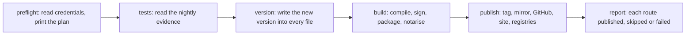

# Packaging and releasing

This directory turns a build of inillucent into files people can install, and publishes those
files. One script, `packaging/ship.ps1`, runs a whole release: it builds every target, signs the
results, publishes them to every destination, and then asks each destination what it serves.

This page is for the person or agent cutting a release. [`PUBLISHING.md`](PUBLISHING.md) has the
detail for each destination. [`macos/README.md`](macos/README.md) covers the macOS signing setup, and
[`windows/README.md`](windows/README.md) covers the Windows installer.

## Terms used on this page

| Term | Meaning |
|---|---|
| route | One destination a release publishes to, such as npm or inillucent.com. `ship.ps1` runs fourteen of them in a fixed order. |
| preflight | The first phase. It reads every credential and prints which routes will run. It changes nothing. |
| DPAPI | The Windows data protection API. It encrypts a file so that only the same Windows account on the same machine can decrypt it. Every release credential is stored this way. |
| RAM disk | A drive held in memory, `R:\` on the release machine. A credential is decrypted onto it for the length of a run and deleted afterwards. |
| notarise | Send a macOS build to Apple. Apple checks the signatures and records that it accepted those exact bytes. |
| Mach-O | The executable file format macOS uses. |
| minisign | A small signing tool. It signs `SHA256SUMS`, and the signature is published as `SHA256SUMS.minisig`. |
| OpenPGP | The signing standard `apt` and `dnf` check on a `.deb` or `.rpm`. |
| mirror | The public GitHub repository `Black-Rainbow-Labs/Inillucent`. It holds one commit per release. Development happens in a separate repository. |
| tap | A GitHub repository Homebrew reads formulas from. This project's tap is `Black-Rainbow-Labs/homebrew-inillucent`. |

## Cut a release

```powershell
pwsh packaging/ship.ps1 -WhatIf              # print the plan and write nothing
pwsh packaging/ship.ps1 -Part patch          # bump 1.0.29 to 1.0.30 and release it
pwsh packaging/ship.ps1 -Only site,github    # run two routes again, for the current version
```

Run `ship.ps1` from a `git worktree` of `main`. `ship.ps1` refuses a checkout with uncommitted
changes, and so does `cargo publish`. The checkout you work in usually has something in progress.

```powershell
git worktree add -b release-1.0.30 ../inillucent-release main
pwsh -WorkingDirectory ../inillucent-release -File ../inillucent-release/packaging/ship.ps1 -Part patch
```

Start `ship.ps1` with the release worktree as the working directory. Cargo reads
`.cargo/config.toml` from the working directory, and that file sets the build directory. A release
started from another worktree builds into that worktree's build directory.

`ship.ps1` finds the site checkout, the Homebrew tap and the cross compiling toolchain through the
repository the worktree belongs to. A worktree on another drive needs no extra arguments.

### Parameters

| Parameter | What it does |
|---|---|
| `-WhatIf` | Runs preflight, says what the tests phase would do with the nightly evidence, lists every file the version phase would change, and stops. Nothing is written. |
| `-Part patch`, `-Part minor`, `-Part major` | Raises the workspace version by one step before the release. |
| `-Version <x.y.z>` | Releases exactly this version. The default is the version in `Cargo.toml`. A version lower than the current one is refused. |
| `-Only <routes>` | Runs only the named routes. The tests and the version phase still run. |
| `-Skip <routes>` | Runs every route except the named ones. |
| `-SkipTests` | Skips the test phase. `ship.ps1` prints that the release is untested and writes the same sentence into the GitHub release notes. |
| `-AllowDirty` | Builds from a checkout with uncommitted changes. |
| `-Otp <six digits>` | A one time code for npm, for an npm token that cannot publish without one. |
| `-SitePath <path>` | The site folder. The default is `black-rainbow-labs-sites/sites/inillucent` beside the main checkout. The site moved there from this repository on 25 September 2026. |
| `-TapPath <path>` | The Homebrew tap checkout. The default is a folder named `homebrew-inillucent` beside the main checkout. |

## The six phases



| Phase | What happens | Why it is in this place |
|---|---|---|
| preflight | Decrypts the credentials, checks each route's needs, and prints `[run ]` or `[skip]` for every route with the reason. For npm and GitHub it prints the account it will publish as. | A tag cannot be taken back quietly, so the plan is known before anything is written. |
| tests | Reads `_agent_output/nightly/latest.json` in the main checkout. Green for this commit: no suite runs, and the notes name the nightly run. Green for an older commit: runs `inillucent-testrun --changed <that commit> --cadence merge --strict`. Red or missing: refuses. Exit code 1 or 2 from that run stops the release. | A red suite stops the release before the version phase has changed any file. |
| version | Writes the new version into every file that carries it and refreshes `Cargo.lock`. Warns about any other tracked file that still names the old version. | Every later route reads the version this phase writes. |
| build | The `build`, `linux-packages` and `signature` routes. Nothing has left the machine yet. | A build failure leaves nothing published. |
| publish | The routes from `tag` to `homebrew`, in the order in the table below. After each route, `ship.ps1` asks the destination whether the release arrived. | Some destinations read what an earlier route wrote. |
| report | Prints one line per route: `published`, `skipped` or `failed`, with the reason. | A route counts as published only when its check of the destination passes. `ship.ps1` exits 1 when any route failed. |

A route with no credential is skipped. The skip carries the sentence that fixes it. `ship.ps1`
still runs every route that can run. To repeat only the routes that failed, pass them to `-Only`.

## The routes

The routes run in this order.

| Route | What it publishes | What it needs | How the destination is checked |
|---|---|---|---|
| `build` | Windows x86-64, Linux x86-64 and aarch64, and a universal macOS build, signed and notarised. Runs `release-all.ps1 -Targets all`. | `tools/cross/bin`, filled by `pwsh tools/cross/fetch-toolchain.ps1`. The Apple credentials in [`macos/README.md`](macos/README.md). | The build smoke test (below) |
| `linux-packages` | A `.deb` and an `.rpm` for x86-64 and for aarch64, signed with OpenPGP. Runs `linux/package-linux.ps1`. | `INILLUCENT_GPG_KEY` | none |
| `signature` | `SHA256SUMS.minisig`. Runs `sign-sums.ps1`. | `INILLUCENT_MINISIGN_KEY`, and `packaging/inillucent.pub` | none |
| `tag` | Commits the version files, creates the annotated tag `v<version>`, and pushes both to the development repository. | nothing | none |
| `mirror` | One commit on the mirror whose tree is the tag's tree, and the tag `v<version>` on it. Runs `mirror-github.ps1 -Push`. | the `brl` git remote | none |
| `github` | A GitHub release on the mirror with every artifact attached. A draft release is made public. | `gh`, and a GitHub token | The release exists and has assets |
| `interop` | `tests/interop/<version>/`, a database written by the Windows binary this release published. Committed and pushed. | nothing | `app.rdb`, `expected.tsv` and a log segment exist |
| `site` | The downloads on inillucent.com, then the links on its home page, then a rebuild and deploy of the site. | The site checkout. `install.sh` and `macos/verify-macos.sh` must parse and contain no carriage return. | `downloads/VERSION`, a link for each of the nine downloads, every name in `SHA256SUMS` served at the built size, and the smallest file hashed in full |
| `crates` | Every publishable workspace crate on crates.io. Runs `cargo-publish.ps1 -Execute -Confirmed`. | `CARGO_REGISTRY_TOKEN` | crates.io names the version for `inillucent-cli` |
| `npm` | The five platform packages `@blackrainbowlabs/cli-*`, then the `inillucent` wrapper. | `npm`, and a credential `npm whoami` accepts | The npm registry names the version |
| `pypi` | Four wheels: Windows, macOS, and Linux x86-64 and aarch64. | a PyPI token, `python` and `twine` | PyPI names the version |
| `go` | The tag `packages/go/v<version>` on the mirror. | nothing | `proxy.golang.org` names the version |
| `packagist` | Asks Packagist to read the mirror's tags again. | a Packagist token | Packagist names the version |
| `homebrew` | `Formula/inillucent.rb` in the tap, committed and pushed. | the tap checkout | The formula on GitHub names the version |

Each registry check retries for three minutes, because npm, PyPI and crates.io show a new version a
little after the upload returns.

### Why the order matters

- **`mirror` runs before `github`.** The GitHub release is created on the mirror. When
  `gh release create` names a tag that does not exist, GitHub creates the tag at the repository's
  current commit. Before the `mirror` route runs, that commit is the previous release.
- **`go` and `packagist` run after `mirror`.** `proxy.golang.org` and Packagist record which commit a
  version names the first time they see the tag, and never change it. The Go module at v0.1.5 and
  the Composer package at v0.1.6 serve 0.1.3's source for this reason, and cannot be
  corrected.
- **`interop` runs after `github`.** It downloads the published Windows archive and checks it against
  `SHA256SUMS` and the minisign signature before it runs the binary.
- **The npm wrapper goes last.** The wrapper pins each platform package at an exact version, so the
  platform packages have to exist first.

## Credentials

`ship.ps1` reads every credential from a sealed store and nothing has to be exported by hand. A
value already in the environment is used in place of the sealed one, except for npm, where only
`NPM_TOKEN` takes precedence. Decrypted files go on the RAM disk and are deleted at the end of the
run.

| Credential | Stored at | Environment variable | Route |
|---|---|---|---|
| minisign secret key | `%LOCALAPPDATA%\inillucent\signing\minisign.key.sealed` | `INILLUCENT_MINISIGN_KEY` (a path), `INILLUCENT_MINISIGN_PASSPHRASE` | `signature` |
| OpenPGP key id | `%LOCALAPPDATA%\inillucent\signing\gpg.keyid` | `INILLUCENT_GPG_KEY` | `linux-packages` |
| OpenPGP passphrase | `%LOCALAPPDATA%\inillucent\signing\gpg.passphrase.sealed` | `INILLUCENT_GPG_PASSPHRASE` | `linux-packages` |
| npm token | `%LOCALAPPDATA%\inillucent\signing\npm.token.sealed` | `NPM_TOKEN` | `npm` |
| PyPI token | `%LOCALAPPDATA%\inillucent\signing\pypi.token.sealed` | `TWINE_PASSWORD`, or a `~/.pypirc` | `pypi` |
| crates.io token | `%LOCALAPPDATA%\inillucent\signing\crates.token.sealed` | `CARGO_REGISTRY_TOKEN` | `crates` |
| Packagist token | `%LOCALAPPDATA%\inillucent\signing\packagist.token.sealed` | `PACKAGIST_USER` names the account | `packagist` |
| GitHub token | the credential `git push` already uses | `GH_TOKEN`, or a `gh auth login` | `github` |
| Apple Developer ID keys and notary key | `%LOCALAPPDATA%\inillucent\apple\` | `INILLUCENT_APPLE_DIR` (the folder) | `build` |

## The files that carry the version

The version phase writes the version into seven files and refreshes an eighth, `Cargo.lock`.

| File | What it holds |
|---|---|
| `Cargo.toml` | the workspace version, and the version each workspace crate requires of the others |
| `packages/npm/inillucent/package.json` | the wrapper's version, and the version of each platform package it pins |
| `packages/go/cmd/inillucent-install/main.go` | `nativeVersion`, the release the Go installer downloads |
| `packages/python/pyproject.toml` | the Python distribution's version |
| `packages/python/src/inillucent/__init__.py` | `__version__` |
| `packaging/homebrew/inillucent.rb` | the formula's version |
| `packages/php/bin/inillucent-install` | `NATIVE_VERSION`, the release the PHP installer downloads |

A new file that holds the version goes into `Get-VersionCarriers` in `ship.ps1`. The version phase
warns about any other tracked file that still names the old version outside a comment. That warning
cannot see `packages/go/`, because the Go package names old versions in its test data.

## What a build contains

`release.ps1` builds one archive for each target. Every installer and every package on every
registry is a way of getting this one directory onto a machine.

```
dist/inillucent-<version>-<target>/
    bin/          inillucent  inillucent-shell  inillucent-mcp  inillucent-migrate
    lib/          the C ABI shared library
    include/      inillucent_driver.h
    docs/  tests/  agent-skills/
    README.md  AGENTS.md  DRIVER.md  LICENSE  VERSION
dist/inillucent-<version>-<target>.zip   (or .tar.gz)
dist/provenance.json
dist/SHA256SUMS
```

`release.ps1` refuses to build unless the checkout is clean, the tag `v<version>` points at the
current commit, the version matches the workspace, and the compiler is the one `rust-toolchain.toml`
names. Then it installs the archive into an empty folder and runs the installed copy:

1. `inillucent --version` must print the version being released.
2. It creates a database, writes a row, closes and reopens the file, and reads the row back.
3. It sends `inillucent-mcp` an `initialize`, a `tools/list` and a `tools/call`.
4. It compiles a C program against the shipped header and links it to the shipped library.

Each refusal has an override: `-AllowDirty`, `-AllowUntagged`, `-AllowVersionMismatch` and
`-SkipSmoke`. `provenance.json` records every override used, and `SHA256SUMS` covers
`provenance.json`. `-SmokeOnly` builds, stages and runs the smoke test, then stops.

inillucent.com offers nine downloads for each release:

| Platform | File |
|---|---|
| Windows x86-64 | `inillucent-<version>-x86_64-pc-windows-msvc.zip` |
| macOS installer | `inillucent-<version>.pkg` |
| macOS archive | `inillucent-<version>-universal-apple-darwin.tar.gz` |
| Linux x86-64 | `inillucent-<version>-x86_64-unknown-linux-gnu.tar.gz` |
| Linux aarch64 | `inillucent-<version>-aarch64-unknown-linux-gnu.tar.gz` |
| Debian and Ubuntu x86-64 | `inillucent_<version>_amd64.deb` |
| Debian and Ubuntu aarch64 | `inillucent_<version>_arm64.deb` |
| Fedora x86-64 | `inillucent-<version>.x86_64.rpm` |
| Fedora aarch64 | `inillucent-<version>.aarch64.rpm` |

The Linux builds start on glibc 2.28 or newer. The macOS builds need macOS 13.0 or newer.

## Things that stop a release

- **A published version is permanent.** npm, crates.io and PyPI refuse to replace a version. An npm
  version number that was unpublished can never be used again. `inillucent@0.1.3` and `@0.1.4` on
  npm are marked deprecated because they could not be fixed in place.
- **`packaging/install.sh` must use LF line endings.** On Debian and Ubuntu, `sh` is dash. dash reads
  a carriage return as part of the command and stops with `set: Illegal option -`. `.gitattributes`
  marks `*.sh` as LF, and the `site` route refuses a script that fails `bash -n` or holds a carriage
  return.
- **The Windows build needs the Visual Studio C compiler environment.** `onig_sys` compiles
  oniguruma with `cl.exe`, which needs `INCLUDE` to be set. `release-all.ps1` calls
  `Import-MsvcEnvironment` from `stage-layout.ps1`, which runs `vcvars64.bat` when `INCLUDE` is not
  set. Every other script in this directory that runs cargo needs `Import-MsvcEnvironment` loaded
  by hand.
- **A PowerShell module path can hide `Get-FileHash`.** A terminal can inherit a `PSModulePath` in
  which `Microsoft.PowerShell.Utility` does not load. The script then keeps going and writes an
  empty `SHA256SUMS`. `release.ps1` and `publish-site.ps1` check for the commands they need before
  they start.

## Run the scripts through `ship.ps1`

Every script `ship.ps1` calls still works alone, with its own parameters. Use them alone only to
repair one step of a release that already exists. Running them one at a time is how 0.1.3 was
tagged and left half published for four days, with its GitHub release still a draft.

| Script | What it does |
|---|---|
| `ship.ps1` | The whole release |
| `release-all.ps1` | Builds every target, all five at once, each in its own target directory. `-Targets windows`, `linux` or `macos` builds one family. `-Serial` builds them one after another. `-BuildOnly` stops after the build |
| `nightly.ps1` | The nightly: every tier, the release build, the gates, the rolling `nightly` pre release, the timings committed, `latest.json`, and a ticket when red. `-WhatIf` prints the plan |
| `register-nightly.ps1` | Registers `nightly.ps1` as the scheduled task `inillucent nightly` at 02:00. `-Unregister` removes it |
| `nightly-evidence.ps1` | The functions `nightly.ps1` writes `latest.json` with and `ship.ps1` reads it with. `tests/ship-evidence.Tests.ps1` tests them |
| `nightly-gates.ps1` | How `nightly.ps1` grades a gate. A gate that exits 1 is red only when it misses a bar not listed in `compat/perf/known-misses.txt`, or disagrees with SQLite, or puts a family under the floor. `tests/nightly-gates.Tests.ps1` tests it |
| `github-token.ps1` | `Resolve-GitHubToken`, which gives `gh` the token `git push` already uses. `ship.ps1` and `nightly.ps1` both call it, because `gh` is not logged in on the release machine |
| `setup-machine.ps1` | The machine settings: `-Linker` for the `rust-lld` linker, `-Sccache`, `-Defender`. `-Remove` undoes the first two |
| `release.ps1`, `release.sh` | Builds, stages, smoke tests and archives one target |
| `macos/release-macos.ps1` | Builds, signs and notarises the macOS half |
| `linux/package-linux.ps1` | Builds the `.deb` and `.rpm` files with `nfpm` and signs them |
| `sign-sums.ps1` | Signs `SHA256SUMS` with minisign |
| `mirror-github.ps1` | Builds, pushes or checks the mirror commit for a release |
| `publish-site.ps1` | `-Stage` copies the downloads to the site, `-Link` adds the links |
| `deploy-site.ps1` | Builds the site and deploys it to Cloudflare and the `brl-sites` origin with `tools/deploy.mjs` from the `black-rainbow-labs-sites` repository |
| `cargo-publish.ps1` | Publishes the workspace to crates.io. Without `-Execute` it is a dry run |
| `homebrew/update.sh` | Writes the formula with the checksums from `dist/SHA256SUMS` |
| `fetch-macos-artifacts.ps1` | Collects and checks macOS files built on a Mac |
| `install.ps1`, `install.sh` | The installers inillucent.com serves |
| `verify-sites.sh` | Downloads every file the site offers and checks it against `SHA256SUMS` |
| `verify-installs.sh` | Installs from every published route and runs the result |

## How the installers behave

- **Every downloader checks the checksum.** `install.ps1`, `install.sh`, the Go
  `cmd/inillucent-install` and the PHP `bin/inillucent-install` read the release's `SHA256SUMS` from
  inillucent.com and refuse an archive that does not match.
- **Every installer writes to the user's own folders.** `install.ps1` writes to
  `%LOCALAPPDATA%\Programs\inillucent` and the user `PATH`. `install.sh` unpacks into
  `~/.local/share/inillucent` and links the programs into `~/.local/bin`. Neither asks for
  administrator rights. The macOS `.pkg` is the exception: it installs to `/usr/local` and asks for
  the administrator password.

## What this machine cannot check

This Windows machine builds, signs, notarises and publishes every target, macOS and Linux included.
It cannot run a Mach-O or Installer.app. Apple's notary service is the check that stands in: it
unpacks the submission, checks every Mach-O in it, and rejects an unsigned binary, a missing hardened
runtime, a missing timestamp or a package it cannot parse. To run the published macOS build, use
`packaging/macos/verify-macos.sh` on any Mac:

```sh
curl -fsSL https://inillucent.com/downloads/verify-macos.sh | sh -s -- --version 1.0.29
```

## Where to go next

- [`PUBLISHING.md`](PUBLISHING.md): each destination in detail, and how to repair one route.
- [`macos/README.md`](macos/README.md): the Apple certificates and notary key, set up once.
- [`windows/README.md`](windows/README.md): the Windows installer, and what an MSI would take.
