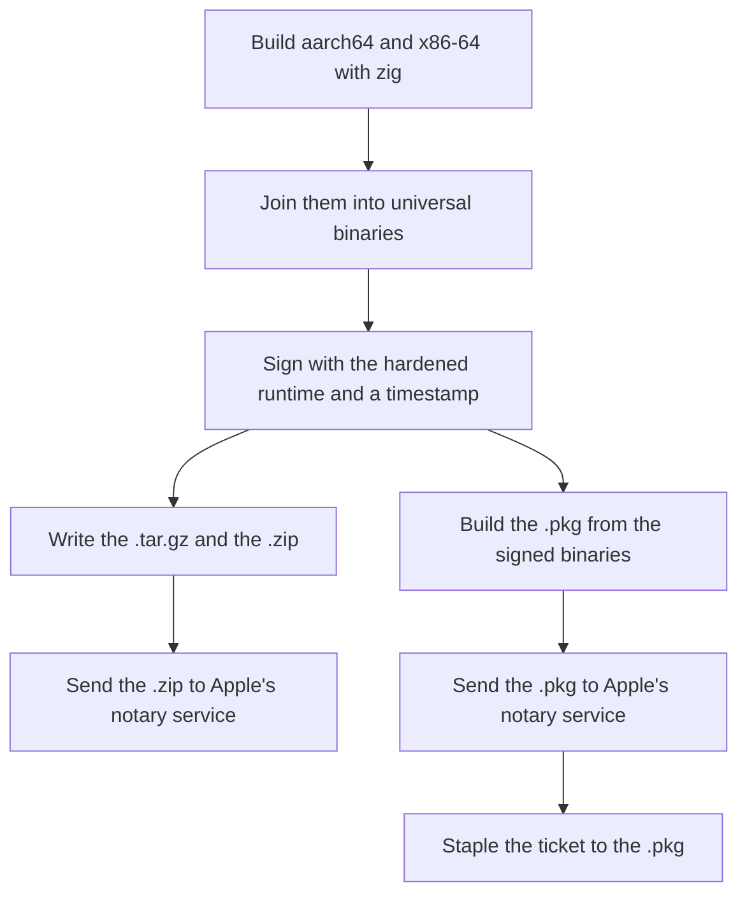

# macOS packaging

This page explains how the macOS release is built, signed and notarised on the Windows release
machine, and how to set up the Apple credentials it needs. No Mac is needed.

| Term | Meaning |
|---|---|
| Mach-O | the executable file format macOS uses |
| universal binary | one Mach-O file that holds both the Apple silicon (aarch64) and the Intel (x86-64) program |
| hardened runtime | a signing option Apple requires before it will notarise a program |
| notarisation | Apple's service checks a signed upload and records that it approves those exact bytes |
| stapling | attaching Apple's approval ticket to the `.pkg`, so a Mac can check it without going online |
| `.pkg` | the macOS installer package, opened by Installer.app |
| DPAPI | the Windows service that encrypts a secret so only the current Windows user can read it |

## How the release is built

`packaging/ship.ps1` runs `packaging/release-all.ps1`, which runs
`packaging/macos/release-macos.ps1`. You can also run the macOS part on its own:

```powershell
pwsh packaging/macos/release-macos.ps1
```



`install.sh` and Homebrew download the `.tar.gz`. Apple's notary service accepts the `.zip`.

Each Apple program has a replacement that runs on Windows:

| Apple's program | What runs on Windows |
|---|---|
| `lipo` | `rcodesign macho-universal-create` |
| `codesign` | `rcodesign sign` |
| `pkgbuild` | `tools/macos-pkg` |
| `productbuild` | `tools/macos-pkg`, which writes the product archive directly |
| `productsign` | `rcodesign sign`, which signs a XAR archive |
| `notarytool` | `rcodesign notary-submit` |
| `stapler` | `rcodesign staple` |

## What cannot be checked on Windows

A Mach-O runs only on macOS. `verify-macos.sh` has seven checks, and four of them run the program:
`spctl` on a quarantined copy, a database round trip, the MCP server's tool list, and the x86-64
program under Rosetta. The release script prints which checks it ran and which four it could not.

Two checks cover part of that gap:

- **Apple's notary service.** It unpacks the upload, reads every Mach-O inside it, and rejects an
  unsigned program, a missing hardened runtime, a missing timestamp, an SDK that is too old, or a
  package it cannot read. The release does not publish without Apple's `Accepted`.
- **`verify-macos.sh` against the published files.** On any Mac:

  ```sh
  curl -fsSL https://inillucent.com/downloads/verify-macos.sh | sh -s -- --version 1.0.29
  ```

## The minimum macOS version is 13.0

The programs declare `Minimum OS: 13.0.0`. This is zig's default, and the build cannot change it
yet:

- zig takes the minimum version from its target string. `zig cc -target aarch64-macos.11.0-none`
  produces `Minimum OS: 11.0.0`.
- `cargo-zigbuild` writes that string as `{arch}-macos-none{suffix}`, which puts the version after
  the ABI, and zig rejects it with `InvalidAbiVersion`.
- A second `-target` passed as a link argument does not reach zig. `cargo-zigbuild zig cc` drops a
  repeated `-target` on purpose.
- `cargo-zigbuild` does not read `MACOSX_DEPLOYMENT_TARGET`, and zig accepts and ignores
  `-mmacosx-version-min`.

So macOS 11 and 12 cannot run inillucent. `release-macos.ps1` checks the value in every build, so a
zig upgrade that changes the default stops the release.

## Setting up the credentials

You do this once. `release-macos.ps1` refuses to run until all three parts exist and says which
part is missing. None of it goes in this repository.

### 1. The Rust targets

`rust-toolchain.toml` names them, and `rustup` installs them on a new machine. There is nothing to
do by hand.

### 2. The two certificates

Join the Apple Developer Program at <https://developer.apple.com/programs/>. It costs $99 a year and
needs an Apple ID with two factor sign in. You cannot sign for macOS without a membership.

You request a certificate by uploading a signing request file. You do not need Xcode or a Mac to
make one:

```powershell
pwsh packaging/macos/new-apple-csr.ps1 -Kind application
pwsh packaging/macos/new-apple-csr.ps1 -Kind installer
```

Each run writes a `.csr` file into `%LOCALAPPDATA%\inillucent\apple\` and seals its private key
with DPAPI. Then go to developer.apple.com, open Certificates, Identifiers & Profiles, then
Certificates, then **+**, and:

1. Choose **Developer ID Application** for the programs and the library, and **Developer ID
   Installer** for the `.pkg`. You need both. A `.pkg` signed with the Application certificate fails
   notarisation, and the error does not say which certificate is wrong.
2. Choose the profile type `G2 Sub-CA (Xcode 11.4.1 or later)`.
3. Upload the `.csr`, download the `.cer`, and install it:

   ```powershell
   pwsh packaging/macos/new-apple-csr.ps1 -Kind application -Certificate <the .cer>
   ```

   The script checks that the certificate is the right kind before it accepts it.

A `.p12` file exported from a Mac keychain also works. Put it in the same directory as
`developer-id-<kind>.p12`, and seal its password once:

```powershell
pwsh -c ". packaging/macos/apple-credentials.ps1; Set-AppleP12Password -Kind application"
```

### 3. An App Store Connect API key, for notarisation

At <https://appstoreconnect.apple.com>, open Users and Access, then Integrations, and create a key
with the **Developer** role. You get an issuer ID, a key ID, and a `.p8` file that can be downloaded
once. Combine them into one file, seal it, and delete both plain copies:

```powershell
. packaging\macos\apple-credentials.ps1
$scratch = Get-AppleScratchDir           # the RAM disk
$json = Join-Path $scratch 'notary-key.json'
tools\cross\bin\rcodesign.exe encode-app-store-connect-api-key -o $json `
  <issuer-id> <key-id> <path to AuthKey_<key-id>.p8>
Protect-AppleSecret -Value (Get-Content $json -Raw) `
  -Path (Join-Path (Get-AppleCredentialDir) 'notary-key.json.sealed')
Remove-Item $json, <the .p8> -Force
```

`New-AppleNotarySession` unseals the key onto the RAM disk while a submission runs, and the release
deletes it when the submission ends. An unsealed `notary-key.json` still works, with a warning to
seal it.

The release uses an API key instead of an Apple ID password because the key can be revoked on its
own and does not expose the Apple ID password.

To check the credentials without sending anything, ask Apple to list earlier submissions. The call
changes nothing:

```powershell
. packaging\macos\apple-credentials.ps1
$session = New-AppleNotarySession
tools\cross\bin\rcodesign.exe notary-list --api-key-file $session.Path
Remove-AppleNotarySession -Session $session
```

### Where the secrets are kept

The secrets are in `%LOCALAPPDATA%\inillucent\apple\`. Set `$env:INILLUCENT_APPLE_DIR` to use a
different directory. The private keys and any `.p12` password are sealed with DPAPI under the
current Windows account, so the files are useless on another machine or to another user.
`rcodesign` reads a key from a file, so during signing the key is written to the RAM disk at `R:\`
and deleted as soon as signing ends. No secret is in the repository, on a command line, or in an
environment variable that a child process inherits.

## Testing the pipeline without Apple certificates

```powershell
pwsh packaging/macos/release-macos.ps1 -SelfSigned -SkipNotarize -Unpublishable
```

This signs with a certificate made on the spot and runs every step except notarisation. Apple would
refuse this certificate, and so would Gatekeeper on a Mac. The files go to `dist/unpublishable/`
instead of `dist/`, so a build signed this way cannot be published by mistake.

## Building on a Mac

`release-macos.sh` produces the same files on a Mac. `build-pkg.sh` and `notarize.sh` are older
scripts that build and notarise only the `.pkg`. `packaging/fetch-macos-artifacts.ps1` collects and
checks files that a Mac produced. The Mac route needs both certificates in the login keychain and a
`notarytool` credential profile named `inillucent-notary`.

## What is inside the `.pkg`

A `.pkg` is a XAR archive with these parts:

```
Distribution                                 an XML description of the install
Resources/                                   the welcome, conclusion and licence text
inillucent-component-<version>.pkg/PackageInfo
inillucent-component-<version>.pkg/Payload   a gzipped cpio archive of the files
inillucent-component-<version>.pkg/Bom       the file list the install receipt is made from
```

`tools/macos-pkg` writes every part. Its source explains why each part is written directly,
including three faults in the `apple-bom` crate that make it unusable.

`rcodesign` reads the archive again when it signs it, so a badly written archive fails on the
build machine.

Neither `rcodesign` nor Apple's notary service reads the `Bom`, but Installer.app does, before it
installs anything. The 0.1.8 `.pkg` was signed, notarised and published with a `Bom` that had no free
list after its block table, and Installer.app crashed in `_ReadFreeList` with
`EXC_CRASH (SIGABRT)` on every Mac. The tests in `tools/macos-pkg/src/bom.rs` now compare the layout
with a `Bom` written by Apple's tools:

```sh
cargo test --manifest-path tools/macos-pkg/Cargo.toml
```

A change to the `.pkg` writer is released through `packaging/ship.ps1` like any other fix, because
this machine builds, signs and notarises the `.pkg`. This machine cannot run Installer.app.

## Where the `.pkg` installs

The `.pkg` installs into `/usr/local`, the usual place for software that does not come from Apple.
It asks for the administrator password once, at install time. `install.sh` installs into `$HOME`
and never touches `/usr/local`. Both can be installed at once, and then the order of `PATH` decides
which `inillucent` a shell runs. `which -a inillucent` lists both.
