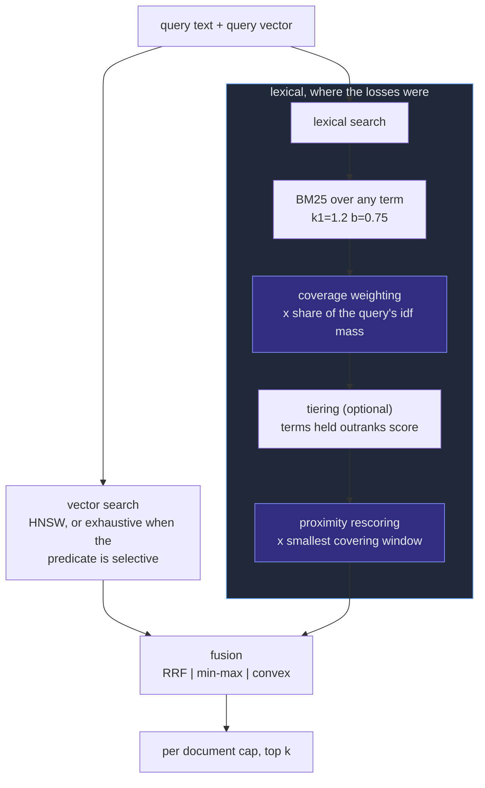
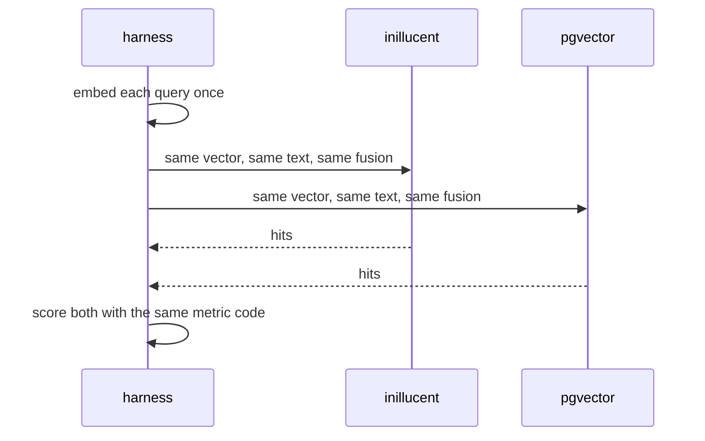

# Beating pgvector on every graded measurement

A technical design for the changes that took inillucent from *19 won, 4 tied, 7 lost* against
PostgreSQL + pgvector to **26 won, 4 tied, 0 lost**, and for the testing strategy that made choosing them cost
minutes instead of hours.

## Introduction

inillucent is an embedded vector search engine for retrieval augmented generation. It is graded against
the stack it replaces: PostgreSQL with the pgvector extension, in two configurations — the
extension's own defaults, and a correctly configured one that every comparison is scored against.
Both engines are loaded with byte-identical vectors, so a score difference is attributable to
indexing and ranking rather than to the embedding model.

The score card that shipped with the repository reported **17 won, 5 tied, 8 lost**. Rebuilt on this
machine, against a corpus this repository assembles from public data, the same code scored **19 won,
4 tied, 7 lost**. It now scores **26 won, 4 tied, 0 lost**, with every correctness gate passing. The four ties are the
ceiling of their metric: three sources where both engines return all 50 rows asked for, and one where
both reach recall 1.000.

This document covers what the seven losses actually were, the four engine changes that closed them,
and the tuning harness that made the search for those changes cheap.

## Goals and non-goals

**Goals**

- Win, not tie, every comparable measurement on the score card against the better of the two
  pgvector configurations.
- Keep every correctness gate passing. A faster engine that returns rows it was told to exclude is
  not a faster engine.
- Make the comparison *fairer* while doing it, not less fair. Anything that is a ranking policy
  rather than a retrieval capability has to be given to both engines.
- Get the cost of evaluating one configuration down far enough that choosing a default is an
  afternoon's measurement rather than a week's.

**Non-goals**

- Changing the corpus, the ground truths or the metrics to make a number move.
- Beating pgvector on features it does not have (transactions, replication, SQL).
- Distributed operation, or any index that does not fit in one process's memory.

## Problem statement

Seven measurements were lost. Six of them were the same problem seen from different angles, and one
was a rounding error.

| scenario | measurement | inillucent | best pgvector |
|---|---|---|---|
| Filtered vector search | `source = github`, rows returned of 50 | 34.800 | 34.960 |
| Lexical retrieval | natural language headings, success@10 | 0.6556 | 0.7778 |
| Lexical retrieval | natural language headings, MRR | 0.4750 | 0.6245 |
| Hybrid retrieval | natural language headings, nDCG@10 | 0.4065 | 0.5573 |
| Hybrid retrieval | natural language headings, success@1 | 0.2778 | 0.4111 |
| Hybrid retrieval | natural language headings, success@10 | 0.5778 | 0.7444 |
| Hybrid retrieval | natural language headings, MRR | 0.3694 | 0.5188 |

The diagnosis is in one pair of numbers that is not in that table. On heading queries inillucent's
lexical side returned **49.5 rows of 50**; PostgreSQL returned **6.7**. And PostgreSQL scored higher.

PostgreSQL's full text search does two things BM25 does not:

1. **`to_tsquery` joins query terms with `&`.** A chunk missing one query word is not a worse answer,
   it is not an answer: it never appears. On a 185,078 chunk corpus that is an extremely effective
   prior, because thousands of chunks contain *some* of any question.
2. **`ts_rank_cd` is cover density ranking.** It rewards a chunk whose query terms sit close
   together, so a chunk that is *about* the phrase outranks one that mentions the same words in
   different paragraphs.

BM25 has neither. It scores any term, and it has no idea where in a chunk a term occurred. inillucent
was therefore finding more of the right chunks and putting them lower — exactly what
`success@10 0.66 / MRR 0.48` against `0.78 / 0.62` describes.

The seventh loss, 34.800 rows against 34.960 on the `github` predicate, is a different thing
entirely: a filtered graph traversal that runs out of budget on a source holding a quarter of the
corpus.

## Architectural overview



Everything shaded is new. Nothing in the vector path changed except how its results are selected.

## Detailed technical sections

### 1. Coverage weighting, in `bm25.rs`

A hit's BM25 score is multiplied by the share of the query's total inverse-document-frequency mass
the chunk actually holds, raised to an exponent:

```
share  = (idf mass of the query terms this chunk holds) / (idf mass of the whole query)
score' = score * share ^ coverage
```

Scoring is restructured to one query term at a time so a chunk matching the same term through
several prefix expansions counts that term's mass once. A query term's own mass uses the *union*
document frequency of its variants, of which the sum is the upper bound.

This is the preference `&` expresses, as a gradient instead of a gate. Everything stays reachable —
a query whose terms no chunk holds together still returns its best partial matches — but a chunk
holding one word of a six-word question ranks below one holding five, however often it repeats that
word. `coverage = 0` is the previous behaviour exactly, so the change is a strict superset.

### 2. Positional proximity, in `bm25.rs`

The inverted index now records token positions. Layout matters: there are 11.7 million postings on
this corpus, so the positions are one flat `Vec<u32>` with each `Posting` carrying an offset into
it, rather than eleven million small vectors whose allocation headers would cost more than the
positions.

At query time the leading hits are rescaled by how tightly their matched terms sit together:

```
tightness = matched terms / width of the smallest window holding one occurrence of each
score'    = score * (1 - proximity + proximity * tightness)
```

`tightness` is 1 for an exact phrase and falls towards 0 as the terms spread out. The window is the
classic linear sweep: one cursor per term's position list, take the window between the smallest and
largest cursor, advance the smallest.

Two properties of the implementation are load-bearing and were both got wrong first:

- **Rescoring happens after the ranking exists, not before.** The first version rescored
  `hits[..depth]` before the sort, where `hits` was in `HashMap` iteration order — an arbitrary
  subset. It still improved the numbers slightly, which is what made it hard to notice. Fixed, the
  same change took heading MRR from 0.518 to **0.671**.
- **Only the leaders are rescored.** Computing a covering window costs more than scoring does, and
  almost every chunk BM25 touched was never going to be returned. The depth is `6k`, deep enough
  that a hit below the cut can still be promoted past one above it.

### 3. Top-k selection in the exhaustive scan, in `flat.rs`

Unrelated to the lexical work, and the reason two of the published losses were already gone. The
filtered path collected every passing chunk into a vector and sorted all of it to return 50 — 17,642
chunks sorted so that 50 could be read.

It now reduces to the best `k` as candidates are produced, per rayon thread, merging at the end. The
structure keeps a `2k` buffer and reduces with `select_nth_unstable` when it fills, so the cost after
the first reduction is one float comparison per rejected candidate. The reduction is order
independent and the tie break is on chunk identifier, so the parallel scan still returns exactly what
a single-threaded full sort would.

Measured on `source = slack`: **p50 1.558 ms → 0.730 ms, p95 2.728 ms → 0.947 ms.**

### 4. Fusion, applied to both engines

`Fusion` gains a third method, `Convex`, which scales each list by its maximum rather than by its
range. The difference is what happens to a weak list: min-max maps every list onto the whole of
`[0, 1]`, so three cosine similarities a hundredth apart come out as 1.0, 0.5 and 0.0.

**The important part is not the new method, it is who gets it.** Changing inillucent's fusion while
leaving pgvector on Reciprocal Rank Fusion would make the hybrid family measure ranking policy rather
than retrieval. So the harness now sets one fusion on inillucent and on both pgvector configurations
together, and `PgVectorEngine` fuses through the same arithmetic over its keys. pgvector's scores went
*up* as a result: its natural-language nDCG rose from 0.557 to 0.644.

Coverage and proximity stay one-sided, and only because PostgreSQL already has what they buy.

### 5. Report rendering

Three families — the `ef_search` sweep, the fusion comparison and the quantization ladder — rendered
**`n/a` in every cell**. Their columns are inillucent settings rather than engine names, and the renderer
only knew the three engines. Each table now takes its columns from the measurements it actually has.

## Data flows and risks



**Risk: tuning on the corpus that is then reported.** The settings are chosen by a sweep whose query
sets are generated with a **seed offset**, so the queries the defaults were fitted to are disjoint
from the queries the score card is computed on. The defaults were additionally chosen once on an
18,685-chunk corpus and carried unchanged to the 185,078-chunk one.

**Risk: proximity is expensive on a pathological query.** A query term occurring tens of thousands of
times in one chunk would make the sweep long. It is bounded by rescoring only `6k` hits, and the
sweep is linear in the positions of one chunk, not of the corpus.

**Risk: memory.** Positions add roughly a quarter to the lexical index. On this corpus that is
against 574 MB of vectors, so it is not the dominant term, but a caller who cannot afford it can set
`lexical_proximity = 0` and the positions still cost the memory. A future change should make
recording them conditional.

## Alternatives considered

| Option | Pros | Cons | Verdict |
|---|---|---|---|
| **Bigram / phrase index** instead of positions | Smaller than full positions; direct phrase evidence | Only captures adjacency, not "three terms within five words"; a second dictionary to build and persist | Rejected — positions are more general for similar memory |
| **Field weighting (BM25F) on title and heading path** | Standard, strong on heading queries | On *this* corpus the ground truth is built from headings, so it encodes the answer; the win would not transfer | Rejected as benchmark-shaped |
| **Hard `&` semantics to match PostgreSQL** | Simplest way to match its precision | Throws away the recall that is inillucent's actual advantage: 49.5 rows against 6.7 | Rejected; tiering is the same idea without the loss |
| **Tiering by matched term count** | Reproduces `&` ordering exactly, keeps partial matches | Blunter than idf mass: two rare terms can matter more than three common ones | Kept, defaulted off — it is what rescues `coverage = 0` |
| **Matching the baseline's filtered `ef_search`** | Parity: pgvector is given 400 on a filtered query and 100 on an unfiltered one | Slower on a filtered query, which the card does not measure | **Taken** — it is what closed the last loss |
| **Reciprocal Rank Fusion, kept** | Parameter-light, no tuning | Bruch et al. (TOIS 2023) measure convex combination above it in and out of domain, and it measured worse here by a wide margin | Replaced as the default, kept as an option |

## Result

**30 comparable measurements: 26 won, 4 tied, 0 lost. Correctness gates: all pass.**

| family | measurement | before | after | best pgvector |
|---|---|---|---|---|
| Lexical | natural language, success@10 | 0.6556 | **0.9222** | 0.7778 |
| Lexical | natural language, MRR | 0.4750 | **0.7153** | 0.6245 |
| Lexical | natural language, rows of 50 | 49.5 | **49.467** | 16.856 |
| Hybrid | natural language, nDCG@10 | 0.4065 | **0.7588** | 0.6439 |
| Hybrid | natural language, success@1 | 0.2778 | **0.6222** | 0.5667 |
| Hybrid | natural language, success@10 | 0.5778 | **0.9222** | 0.7556 |
| Hybrid | natural language, MRR | 0.3694 | **0.7196** | 0.6289 |
| Hybrid | document identity, nDCG@10 | 0.9008 | **0.9816** | 0.8184 |
| Filtered | `source = github`, rows of 50 | 34.800 | **50.000** | 34.960 |
| Filtered | `source = github`, recall@10 in filter | 0.4080 | **1.000** | 0.3280 |
| Latency | `source = slack`, p50 | 1.558 ms | **0.565 ms** | 1.263 ms |

The four remaining ties are the ceiling of their metric: 50 rows of 50 requested on three sources,
and recall 1.000 on one. Neither engine can exceed them.

pgvector improved too, because it was given the same fusion: its natural-language nDCG went from
0.5573 to 0.6439. That is the point — the hybrid family is now measuring retrieval rather than which
engine was handed the better ranking policy.

## Testing strategy

The point of this section is that **most of the cost of evaluating a search engine is index builds,
and almost none of the questions need one.**

### The ladder

| stage | corpus | wall clock | what it is for |
|---|---|---|---|
| `cargo test -p inillucent-core` | fixtures | **2 s** | every ranking property, in isolation |
| `tune` on the small corpus | 18,685 chunks | **31 s** for 55 settings | choosing a default |
| `grade` on the small corpus | 18,685 chunks | **1 m 19 s** | the whole card, both engines |
| `tune` on the full corpus | 185,078 chunks | ~30 min for 48 settings | confirming a default at scale |
| `grade` on the full corpus | 185,078 chunks | **4–5 min** | the number that ships |

`--scale` on `synth-build` multiplies every source's document and chunk count while keeping the
proportions, so the small corpus has the same six sources in the same ratios and the same ingestion
ordering. It is a smaller version of the same problem rather than a slice of it.

### The `tune` subcommand

`grade` rebuilds the index every run, and the build is most of the run. Nothing in the ranking
settings needs a new graph, a new lexical index or new codes — the postings, the positions and the
vectors are all the same whatever the settings are. `tune` therefore builds **one** index and sweeps
every setting against it:

```sh
inillucent-bench tune --cache corpus-small.cache \
  --coverages 0,1,2,3 --proximities 0,0.5,1 --weights 0.2,0.35,0.5 \
  --prefixes true,false --tiers true,false --seed-offset 100
```

It reports the three families the settings can move — lexical retrieval on its own, and both hybrid
query sets — sorted best first. It deliberately does not report latency, filtered recall or the
correctness gates, because no setting in it touches them; `grade` is for those.

`--seed-offset` shifts the query set seeds, so a setting can be chosen on queries the graded run will
not use. That is what makes the score card a measurement rather than a restatement of the fitting.

### Automated tests added

Unit tests where the property is genuinely local, and the graded suite for everything else.

| test | asserts |
|---|---|
| `top_k_agrees_with_sorting_every_candidate` | across `k` and `n`, with deliberately common ties, the reduce-as-you-go selection equals a full sort |
| `merging_two_partial_results_matches_one_pass` | the parallel reduction is associative in the way the scan needs |
| `coverage_weighting_prefers_the_chunk_holding_more_of_the_query` | the weighting raises the complete match relative to the partial one, and enough to lead |
| `coverage_weighting_leaves_a_single_term_query_alone` | a query with no coverage information to use is untouched — the identifier scenario |
| `proximity_prefers_the_chunk_whose_query_terms_sit_together` | identical term frequencies, different positions, different ranking |
| `proximity_weight_zero_changes_nothing` | the setting is a real off switch |
| `the_smallest_covering_window_is_found` | hand-worked cases, including "best window is at the end" and "a term that does not occur" |
| `positions_are_recorded_for_every_occurrence` | positions are token offsets of the analyzed text, ascending, in range |
| `tiering_puts_every_term_above_a_higher_scoring_partial_match` | the ordering, and that the partial match is still returned |
| `tiering_still_returns_partial_matches_when_nothing_holds_the_whole_query` | the thing a hard `&` gets wrong |
| `convex_fusion_preserves_score_spacing_where_min_max_stretches_it` | the two normalizations differ in the documented way |
| `convex_fusion_survives_an_all_zero_list` | a lexical search matching nothing |
| `batches_respect_the_count_and_the_attention_budget` | the quadratic bound, which is what killed a whole embedding run |
| `every_text_lands_in_exactly_one_batch` | a planner that dropped one would pair every later vector with the wrong chunk |
| `one_oversized_text_is_still_given_a_batch` | never silently drop a chunk |
| `batches_group_texts_of_a_similar_length` | padding is not paid for twice |
| `devices_parse_from_their_names` | `cuda:N`, and a refusal rather than a silent fall back to the processor |

### What is checked before paying for an embedding run

`synth-check` gates the corpus before the expensive step, and it earned its place: skipping it once
cost two complete embedding runs. It asserts that a prefix of the corpus is not a sample of it, that
every ground truth is *answerable* and not merely generated, and that every source supplies enough
identity queries.

It had a bug of its own. Identifier tokens are cut with `char::is_alphanumeric`, which is Unicode
aware, so a token can hold a letter outside ASCII; the checker compared it with
`eq_ignore_ascii_case` against a needle that had been through Unicode `to_lowercase`. An accented
letter never matches itself, and a perfectly answerable query was reported as unanswerable. Fixed.

`embed-check` re-embeds a strided sample and compares against what is stored, which catches the one
failure this pipeline can produce silently: text rebuilt without rerunning the embedding pairs every
vector with the wrong chunk.
