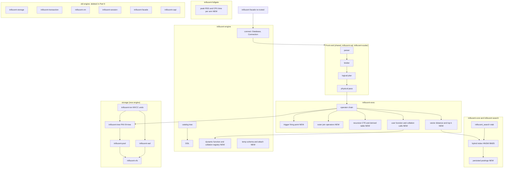
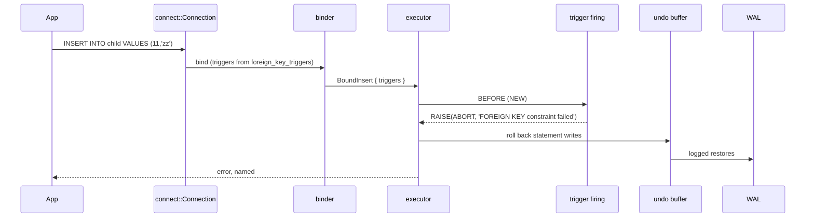
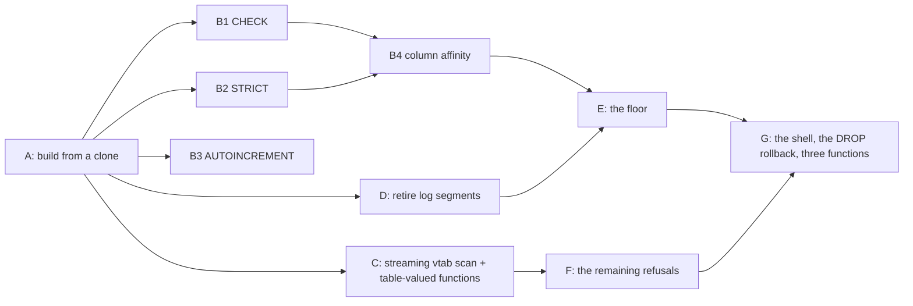

# Inillucent Phase 2: from a fast engine to a SQLite replacement

Technical design for the work that closes the distance between what inillucent measures today and the
goal it was built for: a highly performant SQLite replacement with the same features, plus embedding
search similar to pgvector. Written for task-1802 from the sprint's tickets (task-1760 to task-1837)
and a code audit of the tree at commit `b94b8da`; every number names its source and none was
estimated. The implementation is a separate ticket for Opus.

> **Phase 2 has been implemented.** task-1838 delivered its nine parts and task-1844 the ATTACH and
> temporary-object work that Part 2 deferred. Everything from here to `## Sources` is the plan as it
> was written, kept as the record of what was asked for; **the plan for the work that comes next is
> [Phase 3](#phase-3-the-improvement-plan-from-the-second-review-task-1843) at the end of this
> document**, written for task-1843 from measurements taken at commit `d885e91` rather than from what
> the implementing tickets reported.

## Introduction

The task-1816 rearchitecture replaced a SQLite-file-format engine that measured 0.05x to 0.70x
SQLite with a PAX/WAL/vectorised engine that measures **3.05x to 3.14x weighted at 100,000 rows on
Windows**, with the lower 95% bound on the 3.00x bar on all four qualification runs (task-1834 §5e).
Read-heavy families are 3x to 20x faster than SQLite and every one of thirty workloads returns
SQLite's exact answer. That is the fast engine. It is not yet a replacement: the contract's 1.00x
floor is missed by three families, the same binary is 1.45x on Linux, the repointed qualification
suites are 24 pass and 81 fail, two constructs return wrong answers instead of refusals, the old
engine is still what the public facade opens, and nobody has measured what either engine costs in
process memory or CPU time. The retrieval engine beats pgvector on 15 of 17 primary comparisons and
is in production, but reaches SQL only through a virtual table.

This document plans the work in the order that unblocks the most, states an acceptance for each part
that already exists as a failing test or a measured number in the tree, and says what is deliberately
not planned.

## Goals and non-goals

### Goals, each with its acceptance

| # | goal | acceptance (exists in the tree today) |
|---|---|---|
| G1 | No silent wrong answer | `generated_columns_round_trip_through_sqlite` passes; `foreign_keys.rs` 19 of 19 pass |
| G2 | The SQL surface SQLite applications use | the eleven repointed suites in task-1834 §13 go from 24/81 to 105 pass / 0 fail on the 60 engine-gap tests; `new_engine_surface.rs` refused rows fall to the two chosen ones (`EXPLAIN`, `ATTACH ... KEY`) |
| G3 | User functions and collations | `functions.rs`, `hostile.rs`, `plan_cache.rs` repointed and green |
| G4 | The performance floor | `inillucent-fullgate` medium, 30 rounds, four consecutive runs: weighted lower bound at least 3.00x **and** no family under 1.00x; `open.prepare` at least 1.00x, `schema` at least 1.00x, `extension` at least 1.00x, `write` at small at least 1.00x |
| G5 | Linux is not half of Windows | weighted lower bound at least 2.00x at medium on Linux x64 (today 1.42x), with SQLite's per-statement advantage on Linux explained by measurement |
| G6 | Memory and CPU measured, not argued | `inillucent-fullgate` reports peak resident set and CPU time per arm per workload; the README carries the table |
| G7 | Vector search from SQL | a `vector(N)` column affinity, `vector_distance_cos`/`_l2`, and `ORDER BY vector_distance_cos(v, ?) LIMIT k` planned onto the retrieval index; graded against exhaustive cosine with the same recall as `inillucent_search` |
| G8 | One engine | `inillucent::Database::open` reaches `inillucent-engine`; `inillucent-storage` (except the reader), `-transaction`, `-vm`, `-session`, `-capi` deleted; `cargo build --workspace` has no reference to them; `layering.toml` updated |
| G9 | The retrieval index is cheaper to hold | persisted BM25 postings so reopen does not rebuild them; graph build parallel; resident set for 598,560 chunks reported before and after |

### Non-goals

- SQLite's file format and the `sqlite3_*` C ABI on the new engine. Both were dropped by task-1816.
  A driver and a small versioned C ABI for other languages is **task-1837** and is not duplicated
  here.
- Multi-process access to one file and concurrent writers. Still non-goals; Part 8 only makes the
  single-process rule refuse a second process by name instead of silently sharing a file.
- Changing any bar, weight or fixture in `compat/perf/contract.toml`. task-1833 recommended re-examining
  the `schema` and `extension` bars; that is Jason's decision and this document plans to the bars as
  written, with the floor (1.00x) as the acceptance where the bar (3.00x, 1.50x) is shown unreachable.
- The CLI and MCP surface (task-1836) and the Unluminous explorer (task-1814).
- Re-deriving anything task-1834 §14 already specifies. Where that section is the plan, this
  document points at it and adds only what it lacks: ordering across the performance work, the
  measurement work, and the vector-in-SQL work.

## Problem statement

**Two wrong answers.** A table with a `VIRTUAL` generated column in the middle returns each later
column shifted one place early, so `c` reads `doubled`'s value (task-1834 §13). `INSERT INTO c
VALUES (11, 'zz')` with no parent row is accepted; SQLite says `FOREIGN KEY constraint failed`. Both
look like data. Every other gap is a refusal by name.

**One mechanism missing behind three features.** `inillucent-sql/src/foreign_key.rs` turns a
foreign key into `CREATE TRIGGER` text bound by the same binder; `BoundInsert`, `BoundUpdate` and
`BoundDelete` already carry `triggers: Vec<BoundTrigger>`. The executor cannot run a `BoundTrigger`,
so foreign keys are unenforced, `CREATE TRIGGER` is refused, and `cli.rs`'s trigger script fails.

**Sixty engine-gap tests.** Outer joins (16 of 21 join statements), recursive CTEs, derived tables,
correlated subqueries, temp databases (11), `ATTACH` (13), `STRICT` enforcement, `ADD COLUMN ...
DEFAULT`, `REINDEX` reporting *malformed*, `VACUUM INTO`, index on `WITHOUT ROWID`, views dropped by
the importer, no path for a user function. Each is a named failing test (task-1834 §13).

**The floor.** At medium, `open.prepare` 0.70x (the binder: `SELECT 1` costs 1,270 ns against
SQLite's 482; parse 332, bind 409, build 372, run 163), `schema` 0.54x (`CREATE INDEX` floor 19.7 ms
against a 10.1 ms budget), `extension` 0.35x (`fts.build` 0.11x with 22.6 of 23.7 ms inside the
module; `rtree.insert` 0.12x; `json` 0.26x). At small, `write` 0.38x (`insert.batch` 0.12x, a
per-write constant the delta limit does not move) and `txn.large` 0.24x (a per-update constant on the
allocating `PagedTree::point` path, not compaction). The headline's lower bound sits at 3.00x to 3.08x,
so any fix that costs a read family a few percent takes the headline with it.

**Linux.** 1.45x weighted at medium against 3.06x on Windows, every workload digest-agreed. inillucent
is 8 to 53% faster on Linux; SQLite is 3x to 9x faster on Linux on per-statement workloads (`point.rowid`
48.0 ms Windows against 7.5 ms Linux). Not locking, not build flags, not the filesystem; MSVC against
GCC and the CRT heap against glibc are the remaining suspects and neither is isolated (task-1834 §5h).

**Unmeasured.** No ticket measured resident set size or CPU time for either engine. The gates match a
cache budget and time wall-clock on one thread. The README says so.

**Two engines.** `inillucent::Database::open` goes to `inillucent-session` and the old storage, VM and
journal; the CLI, migrator and every gate go to `inillucent-engine`. 42,661 non-test lines of the
old engine are in the tree, `inillucent-catalog`, `inillucent-ext` and `inillucent-sqlite-reader`
still depend on `inillucent-storage`, and the 82-method facade has to be re-rooted before anything
can go (task-1834 §8, code audit §1.3).

**Vector search is a virtual table, not SQL.** `inillucent_search` needs `CREATE VIRTUAL TABLE ...
USING inillucent_search(..., dims = 768)` and `WHERE t MATCH ? AND vector = ? AND k = ?`. There is no
vector type, no distance function and no `ORDER BY ... LIMIT k` plan, so an application written for
pgvector's `<=>` cannot be ported by changing the driver. The new-engine test of the virtual table
binds text only; no test binds a vector on the new engine (code audit §6).

**The retrieval index's footprint.** 3.80 GB resident for 598,560 chunks, BM25 rebuilt on load,
9 min 27 s single-threaded build (task-1774).

## Architectural overview



Nine parts, in dependency order. Parts 1 to 3 are correctness and are sequenced exactly as task-1834
§14 sequences them. Parts 4 to 6 are performance and measurement and can run beside 2 and 3 because
they touch the binder, the pool and the gate rather than the executor's operator set. Part 7 is the
vector-in-SQL work and depends on Part 3 (a user-function call path is what a distance function is).
Part 8 is the retrieval footprint and is independent. Part 9 is the deletion and depends on
everything before it.

## Detailed technical sections

### Part 1: the two wrong answers and the trigger firing point

**1a. The `VIRTUAL` generated column shift.** A `VIRTUAL` column takes no slot in the record; the
reader uses the declared position. Fix in the layout, not the reader: `inillucent-engine`'s
`source_layout_of` / `logical_row` / `stored_as` already map a declared column to a stored slot for
the alias column; extend the same mapping so every column after a `VIRTUAL` one maps to `slot - k`
where `k` is the count of `VIRTUAL` columns declared before it, and evaluate the generated expression
at projection from the row's stored columns. One mapping, consulted by the import, the write path
(`dml::insert` must not allocate a slot for it) and the projection. Acceptance:
`generated_columns_round_trip_through_sqlite`, plus a new differential case with two `VIRTUAL`
columns and a `STORED` one interleaved, checked against the pinned shell.

**1b. Triggers, which are foreign keys.** task-1834 §12 has the seven pieces and their order; this
design adds the placement decisions:

| piece | decision |
|---|---|
| firing point | inside `dml::insert` / `update` / `delete` where `OLD` (the undo hook's read) and `NEW` (the row being written) both exist; one function `fire(triggers, timing, old, new)` called before and after the apply |
| `OLD`/`NEW` scope | a new `BoundSource` kind `TriggerRow { old, new }` in the binder resolved to a two-row pseudo-batch at execution; not a table, no tree |
| body | parsed at `CREATE TRIGGER`, bound once, held as `Vec<BoundStatement>` on the catalog entry, rebuilt on `reload_schema`; the `execute_batch` splitter is not touched |
| `WHEN` | an ordinary bound expression over the `TriggerRow` scope |
| `BEFORE` vs `AFTER` | `BEFORE` runs on the supplied row before rowid allocation; `AFTER` on the written row; `RAISE(ABORT)` in either unwinds through the undo buffer task-1834 §10 built |
| recursion | `recursive_triggers` off by default, depth capped at `SQLITE_MAX_TRIGGER_DEPTH` (1000), refused by name past it |
| `INSTEAD OF` on a view | last; the trigger *is* the write, so `dml.rs:764` (writing to a view) becomes a dispatch instead of a refusal |
| foreign keys | **no second implementation**; `TableInfo::foreign_key_triggers` already fills the trigger vector, so `PRAGMA foreign_keys = ON` makes those fire and `OFF` skips them |

Acceptance: `foreign_keys.rs` 19 of 19, `cli.rs::a_trigger_body_is_one_statement`, `new_engine_ddl`'s
campaign, the five chosen-refusal tests in `schema_forms.rs`, `inillucent-migrate` carrying triggers
instead of naming them. Performance guard: `write` and `transaction` on the full gate before and after,
with triggers absent from the fixture, must be inside the run-to-run spread (task-1834 §5e: 3.05x to
3.14x weighted). A trigger table that does not exist must cost a write nothing measurable.

### Part 2: outer joins, derived tables, recursive CTEs, correlated subqueries

**Outer joins.** `join.rs` already has a `JoinKind::Left` arm the SQL path never reaches
(`physical.rs:889-897`). Route `LEFT` through the hash join with a probe-side miss emitting the
build-side NULL row; `RIGHT` by swapping sides at planning; `FULL` as a left join plus an anti-join of
the build side against the matched-bitmap, which the hash join keeps. `ON` versus `WHERE` NULL
semantics are the differential harness's job: every case is graded against the pinned shell.
Acceptance: `joins_match_the_oracle` 21 of 21, `ordering.rs`, `refusals_match_the_oracle`.

**Derived tables, then recursive CTEs.** A derived table is a subplan materialised into a batch
source; `physical.rs:1052` becomes a `Materialise` stage. A recursive CTE is a derived table that
reads itself: anchor into a working batch, iterate the recursive arm over the previous iteration's
rows until empty, `UNION` de-duplicating through the set-op pass, bounded by `LIMIT` when present and
by a step cap otherwise. Acceptance: `ctes_match_the_oracle` 8 of 8.

**Correlated subqueries.** Decorrelate in the planner into a semi-join, anti-join or left join with
the correlated predicate as the join condition; the `Send + Sync` bound on `expr::Eval` is not relaxed
(task-1834 §5m). Cases the rewrite cannot express stay refused by name. Acceptance:
`subqueries_match_the_oracle` 3, `dml_subqueries.rs` 4, the `NotYet` rows in `new_engine_surface.rs`.

### Part 3: user functions and collations

A dynamic table the binder consults **after** the static built-ins in `inillucent-sql/src/function.rs`
and **before** `no_such_function`, with arity, determinism and a `UserCall` node in the physical pass
that calls a `dyn Fn(&[Value]) -> DbResult<Value>` held by the engine's `inillucent_ext::Registry`.
Aggregates carry `step`/`final` state per group in the aggregate operator. A collation registers a
comparator consulted by `key.rs` when the collation is not `BINARY`/`NOCASE`/`RTRIM`; such a column
loses the memcmp fast path and the interpolation guide declines, which `readgate` already tests for
non-binary collations (task-1819). Plan-cache invalidation on register/remove. Acceptance:
`functions.rs`, `hostile.rs`, `plan_cache.rs` moved to the facade and green; `create_scalar_function`
on `inillucent_engine::connect::Connection`.

### Part 4: the floor

Ordered by the ratio of expected gain to risk to the read families.

| workload | today | plan | expected | evidence for the estimate |
|---|---|---|---|---|
| `open.prepare` / `prepare.trivial` | 0.70x / 0.31x | a per-statement bump arena for the binder and planner (the TDD's "arena prepare ~1.5 µs"); intern folded names once per catalog snapshot; skip `bind` for a statement with no table (`SELECT 1` is 409 ns of bind for zero tables) | `prepare.trivial` under 600 ns, family at or over 1.00x | binder was 2,938 ns and fell to 1,232 ns by removing one deep clone (task-1834 §5i); the rest is ~40 small allocations |
| `txn.large` | 0.24x | route `UPDATE`'s read through the borrowing `probe` path instead of the allocating `PagedTree::point`; overwrite a same-width value in place in the delta area instead of delete-plus-insert; one log record per update | at least 1.00x | task-1834 §5b: per-update constant, not compaction; `DELTA_LIMIT` 32 to 96 moved it 0.23x to 0.24x |
| `write` at small | 0.38x | replace the linear delta scan (`probe_leaf` decodes every entry's key per lookup) with delta entries kept sorted and searched by bisection over pre-encoded keys; a delta *format* change, not a size change | family at small at or over 1.00x | task-1834 §5g measured 8/32/128 and named the shape |
| `schema.index` | 0.54x | build the index from a sorted run of encoded keys with a radix pass instead of comparisons; log one record per packed leaf | at or over 1.00x (the 3.00x bar is shown unreachable: 19.7 ms floor against 10.1 ms) | task-1833 |
| `extension.fts.build` / `rtree.insert` | 0.11x / 0.12x | batch the module's shadow writes: one `%_data` segment write per statement instead of per token; FTS5 doclist appends buffered per transaction; R-Tree node rewrite once per insert | family at or over 1.00x (1.50x shown unreachable: engine floor is 0.73x) | task-1833: 22.6 of 23.7 ms inside `connected.table.update` |
| `extension.json` | 0.26x | cache the parsed JSONB of a constant argument on the plan, not per call; `json_extract` path compiled once | 1.0x to 2.0x | task-1833: 1.1 µs per call against 0.4 |

Rule: every change is measured on `inillucent-probeprofile` before and on `inillucent-fullgate` after,
against the read families, and a change that costs `read.point` or `read.analytical` more than the
run-to-run spread is refused, as task-1819 refused its hypothesis A and task-1834 its hypothesis E.
Nothing in this part touches the leaf layout; the row-major fallback leaf (hypothesis E, ~22% on two
workloads) stays refused.

### Part 5: Linux

The gap is the denominator. Three measurements first, none of them a fix: (1) SQLite built with clang
on Windows against MSVC, same flags, to separate compiler from platform; (2) inillucent and SQLite on
Linux with `MALLOC_ARENA_MAX=1` and with a bump allocator behind `GlobalAlloc`, to separate the heap
from the code; (3) `perf stat` cycles and instructions per `point.rowid` on both platforms for both
engines. Then the fix that the numbers point at, expected to be one of: a per-connection arena for
the per-statement allocations SQLite makes on the Windows CRT heap (which would raise SQLite on
Windows and lower every Windows ratio, and is the fair thing to do), or a faster allocator behind
inillucent on Linux. Acceptance: G5, and the README's platform table updated with both columns.

### Part 6: memory and CPU in the gate

`inillucent-fullgate` gains, per arm per workload: peak resident set delta over the round
(`GetProcessMemoryInfo` on Windows, `/proc/self/status` `VmHWM` on Linux), user and kernel CPU time
(`GetProcessTimes`, `getrusage`), and the pool's frame count in use. Both arms run in one process
today, so the instrument forks each arm into a child for the memory measurement and keeps the paired
interleaving for time. The report gains a "Memory and CPU" table beside the ratios, and the README's
Memory section replaces its "no ticket measured" paragraph with it. Also measured once and recorded:
`inillucent-shell` and `sqlite3` opening the large fixture and running the read plan, peak RSS of each
process. Acceptance: G6.

### Part 7: vector search as SQL

pgvector's surface, mapped onto what exists:

| pgvector | inillucent |
|---|---|
| `CREATE TABLE t (v vector(768))` | a `VECTOR(768)` declared type with a new storage class: a fixed-width `f32` blob, checked for width on write, `Any` affinity otherwise |
| `v <=> ?`, `v <-> ?`, `v <#> ?` | `vector_distance_cos(v, ?)`, `vector_distance_l2(v, ?)`, `vector_dot(v, ?)` as built-ins in `inillucent-scalar`; the operators parsed as sugar for them |
| `CREATE INDEX ON t USING hnsw (v vector_cosine_ops)` | `CREATE INDEX ix ON t USING inillucent_hnsw (v)` stored as a catalog entry whose shadow trees are the `inillucent_search` store's, built by `inillucent-core`'s HNSW |
| `ORDER BY v <=> ? LIMIT k` | a planner rule: a `TopN` over a single distance expression on an indexed column becomes a `KnnProbe` source that asks the index for `k` candidates (with the residual predicate honoured inside the walk, which the engine already does) and rescores exactly |
| `WHERE ... ORDER BY v <=> ? LIMIT k` | the same rule with the predicate compiled into the index's filter; the cost model picks exhaustive when the filter is narrow, as `inillucent-core` does today |

The existing `inillucent_search` virtual table stays as the hybrid (text plus vector) surface; the new
type and index are the pgvector-shaped surface over the same store, so there is one HNSW
implementation. Acceptance: a graded test in `inillucent-compat` that loads the same vectors into a
`VECTOR` column and into `inillucent_search` and checks that `ORDER BY vector_distance_cos LIMIT 10`
returns the same rows at the same recall against exhaustive cosine; a differential case against
exhaustive cosine on 10,000 random vectors; `EXPLAIN QUERY PLAN` printing `SEARCH t USING VECTOR INDEX
ix`. Latency reported beside `inillucent-core`'s 0.704 ms p50 so the SQL path's overhead is a number.

### Part 8: the retrieval index's footprint

Persist the BM25 postings and dictionary in the generation directory (format version 4) so reopen
reads them instead of rebuilding; build the HNSW graph with `rayon` over insertion batches with the
standard per-level locking; report resident set and build time on the 598,560-chunk corpus before and
after. Both apply to Nikaya's deployment. Acceptance: G9, and `inillucent-bench build` on the 185k
corpus unchanged in recall.

### Part 9: re-rooting and deletion

Exactly task-1834 §14 item 9 and §8's caller table, plus the two crates it names that the ticket's
list did not (`inillucent` and `inillucent-session`). Order: re-root `inillucent::Database` onto
`inillucent_engine::connect` (the CLI used four of its 82 methods; the facade keeps `Database`,
`Connection`, `Statement`, `Row` and the methods Parts 1 to 3 add); move the eight suites still on the
old engine; delete `-capi` and the old facade path; then `-session`, `-vm`; absorb the reader's pager
and cursor into `inillucent-sqlite-reader` (435 lines, read-only, no write path); then `-transaction`
and `-storage`; prune `inillucent-catalog` (`analyze::measure`, `rebuild.rs`, the pager half of `ddl`
and `load`) and `inillucent-ext` (`shadow.rs`, `vtab/mod.rs` storage paths); update
`docs/invariants/layering.toml`; re-profile `compat/sqlite-3.53.4.toml` moving file-format, C API,
locking, backup, serialize, `VACUUM`, cross-file `ATTACH` rows to `not-a-goal`. The 16 tests that
assert SQLite file-format interoperability (task-1834 §13 class b) are retired or repointed at the
importer per Jason's ruling, which this document asks for and does not assume. Acceptance: G8, and
the workspace test tally recorded against task-1834's 2,099.

### Data flows and security



Error handling keeps the engine's one rule: **answer exactly as SQLite does or refuse by name; never
approximate.** Each part's inventory test (`new_engine_surface.rs`) counts down in both directions,
so a construct that starts working must be moved out of the refused list or the test fails. The
driver work in task-1837 needs the capability refusals to be distinguishable from misuse; Part 2 and 3
keep `physical::unsupported()` as the single refusal helper so that classification survives.

Security: the engine is embedded and trusts its caller; the surfaces this design adds (user
functions, `ATTACH` of another `.rdb`, vector blobs) must not widen what a SQL string can reach. A
user function runs in process by design, as in SQLite. `ATTACH` opens only a path the caller
supplies and refuses `KEY`. A `VECTOR` value is bounds-checked on read like every other datum
(`indexing_slicing` is denied crate-wide). Nothing here touches the ai-service incognito rules; no
media or member data is involved.

Risks:

| risk | mitigation |
|---|---|
| Part 1's firing point costs every write | measured before/after on the full gate with no triggers present; must sit inside the run-to-run spread |
| Part 4's binder arena changes lifetimes across `inillucent-sql` | land it behind the existing `Binder::new` seam; `prepare.trivial` is the instrument, the differential harness is the guard |
| Part 7 adds a second vector path that drifts from `inillucent_search` | one store, one HNSW; the graded equality test is the guard |
| Part 9 deletes evidence | every suite is repointed and green before its old-engine copy goes; the tally is recorded |
| the headline is on the bar | every part re-runs the four-run qualification; a part that moves the lower bound under 3.00x is not merged until the cause is found |

## Alternatives considered

| alternative | why not |
|---|---|
| Implement foreign keys directly in the write path, defer triggers | two implementations that agree today; `foreign_key.rs`'s doc warns against it; triggers are needed anyway (task-1834 §14) |
| Relax `Send + Sync` on `expr::Eval` to run correlated subqueries per row | touches every operator; decorrelation is the standard answer and gives the planner a join it can cost |
| Re-aim the `schema` and `extension` bars to what is reachable | a threshold that moves toward the measurement is not a threshold (`contract.toml`); the floor is used as acceptance and the bar question is left to Jason |
| A row-major leaf for lookup-heavy trees (hypothesis E) | ~22% on two workloads at the price of a second leaf format in every write path; refused twice with numbers |
| Expose vectors only through `inillucent_search` and document the mapping | applications written for pgvector cannot be ported by a driver change; a type and a distance function is what they use |
| Skip Linux and publish the Windows headline | a bare 3.0x is not publishable when the same binary is 1.45x elsewhere (task-1834 §5h) |
| Delete the old engine first to simplify the tree | its suites are the only thing that can still answer what the new engine cannot; deletion waits on Parts 1 to 3 (task-1834 §13) |

## Testing strategy

Functional and differential over unit, in this order for every part:

1. **The failing test named in the part turns green**, unchanged. Every acceptance above is a test
   that exists today; none needs a new definition of done.
2. **Differential against the pinned SQLite 3.53.4** for every SQL construct added: new cases in
   `new_engine_differential.rs`, whole scripts byte-compared in `cli.rs`, and the SLT subset widened by
   the constructs that stop being refused (the refused count in `new_engine_slt.rs` must fall, not the
   accepted count rise by exclusion).
3. **The inventory counts down**: `new_engine_surface.rs` fails when a construct starts working and is
   not moved, so the refused list is always exact.
4. **Crash and rollback campaigns cover the new writes**: a trigger's writes, a recursive CTE's
   working set, a `VECTOR` index build and an `ATTACH`ed file each get a case in
   `inillucent-txn/tests/durability.rs` style (crash at every write through `inillucent-sim`) and in
   `new_engine_rollback.rs`.
5. **Performance is a gate, not a report**: `inillucent-fullgate` at medium, 30 rounds, four
   consecutive runs, on Windows and Linux, after every part; digest-equal on all thirty workloads;
   weighted lower bound at or above 3.00x on Windows; no family under 1.00x once Part 4 lands; the
   memory and CPU table from Part 6 attached.
6. **The retrieval scorecard is unchanged**: `inillucent-bench grade` on the 185k corpus after Parts 7
   and 8 reads 15 better / 1 equivalent / 1 inconclusive / 0 worse, and `the_retrieval_baseline_is_unchanged`
   passes.
7. **Nikaya stays green**: its 18 acceptance gates (task-1775) run against the Part 8 build before
   its deployment is moved.

## Sources

- `_agent_output/task-1834-phase5/README.md` (Phase 5: the floor, Linux, the qualification suites, §12 to §14)
- `_agent_output/task-1819-readgate/README.md` (the read gate and its refused hypotheses)
- `_agent_output/task-1833-phase4/README.md` (`schema` and `extension` floors)
- `_agent_output/task-1832-phase3/README.md` (writes, durability, MVCC)
- `tasks/task-1816-rearchitecture-tdd.md` (goals, non-goals, contract, triage)
- `_agent_output/task-1802-review/code-analysis.md` (the tree at `b94b8da`)
- `inillucent-scorecard.md`, `product-overview.md`, task-1774, task-1775, task-1779 (the retrieval engine and Nikaya)

---

# Phase 3: the improvement plan from the second review (task-1843)

Everything above was written for task-1802 and implemented by **task-1838** (nine parts) and
**task-1844** (ATTACH, DETACH and temporary objects). This section is what the second review found
when it re-measured the tree at `d885e91` instead of reading what those tickets reported, and it is
the plan for the ticket that comes next. It replaces nothing above; the parts that are still open are
named here rather than rewritten.

## What Phase 2 closed, so nobody re-does it

| goal | state at `d885e91` |
|---|---|
| G1 no silent wrong answer | **Partly.** The `VIRTUAL` generated-column shift, unenforced foreign keys and unenforced `NOT NULL` are fixed. Four remain, and this review found three of them. |
| G2 the SQL surface | **Met.** 47 of 50 inventoried constructs; outer joins, derived tables, recursive CTEs, correlated subqueries, triggers, foreign keys, `ATTACH`/`DETACH`, temporary objects. |
| G3 user functions and collations | **Met.** |
| G4 the floor | **Half.** Headline met on four fresh runs (lower bounds 3.11x, 3.20x, 3.20x, 3.14x against 3.00x; 30 of 30 digest-equal each). Floor missed by four families. |
| G5 Linux ≥ 2.00x | **Not met, and shown unreachable by a Linux change.** 1.53x. |
| G6 memory and CPU | **Met.** 2.15x SQLite's peak at medium, 2.33x at large; 0.79x its user CPU and 0.15x its kernel CPU at medium. |
| G7 vector search from SQL | **Met.** Recall 1.000 through the planned index; the SQL path costs 0.98x the store's own query. |
| G8 one engine | **Half, and it regressed in a way nobody measured**: the facade is re-rooted, the old crates still wait on task-1837 — and the workspace no longer resolves from a clone. |
| G9 retrieval footprint | **Measured.** 3.83 GB resident, 3.0 s open, postings persisted, graph build 3.04x. |

## Goals of Phase 3, each with its acceptance

| # | goal | acceptance |
|---|---|---|
| H1 | The repository builds from a clone | `git clone` into an empty directory, then `cargo metadata --no-deps` exits 0 and `cargo build --workspace` succeeds, on a machine that has never held `drivers/` |
| H2 | No silent wrong answer in the write path | the differential probe's nine wrong answers become zero; `schema_forms.rs`'s two `STRICT` tests pass; a new `affinity.rs` compares `typeof` and ordering against the oracle over every declared type |
| H3 | A `SELECT` can be bounded, whatever it reads | `SELECT value FROM generate_series(1,10) LIMIT 3` answers in under 10 ms; `virtual_rows` is replaced by a streaming cursor; the eponymous form is bound for every registered module |
| H4 | The log is bounded by the data | after a build and a checkpoint, the segments on disk hold nothing below the checkpoint LSN; the 200,000-row fixture's total on-disk size is under 2x SQLite's |
| H5 | The performance floor | `inillucent-fullgate` medium, 30 rounds, four consecutive runs: weighted lower bound at least 3.00x **and** no family under 1.00x |
| H6 | The refusals a SQLite application actually hits | `CREATE TABLE ... AS SELECT`, `UPDATE ... FROM`, `WITH` on DML, partial and expression indexes, row values, `CREATE INDEX` on `WITHOUT ROWID`, and writing through an `INSTEAD OF` trigger all run; `new_engine_surface.rs` counts down |
| H7 | The shell is the engine | `CREATE TEMP TABLE` through `inillucent-shell` behaves as it does through `Connection`; a `cli.rs` script covers it |

Non-goals are unchanged from Phase 2, plus one: **nothing in Phase 3 changes a bar, a weight or a
fixture in `compat/perf/contract.toml`.** task-1833's recommendation to re-examine the `schema` and
`extension` bars is still Jason's decision and is still not taken here.

## Part A: make the repository build from a clone

**Ranked first because it costs minutes and because every other acceptance in this document is
unverifiable by anyone else until it is done.**

`1854f3d` added `drivers/inillucent-driver` and `drivers/inillucent-driver-capi` to `[workspace]
members` and to `[workspace.dependencies]`. `drivers/` is untracked and is not in `.gitignore`, so it
exists on exactly one machine. Reproduced:

```
$ git clone --depth 1 file:///c/jason/dev/inillucent clone-check
$ cargo metadata --manifest-path clone-check/Cargo.toml --no-deps
error: failed to load manifest for workspace member `...\clone-check\drivers/inillucent-driver`
       referenced by workspace at `...\clone-check\Cargo.toml`
exit 101
```

Two ways to fix it, and the choice belongs to whoever holds task-1837: commit `drivers/` as it
stands, or revert the two member lines and the two dependency lines until the driver lands. Either is
one commit. **Whichever is chosen, a test has to hold it**: `inillucent-compat` gains a check that
every path named in `[workspace] members` exists and contains a `Cargo.toml`, so the next crate added
before it is committed fails in CI rather than on somebody else's clone.

Acceptance: H1.

## Part B: the four silent wrong answers

Every one of these is a declaration an application trusts. They are ordered by how much of the engine
they touch, smallest first, because the affinity one is the largest change in this document and should
not block the three that are an afternoon each.

### B1: `CHECK`

The machinery is all there and one call is missing. `collect_checks` (`inillucent-catalog/src/load.rs`)
fills `TableInfo::checks` from the stored `CREATE TABLE`; `bind_checks`
(`inillucent-sql/src/dml.rs`) turns them into `BoundInsert::checks` and `BoundUpdate::checks`;
`codes::CHECK` is `SQLITE_CONSTRAINT_CHECK` already. `inillucent-exec` never reads the field — the
string `checks` appears in that crate exactly once, in a comment.

Evaluate them in `declarations_are_met` (`inillucent-exec/src/dml.rs`), which is where `NOT NULL` and
the `VECTOR(N)` width are already enforced, on the row image about to be written, in SQLite's order
(after `NOT NULL`, before the unique indexes), honouring the statement's `OR IGNORE`/`OR REPLACE` the
way the `NOT NULL` arm does. The message is `CHECK constraint failed: <the source text>` — SQLite
quotes the expression as written, which is why `CheckInfo` keeps the text rather than a bound tree.

Acceptance: `check.column`, `check.table` and `check.update` in the probe agree with the oracle, and a
`cli.rs` script is byte-identical.

### B2: `STRICT`

`check_strict` (`inillucent-sql/src/directive.rs`) already refuses a `STRICT` table whose columns are
not from the allowed set, and `codes::DATATYPE` is defined and raised only for a mis-sized vector.
`TableInfo::strict` is loaded and never read on the write path.

Add the type-class test to `declarations_are_met`: for a `STRICT` table, each column's declared type
constrains the storage class of the value about to be written (`INT`/`INTEGER` accepts an integer,
`REAL` an integer or a real that converts exactly, `TEXT` text, `BLOB` a blob, `ANY` anything), and a
value outside it fails with `SQLITE_CONSTRAINT_DATATYPE` and SQLite's message, `cannot store <CLASS>
value in <TYPE> column <table>.<column>`.

Acceptance: `schema_forms.rs`'s `strict_tables_refuse_the_wrong_class` and
`strict_is_enforced_on_a_file_sqlite_wrote` pass; the probe's `strict.int` agrees.

### B3: `AUTOINCREMENT`

`INTEGER PRIMARY KEY AUTOINCREMENT`, one insert, a delete, another insert: this engine hands out 1
again where SQLite hands out 2. SQLite keeps the high-water mark in `sqlite_sequence` and never
reuses; `TableInfo::autoincrement` is parsed here and the allocator ignores it. Write the high-water
mark to a `sqlite_sequence` tree in the same transaction as the row, read it at open, and refuse the
insert with `SQLITE_FULL` when the mark reaches `i64::MAX`, which is what SQLite does.

Acceptance: the probe's `autoincrement` case agrees; a rollback test asserts the mark rolls back with
the row.

### B4: column affinity on write

**The largest item in this document, and the one to schedule with the most room.** SQLite applies a
column's affinity to a value on the way in: `'42'` into an `INTEGER` column is stored as the integer
42, `42` into a `TEXT` column as the text `'42'`, `1` into a `REAL` column as `1.0`. This engine stores
what it was handed. Everything downstream follows: `typeof()` answers differently, a comparison between
a stored `'42'` and a literal `42` takes the other branch of SQLite's type-ordering rules, and an index
over a column whose rows are of mixed storage class orders them differently — which means the same
`ORDER BY` and the same `WHERE` can return rows in a different order or a different set.

`inillucent-value` already has the machinery: `Affinity`, `cast`, and the storage classes. What is
missing is the application point. Put it beside the other write-path declarations, in
`declarations_are_met`'s loop or immediately before it, so that one function is where "what the
declaration means" lives:

1. Derive each column's affinity once, at catalog load, from its declared type using SQLite's five
   rules, and store it on `ColumnInfo` — deriving it per write would put a string scan on the write
   path.
2. Apply it to the row image before the constraints are checked, because `NOT NULL`, `CHECK` and
   `STRICT` all test the value that will actually be stored.
3. Apply it on the read side only where SQLite does — comparison against a column with affinity — and
   nowhere else. The `INTEGER PRIMARY KEY` path already has its own rule and must not be double-applied.

**This part is the one that can move a ratio**, because it adds work to every write. Measure
`write.insert.batch`, `write.update.indexed` and `txn.large` on `inillucent-probeprofile` before and
`inillucent-fullgate` after; a conversion that costs more than the run-to-run spread on a column whose
value already has the right class means the fast path is missing and should short-circuit on class
equality before it converts.

Acceptance: a new `crates/inillucent-compat/tests/affinity.rs` that, for each of SQLite's five
affinities, inserts every storage class and compares `typeof`, the stored value, an `ORDER BY` and an
indexed `WHERE` against the oracle; plus the probe's three affinity cases.

## Part C: a scan that can be stopped, and table-valued functions

Two defects with one root, and the hang is the visible half.

**The root.** `TreeCatalog::virtual_rows` returns `Option<Vec<Vec<OwnedDatum>>>`, so a virtual-table
scan is materialised in full before any operator above it runs. Its doc comment argues this is safe
"for the shapes a module answers — a MATCH, a bounding box — a result set that fits in memory by
construction". `generate_series` is a counter-example that ships in the same registry: with no `stop`
constraint it is 4,294,967,295 rows, and `SELECT value FROM gs LIMIT 3` neither returns nor can be
stopped. Measured: three shapes, all past a 25-second timeout; one run held about 1.2 cores and a
growing working set for ten minutes.

Replace the materialised `Vec` with a cursor the source drives: `virtual_rows` becomes
`virtual_cursor`, returning something `physical.rs` can pull a batch at a time and abandon on
`Flow::Stop`, the same way `scan.rs` abandons a b-tree scan. The `Module`/`VirtualCursor` contract in
`inillucent-ext` is already a cursor with `filter`/`next`/`eof`/`column`; it is the catalog boundary
that flattens it. FTS5 and the R-Tree keep working because a cursor over a produced run is what they
had underneath anyway.

**The other half.** The eponymous, table-valued form is the one a SQLite user writes:
`FROM generate_series(1, 10)`, `FROM json_each(x)`, `FROM pragma_table_info('t')`. All three are
`no such table` on the new engine. `SeriesModule::eponymous()` returns `true` and nothing consults it;
`JsonWalkModule` refuses `CREATE VIRTUAL TABLE` outright, so it is unreachable from SQL by any route.
Bind a `FROM` term whose name resolves to an eponymous module as a virtual table whose arguments are
`Eq` constraints on its hidden columns — which is exactly what `best_index` is already written to
consume, and is why the series' `stop` is missing today. `pragma_*` is the same mechanism over the
pragma set, and closes `new_engine_surface.rs`'s `pragma.table_valued` row.

Acceptance: H3, plus `new_engine_surface.rs`'s `pragma.table_valued` moving from `NotYet` to `Yes`,
plus a test that a `LIMIT` over an unbounded series returns in bounded time — written as a test with a
timeout, because the failure mode is a hang and an assertion on rows would never be reached.

## Part D: retire a log segment

`Wal::retire_segments_below` is written, has a doc comment saying it is "called after a checkpoint",
and is covered by six cases in `inillucent-wal/tests/recovery.rs`. It is called from one place:
`inillucent-txn/src/engine.rs`, which is not the engine that ships. `inillucent-engine`'s
`checkpoint()` calls `note_checkpoint`, which appends a checkpoint record and returns.

Measured consequence: the same 200,000 rows built through `INSERT ... SELECT` are 18.4 MB in SQLite
and **179.1 MB** here — 27.6 MB of data file and **151.5 MB of log segments**, which survive the
checkpoint, a clean close, a reopen and a second checkpoint.

Call it from `Database::checkpoint` after `note_checkpoint`, with the checkpoint LSN, on `main` and on
every attached database (`checkpoint_attached` is where the attached half already loops). The function
is already written to be safe about it: a segment it cannot delete is left alone and reported `Ok`,
and a leftover is refused on the next open by its sequence number.

Then check the two things a redo log makes easy to get wrong, both of which the existing tests
already have the shape for: a segment holding a record at or above the checkpoint LSN is **not**
deleted, and a crash immediately after the deletion recovers to the same database as a crash
immediately before it. `inillucent-sim` drives both.

Acceptance: H4, plus a `durability.rs` case that crashes at every write across a checkpoint and finds
the same rows.

## Part E: the floor

Unchanged from Phase 2's Part 4 in substance — none of it was done — but re-ranked by the fresh
numbers, and with the two families that moved struck out so the next ticket does not re-attack them.

| workload | Phase 2 said | today | plan |
|---|---|---|---|
| `prepare.trivial` | 0.31x | 0.31x–0.32x | a per-statement bump arena for the binder and planner; intern folded names once per catalog snapshot; skip `bind` for a statement with no table. **task-1838 §5 measured the target: 25 heap allocations per trivial compile, and the Windows CRT heap is 59% of the time.** A size-classed free list behind `GlobalAlloc` was measured at 17% overall and is the cheapest first move |
| `txn.large` | 0.24x | 0.19x–0.20x | route `UPDATE`'s read through the borrowing `probe` path instead of the allocating `PagedTree::point`; overwrite a same-width value in place in the delta area instead of delete-plus-insert; one log record per update |
| `write.insert.batch` | 0.12x at small | 0.48x–0.50x at medium, 0.49x family at small | keep delta entries sorted by pre-encoded key and bisect, instead of decoding every entry's key per lookup. A delta *format* change, not a size change |
| `schema.index` | 0.54x | 0.54x–0.56x | build the index from a sorted run of encoded keys with a radix pass instead of comparisons; log one record per packed leaf. The 3.00x bar is shown unreachable; 1.00x is the acceptance |
| `extension.fts.build` | 0.11x | 0.25x–0.27x | still the module's own cost. task-1835 moved the query path; the build path is what is left |
| ~~`extension.rtree.insert`~~ | 0.12x | **0.89x–0.95x** | done by task-1838's shadow-write batching; do not re-attack |
| `extension.json` | 0.26x | 0.62x–0.68x | cache the parsed JSONB of a constant argument on the plan rather than per call |
| `range.lookaside`, `join.range` | not named | 0.93x–0.96x | the only two read workloads under 1.00x, and neither has ever been profiled. Profile before planning |

Rule, unchanged: every change is measured on `inillucent-probeprofile` before and `inillucent-fullgate`
after, and a change that costs `read.point` or `read.analytical` more than the run-to-run spread is
refused. Note that **Part B4 pushes the other way** — it adds work to the write path — so the two
should be measured together rather than in sequence, and the write families' budget spent knowingly.

Acceptance: H5.

## Part F: the refusals a SQLite application hits

Phase 2's Part 2 cleared the join and subquery refusals. What is left is the list an application
written for SQLite runs into on its first day, in the order the differential probe hit them:

| construct | where it is refused |
|---|---|
| `CREATE TABLE ... AS SELECT` | the binder — a `CREATE` whose column list comes from a plan |
| `UPDATE ... FROM` | the binder — an update whose rows come from a join |
| `WITH` on `INSERT`/`UPDATE`/`DELETE` | the binder — the CTE is bound for `SELECT` only |
| partial indexes | `CREATE INDEX ... WHERE`: the predicate has to be stored, bound at load, and consulted by the planner before the index is usable |
| indexes on expressions | the same, plus the expression evaluated per row on maintenance |
| row values | the binder — `(a, b) = (1, 2)` and its `IN` form |
| `CREATE INDEX` on a `WITHOUT ROWID` table | the DDL path |
| writing through an `INSTEAD OF` trigger | `no layout imported for v` — the trigger fires and the write has no target |

Partial and expression indexes are the two that need planner work rather than binder work and should
be taken last. `CREATE TABLE ... AS SELECT` and `WITH` on DML are the two cheapest and are what a
migration script hits first.

Acceptance: H6.

## Part G: the shell is the engine, and two smaller repairs

- **`CREATE TEMP TABLE` through `inillucent-shell`** reports success and then `no such table`.
  task-1844 fixed exactly this shape inside the engine — `execute_batch` and `Statement::step` reached
  it without saying whose statement it was — and the shell's own path was not covered by that ticket's
  tests, which drive `Connection` directly. Add the shell's path to `cli.rs`, which byte-compares
  whole scripts against `sqlite3`, and the class of defect cannot come back.
- **Undoing a `DROP TABLE` inside a transaction** is refused, which is fine, *and* leaves the
  connection unable to read the table afterwards (`no layout imported for root page 2147483648`),
  which is not: a refusal that damages the session is worse than one that does not. Either roll the
  schema back with the rows, or refuse the `DROP` at the point it is issued inside a transaction.
- **Three built-in functions compute a different value from SQLite**: `json_valid('{}')` answers 0
  where SQLite answers 1; `strftime('%Y-%W', '2024-03-01')` answers `2024-08` against `2024-09`; and
  `printf('%05.2f', 3.14159)` answers `3.14`, ignoring the zero-padded width. Each is a small fix in
  `inillucent-scalar`, and each is the kind of difference that only shows up in somebody's data.
  Widen `new_engine_differential.rs` over the whole 128-name function table rather than fixing three
  and assuming the rest.

Acceptance: H7 and H2's remainder.

## Ordering, and what it is safe to parallelise



Part A first and alone. B1, B2, B3, C and D are independent of each other and of B4. **B4 and E have
to be measured together**, because B4 adds work to the write path and E is trying to take it away, and
two tickets measuring the same families in sequence would each report the other's change as its own.

## Testing strategy for Phase 3

The Phase 2 strategy above still applies, with three additions this review's findings ask for:

1. **The differential probe becomes a checked-in test, not a one-off.** The 61 scripts in
   `_agent_output/task-1843-inillucent-review-2/semantics/` are the review's evidence; as a test they
   are a gate. Add them to `crates/inillucent-compat/tests/` as a table like `new_engine_surface.rs`'s,
   each case declaring `Agrees` or `Refuses`, so that a construct that starts agreeing fails the test
   until its row is moved — the same discipline the inventory already has, applied to *answers*
   rather than to *acceptance*.
2. **A hang is a test with a timeout.** The `generate_series` defect cannot be caught by an assertion
   on rows, because the assertion is never reached. Any test for Part C runs the statement with a
   deadline and fails on the deadline.
3. **The workspace manifest is checked.** `inillucent-compat` asserts that every path in `[workspace]
   members` exists, so Part A's defect cannot recur silently.

## Sources for Phase 3

- This ticket's own measurements, at `d885e91`, in
  `_agent_output/task-1843-inillucent-review-2/`: `gate-20260906T231706/` (four medium runs, small,
  large, read gate, search gate, shell RSS, probe profile, vector probe, `medium-summary.txt`),
  `semantics/` (the 61-case differential probe and the hang narrowing), `ondisk.txt`, `opencost.txt`,
  `cargo-test.txt`.
- task-1838's closing summary and its nine part reports (what Phase 2 actually delivered).
- task-1844's closing summary and `_agent_output/task-1844/schema-forms-findings.md` (ATTACH, temp,
  and the per-test disposition of `schema_forms.rs`).
- task-1835 (the FTS5 query path), task-1834 §5 (the compile-stage breakdown), task-1816 (the
  rearchitecture's goals and non-goals).
