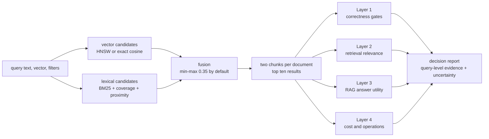
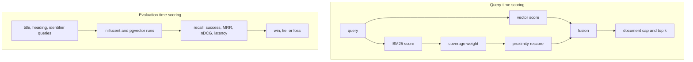
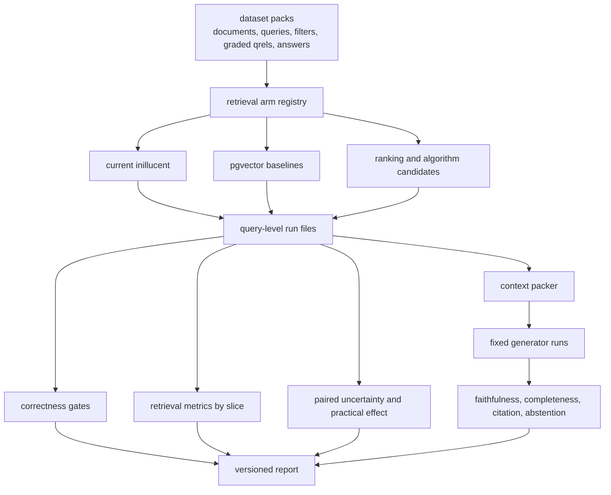
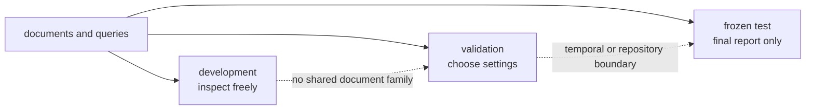
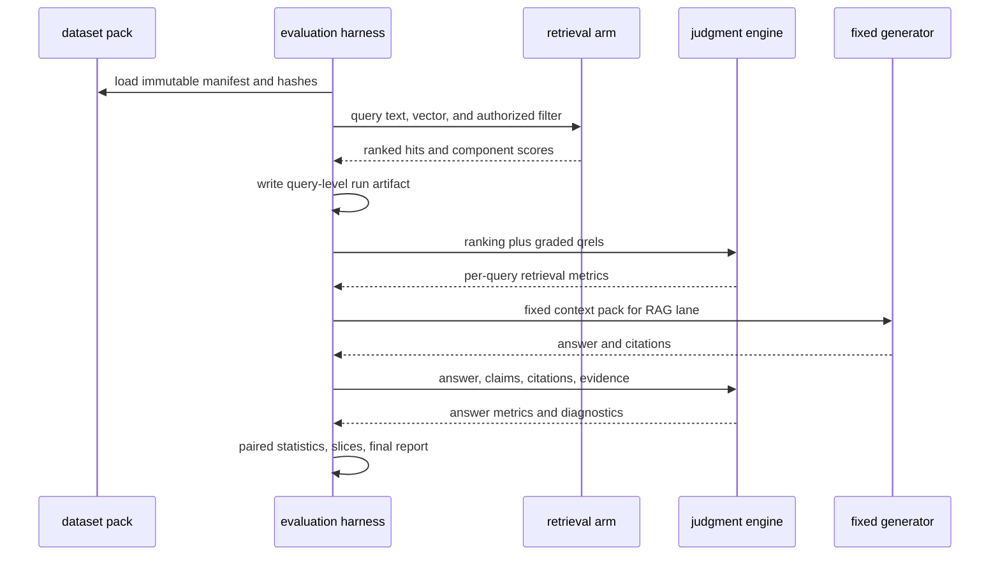

# task-1761: inillucent scoring and retrieval evaluation



## Introduction

inillucent is an embedded hybrid search engine intended to give AI agents useful evidence from workplace knowledge: wiki pages, chat, issues, source code, design files, and boards. It combines dense semantic retrieval, lexical retrieval, metadata filters, and result fusion inside the calling process. Its existing grading harness is unusually strong for a young search engine: it compares byte-identical vectors against PostgreSQL plus pgvector, uses exhaustive cosine as an exact vector reference, verifies filters as correctness gates, and publishes every aggregate measurement in a scorecard.

This document reviews both things that “scoring” can mean in inillucent. **Query-time scoring** decides how a chunk ranks for one search. **Evaluation-time scoring** decides whether a retrieval configuration is good enough to ship. The current query-time design is a sound baseline and the current scorecard is a valuable engine-parity benchmark. The main recommendation is not to replace either. It is to add a broader, statistically defensible evaluation system around them so a score means “this helps an agent answer real questions,” not only “this beat one pgvector configuration on one constructed corpus.”

This is a research and design deliverable. It recommends experiments and an implementation sequence; it does not change inillucent's current defaults.

## Goals and non-goals

### Goals

- Describe the current query-time ranking and evaluation-time grading systems precisely enough that a reader can reproduce what each number means.
- Preserve the existing scorecard as a fast, deterministic parity and regression lane.
- Add relevance judgments that distinguish an answer-bearing passage from a merely related passage.
- Evaluate the retrieval system on real or human-reviewed queries, hard synthetic cases, public out-of-domain benchmarks, and end-to-end RAG outcomes.
- Save query-level rankings and timings so misses can be diagnosed and configuration differences can be tested as paired observations.
- Replace the fixed numerical tie tolerance with confidence intervals, paired significance tests, and a minimum practically important difference.
- Make query types, corpus slices, filtering behavior, and resource costs visible so a global average cannot conceal a critical regression.
- Define a prioritized experiment ladder for lexical, dense, hybrid, reranking, chunking, and vector-index approaches.
- Keep the evaluation cheap enough to run in layers: seconds for local correctness, minutes for retrieval regression, and an explicitly scheduled full RAG or public-benchmark run.

### Non-goals

- Implementing any algorithm or changing a production default in this ticket.
- Declaring a new retrieval method superior from published numbers alone. External research identifies candidates; inillucent's own frozen evaluation decides what ships.
- Replacing the current pgvector comparison. It answers a useful product question and should remain.
- Turning inillucent into a distributed database, transactional store, or general SQL engine.
- Requiring a neural reranker, learned sparse model, or large language model in the core library. These are experiment arms and optional pipeline stages.
- Optimizing for billion-vector or larger-than-memory corpora before an observed workload requires it.
- Treating an automatic LLM judge as unquestionable ground truth.

## Definitions

| Term | Meaning in this design |
|---|---|
| Retrieval-augmented generation, or RAG | A system that retrieves passages from an external corpus and gives them to a language model as evidence for an answer. Retrieval can fail even when generation is good, and generation can fail even when retrieval is good, so the two must be measured separately. |
| Document | One logical source item such as a page, issue, file, thread, or board. A document can contain many chunks. |
| Chunk or passage | The unit returned by search. A document is split into chunks so the retriever can return focused evidence instead of an entire long item. |
| Query | The user's information need expressed as text, plus optional metadata filters. A benchmark query may also include an expected answer and evidence annotations. |
| Relevance judgment or qrel | A statement that a particular document, passage, text span, or claim is relevant to a query. Graded qrels distinguish degrees such as irrelevant, related, useful, and directly answer-bearing. |
| Evidence span | The exact character or token range that supports an answer. Span-level evidence remains meaningful if chunk boundaries change. |
| Dense retrieval | Retrieval using one or more learned numeric vectors. Semantically similar text can match without sharing exact words. inillucent currently uses one 768-dimensional vector per chunk. |
| Sparse or lexical retrieval | Retrieval through terms in an inverted index. It is strong for exact identifiers and shared vocabulary. inillucent currently uses BM25 plus coverage and proximity adjustments. |
| BM25 | A lexical scoring function that rewards rare matching terms, saturates repeated occurrences, and normalizes for passage length. |
| BM25F | A BM25 extension that scores fields such as title, heading, and body with separate weights and length normalization. It should be tested only on held-out human queries because title-derived benchmark labels would make title weighting circular. |
| Learned sparse retrieval | A neural model, such as SPLADE, that produces a sparse weighted vocabulary vector. It can add semantically related expansion terms while still using an inverted index. |
| Late interaction | A retrieval method, such as ColBERT, that keeps multiple token-level vectors and compares them at query time instead of compressing the whole passage into one vector. It usually improves matching detail at higher storage and compute cost. |
| Candidate retrieval | The fast first stage that returns a reasonably large set, for example the top 50 or 100 chunks. A slower reranker can then reorder that small set. |
| Cross-encoder reranker | A model that reads a query and candidate passage together and predicts relevance. It can model fine interactions but is too expensive to score the whole corpus. |
| HNSW | Hierarchical Navigable Small World, the in-memory graph index used by inillucent and pgvector for approximate nearest-neighbor search. |
| Exhaustive search | Exact comparison of the query vector with every passing vector. It is the vector-recall ground truth and is often the fastest path for selective filters at inillucent's current scale. |
| Recall at k | The share of known relevant results found in the first `k` results. For approximate-vector testing, inillucent compares against the exact top `k`; for RAG, evidence recall asks how much required evidence was retrieved. |
| Precision at k | The share of the first `k` results that is relevant. It detects a list filled with topical but non-answering material. |
| Success at k | Whether at least one relevant result appears in the first `k`. It is easy to understand but does not reward finding all required evidence. |
| Mean reciprocal rank, or MRR | The average reciprocal position of the first relevant result. Rank one contributes 1, rank two contributes 0.5, and no relevant result contributes 0. |
| Normalized discounted cumulative gain, or nDCG | A ranking metric that gives more credit to highly relevant items near the top and can use graded rather than binary relevance. |
| Reciprocal Rank Fusion, or RRF | A method that combines result lists using position rather than raw score. It is robust to incompatible score scales but discards score magnitude. |
| Score fusion | A weighted combination of normalized vector and lexical scores. inillucent currently defaults to per-list min-max scaling with vector weight 0.35. |
| Hard negative | A result that looks relevant because it shares topic or vocabulary but does not answer the query. Hard negatives reveal ranking weaknesses that random irrelevant chunks do not. |
| Ablation | A controlled experiment that changes or removes one component while holding everything else fixed. |
| Slice | A subset of benchmark queries with a property such as source, query type, filter selectivity, language, or answerability. |
| Confidence interval | A range quantifying uncertainty in an aggregate metric due to the finite query sample. |
| Paired test | A statistical comparison using each query's score under both systems. It is more sensitive and more honest than comparing two unrelated averages. |
| Minimum practical difference | The smallest improvement large enough to matter to the product, set before the test. It prevents a tiny but statistically detectable change from being called a useful win. |

## Problem statement

### Two scoring systems exist today

The repository contains a query-time scoring pipeline and a separate grading pipeline. Treating them as one creates confusion: a change can improve the engineering benchmark without improving answer quality, and a good query-time formula can look weak under a biased query set.



### Current query-time scoring

The current implementation is spread across [`bm25.rs`](../crates/inillucent-core/src/bm25.rs), [`rank.rs`](../crates/inillucent-core/src/rank.rs), [`index.rs`](../crates/inillucent-core/src/index.rs), and the vector-search modules.

| Stage | Current behavior | Current default |
|---|---|---|
| Vector candidate generation | Exact cosine for sufficiently selective filters; otherwise HNSW. Filtered queries use a wider search budget in the harness. | HNSW parameters `m = 16`, `ef_construction = 64`; harness query budget 128 unfiltered and 400 filtered. |
| Vector compression | Optional symmetric int8 codes generate candidates, followed by full-precision rescoring. | Engine default is unquantized; graded builds use quantization where requested. Oversample is 3.0. |
| Lexical candidate generation | BM25 over any matched analyzed term, with English stemming and identifier-aware tokenization. | `k1 = 1.2`, `b = 0.75`. |
| Query coverage | BM25 is multiplied by the matched share of query inverse-document-frequency mass raised to an exponent. | Exponent 3.0. |
| Proximity | Leading lexical hits are multiplied by a factor derived from the smallest token window holding matched query terms. | Weight 1.0, applied to the first `6k` lexical hits. |
| Prefix matching | A query term may expand to dictionary terms sharing its prefix. | Off after measuring worse on the full corpus. |
| Tiering | Optionally sort by count of matched query terms before lexical score. | Off; coverage performs better on the current benchmark. |
| Candidate depth | Vector and lexical stages each return candidates before fusion. | 50 from each side. |
| Fusion | RRF, per-list min-max score fusion, or maximum-scaled convex fusion. | Min-max score fusion, vector weight 0.35. |
| Diversity | Limit repeated chunks from one document. | At most two chunks per document. |
| Final output | Sort by fused score and truncate. | Top 10 in graded hybrid retrieval. |

The current design has several good properties:

- Exact vector search is a first-class production path rather than only a test oracle.
- Filter predicates are enforced during graph traversal and result admission, not applied only after a fixed global candidate list.
- BM25 returns partial matches, while coverage and proximity recover useful precision without the all-terms hard gate used by the PostgreSQL baseline.
- The lexical and vector lists can be fused with the same policy in both inillucent and pgvector, keeping the comparison fair.
- Query-time settings are separable from built index structures, so many ranking arms can reuse one expensive index build.
- Deterministic tie-breaking makes repeated runs comparable.

The surrounding engine components are part of the scoring system because they define which evidence is available and what a score can safely assume:

| Module | Current responsibility | Effect on retrieval evidence |
|---|---|---|
| [`store.rs`](../crates/inillucent-core/src/store.rs) | Stores documents, chunks, text, and dictionary-encoded metadata columns. | Gives filters a compact integer representation and maps chunk hits back to their documents. |
| [`filter.rs`](../crates/inillucent-core/src/filter.rs) | Represents source, author, label, date, and deletion predicates; compiles them for repeated checks. | Defines the authorized candidate set and exposes passing counts used by the exact-versus-graph cost model. |
| [`vectors.rs`](../crates/inillucent-core/src/vectors.rs) and [`distance.rs`](../crates/inillucent-core/src/distance.rs) | Hold normalized vectors contiguously and compute dot-product cosine distance. | Provide the exact numeric similarity used by both flat and graph retrieval. |
| [`flat.rs`](../crates/inillucent-core/src/flat.rs) | Scans every passing vector and reduces candidates to top `k`. | Supplies both an exact production path and the oracle for approximate-vector recall. |
| [`hnsw.rs`](../crates/inillucent-core/src/hnsw.rs) | Builds and walks the approximate graph while expanding rejected nodes but admitting only filter-passing nodes. | Trades distance computations for speed without allowing the predicate to disconnect traversal. |
| [`quantize.rs`](../crates/inillucent-core/src/quantize.rs) | Builds int8 codes and rescoring candidates against full-precision vectors. | Reduces first-pass memory bandwidth while preserving a full-precision final distance. |
| [`tokenize.rs`](../crates/inillucent-core/src/tokenize.rs) | English stemming, stopword handling, and preservation/splitting of identifier-like terms. | Controls lexical vocabulary, exact-token behavior, and language support. |
| [`bm25.rs`](../crates/inillucent-core/src/bm25.rs) | Inverted index, term positions, BM25, coverage, proximity, prefix, and tiering. | Produces the lexical candidate list and its raw relevance scores. |
| [`rank.rs`](../crates/inillucent-core/src/rank.rs) | RRF and score fusion, origin tracking, deterministic sorting, and document cap. | Produces the final hybrid order. |
| [`embed.rs`](../crates/inillucent-core/src/embed.rs) and [`embed_onnx.rs`](../crates/inillucent-core/src/embed_onnx.rs) | Define the embedding boundary and run Nomic in-process through ONNX Runtime when enabled. | Apply distinct document/query prefixes, dimensionality, pooling, and normalization. |
| [`persist.rs`](../crates/inillucent-core/src/persist.rs) | Saves and reopens versioned store, vector, graph, and configuration data. | Makes the embedded index restartable without a database server; lexical postings and codes are deterministically rebuilt on open. |
| [`index.rs`](../crates/inillucent-core/src/index.rs) | Composes all stages behind the public `Index` API. | Owns defaults, exact/graph routing, candidates, fusion, and final output. |

There are also hypotheses worth testing rather than silently accepting as universal defaults:

- A single vector weight of 0.35 serves conceptual questions, identifiers, code queries, and long natural-language questions even though those intents need different lexical/semantic balance.
- Per-list min-max normalization treats the best item in every non-flat list as 1.0. A weak candidate list therefore receives the same maximum normalized score as a strong one; the normalization cannot express absolute confidence.
- A fixed depth of 50 per side and a fixed cap of two chunks per document are suitable for every answer and every context budget.
- One global BM25 average length and one English analyzer serve source types with radically different structure, including prose, chat, issues, and code.
- Rescoring only the current top `6k` lexical candidates cannot miss a lower-ranked passage whose proximity boost would move it into the final list.
- Query coverage should ignore out-of-vocabulary query terms and use the current approximate union document frequency when prefix expansion is enabled.

These are not proven bugs. They are experiment candidates.

### Current evaluation-time scoring

The current benchmark is implemented by [`queryset.rs`](../crates/inillucent-bench/src/queryset.rs), [`scenarios.rs`](../crates/inillucent-bench/src/scenarios.rs), [`metrics.rs`](../crates/inillucent-bench/src/metrics.rs), [`report.rs`](../crates/inillucent-bench/src/report.rs), and [`tune.rs`](../crates/inillucent-bench/src/tune.rs).

It builds 185,078 chunks from public material representing six workplace sources, embeds them once with `nomic-embed-text-v1.5`, and gives identical vectors to inillucent and PostgreSQL. It currently grades:

- unfiltered HNSW recall against exhaustive cosine;
- an `ef_search` recall/latency sweep;
- filtered vector recall and result count for each source;
- filter correctness across eleven filter shapes;
- lexical success, MRR, and result count on headings and rare identifiers;
- hybrid nDCG, success at one and ten, and MRR on titles and headings;
- fusion methods;
- quantization and Matryoshka dimensions;
- warm query latency;
- behavioral invariants.

The pgvector baseline is deliberately two baselines, not one:

| Baseline | Filtered query | Unfiltered query | Role in the card |
|---|---|---|---|
| Extension defaults | `ef_search = 40`; no iterative scan tuning | Extension defaults | Shows the behavior of an untuned installation. Nothing should claim victory solely against this column. |
| Correctly configured | `iterative_scan = relaxed_order`, `ef_search = max(400, requested rows)`, `max_scan_tuples = 40,000`, `scan_mem_multiplier = 4` | iterative scan off, `ef_search = max(100, requested rows)`, other scan settings reset | Defines the comparison bar. Every headline judgment uses the better pgvector result, not the weaker default. |

The three existing objective ground truths are:

1. Exact cosine rankings for approximate-vector recall.
2. Corpus-derived membership for filter and identifier correctness.
3. Document identity inferred from a title or heading, where chunks belonging to the selected document or heading count as correct.

The benchmark uses separate random seeds for tuning and grading, which is a useful holdout mechanism. The current generated card reports 26 comparable wins, 4 ties, 0 losses, and both correctness gates passing.

Snapshot of the card this design reviewed:

| Area | Current measurement |
|---|---|
| Unfiltered approximation | recall@10 `0.9111`; recall@50 `0.8968` against exhaustive cosine. |
| Search-budget sweep | recall@10 moves from `0.8600` at `ef_search = 64` to `0.9775` at 512, while median search time moves from `0.3934 ms` to `1.762 ms`. |
| Lexical natural language | success@10 `0.9222`; MRR `0.7153`. |
| Lexical identifiers | success@10 `0.6222`; MRR `0.5509`. |
| Hybrid document identity | nDCG@10 `0.9816`; success@1 `0.9722`; success@10 `0.9944`. |
| Hybrid natural language | nDCG@10 `0.7588`; success@1 `0.6222`; success@10 `0.9222`; MRR `0.7196`. |
| Correctness | 2,500 checked filter-returned rows pass; behavioral invariants pass. |
| Warm latency | unfiltered inillucent median `0.6061 ms`; filtered Slack median `0.5651 ms`. |
| Build and footprint | 120 seconds; 568.6 MB f32 vectors; 142.9 MB int8 codes; 494,179 lexical terms; 11,643,704 postings. |

These figures are evidence for this corpus and run, not universal targets. Their value is that the proposed evaluation can preserve and explain them while adding missing product evidence.

### What the current benchmark proves well

| Claim | Evidence quality today |
|---|---|
| inillucent enforces its filters | Strong. Every returned row is checked, including an absent filter value. |
| HNSW approximates exact cosine at a given search budget | Strong for this corpus and query-vector sample. The exact scan is an appropriate oracle. |
| Filter-aware inillucent retrieval avoids pgvector's post-filter candidate loss | Strong for the source filters and pgvector configurations tested. |
| The engine is deterministic and handles pathological inputs | Strong as a regression gate. |
| int8 and dimension choices have measured memory/recall trade-offs | Useful on the sampled corpus, with scope explicitly stated. |
| Current ranking changes outperform the prior configuration on current query generators | Strong as an ablation result. |
| The shipped configuration broadly improves AI-agent RAG | Not yet established. The benchmark does not grade answer-bearing evidence or downstream answers. |

### Gaps that limit the meaning of “26 wins”

| Gap | Why it matters | Priority |
|---|---|---|
| A fixed `1e-4` difference defines a tie | The tolerance is asserted to be below sampling noise but no uncertainty is computed. With about 90 heading queries, metric steps are much larger than `1e-4`. Point-estimate wins can be noise. | Critical |
| Every comparable row has one vote | Correlated metrics on the same queries are counted separately. nDCG, success, MRR, and result count can turn one behavior into several “wins.” | Critical |
| Result count is treated as higher-is-better | Returning 50 irrelevant lexical hits is not better than returning 10 useful hits. Count is a diagnostic and sometimes a completeness gate, not a relevance objective. | Critical |
| Title-derived relevance marks every chunk of the document correct | A chunk from the right document can be unrelated to the question. RAG needs the answer-bearing passage, not merely the right container. | Critical |
| Queries are derived from the documents they retrieve | Titles and headings share language with their source. This favors lexical overlap and cannot represent vocabulary gaps, user shorthand, or mistaken terminology. | Critical |
| No graded hard negatives | A topically related passage and a passage that directly answers the question are both simply right or wrong. NIST's TREC passage judgments explicitly distinguish “related” from answer-relevant material. | High |
| No end-to-end RAG outcome | Retrieval metrics cannot prove that an agent receives enough focused evidence, uses it faithfully, cites it, or abstains when evidence is absent. | High |
| One corpus, language, and embedding model | The comparison is internally fair but says little about out-of-domain generalization, code search, multilingual content, or another embedding model. | High |
| No real-query distribution | There is no measurement of how often conceptual, exact-token, filtered, ambiguous, follow-up, multi-hop, or unanswerable queries occur in the intended product. | High |
| Limited filter-quality coverage | Source filters get relevance tests. More complex author, label, date, and combined filters are correctness-tested but not ranked-relevance-tested across selectivities. | High |
| No saved query-level run files | Aggregate JSON cannot support paired statistics, failure clustering, top-result inspection, or later re-judging without rerunning retrieval. | High |
| Persistence omits several ranking settings | `SavedConfig` persists prefix matching but not fusion, vector weight, lexical coverage, lexical proximity, or tiering. A non-default index can silently reopen with default ranking behavior. | High |
| Tuning and testing share one corpus and generator family | Seed separation helps, but repeated researcher choices can still overfit the same construction process. There is no frozen test set or multiple-comparison control. | High |
| Baselines are narrow | The PostgreSQL lexical baseline uses all-term `&` semantics; an OR/cover-density or stronger hybrid baseline is not measured. There is no reranker, learned sparse, or late-interaction arm. | Medium |
| Latency mixes algorithm and deployment effects | In-process inillucent versus loopback PostgreSQL is a valid product comparison but not a pure index-speed comparison. Both views should be shown separately. | Medium |
| Only warm, mostly single-query latency is visible | Agents create bursts and concurrent searches. Cold load, p99, throughput, embedding, reranking, and total context cost are not first-class. | Medium |
| Chunking is fixed | Relevance labels tied to chunk IDs make it hard to compare chunk size, overlap, parent-child expansion, or late chunking fairly. | Medium |
| Run provenance is incomplete | The scorecard does not contain a complete git revision, corpus hash, model hash, hardware state, command line, seed set, and per-query output. | Medium |

The external evidence supports broadening the benchmark:

- [BEIR](https://arxiv.org/abs/2104.08663) found that retrieval methods vary substantially across 18 domains and that reranking and late-interaction methods often generalize well at higher cost.
- [MTEB](https://arxiv.org/abs/2210.07316) found no embedding method dominates across tasks; the later [MMTEB](https://arxiv.org/abs/2502.13595) expands coverage to long-document, code, instruction-following, and multilingual retrieval.
- [TREC Deep Learning 2023](https://trec.nist.gov/data/deep2023.html) uses human graded judgments and distinguishes a merely related passage from one that answers the question. Its overview also reports that synthetic queries still required human screening.
- [BRIGHT](https://arxiv.org/abs/2407.12883) shows that reasoning-intensive real-world queries, including coding questions, are far harder than ordinary lexical or semantic matching. The newer [BRIGHT-Pro](https://arxiv.org/abs/2605.04018) argues that agentic search needs complementary multi-aspect evidence and iterative-search evaluation, not only one relevant passage.
- [CodeSearchNet](https://arxiv.org/abs/1909.09436) uses expert relevance labels for natural-language-to-code search, a materially different task from finding rare code identifiers.
- [RAGAS](https://aclanthology.org/2024.eacl-demo.16/), [RAGChecker](https://arxiv.org/abs/2408.08067), and [RAGBench](https://arxiv.org/abs/2407.11005) all separate retrieval quality from answer faithfulness and completeness. RAGBench also cautions that generic LLM-based evaluation can underperform a task-trained evaluator, so automatic judges require human calibration.

## Architectural overview

The recommendation is a layered evaluation architecture. The current `grade` remains Layer 0, a parity and regression card. New layers answer progressively broader questions and run less frequently as cost rises.



### Evaluation layers

| Layer | Question | Typical cost | Shipping role |
|---|---|---|---|
| 0. Current parity card | Did inillucent preserve its exact-vector, filter, pgvector-parity, and performance properties? | Minutes | Required regression lane; unchanged in purpose. |
| 1. Retrieval relevance | Does this configuration retrieve answer-bearing evidence on frozen queries and qrels? | Minutes to an hour | Primary ranking decision. |
| 2. Public and stress generalization | Does it hold across code, reasoning, long-tail, multilingual if in scope, scale, typo, filter, and negative-query packs? | Scheduled | Prevents one-corpus overfitting and defines supported boundaries. |
| 3. End-to-end RAG and agent utility | Does a fixed agent or generator produce correct, complete, faithful answers from the retrieved context? | Expensive | Required before claiming product RAG improvement. |
| 4. Operational envelope | What are warm/cold latency, p99, throughput, memory, index/update cost, model cost, and context tokens? | Scheduled | Ensures quality gains are affordable and deployable. |

## Detailed technical sections

### Components and interfaces

#### 1. Dataset packs

A dataset pack is an immutable, versioned evaluation input. It separates corpus construction from evaluation and allows the same queries to grade every retrieval arm.

```text
eval/
  packs/
    workplace-v1/
      manifest.json
      documents.jsonl
      queries.jsonl
      qrels.jsonl
      answers.jsonl
      splits.json
    stress-v1/
    beir-subset-v1/
    code-search-v1/
  runs/
    <pack>/<run-id>/
      manifest.json
      ranking.jsonl
      per-query.jsonl
      aggregate.json
      report.md
```

Recommended pack families:

| Pack | Source | Purpose |
|---|---|---|
| `current-parity` | Existing generated corpus and query generators | Preserve the present scorecard and historical comparability. |
| `workplace-real` | De-identified real user questions or human-authored questions over representative documents | Primary product relevance measure. Use a temporal or document split so query authors cannot copy the answer wording. |
| `workplace-reviewed-synthetic` | Questions generated from documents, then screened and rewritten by a human who did not see the retrieval output | Scale query creation while reducing generator and lexical leakage. |
| `stress` | Hand-authored deterministic cases | Exact identifiers, code symbols, typos, acronyms, renamed concepts, near-duplicates, conflicting versions, unanswerable questions, filters, deletions, and permission boundaries. |
| `public-ood` | Selected BEIR/MTEB tasks | Generalization across question answering, fact checking, scientific, finance, and forum domains. |
| `code-search` | CodeSearchNet or a repository-held-out equivalent | Natural-language-to-code retrieval rather than exact identifier lookup alone. |
| `reasoning` | BRIGHT/BRIGHT-Pro-style questions | Queries that require inference or a complementary portfolio of evidence rather than surface matching. |
| `multilingual` | MIRACL or MMTEB subset, only if multilingual support is a product goal | Makes the current English analyzer boundary explicit. [MIRACL](https://arxiv.org/abs/2210.09984) supplies native-speaker judgments across 18 languages. |

The public packs should not be collapsed into one overall leaderboard number. They answer whether a method generalizes; the product pack answers whether it helps the intended agents.

#### 2. Query and relevance schema

Ground truth should attach to documents, exact evidence spans, and claims, not only current chunk IDs. That makes chunking experiments comparable.

```json
{
  "query_id": "wp-00421",
  "text": "Why was the release job moved off the shared runner?",
  "intent": "explanation",
  "source_scope": ["confluence", "slack", "github"],
  "filter": {"updated_after": 1735689600},
  "answerable": true,
  "required_claim_ids": ["claim-71", "claim-72"],
  "tags": ["multi-source", "temporal", "natural-language"]
}
```

```json
{
  "query_id": "wp-00421",
  "document_id": "slack-thread-88",
  "span_start": 418,
  "span_end": 731,
  "relevance": 3,
  "claim_ids": ["claim-71"],
  "judgment_source": "human",
  "assessor_count": 2
}
```

Recommended relevance scale:

| Grade | Meaning |
|---|---|
| 0 | Irrelevant or misleading. |
| 1 | Related to the topic but does not help answer the question. |
| 2 | Useful supporting context but incomplete or indirect. |
| 3 | Directly answer-bearing evidence. |

This mirrors the useful distinction in TREC passage judgments: topical relatedness is not the same as answering. Disagreements between assessors should be retained, not hidden; adjudicated labels can coexist with raw labels.

For unanswerable queries, the correct evidence set is empty and the desired behavior is abstention or a calibrated “no evidence” result. These queries must not receive perfect retrieval recall merely because both reference and result are empty; they need separate negative-query metrics.

#### 3. Query taxonomy and required slices

Every query carries one primary intent and zero or more stress tags.

| Query family | What it exposes | Primary measures |
|---|---|---|
| Exact identifier | Ticket keys, hashes, paths, function names, version strings | success@1, MRR, exact-token recall |
| Conceptual natural language | Semantic paraphrase with little word overlap | nDCG@10, evidence recall, success@5 |
| Definition or lookup | One focused fact | success@1, context precision, answer correctness |
| Explanation or “why” | Supporting rationale may be spread across passages | claim recall, evidence recall, answer completeness |
| Multi-hop or multi-source | Two or more complementary evidence items are required | all-claims recall, source coverage, answer completeness |
| Code search | Natural language mapped to implementation, not only an identifier | graded nDCG, MRR, repository-held-out success |
| Temporal or freshness | Current answer conflicts with an older one | current-evidence success, stale-hit rate |
| Filtered | Same information need under source, author, label, date, or combined filters | filter correctness, filtered nDCG, rows only as a completeness diagnostic |
| Ambiguous or underspecified | Several interpretations are plausible | diversity/subtopic coverage, clarification rate |
| Typo, acronym, shorthand | User vocabulary differs from indexed vocabulary | success@k by perturbation type |
| Negative or unanswerable | No corpus evidence supports an answer | false-positive rate, abstention precision/recall |
| Long-document or cross-boundary | Evidence depends on context outside one fixed chunk | evidence-span recall, answer correctness by chunking arm |
| Near-duplicate or conflicting | Many related passages differ in authority or recency | duplicate rate, authoritative-hit rank, stale-hit rate |

Reports must show the global result and each required slice. A change cannot ship when its global mean improves by sacrificing a critical slice such as exact identifiers, filtered queries, code, or negative queries.

#### 4. Retrieval arm registry

An arm is a fully specified pipeline, not an informal label such as “hybrid.” Its identity includes:

- corpus and chunking version;
- analyzer/tokenizer version;
- embedding model, file hash, dimensionality, prefixes, and quantization;
- vector index type and all construction/search parameters;
- lexical scoring parameters and fields;
- candidate counts;
- fusion method, normalization, and weights;
- reranker model and depth;
- document cap or context-packing policy;
- random seeds and code revision.

The registry should expose the same high-level interface for every arm:

```rust
pub trait RetrievalArm {
    fn identity(&self) -> RunIdentity;
    fn search(&mut self, query: &EvalQuery, candidate_k: usize) -> Result<Vec<RankedHit>>;
}
```

This is a design sketch. The implementation can reuse the existing `SearchEngine` trait or introduce an evaluation-only adapter; the core requirement is that every arm produces the same query-level run format.

#### 5. Query-level run artifacts

Every run writes one row per ranked hit plus one row per query. Aggregate-only output is insufficient.

```json
{
  "query_id": "wp-00421",
  "rank": 1,
  "document_id": "slack-thread-88",
  "chunk_id": "slack-thread-88#3",
  "score": 0.8421,
  "vector_score": 0.7310,
  "lexical_score": 11.482,
  "origin": "both",
  "latency_ms": 1.82
}
```

Per-query outputs enable:

- paired statistical tests;
- error analysis by query family;
- later qrel corrections without rerunning retrieval;
- inspection of hard negatives and missing evidence;
- comparison of candidate recall before and after reranking;
- reproducible report regeneration.

#### 6. Metrics and decision policy

Metrics are grouped by purpose. A count of returned rows is never a relevance win.

| Purpose | Metrics | Notes |
|---|---|---|
| Correctness | filter violations, deleted-hit violations, deterministic ranking, unknown IDs, malformed input behavior | Hard gates. Any violation fails the arm. |
| Candidate retrieval | recall@50/100, all-claims recall, evidence-span recall | Answers whether a reranker had the needed evidence available. |
| Final ranking | graded nDCG@10, MRR, success@1/5/10, precision@5/10 | Graded nDCG is the primary general ranking metric. |
| Negative queries | false positive at confidence threshold, abstention precision/recall, area under risk-coverage curve | Empty reference sets are evaluated here, not treated as perfect recall. |
| Diversity and context | unique-document count, duplicate-token ratio, claim coverage, subtopic coverage, relevant tokens per context token | Evaluates what the generator actually receives. |
| RAG answer | claim completeness, faithfulness/grounding, answer correctness, citation precision/recall, abstention correctness | Always reported separately from retriever metrics. |
| Performance | p50/p95/p99, throughput at concurrency, cold open, warm open, index build/update time, peak RSS, disk bytes, context tokens, model time | Separate pure search time from embedding, reranking, process/network, and generation time. |

Decision rules:

1. Choose one primary metric per query family before running the experiment. Diagnostic metrics do not each become another “vote.”
2. Compare arms per query using a paired bootstrap confidence interval and a paired randomization test. IR literature has long found paired randomization and bootstrap appropriate; see [Smucker, Allan, and Carterette](https://ciir-publications.cs.umass.edu/pub/web/getpdf.php?id=744).
3. Define a minimum practical improvement before the run, for example `+0.01 nDCG@10` or a relative gain agreed from product impact. Exact thresholds should be selected from observed variance and user impact, not copied from this example.
4. Declare **better** only when the confidence interval clears both zero and the practical threshold. Declare **equivalent** only inside a predeclared equivalence margin. Otherwise report **inconclusive**.
5. Apply a multiple-comparison correction or require confirmation on a fresh holdout when sweeping many arms.
6. Require no regression beyond the slice-specific tolerance on correctness, exact identifiers, filters, negative queries, and p95 latency/resource budgets.
7. Keep raw point estimates and query counts visible. Statistical machinery must explain evidence, not hide it.

The headline report should therefore say something like “primary nDCG improved by 0.018, 95% paired interval 0.010 to 0.026, no critical slice regressed,” not “won eight metrics.”

#### 7. Split and anti-overfitting policy



- Split by document family, repository, or time, not by random chunk. Near-duplicate chunks from one document must not cross splits.
- Tune weights, thresholds, and query transformations on validation only.
- Keep the final product test qrels hidden from routine tuning where feasible.
- Use at least three query-generation seeds for synthetic sets and report their variation.
- Record every tried arm. Do not promote only the best of dozens without confirmation on a fresh holdout.
- Freeze a small “never forget” regression set of previously observed failures. It supplements, but never replaces, the unbiased test set.

#### 8. End-to-end RAG evaluation

Retriever quality is necessary but not sufficient. [RAGChecker](https://arxiv.org/abs/2408.08067) argues for claim-level diagnosis of retrieval and generation, while [Lost in the Middle](https://arxiv.org/abs/2307.03172) shows that a model's use of evidence depends on where it appears in a long context.

The end-to-end lane should hold these constant while changing only the retrieval arm:

- generator model and exact revision;
- system prompt and tool description;
- temperature, seed where supported, and maximum output;
- context token budget and packing policy;
- query set and answer/evidence labels.

Run multiple generation repetitions when decoding is nondeterministic. Report:

- whether every required claim is present;
- whether every answer claim is supported by retrieved evidence;
- whether citations point to passages that actually support the associated claims;
- whether the system declines unanswerable questions;
- answer latency and token cost;
- retrieval-only failure, context-packing failure, and generation failure as separate diagnoses.

Automatic claim extraction and entailment can scale the lane, but a stratified human audit must calibrate the judge and publish agreement. An LLM judge is a measurement instrument, not the truth.

### Search algorithms and ranking approaches to test

The experiment order matters more than the length of the candidate list. Test the cheapest, most interpretable change that can answer the question before adopting a new index family.

#### Priority 0: fix evaluation before optimizing

| Experiment | Why first | Build impact |
|---|---|---|
| Frozen qrels, evidence spans, and real/human-reviewed queries | Every later algorithm choice depends on trustworthy labels. | Harness and data only. |
| Query-level run files and paired uncertainty | Prevents noise from being called a win and makes failures inspectable. | Harness only. |
| Remove result count from win counting | More rows are not more relevance. Keep count as a diagnostic. | Report only. |
| Separate primary metric from diagnostics | Stops correlated metrics from multiplying one behavior into several votes. | Report only. |

#### Priority 1: low-cost ranking improvements on the current index

| Candidate | Hypothesis | Required comparison |
|---|---|---|
| Query-adaptive fusion | Identifiers should lean lexical, paraphrases dense, and code or long questions may need another balance. A small calibrated model can use query length, identifier shape, lexical result count, score margins, and vector/lexical agreement. | Fixed 0.35, RRF, several global weights, and adaptive fusion on a held-out test. Include calibration and p95 cost. |
| Better score calibration | Per-list min-max always gives a non-flat list a 1.0 leader. Quantile, z-score, sigmoid, or learned calibration may express confidence more faithfully. | Candidate recall unchanged; compare final nDCG, negative-query false positives, and stability as candidate depth changes. |
| Candidate-depth and document-cap sweep | `50 + 50`, cap 2, and top 10 were inherited choices. A larger candidate pool may help reranking; a context-token budget may be better than a chunk count. | Depth 20/50/100/200, cap 1/2/3, and token-budget packing. Measure candidate recall, duplicate ratio, final quality, and latency. |
| BM25 parameters by source or field | Code, chat, and long design text have different length and term distributions. | Global BM25 versus source-aware parameters, without changing qrels. Avoid large grids without a holdout. |
| BM25F title/heading/body | Human queries may benefit from structural fields. The previous benchmark correctly rejected this because title/heading-derived labels would leak the answer. | Test only on real or human-reviewed queries; compare body-only, title+body, and heading+body with field ablations. [BM25F](https://dl.acm.org/doi/10.1145/1031171.1031181) is the standard fielded formulation. |
| Phrase and ordered-window features | The current proximity factor may be improved by explicit phrase or ordered-window evidence. | Current smallest-window score versus phrase/order features; inspect long queries and repeated terms. |
| Typo/acronym expansion | Workplace queries often contain shorthand and misspellings. | No expansion, analyzer expansion, and query-time expansion on a frozen perturbation pack. Watch exact-identifier regressions. |
| Context selection with MMR or duplicate collapse | The generator benefits from non-redundant evidence, not ten similar chunks. [Maximal Marginal Relevance](https://doi.org/10.1145/290941.291025) balances relevance and novelty. | Current per-document cap versus MMR/duplicate collapse under the same token budget; measure claim coverage and answer completeness. |

The hybrid-fusion experiment is particularly justified. The existing code cites and partially implements the family studied by [Bruch, Gai, and Ingber](https://arxiv.org/abs/2210.11934), who found convex combinations can outperform RRF and can be tuned sample-efficiently. inillucent should extend that work to query-adaptive weights only after establishing a proper train/validation/test split.

#### Priority 2: reranking and representation changes

| Candidate | What it adds | Costs and risks |
|---|---|---|
| Cross-encoder or monoT5-style reranker | Reads query and passage together, often resolving fine relevance distinctions missed by independent encoders. | Model dependency and tens to hundreds of candidate inferences. Measure candidate recall first: a reranker cannot recover absent evidence. |
| Learned sparse retrieval with SPLADE | Neural term weighting and expansion while retaining inverted-index retrieval. [SPLADE v2](https://arxiv.org/abs/2109.10086) reports strong BEIR/TREC results. | New model, vocabulary, postings shape, index size, and build path. Compare against BM25 and hybrid, not dense alone. |
| Late interaction with ColBERTv2 | Token-level vectors preserve detailed query-passage interactions. [ColBERTv2](https://aclanthology.org/2022.naacl-main.272/) reports strong in- and out-of-domain quality with compression. | Far more vectors and query compute than one-vector-per-chunk. Measure bytes, build time, and p95 alongside nDCG. |
| Embedding-model matrix | MTEB/BEIR show no universal winner. Shortlist models by license, ONNX availability, dimensions, context length, and domain evidence, then run identical qrels. | Every document embedding arm requires an expensive rebuild and more disk. Use a small stratified pack before the full corpus. |
| HyDE or reasoned query expansion | Generate a hypothetical answer/document or reasoning trace before dense retrieval. [HyDE](https://aclanthology.org/2023.acl-long.99/) and BRIGHT show query-side reasoning can improve difficult zero-shot retrieval. | LLM latency, cost, and hallucinated constraints. It must be an optional agent-side arm, evaluated on negative and exact-token queries. |
| Late chunking | Embed long document context before pooling individual chunk vectors. [Late Chunking](https://arxiv.org/abs/2409.04701) targets context lost by independently embedding chunks. | Requires a compatible long-context embedder and changes the indexing pipeline. Use span-level qrels so the comparison is not tied to old chunks. |
| Parent-child or adjacent-window retrieval | Retrieve a focused child chunk, then attach limited surrounding or parent context. | More context tokens and possible dilution. Grade evidence completeness per token, not raw document recall. |

Dense retrieval remains important: [DPR](https://aclanthology.org/2020.emnlp-main.550/) established that learned dense passage retrieval can outperform strong BM25 on open-domain QA. The lesson is not to replace lexical search, because inillucent's identifiers prove its value; it is to test complementary representations under the actual query mix.

#### Priority 3: vector-index alternatives only when scale or freshness requires them

| Candidate | When it becomes relevant | Recommendation now |
|---|---|---|
| Current HNSW plus exact filtered scan | Corpus fits in memory and exact scanning is fast for selective filters. | Keep as the primary design. It already performs well and is directly validated against exhaustive cosine. |
| ACORN-style predicate-aware construction/traversal | Complex filters on larger passing sets make current traversal expensive or reduce recall. [ACORN](https://arxiv.org/abs/2403.04871) reports predicate-agnostic filtered search gains. | Add as an experiment only after complex-filter recall/throughput packs expose a gap. Current inillucent borrows the traversal idea but not the full construction method. |
| DiskANN/Vamana | The corpus no longer fits memory and SSD-based search is required. | Not justified at 185k chunks and under roughly 2 GB. Introduce a scale gate before engineering it. |
| FreshDiskANN or another dynamic graph | Incremental updates and freshness become a product requirement. [FreshDiskANN](https://arxiv.org/abs/2105.09613) is designed for real-time graph updates. | Evaluate when rebuild time or update staleness violates an explicit service objective. It solves operations, not ranking relevance by itself. |
| IVF/PQ | Multi-million scale makes memory and build time more important than current HNSW behavior. | Benchmark only at representative larger scales. At the current corpus it is likely complexity without product benefit. |

The scale gate should be explicit, for example: investigate a disk index when peak resident memory exceeds the deployment budget, p95 HNSW latency exceeds the service objective at target concurrency, or index rebuild freshness exceeds the allowed staleness window.

### Data flows and security



Security and data-governance requirements:

- A real workplace pack may contain sensitive document text and user queries. Store it outside the public repository, with stable opaque IDs and access controls.
- Do not send private corpus text or queries to an external embedding, reranking, or judge API unless that provider and data path are explicitly approved.
- Redaction must happen before the immutable pack is built; a report should contain IDs and bounded excerpts, not secrets.
- Permission filters are correctness gates. Cross-tenant or unauthorized hits fail the run even if hidden later by the UI.
- Query logs used to form a real-query distribution require retention, consent, and de-identification rules.
- Model-judge prompts and outputs can themselves contain retrieved private text and must inherit the pack's storage rules.
- Run manifests must identify whether every model was local or remote and whether content left the machine.

### Reporting and provenance

Every report must include:

- code commit and dirty-state flag;
- complete command and arm configuration;
- dataset-pack version and hashes;
- embedding/reranker/generator model file hashes;
- query counts overall and per slice;
- per-query run artifact paths;
- hardware, operating system, thread count, and whether another heavy workload was active;
- point estimates, confidence intervals, practical thresholds, and paired-test results;
- correctness gates and critical-slice regressions at the top;
- a cost table separated into indexing, query embedding, candidate retrieval, reranking, context packing, and generation;
- a clear statement of what the run does not prove.

The existing Markdown and JSON scorecard outputs should remain. Add a machine-readable run bundle rather than replacing the human card.

## Alternatives considered

| Alternative | Advantages | Disadvantages | Decision |
|---|---|---|---|
| Keep the current scorecard unchanged as the only decision system | Cheap, reproducible, historical continuity | Does not measure answer-bearing evidence, uncertainty, real queries, or RAG outcomes | Reject as the only system; keep as Layer 0. |
| Replace the current synthetic corpus entirely with public benchmarks | Standardized qrels and external comparability | Public datasets do not reproduce the six-source workplace workload or filter shapes | Reject; use both product and public packs. |
| Use only real production queries | Best match to actual usage | Sparse labels, privacy risk, changing distribution, weak coverage of rare failures | Reject as the only pack; make it the primary product pack plus stress and public packs. |
| Generate all queries and qrels with an LLM | Scales cheaply | Generator bias, lexical leakage, uncertain judgments, and circular evaluation | Use only with held-out generation and human review/calibration. |
| Use end-to-end answer quality only | Directly measures what users see | Cannot diagnose whether retrieval, packing, or generation failed; expensive and noisy | Reject as the only metric; keep as Layer 3. |
| Use retrieval metrics only | Fast and attributable | Can optimize a ranking that the generator cannot use or that contains distracting context | Reject as the complete product verdict. |
| Produce one weighted overall score | Easy headline and ranking | Weights hide trade-offs and correlated metrics create false precision | Do not use for shipping. Prefer a primary metric plus gates and required slices. |
| Adopt a neural reranker immediately | Likely quality upside on some datasets | No trustworthy product qrels yet; adds latency and model complexity before candidate recall is understood | Defer until Priority 0 evaluation work is complete. |
| Replace HNSW with DiskANN now | Better path to larger-than-memory scale | Current corpus fits in memory and vector indexing is not the largest relevance gap | Defer behind an explicit scale gate. |
| Add title weighting immediately | Standard and likely useful | Current title-derived labels would reward the benchmark answer directly | Test later on non-title-derived held-out queries only. |
| Treat every numeric improvement as a win | Simple report | Confuses noise with evidence and rewards trivial differences | Replace with paired uncertainty, practical effect, and inconclusive outcomes. |

## Testing strategy

The implementation of this TDD should favor functional and integration tests. Metric unit tests remain useful, but the critical guarantee is that a complete pack produces reproducible runs, statistics, and reports.

### Functional test ladder

1. **Tiny deterministic pack.** Ten documents and queries exercise every relevance grade, an unanswerable query, a filter, a duplicate, and multi-hop evidence. Run the full harness in seconds.
2. **Current parity pack.** Reproduce the existing scorecard numbers within declared deterministic or hardware tolerances.
3. **Small product pack.** Run every ranking-only arm against frozen qrels without rebuilding unchanged indexes.
4. **Full product test.** Confirm the chosen arm once on the frozen test set.
5. **Public and stress packs.** Confirm generalization and supported boundaries.
6. **End-to-end RAG lane.** Run the selected finalists through the fixed generator and claim/citation evaluation.
7. **Operational envelope.** Run cold/warm and concurrency benchmarks on an otherwise quiet machine.

### Required automated cases

| Test | Expected behavior |
|---|---|
| Pack hash validation | Any changed document, query, qrel, answer, or split invalidates the manifest. |
| Split leakage check | No document family, repository, or configured near-duplicate group crosses development, validation, and test. |
| Span-to-chunk mapping | Rechunking maps the same evidence spans to new chunks without changing the underlying qrels. |
| Graded metric parity | nDCG, MRR, recall, precision, and success agree with a trusted reference such as `trec_eval` on a golden run. |
| Negative-query semantics | Empty qrels do not become automatic perfect recall; false positives and abstention are evaluated separately. |
| Result-count semantics | “Rows returned” renders as diagnostic and never affects better/tie/worse judgment. |
| Paired bootstrap | A known better synthetic arm yields the expected interval; identical arms yield an interval centered at zero. |
| Paired randomization | P-values match a checked golden example and are deterministic under a fixed seed. |
| Practical threshold | A statistically clear but sub-threshold delta is reported as not practically better. |
| Multiple-arm confirmation | A sweep winner cannot become the shipped recommendation without validation or fresh-holdout confirmation. |
| Query-level replay | A saved run can be re-judged after qrel changes without rerunning retrieval. |
| Non-default persistence round trip | Save and reopen an index configured with every non-default ranking option; identity and search results remain unchanged. |
| Retrieval-arm parity | Every arm receives identical query text, filters, corpus version, and precomputed query vector where appropriate. |
| Candidate/reranker decomposition | Reports candidate recall before reranking and final ranking after reranking. |
| Filter authorization | Every returned result satisfies source, author, label, date, deletion, and permission constraints. |
| Critical slices | A global improvement with a configured exact-ID or negative-query regression fails the shipping gate. |
| Context budget | Every RAG arm receives the same maximum token budget, and token use is reported. |
| Citation entailment | Citations are scored against the evidence attached to the cited result, not merely against the whole document. |
| Provenance completeness | A report fails to finalize when commit, pack hash, model hash, command, or query-level run path is missing. |
| Report regeneration | Markdown and aggregate JSON generated from one run bundle are byte-stable. |

### Performance tests

- Warm retrieval latency at p50, p95, and p99.
- Cold index open and first-query latency.
- Throughput and tail latency at 1, 4, 16, and target production concurrency.
- Exact versus HNSW crossover by corpus size and filter selectivity.
- Candidate depth and reranker depth curves.
- Peak memory, persistent bytes, and memory mapped bytes.
- Full and incremental build/update/delete time where supported.
- Query embedding, query transformation, reranking, and generation time separately.
- Relevant evidence tokens per total context token.

Latency comparisons must be run on a quiet machine and labeled as either **algorithm-only** or **deployed-system** measurements. In-process versus loopback remains a valid deployed-system comparison, but should not be presented as a pure HNSW speed difference.

## Implementation sequence and acceptance criteria

### Phase 1: make current evidence auditable

- Add run manifests and query-level ranking/timing output.
- Persist and round-trip the complete ranking configuration, including fusion and every lexical ranking setting.
- Remove result count from win counting.
- Add primary-metric declarations, confidence intervals, paired tests, and practical thresholds.
- Retain exact historical scorecard rendering where possible.

Acceptance: the existing card can be regenerated from a run bundle; every headline comparison links back to per-query evidence; identical runs are equivalent; a non-default saved index reopens with identical search behavior; an intentionally tiny delta is not called a win.

### Phase 2: build trustworthy relevance packs

- Define the immutable pack, query, qrel, evidence-span, claim, and split schemas.
- Build the deterministic stress pack.
- Create a human-reviewed workplace pack with graded judgments and negative queries.
- Add selected public OOD/code/reasoning packs.

Acceptance: two assessors can label a stratified sample, agreement is reported, no split leakage is detected, and qrels survive a rechunking experiment.

### Phase 3: re-baseline the current engine

- Run current inillucent, pgvector defaults, correctly configured pgvector, plain BM25, dense exact, dense HNSW, and current hybrid on all retrieval packs.
- Separate candidate recall, final ranking, and deployed-system latency.
- Publish slice-level error analysis.

Acceptance: the report states where current inillucent is strong, weak, or inconclusive without relying on win counts alone.

### Phase 4: cheap ranking experiments

- Candidate-depth and document-cap/context-budget sweeps.
- Fusion calibration and query-adaptive fusion.
- BM25 field/source variants, phrase features, typo/acronym handling, and MMR/duplicate collapse.
- Confirm any winner on a fresh holdout.

Acceptance: a proposed default clears the primary practical threshold, does not regress critical slices, and fits the latency/resource budget.

### Phase 5: reranking, representation, and chunking experiments

- Cross-encoder reranking first.
- Learned sparse and late-interaction arms.
- Embedding-model shortlist.
- Late chunking and parent-child context.
- Optional HyDE/reasoned query transformation for reasoning-intensive agent searches.

Acceptance: quality gains are reported together with model bytes, index bytes, build time, p95, throughput, context tokens, and end-to-end answer effects.

### Phase 6: scale and freshness only when triggered

- Run scale ladders beyond the current corpus.
- Evaluate ACORN construction for complex filtering if needed.
- Evaluate DiskANN/FreshDiskANN or IVF/PQ only when memory, concurrency, or update freshness crosses an explicit limit.

Acceptance: the selected index is better at the target scale and service objectives, not merely in a vendor benchmark.

## Recommendation

Keep the current engine and the current scorecard as the baseline. They already answer important correctness, parity, and performance questions. The next investment should be the evaluation substrate, in this order:

1. Save query-level runs and complete provenance.
2. Replace `1e-4` point-estimate win counting with a primary metric, paired uncertainty, practical-effect thresholds, and critical-slice gates.
3. Build span- and claim-based graded qrels from real or human-reviewed questions, including hard negatives and unanswerable cases.
4. Add a small end-to-end RAG lane that separates retrieval, context packing, and generation failures.
5. Re-run the current configuration to establish an honest product baseline.
6. Test query-adaptive fusion, calibrated scores, candidate/context budgets, field-aware lexical ranking, and a reranker before changing the vector index.
7. Consider SPLADE, ColBERT, late chunking, ACORN, or DiskANN only when the new evidence identifies the specific quality, filtering, scale, or freshness gap each technique solves.

The key change in mindset is that inillucent should not optimize for “more metric wins.” It should optimize for retrieving the complete, focused, authorized evidence an agent needs, with a measured cost and a result that survives a fresh holdout.

## What task-1764 built

task-1761 was a design. task-1764 implemented the parts of it that could be implemented without a human assessor pool or a generation lane, and the sections above are left as written so the design and what came of it can be read against each other. This section records what exists in the repository now, what the additional research changed about the plan, and what is still only a plan.

Everything here is measured on the corpus this repository builds, with the run artifacts and manifests named in the score card's provenance table.

### Additional research, and what it changed

| Source | What it says | What it changed here |
|---|---|---|
| [DAT: Dynamic Alpha Tuning for Hybrid Retrieval](https://arxiv.org/abs/2503.23013) | The right lexical/dense balance is a property of the individual query, not of a benchmark. DAT estimates it by asking a language model to grade each retriever's top hit, and beats fixed weighting across metrics. | Adopted the insight, rejected the mechanism. A language model in the online retrieval path is latency and a dependency this engine does not have. The same question — which retriever did better *on this query* — is answered from numbers the search already computed: how far each side's leader stands above its own list, how much of the query's idf mass the best lexical hit holds, and what the query looks like. |
| [Query-Adaptive Hybrid Search](https://doi.org/10.3390/make8040091), MDPI *Machine Learning and Knowledge Extraction*, 2026 | A query-driven alpha predictor infers the fusion weight from the query itself at negligible latency, explicitly to avoid "prohibitive computational latency, memory overhead and significant GPU requirements" of LLM-based dynamic weighting. | Confirmed that a cheap query-side rule is the right shape. The implemented rule is linear and monotone in each signal rather than learned, because a default that ships has to be explicable in a score card. |
| [An Analysis of Fusion Functions for Hybrid Retrieval](https://arxiv.org/abs/2210.11934), Bruch, Gai and Ingber | Convex combination beats reciprocal rank fusion in and out of domain; RRF is more parameter-sensitive than it is given credit for; the learning of a convex fusion is largely agnostic to the choice of normalization. Introduces theoretical min-max: replace the observed minimum and maximum with the range the scoring function itself can attain. | Theoretical min-max is implemented. Its measured effect is not the one expected — see "Confidence is not ranking" below — and that finding is the reason the engine now carries two numbers per hit instead of one. |
| [Generating Leakage-Free Benchmarks for Robust RAG Evaluation](https://arxiv.org/abs/2605.08838) | Many RAG benchmarks fail to test retrieval at all, because the questions are answerable without it. Benchmark quality should be stated in terms of leakage error and answerability. | Sharpened the diagnosis of the existing families. The leak here is not parametric knowledge, it is structural: this corpus writes each document's title and heading into the front of every one of its chunks, so a title query matches every chunk of its document and the ground truth grades the container rather than the answer. The passage evidence family is built to remove exactly that. |
| [Coverage, Not Averages: Semantic Stratification for Trustworthy Retrieval Evaluation](https://arxiv.org/abs/2604.20763) | A single averaged retrieval metric hides which kinds of query a system fails on; evaluation should report stratified coverage. | The card reports every family separately and never rolls them into one number, and the query counts behind each family are printed above the results. |
| [A Comparison of Statistical Significance Tests for IR](https://ciir-publications.cs.umass.edu/pub/web/getpdf.php?id=744), Smucker, Allan and Carterette | The paired bootstrap and the randomization test agree with each other and are the appropriate tests for retrieval evaluation. | Both are implemented and both are reported, because they answer different questions: the interval says how large the difference is, the p-value says whether it could be noise. |

### Confidence is not ranking, and one number cannot be both

The most useful thing the implementation found is a result the design did not anticipate.

Theoretical min-max normalization does what Bruch et al. say it does: it makes a score mean the same thing from one query to the next, because both sides are divided by bounds the candidate list had no say in. Measured on the abstention family, switching the fusion to it took the rate at which the engine returns a confident top result for a question with **no answer in the corpus** from `1.000` to `0.000`. Under per-list min-max that number could not be anything but 1.000, and not because the engine is bad: min-max maps the best hit of every list to exactly 1.0, so there is no threshold on it to set.

But as a *ranker* it measurably lost. On the multi-source family — questions whose evidence is split across two documents in two sources — theoretical min-max scored `0.4458` against min-max's `0.6896`. The reason is structural rather than incidental. The lexical bound is the query's own idf mass at saturation, which assumes some chunk could hold every query term. For a question deliberately built so that no chunk can, every lexical score is a small fraction of the bound, the whole lexical side collapses towards zero, and the ranking becomes vector-only.

That is the correct behaviour for a *confidence* — no chunk answers the whole question, so no chunk should look confident — and the wrong behaviour for an *order*. Ranking asks "which of these is best" and confidence asks "is any of these good", and a normalization that answers one well answers the other badly by construction.

So the engine stopped trying to make one number do both. Every hit now carries a `score`, produced by whichever fusion ranks best, and a `confidence`, always computed the theoretical min-max way whatever fusion ordered the list. The abstention threshold is set on confidence; the ranking is decided by score. The cost is one multiply per candidate.

### The evaluation substrate, as built

| Piece | Where | What it does |
|---|---|---|
| Paired statistics | [`stats.rs`](../crates/inillucent-bench/src/stats.rs) | Paired bootstrap 95% interval and paired randomization p-value over per-query scores, both seeded so a verdict is reproducible from the manifest. |
| Primary versus diagnostic rows | [`report.rs`](../crates/inillucent-bench/src/report.rs) | Each family declares one metric that is judged; the rest are printed and never voted on. |
| Practical thresholds | [`report.rs`](../crates/inillucent-bench/src/report.rs) | 0.01 on the ranking measures, five per cent on latency, declared in code before any run and written into the manifest. |
| Verdicts | [`stats.rs`](../crates/inillucent-bench/src/stats.rs) | better / equivalent / inconclusive / worse, plus a separate reading for "both engines are at the metric's ceiling". |
| Run artifacts | [`runs.rs`](../crates/inillucent-bench/src/runs.rs) | `runs/<id>/per-query.jsonl`, one line per engine per query with the ranking, each hit's grade, the component scores, the latency and the metrics that query contributed; `runs/<id>/manifest.json` with the commit and dirty flag, corpus file and size, model, device, every query seed, every ranking setting and the host. |
| Graded judgements | [`queryset.rs`](../crates/inillucent-bench/src/queryset.rs) | Grade 3 for the passage that answers, 2 for the rest of its document, 0 otherwise, with graded nDCG in [`metrics.rs`](../crates/inillucent-bench/src/metrics.rs). |
| Hard families | [`queryset.rs`](../crates/inillucent-bench/src/queryset.rs) | passage evidence, transposition, three-keyword shorthand, multi-source, unanswerable. |
| Completeness gate | [`scenarios.rs`](../crates/inillucent-bench/src/scenarios.rs) | "rows returned" stopped being a relevance win and became a gate: an engine that returns thirty rows where fifty exist fails, and an engine that returns fifty irrelevant ones wins nothing. |
| Arm sweep with intervals | [`tune.rs`](../crates/inillucent-bench/src/tune.rs) | Every arm compared against the shipped defaults with the same paired statistics, on queries generated from shifted seeds. |

### The query families, and what each is for

| Family | How the query is built | Ground truth | Why it exists |
|---|---|---|---|
| document identity | the document's own title | every chunk of that document | historical continuity; grades finding the right page |
| heading | a section heading | the chunks under it | reads like a question; still container-level |
| identifier | a rare literal token | the chunks holding it | where a lexical index must be strongest |
| **passage evidence** | one body sentence, with every word of the chunk's breadcrumb removed and the two rarest remaining words removed | graded: 3 for that passage, 2 for the rest of its document | grades the paragraph rather than the page, with the structural leak removed and a deliberate vocabulary gap |
| **transposition** | the same queries, two adjacent characters swapped in the query's rarest word | unchanged | the ground truth does not move, so the gap between the two scores is exactly what the mistake cost |
| **shorthand** | the same queries cut to their three rarest content words | unchanged | what people type when they are searching rather than writing |
| **multi-source** | two headings from two documents in two sources, joined | graded: both sets are answer bearing | scored on whether *both* arrived; success@10 calls half an answer a success and evidence recall does not |
| **unanswerable** | distinctive words of two documents from two sources the builder draws from disjoint pools | nothing is relevant | the failure that does not announce itself: ten confident passages about nothing |
| abstention calibration | headings from a seed nothing else uses | not scored | sets each engine's threshold on its own scale, so the comparison assumes nothing about the two engines' score ranges |

The passage family's remaining bias is stated rather than hidden: its words are still drawn from the passage it grades. It is a weaker bias than the families it supplements — the container leak is gone and the two strongest lexical anchors are gone with it — and it keeps the ground truth objective, which a generated paraphrase would not. Replacing it with human-written questions is still the right next step and is still Phase 2 of the sequence above.

### What the rebuilt system then said

Two full graded runs on the 185,078 chunk corpus, from the same binary, differing only in the two
ranking settings, over 2,613 queries across nine families on the graded seeds the sweep never sees.

| primary measurement | before | after | best pgvector | verdict against pgvector |
|---|---|---|---|---|
| natural language headings, MRR (lexical only) | 0.6959 | 0.7221 | 0.5896 | better |
| rare identifiers, MRR (lexical only) | 0.5420 | 0.5442 | 0.1363 | better |
| document identity, nDCG@10 | 0.9802 | 0.9756 | 0.8148 | better |
| natural language headings, nDCG@10 | 0.7318 | 0.7477 | 0.6271 | better |
| passage evidence, graded nDCG@10 | 0.6958 | 0.7045 | 0.6027 | better |
| one transposed character, graded nDCG@10 | 0.6745 | 0.6794 | 0.3969 | better |
| three keywords, graded nDCG@10 | 0.6131 | 0.6266 | 0.4651 | better |
| multi-source, evidence recall@10 | 0.5770 | 0.6237 | 0.1923 | better |
| questions with no answer, confident answer rate | 0.1700 | 0.0050 | 1.0000 | better |
| filtered recall@10, six sources | 0.9960–1.000 | 0.9960–1.000 | 0.3280–1.000 | 4 better, 1 equivalent at the ceiling, 1 inconclusive |
| vector search p50, unfiltered and filtered | 0.668 / 0.773 ms | 0.704 / 0.864 ms | 1.519 / 1.393 ms | better |

**17 primary comparisons: 15 better, 1 equivalent, 1 inconclusive, 0 worse**, with every correctness
gate passing, on both runs. The verdict count does not move because the engine was already ahead on
every family; what moved is how far ahead, and the abstention row moved from a defect to nearly gone.

Three things are worth saying plainly about this table.

The **inconclusive** is confluence filtered recall, where inillucent leads 0.9960 to 0.9760 and the
95% interval runs 0.0000 to 0.0440 on 25 queries. The old rule would have called that a win, and a
run that cannot separate two engines saying so is the point of the exercise rather than a
disappointment.

The **one regression** is document identity, −0.0046: half the practical threshold, on the family
least like a question an agent asks, because a title query is answered by any chunk of the right page.

And the **cost is not measurable**. Hybrid search latency went 5.897 ms to 6.044 ms on one family and
4.416 ms to 4.182 ms on the other, against a baseline at 11.3 ms and 16.6 ms. The vector search
latency family moved by 5 to 12 per cent, and that one is certainly noise: neither new setting is
anywhere in the vector search path, which that family measures on its own.

### What is still only a plan

Unchanged from the design, and deliberately not implemented here:

- **Human-authored or human-reviewed queries and adjudicated judgements.** Needs assessors, not code.
- **The end-to-end RAG lane.** Needs a fixed generator, a context packer and a calibrated judge; it is the one layer whose absence the card still states as a caveat.
- **Public out-of-domain, code search and reasoning packs.** BEIR, CodeSearchNet and BRIGHT subsets, for generalization rather than for product quality.
- **Reranking, learned sparse, late interaction, late chunking and the embedding-model matrix.** Priority 2 of the ladder, and correctly still behind trustworthy judgements.
- **Alternative vector indexes.** Priority 3, still behind the scale gate, which this corpus does not come close to.


## References

- Nandan Thakur et al., [BEIR: A Heterogeneous Benchmark for Zero-shot Evaluation of Information Retrieval Models](https://arxiv.org/abs/2104.08663), 2021.
- Niklas Muennighoff et al., [MTEB: Massive Text Embedding Benchmark](https://arxiv.org/abs/2210.07316), 2022.
- Kenneth Enevoldsen et al., [MMTEB: Massive Multilingual Text Embedding Benchmark](https://arxiv.org/abs/2502.13595), 2025.
- NIST, [TREC 2023 Deep Learning Track data and relevance judgments](https://trec.nist.gov/data/deep2023.html), 2023.
- Hongjin Su et al., [BRIGHT: A Realistic and Challenging Benchmark for Reasoning-Intensive Retrieval](https://arxiv.org/abs/2407.12883), 2024.
- Yilun Zhao et al., [Rethinking Reasoning-Intensive Retrieval: Evaluating and Advancing Retrievers in Agentic Search Systems](https://arxiv.org/abs/2605.04018), 2026.
- Hamel Husain et al., [CodeSearchNet Challenge: Evaluating the State of Semantic Code Search](https://arxiv.org/abs/1909.09436), 2019.
- Xinyu Zhang et al., [MIRACL: Multilingual Information Retrieval Across a Continuum of Languages](https://arxiv.org/abs/2210.09984), 2022.
- Shahul Es et al., [RAGAS: Automated Evaluation of Retrieval Augmented Generation](https://aclanthology.org/2024.eacl-demo.16/), 2024.
- Dongyu Ru et al., [RAGChecker: A Fine-grained Framework for Diagnosing Retrieval-Augmented Generation](https://arxiv.org/abs/2408.08067), 2024.
- Robert Friel et al., [RAGBench: Explainable Benchmark for Retrieval-Augmented Generation Systems](https://arxiv.org/abs/2407.11005), 2024.
- Mark Smucker, James Allan, and Ben Carterette, [A Comparison of Statistical Significance Tests for Information Retrieval Evaluation](https://ciir-publications.cs.umass.edu/pub/web/getpdf.php?id=744), 2007.
- Sebastian Bruch, Siyu Gai, and Amir Ingber, [An Analysis of Fusion Functions for Hybrid Retrieval](https://arxiv.org/abs/2210.11934), 2022.
- Thibault Formal et al., [SPLADE v2: Sparse Lexical and Expansion Model for Information Retrieval](https://arxiv.org/abs/2109.10086), 2021.
- Keshav Santhanam et al., [ColBERTv2: Effective and Efficient Retrieval via Lightweight Late Interaction](https://aclanthology.org/2022.naacl-main.272/), 2022.
- Michael Günther et al., [Late Chunking: Contextual Chunk Embeddings Using Long-Context Embedding Models](https://arxiv.org/abs/2409.04701), 2024.
- Liana Patel et al., [ACORN: Performant and Predicate-Agnostic Search Over Vector Embeddings and Structured Data](https://arxiv.org/abs/2403.04871), 2024.
- Aditi Singh et al., [FreshDiskANN: A Fast and Accurate Graph-Based ANN Index for Streaming Similarity Search](https://arxiv.org/abs/2105.09613), 2021.
- Luyu Gao et al., [Precise Zero-Shot Dense Retrieval without Relevance Labels](https://aclanthology.org/2023.acl-long.99/), 2023.
- Nelson Liu et al., [Lost in the Middle: How Language Models Use Long Contexts](https://arxiv.org/abs/2307.03172), 2023.
- Hsin-Ling Hsu and Jengnan Tzeng, [DAT: Dynamic Alpha Tuning for Hybrid Retrieval in Retrieval-Augmented Generation](https://arxiv.org/abs/2503.23013), 2025.
- [Query-Adaptive Hybrid Search](https://doi.org/10.3390/make8040091), Machine Learning and Knowledge Extraction, 2026.
- [Generating Leakage-Free Benchmarks for Robust RAG Evaluation](https://arxiv.org/abs/2605.08838), 2026.
- [Coverage, Not Averages: Semantic Stratification for Trustworthy Retrieval Evaluation](https://arxiv.org/abs/2604.20763), 2026.
- Jaime Carbonell and Jade Goldstein, [The Use of MMR, Diversity-Based Reranking for Reordering Documents and Producing Summaries](https://doi.org/10.1145/290941.291025), 1998.
