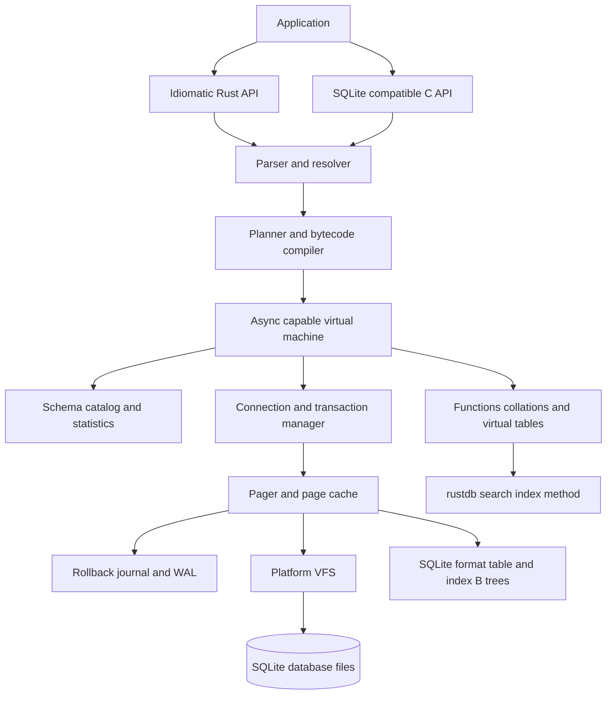
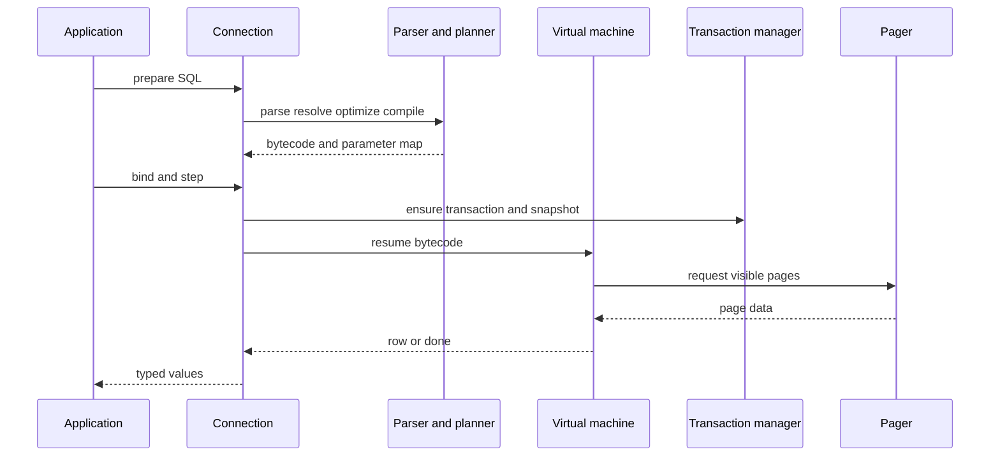
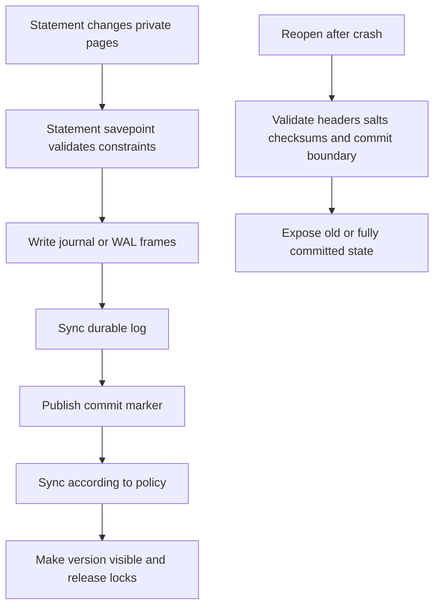

# task-1781: SQLite feature parity and performance

Status: proposed design  
Target reference: SQLite 3.53.4, released 2026-07-24  
Scope: research and technical design only; this document changes no runtime behavior

## Decision in one page

rust-db should become a full embedded SQL database by building its relational layer on a pinned,
audited fork of the MIT-licensed Turso database engine, then integrating the current rust-db
retrieval engine through the relational engine's extension and index-method boundaries. It should
not grow a second SQL parser, pager, B-tree, virtual machine, and compatibility suite from scratch.
It also should not hide SQLite behind FFI and call that a Rust database.

This is a base, not a declaration of parity. Turso itself documents incomplete SQLite language,
PRAGMA, C API, transaction, and journaling coverage. rust-db must own a machine-readable parity
manifest, differential tests against the exact SQLite reference build, deterministic crash and I/O
fault testing, and release gates that do not inherit an upstream claim on trust.

The existing `rustdb-core` remains the proven retrieval implementation. Its document store,
BM25, HNSW, quantization, hybrid ranking, and filters become a native `rustdb_search` index method
and virtual-table surface over ordinary relational tables. Existing callers keep a compatibility
adapter while new callers use SQL. A future migration copies each generation-based index into a
SQLite-format database, verifies row counts, content hashes, filter results, and a fixed query set,
and leaves the source generation untouched.

“Feature parity” means observable parity with a pinned SQLite release in three dimensions:

1. SQL and runtime behavior, including types, errors, edge cases, historical quirks, limits, and
   unsupported syntax.
2. File compatibility and transaction behavior, including cross-opening files, rollback and WAL
   modes, locking, crash recovery, and `PRAGMA integrity_check`-equivalent validation.
3. Embedded interfaces, including prepared statements, binding, result access, hooks, backup,
   serialization, extensions, virtual tables, and the documented C API compatibility profile.

Performance is a separate gate after correctness. Every benchmark runs the same SQL, data, journal
mode, synchronous policy, cache state, transaction boundaries, and durability guarantees in both
engines. A result cannot be called faster if rust-db did less work or provided weaker durability.
The headline gate is a lower 95% confidence bound above 1.20x for an operation family and a lower
bound above 1.50x for the weighted geometric mean of the target workload. No required correctness,
durability, or compatibility gate may regress to buy that speed.

## Introduction

rust-db is currently a fast, carefully measured embedded retrieval index. It holds one fixed
document/chunk shape, vector and lexical indexes, dictionary-encoded filter fields, append and
tombstone mutations, and generation-based persistence. The requested destination is much larger:
a small but full-featured relational database with SQLite-compatible tables, schemas, transactions,
queries, updates, extensions, files, and application interfaces, while retaining rust-db's search
advantage and proving meaningful speedups against SQLite.

SQLite is not a small feature checklist. Its default distribution includes a broad SQL dialect,
dynamic typing, constraints, triggers, views, recursive CTEs, window functions, JSON, FTS5,
R-Tree, virtual tables, prepared statements, multiple attached databases, rollback journals, WAL,
backup and serialization APIs, platform VFS implementations, documented limits, and compatibility
quirks retained over decades. SQLite's own quality page reports four independent harnesses,
millions of cases, crash and power-loss simulation, fault injection, fuzzing, boundary tests, and
100% branch and MC/DC coverage for the core in its private TH3 harness. The design must treat the
test system as part of the database, not as work added after the engine.

## Goals and non-goals

### Goals

- Match the documented behavior of SQLite 3.53.4, with every supported and unsupported feature
  represented in a versioned parity manifest.
- Read databases produced by SQLite 3.x and write databases SQLite 3.53.4 can read, including
  `rowid`, `WITHOUT ROWID`, `STRICT`, index, freelist, overflow, text-encoding, and schema formats.
- Match statement-level atomicity, autocommit, explicit transactions, savepoints, conflict
  algorithms, serializable isolation, WAL snapshot behavior, locking, and crash recovery.
- Match SQLite's value storage classes, affinity, coercion, comparison, collation, NULL, numeric,
  aggregate, ordering, and historical quirk semantics.
- Provide an idiomatic Rust API and a separately gated SQLite C API compatibility layer.
- Support SQLite's extensibility model: scalar, aggregate, and window functions; collations;
  virtual tables; table-valued functions; VFS implementations; authorizer and update hooks.
- Preserve the current rust-db search quality and expose it as a native, transactional SQL feature.
- Reuse public upstream test assets where licenses allow and add independent differential,
  property, fault, crash, concurrency, malformed-file, and boundary testing.
- Measure rust-db and SQLite with the same workload contract and prove practical, statistically
  supported speedups on selected operation families without hiding regressions.
- Keep the library embedded, serverless, cross-platform, deterministic, and usable without a
  background process.

### Measurable success criteria

| Gate | Release criterion |
|---|---|
| Parity manifest | 100% of in-scope rows are `pass`; no `unknown`, `partial`, or undocumented deviation |
| SQLLogicTest | 100% pass on the pinned corpus; every exclusion names an SQLite-inapplicable test and reason |
| SQLite conformance | 100% pass on the public tests adopted for the target profile |
| Differential corpus | Zero unexplained result, type, column-name, row-count, error-code, or transaction-state differences |
| File interop | SQLite and rust-db cross-open and mutate every fixture in both directions without `integrity_check` failure |
| ACID | Zero torn, lost-acknowledged, dirty, non-repeatable, or forked-history outcomes across the fault matrix |
| Robustness | No panic, UB, leak, hang, or out-of-bounds access on malformed SQL/files and injected OOM/I/O faults |
| Search compatibility | Existing fixed query pack stays within its declared quality and latency non-regression margins |
| Performance | Weighted geomean lower 95% confidence bound at least 1.50x versus SQLite; required families meet their own floors |
| Portability | Windows x64 and Linux x64 pass; file fixtures round-trip across endian-independent encodings |

### Non-goals

- Implement SQL features SQLite itself omits. `GRANT`, `REVOKE`, statement-level triggers, directly
  writable views, and unsupported `ALTER TABLE` forms should fail as the pinned SQLite build fails.
- Reproduce undefined behavior, memory-safety defects, or corrupt output from a SQLite bug. A known
  deviation needs a fixture, risk decision, and explicit manifest entry; it is never accidental.
- Claim that every SQL operation will beat SQLite. The scorecard reports wins, equivalence,
  inconclusive results, and losses by family. Headline claims follow predeclared gates.
- Add a network server, distributed consensus, replication protocol, or PostgreSQL wire protocol.
- Preserve rust-db's current generation-directory format as the relational database file format.
  It remains readable only for migration and compatibility.
- Change current production users, defaults, or files as part of this research ticket.

## Definitions and parity contract

### Reference build

Pin all comparisons to the official SQLite 3.53.4 amalgamation by source ID and SHA3-256, with a
checked-in metadata file that records:

- SQLite version, source ID, and amalgamation checksum;
- compile options and enabled extensions;
- page size, journal mode, `synchronous`, cache size, temp store, mmap, and foreign-key settings;
- compiler, optimization flags, target, OS, filesystem, CPU, memory, and storage device;
- rust-db commit, Rust toolchain, feature flags, and Turso upstream revision;
- corpus generator version and seed.

The reference profile enables the normal SQLite distribution, JSON and math functions, FTS5,
R-Tree, column metadata, session/preupdate hooks, and thread safety. A second minimal profile can
measure footprint, but it cannot substitute for the parity profile.

### What counts as the same behavior

For each operation, compare all observable output:

- success versus error, primary and extended error code, and transaction state;
- result row count, order where SQL defines it, column count, names, declared types, storage class,
  byte value, and text encoding behavior;
- `changes`, `total_changes`, `last_insert_rowid`, hook invocation order, and autocommit state;
- database, WAL, journal, and temporary-file effects at documented synchronization points;
- schema objects, `sqlite_schema` SQL, sequence values, planner-visible statistics, and PRAGMA rows;
- lock and busy behavior across connections and processes;
- output after close, reopen, checkpoint, rollback, crash, and recovery.

Unordered result sets are canonicalized by storage class and SQLite's byte-level value rules only
inside the test harness. The engine itself must not promise an order SQLite does not promise.

### Parity manifest

Add `compat/sqlite-3.53.4.toml` as the source of truth. One row represents one documented
requirement, syntax production, function signature, PRAGMA mode, C API family, file-format case,
limit boundary, extension capability, or intentional omission.

```toml
[[capability]]
id = "sql.select.window.exclude"
source = "https://sqlite.org/windowfunctions.html"
profile = "default"
status = "pass"
tests = ["compat/window/exclude.sqltest", "upstream/window8.test"]

[[capability]]
id = "sql.grant"
source = "https://sqlite.org/omitted.html"
profile = "negative-parity"
status = "pass"
expected = "syntax-error"
tests = ["compat/negative/omitted.sqltest"]
```

Allowed implementation states are `missing`, `partial`, `pass`, and `intentional-deviation`.
Only `pass` is releaseable in the full profile. `intentional-deviation` is useful during development
but does not satisfy full parity. A generator reads the manifest and produces the human scorecard,
missing-test report, and CI shards; a documentation claim cannot exist without a test link.

SQLite's requirements system is the model: documented testable statements have stable identifiers
and evidence is traceable back to tests. Import requirement IDs where available rather than
inventing a second description of the same behavior.

## Problem statement

### Current rust-db state

| Area | Current capability | Gap to SQLite parity |
|---|---|---|
| Data model | Fixed `Document` and `Chunk` structs with dictionary-backed metadata | General tables, columns, rows, schemas, catalog, values, constraints |
| Query | Vector, lexical, hybrid, filters, grouped retrieval | SQL parsing, name resolution, expressions, joins, grouping, subqueries, CTEs, windows |
| Mutation | Bulk add, incremental append, tombstone, document replacement | INSERT, UPDATE, DELETE, RETURNING, conflict handling, statement rollback |
| Persistence | Five binary sections in immutable numbered generations behind an atomic pointer | SQLite pages, B-trees, freelist, overflow, rollback journal, WAL, locking, VFS |
| Consistency | A whole index generation becomes current atomically | User transactions, connection snapshots, isolation, savepoints, concurrent access |
| Schema | Compile-time Rust fields | `sqlite_schema`, DDL, attached `main`/`temp`/named databases |
| Indexes | HNSW and BM25 built around chunk ordinals | General B-tree, composite, unique, partial, expression, covering, automatic indexes |
| Types | Rust fields and serialized primitives | SQLite storage classes, affinity, STRICT, collation, coercion, subtypes |
| API | Direct Rust `Index` calls | connection, prepare/bind/step/reset/finalize, hooks, backup, blob, C ABI |
| Tests | Strong retrieval, persistence, ranking, and benchmark coverage | SQL, file interop, ACID fault matrix, concurrency, hostile input, limits |

The existing generation save is power-loss aware for one immutable index snapshot, but it is not a
transaction subsystem. It cannot expose uncommitted changes to one connection, preserve an older
snapshot for another, roll back one statement, commit across attached databases, coordinate
multiple processes, or incrementally persist dirty pages.

### Why adding a parser is not enough

SQL syntax is a small part of compatibility. `SELECT 1='1'`, a PRIMARY KEY that accepts NULL in a
non-STRICT rowid table, an `INTEGER PRIMARY KEY DESC` that is not a rowid alias, foreign keys being
off by default, bare columns beside one `min()` or `max()`, keyword identifiers, double-quoted
string compatibility, and equal join precedence are all observable SQLite behavior. A generic
SQL-92 parser actively works against some of these rules.

The storage and transaction layers carry similar hidden contracts: page checksums and WAL salts,
hot-journal detection, lock escalation, statement savepoints, busy-handler eligibility, sync
ordering, cache invalidation, ATTACH atomicity, and error behavior after partial execution. These
are where superficially working databases lose data.

## Architectural overview



### Base strategy: own a pinned Turso fork

Turso is an MIT-licensed Rust reimplementation of SQLite with a SQLite-format pager and B-tree,
SQLite-derived Rust parser, bytecode VM, async I/O, WAL, extension interfaces, bindings,
differential tests, deterministic simulation, and an explicit compatibility matrix. That is the
closest available base to the required architecture.

The fork must be treated as source, not an opaque dependency:

- pin a full upstream commit and record it in `UPSTREAM.md`;
- retain upstream module boundaries and history so security and correctness fixes can be merged;
- keep rust-db changes in adapters and extension crates when possible;
- maintain an automated upstream-merge branch and run the complete parity and fault suite before
  promoting a merge;
- never expose an upstream `COMPAT.md` checkmark as rust-db evidence without rust-db's own passing
  fixture;
- track Turso's documented gaps, including partial PRAGMA and C API coverage, rollback-journal
  omissions, mixed-process restrictions, and any open durability issue relevant to the pinned
  revision.

This recommendation is intentionally skeptical. Turso saves years of base implementation, but it
does not remove rust-db's responsibility for correctness.

## Components and interfaces

### Proposed workspace

| Crate | Responsibility |
|---|---|
| `rustdb` | Stable public Rust facade: `Database`, `Connection`, `Statement`, `Rows`, `Transaction` |
| `rustdb-sqlite` | Parser, resolver, planner, bytecode VM, values, functions, catalog |
| `rustdb-storage` | SQLite file codec, B-trees, pager, page cache, overflow, freelist |
| `rustdb-transaction` | Locks, autocommit, savepoints, rollback journal, WAL, checkpoints, recovery |
| `rustdb-vfs` | Sync/async platform I/O, locks, clocks, randomness, faultable test VFS |
| `rustdb-ext` | Scalar/aggregate/window functions, collations, virtual tables, loadable extensions |
| `rustdb-capi` | Versioned SQLite C API compatibility surface and ABI tests |
| `rustdb-core` | Existing BM25, vector, hybrid ranking, filters, persistence-reader compatibility |
| `rustdb-search` | SQL virtual table and index-method bridge to `rustdb-core` |
| `rustdb-compat` | Manifest generator, SQLite oracle driver, SQLLogicTest and upstream-test adapters |
| `rustdb-bench` | Existing grading framework extended with relational workloads and SQLite baseline |
| `rustdb-sim` | Deterministic scheduler, in-memory VFS, I/O/OOM faults, crash and concurrency models |
| `rustdb-cli` | SQLite-like shell needed for compatibility testing and manual diagnosis |

The first integration should preserve the upstream crate graph. Consolidation is a later,
measurement-driven change; rearranging working database internals before parity produces risk with
no user-visible capability.

### Public Rust interface

The facade should make safe ownership easy without hiding SQLite state:

```rust
let database = rustdb::Database::open("app.db").await?;
let connection = database.connect().await?;

let mut statement = connection.prepare(
    "SELECT id, title FROM notes WHERE project_id = ?1 ORDER BY updated_at DESC"
).await?;
statement.bind(1, project_id)?;

while let Some(row) = statement.next().await? {
    let id: i64 = row.get(0)?;
    let title: &str = row.get(1)?;
}
```

Required API properties:

- `Database` owns shared pager/cache state; each `Connection` owns transaction and PRAGMA state.
- `Statement` is bound to one connection, can be reset and rebound, and exposes SQLite-like
  prepare/step semantics even when the Rust convenience API offers `query` and `execute`.
- Values support NULL, signed 64-bit integer, IEEE-754 binary64, text bytes with encoding at the
  file boundary, and arbitrary blobs. Conversion helpers are explicit and fallible.
- Cancellation interrupts at VM safe points and returns the matching interrupt error without
  leaving a transaction or lock half-finished.
- Sync and async adapters drive the same state machine. Async support must not change transaction
  boundaries or callback ordering.
- Busy handlers, progress handlers, authorizers, commit/rollback/update/preupdate/WAL hooks, custom
  functions, collations, virtual tables, backup, incremental blob I/O, serialize, and deserialize
  have explicit registration lifetimes.

### Parser, resolver, and SQLite semantics

Use the SQLite-specific parser inherited from Turso rather than `sqlparser-rs`. The latter is a
useful multi-dialect syntax parser but explicitly does not enforce database-specific semantics and
accepts statements a real engine may reject. Parity needs SQLite's grammar ambiguities and keyword
fallback behavior.

The front end is split into:

1. tokenizer and parser to a lossless-enough SQLite AST;
2. catalog/name resolver for `main`, `temp`, attached schemas, aliases, `rowid` names, `OLD`/`NEW`,
   window names, CTE scope, and correlated references;
3. affinity and collation propagation;
4. semantic validation and limit enforcement;
5. planner and bytecode compiler.

Parser acceptance is tested independently from execution. Every syntax diagram in SQLite's
language index receives positive and negative fixtures, including comments, parameters, quoting,
UPSERT ambiguity, RETURNING, generated columns, STRICT and WITHOUT ROWID options, window frames,
recursive CTEs, FILTER, null ordering, RIGHT/FULL joins, and new 3.53 constraint changes.

### Values, records, and comparison

Implement one canonical `Value` representation with the five SQLite storage classes. Do not map
declared SQL type names directly to Rust types. Column declarations determine affinity; values keep
their storage class unless SQLite's documented affinity or operator rules convert them.

The semantics module owns:

- declared-type-to-affinity rules in documented precedence order;
- numeric literal parsing, integer overflow promotion, casts, and lossless conversion;
- three-valued boolean and NULL behavior;
- arithmetic, bitwise, concatenation, comparison, `IS`, `IN`, `BETWEEN`, LIKE, GLOB, and MATCH;
- BINARY, NOCASE, and RTRIM collations plus application-defined collations;
- GROUP BY, DISTINCT, compound-select, and ORDER BY equality/order rules;
- STRICT table enforcement and `ANY` behavior;
- SQLite subtypes needed by JSON and extension APIs;
- result column naming and declared-type metadata.

Record encoding uses SQLite serial types and varints exactly. Corrupt or non-canonical records must
return a corruption error, never panic or allocate from an unchecked length.

### Catalog and schema

SQLite does not implement `CREATE SCHEMA`. Its schemas are `main`, `temp`, and names introduced by
`ATTACH`. Match that model.

`sqlite_schema` stores canonical object rows for tables, indexes, views, and triggers. The catalog
layer parses stored SQL on open, manages schema cookies, invalidates prepared statements when the
schema changes, and exposes the documented aliases and introspection PRAGMAs.

Support:

- ordinary rowid tables, INTEGER PRIMARY KEY aliases, AUTOINCREMENT and `sqlite_sequence`;
- WITHOUT ROWID tables and clustered primary-key storage;
- STRICT tables and generated VIRTUAL/STORED columns;
- TEMP objects and name-resolution precedence;
- tables, indexes, views, triggers, virtual tables, and shadow tables;
- ALTER behaviors SQLite implements, including rename/add/drop column and 3.53 constraint changes;
- DROP, schema reparsing, legacy alter behavior, and writable-schema safeguards;
- ATTACH/DETACH and cross-database name resolution.

### Planner and virtual machine

Retain a prepared-statement bytecode VM because it aligns with SQLite's prepare/step contract,
triggers, coroutines, subqueries, and resumable async I/O. Add vectorized execution only behind VM
operators whose row-at-a-time observable behavior is unchanged.

Planner coverage includes:

- full scans; rowid and WITHOUT ROWID primary-key lookup;
- single and composite B-tree seeks and ranges;
- covering, descending, collated, partial, and expression indexes;
- automatic indexes and OR-by-union plans;
- nested-loop join ordering through 64 tables, outer joins, and join-strength reductions;
- sort, partial/block sort, DISTINCT and GROUP BY avoidance;
- LIMIT pushdown, MIN/MAX, LIKE, skip-scan, constant propagation, and predicate pushdown;
- subquery flattening versus materialization and correlated subqueries;
- ordinary, recursive, materialized, and non-materialized CTEs;
- window partitions, orderings, frames, FILTER, and EXCLUDE;
- statistics from ANALYZE and `sqlite_stat1`/`sqlite_stat4`;
- `EXPLAIN` bytecode and `EXPLAIN QUERY PLAN` diagnostic output.

Planner output is never used as the compatibility oracle because SQLite documents EXPLAIN formats
as unstable. Result behavior is normative; plan-shape tests protect rust-db performance only.

### Pager, B-trees, and file format

The pager is the only component allowed to read or write database, journal, WAL, shared-memory, or
temporary files. Higher layers work with logical pages and transactions.

Required file behavior:

- page sizes from 512 through 65,536 bytes and the 100-byte database header;
- table and index interior/leaf B-tree pages;
- local payload thresholds, overflow chains, freeblocks, fragments, and freelist trunks/leaves;
- pointer-map pages and auto/incremental vacuum;
- SQLite record serial types, varints, UTF-8/UTF-16LE/UTF-16BE, collating keys, and rowid order;
- schema cookies, change counters, version-valid-for, application/user version, and reserved bytes;
- database, rollback journal, super-journal, WAL, WAL-index/shared-memory, and temp file formats;
- cross-platform byte order and forward/backward compatibility rules for SQLite 3 files;
- incremental blob access and backup/serialize/deserialize snapshots.

The page cache uses stable page identities, pin counts, dirty state, transaction ownership, and an
explicit eviction policy. Read and write paths must function with direct buffered I/O first; mmap
and io_uring are optimizations gated by the same compatibility suite.

### Transactions, isolation, and durability

Match SQLite's transaction state machine before adding rust-db extensions:

- every read or write occurs inside an implicit or explicit transaction;
- implicit transactions commit when the last active statement finishes;
- `BEGIN DEFERRED`, `IMMEDIATE`, and `EXCLUSIVE` acquire locks at SQLite-compatible points;
- explicit transactions do not nest; SAVEPOINT/RELEASE/ROLLBACK TO provide nesting;
- one connection may have multiple active statements with the same documented interactions;
- a failed statement rolls back according to ROLLBACK, ABORT, FAIL, IGNORE, or REPLACE semantics;
- rollback mode provides serializable isolation by excluding readers during database writes;
- WAL provides stable read snapshots with concurrent readers and one serialized writer;
- stale snapshot escalation returns the matching busy-snapshot error;
- busy timeout/handler behavior distinguishes lock contention from same-connection misuse;
- attached-database commit atomicity matches SQLite's mode-specific guarantees;
- acknowledged FULL-synchronous commits survive process crash and modeled power loss.

Turso's optional MVCC and concurrent-writer mode remains an opt-in rust-db extension until its
behavior is independently proven. It must never silently replace SQLite's default isolation. Files
using incompatible extensions carry an explicit application/file marker and a documented path back.

### Indexes and constraints

All constraint enforcement occurs inside a statement savepoint so errors cannot leave partial
effects unless SQLite's FAIL algorithm intentionally preserves prior row effects.

Support PRIMARY KEY, UNIQUE, NOT NULL, CHECK, FOREIGN KEY, generated-column dependencies, and
collation-aware uniqueness. Foreign keys must include runtime enablement, immediate/deferred modes,
composite keys, MATCH behavior, ON DELETE/UPDATE actions, cycles, trigger interaction, and
`foreign_key_check`. Index maintenance is part of the same transaction as the table write.

### Functions and extensions

Build a generated registry from the reference SQLite profile:

- core scalar functions and operators;
- aggregate and window functions;
- date/time and mathematical functions;
- JSON text and JSONB functions, table-valued `json_each` and `json_tree`;
- FTS5 query syntax, ranking, tokenizers, auxiliary APIs, and shadow tables;
- R-Tree virtual tables;
- application-defined scalar, aggregate, window, and table-valued functions;
- application-defined collations and virtual table modules;
- loadable extensions behind a disabled-by-default security switch.

Extension ABI compatibility is tested with small C extensions compiled once and loaded by both
engines. An extension claiming a SQLite ABI version must receive the same callback contracts and
error lifetime.

### Integrating the existing search engine

Expose current retrieval through two additive surfaces:

1. `rustdb_search` index method for text/vector columns, planner-visible for MATCH and vector
   distance predicates.
2. `rustdb_hybrid_search(table, query, vector, options)` table-valued function returning rowid,
   score, confidence, origin, and explanation.

The SQL transaction owns search-index visibility. Insert/update/delete changes append to a
transaction-local delta; commit publishes it with the relational WAL commit, rollback discards it,
and readers merge their visible immutable generation with committed deltas. Background compaction
publishes a replacement generation only after its source LSN range is durable and still current.

The current direct `Index` API is backed by a compatibility adapter during migration. Search scores
remain explicitly non-SQL ordering values: equality, constraints, and joins never depend on an
approximate index result.

## Data flows and security

### Prepared query



### Durable write and recovery



The ordering points above are fault-injection boundaries. In-memory durable offsets, checksums,
commit sequence numbers, and schema state may advance only after the corresponding write and sync
operation confirms success.

### Security and robustness boundaries

- Treat SQL text, bound values, database files, extensions, and VFS results as hostile inputs.
- Validate page numbers, cell offsets, varints, lengths, overflow chains, record serial types,
  encodings, recursion depth, and allocation sizes before use.
- Enforce per-connection limits before allocation to prevent parameter, expression, compound-query,
  LIKE/GLOB, attached-database, trigger, and page-count denial of service.
- Offer defensive and trusted-schema modes with SQLite-compatible defaults and behavior.
- Disable extension loading by default and require an explicit allow-list callback.
- Keep unsafe code isolated in the C ABI and OS adapters, document invariants, and run Miri,
  sanitizers, and fuzz targets over those boundaries.
- Never log bound values or database content by default. Tracing reports opcodes, page ids, timings,
  and error codes with an explicit redaction policy.
- A malformed file returns a stable corruption/not-a-database error and cannot cause a panic,
  unbounded allocation, path escape, or read outside the mapped file.

## SQLite feature coverage matrix

| Capability family | Required behavior | Primary evidence |
|---|---|---|
| SQL statements | Full pinned `lang.html` statement set and semicolon-separated lists | Syntax fixtures, Tcl subsets, differential oracle |
| DDL | tables, indexes, views, triggers, virtual tables, supported ALTER and DROP | Catalog/file round-trip and schema invalidation cases |
| DML | INSERT/REPLACE/UPSERT, UPDATE, DELETE, RETURNING, conflict algorithms | Differential rows, hooks, changes, transaction state |
| SELECT | joins, subqueries, compounds, CTEs, aggregates, windows, ordering and limits | SQLLogicTest plus focused SQLite edge fixtures |
| Expressions | operators, CASE, CAST, COLLATE, parameters, row values, function calls | Storage-class and byte-value differential tests |
| Types | five storage classes, affinity, STRICT, encoding, collation | Datatype matrix and cross-file fixtures |
| Tables | rowid, aliases, AUTOINCREMENT, WITHOUT ROWID, generated columns | File-level and behavioral fixtures |
| Indexes | composite, unique, descending, collated, partial, expression, covering | Result equivalence, integrity, and plan-performance cases |
| Constraints | PK, UNIQUE, NOT NULL, CHECK, FK immediate/deferred/actions | Per-conflict-mode atomicity and reopening tests |
| Transactions | implicit/explicit, savepoints, rollback modes, WAL, ATTACH | Deterministic crash, I/O fault, and concurrent schedules |
| Schemas | main, temp, ATTACH/DETACH, name precedence, `sqlite_schema` | Multi-database differential fixtures |
| Functions | core, aggregate, window, date/time, math, JSON/JSONB | Generated signature matrix and fuzz corpora |
| Extensions | FTS5, R-Tree, virtual tables, custom functions/collations | Upstream tests and cross-engine extension probes |
| PRAGMAs | every pragma in the target profile including silent unknown handling | Generated read/write/effect matrix |
| Embedded API | open, prepare, bind, step, reset, finalize, columns, hooks, backup, blob | Rust API tests and C ABI trace comparison |
| Errors and limits | primary/extended codes, messages where stable, all documented limits | Boundary and one-past-boundary tests |
| Quirks | flexible typing, permissive PK NULL, DQS, keywords, bare aggregates, join precedence | Fixed regression corpus from `quirks.html` |
| Negative parity | SQLite omissions fail or behave identically | Explicit negative manifest rows |

## Testing strategy

Correctness is layered. No single suite establishes parity or ACID.

### 1. Public upstream assets

| Asset | How to use it | Limitation |
|---|---|---|
| SQLite Tcl tests in the canonical source tree | Pin the 3.53.4 source; run portable public cases through a compatibility runner or translate minimally | Some tests depend on SQLite internals or the Tcl testfixture |
| SQLLogicTest | Run the full pinned corpus through the Rust `sqllogictest` adapter and SQLite reference | Tests result correctness, not transactions, locks, memory, disk, or performance |
| SQLite requirements and evidence matrix | Generate manifest rows and trace each imported requirement to rust-db tests | Public evidence may point to proprietary TH3 cases that cannot be copied |
| `speedtest1.c` and `kvtest.c` | Recreate identical operation families through both C APIs | Representative benchmarks, not correctness suites |
| `mptest` and `threadtest3` | Port scheduling/workload shapes for process and thread stress | Stress finds bugs but does not prove all schedules |
| SQLite fuzz regression corpus and OSS-Fuzz entry points | Seed SQL and malformed-file fuzzers | SQLite-specific harness code needs an engine adapter |
| Turso conformance and deterministic simulators | Import tests relevant to the pinned base and preserve differential mode | Upstream passing status is not rust-db evidence until rerun |

TH3 and dbsqlfuzz are proprietary and cannot be dependencies of an open, reproducible gate. Replace
their relevant assurances with rust-db-owned branch coverage, mutation testing, deterministic
simulation, structure-aware fuzzing, and fault matrices. Do not describe that replacement as
equivalent until measurements establish its coverage.

### 2. Differential SQL harness

For each generated or fixed script:

1. create byte-identical starting databases or create once in SQLite and copy;
2. open isolated SQLite and rust-db copies under identical configuration;
3. execute one statement/step/bind/reset action at a time;
4. compare outputs and connection state after each action;
5. checkpoint/close/reopen at generated boundaries;
6. run both integrity checkers and compare logical dumps;
7. persist the seed and minimized reproducer for every difference.

Generate statements from the SQLite grammar with schema-aware types so most cases are meaningful,
then mutate tokens, values, schemas, and database bytes for hostile cases. Metamorphic properties
include equivalent predicate rewrites, index/no-index agreement, transaction rollback identity,
dump/reload identity, and query-plan-independent results.

### 3. ACID and failure matrix

#### Atomicity

- interrupt every VFS read, write, truncate, sync, rename, lock, unlock, shared-memory, and delete
  step in single-statement and multi-statement transactions;
- inject short writes, torn sectors, reordered unsynced writes, disk full, read-only, permission,
  transient and permanent I/O errors;
- crash before and after every journal header, page, sync, commit marker, checkpoint, super-journal,
  and database-header transition;
- after recovery, observe exactly the old or new transaction, never a mix, then pass integrity check;
- stack failures during recovery, rollback, checkpoint, and close.

#### Consistency

- verify every constraint, index/table correspondence, generated value, schema object, freelist,
  page ownership, and search-index/table correspondence at commit;
- compare quick and full integrity checks against independent logical invariants;
- fail commits cleanly when invariants cannot be made durable.

#### Isolation

- deterministically enumerate two- and three-connection histories for reads, writes, savepoints,
  DDL, hooks, and active statements;
- assert no dirty reads, non-repeatable reads inside a snapshot, lost updates, write skew outside
  SQLite's documented model, or history forks;
- match busy, locked, and busy-snapshot outcomes and handler calls;
- repeat with threads and processes, rollback and WAL modes, shared-cache options, and ATTACH.

#### Durability

- acknowledge a commit only after the configured sync contract is satisfied;
- crash the process and simulate lost unsynced sectors after every acknowledgement boundary;
- recover on a fresh process with empty caches;
- verify all FULL-synchronous acknowledged commits and allow only SQLite-documented NORMAL/OFF losses;
- test WAL copy/move rules, hot journals, checkpoints, WAL reset, and abandoned writers.

The deterministic VFS records an operation trace and supports seed replay. Every discovered failure
becomes a permanent minimized regression.

### 4. Concurrency and liveness

- deterministic scheduler explores lock handoffs, statement suspension, hook reentrancy, cache
  eviction, checkpoints, and cancellation;
- long-running process/thread stress uses read-heavy, write-heavy, schema-change, checkpoint, and
  mixed-size workloads;
- liveness gates bound busy-loop CPU, lock starvation, deadlock, checkpoint starvation, and shutdown;
- Loom covers small in-memory synchronization components; the full engine uses the deterministic
  executor because filesystem and async state exceed Loom's practical scope.

### 5. Memory safety and resource failure

- `cargo miri` on codec, varint, value, and small state-machine suites;
- AddressSanitizer, UndefinedBehaviorSanitizer, and leak checks on the C ABI and fuzz drivers;
- allocation fault injection at each allocation site for representative statements;
- parser, expression, trigger, CTE, JSON, and page-chain recursion limits;
- memory and disk quotas with exact SQLite error-class comparison;
- malformed file corpus with random and structure-aware mutation.

### 6. Required CI tiers

| Tier | Trigger | Contents | Target duration |
|---|---|---|---|
| Developer | every change | affected unit cases, focused differential fixtures, manifest coverage | under 5 minutes |
| Pull request | every change | SQLLogicTest shards, public conformance subset, deterministic seeds, file interop | under 30 minutes |
| Nightly | scheduled | full public Tcl-adapted suite, large differential/fuzz corpus, concurrency and faults | hours |
| Weekly soak | scheduled | billions of fuzz iterations, process crash matrix, long stress, mutation testing | continuous budget |
| Release | candidate | all profiles on Windows/Linux, cold hardware benchmarks, upgrade/downgrade fixtures | no fixed shortcut |

## Performance evaluation

### Fairness contract

Every arm must use:

- the same logical schema, rows, values, indexes, SQL text, parameters, and transaction grouping;
- the same SQLite page format and page size where the operation is file-backed;
- the same journal mode, `synchronous` guarantee, checkpoint inclusion policy, cache budget, mmap
  policy, temp-store policy, foreign-key policy, and thread count;
- release builds with pinned compilers and no diagnostic tracing;
- separate files placed on the same device and recreated from a checksum-verified fixture;
- randomized, balanced A/B execution order with warmup not included in measurements;
- warm-cache and cold-open suites reported separately;
- end-to-end latency from the caller plus internal CPU, allocation, I/O, and page metrics;
- correctness verification before timing and a post-run logical/file integrity check.

WAL write timing must include checkpoints in either both arms' timed window or an amortized budget.
It is invalid to time rust-db through commit and SQLite through checkpoint, or to compare FULL
synchronous SQLite against a weaker rust-db policy.

### Workload families

| Family | Cases |
|---|---|
| Prepare/API | open/close, prepare, parameter bind, step one row, reset/reuse, metadata |
| Point read | rowid, integer PK, text PK, indexed equality, covering index, missing key |
| Range/order | selective ranges, forward/reverse scans, LIMIT, covering and non-covering order |
| Analytical | full scan, filter, projection, GROUP BY, DISTINCT, aggregates, windows, sort/spill |
| Join | 2/4/8/16-way joins, selective/nonselective, outer, correlated, IN/EXISTS |
| Write | single and batched insert/update/delete, UPSERT, REPLACE, RETURNING, index fanout |
| Transaction | autocommit, batch sizes 10/100/10,000, savepoint rollback, contention |
| Schema | create/drop/alter, many-object open, ANALYZE, statement invalidation |
| Durability | rollback/WAL commit, checkpoint, crash recovery, hot journal, backup |
| Large values | 1 B through 16 MiB text/blob, overflow read/write, incremental blob API |
| Extensions | JSON/JSONB, FTS5, R-Tree, application functions, virtual tables |
| Search | lexical, vector, hybrid, filtered, transactional freshness, compaction |
| Concurrency | 1/2/4/8/16 connections; read-only, one writer, mixed, opt-in concurrent writers |
| Footprint | binary bytes, open RSS, cache RSS, database/WAL bytes, write amplification |

Use three corpus scales: cache-resident small, memory-pressure medium, and storage-bound large.
Include SQLite's `speedtest1` workload as an upstream reference, `kvtest` for blob behavior,
TPC-C-shaped transactional work, TPC-H-shaped analytical queries, and real rust-db/Nikaya data
shapes. Standard-like workloads are reported with any deviations; do not imply audited TPC results.

### Metrics and verdicts

Extend the existing rust-db scorecard conventions rather than creating a second truth system:

- latency p50/p95/p99 and max;
- throughput and committed transactions per second;
- CPU instructions/cycles, context switches, syscalls, bytes read/written/synced;
- allocations and peak RSS;
- database, index, journal, and WAL bytes;
- open, recovery, checkpoint, vacuum, backup, migration, and build time;
- write amplification and cache hit ratio;
- result correctness and durability gates adjacent to every performance row.

Use at least 30 balanced paired trials for end-to-end cases and sufficient Criterion samples for
pure microbenchmarks. Bootstrap the paired log speedup and report a 95% interval. Predeclare the
practical threshold and test seed. Verdicts are `better`, `equivalent`, `inconclusive`, or `worse`.

Initial release thresholds:

| Scope | Required lower 95% confidence bound |
|---|---|
| Weighted target-workload geomean | at least 1.50x SQLite |
| Headline operation family called faster | at least 1.20x SQLite |
| Existing rust-db hybrid search | at least 1.50x configured baseline and no quality regression |
| p99 latency | no required family worse by more than 5% |
| File/RSS footprint | no more than 10% worse unless an approved speed tradeoff is documented |
| Correctness/durability | exact pass gate; performance cannot compensate for a failure |

Weights are fixed from target application traces before results are seen. Report the unweighted
table as well so a favorable mix cannot hide a slow primitive.

### Performance levers worth testing

- async page I/O and io_uring where supported;
- batched/vectorized expression, filter, projection, and aggregate operators behind the VM;
- zero-copy record comparison and result access with safe page pinning;
- prepared bytecode cache keyed by schema cookie and connection settings;
- adaptive page cache and read-ahead based on scan shape;
- group commit under compatible durability semantics;
- MVCC/concurrent writers as an opt-in extension, never a parity shortcut;
- current HNSW/BM25 hybrid indexes integrated into planner costing;
- SIMD varint/value comparison, JSON scanning, vector distance, and search rescoring;
- statistics-driven join and access-path selection.

Each lever has an off arm, a correctness run, and a resource-cost row. A faster result that changes
answers, lock semantics, or acknowledged durability is rejected.

## Implementation sequence

### Phase 0: freeze the contract and evaluate the base

- Pin SQLite 3.53.4 and a candidate Turso revision.
- Generate the first parity manifest from SQLite language, function, PRAGMA, limits, C API,
  extension, quirks, omissions, and file-format documentation.
- Build both references on Windows and Linux and capture compile options.
- Run Turso's published compatibility suite, SQLLogicTest sample, crash simulator, and a focused
  performance pack locally; record gaps instead of relying on documentation.
- Decide the precise fork boundary and upstream merge process.

Acceptance: reproducible reference binaries, source hashes, capability denominator, measured base
scorecard, and no capability marked pass without a rust-db-owned test.

### Phase 1: import the relational substrate without changing search

- Add the pinned fork crates under the proposed workspace boundaries.
- Expose the minimal Rust `Database`/`Connection`/`Statement` facade.
- Establish build, license, unsafe-code, and upstream-diff audits.
- Add differential smoke tests and cross-open SQLite files.

Acceptance: open/create, basic DDL/DML/query, close/reopen, and SQLite cross-open pass on both OSes;
the current `rustdb-core` API and scorecard remain unchanged.

### Phase 2: storage and value parity

- Close page, B-tree, freelist, overflow, encoding, record, rowid, WITHOUT ROWID, STRICT, generated
  column, corruption, and limit gaps.
- Add `integrity_check`-equivalent structural verification.
- Pass the file fixture matrix in both directions.

Acceptance: every storage/value manifest row passes; randomized logical databases survive
SQLite-to-rust-db-to-SQLite mutation and dump equivalence.

### Phase 3: SQL and schema parity

- Close parser, resolver, DDL, DML, expressions, joins, subqueries, compounds, aggregates, CTE,
  window, view, trigger, constraint, function, PRAGMA, and documented quirk gaps.
- Add planner correctness and statistics support.

Acceptance: full SQLLogicTest corpus and selected public SQLite Tcl tests pass with zero unexplained
differences; negative parity and limit boundaries pass.

### Phase 4: transactions and failure safety

- Complete statement savepoints, explicit savepoints, conflict modes, locks, rollback journals,
  WAL, checkpoints, ATTACH atomicity, busy behavior, hooks, and recovery.
- Build deterministic VFS/scheduler failure injection before optimizing.

Acceptance: the complete ACID matrix passes every fault point and generated schedule; process and
thread stress finds no corruption, deadlock, starvation, or lost acknowledged commit.

### Phase 5: API and extension parity

- Complete Rust facade, C ABI profile, backup, blob, serialize/deserialize, hooks, VFS, virtual
  tables, FTS5, R-Tree, JSON/JSONB, functions, collations, and safe extension loading.

Acceptance: manifest is green for the default feature and API profiles; binary extension probes
behave identically; all public compatibility assets selected for the profile pass.

### Phase 6: integrate rust-db search transactionally

- Add search index method and table-valued function.
- Connect commit/rollback visibility, recovery, rebuild, compaction, and planner costing.
- Preserve the direct API through an adapter.
- Build copy-and-verify migration tooling for existing generations.

Acceptance: existing retrieval scorecard and mutation gates pass; SQL and direct APIs agree;
crashes cannot expose search entries without rows or rows without committed search deltas.

### Phase 7: optimize against the frozen scorecard

- Establish unoptimized parity baseline first.
- Add performance levers one at a time with off arms.
- Optimize the weighted target workload, then investigate every p99/resource regression.

Acceptance: performance thresholds pass with correctness and durability green; artifacts contain
raw per-trial data, environment manifests, intervals, and reproducible commands.

### Phase 8: migration and release

- Copy each existing rust-db index to a new SQLite-format file without deleting its source.
- Verify counts, document/chunk identifiers, content hashes, metadata, tombstones, query results,
  and persisted configuration.
- Exercise rollback to the old reader before switching a caller.
- Publish compatibility, known-limit, performance, and upgrade reports.

Acceptance: all real indexes are copied and verified, callers can select the new engine explicitly,
and the original generations remain recoverable until a later human-approved cleanup.

## Alternatives considered

| Alternative | Advantages | Costs and risks | Decision |
|---|---|---|---|
| Extend current generation files directly | Maximum ownership; preserves existing structures | Requires inventing parser, VM, B-tree, pager, WAL, locks, APIs, extensions, and tests; current layout is optimized for immutable search | Reject as the parity path |
| Depend on generic `sqlparser-rs` | Mature Rust parser, broad SQL-92 syntax | Explicitly syntax-only and not SQLite-semantic; quirks and grammar gaps become permanent adapter work | Reject for SQLite front end |
| Embed SQLite through `rusqlite`/FFI | Immediate SQLite behavior and file compatibility | It is SQLite, not a Rust database; cannot credibly attribute relational speedups to rust-db; search integration remains external | Keep only as oracle |
| Fork libSQL's C SQLite fork | Mature SQLite base and extensions | C core, harder safety story, architecture does not deliver a Rust engine | Reject for the product core |
| Pin upstream Turso as an opaque dependency | Low import cost and easy upgrades | Cannot close upstream gaps or control compatibility-critical internals; upstream churn can move behavior | Reject as opaque dependency |
| Own a pinned Turso fork and upstream changes | Reuses the closest Rust/SQLite architecture; keeps file, VM, test, async, and extension work | Large upstream surface and merge duty; still incomplete and must be independently proven | Recommend |
| Build only a SQL facade over current documents | Fast demo; useful search queries | Not general tables, transactions, files, constraints, or SQLite parity | Reject as misleading |

## Risks and mitigations

| Risk | Consequence | Mitigation |
|---|---|---|
| “Parity” denominator drifts as SQLite releases | Endless or unverifiable completion | Pin 3.53.4; upgrade only through a manifest diff and explicit milestone |
| Turso has undocumented or known correctness gaps | Inherited corruption or semantic divergence | Own differential/fault gates; pin revisions; audit relevant open issues before merge |
| Public tests do not replace TH3 | False confidence in ACID and branches | Build deterministic VFS faults, mutation testing, coverage, fuzzing, and release evidence |
| Optimizations weaken durability | Attractive but invalid benchmark wins | Same sync/journal contract; correctness gate before timing; include checkpoint cost |
| SQLite quirks are “cleaned up” | Existing apps behave differently | Generate fixed cases from `quirks.html`; match by default, offer strict modes only explicitly |
| Search index and rows diverge | Missing/stale retrieval results | Commit search deltas under the relational LSN; verify index/table invariants and recovery |
| Fork diverges from upstream | Security fixes become expensive | Small adapters, upstream-first fixes, scheduled merge branch, diff budget and ownership |
| C ABI expands scope indefinitely | Delays useful Rust database | Versioned profiles and phases, while full target remains tracked rather than declared done |
| Benchmarks overfit this workstation | Speed claim does not generalize | Windows/Linux, cache scales, multiple storage classes, raw results, application trace weights |
| Multi-process file locking differs by filesystem | Corruption on network or unusual filesystems | VFS capability checks, explicit unsupported-filesystem errors, SQLite-compatible lock tests |

## Definition of done for the implementation program

The implementation is not “SQLite compatible” until all of these are true:

- the pinned manifest has no missing, partial, unknown, or accidental-deviation rows;
- the public conformance, differential, file, API, ACID, fault, concurrency, fuzz regression,
  boundary, and search suites pass on Windows and Linux;
- every acknowledged durable commit survives the modeled failures appropriate to its policy;
- every benchmark row ran with equal semantics and has raw reproducible evidence;
- the target-workload performance gate passes and every required regression is visible;
- SQLite and rust-db cross-open the fixture corpus after mutations from either engine;
- existing rust-db search users have a verified copy migration and a tested rollback path;
- compatibility claims name SQLite 3.53.4 and the exact enabled profile;
- documentation lists SQLite's own omissions and any rust-db opt-in extensions separately;
- the release archive contains source hashes, build configuration, manifests, raw runs, minimized
  known regressions, and generated scorecards.

## Recommendation

Approve the pinned-Turso-fork architecture and begin with Phase 0, not feature coding. The first
artifact should be the executable compatibility denominator and base scorecard. It will turn a
potentially vague multi-year rewrite into a sequence of capability rows that can only move to
`pass` with evidence.

Preserve what makes rust-db distinct: its measured search quality, in-process embedding boundary,
fast filtered vector paths, BM25 enhancements, transparent scorecard, and existing append/tombstone
work. Put those capabilities behind a relational transaction boundary instead of replacing them.

The performance objective should remain ambitious but precise: beat SQLite substantially on the
target application's weighted workload and on rust-db's search strengths, report every family, and
never trade away SQLite-compatible correctness or durability to produce a larger number.

## Primary sources

### SQLite behavior and architecture

- [SQLite 3.53.4 release history](https://sqlite.org/changes.html)
- [SQL language understood by SQLite](https://sqlite.org/lang.html)
- [Full-featured SQL inventory](https://sqlite.org/fullsql.html)
- [Features of SQLite](https://sqlite.org/features.html)
- [Datatypes, storage classes, affinity, comparison, and collation](https://sqlite.org/datatype3.html)
- [STRICT tables](https://sqlite.org/stricttables.html)
- [Quirks, caveats, and compatibility behavior](https://sqlite.org/quirks.html)
- [SQL features SQLite omits](https://sqlite.org/omitted.html)
- [Implementation limits](https://sqlite.org/limits.html)
- [Database file format](https://sqlite.org/fileformat.html)
- [File-format compatibility guarantees](https://sqlite.org/formatchng.html)
- [Atomic commit](https://sqlite.org/atomiccommit.html)
- [Isolation and concurrency](https://sqlite.org/isolation.html)
- [Transactions](https://sqlite.org/lang_transaction.html)
- [Write-ahead logging](https://sqlite.org/wal.html)
- [File locking](https://sqlite.org/lockingv3.html)
- [Query planner](https://sqlite.org/queryplanner.html)
- [Query optimizer overview](https://sqlite.org/optoverview.html)
- [PRAGMA catalog](https://sqlite.org/pragma.html)
- [Foreign keys](https://sqlite.org/foreignkeys.html)
- [FTS5](https://sqlite.org/fts5.html)
- [C/C++ API reference](https://sqlite.org/capi3ref.html)
- [Virtual filesystem interface](https://sqlite.org/vfs.html)

### Test and performance evidence

- [SQLite requirements system](https://sqlite.org/requirements.html)
- [How SQLite is tested](https://sqlite.org/testing.html)
- [SQLite quality management plan](https://sqlite.org/qmplan.html)
- [Canonical SQLite source and public Tcl tests](https://sqlite.org/src)
- [SQLLogicTest design and scope](https://sqlite.org/sqllogictest/doc/trunk/about.wiki)
- [TH3 scope and license](https://sqlite.org/th3.html)
- [SQLite CPU measurement and speedtest1](https://sqlite.org/cpu.html)
- [kvtest methodology and durability caveats](https://sqlite.org/fasterthanfs.html)

### Rust implementation references

- [Turso repository and license](https://github.com/tursodatabase/turso)
- [Turso SQLite compatibility matrix](https://github.com/tursodatabase/turso/blob/main/COMPAT.md)
- [Turso architecture and API manual](https://github.com/tursodatabase/turso/blob/main/docs/manual.md)
- [Turso conformance, simulation, and fault-testing guide](https://github.com/tursodatabase/turso/blob/main/CONTRIBUTING.md)
- [Turso deterministic simulator](https://github.com/tursodatabase/turso/tree/main/testing/simulator)
- [Turso TPC-C-shaped SQLite comparison harness](https://github.com/tursodatabase/turso/tree/main/perf/tpc-c)
- [sqlparser-rs syntax-versus-semantics boundary](https://github.com/OpenLineage/sqlparser-rs)
- [Rust SQLLogicTest runner](https://github.com/risinglightdb/sqllogictest-rs)
- [Criterion.rs statistical microbenchmarks](https://github.com/criterion-rs/criterion.rs)
