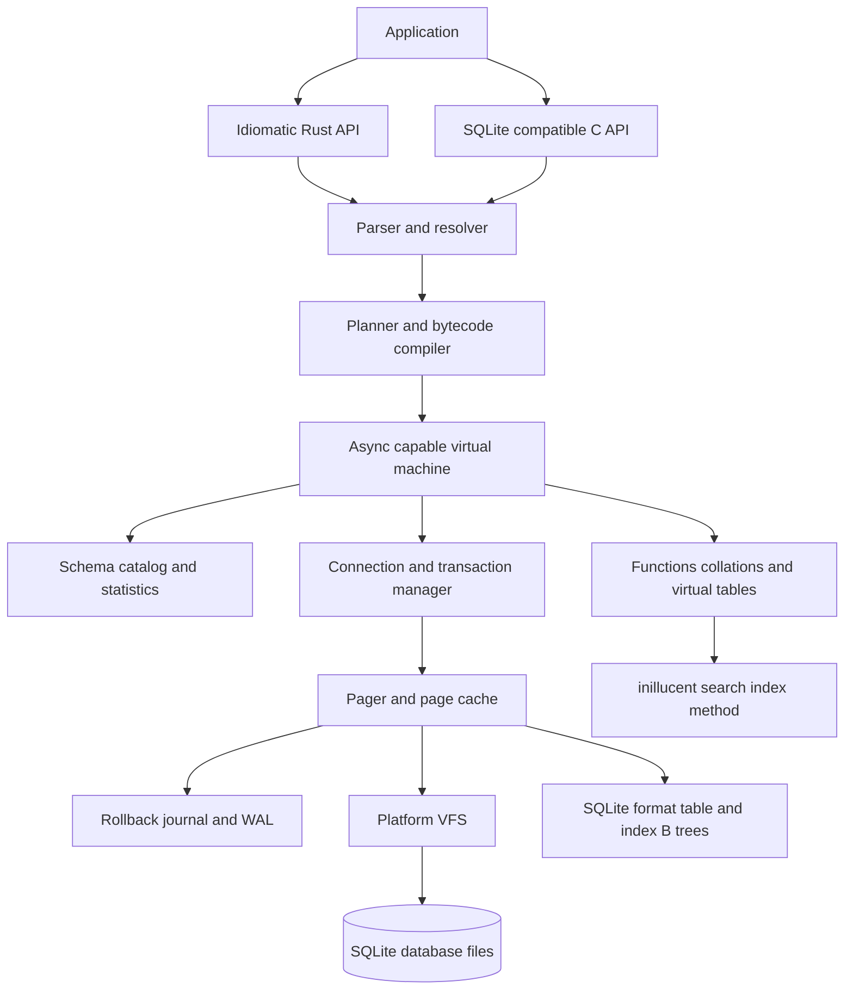
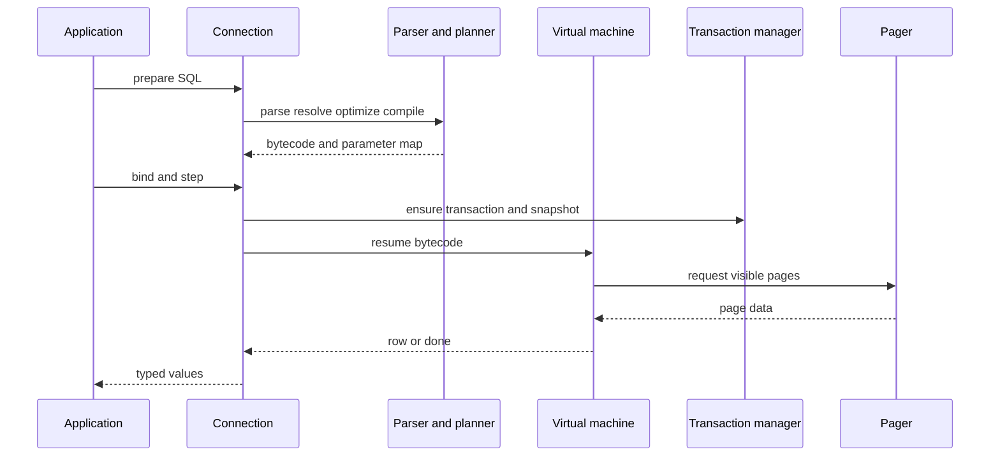
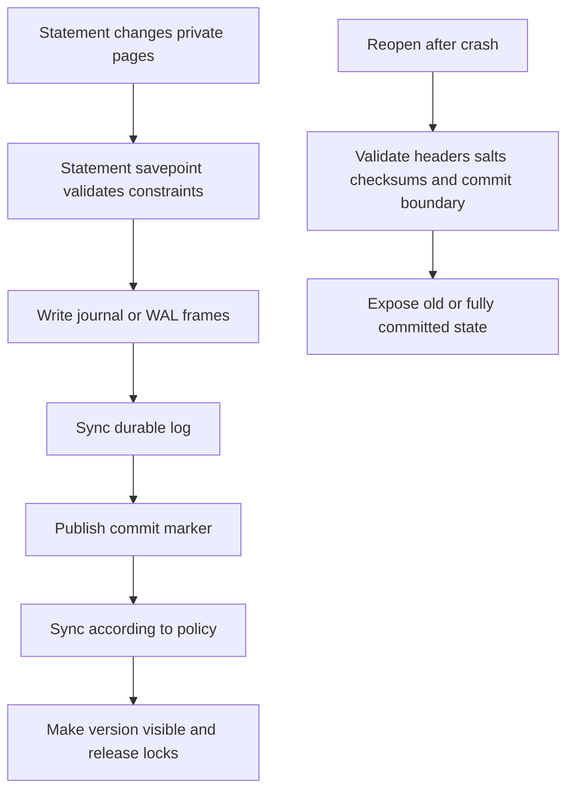
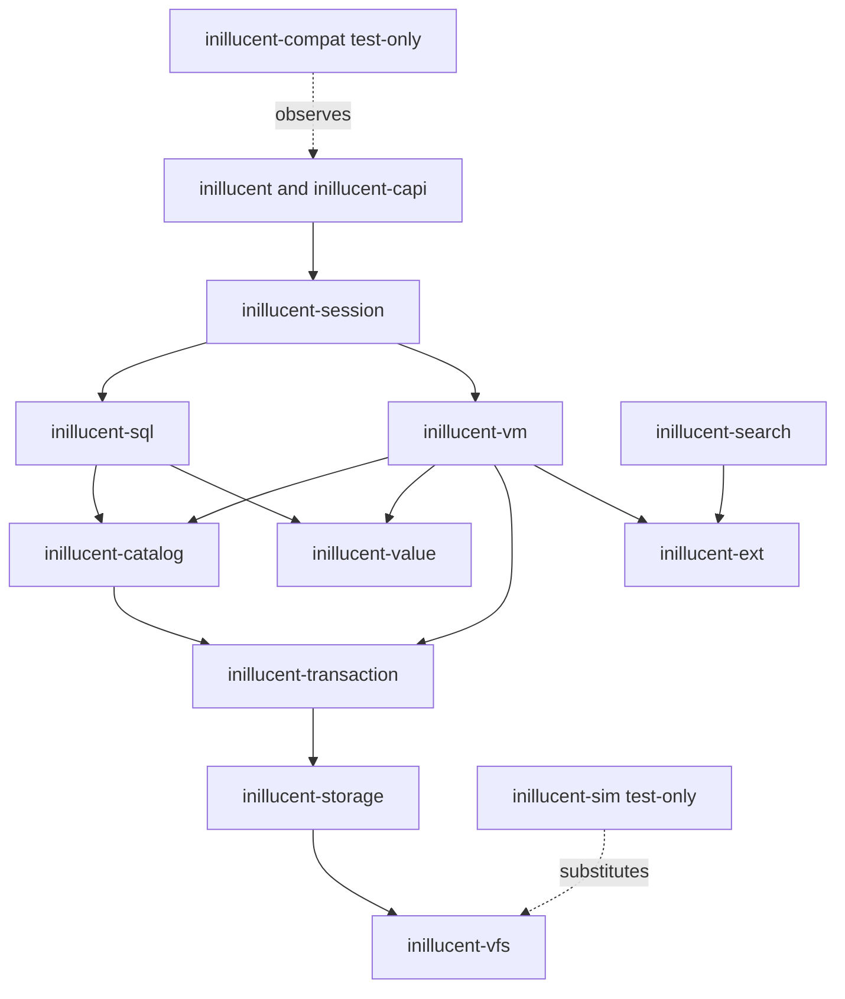

# task-1781: SQLite feature parity and performance

Status: proposed design  
Target reference: SQLite 3.53.4, released 2026-07-24  
Scope: research and technical design only; this document changes no runtime behavior

## Decision in one page

inillucent will become a full embedded SQL database by implementing its own relational engine in Rust.
The parser, resolver, catalog, planner, bytecode compiler and VM, value semantics, record codec,
pager, page cache, B-trees, rollback journal, WAL, recovery, locking, functions, extension boundary,
public APIs, and conformance harness are inillucent-owned source. SQLite and Turso are specifications,
behavioral references, test oracles, and sources of ideas only. Neither engine is linked, embedded,
vendored, translated, forked, or required at runtime.

This is independent implementation, not cosmetic ownership. General-purpose support crates may be
used for checksums, synchronization, tracing, testing, and operating-system bindings only when they
do not implement a database subsystem. Every compatibility claim comes from inillucent's
machine-readable parity manifest, differential tests against the exact SQLite reference build,
deterministic crash and I/O fault testing, and release evidence generated from inillucent code.

The existing `inillucent-core` remains the proven retrieval implementation. Its document store,
BM25, HNSW, quantization, hybrid ranking, and filters become a native `inillucent_search` index method
and virtual-table surface over ordinary relational tables. Existing callers keep a compatibility
adapter while new callers use SQL. A future migration copies each generation-based index into a
SQLite-format database, verifies row counts, content hashes, filter results, and a fixed query set,
and leaves the source generation untouched.

“Feature parity” means observable parity with a pinned SQLite release in three dimensions:

1. SQL and runtime behavior, including types, errors, edge cases, historical quirks, limits, and
   unsupported syntax.
2. File compatibility and transaction behavior, including cross-opening files, rollback and WAL
   modes, locking, crash recovery, and `PRAGMA integrity_check`-equivalent validation.
3. Embedded interfaces, including prepared statements, binding, result access, hooks, backup,
   serialization, extensions, virtual tables, and the documented C API compatibility profile.

Performance is a separate gate after correctness. Every benchmark runs the same SQL, data, journal
mode, synchronous policy, cache state, transaction boundaries, and durability guarantees in both
engines. A result cannot be called faster if inillucent did less work or provided weaker durability.
The headline gate is a lower 95% confidence bound above 1.20x for an operation family and a lower
bound above 1.50x for the weighted geometric mean of the target workload. No required correctness,
durability, or compatibility gate may regress to buy that speed.

## Introduction

inillucent is currently a fast, carefully measured embedded retrieval index. It holds one fixed
document/chunk shape, vector and lexical indexes, dictionary-encoded filter fields, append and
tombstone mutations, and generation-based persistence. The requested destination is much larger:
a small but full-featured relational database with SQLite-compatible tables, schemas, transactions,
queries, updates, extensions, files, and application interfaces, while retaining inillucent's search
advantage and proving meaningful speedups against SQLite.

SQLite is not a small feature checklist. Its default distribution includes a broad SQL dialect,
dynamic typing, constraints, triggers, views, recursive CTEs, window functions, JSON, FTS5,
R-Tree, virtual tables, prepared statements, multiple attached databases, rollback journals, WAL,
backup and serialization APIs, platform VFS implementations, documented limits, and compatibility
quirks retained over decades. SQLite's own quality page reports four independent harnesses,
millions of cases, crash and power-loss simulation, fault injection, fuzzing, boundary tests, and
100% branch and MC/DC coverage for the core in its private TH3 harness. The design must treat the
test system as part of the database, not as work added after the engine.

## Goals and non-goals

### Goals

- Match the documented behavior of SQLite 3.53.4, with every supported and unsupported feature
  represented in a versioned parity manifest.
- Read databases produced by SQLite 3.x and write databases SQLite 3.53.4 can read, including
  `rowid`, `WITHOUT ROWID`, `STRICT`, index, freelist, overflow, text-encoding, and schema formats.
- Match statement-level atomicity, autocommit, explicit transactions, savepoints, conflict
  algorithms, serializable isolation, WAL snapshot behavior, locking, and crash recovery.
- Match SQLite's value storage classes, affinity, coercion, comparison, collation, NULL, numeric,
  aggregate, ordering, and historical quirk semantics.
- Provide an idiomatic Rust API and a separately gated SQLite C API compatibility layer.
- Support SQLite's extensibility model: scalar, aggregate, and window functions; collations;
  virtual tables; table-valued functions; VFS implementations; authorizer and update hooks.
- Preserve the current inillucent search quality and expose it as a native, transactional SQL feature.
- Reuse public upstream test assets where licenses allow and add independent differential,
  property, fault, crash, concurrency, malformed-file, and boundary testing.
- Measure inillucent and SQLite with the same workload contract and prove practical, statistically
  supported speedups on selected operation families without hiding regressions.
- Keep the library embedded, serverless, cross-platform, deterministic, and usable without a
  background process.

### Measurable success criteria

| Gate | Release criterion |
|---|---|
| Parity manifest | 100% of in-scope rows are `pass`; no `unknown`, `partial`, or undocumented deviation |
| SQLLogicTest | 100% pass on the pinned corpus; every exclusion names an SQLite-inapplicable test and reason |
| SQLite conformance | 100% pass on the public tests adopted for the target profile |
| Differential corpus | Zero unexplained result, type, column-name, row-count, error-code, or transaction-state differences |
| File interop | SQLite and inillucent cross-open and mutate every fixture in both directions without `integrity_check` failure |
| ACID | Zero torn, lost-acknowledged, dirty, non-repeatable, or forked-history outcomes across the fault matrix |
| Robustness | No panic, UB, leak, hang, or out-of-bounds access on malformed SQL/files and injected OOM/I/O faults |
| Search compatibility | Existing fixed query pack stays within its declared quality and latency non-regression margins |
| Performance | Weighted geomean lower 95% confidence bound at least 1.50x versus SQLite; required families meet their own floors |
| Portability | Windows x64 and Linux x64 pass; file fixtures round-trip across endian-independent encodings |

### Non-goals

- Implement SQL features SQLite itself omits. `GRANT`, `REVOKE`, statement-level triggers, directly
  writable views, and unsupported `ALTER TABLE` forms should fail as the pinned SQLite build fails.
- Reproduce undefined behavior, memory-safety defects, or corrupt output from a SQLite bug. A known
  deviation needs a fixture, risk decision, and explicit manifest entry; it is never accidental.
- Claim that every SQL operation will beat SQLite. The scorecard reports wins, equivalence,
  inconclusive results, and losses by family. Headline claims follow predeclared gates.
- Add a network server, distributed consensus, replication protocol, or PostgreSQL wire protocol.
- Preserve inillucent's current generation-directory format as the relational database file format.
  It remains readable only for migration and compatibility.
- Change current production users, defaults, or files as part of this research ticket.

## Definitions and parity contract

### Reference build

Pin all comparisons to the official SQLite 3.53.4 amalgamation by source ID and SHA3-256, with a
checked-in metadata file that records:

- SQLite version, source ID, and amalgamation checksum;
- compile options and enabled extensions;
- page size, journal mode, `synchronous`, cache size, temp store, mmap, and foreign-key settings;
- compiler, optimization flags, target, OS, filesystem, CPU, memory, and storage device;
- inillucent commit, Rust toolchain, feature flags, dependency lockfile hash, and reference-source revisions;
- corpus generator version and seed.

The reference profile enables the normal SQLite distribution, JSON and math functions, FTS5,
R-Tree, column metadata, session/preupdate hooks, and thread safety. A second minimal profile can
measure footprint, but it cannot substitute for the parity profile.

### What counts as the same behavior

For each operation, compare all observable output:

- success versus error, primary and extended error code, and transaction state;
- result row count, order where SQL defines it, column count, names, declared types, storage class,
  byte value, and text encoding behavior;
- `changes`, `total_changes`, `last_insert_rowid`, hook invocation order, and autocommit state;
- database, WAL, journal, and temporary-file effects at documented synchronization points;
- schema objects, `sqlite_schema` SQL, sequence values, planner-visible statistics, and PRAGMA rows;
- lock and busy behavior across connections and processes;
- output after close, reopen, checkpoint, rollback, crash, and recovery.

Unordered result sets are canonicalized by storage class and SQLite's byte-level value rules only
inside the test harness. The engine itself must not promise an order SQLite does not promise.

### Parity manifest

Add `compat/sqlite-3.53.4.toml` as the source of truth. One row represents one documented
requirement, syntax production, function signature, PRAGMA mode, C API family, file-format case,
limit boundary, extension capability, or intentional omission.

```toml
[[capability]]
id = "sql.select.window.exclude"
source = "https://sqlite.org/windowfunctions.html"
profile = "default"
status = "pass"
tests = ["compat/window/exclude.sqltest", "upstream/window8.test"]

[[capability]]
id = "sql.grant"
source = "https://sqlite.org/omitted.html"
profile = "negative-parity"
status = "pass"
expected = "syntax-error"
tests = ["compat/negative/omitted.sqltest"]
```

Allowed implementation states are `missing`, `partial`, `pass`, and `intentional-deviation`.
Only `pass` is releaseable in the full profile. `intentional-deviation` is useful during development
but does not satisfy full parity. A generator reads the manifest and produces the human scorecard,
missing-test report, and CI shards; a documentation claim cannot exist without a test link.

SQLite's requirements system is the model: documented testable statements have stable identifiers
and evidence is traceable back to tests. Import requirement IDs where available rather than
inventing a second description of the same behavior.

## Problem statement

### Current inillucent state

| Area | Current capability | Gap to SQLite parity |
|---|---|---|
| Data model | Fixed `Document` and `Chunk` structs with dictionary-backed metadata | General tables, columns, rows, schemas, catalog, values, constraints |
| Query | Vector, lexical, hybrid, filters, grouped retrieval | SQL parsing, name resolution, expressions, joins, grouping, subqueries, CTEs, windows |
| Mutation | Bulk add, incremental append, tombstone, document replacement | INSERT, UPDATE, DELETE, RETURNING, conflict handling, statement rollback |
| Persistence | Five binary sections in immutable numbered generations behind an atomic pointer | SQLite pages, B-trees, freelist, overflow, rollback journal, WAL, locking, VFS |
| Consistency | A whole index generation becomes current atomically | User transactions, connection snapshots, isolation, savepoints, concurrent access |
| Schema | Compile-time Rust fields | `sqlite_schema`, DDL, attached `main`/`temp`/named databases |
| Indexes | HNSW and BM25 built around chunk ordinals | General B-tree, composite, unique, partial, expression, covering, automatic indexes |
| Types | Rust fields and serialized primitives | SQLite storage classes, affinity, STRICT, collation, coercion, subtypes |
| API | Direct Rust `Index` calls | connection, prepare/bind/step/reset/finalize, hooks, backup, blob, C ABI |
| Tests | Strong retrieval, persistence, ranking, and benchmark coverage | SQL, file interop, ACID fault matrix, concurrency, hostile input, limits |

The existing generation save is power-loss aware for one immutable index snapshot, but it is not a
transaction subsystem. It cannot expose uncommitted changes to one connection, preserve an older
snapshot for another, roll back one statement, commit across attached databases, coordinate
multiple processes, or incrementally persist dirty pages.

### Why adding a parser is not enough

SQL syntax is a small part of compatibility. `SELECT 1='1'`, a PRIMARY KEY that accepts NULL in a
non-STRICT rowid table, an `INTEGER PRIMARY KEY DESC` that is not a rowid alias, foreign keys being
off by default, bare columns beside one `min()` or `max()`, keyword identifiers, double-quoted
string compatibility, and equal join precedence are all observable SQLite behavior. A generic
SQL-92 parser actively works against some of these rules.

The storage and transaction layers carry similar hidden contracts: page checksums and WAL salts,
hot-journal detection, lock escalation, statement savepoints, busy-handler eligibility, sync
ordering, cache invalidation, ATTACH atomicity, and error behavior after partial execution. These
are where superficially working databases lose data.

## Architectural overview



### Base strategy: first-party implementation with clean reference boundaries

All production engine paths are implemented in this repository. SQLite defines the compatibility
contract and serves as the black-box differential oracle. Its public documentation defines file and
journal formats. Public SQLite tests provide cases where their licenses allow. Turso is useful for
studying how another Rust project decomposes an embedded database and tests asynchronous failure,
but no Turso source, generated parser, bytecode, file codec, API implementation, or crate is copied
or included.

The repository enforces that boundary:

- `docs/reference-register.toml` records each external reference, version, license, URL, and the
  inillucent design decision it informed;
- `deny.toml` and a workspace dependency policy reject SQLite/Turso/libSQL/database-engine crates
  from production dependency graphs;
- a provenance check rejects copied files, upstream copyright banners, and suspiciously identical
  large source regions before merge;
- oracle binaries run only from `inillucent-compat` test processes and are unavailable to production
  crates through feature flags or transitive dependencies;
- test fixtures derived from public sources retain their licenses and live separately from
  inillucent-authored tests;
- every production module has a inillucent design section, owner, invariant list, and independent test
  plan in this document.

## Components and interfaces

### Proposed workspace

| Crate | Responsibility |
|---|---|
| `inillucent` | Stable public Rust facade: `Database`, `Connection`, `Statement`, `Rows`, `Transaction` |
| `inillucent-sql` | First-party lexer, parser, AST, binder, semantic rewrites, logical and physical plans |
| `inillucent-value` | First-party values, affinities, collations, expression primitives, records, varints |
| `inillucent-catalog` | First-party schema objects, DDL catalog mutations, statistics, invalidation |
| `inillucent-vm` | First-party bytecode compiler, verifier, VM, relational operators, statement lifecycle |
| `inillucent-storage` | SQLite file codec, B-trees, pager, page cache, overflow, freelist |
| `inillucent-transaction` | Locks, autocommit, savepoints, rollback journal, WAL, checkpoints, recovery |
| `inillucent-vfs` | Sync/async platform I/O, locks, clocks, randomness, faultable test VFS |
| `inillucent-ext` | Scalar/aggregate/window functions, collations, virtual tables, loadable extensions |
| `inillucent-capi` | Versioned SQLite C API compatibility surface and ABI tests |
| `inillucent-core` | Existing BM25, vector, hybrid ranking, filters, persistence-reader compatibility |
| `inillucent-search` | SQL virtual table and index-method bridge to `inillucent-core` |
| `inillucent-compat` | Manifest generator, SQLite oracle driver, SQLLogicTest and upstream-test adapters |
| `inillucent-bench` | Existing grading framework extended with relational workloads and SQLite baseline |
| `inillucent-sim` | Deterministic scheduler, in-memory VFS, I/O/OOM faults, crash and concurrency models |
| `inillucent-cli` | SQLite-like shell needed for compatibility testing and manual diagnosis |

The crate graph below is the implementation boundary. Low-level crates cannot depend on SQL or API
crates, and production crates cannot depend on `inillucent-compat`, `inillucent-sim`, benchmark code, SQLite,
or Turso. Cycles are forbidden and checked in CI.

### Public Rust interface

The facade should make safe ownership easy without hiding SQLite state:

```rust
let database = inillucent::Database::open("app.db").await?;
let connection = database.connect().await?;

let mut statement = connection.prepare(
    "SELECT id, title FROM notes WHERE project_id = ?1 ORDER BY updated_at DESC"
).await?;
statement.bind(1, project_id)?;

while let Some(row) = statement.next().await? {
    let id: i64 = row.get(0)?;
    let title: &str = row.get(1)?;
}
```

Required API properties:

- `Database` owns shared pager/cache state; each `Connection` owns transaction and PRAGMA state.
- `Statement` is bound to one connection, can be reset and rebound, and exposes SQLite-like
  prepare/step semantics even when the Rust convenience API offers `query` and `execute`.
- Values support NULL, signed 64-bit integer, IEEE-754 binary64, text bytes with encoding at the
  file boundary, and arbitrary blobs. Conversion helpers are explicit and fallible.
- Cancellation interrupts at VM safe points and returns the matching interrupt error without
  leaving a transaction or lock half-finished.
- Sync and async adapters drive the same state machine. Async support must not change transaction
  boundaries or callback ordering.
- Busy handlers, progress handlers, authorizers, commit/rollback/update/preupdate/WAL hooks, custom
  functions, collations, virtual tables, backup, incremental blob I/O, serialize, and deserialize
  have explicit registration lifetimes.

### Parser, resolver, and SQLite semantics

Implement a inillucent-owned SQLite-dialect lexer and parser rather than using Turso, SQLite-generated
parser output, or `sqlparser-rs`. The latter is a useful multi-dialect syntax parser but explicitly
does not enforce database-specific semantics and accepts statements a real engine may reject.
Parity needs SQLite's grammar ambiguities and keyword fallback behavior under our control.

The front end is split into:

1. tokenizer and parser to a lossless-enough SQLite AST;
2. catalog/name resolver for `main`, `temp`, attached schemas, aliases, `rowid` names, `OLD`/`NEW`,
   window names, CTE scope, and correlated references;
3. affinity and collation propagation;
4. semantic validation and limit enforcement;
5. planner and bytecode compiler.

Parser acceptance is tested independently from execution. Every syntax diagram in SQLite's
language index receives positive and negative fixtures, including comments, parameters, quoting,
UPSERT ambiguity, RETURNING, generated columns, STRICT and WITHOUT ROWID options, window frames,
recursive CTEs, FILTER, null ordering, RIGHT/FULL joins, and new 3.53 constraint changes.

### Values, records, and comparison

Implement one canonical `Value` representation with the five SQLite storage classes. Do not map
declared SQL type names directly to Rust types. Column declarations determine affinity; values keep
their storage class unless SQLite's documented affinity or operator rules convert them.

The semantics module owns:

- declared-type-to-affinity rules in documented precedence order;
- numeric literal parsing, integer overflow promotion, casts, and lossless conversion;
- three-valued boolean and NULL behavior;
- arithmetic, bitwise, concatenation, comparison, `IS`, `IN`, `BETWEEN`, LIKE, GLOB, and MATCH;
- BINARY, NOCASE, and RTRIM collations plus application-defined collations;
- GROUP BY, DISTINCT, compound-select, and ORDER BY equality/order rules;
- STRICT table enforcement and `ANY` behavior;
- SQLite subtypes needed by JSON and extension APIs;
- result column naming and declared-type metadata.

Record encoding uses SQLite serial types and varints exactly. Corrupt or non-canonical records must
return a corruption error, never panic or allocate from an unchecked length.

### Catalog and schema

SQLite does not implement `CREATE SCHEMA`. Its schemas are `main`, `temp`, and names introduced by
`ATTACH`. Match that model.

`sqlite_schema` stores canonical object rows for tables, indexes, views, and triggers. The catalog
layer parses stored SQL on open, manages schema cookies, invalidates prepared statements when the
schema changes, and exposes the documented aliases and introspection PRAGMAs.

Support:

- ordinary rowid tables, INTEGER PRIMARY KEY aliases, AUTOINCREMENT and `sqlite_sequence`;
- WITHOUT ROWID tables and clustered primary-key storage;
- STRICT tables and generated VIRTUAL/STORED columns;
- TEMP objects and name-resolution precedence;
- tables, indexes, views, triggers, virtual tables, and shadow tables;
- ALTER behaviors SQLite implements, including rename/add/drop column and 3.53 constraint changes;
- DROP, schema reparsing, legacy alter behavior, and writable-schema safeguards;
- ATTACH/DETACH and cross-database name resolution.

### Planner and virtual machine

Retain a prepared-statement bytecode VM because it aligns with SQLite's prepare/step contract,
triggers, coroutines, subqueries, and resumable async I/O. Add vectorized execution only behind VM
operators whose row-at-a-time observable behavior is unchanged.

Planner coverage includes:

- full scans; rowid and WITHOUT ROWID primary-key lookup;
- single and composite B-tree seeks and ranges;
- covering, descending, collated, partial, and expression indexes;
- automatic indexes and OR-by-union plans;
- nested-loop join ordering through 64 tables, outer joins, and join-strength reductions;
- sort, partial/block sort, DISTINCT and GROUP BY avoidance;
- LIMIT pushdown, MIN/MAX, LIKE, skip-scan, constant propagation, and predicate pushdown;
- subquery flattening versus materialization and correlated subqueries;
- ordinary, recursive, materialized, and non-materialized CTEs;
- window partitions, orderings, frames, FILTER, and EXCLUDE;
- statistics from ANALYZE and `sqlite_stat1`/`sqlite_stat4`;
- `EXPLAIN` bytecode and `EXPLAIN QUERY PLAN` diagnostic output.

Planner output is never used as the compatibility oracle because SQLite documents EXPLAIN formats
as unstable. Result behavior is normative; plan-shape tests protect inillucent performance only.

### Pager, B-trees, and file format

The pager is the only component allowed to read or write database, journal, WAL, shared-memory, or
temporary files. Higher layers work with logical pages and transactions.

Required file behavior:

- page sizes from 512 through 65,536 bytes and the 100-byte database header;
- table and index interior/leaf B-tree pages;
- local payload thresholds, overflow chains, freeblocks, fragments, and freelist trunks/leaves;
- pointer-map pages and auto/incremental vacuum;
- SQLite record serial types, varints, UTF-8/UTF-16LE/UTF-16BE, collating keys, and rowid order;
- schema cookies, change counters, version-valid-for, application/user version, and reserved bytes;
- database, rollback journal, super-journal, WAL, WAL-index/shared-memory, and temp file formats;
- cross-platform byte order and forward/backward compatibility rules for SQLite 3 files;
- incremental blob access and backup/serialize/deserialize snapshots.

The page cache uses stable page identities, pin counts, dirty state, transaction ownership, and an
explicit eviction policy. Read and write paths must function with direct buffered I/O first; mmap
and io_uring are optimizations gated by the same compatibility suite.

### Transactions, isolation, and durability

Match SQLite's transaction state machine before adding inillucent extensions:

- every read or write occurs inside an implicit or explicit transaction;
- implicit transactions commit when the last active statement finishes;
- `BEGIN DEFERRED`, `IMMEDIATE`, and `EXCLUSIVE` acquire locks at SQLite-compatible points;
- explicit transactions do not nest; SAVEPOINT/RELEASE/ROLLBACK TO provide nesting;
- one connection may have multiple active statements with the same documented interactions;
- a failed statement rolls back according to ROLLBACK, ABORT, FAIL, IGNORE, or REPLACE semantics;
- rollback mode provides serializable isolation by excluding readers during database writes;
- WAL provides stable read snapshots with concurrent readers and one serialized writer;
- stale snapshot escalation returns the matching busy-snapshot error;
- busy timeout/handler behavior distinguishes lock contention from same-connection misuse;
- attached-database commit atomicity matches SQLite's mode-specific guarantees;
- acknowledged FULL-synchronous commits survive process crash and modeled power loss.

An eventual inillucent MVCC or concurrent-writer mode is a separate, opt-in post-parity extension. It
must never silently replace SQLite's default isolation. Files using incompatible extensions carry
an explicit application/file marker and a documented path back.

### Indexes and constraints

All constraint enforcement occurs inside a statement savepoint so errors cannot leave partial
effects unless SQLite's FAIL algorithm intentionally preserves prior row effects.

Support PRIMARY KEY, UNIQUE, NOT NULL, CHECK, FOREIGN KEY, generated-column dependencies, and
collation-aware uniqueness. Foreign keys must include runtime enablement, immediate/deferred modes,
composite keys, MATCH behavior, ON DELETE/UPDATE actions, cycles, trigger interaction, and
`foreign_key_check`. Index maintenance is part of the same transaction as the table write.

### Functions and extensions

Build a generated registry from the reference SQLite profile:

- core scalar functions and operators;
- aggregate and window functions;
- date/time and mathematical functions;
- JSON text and JSONB functions, table-valued `json_each` and `json_tree`;
- FTS5 query syntax, ranking, tokenizers, auxiliary APIs, and shadow tables;
- R-Tree virtual tables;
- application-defined scalar, aggregate, window, and table-valued functions;
- application-defined collations and virtual table modules;
- loadable extensions behind a disabled-by-default security switch.

Extension ABI compatibility is tested with small C extensions compiled once and loaded by both
engines. An extension claiming a SQLite ABI version must receive the same callback contracts and
error lifetime.

### Integrating the existing search engine

Expose current retrieval through two additive surfaces:

1. `inillucent_search` index method for text/vector columns, planner-visible for MATCH and vector
   distance predicates.
2. `inillucent_hybrid_search(table, query, vector, options)` table-valued function returning rowid,
   score, confidence, origin, and explanation.

The SQL transaction owns search-index visibility. Insert/update/delete changes append to a
transaction-local delta; commit publishes it with the relational WAL commit, rollback discards it,
and readers merge their visible immutable generation with committed deltas. Background compaction
publishes a replacement generation only after its source LSN range is durable and still current.

The current direct `Index` API is backed by a compatibility adapter during migration. Search scores
remain explicitly non-SQL ordering values: equality, constraints, and joins never depend on an
approximate index result.

## Data flows and security

### Prepared query



### Durable write and recovery



The ordering points above are fault-injection boundaries. In-memory durable offsets, checksums,
commit sequence numbers, and schema state may advance only after the corresponding write and sync
operation confirms success.

### Security and robustness boundaries

- Treat SQL text, bound values, database files, extensions, and VFS results as hostile inputs.
- Validate page numbers, cell offsets, varints, lengths, overflow chains, record serial types,
  encodings, recursion depth, and allocation sizes before use.
- Enforce per-connection limits before allocation to prevent parameter, expression, compound-query,
  LIKE/GLOB, attached-database, trigger, and page-count denial of service.
- Offer defensive and trusted-schema modes with SQLite-compatible defaults and behavior.
- Disable extension loading by default and require an explicit allow-list callback.
- Keep unsafe code isolated in the C ABI and OS adapters, document invariants, and run Miri,
  sanitizers, and fuzz targets over those boundaries.
- Never log bound values or database content by default. Tracing reports opcodes, page ids, timings,
  and error codes with an explicit redaction policy.
- A malformed file returns a stable corruption/not-a-database error and cannot cause a panic,
  unbounded allocation, path escape, or read outside the mapped file.

## First-party engine charter

### Ownership rule

An implementation agent must be able to build and test inillucent with no SQLite, Turso, libSQL, DuckDB,
or other database engine installed. Production crates may not link to, invoke, translate, vendor, or
generate code from another database engine. The compatibility harness may launch a pinned SQLite
binary as a separate child process and compare serialized observations. That binary is a test oracle,
not a runtime component.

The following are first-party subsystems and cannot be replaced by an external database library:

| Subsystem | inillucent owns |
|---|---|
| SQL front end | tokenizer, parser, AST, spans, diagnostics, statement splitter |
| Semantic analysis | scope graph, name resolution, affinity/collation derivation, validation, rewrites |
| Catalog | schema objects, schema loader, DDL mutation, cookies, invalidation, statistics |
| Planning | logical IR, access paths, cardinality/cost model, join ordering, physical selection |
| Execution | bytecode IR, compiler, VM, cursors, sort/aggregate/window operators, trigger frames |
| Values | storage classes, conversions, comparisons, records, encodings, subtypes |
| Storage | VFS contract, pager, cache, page codec, B-trees, freelist, overflow, pointer maps, vacuum |
| Transactions | autocommit, statement savepoints, locks, rollback journal, WAL, checkpoints, recovery |
| SQL features | DDL, DML, constraints, foreign keys, views, triggers, built-ins, PRAGMAs |
| Extensibility | functions, collations, virtual tables, VFS registration, loadable extension policy |
| Interfaces | Rust API, C compatibility ABI, CLI, backup, blob, serialize, deserialize |
| Assurance | parity manifest, oracle protocol, simulator, fuzzers, crash harness, benchmarks |

### Permitted dependencies

Dependencies are capability-limited and approved in `docs/dependency-policy.md`. The initial policy
is:

| Category | Permitted examples | Restriction |
|---|---|---|
| Error and data plumbing | `thiserror`, `bitflags`, `smallvec` | No SQL or storage semantics |
| Synchronization | `parking_lot`, `crossbeam` | Locks remain wrapped behind inillucent types |
| OS boundary | `libc`, `windows-sys` | Used only inside `inillucent-vfs`; all calls audited |
| Hash/checksum | `crc32fast`, `sha2` | Algorithms and on-disk use are specified by inillucent/file format |
| Async adaptation | `futures-core`, optional runtime adapters | Core owns polling and cancellation state machines |
| Unicode helpers | Unicode tables or normalization data | Must not parse SQL or choose SQL collation semantics |
| Test-only | `proptest`, `libfuzzer-sys`, `loom`, `criterion` | Cannot enter a production feature graph |

Disallowed production dependencies include SQL parsers, database engines, storage engines, B-tree or
LSM libraries, transaction managers, WAL implementations, query optimizers, and SQLite bindings.
Before adding a crate, the implementation PR records why it is infrastructure rather than delegated
database behavior. `cargo tree --edges normal` is compared with an allow-list in CI.

### Clean-reference workflow

External implementations may answer “what behavior exists” and “what failure did another project
encounter,” but not “copy this source.” Each subsystem begins from this TDD and public specifications.
For compatibility edge cases, add a black-box oracle test first, record the SQLite observation as
structured data, then implement from the observed contract. When public documentation and the oracle
disagree, pin the behavior to the reference build and open a manifest decision rather than reading
implementation source to transplant its algorithm.

`docs/reference-register.toml` contains:

```toml
[[reference]]
name = "SQLite database file format"
kind = "normative-format"
version = "3.53.4"
url = "https://sqlite.org/fileformat.html"
used_by = ["inillucent-storage", "inillucent-transaction"]

[[reference]]
name = "Turso deterministic simulator"
kind = "non-normative-design-reference"
revision = "pinned-for-review-only"
url = "https://github.com/tursodatabase/turso/tree/main/testing/simulator"
used_by = ["inillucent-sim test-plan"]
production_dependency = false
```

### Layering and dependency direction



Rules checked with a dependency-graph test:

1. `value` and `vfs` have no internal dependencies.
2. `storage` knows pages and byte records, never SQL, tables, or expressions.
3. `transaction` owns visibility and durability but never evaluates SQL.
4. `catalog` maps schema objects to storage roots through transaction interfaces.
5. `sql` is pure parsing, binding, planning, and compilation; it performs no I/O.
6. `vm` is the sole coordinator of compiled programs, transactions, cursors, and extensions.
7. `session` owns connection-local state and lifecycle.
8. C ABI and CLI are adapters; no engine behavior lives there.
9. Test/oracle crates may depend inward; production crates never depend outward on them.

### Repository and module map

```text
crates/
  inillucent/                    public Rust facade
  inillucent-value/              values, affinities, collations, records, varints
  inillucent-sql/                lexer, parser, AST, binder, rewrites, logical and physical plans
  inillucent-catalog/            sqlite_schema, DDL, schema loading, statistics
  inillucent-vm/                 bytecode, compiler, VM, relational operators
  inillucent-storage/            page codec, pager, cache, B-tree, freelist, vacuum, temp storage
  inillucent-transaction/        locks, journals, WAL, savepoints, recovery, checkpoints
  inillucent-vfs/                OS and in-memory VFS implementations
  inillucent-ext/                registries and virtual-table contracts
  inillucent-capi/               SQLite C compatibility profile
  inillucent-cli/                interactive shell and dot commands
  inillucent-search/             transactional adapter to existing BM25/HNSW core
  inillucent-core/               existing retrieval implementation and legacy reader
  inillucent-compat/             parity manifest, oracle protocol, public test adapters
  inillucent-sim/                deterministic executor, model VFS, failure injection
  inillucent-bench/              correctness-qualified performance harness
compat/
  sqlite-3.53.4.toml         capability denominator and evidence links
  oracle/                    request/response schema and pinned reference metadata
  fixtures/                  licensed upstream and inillucent-authored fixtures, separated
  api/                       C symbol/profile manifests and ABI probes
fuzz/                        SQL, file, WAL, journal, VM, API-sequence fuzz targets
tests/
  conformance/               semantic and negative-parity cases
  crash/                     generated failure schedules and expected outcomes
  interop/                   cross-open, cross-write, checkpoint, backup fixtures
  workloads/                 deterministic benchmark and application traces
docs/
  dependency-policy.md
  reference-register.toml
  invariants/                one checked contract per subsystem
```

Every module begins with an invariant comment and exposes a narrow interface. Implementation
functions follow repository rules: descriptive names, JSDoc/rustdoc intent comments, single-line
parameter lists, and decomposition before a function exceeds roughly 50 lines.

## Core data contracts

### Identifiers and generations

Use newtypes rather than interchangeable integers:

```rust
pub struct DatabaseId(u32);
pub struct PageId(NonZeroU32);
pub struct RootPageId(PageId);
pub struct SchemaCookie(u32);
pub struct ConnectionId(u64);
pub struct TransactionId(u64);
pub struct SavepointId(u32);
pub struct WalFrameNo(u32);
pub struct CommitSequence(u64);
pub struct CursorId(u32);
pub struct RegisterId(u32);
```

`PageId` is one-based. Zero is accepted only where the SQLite format uses it as a null page pointer.
Every conversion from bytes validates range before constructing a newtype. Arithmetic uses checked
operations and returns `TooBig`, `Full`, or `Corrupt` rather than wrapping.

### Values

```rust
pub enum Value {
    Null,
    Integer(i64),
    Real(f64),
    Text(TextValue),
    Blob(BlobValue),
}

pub struct MemValue {
    pub value: Value,
    pub subtype: u32,
    pub flags: ValueFlags,
}
```

`TextValue` and `BlobValue` may borrow input/page bytes for the duration of a VM step or own an
immutable buffer. Borrowed values cannot escape `RowRef`; `Row::to_owned` copies them. `Real` retains
IEEE-754 bits, including signed zero; conversion and comparison modules decide SQLite-visible
behavior for NaN and infinities. `subtype` is preserved only across operations that SQLite preserves.

### Error model

`DbError` stores a stable primary code, extended code, safe message, optional SQL byte offset,
optional database name, and internal source. Public adapters never expose OS paths or bound values
unless explicitly requested by a diagnostic callback.

```rust
pub struct DbError {
    pub code: PrimaryCode,
    pub extended: ExtendedCode,
    pub message: String,
    pub sql_offset: Option<u32>,
    pub database: Option<DatabaseName>,
}
```

The error table is generated from `compat/errors.toml`. It maps every in-scope SQLite primary and
extended code to Rust and C representations and defines whether the connection remains usable,
whether a statement is resettable, and whether a transaction was rolled back. `panic!`, unchecked
indexing, and `unwrap` are forbidden on SQL/file/VFS input paths.

### Connection state

```rust
pub struct ConnectionState {
    pub id: ConnectionId,
    pub databases: Vec<AttachedDatabase>,
    pub transaction: TransactionState,
    pub pragmas: ConnectionPragmas,
    pub schema_generations: Vec<SchemaCookie>,
    pub active_statements: ActiveStatementSet,
    pub hooks: HookRegistry,
    pub interrupt: Arc<AtomicBool>,
    pub last_insert_rowid: i64,
    pub changes: u64,
    pub total_changes: u64,
}
```

Connection-local mutation is serialized. A `Connection` is movable across threads but cannot be
stepped concurrently unless a future explicit serialized wrapper takes the same connection mutex.
Separate connections share cache state and coordinate through transaction locks.

## SQL front end implementation

### Source text, tokens, and diagnostics

`inillucent-sql/src/lexer.rs` scans UTF-8 SQL bytes once and emits `Token { kind, span }`; token text is
always a slice of the original SQL. The lexer does not allocate identifier strings. A `Span` is a
half-open byte range and every AST node carries one. Line/column conversion is lazy so normal prepare
does not scan input twice.

Token families cover:

- whitespace and both SQLite comment forms;
- bare, bracketed, backtick, and double-quoted identifiers;
- single-quoted strings with doubled quote escapes and blob literals;
- decimal, leading-dot, hexadecimal, exponent, and underscore-enabled numeric forms accepted by the
  pinned release;
- positional `?`, numbered `?NNN`, named `:name`, `@name`, and `$name` parameters;
- punctuation and every one-, two-, and three-byte operator;
- keyword candidates, retaining original case and spelling;
- end-of-input and an explicit invalid token containing the first bad byte offset.

The keyword table is generated from a checked-in target-release manifest, not upstream parser code.
The parser asks whether a token may fall back to an identifier in each grammar position. This is
required for SQLite's historical keyword-as-identifier compatibility. Double-quoted-string behavior
is controlled by connection DQS flags during semantic analysis rather than lexing.

Lexer invariants:

1. Every input byte belongs to exactly one token or trivia span.
2. Token spans are ordered, non-overlapping, and within the source.
3. Invalid UTF-8 may occur inside blob/text byte inputs but SQL text passed to the Rust API is UTF-8;
   the C API validates or converts UTF-8/UTF-16 inputs at its boundary.
4. An unterminated quote or comment reports the opening byte.
5. Parameter indices never exceed the configured variable limit and gaps behave like SQLite.

### Parser architecture

Implement a hand-written recursive-descent statement parser and Pratt expression parser. Grammar
productions are transcribed as inillucent design tables from SQLite's published syntax diagrams and
validated with independent fixtures. No generated SQLite grammar or parser source enters the repo.

The entry points are:

```rust
pub fn parse_next_statement(source: &SqlSource, offset: usize, limits: &Limits) -> Result<ParsedStatement>;
pub fn parse_expression(source: &SqlSource, limits: &Limits) -> Result<Spanned<Expr>>;
pub fn classify_statement(source: &SqlSource) -> StatementClass;
```

`ParsedStatement` returns the AST, byte count consumed, parameter declarations, and trailing-comment
position. It supports SQLite prepare semantics where one statement is compiled and the caller receives
the unused tail. Empty statements succeed with no program.

The Pratt precedence table is an explicit data file checked by tests. It includes postfix COLLATE and
ESCAPE, unary operators, concatenation/extract operators, arithmetic, bitwise, comparisons, equality,
IS forms, BETWEEN, IN, LIKE/GLOB/REGEXP/MATCH, ISNULL/NOTNULL, AND, and OR. Special forms such as
`NOT BETWEEN`, `NOT IN`, `IS DISTINCT FROM`, and `IS NOT DISTINCT FROM` are parsed as semantic nodes,
not reconstructed from generic unary expressions.

Statement parsers cover every production linked by SQLite `lang.html`: ALTER TABLE, ANALYZE, ATTACH,
BEGIN, COMMIT, CREATE INDEX/TABLE/TRIGGER/VIEW/VIRTUAL TABLE, DELETE, DETACH, DROP, END, INSERT,
PRAGMA, REINDEX, RELEASE, ROLLBACK, SAVEPOINT, SELECT, UPDATE, VACUUM, and WITH prefixes. `EXPLAIN` and
`EXPLAIN QUERY PLAN` wrap any explainable statement.

AST rules:

- preserve source spans, explicit versus implicit aliases, quoting form, conflict clauses, sort
  direction, null ordering, and schema qualification;
- model SELECT cores, compounds, ORDER BY, LIMIT/OFFSET, windows, frames, filters, and CTEs without
  early normalization;
- distinguish table constraints from column constraints and retain their written order;
- represent UPSERT and INSERT SELECT ambiguity explicitly so diagnostics match the target;
- preserve trigger-body statement restrictions and `OLD`/`NEW` qualification;
- store numeric and string literals as source slices; literal conversion happens in semantic analysis;
- enforce parser stack, expression depth, compound SELECT, column, and function-argument limits before
  recursive allocation.

Syntax errors contain the unexpected token, the smallest useful expected-token set, and byte offset.
Tests compare primary code and offset exactly; message prose is stable within inillucent but only compared
with SQLite where SQLite documents it.

### AST ownership and memory

Each prepare call owns an `AstArena`. Nodes use compact IDs, not recursive boxes, to bound allocation
and support iterative walkers. Interned identifiers store case-folded lookup keys plus original spans.
The arena and SQL source live through compilation and are released after bytecode creation unless the
statement requests expanded SQL metadata. A hard `max_ast_bytes` limit is charged before allocation.

### Binding and scope graph

`inillucent-sql/src/bind/` converts AST into a bound relational IR. The binder is pure over an immutable
`CatalogSnapshot` and never opens pages itself.

Resolution proceeds in this order:

1. Install outer query scopes and visible CTE names.
2. Resolve FROM terms left-to-right, including table-valued functions and join constraints.
3. Expand `*` and `table.*` using catalog order and NATURAL/USING suppression rules.
4. Register result aliases for SQLite-permitted GROUP BY, HAVING, and ORDER BY resolution.
5. Bind expressions, preferring columns over aliases where SQLite does.
6. Mark correlated references with their outer frame depth.
7. Resolve window inheritance and reject cycles.
8. Derive affinity and collation candidates.
9. Validate aggregate/window placement and grouping rules.
10. Enforce authorizer decisions before bytecode exists.

`ScopeGraph` nodes identify SELECT, trigger, CTE, and subquery scopes. A bound column is
`ColumnRef { database, root, column, cursor_hint, outer_depth }`. Ambiguous and missing names return
the target error class. `rowid`, `_rowid_`, and `oid` resolve only when not shadowed and only for
rowid-capable tables. `OLD` and `NEW` are legal only in the correct trigger event.

### Semantic normalization

Normalization creates canonical nodes only after behavior is fixed:

- desugar NATURAL and USING into equality predicates while retaining output-column rules;
- lower BETWEEN with single-evaluation semantics;
- lower IN lists/subqueries to dedicated membership operators, preserving NULL behavior;
- expand generated-column dependencies and detect cycles;
- attach explicit collations using SQLite precedence;
- derive type affinities from declarations using ordered substring rules;
- mark constant deterministic expressions eligible for prepare-time folding;
- keep nondeterministic, erroring, collation-sensitive, parameterized, and subtype-sensitive
  expressions for runtime;
- rewrite RIGHT and FULL joins into physicalizable forms while retaining outer-row semantics;
- assign stable expression IDs for statistics, partial-index implication, and bytecode diagnostics.

Rewrites must be equivalence-tested with property-generated values, including NULL, signed zero,
integer boundaries, invalid numeric text, embedded NUL text, and collations.

## Type and expression semantics

### Affinity and conversion

`inillucent-value` implements the five storage classes independently of declared types. The affinity
enum is `Blob`, `Text`, `Numeric`, `Integer`, and `Real`; STRICT validation is a separate policy.
The declaration classifier follows SQLite's documented ordered rules exactly, including surprising
substrings. It emits both affinity and normalized declared type metadata.

All conversions route through named functions such as `apply_affinity`, `cast_value`,
`numeric_from_text`, and `compare_values`. No caller performs ad hoc Rust parsing. Integer parsing
detects signed overflow; NUMERIC affinity retains exact integers where allowed and otherwise yields
binary64. CAST has its own behavior and is not implemented by calling affinity conversion.

### Comparison and collation

Comparison has two stages: determine conversions from operand affinity and operator context, then
order storage classes and compare payloads. The engine supplies BINARY, NOCASE, and RTRIM collations
with byte-for-byte target behavior. Index keys record the collation identity per field; a plan may
use an index only when expression and index collations agree.

`CollationRegistry` assigns a generation to each named collation. Replacing a collation invalidates
prepared statements and marks dependent indexes as requiring REINDEX before they can be trusted for
ordering or uniqueness.

### Expression evaluator

The compiler emits explicit opcodes for three-valued boolean operations, short-circuit control flow,
casts, arithmetic, comparisons, membership, patterns, CASE, function calls, and subqueries.
Divide-by-zero, overflow, shifts, NULL propagation, and text/blob behavior follow oracle cases rather
than Rust defaults. LIKE and GLOB enforce the configured pattern-length limit before compilation or
execution. REGEXP exists only when an application function is registered, matching SQLite.

### Records

`RecordCodec` encodes a header-size varint, serial-type varints, then field payloads. It supports all
SQLite serial types, reserved-code rejection, zero/one integer shortcuts, signed big-endian integer
widths, binary64, text in the database encoding, and blobs. Decode is lazy: `RecordRef` first validates
header and field boundaries, then materializes requested columns. Every size calculation uses checked
arithmetic and the connection length limit.

## Catalog and schema implementation

### Catalog model

```rust
pub struct CatalogSnapshot {
    pub databases: Arc<[DatabaseCatalog]>,
    pub generation: CatalogGeneration,
}

pub struct DatabaseCatalog {
    pub name: DatabaseName,
    pub schema_cookie: SchemaCookie,
    pub encoding: TextEncoding,
    pub objects_by_name: NameMap<SchemaObjectId>,
    pub objects: SlotMap<SchemaObjectId, SchemaObject>,
}

pub enum SchemaObject {
    Table(TableDef),
    Index(IndexDef),
    View(ViewDef),
    Trigger(TriggerDef),
    VirtualTable(VirtualTableDef),
}
```

On open, the catalog reads the page-1 header, scans the `sqlite_schema` table rooted at page 1,
validates each row, parses stored CREATE SQL with the inillucent parser, and verifies root-page/object
relationships. Catalog construction occurs in a read transaction so all objects share one snapshot.
Malformed schema SQL returns `Corrupt` with the object name.

### Schema objects

`TableDef` records ordered columns, hidden/generated flags, declared types, affinities, defaults,
collations, constraints, rowid alias, WITHOUT ROWID/STRICT flags, root page, and dependent objects.
`IndexDef` stores ordered key expressions, collations, directions, uniqueness, partial predicate,
included row locator, root page, and origin. Views and triggers store both original normalized CREATE
SQL and parsed bodies.

Schema SQL written to `sqlite_schema` is produced by statement-specific normalization rules, not a
generic pretty-printer. ALTER operations perform a transactional catalog rewrite, reparse all affected
objects, validate constraints against existing rows when required, increment the schema cookie, and
invalidate dependent prepared statements only after commit.

### DDL transaction protocol

DDL executes in the same transaction machinery as DML:

1. Acquire the schema write lock for each affected database.
2. Establish a statement savepoint.
3. Validate names, dependencies, limits, and authorizer decisions.
4. Allocate or retire root pages through the B-tree layer.
5. Insert/update/delete canonical `sqlite_schema` rows.
6. Backfill indexes or generated values through ordinary VM programs.
7. Reparse the candidate catalog from transaction-visible pages.
8. Run structural and semantic validation.
9. Bump the schema cookie and publish invalidation on transaction commit.
10. Roll back pages, catalog candidate, and allocations together on any error.

`ALTER TABLE RENAME`, RENAME COLUMN, ADD COLUMN, and DROP COLUMN each have dedicated rewrite code
because their dependency and validation rules differ. `PRAGMA writable_schema` is isolated behind
defensive/trusted-schema checks and forces a full reparse before the schema becomes executable.

### Prepared statement invalidation

Each program records `(database_id, schema_cookie)` pairs and function/collation registry generations.
At first step and after a recoverable schema error, the session compares generations. `prepare_v2`
statements retain SQL and may transparently recompile once where SQLite does; legacy prepare returns
the matching schema error. Active statements keep their original catalog snapshot until reset.

## Planner implementation

### Intermediate representations

The pipeline is:

```text
AST -> BoundStatement -> LogicalPlan -> AccessPathGraph -> PhysicalPlan -> BytecodeProgram
```

Logical nodes include scan, values, project, filter, join, aggregate, window, distinct, sort, limit,
compound, recursive CTE, DML write, DDL operation, and pragma. Expressions refer to bound column and
parameter IDs. Physical nodes choose table/index/virtual scans, nested loops, ephemeral indexes,
sorters, coroutine/materialization, aggregation strategy, and spill policy.

### Statistics

ANALYZE writes and reads SQLite-compatible `sqlite_stat1` and, when enabled, `sqlite_stat4`. Internal
statistics objects expose row count, distinct-prefix estimates, sampled keys, NULL fraction, and
range estimates. Missing statistics use deterministic documented defaults. Statistics are scoped by
schema generation; ANALYZE invalidates affected cached plans at commit.

### Access paths

For each FROM term, enumerate:

- full table or WITHOUT ROWID primary-key scans in either direction;
- rowid equality, range, and IN-loop lookups;
- each compatible B-tree prefix with equality, range, skip-scan, LIKE prefix, and IN constraints;
- covering versus table-lookup variants;
- partial indexes whose predicates are implied by query constraints;
- expression indexes whose normalized expression IDs match;
- OR-by-union combinations with duplicate suppression;
- automatic ephemeral indexes where build cost is recovered by expected probes;
- virtual-table paths returned by `best_index`.

Each path declares consumed predicates, required outer bindings, delivered ordering, uniqueness,
estimated rows, setup cost, per-row cost, memory, and whether it can produce rows lazily.

### Join enumeration

Represent join-order constraints as a directed graph. CROSS joins and outer-join preservation prevent
illegal reordering. Use dynamic programming over legal subsets through 12 reorderable relations;
above 12, use deterministic beam search seeded by selective access paths, then local adjacent swaps.
The configured 64-table limit is supported without exponential allocation. Cost comparison uses a
stable tuple `(estimated_cost, output_rows, temp_bytes, path_tiebreak_id)` so the same schema and stats
produce the same plan.

### Subqueries and CTEs

The planner chooses flattening only when every SQLite semantic guard passes. Otherwise it chooses a
coroutine or materialization based on reuse and ordering. Correlated scalar and EXISTS subqueries
compile as parameterized subprograms. Recursive CTEs use an ephemeral queue with FIFO, priority, or
distinct-set behavior derived from ORDER BY and UNION/UNION ALL. MATERIALIZED and NOT MATERIALIZED
hints are honored within SQLite's documented advisory rules.

### Sort, aggregate, distinct, and window

Ordering properties propagate through plans. A complete index order eliminates sorting; a prefix
uses block sorting. The sorter encodes SQLite comparison keys plus a stable sequence only when needed
to reproduce tie behavior. It begins in memory and spills sorted runs to the VFS temp interface under
a deterministic memory budget.

Aggregates select streaming, ordered-group, or ephemeral B-tree/hash-assisted execution only when
equality/collation semantics are identical. MIN/MAX fast paths preserve bare-column behavior. Window
execution partitions input, maintains peer groups, and implements ROWS, RANGE, GROUPS, FILTER, and
EXCLUDE with inverse functions only when registered and semantically safe.

### Plan cache and explainability

The session caches immutable programs by SQL bytes, prepare flags, attached schemas/cookies, relevant
PRAGMAs, and registry generations. Bound values are never part of a reusable plan unless explicit
parameter-sensitive planning later stores multiple guarded variants.

`EXPLAIN` renders inillucent bytecode; `EXPLAIN QUERY PLAN` emits stable inillucent detail strings that are
SQLite-shaped where practical but are not a parity promise. Each physical node also has a structured
debug representation consumed by performance tests.

## Bytecode compiler and VM

### Program representation

```rust
pub struct Program {
    pub instructions: Box<[Instruction]>,
    pub subprograms: Box<[SubProgram]>,
    pub register_count: u32,
    pub cursor_count: u32,
    pub parameter_map: ParameterMap,
    pub result_columns: Box<[ResultColumn]>,
    pub dependencies: ProgramDependencies,
    pub readonly: bool,
}

pub struct Instruction {
    pub opcode: Opcode,
    pub p1: i32,
    pub p2: i32,
    pub p3: i32,
    pub p4: Operand,
    pub p5: u16,
}
```

The compiler uses labels and typed virtual registers, verifies control flow and register initialization,
then resolves labels and optionally fuses proven instruction sequences. The verifier rejects invalid
jump targets, reads of uninitialized registers, cursor-kind mismatches, write opcodes in readonly
programs, unbalanced frames, and result metadata mismatches.

### Opcode families

The first-party opcode set is organized by responsibility:

- control: init, jump, branch, halt, coroutine, yield, call, return;
- transaction: begin-read, begin-write, statement-savepoint, release, rollback, autocommit;
- cursor: open-table, open-index, open-ephemeral, rewind, last, seek, next, previous, close;
- records: column, rowid, make-record, index-key, found, not-found;
- values: null, integer, real, string, blob, copy, move, cast, affinity;
- expressions: arithmetic, bitwise, concat, compare, boolean, pattern, function;
- relational: sorter, aggregate-step/final/value/inverse, distinct, limit, result-row;
- writes: new-rowid, insert, delete, update-index, sequence, clear;
- schema and extension: parse-schema, pragma, virtual-open/filter/next/column/update;
- diagnostics: explain marker, progress safe point, trace event.

Opcode numbers are inillucent internal and versioned only for diagnostic artifacts. Programs are not
persisted in database files.

### VM lifecycle

`StatementState` moves through `Prepared -> Running -> Row -> Running -> Done`, with `Error` and
`Interrupted` terminals until reset. `step` performs:

1. generation/invalidation check;
2. implicit transaction acquisition if this is the first step;
3. statement savepoint for a write program;
4. bytecode execution until result row, async I/O suspension, busy suspension, done, or error;
5. hook and change-counter updates at the defined point;
6. statement savepoint release or conflict-algorithm rollback;
7. implicit transaction completion when the final active statement finishes.

VM suspension stores only owned state and pinned-page handles; it never retains a Rust stack borrow
across await. Cancellation and progress callbacks run only at declared safe points. Reentrancy rules
match the API profile: callbacks may call only explicitly allowed APIs, and violations return misuse
instead of deadlocking.

### DML compilation

INSERT, UPDATE, DELETE, and REPLACE compile into two phases when reads could be invalidated by writes:
collect stable row locators into an ephemeral structure, then apply changes. One-pass writes are used
only when the planner proves cursor safety. For every affected row:

1. evaluate defaults, generated columns, and affinities;
2. run BEFORE triggers and accept NEW modifications where supported;
3. enforce NOT NULL and CHECK with the selected conflict algorithm;
4. compute primary/unique index keys and detect conflicts;
5. apply REPLACE deletes in documented hook/trigger order;
6. mutate table and secondary indexes atomically within the statement savepoint;
7. queue immediate/deferred foreign-key actions and checks;
8. run AFTER triggers;
9. emit RETURNING values from the documented row image;
10. update changes and last-insert-rowid according to statement type.

UPSERT selects the first matching conflict target and evaluates DO UPDATE with `excluded` plus the
current row. Trigger recursion, depth limits, and recursive-trigger PRAGMA state are explicit frame
fields. A trigger frame owns pseudo-cursors for OLD/NEW and change-counter policy.

### Constraint engine

Constraints compile to reusable programs tied to the table definition. Deferred foreign-key
violations are counted by constraint identity and cleared when matching parent/child changes occur.
Commit fails while the deferred count is nonzero. Cascades execute through a work queue with cycle
tracking and trigger-depth limits. `foreign_key_check` uses the same matching implementation, not a
parallel checker.

## Storage engine implementation

### VFS boundary

`inillucent-vfs` is the only crate that calls operating-system file APIs. Its trait is expressed in
capabilities inillucent needs rather than mirroring a particular async runtime:

```rust
pub trait Vfs: Send + Sync {
    type File: VfsFile;
    fn open(&self, path: &DbPath, options: OpenOptions) -> VfsResult<Self::File>;
    fn delete(&self, path: &DbPath, sync_dir: bool) -> VfsResult<()>;
    fn access(&self, path: &DbPath, mode: AccessMode) -> VfsResult<bool>;
    fn full_pathname(&self, path: &DbPath) -> VfsResult<DbPath>;
    fn randomness(&self, output: &mut [u8]) -> VfsResult<()>;
    fn current_time(&self) -> VfsResult<SystemTime>;
}

pub trait VfsFile: Send + Sync {
    fn read_exact_at(&self, offset: u64, output: &mut [u8]) -> VfsResult<()>;
    fn write_all_at(&self, offset: u64, input: &[u8]) -> VfsResult<()>;
    fn file_size(&self) -> VfsResult<u64>;
    fn truncate(&self, size: u64) -> VfsResult<()>;
    fn sync(&self, mode: SyncMode) -> VfsResult<()>;
    fn lock(&self, level: FileLock) -> VfsResult<()>;
    fn unlock(&self, level: FileLock) -> VfsResult<()>;
    fn check_reserved_lock(&self) -> VfsResult<bool>;
    fn device_characteristics(&self) -> DeviceCharacteristics;
}
```

Async adapters expose the same operations as pollable requests; the pager state machine is identical.
`DeviceCharacteristics` declares atomic write sizes, safe-append, sequential-write guarantees,
undeletable-open-file behavior, sector size, powersafe overwrite, immutable media, and mmap support.
Durability algorithms may use a capability only after the VFS reports it and a platform probe verifies
it. Unknown filesystems take the conservative path.

Provide first-party `WindowsVfs`, `PosixVfs`, `MemoryVfs`, and `SimVfs`. Windows locking maps the
SQLite lock-byte ranges with explicit OVERLAPPED structures; POSIX maps advisory locks while handling
per-process lock semantics with an in-process inode registry. Canonical database identity uses device
and file ID when available, not only a path string.

### Database header codec

`DatabaseHeader` decodes and encodes the complete 100-byte SQLite header. Field offsets and invariants
are constants with table-driven tests: magic, page size, read/write format, reserved bytes, payload
fractions, change counter, database size, freelist head/count, schema cookie/format, cache suggestion,
largest root, encoding, user version, incremental-vacuum bit, application ID, reserved expansion,
version-valid-for, and write-library version.

Open validation checks:

- exact magic and recognized read/write versions;
- power-of-two page size 512 through 65536, with encoded value 1 meaning 65536;
- usable page size at least 480;
- supported schema formats and encodings;
- database byte length compatible with header/page count and any recovery state;
- freelist and root page numbers within the effective page count;
- reserved expansion bytes as required by the target format;
- WAL/journal state before trusting change counters.

Header mutation is centralized. Callers request `HeaderDelta`; the pager decides when its fields may
be dirtied and synced. Page 1 is never modified outside a write transaction.

### Page representation and cache

```rust
pub struct PageFrame {
    pub key: PageKey,
    pub bytes: PageBuffer,
    pub pin_count: AtomicU32,
    pub state: PageState,
    pub version: PageVersion,
}

pub enum PageState {
    Loading,
    Clean,
    Dirty { owner: TransactionId, before_image_saved: bool },
    Writeback,
    Invalid,
}
```

`PageKey` is database identity plus page ID and visible version. A cache lookup never returns an
uncommitted frame to a different connection. The initial implementation uses 64 shards keyed by
database/page, a CLOCK-Pro-style hot/cold/test policy, per-connection pin budgets, and a global byte
budget. Policy can change without changing pager semantics.

Pins are RAII guards. Dirty frames cannot be evicted until the pager's durability protocol makes
writeback legal. Cache pressure returns `NoMem` or spills temp structures; it never writes an unsafe
dirty page. Read errors leave no partially initialized frame in the map. Truncation invalidates frames
beyond the new page count only after readers with older legal snapshots release them.

### Pager state machine

The pager owns `Closed`, `Open`, `Reader`, `WriterLocked`, `WriterCacheMod`, `WriterDbMod`, and `Error`
states. It records lock level, journal mode, original database size, current logical size, savepoint
subjournals, WAL snapshot, dirty set, and sticky error.

Allowed transitions are table-tested. Representative transitions:

```text
Open -> Reader                  acquire SHARED or WAL read mark
Reader -> WriterLocked         reserve writer rights
WriterLocked -> WriterCacheMod create durable journal header or begin WAL transaction
WriterCacheMod -> WriterDbMod  rollback mode writes first dirty database page
WriterCacheMod -> Reader       rollback before database modification
WriterDbMod -> Reader          commit or rollback completes and locks downgrade
any I/O state -> Error         sticky write/sync/full/corrupt failure requiring rollback/close
```

`get_page` validates page numbers and returns a pinned immutable view. `get_page_mut` requires the
current write transaction, ensures the before image is journaled exactly once where needed, records
savepoint state, and returns an exclusive page guard. A page guard cannot outlive the transaction
borrow in sync code; async VM paths hold owned frame handles plus transaction tokens.

### B-tree page codec

Support all four page kinds: interior index `0x02`, interior table `0x05`, leaf index `0x0a`, and
leaf table `0x0d`. The codec understands page-1's 100-byte prefix, 8/12-byte B-tree headers, sorted
two-byte cell pointer array, unallocated area, freeblock chain, fragments, cell content, reserved
bytes, and interior right-child pointer.

Validation occurs before traversal:

- recognized type and expected table/index kind;
- header and pointer array fit in usable bytes;
- cell count cannot overflow pointer-array calculation;
- content start, cell offsets, freeblocks, and fragments are disjoint and within the page;
- freeblocks are increasing, at least four bytes, and acyclic;
- fragment byte count is at most 60;
- every cell header and local payload calculation fits;
- child and overflow page numbers are valid and not reserved/special pages;
- local key order is strictly valid under the B-tree's key comparator.

`CellRef` lazily exposes left child, rowid, payload length, local payload, and overflow head. Local
payload thresholds implement the file-format formulas for table leaf and index pages exactly.

### B-tree cursor

```rust
pub struct BTreeCursor {
    pub root: RootPageId,
    pub kind: BTreeKind,
    pub stack: SmallVec<[CursorFrame; 8]>,
    pub state: CursorState,
    pub observed_generation: PageVersion,
}
```

Each frame holds a pinned page and cell slot. `seek_table(rowid)` uses binary search at each interior
node and positions at exact or insertion location. `seek_index(key, bias)` compares serial-record
fields with affinity/collation/direction rules and supports lower/upper bounds. `first`, `last`,
`next`, and `previous` walk the stack without sibling pointers. Cursor restoration stores a logical
key and reseeks after a write invalidates its physical stack.

Cursor invariants:

1. Stack pages form a valid root-to-current path.
2. Slot is within the legal range for page/state.
3. Every ancestor child pointer selects the next frame.
4. The visible key is inside lower/upper range constraints.
5. A write cursor belongs to the transaction owning every dirty page it touches.

### Insertion and page balancing

Insertion is implemented in explicit stages:

1. Seek the leaf and detect duplicate or replacement semantics above the B-tree layer.
2. Encode the cell and allocate overflow pages transactionally.
3. If contiguous/freeblock space suffices, insert the cell pointer and content.
4. Otherwise defragment once and retry.
5. If the cell still does not fit, gather the target plus eligible sibling pages and parent divider
   cells into a `BalanceSet`.
6. Repartition encoded cells by usable bytes while preserving key order and minimum occupancy.
7. Reuse existing pages first, allocate additional pages when required, and free surplus pages.
8. Rewrite parent divider cells and child pointers.
9. If the root overflows, copy its old contents into a new child and rewrite the fixed root page as
   an interior root.
10. Update pointer-map entries for every moved child and overflow chain before the page can commit.

Balancing is iterative up the cursor stack. The algorithm operates on decoded cell metadata plus
owned encoded cells; no raw pointer into a page survives page reorganization. Fault injection after
every allocation and dirty-page operation must roll back to the exact pre-statement tree.

### Deletion and underflow

For a leaf deletion, free its overflow chain, remove the pointer, coalesce adjacent freeblocks, and
rebalance when occupancy falls below the configured compatibility threshold. For interior deletion,
replace the separator with the predecessor/successor cell from a leaf, accounting for payload and
overflow, then delete that leaf entry. Sibling redistribution is preferred; merge when redistribution
cannot achieve legal pages. When an interior root has one child, copy the child into the fixed root
page and free the child. An empty table remains a legal leaf root.

Every structural mutation ends by running cheap local assertions in debug/test builds: sorted cells,
valid child ranges, equal leaf depth for touched branches, valid overflow ownership, and pointer-map
agreement.

### Overflow chains

Overflow pages contain a four-byte next pointer followed by payload. Allocation returns an owned chain
builder that is either linked into one cell or freed on drop/rollback. Reads enforce remaining payload
length, page range, a maximum hop count derived from file size, and no repeated page. Incremental blob
writes use copy-on-write dirty pages and retain statement rollback.

### Freelist allocator

The allocator reads page-1 freelist head/count and manages trunk/leaf pages in big-endian format.
It avoids the last six trunk slots for backward compatibility, never returns reserved lock-byte or
pointer-map pages, and validates counts against traversal. Allocation policy prefers a requested
nearby page where auto-vacuum movement needs it, then freelist leaves, then trunks, then file growth.

Freeing a page first removes all logical references, updates pointer maps, poisons the page in test
builds, and adds it to a compatible trunk. Double free, live-root free, overflow-sharing, or freelist
cycles are corruption errors. The header freelist count changes transactionally with the page links.

### Pointer maps and vacuum

For auto-vacuum databases, page 2 and each calculated successor are pointer-map pages. Each five-byte
entry encodes root, free, first-overflow, later-overflow, or B-tree-child ownership. All page-moving
operations call one `relocate_page` routine that:

1. validates the old reverse pointer;
2. copies the page to its target;
3. updates the forward reference in parent/cell/previous-overflow location;
4. updates children/next-overflow reverse entries;
5. marks the old page free;
6. journals every touched page under one statement savepoint.

FULL auto-vacuum relocates pages at commit until trailing free pages can be truncated. Incremental
vacuum performs the requested number of relocation/truncation steps. VACUUM creates a separate
temporary database through normal B-tree APIs, copies schema and rows, syncs it, then uses the
documented replacement protocol; interruption leaves the original intact.

### Temporary storage

Sorters, materialized subqueries, transient indexes, DISTINCT sets, and trigger rowsets use an
`EphemeralStore` interface with in-memory pages and spill-to-temp VFS backing. Temp databases use the
same B-tree and record codecs but a durability policy appropriate to temp_store. Resource accounting
charges memory and temp bytes per connection. Cleanup occurs through RAII and close paths; stale temp
files are identified by validated ownership tokens, never broad filename deletion.

### Integrity checker

`integrity_check` traverses from all catalog roots and independently validates:

- header and page-count consistency;
- B-tree structure, depth, key ranges, cell layout, and record decoding;
- unique page ownership across B-tree, overflow, freelist, pointer-map, and lock-byte roles;
- freelist count/link accuracy;
- pointer-map reverse links;
- index entries matching table rows and uniqueness/collation rules;
- WITHOUT ROWID primary/secondary row locators;
- NOT NULL, CHECK, generated-column, and foreign-key checks at requested depth;
- unused or multiply referenced pages.

The checker is not implemented by calling normal cursors alone; it has a read-only raw traversal so
bugs in cursor logic do not automatically validate themselves. `quick_check` omits expensive
index/table cross-validation but retains structural safety.

## Transaction and durability implementation

### Transaction state

```rust
pub enum TransactionState {
    Autocommit,
    Read(ReadTransaction),
    Write(WriteTransaction),
    Failed(FailedTransaction),
}

pub struct WriteTransaction {
    pub id: TransactionId,
    pub mode: BeginMode,
    pub databases: Vec<DatabaseTxn>,
    pub savepoints: Vec<Savepoint>,
    pub deferred_constraints: DeferredConstraintSet,
    pub search_delta: SearchDelta,
    pub change_counters: ChangeCounters,
}
```

Implicit read transactions begin on first page access. Implicit write transactions begin when the VM
first executes a write opcode. Autocommit completes only when all active statements and incremental
blob handles that hold the transaction are finished. Explicit BEGIN disables autocommit until COMMIT
or ROLLBACK. Nested BEGIN errors; savepoints provide nesting.

Statement savepoints are automatic and distinct from named SQL savepoints. They capture pager dirty
set boundaries, allocated/freed pages, deferred-constraint counters, sequence updates, hook buffers,
search deltas, and change counters. ABORT rolls back the statement; FAIL keeps earlier row changes;
ROLLBACK aborts the transaction; IGNORE skips the row; REPLACE executes its defined deletes/inserts.

### Rollback-mode lock state machine

Locks are `None`, `Shared`, `Reserved`, `Pending`, and `Exclusive` with SQLite-compatible byte ranges.

```text
read:       None -> Shared
deferred:   Shared -> Reserved on first write -> Pending -> Exclusive at database writeback
immediate:  None/Shared -> Reserved during BEGIN IMMEDIATE
exclusive:  None/Shared -> Exclusive during BEGIN EXCLUSIVE
commit:     Exclusive -> Shared or None
rollback:   any writer state -> Shared or None after restoration
```

Only one process may hold Reserved; existing Shared readers may continue until the writer requests
Pending. Pending blocks new readers while existing readers drain. Busy handlers run only on eligible
external contention, outside internal mutexes, and stop on zero return, timeout, interrupt, or a lock
cycle SQLite resolves immediately as BUSY. In-process ownership prevents POSIX per-process locks from
letting two local connections violate these rules.

### Rollback journal format and commit

The journal codec writes the documented header magic, record count, random checksum nonce, original
database page count, sector size, and page size, padded to a sector boundary. Each page record holds
page number, original page bytes, and checksum. A page's pre-transaction image appears at most once in
the main journal. Savepoint subjournals retain images needed to undo changes after each savepoint.

DELETE-mode FULL-synchronous commit is a resumable state machine:

1. Acquire Reserved before modifying cache state.
2. Create journal exclusively and write an initially non-hot header as required by device rules.
3. Before the first mutation of each database page, append its original image and checksum.
4. Write the original database-size record and complete the valid journal header.
5. Sync the journal data and header in the required order; sync directory on journal creation when
   durability mode and VFS require it.
6. Acquire Pending then Exclusive, honoring busy behavior.
7. Write all dirty database pages in page-number batches; page 1 change counters are part of this set.
8. Sync the database according to synchronous mode.
9. Atomically make the journal non-hot by delete, truncate, or header invalidation for the selected
   journal mode; sync the directory when deletion durability requires it.
10. Mark frames clean, publish catalog/hooks/search state, then release/downgrade locks.

OFF, NORMAL, FULL, and EXTRA alter only the documented sync points. They do not bypass journaling
unless journal mode says so. MEMORY and OFF journal modes are supported with their documented weaker
crash contract and are never used to claim durable benchmark wins.

### Hot-journal recovery

On open in rollback mode, before exposing any page:

1. Acquire Shared and test journal existence/size/header plus reserved-lock conditions.
2. If hot, acquire Pending and Exclusive without invoking a busy handler where SQLite forbids it.
3. Parse each journal segment with sector alignment, bounds, checksum, page-size, and original-size
   validation.
4. Restore complete valid page records; handle an incomplete final sector conservatively.
5. Truncate the database to its original page count.
6. Sync the database under the recovery policy.
7. Finalize the journal using its mode.
8. Reset cache/header/catalog generations and release to Shared.

Recovery is idempotent: a crash after any recovery VFS operation yields either another detectable hot
journal or a complete old database. The crash harness proves every cut point.

### Multi-database atomic commit

When a transaction writes multiple attached rollback-mode databases and `main` is durable, create a
super-journal with the child journal paths. Each child journal records the super-journal name. Sync
all child journals, sync the super-journal and its directory entry, write/sync databases, delete the
super-journal as the atomic commit point, then finalize children. Recovery decides commit versus
rollback from super-journal existence. WAL-mode attached databases retain SQLite's documented
per-database atomicity limitation and have explicit parity tests.

### WAL file and WAL-index

The WAL codec implements the 32-byte header and 24-byte frame headers with magic/version/page size,
checkpoint sequence, salts, and rolling checksums in the required byte order. A frame contains page
number, optional database-size commit marker, salts, checksums, and page bytes. A transaction becomes
committed only at a valid commit frame. Trailing partial, bad-salt, or bad-checksum frames are ignored.

The shared-memory WAL-index is a derived acceleration structure, never the source of truth. It stores
the two header copies, change counter, initialized flag, byte order, page size, maximum frame, database
size, frame checksums/salts, reader marks, hash tables, and checkpoint information. If absent or
invalid, rebuild it by scanning the WAL. Shared-memory access goes through VFS `shm_map`, `shm_lock`,
barrier, and unmap operations with acquire/release ordering documented per field.

### WAL read and write transactions

A reader captures `mxFrame` under the WAL read lock and selects/reuses a reader mark. Page lookup
chooses the newest valid frame at or before that snapshot, else the database file. The mark remains
until every statement/blob handle using the snapshot finishes.

A writer acquires the single WAL write lock, checks that a read snapshot being upgraded is still
current, appends one frame per final dirty page, then appends a frame with the database-size commit
marker. Frame/data sync ordering follows synchronous mode. Only after the commit record is durable at
the promised level does the engine update the WAL-index header and expose the new `mxFrame`. On error,
uncommitted frames may remain but are invisible and overwritten/truncated by the next legal writer.

### Checkpointing

PASSIVE, FULL, RESTART, and TRUNCATE checkpoint modes share one engine:

1. Acquire checkpoint lock; stronger modes also wait for writer/read conditions as documented.
2. Determine the largest committed frame not protected by a reader mark.
3. For each page, select its latest frame in the checkpoint range and write database pages in a safe
   order, holding the necessary database lock.
4. Sync the database before advancing the backfill marker.
5. Update checkpoint information with shared-memory barriers.
6. RESTART waits until all readers use the fully backfilled snapshot; TRUNCATE additionally resets
   salts/checksums and truncates the WAL to zero safely.

Automatic checkpoint is scheduled after a committing statement crosses the configured frame
threshold, but execution occurs at a safe point and reports hook results. Closing the last connection
performs the documented cleanup checkpoint when possible.

### WAL recovery and snapshot errors

Open scans valid WAL frames, groups committed transactions by commit markers, rebuilds the index, and
exposes only the final committed prefix. Salt changes separate WAL generations. If a connection tries
to promote a stale WAL read snapshot after another writer committed, return the matching BUSY_SNAPSHOT
extended code without invoking unsafe retry inside the old snapshot.

### Savepoints

Each savepoint records dirty-page membership, journal offsets, WAL logical frame boundary, database
sizes, freelist/header deltas, deferred constraint state, search delta length, sequence state, and
change counters. `ROLLBACK TO` restores these fields and remains inside the named savepoint. `RELEASE`
merges into its parent; releasing the outermost transaction savepoint commits under SQLite rules.
Duplicate names resolve to the most recent matching savepoint.

### Transaction invariants

The simulator checks these after every state transition:

1. No connection observes another connection's uncommitted page or search delta.
2. Every acknowledged FULL commit is recoverable as fully present after any modeled crash.
3. Recovery exposes the entire pre-commit or post-commit state, never a mix.
4. One rollback-mode writer owns every dirty database frame.
5. One WAL writer appends at a time; readers see a stable committed prefix.
6. A page is written to the database only after its required rollback image is durable.
7. A WAL checkpoint never backfills beyond the oldest protected reader.
8. Statement failure leaves transaction state exactly as its conflict algorithm requires.
9. Lock and pin counts return to baseline after statement reset, rollback, commit, or close.
10. Catalog and search visibility advance at the same logical commit boundary as rows.

## Public interfaces and connection services

### Rust API

`inillucent` exposes safe sync and runtime-neutral async facades over one session state machine:

```rust
pub struct OpenOptions { /* flags, VFS, limits, initial pragmas */ }
pub struct Database { /* shared database registry and cache */ }
pub struct Connection { /* exclusive handle to ConnectionState */ }
pub struct Statement<'connection> { /* program, bindings, VM state */ }
pub struct RowRef<'step> { /* borrowed result registers */ }
pub struct Transaction<'connection> { /* rollback-on-drop explicit scope */ }
pub struct Backup { /* resumable source snapshot to destination writer */ }
pub struct Blob { /* transaction-bound incremental blob cursor */ }
```

Required operations include open/open-in-memory/open-with-VFS, connect, execute batch, prepare with
tail, bind by index/name, clear bindings, step/query/execute, reset/finalize, column metadata, expanded
SQL, readonly/explain classification, autocommit state, transaction/savepoint helpers, interrupt,
busy/progress handlers, limits, status counters, hooks, function/collation/module registration,
backup, blob open/read/write/reopen, serialize, deserialize, cache flush, release memory, and close.

Rust lifetimes prevent a row from outliving its current step and a statement from outliving its
connection. Runtime errors still enforce SQLite behaviors impossible to express statically, including
active-statement commit rules and close-v2 zombie handles. Async cancellation invokes the same
interrupt cleanup as the sync API and never relies on dropping a future mid-VFS mutation.

### C API compatibility

`inillucent-capi` exports an ABI-compatible profile in stages, with the full pinned public function list
generated from `compat/api/sqlite-3.53.4.toml`. It defines opaque `sqlite3`, `sqlite3_stmt`,
`sqlite3_value`, `sqlite3_context`, `sqlite3_vfs`, `sqlite3_file`, `sqlite3_backup`, `sqlite3_blob`,
`sqlite3_snapshot` where supported by the reference profile, and all required callbacks/constants.

The symbol manifest groups and gates:

- initialization, configuration, memory allocation, mutex, logging, version and compile options;
- open/close, error state, limits, status, filename and transaction-state inspection;
- prepare variants, SQL/tail/expanded/normalized text, step/reset/finalize;
- bind parameters, column accessors, value conversion, result construction and auxiliary data;
- execute/table helpers with SQLite allocation/free ownership;
- busy, progress, interrupt, authorizer, trace, commit/rollback/update/preupdate/WAL hooks;
- scalar, aggregate, window functions; collations; virtual-table modules;
- backup, incremental blob, serialize/deserialize, WAL checkpoint, cache and file control;
- VFS registration and OS interface structs;
- extension auto-registration and loadable-extension entry points;
- session/change-set APIs only when compiled into the declared profile.

All exported functions use `catch_unwind` at the FFI boundary; a panic becomes a stable misuse/internal
error and poisons only the affected handle. Handle structs begin with magic, kind, generation, and
atomic lifecycle state to reject use-after-finalize where detectable. Destructor callbacks execute
exactly once on success, replacement, preparation failure, or close. Text APIs honor STATIC,
TRANSIENT, custom destructors, byte lengths, embedded NULs, UTF-8/UTF-16 conversion, and allocation
failure.

ABI verification compiles C probes against the official SQLite header, then links them separately to
SQLite and inillucent. It checks struct layout, numeric constants, symbol presence, calling convention,
callback order, destructor lifetime, error/transaction state, and allocation ownership. Platform
export maps fail the build if a required symbol is missing or an undeclared symbol leaks.

### Hooks and reentrancy

Hooks are stored in a generation-counted registry and invoked through VM events. The design specifies
event timing relative to page mutation and transaction commit. Commit hooks may veto before the durable
commit point; rollback hooks run after state restoration; update/preupdate hooks observe documented row
images; WAL hooks run after commit visibility. Each hook type declares allowed reentrant APIs. Internal
mutexes are released or a reentrancy guard returns MISUSE so callbacks cannot deadlock the engine.

### Backup, incremental blob, serialize, and deserialize

Backup holds a source read snapshot and destination write transaction, copies pages in bounded steps,
reports remaining/page count, handles source schema/page-size changes according to SQLite behavior,
and yields BUSY/LOCKED without losing progress. Destination failure rolls back that step.

Incremental blob resolves database/table/column/rowid, rejects indexes/views/WITHOUT ROWID cases where
the target does, and pins a read or write transaction. Writes cannot change blob length. Expiration is
checked after relevant row changes. `reopen` reseeks safely.

Serialize returns a consistent main-database image including WAL-visible content by checkpointing into
an isolated memory pager rather than exposing cache internals. Deserialize validates size/alignment,
ownership flags, mutability, resize limits, and header before installing an in-memory VFS database.

### CLI

`inillucent-cli` uses only public APIs. It supports SQL input, continuation prompts, parameter binding,
output modes, headers, null value, separators, `.open`, `.databases`, `.schema`, `.tables`, `.indexes`,
`.dump`, `.read`, `.restore`, `.backup`, `.import`, `.mode`, `.headers`, `.parameter`, `.stats`,
`.timer`, `.eqp`, `.explain`, `.limit`, `.dbconfig`, `.vfsinfo`, `.integrity`, `.quit`, and safe
extension loading. Dot-command compatibility is manifest-driven; unsupported shell-only SQLite
features must be explicit rather than silently ignored.

## Built-ins, PRAGMAs, and extensibility

### Function registry

```rust
pub struct FunctionDescriptor {
    pub name: NormalizedName,
    pub arity: Arity,
    pub encoding: PreferredEncoding,
    pub flags: FunctionFlags,
    pub implementation: FunctionImplementation,
}
```

Flags include deterministic, direct-only, innocuous, subtype-aware, result-subtype, and collation
requirements. Registration selects the best name/arity/encoding overload at prepare time and records
the registry generation. Aggregate instances have init/step/final state; window instances add value
and inverse. Destructor and aggregate cleanup paths run on every error and interrupt.

The built-in manifest enumerates signature, flags, NULL behavior, type conversions, edge fixtures, and
source document for:

- core scalar functions and syntax-backed operators;
- aggregate functions and aggregate ORDER BY/FILTER behavior;
- built-in window functions and frame restrictions;
- date/time functions, modifiers, timezone-independent behavior, precision, and current-time snapshot;
- math functions for the enabled reference profile;
- printf/format semantics and allocation limits;
- JSON text and JSONB scalar, aggregate, mutation, extraction, validation, and table-valued functions;
- soundex or other optional profile functions only when enabled in both reference and inillucent profiles.

The implementation agent adds one manifest row and oracle test per signature before marking a family
complete. Locale-sensitive host routines are not used for numeric, date, case-folding, or formatting
semantics unless the target explicitly does.

### PRAGMA framework

Each PRAGMA has a descriptor:

```rust
pub struct PragmaDescriptor {
    pub name: &'static str,
    pub scope: PragmaScope,
    pub access: PragmaAccess,
    pub prepare_effect: PrepareEffect,
    pub transaction_rule: TransactionRule,
    pub handler: PragmaHandler,
}
```

The manifest covers every target PRAGMA, accepted syntaxes, schema qualification, read rows, write
coercion, defaults, persistence, transaction restrictions, invalid-value behavior, and side effects.
Unknown PRAGMAs retain SQLite's silent behavior. Connection PRAGMAs update connection state; persistent
ones mutate headers/catalog transactionally; introspection PRAGMAs compile to virtual row producers.
Deprecated PRAGMAs remain behind profile flags where the pinned reference includes them.

### Extension registries

`inillucent-ext` exposes safe Rust traits for scalar/aggregate/window functions, collations, virtual tables,
and VFSes. Registration is per connection or process according to API. Names are normalized using SQL
identifier rules, and replacement increments a generation that invalidates programs.

Loadable C extensions are disabled by default. When enabled, a canonical-path allow-list and optional
hash/signature verifier runs before dynamic loading. The initialization API table is inillucent-owned but
ABI-compatible for the declared profile. Extensions never receive internal Rust pointers; all access
is through stable C handles. Unloading is forbidden while any connection, function, module, statement,
or value could call into the library.

### Virtual table contract

The safe trait mirrors the semantic phases without exposing SQLite structs:

```rust
pub trait VirtualTableModule {
    type Table: VirtualTable;
    fn create(&self, context: &ModuleContext, args: &[&str]) -> Result<Self::Table>;
    fn connect(&self, context: &ModuleContext, args: &[&str]) -> Result<Self::Table>;
}

pub trait VirtualTable {
    type Cursor: VirtualCursor;
    fn best_index(&self, request: &IndexRequest) -> Result<IndexPlan>;
    fn open(&self) -> Result<Self::Cursor>;
    fn update(&self, change: VirtualChange) -> Result<UpdateResult>;
    fn begin(&self) -> Result<()>;
    fn sync(&self) -> Result<()>;
    fn commit(&self) -> Result<()>;
    fn rollback(&self) -> Result<()>;
}
```

`IndexRequest` includes constraints, usability, collations, ORDER BY terms, DISTINCT mode, projected
columns, and LIMIT/OFFSET. `IndexPlan` explicitly maps argument order, omitted constraints, estimated
cost/rows, unique scans, consumed order, and opaque plan bytes. The adapter implements create/connect,
best-index, disconnect/destroy, cursor open/filter/next/eof/column/rowid, update, transactions,
savepoints, rename, shadow names, integrity, and IN/RHS helper APIs for the target version.

Virtual-table callback ordering and error ownership are traced and compared against SQLite using a
small independently authored C probe extension.

### FTS5

FTS5 is implemented as a inillucent virtual-table module, not delegated to existing inillucent BM25 code,
because feature parity includes FTS5's schema, query syntax, tokenization, prefix indexes, content modes,
highlight/snippet, offsets/column APIs, bm25 behavior, auxiliary functions, special commands, merge,
optimize, integrity, and extension API.

Subsystems are tokenizer registry, MATCH parser/AST, segment writer, leaf/interior segment reader,
doclist/position codec, prefix index, delete/contentless-delete handling, merge scheduler, rank/auxiliary
API, and shadow-table manager. First deliver the documented simple/unicode/porter/trigram tokenizers
and independently validate token boundaries. Segment mutations participate in the same transaction via
shadow tables; no separate commit point exists.

### R-Tree

R-Tree is a virtual-table module with its documented node, rowid, and parent shadow tables, 32-bit
floating coordinate rounding, dimensional limits, overlap/area enlargement insertion heuristic,
split/reinsert/delete condensation, MATCH geometry callbacks, query-within callbacks, and transaction
behavior. Structural integrity walks node ownership and bounding rectangles independently.

## Existing inillucent search as a native extension

### Separation from FTS5

The current BM25/HNSW engine remains a differentiated inillucent extension. It does not impersonate FTS5
or influence parity results. `inillucent_search` declares approximate versus exact behavior, distance
metric, tokenizer/model identity, consistency mode, and score semantics explicitly.

### Transactional index design

Each search index has relational shadow tables for definition, indexed row versions, durable delta log,
generation metadata, and build progress. Table triggers are internal catalog dependencies, not SQL text.
Writes stage `SearchMutation { table_root, row_locator, old_values, new_values }` in the transaction.
At commit:

1. Encode staged changes into transaction-owned shadow rows or WAL-visible delta pages.
2. Include their pages before the relational commit marker.
3. Publish one `CommitSequence` shared by table rows and search delta metadata.
4. Notify background compaction only after commit visibility.

Readers select a base generation whose covered sequence is at or before their snapshot, then merge only
committed deltas through the snapshot. Rollback discards staged changes. Generation compaction writes a
new immutable generation, verifies checksums/coverage/query invariants, publishes it transactionally,
and leaves prior generation files reachable until no snapshot references them. Actual deletion remains
a separately authorized maintenance action.

The planner uses the search access path only for supported predicates. Approximate paths cannot enforce
SQL uniqueness, foreign keys, joins requiring complete enumeration, or exact ORDER BY unless a final
exact operator proves the result. Plans expose recall/oversampling controls separately from SQL LIMIT.

## Legacy migration and release safety

### Migration tool

`inillucent-migrate` is a resumable copy-and-verify tool that reads current generation directories through
the existing `inillucent-core` reader and writes a new relational database through public inillucent APIs. It
never mutates or deletes the source. A manifest records source paths/IDs, source generation hashes,
target temporary path, target commit sequence, per-table counts and digests, search generation IDs,
verification results, and final destination.

Process:

1. Inventory the source and calculate immutable section checksums.
2. Create a new uniquely named destination next to, not over, the desired final path.
3. Create relational schema and search definitions in one transaction.
4. Copy documents/chunks/dictionaries in bounded transactions with resume checkpoints.
5. Build search indexes from committed relational rows.
6. Verify row counts, ordered primary-key digests, blob/text hashes, dictionary mappings, tombstones,
   filter packs, exact BM25 cases, HNSW recall pack, hybrid scores, and reopen behavior.
7. Open the destination with SQLite and run `integrity_check` plus read-only schema/data probes.
8. Close/reopen with inillucent, rerun verification, and fsync destination/directory.
9. Atomically publish a small application-level pointer or rename the verified destination into place.
10. Retain the original and manifest for rollback; removal is never automatic.

If source changes during migration, either hold its existing read snapshot/generation or detect the
generation mismatch and resume from a new destination. A partially written target is never selected.

### File-format rollout

The default writer begins with SQLite-compatible format only. Any inillucent-only durable extension uses
a different application ID and explicit capability table, is opt-in, and is rejected by compatibility
mode. Performance claims against SQLite use only cross-readable format and matching durability unless
the chart labels an extension-mode result separately.

### Release artifacts

Each release publishes the Rust crates, C library/header, CLI, compatibility report, parity manifest,
benchmark report/raw data, reference metadata, supported-platform matrix, and migration tool. Files
record `user_version` only for the application; inillucent does not claim a private SQLite schema-format
number. Backward compatibility tests open every retained inillucent-produced fixture.

## Security, resource governance, and observability

### Trust boundaries

Hostile inputs include SQL, bound bytes, filenames, database/journal/WAL/shared-memory bytes, extension
libraries, virtual-table callbacks, VFS results, environment variables, and concurrently changing
files. Each boundary validates lengths before allocation, uses checked offsets, bounds recursion, and
maps failures to stable database errors.

Opening follows no-symlink/canonicalization policy selected by the host. URI parameters use an
allow-list. Temporary files are created with exclusive ownership and restrictive permissions.
Dynamic extensions are off by default. Trusted-schema and defensive flags control whether schema SQL
may invoke dangerous functions or virtual tables. The authorizer runs during prepare and reprepare.

### Limits and quotas

`Limits` covers SQL length, expression depth, columns, compound terms, VM instructions, variables,
function arguments, LIKE pattern, trigger depth, attached databases, page count, record/blob bytes,
AST bytes, VM registers, cache bytes, temp bytes, and execution steps. Limits are checked at the
earliest deterministic point and can only be raised to compile-time hard maxima. Per-connection memory
and temp accounting includes extension allocations routed through engine allocators.

### Unsafe-code policy

Production crates use `#![deny(unsafe_op_in_unsafe_fn)]`. Unsafe is permitted only in platform I/O,
mmap adapters, SIMD kernels, and C ABI shims. Each unsafe block links to an invariant comment and has
Miri/sanitizer coverage where the platform permits. Parsing and page traversal use safe slices, not
pointer arithmetic. A safe scalar fallback exists for every SIMD path.

### Observability

Tracing is disabled by default and never includes SQL literals, bound values, record payloads, or paths
unless the host installs an explicit unredacted sink. Structured events include prepare/plan/step IDs,
opcode counts, rows, cache hits/misses, page reads/writes, journal/WAL bytes, sync calls/time, lock waits,
spill bytes, checkpoint progress, recovery decisions, extension callbacks, and error codes.

Status APIs expose current/high-water memory, cache, lookaside-equivalent pools, statement work,
sort/auto-index/full-scan counts, WAL/checkpoint counters, and connection/database metrics. Benchmark
instrumentation consumes these counters so a speedup can be attributed to fewer allocations, I/O,
instructions, or syncs rather than guessed.

### Operational diagnostics

The CLI can produce a redacted support bundle under an explicitly chosen path: build metadata,
compile options, schema-only dump, PRAGMA state, integrity result, file sizes, WAL/checkpoint state,
and recent error codes. It never includes row data by default. Recovery decisions are explainable as
validated headers/frame ranges and ignored tails without dumping page content.

## SQLite feature coverage matrix

| Capability family | Required behavior | Primary evidence |
|---|---|---|
| SQL statements | Full pinned `lang.html` statement set and semicolon-separated lists | Syntax fixtures, Tcl subsets, differential oracle |
| DDL | tables, indexes, views, triggers, virtual tables, supported ALTER and DROP | Catalog/file round-trip and schema invalidation cases |
| DML | INSERT/REPLACE/UPSERT, UPDATE, DELETE, RETURNING, conflict algorithms | Differential rows, hooks, changes, transaction state |
| SELECT | joins, subqueries, compounds, CTEs, aggregates, windows, ordering and limits | SQLLogicTest plus focused SQLite edge fixtures |
| Expressions | operators, CASE, CAST, COLLATE, parameters, row values, function calls | Storage-class and byte-value differential tests |
| Types | five storage classes, affinity, STRICT, encoding, collation | Datatype matrix and cross-file fixtures |
| Tables | rowid, aliases, AUTOINCREMENT, WITHOUT ROWID, generated columns | File-level and behavioral fixtures |
| Indexes | composite, unique, descending, collated, partial, expression, covering | Result equivalence, integrity, and plan-performance cases |
| Constraints | PK, UNIQUE, NOT NULL, CHECK, FK immediate/deferred/actions | Per-conflict-mode atomicity and reopening tests |
| Transactions | implicit/explicit, savepoints, rollback modes, WAL, ATTACH | Deterministic crash, I/O fault, and concurrent schedules |
| Schemas | main, temp, ATTACH/DETACH, name precedence, `sqlite_schema` | Multi-database differential fixtures |
| Functions | core, aggregate, window, date/time, math, JSON/JSONB | Generated signature matrix and fuzz corpora |
| Extensions | FTS5, R-Tree, virtual tables, custom functions/collations | Upstream tests and cross-engine extension probes |
| PRAGMAs | every pragma in the target profile including silent unknown handling | Generated read/write/effect matrix |
| Embedded API | open, prepare, bind, step, reset, finalize, columns, hooks, backup, blob | Rust API tests and C ABI trace comparison |
| Errors and limits | primary/extended codes, messages where stable, all documented limits | Boundary and one-past-boundary tests |
| Quirks | flexible typing, permissive PK NULL, DQS, keywords, bare aggregates, join precedence | Fixed regression corpus from `quirks.html` |
| Negative parity | SQLite omissions fail or behave identically | Explicit negative manifest rows |

## Assurance architecture

### Test evidence model

No capability reaches `pass` because a developer believes it works. The parity manifest requires at
least one stable requirement ID, one test ID, supported platform/profile results, and an artifact hash.
For high-risk storage/transaction rows it additionally requires a model/simulator case and a crash or
fault case. Generated `compat-report.json` is the machine-readable release gate; Markdown is a view.

Each result records:

```json
{
  "capability": "txn.wal.commit.full",
  "reference": "sqlite-3.53.4-profile-default",
  "inillucent_commit": "...",
  "test_ids": ["wal.commit.basic", "wal.commit.crash-cutpoints"],
  "platform": "windows-x86_64",
  "seed": 184467,
  "status": "pass",
  "artifact_sha256": "..."
}
```

Flaky passes do not count. A test that ever fails is quarantined only with a ticket, retained seed,
owner, and deadline; its capability returns to partial until resolved.

### SQLite oracle protocol

`inillucent-compat` communicates with two child processes—official SQLite and inillucent—using newline-delimited
JSON. Both drivers accept the same command sequence and emit normalized observations. Commands cover
open flags, SQL prepare/tail, bind, step, reset, finalize, execute, transaction state, hooks, backup,
blob, serialize, checkpoint, close, process crash, file digest, and external lock coordination.

Values serialize as tagged bytes, not JSON numbers/strings:

```json
{"class":"integer","be_hex":"ffffffffffffffff"}
{"class":"real","ieee754_hex":"8000000000000000"}
{"class":"text","utf8_hex":"610062"}
{"class":"blob","hex":"00ff"}
{"class":"null"}
```

The comparator considers result order only when the statement guarantees or test requests it. For
unordered rows it sorts tagged values with a harness-only total order. It compares prepare tail,
parameter names/counts, column metadata, every step result, codes, offsets, changes, last rowid,
autocommit state, hook trace, and post-reopen contents. SQLite-specific nondeterminism such as current
time, randomness, row order without ORDER BY, temp names, and planner text is controlled or excluded by
an explicit rule, never silently normalized away.

### Requirement extraction

An update tool snapshots the pinned official language, datatype, file-format, transaction, PRAGMA,
limits, quirks, C API, extension, and omission pages. Maintainers author stable requirement rows from
testable statements; the tool reports new/removed/changed source anchors on an SQLite upgrade. Syntax
diagram productions generate coverage obligations, not parser code. Each requirement has positive,
negative, boundary, and interaction tags where applicable.

### Test pyramid by subsystem

| Layer | Required tests |
|---|---|
| Lexer/parser | token/span properties, every grammar path, error offsets, parse round-trip, stack/limit cases, fuzzing |
| Values/records | exhaustive small domains, boundary integers/reals, affinity/collation oracle matrix, record byte fixtures |
| Catalog | stored-schema round-trip, all DDL, invalidation, malformed schema, ALTER dependency graph, attached schemas |
| Planner | semantic result tests, property plan equivalence, access-path legality, cardinality/cost fixtures, plan invariants |
| VM | verifier rejection, opcode state tests, reference interpreter comparison, interruption at every safe point |
| B-tree | model-map comparison, random mutation sequences, all page sizes/kinds, split/merge/root/overflow/freelist cases |
| Pager/journal/WAL | state transition tests, model VFS histories, every I/O/sync crash cut, hot recovery, checkpoint schedules |
| SQL features | differential statement/interaction corpus, negative parity, triggers/FK/conflict/hook order |
| APIs/ABI | lifecycle state machines, destructor/callback traces, C compile/link/layout probes, misuse and OOM |
| Extensions | callback protocol, transaction/savepoint ordering, hostile extension errors, FTS5/R-Tree public behavior |
| Search | legacy quality pack, transaction visibility, rebuild/compaction crash, relational/search invariant checks |

### Reference models

Small independent models prevent production code from testing itself:

- `ModelBTree` is a sorted multimap plus page-capacity abstraction; random operations compare logical
  entries and structural ownership, not identical page splits.
- `ModelTransaction` records committed snapshots, local writes, savepoint stacks, and lock ownership;
  generated histories compare visible rows and legal outcomes.
- `ModelWal` is an append-only list of checked frames/commits/read marks; it predicts visible pages and
  safe checkpoint frame.
- `ExpressionReference` is a deliberately slow evaluator for a bounded AST/value subset used in VM
  property tests.
- `SchemaGraphModel` tracks names and dependencies for ALTER/DROP invalidation cases.

Models are limited and readable; they cannot import production algorithms.

### B-tree property program

For page sizes 512, 1024, 4096, and 65536, generate sequences of insert, replace, delete, range scan,
cursor restore, savepoint, rollback, commit, reopen, vacuum, and incremental vacuum. Values target
local-payload thresholds plus/minus one, varint widths, duplicate index prefixes, descending collations,
minimum/maximum rowids, root depth changes, freelist reuse, and pointer-map boundaries.

After every operation compare logical contents with `ModelBTree`; after every commit/reopen run the raw
integrity checker. Shrinking preserves the failing page size and operation order. A retained corpus
contains every historically failing minimal sequence.

### Deterministic concurrency explorer

`inillucent-sim` replaces VFS, clock, randomness, task scheduler, process identity, and callback executor.
Every yield point has a stable ID: lock attempts, cache publication, journal writes/syncs, WAL frame and
index updates, checkpoint steps, hook calls, and VM safe points. The explorer runs bounded exhaustive
schedules for two actors and partial-order-reduced schedules for three or more. It records a replayable
schedule file, seed, VFS image, and event trace under test artifacts.

History checking validates SQLite's isolation model rather than generic serializability alone:

- rollback readers/writers obey lock visibility;
- WAL readers see their starting committed prefix;
- one writer serializes in both modes;
- stale read-to-write promotion yields BUSY_SNAPSHOT;
- read-uncommitted changes visibility only in the documented shared-cache combination;
- savepoint/statement rollback never leaks;
- busy handlers are called only when eligible and liveness eventually resolves after lock release.

### Crash and power-loss harness

The `SimVfs` models volatile process buffers, OS page cache, durable media, sector atomicity, torn
writes, reordered non-synced writes, powersafe overwrite, safe append, short reads/writes, ENOSPC, I/O
errors, and lost directory entries. Every mutating VFS call and each modeled sector boundary is a crash
cut. Reopen runs recovery, integrity check, and an application-state oracle.

For a transaction with old state O and intended new state N:

- before acknowledged commit, recovery may expose O or N only where the target mode permits, never a
  structural mixture;
- after an acknowledged FULL commit under modeled compliant hardware, recovery must expose N;
- NORMAL/OFF outcomes are classified against their documented guarantees, never held to FULL nor used
  as FULL benchmark evidence;
- a recovery crash is followed by another recovery until fixed point, proving idempotence.

Test matrices cross journal mode, synchronous mode, page/sector size, transaction size, page-1 change,
database growth/shrink, savepoints, attached databases, auto-vacuum, WAL wrap/restart, checkpoints,
and multiple readers.

### Fault injection

Every allocator and VFS operation has a failpoint counter. Systematically fail the first N calls until
an execution completes with no new failpoint. Assertions cover returned error, connection usability,
transaction state, lock/pin/resource balance, callback/destructor counts, file integrity, and ability to
reopen. ENOSPC and short-write campaigns target journal headers/records, database pages, WAL frames,
WAL-index mapping, temp spills, vacuum replacements, backup destinations, and extension results.

### Fuzzing

Continuous fuzz targets include:

1. SQL bytes to lexer/parser with bounded limits.
2. AST plus values to reference evaluator versus VM.
3. SQLite-valid generated SQL to differential oracle.
4. Arbitrary database bytes to header/page/schema/integrity open.
5. Mutated valid B-tree pages and overflow/freelist graphs.
6. Rollback journal plus database pairs to recovery.
7. WAL/WAL-index/database triples to recovery and reads.
8. C API call sequences and destructor lifetimes.
9. Virtual-table callback results and errors.
10. FTS5 MATCH text and segment/shadow-table bytes.
11. R-Tree node bytes and geometry callbacks.
12. Migration manifests and interrupted copy states.

All fuzzers enforce time, memory, recursion, and file-size limits. Findings are minimized, committed as
binary or SQL fixtures with metadata, and linked to the relevant capability row.

### Interoperability matrix

For each page size, encoding, auto-vacuum mode, journal mode, rowid/WITHOUT ROWID/STRICT form, index
kind, generated column, FTS5/R-Tree configuration, and supported schema format:

1. SQLite creates and populates; inillucent reads, checks, mutates, closes; SQLite reopens/checks/mutates.
2. inillucent creates and populates; SQLite performs the reciprocal sequence.
3. One engine leaves a hot journal or committed/uncommitted WAL tail at controlled cuts; the other
   recovers where the format and lock contract permit interoperability.
4. Backup and serialize images cross-open in both directions.
5. Unknown/new file features fail safely without writing.

File hashes are not expected to match because valid layouts differ. Logical data, schema SQL where
specified, integrity, pragmas, and transaction outcomes must match.

### Coverage and mutation gates

Line coverage is informative; branch and mutation evidence gates critical modules. Lexer, record codec,
page codec, journal/WAL codecs, lock state machines, and VM verifier require 100% branch coverage with
documented unreachable branches. Transaction/pager/B-tree modules require at least 95% branch and a
project-defined mutation score threshold starting at 85% and ratcheting upward. Surviving mutations in
durability order, bounds checks, checksum validation, or lock transitions block release regardless of
aggregate score.

Run Miri on pure/unsafe boundary tests, Address/Undefined/Thread sanitizers on supported native targets,
Loom for small synchronization structures, and static dependency/license/provenance checks.

## Testing strategy

Correctness is layered. No single suite establishes parity or ACID.

### 1. Public upstream assets

| Asset | How to use it | Limitation |
|---|---|---|
| SQLite Tcl tests in the canonical source tree | Pin the 3.53.4 source; run portable public cases through a compatibility runner or translate minimally | Some tests depend on SQLite internals or the Tcl testfixture |
| SQLLogicTest | Run the full pinned corpus through the Rust `sqllogictest` adapter and SQLite reference | Tests result correctness, not transactions, locks, memory, disk, or performance |
| SQLite requirements and evidence matrix | Generate manifest rows and trace each imported requirement to inillucent tests | Public evidence may point to proprietary TH3 cases that cannot be copied |
| `speedtest1.c` and `kvtest.c` | Recreate identical operation families through both C APIs | Representative benchmarks, not correctness suites |
| `mptest` and `threadtest3` | Port scheduling/workload shapes for process and thread stress | Stress finds bugs but does not prove all schedules |
| SQLite fuzz regression corpus and OSS-Fuzz entry points | Seed SQL and malformed-file fuzzers | SQLite-specific harness code needs an engine adapter |
| Turso public compatibility/simulator documentation | Study gap taxonomy and failure-testing ideas; author independent inillucent cases | Non-normative reference only; do not import engine or test implementation code |

TH3 and dbsqlfuzz are proprietary and cannot be dependencies of an open, reproducible gate. Replace
their relevant assurances with inillucent-owned branch coverage, mutation testing, deterministic
simulation, structure-aware fuzzing, and fault matrices. Do not describe that replacement as
equivalent until measurements establish its coverage.

### 2. Differential SQL harness

For each generated or fixed script:

1. create byte-identical starting databases or create once in SQLite and copy;
2. open isolated SQLite and inillucent copies under identical configuration;
3. execute one statement/step/bind/reset action at a time;
4. compare outputs and connection state after each action;
5. checkpoint/close/reopen at generated boundaries;
6. run both integrity checkers and compare logical dumps;
7. persist the seed and minimized reproducer for every difference.

Generate statements from the SQLite grammar with schema-aware types so most cases are meaningful,
then mutate tokens, values, schemas, and database bytes for hostile cases. Metamorphic properties
include equivalent predicate rewrites, index/no-index agreement, transaction rollback identity,
dump/reload identity, and query-plan-independent results.

### 3. ACID and failure matrix

#### Atomicity

- interrupt every VFS read, write, truncate, sync, rename, lock, unlock, shared-memory, and delete
  step in single-statement and multi-statement transactions;
- inject short writes, torn sectors, reordered unsynced writes, disk full, read-only, permission,
  transient and permanent I/O errors;
- crash before and after every journal header, page, sync, commit marker, checkpoint, super-journal,
  and database-header transition;
- after recovery, observe exactly the old or new transaction, never a mix, then pass integrity check;
- stack failures during recovery, rollback, checkpoint, and close.

#### Consistency

- verify every constraint, index/table correspondence, generated value, schema object, freelist,
  page ownership, and search-index/table correspondence at commit;
- compare quick and full integrity checks against independent logical invariants;
- fail commits cleanly when invariants cannot be made durable.

#### Isolation

- deterministically enumerate two- and three-connection histories for reads, writes, savepoints,
  DDL, hooks, and active statements;
- assert no dirty reads, non-repeatable reads inside a snapshot, lost updates, write skew outside
  SQLite's documented model, or history forks;
- match busy, locked, and busy-snapshot outcomes and handler calls;
- repeat with threads and processes, rollback and WAL modes, shared-cache options, and ATTACH.

#### Durability

- acknowledge a commit only after the configured sync contract is satisfied;
- crash the process and simulate lost unsynced sectors after every acknowledgement boundary;
- recover on a fresh process with empty caches;
- verify all FULL-synchronous acknowledged commits and allow only SQLite-documented NORMAL/OFF losses;
- test WAL copy/move rules, hot journals, checkpoints, WAL reset, and abandoned writers.

The deterministic VFS records an operation trace and supports seed replay. Every discovered failure
becomes a permanent minimized regression.

### 4. Concurrency and liveness

- deterministic scheduler explores lock handoffs, statement suspension, hook reentrancy, cache
  eviction, checkpoints, and cancellation;
- long-running process/thread stress uses read-heavy, write-heavy, schema-change, checkpoint, and
  mixed-size workloads;
- liveness gates bound busy-loop CPU, lock starvation, deadlock, checkpoint starvation, and shutdown;
- Loom covers small in-memory synchronization components; the full engine uses the deterministic
  executor because filesystem and async state exceed Loom's practical scope.

### 5. Memory safety and resource failure

- `cargo miri` on codec, varint, value, and small state-machine suites;
- AddressSanitizer, UndefinedBehaviorSanitizer, and leak checks on the C ABI and fuzz drivers;
- allocation fault injection at each allocation site for representative statements;
- parser, expression, trigger, CTE, JSON, and page-chain recursion limits;
- memory and disk quotas with exact SQLite error-class comparison;
- malformed file corpus with random and structure-aware mutation.

### 6. Required CI tiers

| Tier | Trigger | Contents | Target duration |
|---|---|---|---|
| Developer | every change | affected unit cases, focused differential fixtures, manifest coverage | under 5 minutes |
| Pull request | every change | SQLLogicTest shards, public conformance subset, deterministic seeds, file interop | under 30 minutes |
| Nightly | scheduled | full public Tcl-adapted suite, large differential/fuzz corpus, concurrency and faults | hours |
| Weekly soak | scheduled | billions of fuzz iterations, process crash matrix, long stress, mutation testing | continuous budget |
| Release | candidate | all profiles on Windows/Linux, cold hardware benchmarks, upgrade/downgrade fixtures | no fixed shortcut |

## Performance program architecture

### Correctness-qualified measurement

The benchmark harness refuses to time a case until both engines produce the same validated logical
result and post-run database state under the selected contract. Each result carries the compatibility
capabilities it depends on. A correctness regression invalidates, rather than merely annotates, that
performance sample.

`inillucent-bench` has four layers:

1. `WorkloadSpec`: deterministic schema, data generator, operation mix, transaction boundaries, and
   result digest.
2. `EngineAdapter`: identical lifecycle operations for inillucent and official SQLite.
3. `RunController`: cache conditioning, CPU affinity, warmup, randomized pair order, repetition, and
   environment sampling.
4. `Analyzer`: outlier policy, bootstrap confidence intervals, effect size, regression comparison,
   and report generation.

### Fair configuration contract

For every paired run, record and match:

- SQLite/inillucent version and optimized build flags;
- page size, reserved bytes, text encoding, journal mode, synchronous mode, auto-checkpoint, and
  transaction boundaries;
- foreign keys, recursive triggers, temp store, mmap, cache byte budget, thread mode, and extensions;
- preloaded versus dynamically registered functions/modules;
- dataset bytes and row/value distributions from one seed;
- database placement, filesystem, free space, storage device, power policy, CPU affinity/frequency,
  memory pressure, and background load;
- connection count, prepared-statement reuse, bind/result API path, and checkpoint/vacuum work;
- inclusion of setup, compilation, commit sync, checkpoint, recovery, and close costs.

The default comparison is SQLite-format compatibility mode, FULL durability, WAL and rollback reported
separately, one writer, and equivalent cache bytes. Async batching or concurrent-writer extension modes
get separate charts and cannot support the main “faster than SQLite” claim.

### Dataset scales and distributions

Each workload has three fixed scales:

- small: database and hot indexes fit in L3/cache budget;
- medium: database exceeds cache but active set fits RAM;
- large: active set exceeds configured cache and causes real storage I/O.

Columns include sequential and random integers, skewed and uniform categories, short/long/embedded-NUL
text, NULL fractions, blobs around inline/overflow boundaries, duplicate index prefixes, correlated
columns, monotonic/random rowids, JSON text/JSONB, vector dimensions, and FTS corpora. Generator output
has a content hash and is shared rather than regenerated differently per engine.

### Workload specifications

| Family | Cases | Primary metric |
|---|---|---|
| Open/prepare | cold/warm open, schema load, prepare hit/miss, bind/reset/finalize | latency, allocations |
| Point read | rowid/PK/unique/non-covering/covering hits and misses | p50/p95/p99, page reads |
| Range/scan | selective ranges, reverse, covering, LIMIT, full scans | rows/s, bytes/read |
| Join | 2/5/12/32-table joins, skew, outer, correlated, automatic index | latency, plan stability |
| Sort/group/window | in-memory/spill sort, DISTINCT, aggregates, frames | rows/s, peak/temp bytes |
| Write | single/batched insert, update indexed columns, delete, UPSERT/REPLACE | ops/s, write amplification |
| Transaction | autocommit, 1/10/1000 statements, savepoints, rollback, conflicts | commit latency, syncs |
| Concurrency | readers plus one writer, busy contention, checkpoint pressure | aggregate ops/s, tail latency |
| DDL | create/index backfill, ALTER validation, ANALYZE, VACUUM | wall time, peak bytes |
| Durability | rollback/WAL FULL and NORMAL, checkpoint/recovery | ack latency, sync and bytes |
| API | Rust sync/async and C prepare-step loops, backup/blob/serialize | call overhead, throughput |
| JSON/FTS/R-Tree | representative scalar/table/query/update mixes | query/update latency |
| Search | BM25, HNSW, hybrid, filters, transactional delta merge | recall/quality-qualified latency |

Include SQLite `speedtest1` and `kvtest` as named reference workloads, SQLLogicTest timing only as a
broad regression signal, TPC-C-shaped transactions, TPC-H-shaped analytics, and captured Nikaya/inillucent
operation traces. Never call shaped workloads audited TPC results.

### Cold and warm methods

Warm runs execute until cache and JIT-free VM behavior stabilizes, then sample without reopening unless
the case measures open. Cold OS-cache runs require a controlled host mechanism and are labeled
unsupported when the platform cannot reliably provide it; reopening a file alone is not called cold.
Each pair randomizes engine order. Setup databases are cloned from the same pristine image using a
verified copy/reflink method outside the timed interval unless setup is the metric.

### Statistics and verdicts

Use at least 30 paired samples for stable micro/operation families and enough longer trials to reach a
predeclared relative-confidence target. Report median, MAD, p95/p99 where relevant, throughput, paired
ratio, bootstrap 95% interval, sample count, and raw data. No post-hoc outlier removal; invalid trials
are removed only by predeclared machine-health criteria applied before looking at the winner.

Family verdicts:

- `win`: lower confidence bound of speed ratio is at least 1.20x;
- `equivalent`: interval lies inside 0.95x–1.05x;
- `loss`: upper confidence bound is below 1.00x;
- `inconclusive`: none of the above.

The headline target is lower confidence bound at least 1.50x for the preweighted geometric mean, with
no required family below 0.90x, no durability mismatch, and no correctness exclusion. Weights are
checked in before optimization and include open/prepare, reads, writes, transactions, joins/analytics,
extensions, and real application traces.

### Performance budgets

Initial budgets guide implementation before a SQLite comparison is meaningful:

- zero heap allocation for cached prepared point-query stepping after bound values are installed,
  excluding returned owned rows;
- one page-cache lookup per B-tree level and no record materialization for unprojected columns;
- no SQL source copy in lexer/parser;
- no page copy on a clean cache hit;
- bounded register and cursor arrays allocated once per statement reset cycle;
- batched adjacent page reads/writes when VFS capability allows;
- sorter spill begins at an explicit byte budget and performs bounded-memory merges;
- WAL reader lookup expected O(1) through the rebuilt index;
- no global mutex on independent database reads.

Budgets are measured counters, not assumed implementation properties.

### Optimization sequence

Optimization is allowed only after the relevant differential and crash gates pass. Candidate levers,
in order of lower semantic risk, are:

1. arena allocation, identifier interning, borrowed values, lazy record decode, and prepared plan cache;
2. cache sharding, lock-free read-side metadata where proven, and fewer page copies;
3. cursor seek specialization, covering projections, prefetch, read coalescing, and write batching;
4. bytecode superinstructions selected by the verifier;
5. vectorized expression/scan kernels with row-order and error-point equivalence guards;
6. SIMD varint, comparison, pattern, JSON, and distance kernels with scalar oracle fallbacks;
7. sorter/aggregate memory layout and spill merge improvements;
8. safe group commit only when each participant receives the same acknowledged durability contract;
9. background checkpoint scheduling that does not hide its work or violate reader/writer semantics;
10. optional io_uring/IOCP adapters behind identical pager state machines.

Every optimization change includes counter evidence, before/after raw samples, the exact correctness
shards rerun, and a rollback feature flag until it survives a release cycle.

### Regression tracking

CI runs a noise-tolerant smoke pack; a dedicated stable machine runs the full scorecard. Results append
to a versioned performance database with environment fingerprint. A regression opens when a required
family's confidence interval crosses its budget for two consecutive comparable runs. Reports show
absolute numbers as well as ratios so both engines slowing down is visible.

## Performance evaluation

### Fairness contract

Every arm must use:

- the same logical schema, rows, values, indexes, SQL text, parameters, and transaction grouping;
- the same SQLite page format and page size where the operation is file-backed;
- the same journal mode, `synchronous` guarantee, checkpoint inclusion policy, cache budget, mmap
  policy, temp-store policy, foreign-key policy, and thread count;
- release builds with pinned compilers and no diagnostic tracing;
- separate files placed on the same device and recreated from a checksum-verified fixture;
- randomized, balanced A/B execution order with warmup not included in measurements;
- warm-cache and cold-open suites reported separately;
- end-to-end latency from the caller plus internal CPU, allocation, I/O, and page metrics;
- correctness verification before timing and a post-run logical/file integrity check.

WAL write timing must include checkpoints in either both arms' timed window or an amortized budget.
It is invalid to time inillucent through commit and SQLite through checkpoint, or to compare FULL
synchronous SQLite against a weaker inillucent policy.

### Workload families

| Family | Cases |
|---|---|
| Prepare/API | open/close, prepare, parameter bind, step one row, reset/reuse, metadata |
| Point read | rowid, integer PK, text PK, indexed equality, covering index, missing key |
| Range/order | selective ranges, forward/reverse scans, LIMIT, covering and non-covering order |
| Analytical | full scan, filter, projection, GROUP BY, DISTINCT, aggregates, windows, sort/spill |
| Join | 2/4/8/16-way joins, selective/nonselective, outer, correlated, IN/EXISTS |
| Write | single and batched insert/update/delete, UPSERT, REPLACE, RETURNING, index fanout |
| Transaction | autocommit, batch sizes 10/100/10,000, savepoint rollback, contention |
| Schema | create/drop/alter, many-object open, ANALYZE, statement invalidation |
| Durability | rollback/WAL commit, checkpoint, crash recovery, hot journal, backup |
| Large values | 1 B through 16 MiB text/blob, overflow read/write, incremental blob API |
| Extensions | JSON/JSONB, FTS5, R-Tree, application functions, virtual tables |
| Search | lexical, vector, hybrid, filtered, transactional freshness, compaction |
| Concurrency | 1/2/4/8/16 connections; read-only, one writer, mixed, opt-in concurrent writers |
| Footprint | binary bytes, open RSS, cache RSS, database/WAL bytes, write amplification |

Use three corpus scales: cache-resident small, memory-pressure medium, and storage-bound large.
Include SQLite's `speedtest1` workload as an upstream reference, `kvtest` for blob behavior,
TPC-C-shaped transactional work, TPC-H-shaped analytical queries, and real inillucent/Nikaya data
shapes. Standard-like workloads are reported with any deviations; do not imply audited TPC results.

### Metrics and verdicts

Extend the existing inillucent scorecard conventions rather than creating a second truth system:

- latency p50/p95/p99 and max;
- throughput and committed transactions per second;
- CPU instructions/cycles, context switches, syscalls, bytes read/written/synced;
- allocations and peak RSS;
- database, index, journal, and WAL bytes;
- open, recovery, checkpoint, vacuum, backup, migration, and build time;
- write amplification and cache hit ratio;
- result correctness and durability gates adjacent to every performance row.

Use at least 30 balanced paired trials for end-to-end cases and sufficient Criterion samples for
pure microbenchmarks. Bootstrap the paired log speedup and report a 95% interval. Predeclare the
practical threshold and test seed. Verdicts are `better`, `equivalent`, `inconclusive`, or `worse`.

Initial release thresholds:

| Scope | Required lower 95% confidence bound |
|---|---|
| Weighted target-workload geomean | at least 1.50x SQLite |
| Headline operation family called faster | at least 1.20x SQLite |
| Existing inillucent hybrid search | at least 1.50x configured baseline and no quality regression |
| p99 latency | no required family worse by more than 5% |
| File/RSS footprint | no more than 10% worse unless an approved speed tradeoff is documented |
| Correctness/durability | exact pass gate; performance cannot compensate for a failure |

Weights are fixed from target application traces before results are seen. Report the unweighted
table as well so a favorable mix cannot hide a slow primitive.

### Performance levers worth testing

- async page I/O and io_uring where supported;
- batched/vectorized expression, filter, projection, and aggregate operators behind the VM;
- zero-copy record comparison and result access with safe page pinning;
- prepared bytecode cache keyed by schema cookie and connection settings;
- adaptive page cache and read-ahead based on scan shape;
- group commit under compatible durability semantics;
- MVCC/concurrent writers as an opt-in extension, never a parity shortcut;
- current HNSW/BM25 hybrid indexes integrated into planner costing;
- SIMD varint/value comparison, JSON scanning, vector distance, and search rescoring;
- statistics-driven join and access-path selection.

Each lever has an off arm, a correctness run, and a resource-cost row. A faster result that changes
answers, lock semantics, or acknowledged durability is rejected.

## Implementation sequence

### Work-package rule

Another agent should implement these phases in order. A phase is not complete when its code compiles;
its listed artifacts, invariants, focused functional tests, and acceptance evidence must exist. Later
phases may add cases to earlier layers, but may not bypass their interfaces. Every feature starts as a
manifest row in `missing`, moves to `partial` while tests are red/incomplete, and reaches `pass` only
after all required platforms and failure modes succeed.

Each implementation task must include:

1. the exact capability IDs being moved;
2. module/file deliverables;
3. new invariants or state transitions;
4. oracle, property, failure, and integration tests appropriate to the layer;
5. benchmark counters if the hot path changes;
6. compatibility report diff;
7. no unrelated production behavior change.

### Phase 0: contract, provenance, and harness foundation

Deliver:

- create the crate graph, dependency rules, `docs/dependency-policy.md`, and reference register;
- pin official SQLite 3.53.4 binaries/amalgamation metadata by source ID and checksum for Windows and
  Linux test environments;
- build `compat/sqlite-3.53.4.toml`, error/limit/API/built-in/PRAGMA submanifests, report generator,
  and coverage validation;
- implement the JSON oracle protocol and minimal SQLite/inillucent drivers;
- implement deterministic test artifact naming under the task/test output root;
- establish license/provenance, dependency-graph, unsafe-code, formatting, and documentation checks;
- capture an untouched baseline of the current inillucent retrieval scorecard.

Acceptance:

- production dependency graph contains no database engine or SQL parser;
- the manifest generator detects missing tests, duplicate IDs, dead source links, and unsupported
  release claims;
- oracle round-trips tagged NULL/integer/real/text/blob values and errors without loss;
- a generated empty scorecard and reference metadata are reproducible on both target OSes;
- current `inillucent-core` behavior and artifacts are unchanged.

### Phase 1: VFS, binary primitives, and simulator

Deliver:

- implement `inillucent-vfs` traits plus memory, simulator, Windows, and POSIX files;
- implement file identity, read/write/truncate/sync, lock levels, shared memory, randomness, clock,
  temp-file creation, and device characteristics;
- implement checked big-endian integers, varints, checksums, page-size/offset arithmetic, and buffers;
- create SimVfs volatile/durable layers, failpoints, crash action, scheduler, and replay artifacts;
- write platform lock-process probes and VFS conformance harness.

Acceptance:

- VFS probes demonstrate correct same-process and cross-process SHARED/RESERVED/PENDING/EXCLUSIVE
  conflicts on local supported filesystems;
- every short read/write, sync, full, permission, interrupt, and delete/open semantic maps correctly;
- simulator replays an identical event trace from seed and schedule file;
- binary primitives pass boundary/property/fuzz tests with no panic or unchecked allocation.

### Phase 2: values, affinities, collations, and records

Deliver:

- implement `Value`, borrowed/owned text/blob, subtype, affinity, CAST, numeric parsing, arithmetic,
  boolean, comparison, and built-in collations;
- implement SQLite varint and record encode/decode, database text encodings, lazy fields, and limits;
- create exhaustive small-domain and boundary oracle matrices;
- define extension value/result conversion and allocation ownership.

Acceptance:

- every datatype/affinity/collation/CAST capability row passes differential fixtures;
- record bytes produced by either engine decode equivalently for all serial types and page encodings;
- malformed records and oversized values return stable errors with zero leak/panic;
- property tests prove encode/decode and comparator laws within SQLite's defined semantics.

### Phase 3: read-only header, pager, page cache, and B-tree

Deliver:

- implement the 100-byte header codec and effective page-count logic;
- implement readonly pager open, locks, cache pins/eviction, and sticky errors;
- implement raw B-tree page validation, cell/overflow decode, table/index cursors, record projection;
- implement raw integrity/quick-check traversal;
- implement readonly `sqlite_schema` scanning sufficient to locate tables/indexes;
- add SQLite-created fixtures across page sizes, encodings, rowid/WITHOUT ROWID, overflow, freelist,
  auto-vacuum, and malformed forms.

Acceptance:

- inillucent opens and scans every valid SQLite-created fixture and matches tagged values/order;
- point/range/reverse/index seeks match the oracle;
- corruption corpus returns the expected error family and never exposes unvalidated bytes;
- cache pressure and interruption release every pin/lock;
- read-only opening never changes any database, journal, WAL, or directory byte.

### Phase 4: B-tree mutation, allocation, and rollback pages

Deliver:

- implement page mutation guards, dirty tracking, table/index insert/delete, split/redistribute/merge,
  root height changes, cursor restoration, overflow allocation/free, freelist, pointer maps, and
  incremental/full auto-vacuum movement;
- implement statement-local page undo and all structural invariants;
- implement a low-level transaction that can atomically mutate a single database in memory;
- build `ModelBTree` randomized sequences and SQLite cross-write fixtures.

Acceptance:

- random operation sequences match the model at every step for all required page sizes;
- SQLite reopens and passes `integrity_check` after inillucent mutations, and vice versa;
- failpoints during every allocation/balance/delete restore the exact pre-statement logical tree;
- no page is leaked, multiply owned, double freed, or left outside catalog/freelist ownership.

### Phase 5: lexer, parser, AST, and syntax parity

Deliver:

- implement zero-copy lexer, keyword fallback, parameters, quotes/comments/literals, spans, and limits;
- implement arena AST, recursive-descent statement grammar, Pratt expressions, trigger bodies, window
  frames, CTEs, UPSERT/RETURNING, and prepare tail;
- generate a syntax-obligation report from every published syntax diagram;
- add positive, negative, error-offset, boundary, round-trip, and fuzz cases.

Acceptance:

- every syntax production and documented omission has explicit evidence;
- valid pinned SQLite statements parse, invalid statements fail at matching prepare phase/code/offset;
- parser never performs I/O or catalog lookup and remains bounded on adversarial depth/length;
- differential fuzzing has no unexplained accept/reject divergence for the retained corpus.

### Phase 6: catalog, binder, expression VM, and read-only SELECT

Deliver:

- implement full catalog snapshot and schema parsing, scope graph, star expansion, name/rowid/alias/CTE/
  trigger/window resolution, affinities/collations, authorizer, and semantic validation;
- implement logical IR, minimal legal planner, bytecode compiler/verifier, registers/frames/cursors, and
  statement lifecycle;
- implement expressions, VALUES, table/index scans, filters, projection, ORDER BY, LIMIT/OFFSET,
  DISTINCT, simple aggregates, and result metadata;
- expose minimal `Database`, `Connection`, `Statement`, bind/step/reset/finalize Rust APIs.

Acceptance:

- SQLLogicTest's applicable foundational SELECT subset is green;
- connection/statement lifecycle, tagged results, errors, parameters, metadata, and autocommit reads
  match the oracle;
- bytecode verifier rejects generated invalid programs;
- SQLite-created databases can be queried through public APIs without file mutation.

### Phase 7: single-database rollback transactions and DML

Deliver:

- implement pager writer states, rollback journal codec, DELETE/TRUNCATE/PERSIST/MEMORY/OFF modes,
  sync policies, hot recovery, statement/user savepoints, implicit/explicit transactions, and busy;
- implement INSERT/UPDATE/DELETE/REPLACE/UPSERT/RETURNING, rowid allocation, indexes, changes counters,
  conflict algorithms, NOT NULL/CHECK/UNIQUE/PK, and hooks;
- implement CREATE/DROP TABLE and INDEX plus canonical `sqlite_schema` writes and invalidation;
- extend simulator to every journal/write/sync/recovery cut point.

Acceptance:

- CRUD/DDL survives cross-open in both directions;
- conflict modes, hooks, counters, and transaction state match the oracle;
- FULL acknowledged commits survive the full rollback-mode crash matrix;
- every injected error leaves a recoverable old or committed new state and balanced locks/resources.

### Phase 8: complete SELECT, planner, schema, and SQL semantics

Deliver:

- implement all join forms, compounds, subqueries, flatten/coroutine/materialization, GROUP/HAVING,
  all aggregates/windows, recursive/ordinary CTEs, sorter spill, MIN/MAX/bare-column rules;
- implement costed access paths, join enumeration, automatic/partial/expression/covering indexes,
  ANALYZE/stat1/stat4, OR/LIKE/skip-scan and documented planner transformations;
- implement views, triggers, generated columns, STRICT, WITHOUT ROWID writes, AUTOINCREMENT, ALTER,
  DROP dependencies, TEMP objects, REINDEX, and VACUUM;
- complete core/date/math/format built-ins and all negative/quirk/limit behavior in these families.

Acceptance:

- applicable SQLLogicTest corpus and selected public SQLite language tests are green with zero
  unexplained semantic divergence;
- planner property tests show all generated physical plans equal the reference evaluator;
- temp spills, interrupts, OOM, trigger recursion, ALTER failures, and schema invalidation recover;
- cross-open fixture matrix passes after every schema/table form is mutated by either engine.

### Phase 9: foreign keys, ATTACH, and multi-database commit

Deliver:

- implement immediate/deferred/composite foreign keys, actions, cycles, deferral PRAGMAs, checks;
- implement ATTACH/DETACH, name precedence, per-database transaction state, super-journal protocol,
  multi-database locks, and TEMP database interactions;
- implement backup, incremental blob, serialize, and deserialize services on completed pager semantics.

Acceptance:

- all foreign-key/trigger/conflict combinations match the oracle;
- rollback-mode multi-database crash cuts expose all-old or all-new states under documented conditions;
- WAL/non-main limitations match SQLite explicitly;
- backup/blob/serialization cross-engine matrices pass through public APIs.

### Phase 10: WAL and concurrent connection semantics

Deliver:

- implement WAL header/frame codec, rolling checksums, shared-memory WAL-index and rebuild;
- implement read marks/snapshots, one writer, commit publication, BUSY_SNAPSHOT, automatic/manual
  checkpoints in every mode, WAL reset/truncate, recovery, hooks, and close cleanup;
- complete deterministic multi-connection/process scheduler and liveness tests.

Acceptance:

- SQLite and inillucent cross-read/write/checkpoint compatible WAL databases where mixed use is supported;
- readers retain stable snapshots while writers commit, and protected frames are never backfilled;
- every WAL append/index/checkpoint/recovery crash cut satisfies transaction invariants;
- stress plus schedule exploration finds no deadlock, starvation, forked history, or lost commit.

### Phase 11: full built-ins, PRAGMAs, virtual tables, FTS5, and R-Tree

Deliver:

- complete generated built-in and PRAGMA manifests, JSON/JSONB and table-valued functions;
- implement safe Rust plus C-compatible function/collation/module/VFS registration;
- implement virtual-table planning/cursor/update/transaction/savepoint/integrity contracts;
- implement FTS5 and R-Tree first-party modules and safe loadable extension support;
- implement defensive/trusted-schema/direct-only/innocuous policies.

Acceptance:

- every function/PRAGMA/extension capability row in the default profile passes;
- independently authored C probe extensions produce matching callback traces in both engines;
- FTS5/R-Tree cross-open shadow-table and query/update fixtures pass where format is public/stable;
- hostile extension and virtual-table behavior cannot panic, escape limits, or corrupt a transaction.

### Phase 12: C ABI and CLI completion

Deliver:

- generate and implement every symbol in the target C API profile, lifecycle/destructor/reentrancy
  behavior, memory/config/status/mutex APIs, VFS structs, hooks, backup/blob/session features selected;
- ship header, export maps, platform libraries, ABI probes, and examples;
- complete CLI SQL and dot-command manifest, import/dump/backup/restore, modes, diagnostics, and secure
  extension controls.

Acceptance:

- official-header C probes compile/link/run against both libraries with matching observations;
- required symbol/layout/constant manifests are complete on Windows and Linux;
- API sequence fuzzing, OOM, callback reentrancy, close-v2, and destructor tests are green;
- CLI round-trips dumps/imports and operational workflows against cross-readable files.

### Phase 13: transactional inillucent search and legacy migration

Deliver:

- implement search catalog/shadow schema, planner access path, table-valued API, transaction-local delta,
  commit sequence, recovery, snapshot reads, rebuild, and crash-safe generation compaction;
- adapt the legacy direct `Index` API over the new database without changing its observable contract;
- implement resumable copy-and-verify migration manifests and application opt-in switch/rollback;
- preserve the existing source reader and every original generation.

Acceptance:

- relational rows and search results advance atomically through commit/rollback/crash;
- existing quality, mutation, persistence, and latency scorecards meet declared non-regression gates;
- real representative indexes migrate, verify, reopen, and roll back to the source path;
- no migration step mutates or deletes original data.

### Phase 14: performance qualification and release

Deliver:

- freeze correct unoptimized baselines, then implement measured optimization levers one at a time;
- run full Windows/Linux compatibility, simulator, fuzz regression, sanitizer, mutation, interop, ABI,
  migration, and benchmark gates;
- publish raw and summarized evidence, known limitations, exact profiles, upgrade procedure, and release
  artifacts; exercise downgrade/rollback on retained fixtures.

Acceptance:

- the definition of done below is fully satisfied;
- weighted performance confidence bound is at least 1.50x with required family floors and equal
  durability/semantics;
- no capability, crash, corruption, platform, API, extension, search, or migration gate is waived;
- a clean machine can reproduce the build, reports, file interop, and benchmark commands from release
  metadata without another database engine present except when deliberately running oracle tests.

## Alternatives considered

| Alternative | Advantages | Costs and risks | Decision |
|---|---|---|---|
| Implement a first-party relational engine beside current retrieval core | Full ownership, independent Rust architecture, credible optimization, exact control of compatibility and durability | Largest engineering and assurance program; every subsystem must be built and proven | **Selected** |
| Extend current generation files into the relational format | Preserves existing structures | Generation layout is optimized for immutable search and cannot naturally provide SQLite file interoperability or page transactions | Reject; keep as migration source |
| Depend on generic `sqlparser-rs` | Mature Rust parser, broad SQL-92 syntax | Explicitly syntax-only and not SQLite-semantic; quirks and grammar gaps become permanent adapter work | Reject for SQLite front end |
| Embed SQLite through `rusqlite`/FFI | Immediate SQLite behavior and file compatibility | It is SQLite, not a Rust database; cannot credibly attribute relational speedups to inillucent; search integration remains external | Keep only as oracle |
| Fork libSQL's C SQLite fork | Mature SQLite base and extensions | C core, harder safety story, architecture does not deliver a Rust engine | Reject for the product core |
| Pin upstream Turso as an opaque dependency | Low import cost and easy upgrades | Delegates the engine, cannot establish first-party ownership, and inherits incomplete/changing behavior | Reject; reference and oracle ideas only |
| Fork Turso or libSQL and maintain local changes | Shorter route to broad behavior | Product remains a fork, provenance and merge duty dominate, and architecture is not independently owned | Reject explicitly |
| Build only a SQL facade over current documents | Fast demo; useful search queries | Not general tables, transactions, files, constraints, or SQLite parity | Reject as misleading |

## Risks and mitigations

| Risk | Consequence | Mitigation |
|---|---|---|
| “Parity” denominator drifts as SQLite releases | Endless or unverifiable completion | Pin 3.53.4; upgrade only through a manifest diff and explicit milestone |
| Independent implementation misses hidden SQLite behavior | False compatibility or data loss | Requirement manifest, black-box oracle, cross-file tests, simulator, public tests, retained regressions |
| Public tests do not replace TH3 | False confidence in ACID and branches | Build deterministic VFS faults, mutation testing, coverage, fuzzing, and release evidence |
| Optimizations weaken durability | Attractive but invalid benchmark wins | Same sync/journal contract; correctness gate before timing; include checkpoint cost |
| SQLite quirks are “cleaned up” | Existing apps behave differently | Generate fixed cases from `quirks.html`; match by default, offer strict modes only explicitly |
| Search index and rows diverge | Missing/stale retrieval results | Commit search deltas under the relational LSN; verify index/table invariants and recovery |
| Scope spans many tightly coupled subsystems | Partial demos get mistaken for a database | Ordered vertical phases, manifest states, no parity claim until full definition of done |
| Clean-reference boundary is accidentally violated | Product becomes a derivative implementation | Dependency/provenance CI, reference register, separated fixtures, review of every external-derived artifact |
| C ABI expands scope indefinitely | Delays useful Rust database | Versioned profiles and phases, while full target remains tracked rather than declared done |
| Benchmarks overfit this workstation | Speed claim does not generalize | Windows/Linux, cache scales, multiple storage classes, raw results, application trace weights |
| Multi-process file locking differs by filesystem | Corruption on network or unusual filesystems | VFS capability checks, explicit unsupported-filesystem errors, SQLite-compatible lock tests |

## Definition of done for the implementation program

The implementation is not “SQLite compatible” until all of these are true:

- the pinned manifest has no missing, partial, unknown, or accidental-deviation rows;
- the public conformance, differential, file, API, ACID, fault, concurrency, fuzz regression,
  boundary, and search suites pass on Windows and Linux;
- every acknowledged durable commit survives the modeled failures appropriate to its policy;
- every benchmark row ran with equal semantics and has raw reproducible evidence;
- the target-workload performance gate passes and every required regression is visible;
- SQLite and inillucent cross-open the fixture corpus after mutations from either engine;
- existing inillucent search users have a verified copy migration and a tested rollback path;
- compatibility claims name SQLite 3.53.4 and the exact enabled profile;
- documentation lists SQLite's own omissions and any inillucent opt-in extensions separately;
- the release archive contains source hashes, build configuration, manifests, raw runs, minimized
  known regressions, and generated scorecards.

## Recommendation

Approve the first-party architecture and begin with Phase 0's executable compatibility denominator,
reference/provenance boundary, oracle protocol, simulator foundation, and untouched retrieval
baseline. Do not import a relational substrate. The ordered phases above turn the build into concrete
inillucent-owned modules whose capability rows can move to `pass` only with evidence.

Preserve what makes inillucent distinct: its measured search quality, in-process embedding boundary,
fast filtered vector paths, BM25 enhancements, transparent scorecard, and existing append/tombstone
work. Put those capabilities behind a relational transaction boundary instead of replacing them.

The performance objective should remain ambitious but precise: beat SQLite substantially on the
target application's weighted workload and on inillucent's search strengths, report every family, and
never trade away SQLite-compatible correctness or durability to produce a larger number.

## Primary sources

### SQLite behavior and architecture

- [SQLite 3.53.4 release history](https://sqlite.org/changes.html)
- [SQL language understood by SQLite](https://sqlite.org/lang.html)
- [Full-featured SQL inventory](https://sqlite.org/fullsql.html)
- [Features of SQLite](https://sqlite.org/features.html)
- [Datatypes, storage classes, affinity, comparison, and collation](https://sqlite.org/datatype3.html)
- [STRICT tables](https://sqlite.org/stricttables.html)
- [Quirks, caveats, and compatibility behavior](https://sqlite.org/quirks.html)
- [SQL features SQLite omits](https://sqlite.org/omitted.html)
- [Implementation limits](https://sqlite.org/limits.html)
- [Database file format](https://sqlite.org/fileformat.html)
- [File-format compatibility guarantees](https://sqlite.org/formatchng.html)
- [Atomic commit](https://sqlite.org/atomiccommit.html)
- [Isolation and concurrency](https://sqlite.org/isolation.html)
- [Transactions](https://sqlite.org/lang_transaction.html)
- [Write-ahead logging](https://sqlite.org/wal.html)
- [File locking](https://sqlite.org/lockingv3.html)
- [Query planner](https://sqlite.org/queryplanner.html)
- [Query optimizer overview](https://sqlite.org/optoverview.html)
- [PRAGMA catalog](https://sqlite.org/pragma.html)
- [Foreign keys](https://sqlite.org/foreignkeys.html)
- [FTS5](https://sqlite.org/fts5.html)
- [C/C++ API reference](https://sqlite.org/capi3ref.html)
- [Virtual filesystem interface](https://sqlite.org/vfs.html)

### Test and performance evidence

- [SQLite requirements system](https://sqlite.org/requirements.html)
- [How SQLite is tested](https://sqlite.org/testing.html)
- [SQLite quality management plan](https://sqlite.org/qmplan.html)
- [Canonical SQLite source and public Tcl tests](https://sqlite.org/src)
- [SQLLogicTest design and scope](https://sqlite.org/sqllogictest/doc/trunk/about.wiki)
- [TH3 scope and license](https://sqlite.org/th3.html)
- [SQLite CPU measurement and speedtest1](https://sqlite.org/cpu.html)
- [kvtest methodology and durability caveats](https://sqlite.org/fasterthanfs.html)

### Non-normative implementation and tooling references

- [Turso repository](https://github.com/tursodatabase/turso) — architecture and testing reference only; no dependency, fork, translation, or copied code
- [Turso compatibility matrix](https://github.com/tursodatabase/turso/blob/main/COMPAT.md) — gap-taxonomy reference only
- [Turso deterministic simulator](https://github.com/tursodatabase/turso/tree/main/testing/simulator) — test-strategy reference only
- [sqlparser-rs syntax-versus-semantics boundary](https://github.com/apache/datafusion-sqlparser-rs) — evidence for implementing SQLite-specific parsing ourselves, not a production dependency
- [Rust SQLLogicTest runner](https://github.com/risinglightdb/sqllogictest-rs)
- [Criterion.rs statistical microbenchmarks](https://github.com/criterion-rs/criterion.rs)
