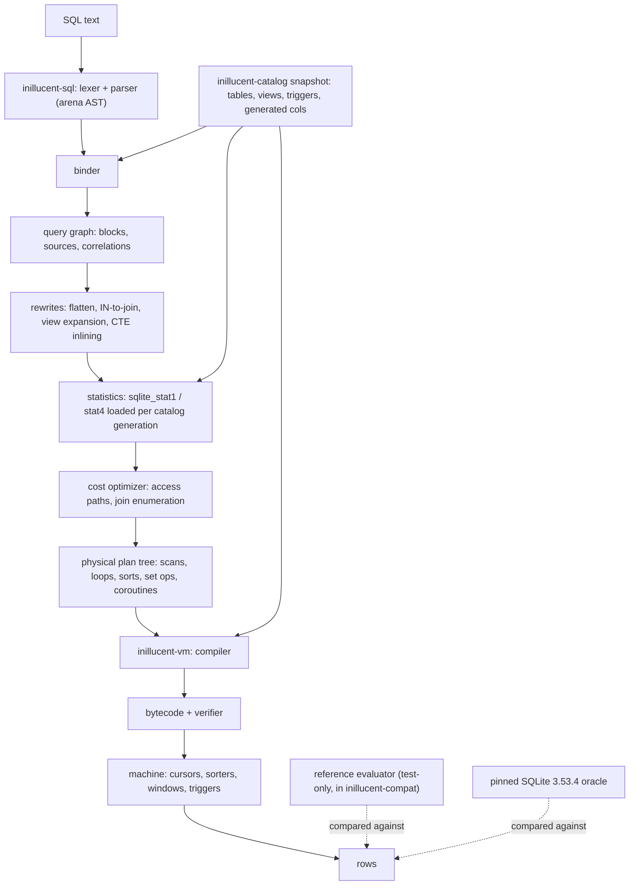

# task-1787 — Advanced SQL, schema features, and the cost optimizer

Phase 8 of the [task-1781 SQLite-parity design](./task-1781-sqlite-feature-parity-tdd.md).
Depends on task-1786 (DML, DDL, rollback, constraints), which
is `agent_done`.

## Introduction

The engine reads and writes: it creates tables and indexes, inserts, updates and deletes rows,
enforces constraints, and commits through a rollback journal that survives a power cut at every cut
point. What it cannot do is answer a query of any interesting shape. There are no outer joins, no
compound selects, no subqueries of any kind, no CTEs, no window functions, no views, no triggers,
and no cost model — the planner takes the FROM terms in written order and picks a path because one
is more selective *by construction*, not because a number said so.

This phase closes the SQL language and query-planning surface, so that everything outside the later
extension families (foreign keys, ATTACH, WAL, virtual tables, FTS5, R-Tree, the C API) is complete.
It is the largest single phase in the design, and it is deliberately breadth-first: every feature
family lands with oracle-graded parity before any of it is tuned, because a fast wrong answer is
worth less than a slow right one and this repository grades on the answer.

## Goals

Measured, not asserted. Each is a row in `compat/sqlite-3.53.4.toml` that moves from `missing` to
`pass`, and a `pass` requires a recorded passing test run.

| goal | manifest rows |
|---|---|
| all join forms, compounds, subqueries, CTEs, DISTINCT/GROUP/HAVING, windows | `sql.select.joins`, `sql.select.compound`, `sql.select.distinct`, `sql.select.group-by-having`, `sql.select.window`, `sql.expr.in-subquery`, `sql.with.cte`, `sql.with.recursive` |
| a costed planner with real statistics | `planner.access-paths`, `planner.join-order`, `planner.statistics`, `sql.analyze` |
| the schema surface | `sql.create-view`, `sql.create-trigger`, `sql.alter-table`, `sql.generated-columns`, `sql.without-rowid`, `sql.strict-tables`, `sql.reindex`, `sql.vacuum`, `sql.explain` |
| the built-ins this phase owes | `functions.core`, `functions.aggregate`, `functions.date-time`, `functions.math`, `functions.window` |
| the things SQLite refuses, refused the same way | `sql.negative.right-outer-join-pre-3-39`, `sql.negative.grant-revoke`, `sql.negative.full-alter-table`, `sql.negative.trigger-for-each-statement`, `sql.negative.writable-views` |

Beyond the manifest:

- every physical plan the planner produces returns exactly the rows a reference evaluator returns
  for the same query, proven on generated SQL rather than on hand-written cases;
- a sort larger than its memory budget spills to a temporary B-tree and returns the same order;
- an interrupt, an OOM and a trigger recursion limit each fail cleanly and leave the database intact;
- a schema change invalidates a prepared statement rather than running it against a stale catalog;
- the cross-engine fixture matrix still passes after every new schema form is written by either
  engine.

## Non-goals

Explicitly out of scope, and each has its own later phase:

- foreign keys, ATTACH/DETACH, multi-database commit (phase 9, task-1788 covers WAL and these);
- WAL and concurrent connection semantics (phase 10);
- virtual tables, FTS5, R-Tree, JSON functions, the full PRAGMA manifest, loadable extensions
  (phase 11);
- the C API, the CLI, the search integration (phases 12–14);
- performance *regression tracking* infrastructure (`perf.regression-tracking`), which is phase 15.

Benchmarks are in scope as evidence for this phase's optimizations; the tracking harness is not.

## Problem statement

Today's binder refuses, by explicit `unsupported(...)`, every one of: `WITH`, compound `SELECT`,
`WINDOW`, subqueries in `FROM`, parenthesised joins, views as a FROM term, `LEFT`/`RIGHT`/`FULL`
joins, `IN` over a subquery, `EXISTS`, scalar subqueries, row values, `RAISE`, window functions,
`FILTER`, aggregate `ORDER BY`, and `CURRENT_DATE`/`_TIME`/`_TIMESTAMP`. The DDL layer refuses
`TEMP` tables, `CREATE TABLE ... AS SELECT`, `WITHOUT ROWID`, partial indexes, expression indexes,
`DROP VIEW`, `DROP TRIGGER`, and every `ALTER` form. `EXPLAIN` is refused outright.

`plan_select` has no cost model at all: it walks `select.sources` in written order, and for each
term tries a rowid path, then an index path, then a scan. There is no `sqlite_stat1`, so a two-table
join whose written order is the wrong way round runs the wrong way round, on any data.

The consequence is not "slower". It is that a query the corpus can express does not run: 76 of the
260 manifest rows are `missing`, and 28 of them belong to this phase.

## Architectural overview



Two structural changes carry the phase.

**The bound tree becomes a tree.** `BoundSelect` today is one flat block: a list of sources, a
filter, a group-by, columns. A subquery, a compound arm and a CTE are all *another block*, so the
binder gains a `QueryBlock` that can hold children, and `BoundExpr` gains variants that name a
child block (`Exists`, `ScalarSubquery`, `InSubquery`). Correlation is recorded when a child block
resolves a name against an ancestor's scope: the child records the outer register it needs, and the
compiler turns that into a re-run of the child's coroutine per outer row.

**The physical plan becomes a tree.** `PhysicalPlan` today is a flat list of `PlannedSource` with
one residual per level. It becomes a `PlanNode` tree — `Scan`, `Search`, `NestedLoop`, `LeftJoin`,
`Sort`, `Aggregate`, `Distinct`, `Compound`, `Coroutine`, `Materialize`, `RecursiveCte`, `Window` —
because a compound of two grouped selects, or a left join whose right side is a materialised
subquery, cannot be expressed as a list. The compiler walks that tree; `EXPLAIN QUERY PLAN` renders
it.

## Detailed design

### 1. The query graph and name resolution

`Binder` gains a scope stack. Resolving `a.b` walks the innermost block's sources first, then
outward. A hit in an ancestor marks the current block **correlated** on that source, and allocates a
*correlation slot* — an index into a per-block vector of registers the parent fills before running
the child.

```rust
pub struct QueryBlock {
    pub sources: Vec<BoundSource>,      // may be a table, a subquery block, a CTE reference
    pub filter: Option<BoundExpr>,
    pub group_by: Vec<BoundExpr>,
    pub having: Option<BoundExpr>,
    pub columns: Vec<BoundResultColumn>,
    pub distinct: bool,
    pub order_by: Vec<BoundOrderTerm>,
    pub limit: Option<BoundExpr>, pub offset: Option<BoundExpr>,
    pub aggregates: Vec<BoundAggregate>,
    pub windows: Vec<BoundWindow>,
    pub values: Vec<Vec<BoundExpr>>,
    pub correlations: Vec<Correlation>, // outer (block, source, column) -> slot
}
```

`BoundSource::kind` becomes an enum: `Table(TableInfo)`, `Subquery(Box<QueryBlock>)`,
`CteRef { index, materialised }`, `RecursiveSelf`. A view is expanded at bind time into
`Subquery(block)` with the view's own name kept for `EXPLAIN` and for error messages.

`ORDER BY` in a block that has aggregates or `DISTINCT` resolves against the *result* columns first
(SQLite's rule), then against the sources; a bare integer is a one-based result-column ordinal, and
a bare integer out of range is `1st ORDER BY term out of range`.

### 2. Joins

| form | plan |
|---|---|
| `CROSS`, `,`, `INNER`, `NATURAL INNER` | `NestedLoop` — but `CROSS` pins the order (SQLite's documented promise) |
| `LEFT [OUTER]` | `LeftJoin` — a match flag register per row of the left side; on no match, NULL out the right side's registers and emit once |
| `RIGHT [OUTER]` | rewritten to a `LeftJoin` with the operands swapped, and the output column order preserved |
| `FULL [OUTER]` | `LeftJoin` plus an anti-join pass over the right side using a match-set of right rowids, materialised |
| `NATURAL` | the `USING` list computed at bind time from the common column names, in left-table order; a natural join with no common column is a cross join |
| `USING (a, b)` | equality per column with each side's own collation; the duplicated column is *suppressed* from `SELECT *` (already modelled by `BoundSource::suppressed`) |

Legality, and this is the part that a join-order enumerator gets wrong: an outer join's ON clause is
evaluated at the join, not as a filter, and the outer side may not be reordered past the join. The
enumerator therefore carries a dependency mask per source (`required: u64`) and refuses any order
that places a source before a source it depends on. A `WHERE` term that reads the null-extended side
of a `LEFT JOIN` and is strict on NULL turns that join into an inner join — the one documented
rewrite in this family, and it is applied only when the term is provably strict (a comparison, an
arithmetic op, or a `NOT NULL` test — never `IS NULL`, `IS NOT`, `COALESCE`, or a `CASE`).

`RIGHT`/`FULL` are accepted (3.39+) — the negative parity row
`sql.negative.right-outer-join-pre-3-39` records that the *pinned* build accepts them and an older
one does not, which is a documented version fact rather than a refusal we implement.

### 3. Compound selects

`UNION ALL` is a concatenation. `UNION`, `INTERSECT` and `EXCEPT` are set operations over the
compound's *whole* row, compared with the compound's collations (each column's collation comes from
the left-most arm), and NULLs compare equal to each other here — the one place in SQL they do.

Implementation: each arm is compiled to a coroutine; the operator drives them.

- `UNION ALL`: run arm 1 to completion emitting rows, then arm 2, …
- `UNION`: insert every arm's row into one distinct-index B-tree, emit on first insertion.
- `INTERSECT`: materialise arm 1 into an index; probe with arm 2, emitting on hit and deleting the
  entry so a duplicate on the right cannot emit twice.
- `EXCEPT`: materialise arm 2 into an index; run arm 1, emitting rows not present, and de-duplicating
  the left as `EXCEPT` implies `DISTINCT`.

Arity is checked at bind time — `SELECTs to the left and right of UNION do not have the same number
of result columns` — and the result column names come from the left-most arm. `ORDER BY` and
`LIMIT` attach to the compound as a whole and may name result columns by ordinal or by the left
arm's names. A compound arm may not carry its own `ORDER BY` (SQLite refuses it), and
`LIMIT` in a non-final arm is refused the same way.

Compound depth is bounded by `SQLITE_MAX_COMPOUND_SELECT` (500) and the limit test asserts the same
error string.

### 4. Subqueries and correlation

Four positions, three execution strategies.

| position | strategy |
|---|---|
| `FROM (SELECT …)` uncorrelated, simple | **flattened** into the parent when the flattener's preconditions hold |
| `FROM (SELECT …)` otherwise | **materialised** into a temporary B-tree, once, then scanned |
| `FROM (SELECT …)` correlated, or scanned once | **coroutine** — the child runs as a subprogram that yields rows into the parent's registers |
| scalar `(SELECT …)`, `EXISTS`, `IN (SELECT …)` | subprogram invoked per outer row when correlated; **once, cached** when not |

The flattener implements the subset of SQLite's 24 preconditions that this phase's plan tree can
express, and every one it declines to apply falls back to materialisation — which is always correct,
so a flattener bug is a performance defect, not a wrong answer. That is the invariant that makes the
flattener testable: a property test runs every generated query twice, once with flattening enabled
and once forced off, and asserts identical rows.

`IN (SELECT …)` with an uncorrelated child becomes a materialised **ephemeral index** built once,
probed with `NoConflict`-style semantics so that the three-valued logic is right: `x IN (empty)` is
false even when `x` is NULL; `x IN (set containing NULL)` is NULL when `x` is not present and true
when it is. `NOT IN` is the negation of that, which is why the NULL-containing case must be recorded
on the set rather than re-derived.

Scalar subqueries return their first row's first column, or NULL when they return nothing; a scalar
subquery in a context expecting a row value (`(a,b) = (SELECT x,y …)`) is bound as a row value.

### 5. CTEs

`WITH name(cols) AS [NOT] MATERIALIZED (select)` binds a CTE into the block's scope. An ordinary CTE
referenced once is inlined as a subquery; referenced more than once, or marked `MATERIALIZED`, it is
materialised into a temporary table and every reference scans it. `NOT MATERIALIZED` forces inlining.

A **recursive** CTE requires the compound form `initial UNION [ALL] recursive`, with the recursive
arm referencing the CTE exactly once and not inside an outer join's null-extended side, an aggregate,
or a `LIMIT`-bearing subquery. Execution is SQLite's queue algorithm:

```
seed  -> queue
while queue not empty:
    row = pop(queue)
    emit row
    run recursive arm with `cte` bound to a single-row cursor over `row`
    for each produced row:
        if UNION: skip when already in the distinct index
        push to queue
```

The queue is a temporary B-tree keyed by an increasing sequence, so it is FIFO and spills like any
other temp structure. Recursion is bounded by the statement's step limit and by
`SQLITE_MAX_RECURSION`-equivalent depth; exceeding it is an error, not a hang.

### 6. Window functions

```
func OVER ( [name] [PARTITION BY …] [ORDER BY …] [frame] )
frame := (ROWS|RANGE|GROUPS) BETWEEN start AND end [EXCLUDE (NO OTHERS|CURRENT ROW|GROUP|TIES)]
```

All of `ROWS`, `RANGE` and `GROUPS`; `UNBOUNDED PRECEDING`, `expr PRECEDING`, `CURRENT ROW`,
`expr FOLLOWING`, `UNBOUNDED FOLLOWING`; all four `EXCLUDE` forms; `FILTER (WHERE …)` on aggregate
window functions; named windows via the `WINDOW` clause, including a window that refers to another
by name and extends it.

Execution: partitions are produced by a sorter keyed `(partition…, order…)`. Within a partition the
machine holds three cursors over the partition's materialised rows — the current row, the frame
start and the frame end — and steps them forward monotonically. Aggregates that can be *inverted*
(`sum`, `count`, `avg`, `total`) step incrementally with an `AggInverse` opcode; those that cannot
(`min`, `max`, `group_concat`, `string_agg`) recompute over the frame, which is correct and is the
same trade SQLite makes.

The eleven built-in window functions land here: `row_number`, `rank`, `dense_rank`, `percent_rank`,
`cume_dist`, `ntile`, `lag`, `lead`, `first_value`, `last_value`, `nth_value`. `RANGE` frames with
an offset require exactly one `ORDER BY` term of a numeric or date type, and a violation is the same
error SQLite gives.

### 7. Statistics, and the cost model

**`ANALYZE`** writes `sqlite_stat1(tbl, idx, stat)`. `stat` is the row count followed by, for each
index-key prefix, the average number of rows with the same prefix — `"10000 100 5 1"`. For a table
with no index, a row with a NULL `idx`. `ANALYZE` with no argument analyses everything; with a table
or index name, just that.

**`sqlite_stat4`** — a sample of up to 24 index entries per index, each with the key's leading
columns, `nEq`, `nLt` and `nDLt` — is written when the schema has a `sqlite_stat4` table, and read
to sharpen a *range* estimate for a literal bound. The format is SQLite's, so the pinned build can
read what we write and vice versa; the cross-engine fixture matrix asserts exactly that.

The cost model is logarithmic, in the same currency SQLite uses so that a plan comparison is
meaningful:

```
cost(scan)          = log2(rows) * rows            -- every row visited
cost(search idx)    = log2(rows) + matches * (1 + fetch_penalty)
fetch_penalty       = 0 when the index covers the query, else ~3 (a second descent per row)
matches             = rows / product(stat1 prefix multipliers consumed)
                      refined by stat4 for a range with literal bounds
cost(sort n)        = n * log2(n) * SORT_FACTOR
```

Absent statistics, the defaults are SQLite's: a table is assumed to hold ~1,048,576 rows, an
equality on an indexed column selects 1/10, a range 1/4, and a unique index exactly one row. These
defaults are what make the *unanalysed* plan choices match SQLite's, which is what the plan-parity
test asserts.

**Join enumeration** is the standard bottom-up search over subsets with the outer-join dependency
mask as the legality filter, capped: for ≤ 12 tables, full subset enumeration
(`2^n` states, ~4k at 12); beyond that, a greedy nearest-neighbour seed followed by a bounded
2-opt improvement pass, which is what keeps 32 tables inside the phase's benchmark budget. `CROSS
JOIN` pins its position; a `NOT INDEXED` clause removes index paths for that term; `INDEXED BY`
forces one and errors when it cannot be used.

**Access paths** gained in this phase, beyond today's scan/rowid/index-seek:

- **covering index** — no table cursor is opened at all when every referenced column is in the key;
- **partial index** — usable only when the query's `WHERE` provably implies the index's predicate;
- **expression index** — matched by comparing the *bound* expression to the index's bound key
  expression, so `lower(name)` matches an index on `lower(name)` regardless of whitespace;
- **descending / collated keys** — an index scan may run backwards to satisfy an `ORDER BY`, and a
  key's collation must equal the comparison's or the path is illegal;
- **OR-by-union** — `a = 1 OR b = 2` becomes a union of two index searches, de-duplicated by rowid,
  applied only when *every* disjunct has an index path;
- **LIKE prefix** — `x LIKE 'abc%'` becomes `x >= 'abc' AND x < 'abd'` when the column's collation is
  BINARY (or NOCASE with `case_sensitive_like` off and an ASCII prefix), with the original `LIKE`
  retained as a residual because the range is a superset;
- **skip-scan** — an index whose leading column has few distinct values (from stat1) is scanned by
  iterating those distinct values and seeking the remaining prefix;
- **automatic index** — a transient index built over an inner loop's table when the estimated cost of
  building it is below the repeated-scan cost, which is the classic join-in-a-loop rescue;
- **ordering propagation** — a path that already delivers `ORDER BY` order removes the sorter, and a
  `GROUP BY` whose key is an index prefix uses the stream rather than a temp B-tree.

**`EXPLAIN QUERY PLAN`** renders the plan tree with SQLite's own line shapes (`SCAN t`,
`SEARCH t USING INDEX i (a=?)`, `USE TEMP B-TREE FOR ORDER BY`, `CO-ROUTINE`, `MATERIALIZE`,
`SCAN <subquery>`, `COMPOUND QUERY`, `LEFT-MOST SUBQUERY`). **`EXPLAIN`** dumps the bytecode with
the eight-column `addr|opcode|p1|p2|p3|p4|p5|comment` shape. Neither is compared token-for-token
against SQLite — the opcodes are ours — but the *query plan* shapes are, for the cases the manifest
cites, because a query plan is the thing a person reads to answer "did the index get used".

### 8. Schema features

**Views.** `CREATE VIEW [IF NOT EXISTS] [schema.]name [(cols)] AS select`. Stored in
`sqlite_schema` with `rootpage = 0`. Columns are derived from the select's result columns unless a
column list is given, in which case the arity must match. Expanded at bind time. Writes are refused
(`cannot modify … because it is a view`) unless an `INSTEAD OF` trigger exists —
`sql.negative.writable-views` records the refusal.

**Triggers.** `CREATE TRIGGER [BEFORE|AFTER|INSTEAD OF] (DELETE|INSERT|UPDATE [OF cols]) ON tbl
[FOR EACH ROW] [WHEN expr] BEGIN stmts END`. `FOR EACH STATEMENT` is refused
(`sql.negative.trigger-for-each-statement`). `INSTEAD OF` is only legal on a view; `BEFORE`/`AFTER`
only on a table.

The trigger body binds against a scope containing `OLD` and `NEW` pseudo-tables and compiles to a
**subprogram** invoked by the DML compiler at the right point in the row loop. Recursion is bounded
by `SQLITE_MAX_TRIGGER_DEPTH` (1000) and, when `recursive_triggers` is off (SQLite's default), a
trigger does not fire on the rows its own DML touches. `RAISE(ABORT|FAIL|ROLLBACK, 'msg')` and
`RAISE(IGNORE)` are implemented; `IGNORE` abandons the current row's remaining work without an error.

Dropping a table drops its triggers. `DROP TRIGGER` and `DROP VIEW` land here.

**Generated columns.** `col type [GENERATED ALWAYS] AS (expr) [VIRTUAL|STORED]`. A `VIRTUAL` column
is computed on read and occupies no record slot; a `STORED` column is computed on write and does. A
generated column may not have a `DEFAULT`, may not be part of the `PRIMARY KEY` of a rowid table,
may not reference another table, and may not be circular. `ALTER TABLE ADD COLUMN` of a `STORED`
generated column is refused, matching SQLite.

**STRICT.** Every column must declare one of `INT, INTEGER, REAL, TEXT, BLOB, ANY`; `PRIMARY KEY`
implies `NOT NULL`; a write of the wrong storage class errors
(`cannot store TEXT value in INTEGER column t.c`) rather than coercing. `ANY` stores anything with
no affinity applied.

**WITHOUT ROWID writes.** Reads already work. Writes need: the primary key as the B-tree key
(record-encoded, in key order); no `NewRowid`; `AUTOINCREMENT` refused; a `PRIMARY KEY` that is
implicitly `NOT NULL`; secondary indexes whose trailing key is the primary key rather than a rowid;
and `DELETE`/`UPDATE` cursors that reposition by key. The `INTEGER PRIMARY KEY` shortcut does not
apply — in a WITHOUT ROWID table it is an ordinary key column.

**AUTOINCREMENT.** A `sqlite_sequence(name, seq)` row per table, created lazily, updated inside the
same transaction, and the guarantee that a rowid is never reused. Exhausting the range is
`database or disk is full` — SQLite's own, surprising, error.

**ALTER TABLE.** `RENAME TO`, `RENAME COLUMN … TO`, `ADD COLUMN`, `DROP COLUMN`. The hard part is
not the table: it is every other object whose stored SQL names it. Renaming a table rewrites its own
`CREATE TABLE`, the `tbl_name` of its indexes and triggers, and the *text* of every view and trigger
body that references it — by re-parsing each and re-emitting with the token replaced, so that
comments and whitespace survive. A rewrite that fails to re-parse aborts the whole `ALTER`.
`legacy_alter_table` is honoured. Anything else (`ALTER TABLE … ALTER COLUMN`, adding a constraint)
is refused — `sql.negative.full-alter-table`.

**TEMP objects.** A third database (`temp`, index 1 in SQLite's numbering) backed by a temporary
file created on first use and deleted on close. Name resolution order is `temp`, `main`, then
attached. `CREATE TEMP TABLE|VIEW|TRIGGER|INDEX` and `CREATE TABLE temp.x` both reach it.

**REINDEX.** Rebuilds one index, every index of one table, or every index using a named collation.
Implemented as: clear the index B-tree, scan the table, re-insert every key — inside a transaction,
so a failure leaves the old index.

**VACUUM.** Already implemented at the storage layer for incremental/auto-vacuum; the statement form
here rebuilds the database into a fresh file and swaps it, preserving the schema, the user version,
the page size (or applying a pending `PRAGMA page_size`), and the application id. `VACUUM INTO
'file'` writes a fresh copy without touching the original.

### 9. Built-in functions

The manifest rows for this phase, with the pinned build's list as the denominator:

- **core**: `abs char coalesce concat concat_ws format glob hex iif ifnull instr length like
  likelihood likely lower ltrim max min nullif octet_length printf quote random randomblob replace
  round rtrim sign soundex substr substring trim typeof unhex unicode unlikely upper zeroblob
  last_insert_rowid changes total_changes sqlite_version sqlite_source_id`;
- **aggregate**: `avg count group_concat string_agg max min sum total`, each with `DISTINCT` and
  `FILTER` and the 3.44 `ORDER BY` argument form;
- **date/time**: `date time datetime julianday unixepoch strftime timediff`, the full modifier list
  (`NNN days`, `start of month`, `weekday N`, `unixepoch`, `julianday`, `auto`, `localtime`, `utc`,
  `subsec`, `ceiling`, `floor`), and the `CURRENT_DATE`/`CURRENT_TIME`/`CURRENT_TIMESTAMP` keywords;
- **math** (SQLite's `-DSQLITE_ENABLE_MATH_FUNCTIONS` set): `acos acosh asin asinh atan atan2 atanh
  ceil ceiling cos cosh degrees exp floor ln log log2 log10 mod pi pow power radians sin sinh sqrt
  tan tanh trunc`;
- **window**: the eleven listed in §6.

Every one is graded by running the same call in both engines over a value matrix that includes NULL,
each storage class, the integer/real boundary, and the two infinities.

`localtime` needs the machine's zone. The reference build and inillucent must agree, so the
date/time tests either pin `TZ` or use only `utc` modifiers, and the fixture records which.

### 10. Resource governance

- **Sorter spill.** A sorter accumulates in memory to a byte budget (default 1 MiB, `PRAGMA
  cache_size`-independent, settable by a test hook); past it, it writes sorted runs to a temporary
  file through the VFS and merges them. The merge is k-way with the same comparator, so the spilled
  order is the in-memory order by construction. The property test sets the budget to 4 KiB and
  asserts the same rows in the same order as the unspilled run.
- **Interrupt.** `Machine::step` checks an `AtomicBool` every N instructions and at every sorter and
  B-tree boundary; the statement returns `SQLITE_INTERRUPT`, the statement savepoint rolls back, and
  the connection stays usable. A spill in progress is interrupted at a run boundary and its temp file
  removed.
- **OOM.** Every growable buffer in the new code paths goes through `inillucent-base`'s fallible
  allocation, so an allocation failure is `SQLITE_NOMEM` and a rolled-back statement, not a panic.
  The simulator injects it at each allocation site in the new paths.
- **Limits.** `SQLITE_MAX_COLUMN` (2000), `SQLITE_MAX_EXPR_DEPTH` (1000), `SQLITE_MAX_COMPOUND_SELECT`
  (500), `SQLITE_MAX_VDBE_OP`, `SQLITE_MAX_FUNCTION_ARG` (127), `SQLITE_MAX_LIKE_PATTERN_LENGTH`
  (50000), trigger depth (1000). Each is asserted with the same message as the oracle.
- **Plan-cache invalidation.** A prepared statement records `(schema generation, per-database schema
  cookie)`. A step after a schema change re-prepares from the original SQL; if the re-prepare fails
  (the table it named is gone), the error is SQLite's `no such table`, at step time.

## New opcodes

| opcode | why |
|---|---|
| `OpenEphemeral`, `OpenAutoindex` | temporary tables/indexes for materialisation, IN sets, DISTINCT of a compound, automatic indexes |
| `Found` / `NotFound` | probe an ephemeral index for set operations and `IN` |
| `Yield`, `InitCoroutine`, `EndCoroutine` | subquery coroutines and compound arms |
| `Program`, `Param`, `FkIfZero`-free `TriggerReturn` | trigger subprograms and `OLD`/`NEW` register windows |
| `AggInverse`, `AggValue` | window aggregates that step backwards out of a frame |
| `SeekEnd`, `IdxLe`, `IdxLt` | descending index scans |
| `Once` | run a block once per statement (uncorrelated subquery materialisation) |
| `Sequence` | the FIFO key for a recursive CTE queue |
| `Affinity`-aware `MakeKey` | WITHOUT ROWID primary-key encoding |
| `Interrupt`-checked `Yield` boundaries | not an opcode; a machine-level check, listed here so the verifier's op table stays complete |

The verifier is extended in lockstep: every new opcode declares whether it writes, whether `p2` is a
jump, and what it requires of its operands, and the existing "a read-only program contains no opcode
that writes" proof continues to hold.

## Alternatives considered

| decision | alternative | why not |
|---|---|---|
| plan **tree** with coroutines | keep the flat source list and special-case each feature | a compound of grouped selects has no representation in a flat list; every feature would need its own compiler entry point, and `EXPLAIN QUERY PLAN` could not be rendered from one walk |
| **subset enumeration** to 12 tables, greedy + 2-opt beyond | always greedy | greedy picks a materially worse order on the 5- and 12-table benchmarks, and the phase's acceptance is a plan comparison against SQLite's; always-exhaustive is 2^32 states at 32 tables |
| SQLite's **log-cost** currency | a row-count-only heuristic | the plan-parity test compares *choices* with SQLite's; using a different currency means the two disagree on ties for reasons that are not defects |
| flatten as an **optimisation over a correct fallback** | flatten as the only path for FROM subqueries | a flattener precondition bug becomes a wrong answer instead of a slow plan; with the fallback, a property test can force flattening off and diff |
| triggers as **subprograms** | inline the trigger body into the DML loop | recursion, `RAISE(IGNORE)`, and the depth limit all need a frame; inlining cannot express a trigger that fires a trigger |
| windows over a **materialised partition** | a single streaming pass with a ring buffer | `RANGE`/`GROUPS` frames and `EXCLUDE TIES` need to look ahead an unbounded distance within the partition; the materialised form spills like every other temp structure and is the same shape SQLite uses |
| `stat4` **written and read** | stat1 only | a range with a literal bound is where stat1 is worst, and the cross-engine matrix requires our file to be readable by the pinned build either way |

## Testing strategy

Integration and differential first; unit tests only where a pure function has an interesting edge
(the frame arithmetic, the cost formula, the LIKE-to-range rewrite).

1. **SQLLogicTest conformance.** `compat/corpus/select/queries.sql` grows from 188 statements to
   cover every family in this phase, and new corpora are added for joins, compounds, subqueries,
   CTEs, windows, and the built-in matrix. Expectations are recorded from the pinned 3.53.4 oracle by
   `inillucent-slt` and checked in, so the suite grades against SQLite with no oracle present. Public
   SQLLogicTest files that the parser can read are run unchanged.
2. **Differential, generated.** A generator produces random-but-legal statements over the fixture
   schema — join shapes to 5 tables, correlated and uncorrelated subqueries, compounds, windows with
   random frames, aggregates with `FILTER` — and both engines answer. Any difference in rows, storage
   classes, error codes or error messages fails, and the seed is printed.
3. **Plan parity against a reference evaluator.** A test-only evaluator in `inillucent-compat` answers a
   bound query the slow, obviously-correct way (nested loops over full scans, sort everything,
   materialise everything). Every generated query is answered by both the real planner and the
   reference; the rows must match. Separately, the *plan choice* — which index, which join order — is
   compared against the pinned build's `EXPLAIN QUERY PLAN` for the manifest's cited cases.
4. **Flatten on/off diff**, **spill budget 4 KiB vs unlimited**, **stat1 present vs absent**: three
   switches, each run over the whole generated corpus, each asserting identical rows.
5. **Schema mutation matrix.** For every new schema form — view, trigger, generated column, STRICT,
   WITHOUT ROWID, AUTOINCREMENT, every `ALTER` form, TEMP — a fixture is created by inillucent, opened
   by SQLite, `PRAGMA integrity_check`ed, written to, and read back by inillucent; and the same in the
   reverse direction. This is the existing `mutation_interop` / `write_interop` matrix, extended.
6. **Failure and resource tests.** Interrupt during a sort, a window, a recursive CTE and a trigger
   cascade; OOM injected at each new allocation site; trigger recursion past the depth limit; an
   `ALTER` whose dependent-SQL rewrite fails; a schema change between prepare and step; every limit
   at its boundary and one past it.
7. **Benchmarks, after correctness.** `inillucent-bench` gains: joins at 2/5/12/32 tables, correlated
   subqueries, aggregates and windows, an in-memory sort and a spilled one, `ANALYZE` and the plan
   selection it changes, DDL and index backfill, and `VACUUM`. Each records the plan chosen and the
   counters (pages read, comparisons, sorter runs) alongside the time, and evidence is retained under
   `_agent_output/task-1787/`.

## Sequencing

Correctness by family, each family green against the oracle before the next starts; the optimizer
after the language, because a cost model over features that do not run cannot be measured.

1. plan tree + bound query graph (no new SQL yet; the existing suite stays green)
2. outer joins → compounds → FROM subqueries + flattener → scalar/`EXISTS`/`IN` subqueries → CTEs →
   recursive CTEs → windows
3. views → triggers → generated columns → STRICT → WITHOUT ROWID writes → AUTOINCREMENT → ALTER →
   TEMP → REINDEX → VACUUM
4. built-ins (core, date/time, math, format)
5. `ANALYZE`/stat1/stat4 → cost model → join enumeration → the new access paths → ordering propagation
6. `EXPLAIN` / `EXPLAIN QUERY PLAN`
7. limits, quirks, negatives, spill governance, interrupt, OOM, plan-cache invalidation
8. benchmarks, manifest and evidence regeneration, commit and push

---

## What actually happened

Written after the phase shipped, because a design document that only records what was intended is
half a record. Everything below is a place where building it taught something the plan did not know.

### Trigger bodies are inlined, not framed

The plan said "compiled as subprograms invoked from the DML row loop", which implies frames: a
program with its own register and cursor space, entered and left. They are **inlined into the firing
statement** instead, and the reason is a decision phase 6 had already made. FROM terms carry a
*statement-wide* number, so a trigger body's sources take the numbers after the firing statement's
and the compiler's one flat cursor map serves both. `OLD` and `NEW` are register blocks substituted
exactly the way an upsert's `excluded` row already was.

Inlining terminates only because SQLite's default `recursive_triggers = off` skips a trigger already
on the stack — so the parity rule and the termination argument are the same rule. That is a happier
accident than it sounds: had the default been *on*, this design would not have been available.

### Five defects that no `SELECT` could have shown

Four of these were found by comparing the *counters* after every statement, not the rows.

1. `changes()` counted rows the triggers wrote. It reports the statement's own rows; `total_changes()`
   counts both. They are separate tallies now.
2. `last_insert_rowid()` was published only when a statement succeeded. The reference keeps the rowid
   of a row written before an abort, and reverts a trigger body's own inserts once the body ends.
3. `open_for_write` replaced the whole source-to-cursor map with one entry at slot zero. Two fires of
   one trigger open two cursors on one table, and the second fire was reading the first fire's cursor.
4. A write left every other cursor on that tree standing on a page that had been rebalanced under it.
   Nothing could hold two cursors on a tree it wrote until triggers; the save/restore machinery had
   been in the storage layer since phase 4 and had never been wired to the VM.
5. Triggers fire in **reverse creation order**. The most recently created one runs first, which the
   pinned build confirms and no document this phase started from mentioned.

`changes()`, `total_changes()` and `last_insert_rowid()` also all answered zero as *SQL functions*:
`Machine::set_counters` existed and had never been called.

### `WITHOUT ROWID` reads were wrong in three ways at once

The table's b-tree is an **index** b-tree and its record is the row with the primary key moved to the
front — `PRIMARY KEY(b, a)` over `(a, b, c)` stores `(b, a, c)`, confirmed by decoding a page the
pinned build wrote rather than by reading the documentation. Before this phase, asking for `a, b, c`
returned the record's order, so every column held its neighbour's value; `ORDER BY b` ordered by the
wrong column; and a seek on the key opened page zero, because the primary key's catalog entry had a
root of zero that nothing filled in. SQLite writes no `sqlite_autoindex` row for it: the table's own
root *is* that index.

### `VACUUM` moves `last_insert_rowid()`, but only sometimes

Only when the schema holds a view or a trigger. SQLite copies those schema rows in a final pass, and
that INSERT leaves the value at the number of rows in the rebuilt schema. Measured on six schemas
before it was believed. It is an artefact of the reference's implementation, reproduced deliberately,
because an application can see it.

### `DISTINCT` was quadratic

Found by the benchmarks, which is what they are for: 447 ms against 18 ms for the `GROUP BY` of the
same shape, on *fewer* bytecode instructions. Time out of line with the instruction count is time
being spent where the VM is not looking — here, a linear scan of every row the distinct set had kept.
An ordered index and a binary search took it to 18.5 ms on identical instruction and allocation
counts. The ordering is proved to say `Equal` exactly where the equality it replaced said `true`.

### Two places the plan was stricter than the reference

`UPDATE OF nosuchcolumn` is accepted by SQLite, and so is a trigger body naming a column the table has
not got — the latter reported on the first write that fires it. Both were refused here at first.
Refusing them makes inillucent's language *smaller* than the reference's, which means a schema SQLite
wrote that inillucent cannot load, and that is a worse failure than a late error.

### What was deferred, and where the debt is recorded

`TEMP` objects. They live in the `temp` database, so they need a connection that can hold more than
one, which is what `ATTACH` brings in phase 9. They are refused rather than put in `main` under a
different name, and `sql.temp-objects` now sits in the phase-9 rows so the debt is visible.
