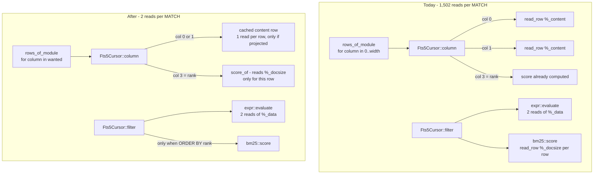

# task-1835: the FTS5 query path reads the whole content table three times

## Introduction

`inillucent-ext`'s FTS5 answers `SELECT count(*) FROM documents WHERE documents MATCH 'lorem'`
with **1,502 shadow row reads** over a 500-document index. task-1833 measured that and named it
"the module reads the whole segment table about three times to answer one term", and filed this
ticket to make the query path descend `%_idx` the way SQLite's does.

**The measurement says something else, and it is better news.** The module already descends
`%_idx`: a non-prefix term costs exactly one keyed read of `%_idx` and one read of the `%_data`
row holding its doclist. Instrumenting `ShadowTables::read_row` by shadow table shows where the
1,502 actually go:

| shadow table | reads per query | why |
|---|---|---|
| `%_data` | **2** | row 1, the totals; and the term's doclist. This is the descent, and it is already right. |
| `%_content` | **1,000** | 2 per matched row - one per *visible declared column*, because `Fts5Cursor::column` re-reads the row for every column asked of it |
| `%_docsize` | **500** | 1 per matched row - `filter` scores every match with `bm25` before anybody asks for a score |

`3 x 500 + 2 = 1,502`. It is not a segment scan; it is **per-row work done eagerly for a query
that reads no columns and no rank**. `count(*)` needs neither the documents nor their scores.

This design removes all three, and the read count for that query goes to **2**.

## Goals and Non-Goals

**Goals**

- A single-term `MATCH` costs a descent plus a handful of block reads: `%_data` twice, and one
  `%_content` read per row *that is actually projected*.
- `extension.fts.query` measurably faster on the full gate, so task-1833's `extension` family can
  be re-measured. Target: the 751,000 `read_row` calls for 500 queries go to roughly 1,000.
- Both graded suites still pass to the last digit: `crates/inillucent-compat/tests/fts5.rs` (against
  pinned SQLite 3.53.4, `bm25()` included) and `tests/new_engine_vtab.rs`.
- The saving must reach **both engines**. The old engine's VDBE already emits `VColumn` only for
  columns a query reads, so it never pays the `%_content` cost - but it pays the `%_docsize` cost,
  which is why it is 490 us/query against SQLite's 24.

**Non-Goals**

- Changing the on-disk representation. `%_data`, `%_idx`, `%_content`, `%_docsize` and `%_config`
  keep exactly the rows they hold today; this is a read-path change and a database written before
  it is answered identically after it.
- A segment/leaf b-tree of SQLite's shape. The ticket proposed it as the fix; the measurement says
  the descent is not the cost, so building one would be work with no number behind it.
- Prefix queries (`cat*`). They still walk the `%_idx` run, which is the right shape already.
- `inillucent-search`, which is a different module in a different crate.

## Problem statement

Three defects, each independent, each measured.

### 1. `Fts5Cursor::column` re-reads `%_content` per column

```rust
fn column(&mut self, context, index) -> DbResult<Value> {
    ...
    let Some(content) = self.shadows.read_row(context, b"content", row.rowid)? else { ... };
    Ok(content.get(index + 1).cloned()...)
}
```

Every call reads the whole row to hand back one field. A two-column FTS5 table therefore reads
`%_content` twice per row, a ten-column one ten times. The cursor is positioned on one row at a
time and the caller always asks for that row's columns together, so the second read is guaranteed
to return exactly what the first did.

### 2. `filter` scores every match eagerly

```rust
let (rows, hits) = expr::evaluate(&query, context, &self.shadows, self.columns)?;
let scores = bm25::score(&rows, &hits, &query, context, &self.shadows, &totals, self.columns)?;
```

`bm25::score` calls `row_sizes` per row, which is a `%_docsize` read per row. The score is only
ever observed through the `rank` column or an `ORDER BY rank` - and `auxiliary()` (`bm25(t, ...)`)
does not use it at all, because a per-call weight vector means it recomputes from `hits` anyway.
So for every query that does not name `rank`, the whole scoring pass is thrown away.

### 3. The new engine materialises every declared column

`TreeCatalog::rows_of_module` runs the module's cursor to completion and asks for
`0..declaration().columns.len()` columns of every row - unconditionally:

```rust
let width = connected.table.declaration().columns.len();
while !cursor.eof() {
    for column in 0..width { row.push(from_value(cursor.column(&mut context, column)?)); }
    ...
}
```

For `count(*)` that is four columns per row: `title`, `body`, the hidden self column, and `rank`.
Two of them read `%_content`; the fourth is the reason defect 2 cannot be fixed by laziness alone
on this engine, because `rank` is *always* asked for. The old engine's VDBE does not have this
problem - `VColumn` is emitted per column the query reads - which is exactly why the new engine is
1.66x slower on this workload than the old one.

The planner already knows the answer: `BoundSelect::columns_read(source) -> ColumnUse` walks every
expression of the block and is written to be exhaustively complete, with an `opaque` flag for
anything it cannot enumerate. It exists for covering-index selection. Nothing hands it to
`virtual_rows`.

### Impact

`extension.fts.query` is 379 ms against SQLite's 11.8 - 0.03x, and three quarters of what holds the
`extension` family at 0.17x against a 1.50x bar. task-1833 is parked on it.

## Architectural Overview



## Detailed Technical Sections

### Component 1 - `Fts5Cursor` keeps the row it is on

`crates/inillucent-ext/src/vtab/fts5/mod.rs`.

Add a one-entry cache to the cursor:

```rust
/// The `%_content` row the cursor is on, kept so that reading n columns of one
/// row costs one read rather than n.
content: Option<(i64, Vec<Value<'static>>)>,
```

`column()` consults it, reads through on a miss, and `filter()`/`next()` do not have to clear it -
the key is the rowid, so a stale entry can never be returned for a different row. One entry is
enough because a cursor is on one row at a time; a map would keep the whole table alive for a
query that walked it.

**Reads saved:** `(visible columns - 1)` per row. 500 per query on the two-column fixture.

### Component 2 - the score is computed when it is asked for

`filter()` stops calling `bm25::score` unless the plan is `PLAN_RANKED`, because that is the one
case where the score is needed *before* the rows are handed out (it is the sort key). `MatchedRow`
carries `score: Option<f64>` instead of `f64`, and `column()` fills it in on demand:

```rust
if index as i32 == self.rank_column {
    return Ok(Value::Real(self.score_of(context, self.at)?));
}
```

`score_of` reads `%_docsize` for that one row and memoises into the `MatchedRow`. The formula, the
inputs and the sign are untouched - it is the same `bm25::score_row` call with the same `hits`,
`phrases`, `totals` and unit weights, so `rank` cannot disagree with `bm25(t)` any more than it
does today. `auxiliary()` is unchanged; it already computed from `hits` per call.

**Reads saved:** one `%_docsize` read per row, for every query that does not read `rank`. This is
the part that lands on the **old** engine too.

### Component 3 - the engine asks for the columns it reads

Three edits, in `inillucent-sql`, `inillucent-exec` and `inillucent-compat`.

1. `BoundExpr::columns_read` marks a `VirtualFunction` over the term **opaque**. An auxiliary
   function reads the module's *cursor*, not a column, so its column use genuinely is not
   enumerable - and a mask that omitted a column `bm25()` needed would be a wrong answer rather
   than a slow one. (Vtabs never take a covering path, so nothing else changes behaviour.)

2. `TreeCatalog::virtual_rows` takes a fourth argument, `wanted: Option<&[u16]>`: the declared
   column indexes the statement reads, or `None` for "all of them". `source_for` computes it from
   `plan.select.columns_read(term.id)`, and passes `None` when the use is `opaque`.

3. `rows_of_module` reads only those, leaving `OwnedDatum::Null` in the slots nobody asked for. The
   row is still `width` wide, because everything downstream indexes it positionally.

The residual recheck that runs after materialisation tests constraints against these rows - and
those constraints are inside `select.filter`, so every column they name is in the mask by
construction. That is the one place the mask has to be right for a *correctness* reason rather than
a speed one, and it is why the mask comes from the same walker the covering-index decision trusts.

**Reads saved:** every `%_content` read for a query that projects no column - which is the gate's
`count(*)` - and the `%_docsize` read that Component 2 could not remove on this engine because
`rank` was always asked for.

### Data flows and risk

| Risk | Why it is contained |
|---|---|
| The mask omits a column something reads → wrong answer | The mask comes from `BoundSelect::columns_read`, the same walker that decides whether an index covers a query, which is written to be exhaustively complete and falls back to `opaque`. `VirtualFunction` is added to the opaque set by this change. Both graded suites compare against SQLite row for row. |
| Lazy scoring changes a score | It is the same call with the same arguments, moved. `ORDER BY rank` still scores eagerly because the sort needs it. `fts5.rs` grades `bm25()` to the last digit. |
| The content cache serves a stale row | It is keyed by rowid and only ever consulted for the rowid it holds. |
| A module other than FTS5 breaks on the mask | `rtree.rs`, `vtab.rs` and `json_each` all run through `rows_of_module`; the suites for all three are in the acceptance below. |

## Alternatives Considered

| Option | Pros | Cons |
|---|---|---|
| **Build SQLite's segment b-tree** (the ticket's proposal) | Matches the reference implementation's structure | The measurement says the descent is already 2 reads. It would rewrite the storage format to fix a cost that is not there, and the answers-must-not-change contract makes it the riskiest option on the list for the smallest measured return. |
| Cache `%_docsize` for the whole table in the cursor | Removes the per-row read without touching the engine | It reads *more*, not less, for a query matching few rows, and it is memory proportional to the table. Laziness is strictly better. |
| Only fix the module (Components 1-2), leave the engine | Smallest diff, no cross-crate change | Leaves 500 `%_content` reads and 500 `%_docsize` reads per `count(*)` on the new engine, because `rows_of_module` asks for `rank` and both content columns regardless. 1,502 → 1,002, and the gate workload is the one that stays slow. |
| Make `virtual_rows` return a lazy cursor instead of a `Vec` | Removes materialisation entirely | It is the batch-aware contract Phase 4 deliberately chose *against* - a row-at-a-time cursor pulled through the operator chain puts a virtual call between every row. Out of scope, and not what the reads cost. |

## Testing strategy

Functional and differential first; there is one unit test because one invariant is local.

1. **`crates/inillucent-compat/tests/fts5.rs` - 17 tests, unchanged.** Every answer graded against
   pinned SQLite 3.53.4, `bm25()` and `ORDER BY rank` included. This is the contract.
2. **`crates/inillucent-compat/tests/new_engine_vtab.rs` - 4 tests, unchanged.** The same module
   over the new engine's trees, which is where the mask lands.
3. **`tests/rtree.rs`, `tests/vtab.rs`, `tests/search.rs`** - the other users of `rows_of_module`,
   including `an_unconsumed_predicate_is_still_tested`, which is the residual recheck the mask must
   not starve.
4. **A new read-count assertion.** The temporary `ZZ_READS` probe becomes a real test:
   `crates/inillucent-compat/tests/new_engine_vtab.rs` builds a 500-document index, runs
   `SELECT count(*) FROM documents WHERE documents MATCH 'lorem'`, and asserts the shadow reads are
   **bounded by a small constant** rather than proportional to the matched rows. A regression here
   is the defect coming back, and nothing else in the suite would catch it.
5. **A new projection test.** `SELECT title FROM documents WHERE documents MATCH 'lorem'` reads
   `%_content` exactly once per matched row - which pins Component 1 against a future column being
   added to the declaration.
6. **The gate.** `inillucent-fullgate --families extension`, 30 rounds, before and after, reported
   with the digest equality that Phase 4 requires. The number that matters is
   `extension.fts.query`.

## Acceptance

- [ ] `read_row` calls for 500 `count(*)` MATCH queries drop from 751,000 to roughly 1,000.
- [ ] `fts5.rs` and `new_engine_vtab.rs` pass, plus `rtree.rs`, `vtab.rs`, `search.rs`, and the
      differential and SLT suites over the new engine.
- [ ] `extension.fts.query` re-measured on the full gate, digest-equal, with the family's new ratio
      reported for task-1833.
- [ ] The temporary `ZZ_READS` instrumentation is either promoted to a supported counter behind the
      new test, or removed.
