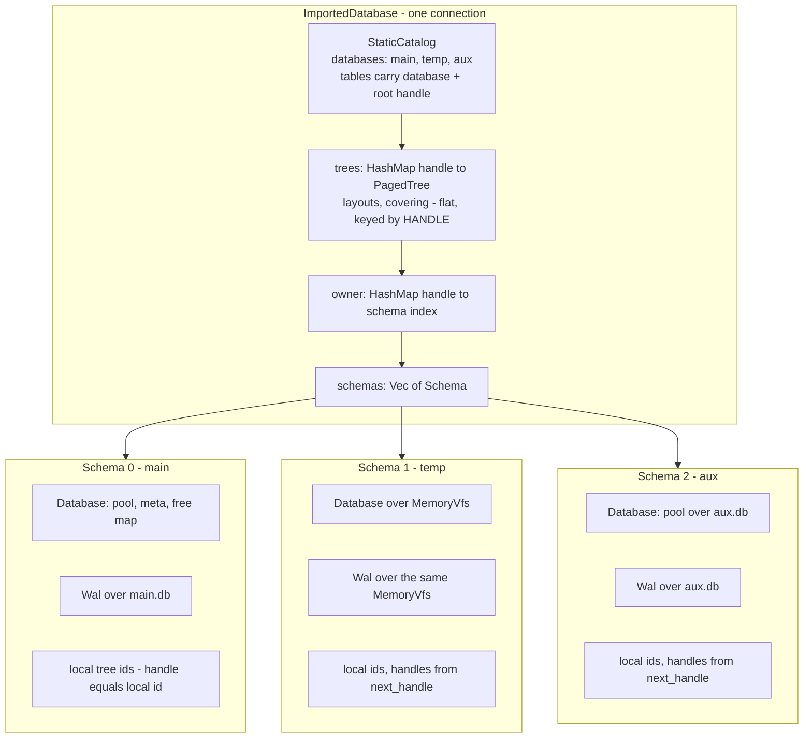
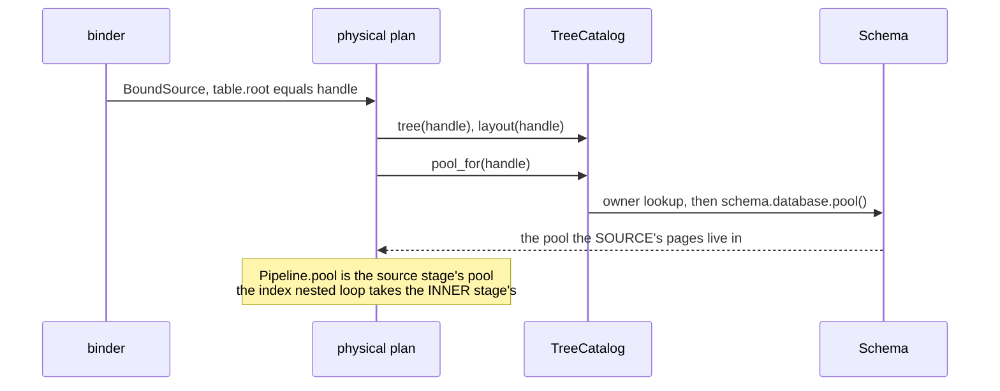
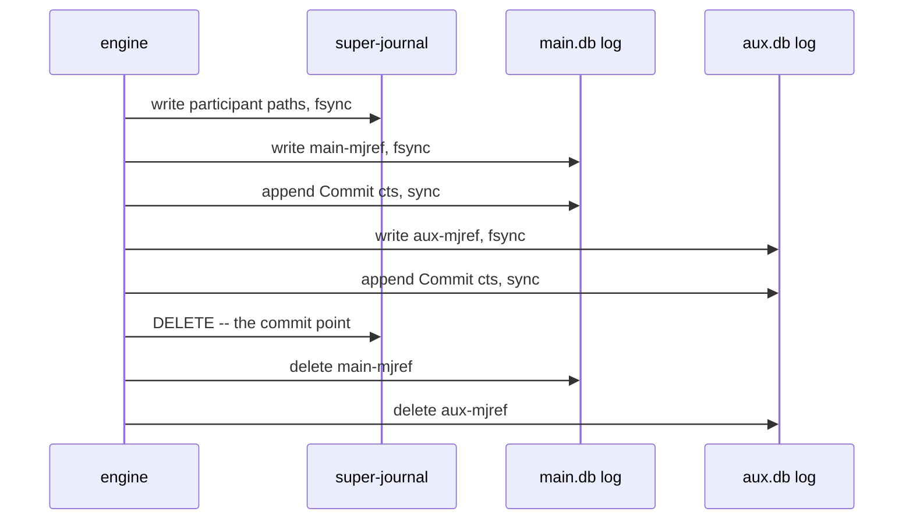
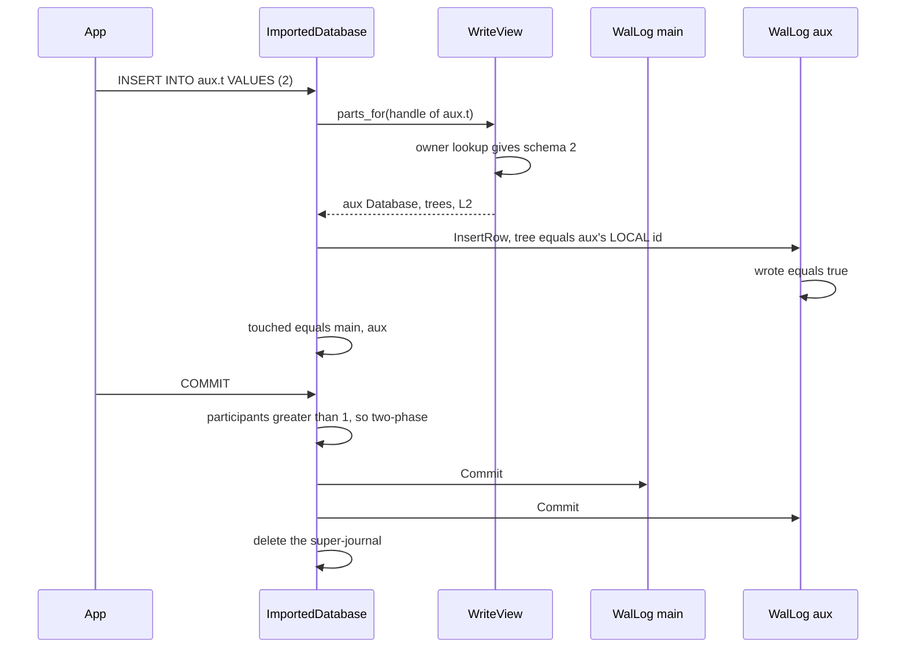

# task-1844 — `ATTACH`, `DETACH` and temp databases: the multi-schema refactor

## Introduction

The new engine (`inillucent-engine`) is built on one assumption that appears in almost every path:
**a connection is one file.** `ImportedDatabase` holds one `Database` (pool + meta + free map), one
`Wal`, one `HashMap<u32, PagedTree>` and one `next_root` counter. `ATTACH`, `DETACH` and every
`TEMP` object are refused because there is nowhere to put a second file.

This design makes a connection **a set of schemas**. `main` stays exactly as it is — same pool, same
log, same tree identifiers, same hot path — and every other schema (`temp`, and each `ATTACH`ed
file) is a sibling with its own `Database`, its own `Wal` and its own local tree numbering. A
connection-wide *handle* is what the planner and the executor name a tree by, so the executor's
`root: u32` key does not change shape. A transaction that writes two files commits through a
super-journal, which is SQLite's own multi-file commit adapted to a redo-only log.

## Goals and Non-Goals

### Goals

| # | goal | acceptance |
|---|---|---|
| G1 | `ATTACH` / `DETACH` work, with SQLite's name resolution | `crates/inillucent-compat/tests/attach.rs` **17/17** |
| G2 | `TEMP` tables, indexes, views and triggers work, per connection | `crates/inillucent-compat/tests/temp_objects.rs` **12/12** |
| G3 | A transaction spanning two files commits both or neither | `a_transaction_spans_two_databases`, `a_rollback_spans_two_databases`, `a_savepoint_spans_two_databases`, `a_two_database_commit_cleans_up_after_itself` |
| G4 | The read hot path is unchanged | the four-run 30-round **medium** gate on Windows: weighted lower bound ≥ **3.00x**, all 30 workloads digest-equal, no read family outside the run-to-run spread |
| G5 | The surface inventory counts down | `new_engine_surface.rs`'s `attach` row moves `NotYet` → `Yes` (its statement is `ATTACH DATABASE ':memory:' AS other`, so an in-memory schema is in scope) |
| G6 | Nothing else regresses | every other `inillucent-compat` suite that passes today still passes |

### Non-Goals

- **`schema_forms.rs`.** The ticket lists it as "the same machinery with `temp` as the schema". It
  is not, and the measurement says so — see [What `schema_forms.rs` actually is](#what-schema_formsrs-actually-is).
  It is graded here and reported, not "fixed".
- Multi-process access to one attached file. Still the engine's stated non-goal; two schemas of one
  connection are two pools in one process.
- `ATTACH ... KEY` — refused by the binder already, and a chosen refusal.
- Raising `SQLITE_MAX_ATTACHED`. The limit here is structural (handle space), stated, and refused by
  name.

## Problem statement

Measured on the tree at `9796b16`, with the pinned SQLite 3.53.4 present:

```
attach.rs        4 passed, 13 failed
temp_objects.rs  1 passed, 11 failed
schema_forms.rs  0 passed, 14 failed
```

The failures read `unknown database aux` (the binder cannot resolve a schema the catalog does not
list) and `no temporary database` (the binder refuses `TEMP` because `StaticCatalog.databases` holds
only `main`). Both are *engine* gaps, not SQL gaps: `inillucent-sql` already has the whole
multi-schema surface — `Statement::Attach`/`Detach`, `Directive::{Attach, Detach}`, a
`database: usize` on every DDL directive, `TableInfo.database`, `CatalogView::database_index`, and a
`StaticCatalog::search_order` that puts `temp` first and then walks `main` and the attachments in
order. Nothing in `inillucent-sql` needs designing; it needs a catalog with more than one row in
`databases`.

Four things in `inillucent-engine`/`-exec` assume one file:

| assumption | where | count |
|---|---|---|
| one pool | `TreeCatalog::pool()`; `Pipeline.pool`; `Statement.pool`; the index nested loop's pool | 4 call sites in `-exec` |
| one `&mut Database` | `WriteTarget::parts()` | 8 call sites in `dml.rs` |
| one tree map | `trees: HashMap<u32, PagedTree>` keyed across everything | `ImportedDatabase`, `WriteView` |
| one log | `wal: Rc<Wal>`, `WalLog { wal, txn, undo }` | `write()`, `undo_to`, `commit_batch`, `checkpoint` |

### What `schema_forms.rs` actually is

Every one of the fourteen was run and its panic read; the per-test evidence is in
`_agent_output/task-1844/schema-forms-findings.md`. The breakdown is:

- **7 fail purely on the file format.** Six open an inillucent file with the pinned SQLite oracle and
  get nothing back from `PRAGMA integrity_check` (`left: [] right: ["text:ok"]`); the seventh,
  `strict_is_enforced_on_a_file_sqlite_wrote`, runs it the other way — SQLite writes, inillucent
  opens — and gets `neither meta page is readable`, which is true and is what it should say.
- **6 name a genuine engine gap** and fail on a *statement*, before they ever reach the oracle — and
  would then still fail on the file format. `STRICT` is **not enforced**
  (`INSERT INTO s VALUES ('abc', ...) was accepted`, which is a silent wrong answer rather than a
  refusal); `CREATE INDEX` on a `WITHOUT ROWID` table is refused; a write through an `INSTEAD OF`
  trigger is refused; `REINDEX t` reports `database disk image is malformed`; `VACUUM` and
  `VACUUM INTO` are refused, and `VACUUM` is a `NotYet` row in the surface inventory.
- **1 is a chosen refusal.** `explain_reports_without_running` requires a **bytecode listing** with
  SQLite's eight columns beginning at `Init`; this engine compiles an operator chain and has no
  opcodes to list. Its `EXPLAIN QUERY PLAN` half already passes.

So thirteen of the fourteen cannot pass while the oracle has to read an inillucent file, and the
fourteenth cannot pass without a VDBE. **None of them is about `ATTACH` or `temp`.**

The file-format half is the same class as the sixteen tests commit `a1ccfe1` moved to `_junk/` —
"they failed because the promise was withdrawn, not because the engine was wrong". They are **not**
touched by this work and cannot be made to pass by it. The recommendation is at the end of this document; no file is
deleted or moved by this ticket.

## Architectural Overview



Reads and writes both start from a **handle** and reach the file through `owner`:



## Detailed technical sections

### 1. The handle, and why the executor's `u32` does not change

A tree is named in three different number spaces today and the distinction is already documented in
`ddl.rs`: the catalog row's `rootpage` is a **page in this file**; `SchemaEntry.tree_id` is a
**persisted local identifier** the log records carry; and `trees`/`layouts` are keyed by an
**identifier the planner reads through**, which happens to equal `tree_id` because there is only one
file.

This design separates the third from the second and calls it a **handle**: connection-wide, ephemeral,
allocated when a tree is registered and dropped when its schema detaches.

| space | scope | who allocates | persisted |
|---|---|---|---|
| page id | one file | the free map | yes, in the catalog row |
| local tree id | one file | that schema's `next_root` | **yes**, in `SchemaEntry.tree_id` and in every log record |
| **handle** | one connection | `main`: its own `next_root`; others: `next_handle` | **no** |

Allocation, so that a handle is unique inside a connection with no bit-packing and no silent overlap:

```
SCHEMA_VIEW_ROOT        = u32::MAX            main's catalog tree  (unchanged)
FIRST_CREATED_ROOT      = 0x8000_0000         main's created trees (unchanged)
FIRST_ATTACHED_HANDLE   = 0xC000_0000         every non-main schema's trees, and their catalogs
```

- **`main` keeps identity**: `handle == local tree id`. Nothing about `main`'s numbering, its trees
  map, its catalog view root or its plans changes, which is what protects G4.
- `main.next_root` now **refuses at `FIRST_ATTACHED_HANDLE`** ("this database holds too many
  objects"), so the two ranges cannot meet by growth. That is a stated bound of 2^30 created objects
  in one file, not an assumption.
- Every other schema takes handles from `next_handle`, counting up from `FIRST_ATTACHED_HANDLE` and
  refusing at `u32::MAX - 1`. Its catalog tree takes a handle from the same counter.
- Each schema keeps `handles: HashMap<u64 local_tree_id, u32 handle>` so an undo record (which
  carries the local id) can be routed back.

### 2. `Schema`, and what moves off `ImportedDatabase`

```rust
/// One database file a connection can name.
struct Schema {
    /// The name a statement qualifies with: `main`, `temp`, or the ATTACH name.
    name: Vec<u8>,
    /// The file, or `None` for `temp` and `:memory:`.
    path: Option<PathBuf>,
    /// The file system this schema's file and log live on.
    vfs: Arc<dyn Vfs>,
    /// The pool, meta page and free map.
    database: Database,
    /// The log every change to this file is described in.
    wal: Rc<Wal>,
    /// The catalog rows, and the handle each object's tree is registered under.
    entries: Vec<Recorded>,
    /// The identifier the next tree created *in this file* takes.
    next_root: u32,
    /// The handle each local tree id is registered under.
    handles: HashMap<u64, u32>,
    /// The handle this schema's own `sqlite_schema` tree is registered under.
    catalog_handle: u32,
}
```

`ImportedDatabase` keeps `trees`, `layouts`, `covering`, `vector_indexes` **flat and keyed by
handle**, exactly as today, and gains `schemas: Vec<Schema>`, `owner: HashMap<u32, usize>` and
`next_handle: u32`. Everything that reads a tree therefore reads it the same way; only the *pool* and
the *log* are now looked up per handle.

`self.database` and `self.wal` become `self.schemas[0].database` / `.wal`, reached through
`fn main_schema(&self)`. The 37 uses of `self.database` and the log uses become mechanical.

### 3. `TreeCatalog::pool()` becomes `pool_for(root)`

```rust
pub trait TreeCatalog {
    /// Returns the buffer pool the pages of one tree live in.
    ///
    /// @param root - the handle the plan named
    fn pool_for(&self, root: u32) -> Option<&Pool>;
    ...
}
```

There is no defaulted `pool()` left to fall back on: a call site that does not name a tree cannot be
right once a connection holds two files. The four sites in `-exec`:

| site | which tree's pool |
|---|---|
| `physical.rs:1531` `Pipeline { pool }` | the **source stage's** tree |
| `physical.rs:2183` `Statement { pool }` | the same, recomputed per rebuild |
| `physical.rs:2476` `IndexNestedLoopJoin::new(...)` | the **inner stage's** tree |
| `physical.rs:2604` the materialising full scan | that stage's tree |

`Pipeline` therefore keeps one pool, and it is correct that it does: a pipeline has one source. A
join across two databases reaches the second file through the index nested loop, which already
carries its own tree — it now carries that tree's pool beside it. That is the ticket's "the pool
travels with the stage rather than with the pipeline", made concrete: the *source's* pool stays on
the pipeline because the source is a stage; every other stage that touches a tree takes its own.

`join.rs`, `correlate.rs`, `subquery.rs` and `dml.rs` take the pool from the tree they are about to
read, which is already in hand at each of those sites.

### 4. `WriteTarget` hands out the right file *and* the right log

The log stops being a separate argument. It has to: a `TEMP` trigger firing on a write to `main`
writes rows into two files inside one statement, and a single `&mut dyn TreeLog` cannot describe
both.

```rust
pub trait WriteTarget {
    /// Returns the file, its trees and its log, for the schema one tree is in.
    ///
    /// @param root - the handle of the tree about to be written
    fn parts_for(&mut self, root: u32) -> DbResult<(&mut Database, &mut dyn Trees, &mut dyn TreeLog)>;
    fn layout(&self, root: u32) -> Option<&SourceLayout>;
    fn catalog(&self) -> &dyn TreeCatalog;
    fn captures(&self, root: u32) -> bool { false }
}
```

That deletes the `log: &mut dyn TreeLog` parameter from 14 functions in `dml.rs` and 2 in
`trigger.rs`, because every one of them only ever used it at a `parts()` site.

`WriteView` grows the per-schema logs it hands out:

```rust
struct WriteView<'a> {
    schemas: &'a mut Vec<Schema>,      // databases and wals
    logs: Vec<WalLog<'a>>,             // one per schema, built once per statement
    owner: &'a HashMap<u32, usize>,
    trees: &'a mut HashMap<u32, PagedTree>,
    layouts: &'a HashMap<u32, SourceLayout>,
    covering: &'a HashMap<u32, Vec<u32>>,
    indexed: &'a HashMap<u32, Vec<VectorIndex>>,
}
```

`parts_for` borrows three distinct fields of `self` mutably at once, which the borrow checker accepts
for the same reason the current three-field `WriteView` does.

**The undo buffer moves behind a `RefCell`.** Each `WalLog` needs to append before-images, and there
are now several of them alive at once. `undo: RefCell<Vec<Before>>` on `ImportedDatabase`, and each
log holds `Option<&RefCell<Vec<Before>>>` — a shared borrow, so N logs coexist. `Before` gains a
`schema: usize`, stamped by the log that recorded it, so `undo_to` can look the tree up as
`schemas[schema].handles[&entry.tree]` instead of guessing.

Each `WalLog` also carries `wrote: Cell<bool>`, set on the first record. After the statement, the
engine folds those into `touched: BTreeSet<usize>` — the participant set the commit needs. One
`Cell::set` per record; nothing measurable.

### 5. Cross-database atomicity: a super-journal, not a shared log

The ticket asks for the decision to be written down. It is: **two-phase commit with a super-journal
file**, and **not** a shared log.

**Why not a shared log.** A schema's log is found by name from its own file (`Wal::open(vfs,
&db_path, uuid, ...)`), and it is what recovery reads when that file is next opened — including when
it is opened *on its own*, which is the whole point of `ATTACH`ing an ordinary database. One log for
two files means the second file's committed rows live in a log the second file's next open cannot
find. The only repair is to checkpoint the attached file at every cross-file commit, which turns a
log append into a full page flush and still leaves the window between the two files' flushes torn.

**Why two-phase works here.** The log is redo-only: a transaction whose `Commit` record is absent is
simply not replayed. So "undecided" has to be expressible, and it is expressible *out of band*
without touching the record codec (which is held to 100% branch coverage) or adding a record kind:

```
<main>-mj<txn>      the super-journal: the list of participant paths
<file>-mjref        one per participant: the super-journal path and the txn number
```

Commit of a transaction that wrote **two or more persistent schemas** (`temp` never participates —
it is not recovered):



Recovery of any file, at open:

| `-mjref` present? | super-journal present? | decision |
|---|---|---|
| no | — | ordinary recovery, unchanged |
| yes | yes | the commit was never decided → **that txn is treated as uncommitted**; delete `-mjref` |
| yes | no | the commit point was passed → **replay it**; delete `-mjref` |

That is SQLite's own multi-file rule with the polarity of a redo log. Deleting the super-journal is
the single atomic act that decides every participant, so there is no window in which one file is
committed and another is not.

The only change in `inillucent-wal` is one additive field on `RecoveryStart`:

```rust
pub struct RecoveryStart {
    pub uuid: u128,
    pub checkpoint_lsn: u64,
    pub sequence: u64,
    pub cts_watermark: u64,
    /// Transactions whose `Commit` record must be read as absent.
    ///
    /// A cross-file commit is decided by a super-journal outside this log, so a
    /// `Commit` here is a *vote*, not the decision. Empty for every single-file
    /// database, which is every one that has never been ATTACHed to.
    pub doubtful: BTreeSet<u64>,
}
```

and one filter in `analyse`: a `Commit` whose txn is in `doubtful` does not enter `committed`. No new
record kind, no codec change, one new branch.

**A transaction that writes one file pays none of this.** The participant set is checked at commit;
`len() <= 1` takes exactly the path it takes today (`wal.commit(txn, txn)` and nothing else). That is
what keeps the `write` and `transaction` gate families where they are.

**Rollback and savepoints** need no protocol at all: they are before-images replayed as ordinary
writes, and with `Before.schema` each one goes back into the file it came from. `undo_to`'s existing
newest-first rule is unchanged.

### 6. `ATTACH`, `DETACH`, and name resolution

`execute_ddl` gains two arms in front of the `other =>` refusal:

```
Directive::Attach { file, schema } => self.attach(file, schema)
Directive::Detach { schema }       => self.detach(schema)
```

`attach(path, name)`:

1. Refuse `main` and `temp` by name; refuse a name already attached; refuse past
   `Limits::max_attached` (SQLite's default 10).
2. `:memory:` → a `MemoryVfs`; anything else → `OsVfs`, creating the file when it is not there
   (`ATTACH` on a missing file creates it, as SQLite does).
3. Open or create the `Database`, run recovery (with the `doubtful` set from any `-mjref`), open the
   `Wal`, read its catalog tree, register a handle per tree, insert into `trees` / `layouts` /
   `covering` / `owner`.
4. Append the name to `StaticCatalog.databases`, rebuild `tables` with `database = index` and
   `root = handle`, `refresh_catalog()` (which empties the plan cache and bumps the generation).

`ATTACH` inside an open transaction is allowed — `attaching_inside_a_transaction_is_allowed` — and
the new schema simply joins the participant set from its first write.

`detach(name)`: refuse `main`, `temp` and an unattached name; refuse while a transaction that has
written it is open (SQLite's rule); checkpoint and drop its `Database`, `Wal` and every handle it
owns; remove it from `databases`; `refresh_catalog()`.

Resolution itself is already written: `StaticCatalog::search_order` walks `temp`, `main`, then the
attachments in order, which is exactly `main_wins_an_unqualified_name` and
`an_unqualified_name_finds_the_only_database_that_has_it`.

### 7. `temp` is a schema, and a connection is a thing

`temp` differs from an attachment in two ways, and only two:

- **It is created lazily on first use**, over a `MemoryVfs`, with no path — so nothing reaches the
  file the connection was opened on. It never participates in the super-journal, and it is dropped
  with its connection.
- **It is per connection.** `each_connection_has_its_own_temporary_database` requires it, and today
  it cannot hold: `connect::Database::connect()` hands out a borrow, `inillucent-compat`'s facade
  opens a fresh engine connection *per statement*, and every one of them is the same
  `ImportedDatabase`.

So a connection becomes a real thing: `Database::connect()` allocates a `SessionId`, `Connection`
carries it, and it reaches the engine on every entry point (`execute_any`, `prepare_statement`,
`execute_statement`, `execute_ddl`, `bind`). The engine holds `temp: HashMap<SessionId, usize>` —
which schema slot is that session's `temp` — and the binder is handed a catalog whose `temp` row is
that session's.

Two consequences, both handled:

- **The plan cache is keyed per session as well as per lever mask**, because `SELECT * FROM t` binds
  to a different table in a session that has shadowed `t` with a `TEMP` table. The key becomes one
  `u64` (`session << 32 | levers`) so the lookup stays a single hash of the SQL text — the nesting
  that makes a cache *hit* free is not disturbed.
- `inillucent-compat`'s facade `Connection` allocates its session once and passes it to every
  `self.engine.connect_as(session)`, so its per-statement connections are one connection again.

`CREATE TEMP TABLE main.t` is refused by the binder already (`temporary table name must be
unqualified`), which is `a_temporary_name_may_not_be_qualified`.

### 8. `PRAGMA database_list`

Already `Yes` in the surface inventory and answering one row. It now answers one row per schema, in
attachment order, with `main` first — which is also the cheapest end-to-end check that the schema set
is what the connection thinks it is.

## Data flows and security

A cross-database write, end to end:



Security: `ATTACH` opens only the path the caller's SQL supplies, and the engine is embedded and
trusts its caller exactly as it does today — this widens nothing that a caller could not already
reach with `Database::open`. `KEY` stays refused. Nothing here touches ai-service, media, member
identity or the incognito rules; no user data of any kind is involved.

### Risks

| risk | mitigation |
|---|---|
| `pool_for` costs the read hot path a hash lookup per stage | the lookup is per *build*, not per row — `Pipeline.pool` is resolved once when the pipeline is built. The gate is the guard, run four times. |
| the handle indirection breaks `main`'s numbering | `main` keeps identity (`handle == local id`); the change is provably a no-op for a connection with one schema, and the whole existing suite is the check. |
| folding the log into `WriteTarget` touches 16 signatures in the write path | mechanical, and every one is a compile error until it is done; `write`/`transaction` gate families before and after. |
| the super-journal costs every commit | it is only written when a transaction touched ≥ 2 persistent schemas; single-file commit is byte-for-byte the path it is today. |
| per-session `temp` changes the plan-cache key | keyed as one `u64` so a hit is still one hash of the text; `plan_cache.rs` and `prepare.trivial` are the instruments. |
| `RecoveryStart` gains a field | additive, one branch in `analyse`, and `doubtful` is empty for every database that was never attached to. |

## Alternatives considered

| alternative | why not |
|---|---|
| **A shared WAL for the whole connection** | an attached file's next open reads *its own* log; a shared one makes its committed rows unfindable. Repairing that means checkpointing the attached file on every cross-file commit — a page flush where there was a log append, and still torn between the two flushes. |
| **Key trees by `(schema, root)` throughout** | changes `SourceLayout.tree_key`, `AccessPath`, `covering_candidates`, `TableInfo.root`, every plan and the statement cache. A handle gets the same guarantee with no change to the executor's key type. |
| **Bit-pack the handle as `schema << 28 \| local`** | incompatible with keeping `main`'s identity, which is what makes the change a provable no-op for one-file connections. |
| **A new `Prepare` record kind in the WAL** | `record.rs` is held to 100% branch coverage and is what the `corrupt_wal` fuzz target drives. A `doubtful` set on `RecoveryStart` expresses the same thing with one branch and no format change. |
| **Order the two commits and accept the window** | that is the silent wrong answer this ticket exists to avoid: one file committed and the other not, with nothing that can find out. |
| **Give `temp` a file on disk** | it would have to be cleaned up on a crash, and `a_temporary_table_is_not_in_the_file` is about not touching the caller's directory at all. `MemoryVfs` already exists. |
| **Leave `temp` shared across connections** | `each_connection_has_its_own_temporary_database` is graded against SQLite, and a shared `temp` is a cross-connection data leak in an engine that is otherwise strictly per-file. |

## Testing strategy

Functional and differential first; every new case is graded against the pinned SQLite 3.53.4 rather
than against an expectation written by hand.

| # | test | what it proves |
|---|---|---|
| T1 | `attach.rs` 17/17 | resolution order, qualified and unqualified names, joins across files, the reserved names, detach, and the two-file commit's cleanup |
| T2 | `temp_objects.rs` 12/12 | temp tables/indexes/views/triggers, shadowing, per-connection isolation, and a transaction covering `temp` and `main` |
| T3 | `new_engine_surface.rs` | the `attach` row moves to `Yes` and the inventory still counts down |
| T4 | the whole `inillucent-compat` suite | nothing else moved |
| T5 | **`multi_database_commit.rs`**: write both files, reconstruct the on-disk state a crash before the commit point leaves, reopen — both empty; delete the super-journal, reopen — both carry it | the atomicity claim, rather than an argument for it |
| T5b | **`multi_database_participants.rs`**: a one-file statement after a schema change to another database is still decided over one file | that the protocol costs nothing when it decides nothing — and it catches the defect the first `seal` had |
| T6 | `cargo test --workspace` tally recorded before and after | the count moves by exactly the tests this ticket turns green |
| T7 | the **four-run 30-round medium gate** on Windows | G4: weighted lower bound ≥ 3.00x, 30/30 digest-equal, no read family outside the run-to-run spread |

### What the gate said

Four consecutive thirty-round runs at medium on Windows, the page size and pool the contract names,
against task-1838's four on the same fixture and machine
(`_agent_output/task-1844/gate/20260906T225604/`, `_agent_output/task-1838/qualification/`):

```
run   weighted  lower bound  workloads agreed
  1   3.38x     3.30x        30 of 30
  2   3.28x     3.19x        30 of 30
  3   3.34x     3.17x        30 of 30
  4   3.25x     3.15x        30 of 30
```

Every lower bound clears the 3.00x bar; task-1838's four were 3.12x to 3.19x. Every read family's
centre overlaps or beats theirs, and the four families under the floor are the same four at the same
values — `open.prepare` 0.77-0.80x, `schema` 0.50-0.56x, `extension` 0.72-0.78x, `transaction`
0.93-1.04x. The floor was not met before this work and is not met by it.

**One measurement was read wrongly first, and the correction is the point.** `txn.batched` came in
at 5.71x-6.22x against task-1838's 6.17x-6.77x, which reads as a 6% regression. It is not: on
inillucent's own clock the per-statement `Vec<WalLog>` cost about 1.5 ms of 45, roughly 3%, and the
rest of the gap was SQLite's arm moving (255.8-269.0 ms against task-1838's 264.8-275.5 ms). A ratio
moves when its baseline moves. The allocation was removed anyway — the logs are inline for a
connection with one file, and the participant set is a `u16` bitmask rather than a `BTreeSet` —
which leaves inillucent at 42.2-44.9 ms against task-1838's 43.0-45.1 ms.

### Order of work

1. `pool_for(root)` and the pool travelling with the stage. **Suites green and the gate unchanged
   before anything else lands** — this is the read hot path.
2. `Schema`, the handle, `owner`, and `main` as schema 0. Still one schema; the whole suite is the
   proof that it is a no-op.
3. `ATTACH`/`DETACH`, the catalog, resolution. `attach.rs`'s read tests go green.
4. `WriteTarget::parts_for`, the per-schema logs, `Before.schema`. Writes to an attached table.
5. The super-journal and `doubtful`. The four transaction tests and the crash cut.
6. `temp` as a schema, sessions, the per-session plan-cache key. `temp_objects.rs`.
7. The gate, four runs.

### `schema_forms.rs` — the recommendation

Not a deletion and not a move; this ticket touches neither. Recorded for Jason's ruling, which is the
same ruling `a1ccfe1` already made for the other sixteen:

- **Retire the thirteen to `_junk/schema_forms.rs`**, as `a1ccfe1` retired the other sixteen, and for
  the reason it gave: the promise they check was withdrawn, and deleting them would delete the record
  of what was once promised. The differential corpus already grades views, triggers, generated
  columns and `ALTER` on *logical* answers, which is what survives the withdrawal.
- **Keep `explain_reports_without_running`'s `EXPLAIN QUERY PLAN` half** as a test of its own.
- **File the six engine gaps as their own tickets**, because they are real and are now hidden inside
  a file that fails for a different reason. `STRICT` enforcement and `VACUUM` are the two worth having
  soonest: a `STRICT` table that accepts the wrong class is a silent wrong answer, and `VACUUM` is a
  `NotYet` nothing is working on.
- `strict_is_enforced_on_a_file_sqlite_wrote` could be **repointed at `Database::import`** rather than
  retired, once `STRICT` is enforced at all.
