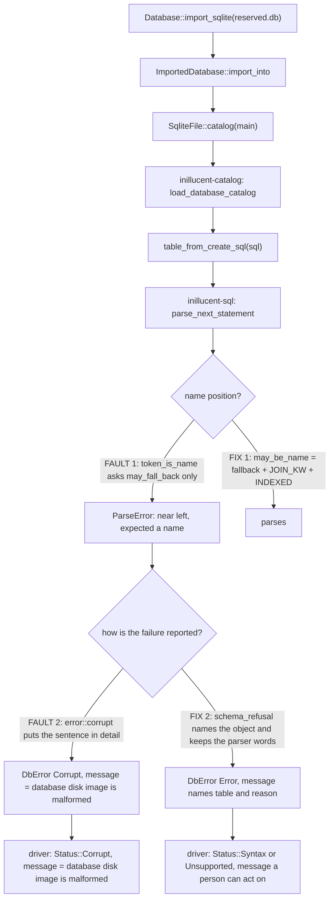
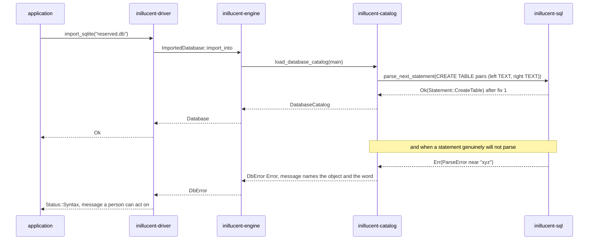

# task-1847 — `left` is a column name, and a schema we cannot parse is not a damaged file

## Introduction

Importing a perfectly ordinary SQLite database whose table has a column named `left` fails, and it
fails with the wrong answer. `inillucent_driver::Database::import_sqlite` returns
`status = Corrupt, message = "database disk image is malformed"` for a file that SQLite itself reads
without complaint.

There are two independent defects behind that one line, and the second is the more expensive one.

1. **A parity gap.** `inillucent-sql` refuses `left` (and `right`, `full`, `inner`, `cross`,
   `natural`, `outer`, `indexed`) wherever a name is expected. SQLite accepts every one of them in
   that position. A schema SQLite writes and this engine will not read is a dialect divergence, not
   a caller's mistake.
2. **A dishonest diagnosis.** When the catalog loader cannot parse a stored `CREATE` statement it
   reports `SQLITE_CORRUPT`, and the sentence explaining what actually happened is put in the
   error's `detail` field — which is suppressed unless the caller opened the database with
   diagnostics on. What is left is the primary code's canned text, *"database disk image is
   malformed"*. It sends a reader to `PRAGMA integrity_check` on a healthy file.

This TDD covers fixing both, plus the conformance case that keeps them fixed.

## Goals and Non-Goals

**Goals**

- `CREATE TABLE pairs (left TEXT, right TEXT)` parses, binds, writes and reads back, matching the
  pinned SQLite 3.53.4 shell in every name position it accepts one.
- The bare-alias position keeps refusing them, because SQLite refuses them there too
  (`SELECT a left FROM t` is a syntax error in SQLite and must stay one here).
- A stored `CREATE` statement this engine cannot parse produces an error whose **`message()`** names
  the object and repeats the parser's own words and offset — never the canned corruption sentence.
- That failure classifies through `inillucent-driver` as `Syntax` (or `Unsupported`, with the
  construct named, when the parser marked it as a construct we have not implemented) rather than
  `Corrupt`.
- `drivers/conformance/suite.json` carries a case for reserved-word column names, so both driver
  runners assert it.

**Non-Goals**

- No change to `Corrupt` for failures that really are about bytes: a bad root page number, an
  unreadable record, a damaged b-tree. Those stay corruption.
- No partial-import semantics. An import that cannot understand the schema still refuses the whole
  file; only *what it says* changes.
- No new keyword behaviour beyond matching the pinned release. This is a parity fix, not a dialect
  extension.

## Problem statement

### Fault 1 — the name rule is a single flat flag

`crates/inillucent-sql/src/keyword.rs` records one boolean per keyword, `may_fall_back`, transcribed
from SQLite's `%fallback ID …` declaration in `parse.y`. `Parser::token_is_name` asks that one
question at every position where a name is expected.

That is a faithful transcription of `%fallback` and an incomplete transcription of the grammar.
SQLite does not accept a name via `%fallback` alone — it also has explicit productions:

```
%token_class idj  ID|INDEXED|JOIN_KW.
nm(A) ::= idj(A).
nm(A) ::= STRING(A).
```

`JOIN_KW` is `CROSS FULL INNER LEFT NATURAL OUTER RIGHT`. None of those is in the fallback set, and
all seven are legal names. `INDEXED` is likewise legal as a name and is not in the fallback set.

Measured against the pinned shell (`.sqlite-ref/3.53.4/shell/sqlite3.exe`), every one of these is
accepted by SQLite and refused by us:

| Statement | SQLite 3.53.4 | inillucent today |
|---|---|---|
| `CREATE TABLE t (left TEXT, right TEXT)` | ok | `near "left": syntax error, expected a name` |
| `CREATE TABLE left (a INT)` | ok | refused |
| `CREATE TABLE indexed (a INT)` | ok | refused |
| `SELECT left, right FROM t` | ok | refused |
| `SELECT t.left FROM t` | ok | refused |
| `SELECT a FROM t AS left` | ok | refused |
| `CREATE INDEX left ON t(a)` | ok | refused |
| `SELECT 1 AS left` | ok | refused |

And these SQLite refuses, so we must keep refusing them:

| Statement | SQLite 3.53.4 | Position |
|---|---|---|
| `SELECT a left FROM t` | `near "left": syntax error` | bare alias |
| `SELECT a indexed FROM t` | `near "indexed": syntax error` | bare alias |
| `SELECT a FROM t left` | `near ";": syntax error` | bare alias |
| `SELECT a FROM t indexed` | `near ";": syntax error` | bare alias |
| `CREATE TABLE t (a left)` | `near "left": syntax error` | declared type |
| `CREATE TABLE t (a indexed)` | `near "indexed": syntax error` | declared type |
| `CREATE TABLE t (left left)` | `near "left": syntax error` | declared type |

That second group is the whole reason this cannot be a one-line widening of the flag. **Two**
productions take the narrow class:

```
%token_class ids  ID|STRING.
as(X)       ::= AS nm(Y).      // an alias written with AS is a name
as(X)       ::= ids(X).        // one written without AS is not
typename(A) ::= ids(A).        // and a declared type is not either
typename(A) ::= typename ids.
```

The type position is the one that is easy to miss, and missing it trades one divergence from the
pinned release for another: `CREATE TABLE t (left TEXT)` has to parse and `CREATE TABLE t (a left)`
has to be refused, because the *name* and the *type* beside each other take different classes.
`CREATE TABLE t (a key)` parses in both, because `KEY` is in the fallback set and so lexes as `ID`.

So the grammar has **two** name classes across **three** positions, and we currently model one.

### Fault 2 — the sentence lands in the field nobody is allowed to read

`crates/inillucent-catalog/src/load.rs` builds every schema-parse failure with
`inillucent_base::error::corrupt(...)`:

```rust
let parsed = parse_next_statement(sql, 0, &limits)
    .map_err(|error| error::corrupt(format!("malformed schema SQL: {}", error.message())))?;
```

`error::corrupt` is documented as *"malformed persistent bytes"* and attaches its argument with
`with_detail`, not `with_message`. `DbError::message()` therefore answers the primary code's own
static text — `"database disk image is malformed"` — and `detail()` is only surfaced by
`inillucent-driver` when the database was opened with diagnostics on. The default path throws the
explanation away.

This is the same defect `inillucent_base::error::refusal` was introduced to fix for statement-level
errors, and the engine's own `refused()` helper already does the right thing for a `ParseError` at
`crates/inillucent-engine/src/lib.rs`. The catalog loader never got the treatment.

The classification is wrong as well as the wording. `inillucent-driver` maps `PrimaryCode::Corrupt`
to `Status::Corrupt`, whose documented meaning is *"the file is not a database, or is damaged"*.
A `CREATE TABLE` that SQLite wrote and we cannot read is neither. It is either a construct this
engine has not implemented — which the driver has a dedicated status for — or, in the genuinely
broken case, a statement that is not valid SQL, which is `Syntax`. Both of those tell a reader where
to look. `Corrupt` tells them to look at the disk.

## Architectural overview



## Components and interfaces

### `crates/inillucent-sql/src/keyword.rs`

Add a second data column to the `keywords!` table and a second accessor. The file's own stated
invariant is that this rule is *data rather than a special case buried in the parser*, so the new
rule belongs in the table beside the old one.

```rust
/// Returns whether the keyword may be written where a *name* is expected.
///
/// SQLite's name production is `nm ::= idj | STRING` with
/// `idj ::= ID | INDEXED | JOIN_KW`, so the seven join keywords and `INDEXED`
/// are names even though none of them is in the `%fallback` set.
pub fn may_be_name(self) -> bool { … }
```

`may_be_name` is true for every keyword `may_fall_back` is true for, plus `CROSS`, `FULL`, `INNER`,
`LEFT`, `NATURAL`, `OUTER`, `RIGHT` and `INDEXED`. `may_fall_back` keeps its current values
unchanged — it is still the transcription of `%fallback`, and it is still the right question for the
bare-alias position.

### `crates/inillucent-sql/src/parser/mod.rs`

- `token_is_name` switches from `may_fall_back` to `may_be_name`. Every existing caller — column
  declarations, table names, index names, qualified references, `AS` aliases, window names — gets
  the wide set, which is what `nm` means.
- A new `token_is_plain_name` keeps the narrow `may_fall_back` question — SQLite's `ids` class — and
  the two positions that take it use it: `parse_alias`'s no-`AS` branch and `parse_type_name`
  (plus the `at_plain_name` guard in `parse_column_def` that decides whether a type follows the
  column's name at all). The existing `WINDOW` special case stays: `WINDOW` is in the fallback set
  and would otherwise swallow a `WINDOW w AS (...)` clause as a table alias.

That is the entire parser change. Three predicates, one meaning each:

| Predicate | Set | Positions |
|---|---|---|
| `token_is_name` | `ID` + fallback + `JOIN_KW` + `INDEXED` + quoted | `nm` — every name |
| `token_is_plain_name` | `ID` + fallback + quoted | `ids` — a bare alias, a declared type |
| `token_is_word` | any identifier token | a pragma value, where nothing else can appear |

Every other `at_name` call site keeps the wide question, and each was checked against the pinned
release rather than assumed: a table option (`table_option ::= nm`), a pragma's parenthesised
argument (`nmnum ::= … nm …`), `VACUUM nm`, `ANALYZE nm dbnm` and `REINDEX nm dbnm` are all `nm`
positions in `parse.y`.

`parse_index_hint` is unaffected: `parse_from_term` calls `parse_alias` *before* it, and the narrow
alias rule leaves `INDEXED` for the hint to claim, exactly as SQLite's grammar does.

### `crates/inillucent-catalog/src/load.rs`

Replace the five `error::corrupt(format!("malformed … SQL: …"))` sites with one helper that mirrors
the engine's `refused()`:

```rust
/// Reports schema SQL this engine could not parse, naming the object and
/// repeating the parser's own words.
///
/// **This is not corruption.** `error::corrupt` means malformed persistent
/// bytes and answers `message()` with "database disk image is malformed", which
/// sends a reader to `PRAGMA integrity_check` on a file SQLite reads perfectly.
/// The bytes were read; it is the statement we could not understand.
fn schema_refusal(what: &str, name: &str, error: ParseError) -> DbError
```

It produces `DbError::primary(error.code())` (that is `PrimaryCode::Error` for a syntax error and
`TooBig` for a size limit), with:

- `message` = `cannot parse the schema SQL for <what> "<name>": <parser message>`
- `detail` = the same sentence, so every existing `detail()` reader sees what it saw before
- `sql_offset` = the parse error's offset, so a caller can point at the character
- `unsupported` set from `ParseErrorKind::Unsupported(what)`, so the driver answers
  `Status::Unsupported` with the construct named — the behaviour the ticket names as the model

`corrupt_schema` stays the constructor for a schema row that is *structurally* wrong, and those
really are corruption — but it gains the same message fix, setting its sentence as the message as
well as the detail so `message()` stops answering the canned text there too.

The same split is applied to `rename.rs`, which re-reads a **stored** `CREATE TABLE` for `ALTER
TABLE … DROP COLUMN`: that is the same fact as the import and is reported the same way. Its
`reparsed` self-check is deliberately left as corruption, because a rewrite this engine produced and
cannot read back is an internal defect that nothing the caller wrote can cause, and filing it under
the caller's typos would hide it.

`table_from_create_sql` and friends take the object name where they have one. `table_from_row`
already wraps with `in object <name>`; that wrapper is folded into the message instead of the
detail.

### `crates/inillucent-catalog/src/load.rs` — the module invariant

The header currently states *"a schema that cannot be parsed is reported as corruption naming the
object"*. That sentence is the defect, written down. It is replaced with the rule this change
establishes: a schema that cannot be parsed is reported as a **refusal** naming the object and the
reason, and corruption is reserved for bytes.

## Data flows and error handling



### Risks

| Risk | Why it is contained |
|---|---|
| Widening the name set makes `FROM t LEFT JOIN u` read `LEFT` as an alias | The bare-alias position keeps the narrow set. `parse_from_term` calls `parse_alias` before the join operator is examined, so `LEFT` is refused as an alias and falls through to the join rule — which is exactly how SQLite's own grammar resolves it. Asserted directly by test. |
| Widening the name set breaks `FROM t INDEXED BY i` | Same mechanism. `parse_alias` (narrow) refuses `INDEXED`, `parse_index_hint` runs next and claims it. Asserted directly by test. |
| Widening the name set makes `CREATE TABLE t (a left)` parse, which SQLite refuses | The declared-type position takes the narrow class too. Found by putting the type position to the pinned shell rather than by reading `parse.y`, and asserted in `NARROW_POSITIONS_SQLITE_REFUSES`, which the oracle test runs against real SQLite in both directions. |
| Changing the primary code from `Corrupt` to `Error` breaks a caller that switches on it | Two call sites assert it and both are being changed on purpose: `load.rs`'s `unparseable_schema_sql_is_corruption` unit test and `inillucent-compat`'s `a_corrupt_schema_row_names_its_object`. The engine's own open path already swallows the error into `skipped()` regardless of code. No production branch reads `Corrupt` from a schema parse. |
| A genuinely damaged `sqlite_schema` row now reports `Syntax` | It reports `cannot parse the schema SQL for table "good": near "this": syntax error` — which names the object and the text, and is strictly more information than "database disk image is malformed". A person reading it concludes the row is bad; the old message pointed them at the wrong thing entirely. |

## Alternatives considered

**A. Widen `may_fall_back` to include the join keywords.** One-line change, and wrong: it would make
`SELECT a left FROM t` and `SELECT a FROM t left` parse, both of which SQLite refuses. The fallback
flag is a transcription of a specific declaration in `parse.y` and corrupting it to mean something
else loses the ability to model the bare-alias position at all.

**B. Special-case the join keywords inside the parser's column-declaration rule.** Fixes the ticket's
literal reproduction and nothing else — `CREATE TABLE left (a)`, `SELECT t.left`, `CREATE INDEX left`
and `SELECT 1 AS left` would all still fail. It also puts the rule in the one place `keyword.rs`
explicitly says it must not be: *"a special case buried in the parser"*.

**C. Keep `PrimaryCode::Corrupt` and only move the sentence into `message()`.** This is what SQLite
itself does — `SQLITE_CORRUPT` with `malformed database schema (pairs) - near "left": syntax error` —
and it is the smaller change. Rejected because the ticket's complaint is the diagnosis, not only its
wording, and because the two failures the engine can actually distinguish deserve different statuses:
a construct we have not implemented is `Unsupported` with the feature named, which is information a
caller can branch on, and `Corrupt` would flatten it back into "your disk is bad". The message fix
alone would leave `import_sqlite` still answering `status = Corrupt` for a healthy file.

**D. Skip an unparseable table and continue the import, the way the open path does.** Attractive, and
out of scope. It changes what an import *does* rather than what it *says*, and a silently partial
import is its own defect class. Recorded here as a follow-up worth considering, not taken.

## Testing strategy

Favouring end-to-end assertions over unit tests, and pinning behaviour against the reference shell
wherever the claim is a parity claim.

### 1. Driver-level integration (the ticket's own reproduction)

`drivers/inillucent-driver/tests/` — build a real SQLite database with the pinned 3.53.4 shell:

```sql
CREATE TABLE pairs (left TEXT, right TEXT);
INSERT INTO pairs VALUES ('a','b');
```

then `Database::import_sqlite` it and `SELECT left, right FROM pairs`, asserting the row comes back
as `('a','b')`. This is the ticket verbatim and it must go from failing to passing.

### 2. Conformance suite

`drivers/conformance/suite.json` gains `reserved_word_column_names`: create a table whose columns are
`left` and `right`, insert, read back by name, order by one of them. Both runners — the Rust
`tests/conformance.rs` and `drivers/bindings/python/run_conformance.py` — execute it, which is what
stops the driver and its specification drifting.

### 3. Parser parity, both directions

`crates/inillucent-sql` tests asserting the accepted set:

- `CREATE TABLE pairs (left TEXT, right TEXT)`, `CREATE TABLE left (a INT)`,
  `CREATE TABLE indexed (a INT)`, `SELECT left, right FROM t`, `SELECT t.left FROM t`,
  `SELECT a FROM t AS left`, `CREATE INDEX left ON t(a)`, `SELECT 1 AS left`

and the refused set, which is the half a careless fix breaks:

- `SELECT a left FROM t`, `SELECT a indexed FROM t`, `SELECT a FROM t left`,
  `SELECT a FROM t indexed` — each must still be a syntax error (bare alias)
- `CREATE TABLE t (a left)`, `CREATE TABLE t (a indexed)`, `CREATE TABLE t (left left)`,
  `CREATE TABLE t (a unsigned big left)` — each must still be a syntax error (declared type),
  while `CREATE TABLE t (a key)` and `CREATE TABLE t (left key)` must parse
- `SELECT * FROM t LEFT JOIN u ON t.a = u.a` must still parse as a left join
- `SELECT * FROM t INDEXED BY i` must still parse as an index hint
- `SELECT * FROM t WINDOW w AS (ORDER BY a)` must still parse as a window clause

Both lists are also put to the **pinned 3.53.4 oracle** by
`the_reserved_word_lists_agree_with_the_pinned_release`, which compares SQLite's verdict against
ours for every statement and asserts it obtained more than twenty verdicts — so a run where the
oracle was missing skips loudly rather than passing silently. The claim about what SQLite does is
therefore measured on every run, not transcribed once.

Plus a table-level test that `may_be_name` is a superset of `may_fall_back` and holds exactly the
eight extra words, so the two columns cannot silently diverge.

### 4. Error reporting

- Unit: `table_from_create_sql(b"CREATE TABLE t(")` answers a `PrimaryCode::Error` whose
  `message()` contains `cannot parse the schema SQL` and the parser's own words, and whose
  `message()` is **not** `database disk image is malformed`.
- Unit: a `ParseErrorKind::Unsupported` from schema SQL arrives with `unsupported()` set, so the
  driver classifies it `Status::Unsupported` with the construct named.
- Integration (`inillucent-compat/tests/catalog.rs`, existing test rewritten): a database whose
  `sqlite_schema.sql` was overwritten with `'this is not sql'` via `PRAGMA writable_schema` fails to
  connect with a message that names `good` **and** says what was wrong with the text — asserted on
  `message()`, the field a caller is told to read, not on `detail()`.
- Driver: the same file through `import_sqlite` reports `Status::Syntax`, not `Status::Corrupt`.

### 5. Regression floor

The existing workspace tests for `inillucent-sql`, `inillucent-catalog`, `inillucent-engine`,
`inillucent-compat` and the driver all run. A widened name set is the kind of change that shows up as
a parse that now succeeds where a test expected a refusal, and those are the suites that would say so.
