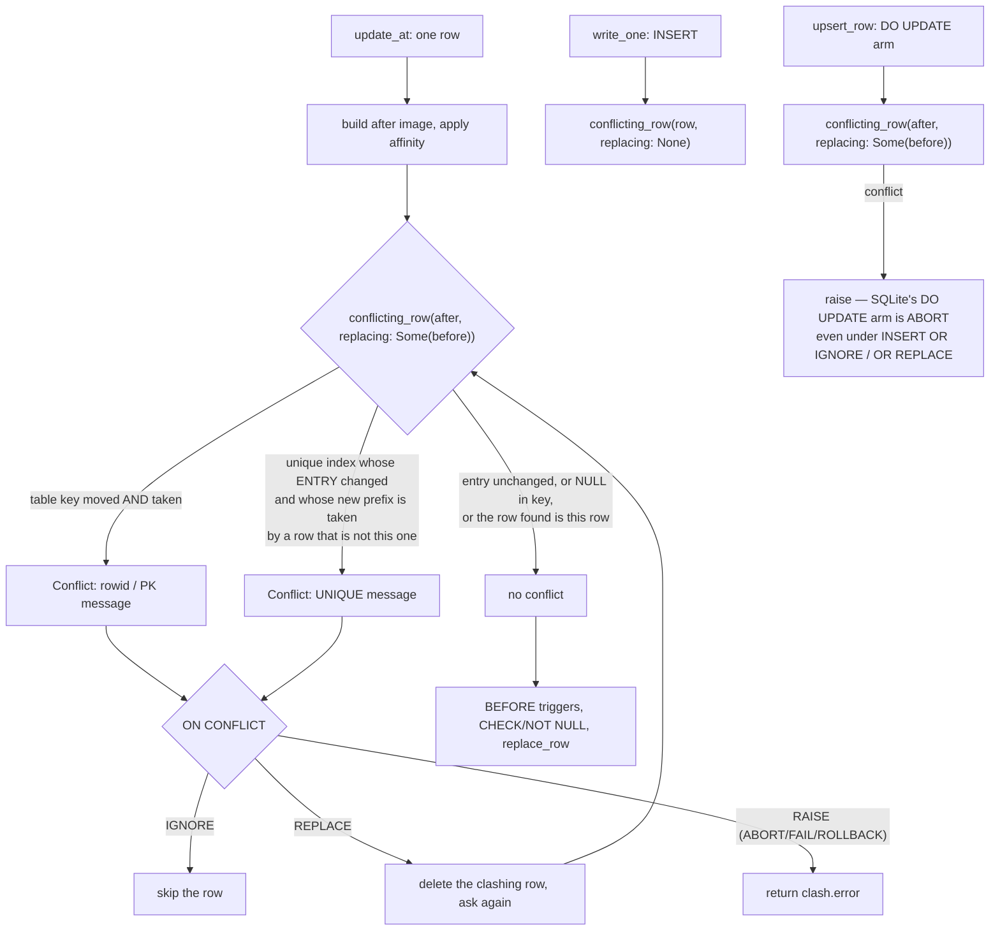

# task-1849 — An `UPDATE` that violates a secondary `UNIQUE` index is accepted, silently

> **Implemented and pushed as `5f77e5f`.** The plan below is what was built, with three additions the
> work turned up and a section at the end recording what was measured. The additions: a **third
> defect** in index-check *order* (we named the first-declared unique index where SQLite names the
> last, on `INSERT` as well as `UPDATE`); a **fourth** in `upsert_row`, whose unread path moved the
> table key with `place_row` and left the old row behind; and an interaction with task-1846's partial
> indexes that **neither ticket can test alone** and is handed to the merge.

## Introduction

`UPDATE` in `inillucent-exec`'s `dml.rs` checks uniqueness only when the *table's own key* moves.
Every other unique index is skipped, so an `UPDATE` that moves a row onto another row's key in a
secondary `UNIQUE` index is performed, answers success, and leaves the index holding two entries
under one key. The next reader gets the wrong number of rows and nothing anywhere reports a problem.

Probing the same code against the pinned SQLite 3.53.4 oracle found the **opposite** defect in the
same three lines: when the table key *does* move but the indexed columns do not,
`conflicting_row` finds the row's own index entry and refuses a perfectly legal statement. Both are
one bug — the check has no notion of "this row" — and both are closed by the same change.

## Goals and Non-Goals

**Goals**

1. `UPDATE` enforces every `UNIQUE` index the way SQLite does: single- and multi-column, inline
   `UNIQUE`, table-level `UNIQUE(...)`, the implicit index behind a non-integer `PRIMARY KEY`, and
   the `PRIMARY KEY` of a `WITHOUT ROWID` table.
2. A row never collides with itself, in either direction — neither when the key moves and the index
   entry does not, nor when the index entry moves and the key does not.
3. `OR IGNORE`, `OR REPLACE`, `OR FAIL`, `OR ABORT` and `OR ROLLBACK` reach the same arms they
   already reach for a table-key collision, and `OR REPLACE` removes **every** row the new image
   collides with, not just the first.
4. `INSERT ... ON CONFLICT DO UPDATE`'s update arm gets the same check — it has the same hole.
5. The error message and extended code match SQLite's, including for a `WITHOUT ROWID` primary key,
   which currently reports `t.rowid` where SQLite names the key's columns.
6. An `UPDATE` that touches no indexed column pays nothing new.
7. `write.update.indexed`, `txn.large` and `txn.batched` stay inside the run-to-run spread on a
   medium `inillucent-fullgate`; the workspace suite is no worse than the pristine-HEAD baseline.

**Non-Goals**

- Partial (`CREATE INDEX ... WHERE`), expression and `WITHOUT ROWID` secondary indexes. All three
  are *refused* at `CREATE INDEX` on `main` (`semantics.rs`'s `index.partial`, `index.expr`,
  `without.rowid.index`), so no such index can exist for an `UPDATE` to violate. The design leaves
  the one place a predicate would be asked — beside the `distinct_prefix` test — so task-1846's
  `IndexExprs::holds` drops in without moving this code.
- The 19 pre-existing workspace failures task-1847 measured on a pristine HEAD worktree.
- `PRAGMA integrity_check` does not currently notice duplicate entries in a `UNIQUE` index; that is
  a separate gap and is recorded as a recommendation, not fixed here.

## Problem statement

`update_at` decides whether to check for a conflict with one test:

```rust
// Changing a key moves the row, so the uniqueness of the new key is an
// ordinary conflict check; leaving it alone is not, or every update
// would collide with the row it is updating.
if !same_key(&layout, &before, &after) {
    if let Some(clash) = conflicting_row(table, &layout, target, &after)? {
```

The comment is right about the table's own key and wrong about every other index. `conflicting_row`
already probes the table key **and** every `unique_indexes(table)`, so the guard is the defect: an
`UPDATE` that leaves the rowid alone never reaches the index probes at all, and one that moves the
rowid reaches them with no way to recognise the row it is moving.

Measured on `main` at `9d17ec0` against SQLite 3.53.4, whole scripts through both shells:

| shape | SQLite | inillucent |
|---|---|---|
| `UPDATE t SET a='x' WHERE b=2`, `UNIQUE(a)` | `UNIQUE constraint failed: t.a` | performs it, two rows share `'x'` |
| same, table has `a TEXT UNIQUE` | refuses | performs it |
| same, `UNIQUE(a,b)` two columns | refuses | performs it |
| same, `a TEXT PRIMARY KEY` (rowid table) | refuses | performs it |
| same, two separate unique indexes | refuses | performs it |
| `UPDATE OR IGNORE` on such a clash | skips the row | performs it |
| `UPDATE OR REPLACE` on such a clash | deletes the other row | performs it, keeps both |
| `UPDATE t SET a=a+1` over `1,2,3` | refuses at the first collision | renumbers all three |
| `INSERT ... ON CONFLICT(a) DO UPDATE SET b=...` onto a taken `b` | refuses | performs it |
| **`UPDATE t SET id=5 WHERE id=2`, `UNIQUE(a)` untouched** | **moves the row** | **refuses: `UNIQUE constraint failed: t.a`** |
| `WITHOUT ROWID` PK clash (INSERT or UPDATE) | `UNIQUE constraint failed: t.a` | `... failed: t.rowid` |

28 of 43 first-batch cases and 20 of 30 second-batch cases differ. The last two rows are why this is
not a one-word change: adding a probe without a self-test converts the silent accept into a false
refusal, and the false refusal is already shipping.

## Architectural Overview



## Components and Interfaces

### 1. `conflicting_row` learns which row is asking

`crates/inillucent-exec/src/dml.rs`. One function, not two, because an index an insert enforces and
an update forgets is exactly this ticket.

```rust
fn conflicting_row(
    table: &TableInfo,
    layout: &SourceLayout,
    target: &mut dyn WriteTarget,
    row: &[OwnedDatum],
    replacing: Option<&[OwnedDatum]>,   // the row's own before image, for an UPDATE
) -> DbResult<Option<Conflict>>
```

With `replacing = None` the behaviour is byte-for-byte today's, so `write_one`'s three call sites do
not change meaning. With `replacing = Some(before)`:

| step | rule | why |
|---|---|---|
| table key | probe only when `!same_key(layout, before, row)` | an update that leaves the rowid alone cannot collide with itself on the table key — today's reasoning, kept |
| each unique index | skip when `index_entry(before) == index_entry(after)` | the same test `place_row` uses to decide whether to touch an index; an `UPDATE` that changes no indexed column pays two entry builds and no probe |
| a found entry | ignore it when its rowid equals `key_of(layout, before)`, and keep looking at the remaining indexes | the row finding itself. Needed because a moved rowid changes the *entry* while leaving the *prefix* alone, and because a collation can make a changed value probe onto the row's own entry (`COLLATE NOCASE`, `'x'` → `'X'`) |

The self-test compares against the **before** image's key, not the after image's: when the rowid
moves, the entry still in the tree carries the old one.

### 2. `update_at` checks unconditionally, and `OR REPLACE` loops

The `if !same_key(...)` guard is deleted; the `ON CONFLICT` match moves up one level and is
re-asked after each `OR REPLACE` deletion, because a new image can collide with a different row on
each of two unique indexes and SQLite deletes both (`UPDATE OR REPLACE t SET a='x', b='q'` over
`('x','p',1),('y','q',2),('z','r',3)` answers `x|q|3` — one row left, not three).

The loop is bounded: each turn deletes one existing row, and there are finitely many.

### 3. `upsert_row` gets the same check

The `DO UPDATE` arm computes `after` from the row it collided with and then writes it, with no
uniqueness check at all. It gets `conflicting_row(..., Some(&before))` and raises on a conflict.
Raising is correct for every form: SQLite reports `UNIQUE constraint failed` for
`INSERT`, `INSERT OR IGNORE` and `INSERT OR REPLACE` alike when the `DO UPDATE` arm collides —
the arm's conflict algorithm is ABORT and the statement's `OR` clause does not reach it. Measured,
not assumed: `b2.upsert.or.ignore.prefix` and `b2.upsert.or.replace.prefix` both error in the
oracle.

The check is only reachable on the `needs_before` path, which is the path taken whenever the table
has any maintained index — i.e. whenever a secondary unique index exists.

### 4. `rowid_message` learns about `WITHOUT ROWID`

`crates/inillucent-sql/src/dml.rs`. For a `WITHOUT ROWID` table the table's own key *is* the primary
key, so the message names its columns and the code is `SQLITE_CONSTRAINT_PRIMARYKEY`, not
`SQLITE_CONSTRAINT_ROWID` and the word `rowid` — a column the table does not have. This is the same
message for `INSERT` and for `UPDATE`; both are wrong today.

## Data flows and risks

| risk | how it is handled |
|---|---|
| A false refusal replacing a silent accept | the self-test, plus 25 "must still be accepted" differential cases: no-op assignment, unchanged indexed column, moved rowid with the index untouched, `NULL`s (distinct from each other), a `NOCASE` row set to its own value in another case, `WHERE` matching nothing, `OR REPLACE` whose clash is the row itself |
| Cost on the write gate | the probe happens only for an index whose entry changed, which is the same predicate `place_row` uses to decide whether to write it; an `UPDATE` of a non-indexed column adds two entry builds and no tree work. Verified by re-running `inillucent-fullgate` at medium |
| Partial indexes later constraining fewer rows | the entry/prefix tests are one block; task-1846's `IndexExprs::holds` is a third condition in the same place |
| `OR REPLACE` deleting a row and then failing a `CHECK` | pre-existing ordering; SQLite raises on a `CHECK` under `OR REPLACE` too, so the statement aborts and the delete rolls back. Covered by a differential case |

## Alternatives considered

| option | why not |
|---|---|
| Drop the `same_key` guard and call `conflicting_row` unchanged | this is the one-word change, and it *ships the false refusal*: `UPDATE t SET id=5` with an untouched `UNIQUE(a)` starts failing. The measured oracle run is what rules it out |
| A second function, `update_conflict`, beside `conflicting_row` | two implementations of what uniqueness means, which is how the update path drifted from the insert path in the first place |
| Check after the write and undo | a constraint checked after the fact has already written the tree it was protecting; the file's own comment on `write_one` says so |
| Enforce uniqueness in `place_row` for everyone | it cannot: `place_row` is also how a legitimate `REPLACE` and a moved row are written, and it has no `ON CONFLICT` context |

## Testing strategy

Functional and differential, against the pinned oracle, in both directions.

1. **`crates/inillucent-compat/tests/dml_differential.rs`** — the ticket's script and its siblings as
   checked-in cases run through both shells and compared byte for byte, so an error message drift
   fails too. Cases: the ticket's repro; multi-column; inline `UNIQUE`; table-level `UNIQUE`; text
   `PRIMARY KEY`; two indexes; `OR IGNORE`/`OR REPLACE`/`OR FAIL`/`OR ROLLBACK`; multi-row
   `SET a=a+1`; `RETURNING`; `UPDATE ... FROM`; a `BEFORE` trigger; `WITHOUT ROWID` primary key on
   both `INSERT` and `UPDATE`; the `DO UPDATE` arm on a second index; and the accept-side cases
   above, each of which must keep answering as SQLite does.
2. **`semantics.rs`** — the ticket's own script as a named case, so the count in the README moves.
3. **Read-back after the write** — `SELECT count(*) FROM t WHERE a='x'` after the refused update,
   which is the reader the defect actually harmed.
4. **Gate** — `inillucent-fullgate` at medium, 30 rounds, before and after, comparing
   `write.update.indexed`, `txn.large` and `txn.batched` against the run-to-run spread.
5. **Regression floor** — `cargo test --workspace --no-fail-fast` before the change on the pristine
   tree and after, compared binary by binary rather than by total count.


## What was built, and what it measured

Delivered exactly as designed above, plus two defects the work surfaced.

**Third defect — the wrong constraint was named.** When a row collides on two unique indexes at once
only one can be reported, and SQLite reports the **last declared**: it links each new index onto the
head of the table's list, so a schema read back off disk walks in reverse declaration order. We
reported the first, on `INSERT` as well as `UPDATE`, so an application matching on
`UNIQUE constraint failed: t.b` got `t.a`. `unique_indexes` now yields newest first. It was not in
the ticket and was not visible from the repro; it surfaced because the new test asks for a collision
on two indexes at once.

**Fourth defect — the upsert arm moved a key and left the row.** `upsert_row`'s `needs_before = false`
path wrote the new image with `place_row(None, after)`, which is correct only if the key did not move.
`INSERT ... ON CONFLICT(a) DO UPDATE SET a = 9` over an `INTEGER PRIMARY KEY` therefore left both rows
in the table. Both paths now go through `replace_row`; the stand-in image carries the key the row is
moving *from*, which is all a removal needs, and that path has no index to maintain.

### The partial-index interaction, which is nobody's ticket alone

At `9ef6aee`/`9d17ec0` a partial index cannot be created — `CREATE INDEX ... WHERE` is refused by the
parser — so the boundary cases cannot be written from this commit at all. task-1846 **adds** the
partial forms. The interaction therefore exists only after the merge, and neither ticket can test it:

- The skip this ticket added (`index_entry(before) == index_entry(after)` → don't probe) is a sound
  proxy for "this row's claim on this index did not move" **only while every row is in every index**.
  A row that changes no indexed value but crosses the predicate boundary has an identical entry and a
  different claim: it is entering the index, and entering it can collide. 1846 measured exactly that —
  `CREATE UNIQUE INDEX up ON t(a) WHERE b > 5`, rows `('x',9)` and `('x',1)`, `UPDATE t SET b = 7
  WHERE b = 1` — and SQLite raises where the engine accepts.
- Its `place_row` compares **optional** entries (`Some(entry)` when the predicate holds, `None` when
  it does not), which answers the question directly rather than answering entry-equality and patching
  the predicate on beside it. Crossing in is `None` vs `Some` and crossing out `Some` vs `None`, so
  neither is skipped, while staying in and staying out compare equal and keep the optimisation. The
  same shape is the right one for the skip here.
- With 1846's in-loop `holds(position, row)` guard skipping an index before any probe, a differing
  predicate makes this skip a **fast path rather than a correctness boundary** — a better invariant
  than two places that both have to be right.
- One mechanical hazard: `unique_indexes` now yields reversed. If a `position` is enumerated over that
  iterator rather than being a true index into `table.indexes`, `holds` consults a different index's
  predicate — a plausible wrong answer rather than a crash.

### Measurements

| what | result |
|---|---|
| Oracle scripts, both shells, batch 1 | 15 → **39 of 43**; the 4 left are `OR ROLLBACK`, two statement-atomicity cases (task-1850) and the known `WITHOUT ROWID` `CREATE INDEX` refusal |
| batch 2 (siblings, accept side) | 10 → **30 of 30** |
| batch 3 (adjacent paths) | **28 of 35**; all 7 left reproduce with no secondary unique index (task-1850) |
| batch 4 (check order) | 2 → **9 of 9** |
| `new_engine_writes.rs` | 14/14, including a 15-statement campaign re-probing every index against its table after each statement |
| `semantics.rs` | 92 → **99 cases, 96 agreeing** |
| Workspace suite | failing-test set **byte-identical** to the pristine-HEAD baseline: the same 19 names |
| `inillucent-fullgate`, medium, 30 rounds | `write.update.indexed` 71.30/71.20 Mns vs a 67.72–72.50 baseline; `txn.batched` 264.7/265.5 vs 264.1–271.0; `txn.large` 756.9/776.6 kns vs 765.8–804.4; headline 3.80x/3.84x vs 3.86–3.95x |

A note on reading that gate, because the first pair nearly produced a wrong conclusion: a single
before/after pair came back at 803.7 k then 877.2 k on `txn.large`, which reads as a 9% regression
until the SQLite arm is checked and has moved with it. The box was ~7% slower for that stretch. Two
further after-runs land inside the baseline on every workload.

### Out of scope, filed rather than fixed

Both reproduce with **no secondary unique index at all**, so neither is this ticket's doing:

- **task-1850** — a statement that fails partway keeps the rows it already wrote, and `OR ROLLBACK`
  does not roll back. `FAIL` and `ABORT` are currently indistinguishable, and `ABORT` is what every
  unqualified statement gets. The worst shape of it is an `UPDATE OR REPLACE` that deletes the row in
  the way and then fails a `CHECK`: the failure *destroys* a row and reports an error, so nothing
  suggests looking.
- **task-1851** — `PRAGMA integrity_check` answered `ok` over the exact corruption this ticket's
  defect produced: a `UNIQUE` index holding two entries under one key.
