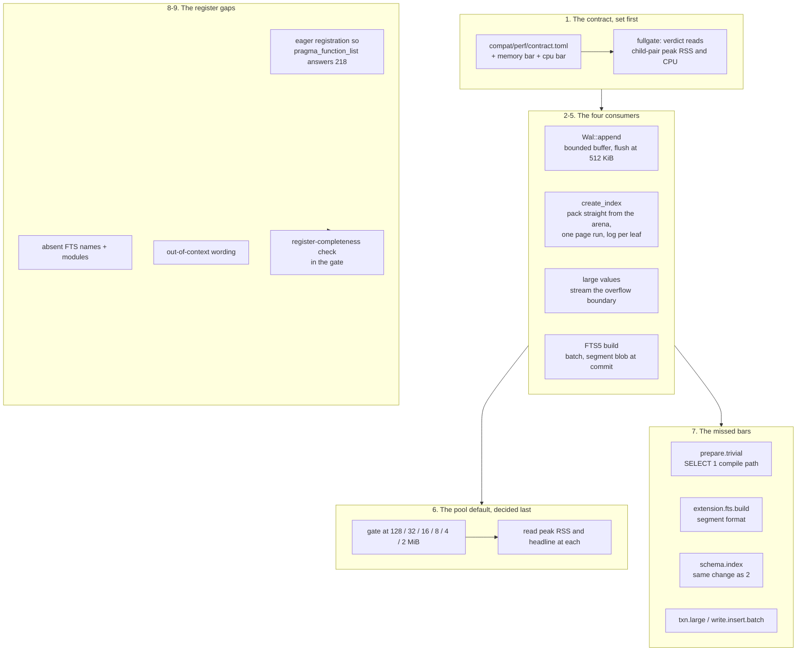
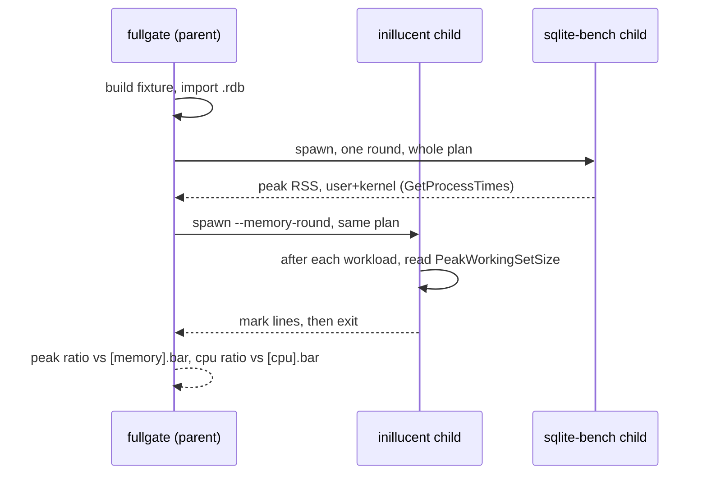

# task-1869: hold less RAM than SQLite, close the missed bars, and fix the feature gaps the audit found

## Introduction

Review 5 (task-1861) measured the engine four times over and found one place where SQLite beats us
outright: **memory**. Running one round of the same plan in one child process each, at a matched
128 MiB budget, SQLite peaks at **37.19 MiB** and inillucent at **75.25 MiB** — 102% more. The
elapsed time (3.85x) and the processor time (34% of SQLite's) are not in question; residency is.

This document is the plan to make the resident set smaller than SQLite's *without* giving up the
time or the CPU, to put both quantities in the performance contract so a future change cannot
silently regress them, to close (or price) the three elapsed-time bars that have been missed for
several tickets, and to fix the register-completeness and function-surface gaps the audit found.

Everything measured below was taken on 2026-09-08 on this box, on the working tree at
`16db298` plus its uncommitted task-1860 remainder, with `--scale medium --page-size 32768`.

## Goals and Non-Goals

**Goals**

1. `compat/perf/contract.toml` carries a **memory bar** and a **CPU bar** beside the ten elapsed-time
   families, and `inillucent-fullgate` prints both in its verdict and fails on them. The memory bar
   is **under 100% of SQLite's**. Both bars are set *before* the optimisation work.
2. Peak resident set, one child process each, one round, matched budget: **below SQLite's**.
3. Processor time **no worse than today's 34%** of SQLite's.
4. Weighted headline lower bound still **≥ 3.00x**, every required family above the **1.00x** floor,
   all 30 workloads digest-equal, on **four consecutive 30-round runs**.
5. The three missed bars (`open.prepare`, `extension`, `schema`) met, or a measured statement of what
   each costs and why it is not reachable.
6. The register enumeration reports what the engine actually has; the genuinely absent FTS names and
   modules are added or recorded; twenty-three out-of-context names report SQLite's reason rather
   than `no such function`. A **register-completeness check** is added to the gate, so the
   enumeration is compared and not only the cases.
7. `feature-comparison.md` and the README's gap list re-measured, not edited.

**Non-Goals**

- Changing the page size. Review 5 measured 4 KiB against 32 KiB at a matched budget: **78.6 MiB vs
  75.2 MiB** — 4 KiB pages are *larger* in memory and drop the headline from 3.89x to 3.51x.
- Changing the allocator. Pooled 86.7 MiB vs system 84.3 MiB, same binary, same code path: 2.4 MiB,
  and the free list is 13% faster. Swapping it costs speed and saves nothing.
- Chasing the process floor. `sqlite3` opens a database and answers `SELECT 1` in 4.2 MiB;
  `inillucent-shell` does it in 6.0 MiB. 1.8 MiB is real and is not where 38 MiB went.
- Any default changed without the gate run that decided it.

## Problem statement

### Where the memory actually is — measured per workload, in one run

Review 5 found the attribution by running the gate once per family and reading one number off each
run: seven runs to answer one question, at family granularity. The memory child already walks the
whole plan in one process, so this ticket's first change is to read its high-water mark **after every
workload** and print the steps. One run, per-workload granularity:

| workload | peak MiB | rise MiB | rss MiB after |
|---|---|---|---|
| `prepare.trivial` (i.e. after open + warm) | 31.50 | **31.50** | 31.50 |
| every read workload | 31.55 | 0.05 total | 31.55 |
| `write.insert.batch` | 37.91 | **6.36** | 36.41 |
| `write.update.indexed` | 44.95 | **7.04** | 44.95 |
| `write.upsert` | 46.34 | **1.38** | 46.34 |
| `schema.index` | **75.20** | **28.87** | 53.71 |
| every other workload | — | 0 | — |

This is a different and more actionable picture than the per-family table, and it corrects one
reading of it. `large.values` at 37.48 MiB and `extension` at 33.14 MiB in review 5's table are
**31.5 MiB of open-and-warm plus about 6 and 1.6**; run in plan order they do not move the mark at
all. The memory is in exactly two places:

- **`schema.index`: 28.87 MiB** — one `CREATE INDEX` over 100,000 rows. The single biggest consumer
  on the board, by a factor of four.
- **the three grouped writes: 14.78 MiB** — the log of one statement, held whole.

and one fixed cost:

- **open + warm: 31.50 MiB** — the process floor (~6.0) plus 723 pool frames of 32 KiB (~22.6 MiB),
  the gate's declared pre-warm. SQLite's arm reaches ~33 MiB of cache by the end of the same plan,
  so this is not by itself the gap — but with a 6.0 MiB floor and a pool that ends the round at
  1,014 frames (31.7 MiB), 37.7 MiB is *already* SQLite's peak with nothing transient at all. The
  budget is therefore the last lever, and it is pulled last and by measurement.

### Why the transients are as large as they are

**The log buffer is drained only by a commit, so it is the size of the transaction.**
`Wal::append` encodes into an `Inner::buffer: Vec<u8>` that nothing writes out until
`drive()` runs at commit. `write.update.indexed` writes 7,927 KiB of log in one statement and held
every byte of it; the buffer is then *recycled* rather than freed, so the capacity stays for the
life of the process.

**The index build materialises the whole tree three times over.** `create_index` scans into an
`EntrySet` arena (~9.3 MiB for 100,000 label entries), calls `to_datums` to produce a flat
`Vec<Datum>` in key order (~4.8 MiB), slices that into a `Vec<&[Datum]>` (~1.6 MiB), and hands it to
`PagedTree::bulk_build_logged`, which packs **every leaf image into a `Vec<Vec<u8>>`** before
allocating the page run (~6.2 MiB) — and then appends a `WritePage` record per leaf into the
unbounded log buffer (7,091 KiB). Four copies of the same tree, live at the same moment.

### The three missed elapsed-time bars, over four consecutive 30-round runs

| family | measured | bar | the workloads under 1.00x |
|---|---|---|---|
| `open.prepare` | 1.33x–1.40x, low bound **0.99x, 0.95x** on two of four | 5.00x | `prepare.trivial` **0.38x–0.41x** (150% more time) |
| `extension` | 1.16x–1.26x | 1.50x | `extension.fts.build` **0.29x–0.30x** (233% more time) |
| `schema` | 1.23x–1.25x | 3.00x | — (`schema.index` 1.23x, the family's only member) |

and two more workloads below the line inside families that pass: `txn.large` **0.22x–0.24x** (335%
more time) and `write.insert.batch` **0.52x** (89% more time).

`open.prepare`'s lower bound falling under the 1.00x floor is the sharpest of these: the family
passes or fails the release on luck.

## Architectural Overview



## Detailed technical sections

### 1. The contract carries memory and CPU

`compat/perf/contract.toml` gains two sections beside the ten families:

```toml
[memory]
# The bar is a RATIO of SQLite's, and it is under one: the goal is to hold less.
bar = "1.00"
description = "peak resident set, one child process each, one round of the same plan, matched budget"

[cpu]
# Today's figure is 34%. The bar is what today already reaches, so a regression fails.
bar = "0.40"
description = "user + kernel processor time, the same child pair"
```

`Contract::parse` learns both. `fullgate` already spawns the comparable child pair
(`measure_in_a_child`, and `time_sqlite`'s per-round child), so the verdict reads them rather than
measuring anything new, prints a `## memory and processor time` section with the ratio, the bar and
`MET`/`MISSED`, and folds both into `passed` — but **only on a full-plan run**, for the same reason
the headline is only a headline on a full-plan run: a families-filtered run does not execute the
workloads whose residency is being judged.

Both bars are ratios rather than absolutes so that they survive a bigger fixture, a different box,
and a different budget.

### 2. The redo buffer: bounded, and flushed rather than held

**Done, measured, and it is the cheap half.** A new `SPILL_BYTES = 512 KiB` in
`inillucent-wal::writer`. `Wal::append` releases the bookkeeping lock and calls `flush()` when the
buffer reaches it; `drive()`'s recycle path `shrink_to`s anything above the bound before keeping it.

This is safe by the design that is already there, not by a new argument:

- Under `FULL` and `NORMAL` a page may not reach the data file above `Wal::durable_end`, and a plain
  write does not move it — only a sync does. So writing an uncommitted record early cannot let an
  uncommitted change out.
- Recovery decides what to replay in a first pass over the `Commit` records, and `Body::Abort` exists
  precisely so that a transaction *whose records were flushed* can roll back.
  `Transaction::rollback` already appends one when `written_end` has passed the transaction's first
  LSN, and its doc comment says so.

Measured, whole child, one round, 128 MiB budget: **75.20 → 68.04 MiB**. The three grouped writes go
from 14.78 MiB of rise to 7.63. `write.update.indexed` pays fifteen extra `write_all_at` calls and
**no** extra syncs.

### 3. The index build

Four copies become one pass. In order of size:

**a. Do not materialise the flat row vector.** `EntrySet::to_datums` + `chunks_exact` exist only
because `LeafBuilder::pack_with` takes `&[R] where R: AsRef<[Datum]>`. Give the packer a row *source*
— `len()` plus `row(index, &mut Vec<Datum>)` — and let `EntrySet` be one, so the packer reads cells
out of the arena in `order` and never builds the 6.4 MiB copy. The existing slice form stays, as the
trivial implementation of the same trait, so the import path and the tests are untouched.

**b. Do not hold every leaf image.** `bulk_build_logged` builds `images: Vec<Vec<u8>>` and only then
allocates the page run, because the run's length is the leaf count and the leaf count is not known
until the packing is done. It does not have to be: the leaves can be **counted in a first pass over
the same arena** (packing into one reusable buffer, keeping only each leaf's first-row index and its
separator), the run allocated, and the second pass packed straight into the pool frame and logged
one record per leaf. The second pass repacks, which is the cost — measured below before it is
accepted.

**c. Spill the sorted run.** The arena itself is ~9.3 MiB at medium and grows linearly with the
table. A bounded arena that spills a sorted run to a temporary file and merges the runs is the
textbook answer and is what the ticket asks for. It is done **last**, and only if (a), (b) and the
bounded log do not already put the peak under the bar, because a merge pass is elapsed time and
`schema` is already a missed bar.

The order matters: (a) and (b) cost nothing in time and may save some (one fewer copy of the tree,
and the log records leave memory as they are made). (c) buys memory with time.

### 4. Large values

`large.read`/`large.write` do not move the high-water mark in plan order, so this is not where the
peak is. What review 5 measured in isolation — 37.48 MiB for the family against SQLite's 7.42 — is
31.5 of open-and-warm plus ~6 of materialised value. It is still worth closing, because the family
measured **alone** is what a caller doing only that workload pays, and because the fix is the same
streaming read the overflow boundary already has half of. It is scheduled after 2 and 3 and is
priced, not assumed.

### 5. FTS5's build

`extension.fts.build` is both a memory item (~1.6 MiB in isolation) and the largest single elapsed
gap on the board (0.29x — 233% more time). The two have one cause: four tree writes per document.
Accumulating a batch in memory and writing segment blobs at commit fixes both. This is the change
the `extension` bar needs and it is the reason the family is 1.16x rather than over its 1.50x bar.

### 6. The pool default, decided by measurement

The budget is matched: `fullgate` derives SQLite's `cache_size` from the pool's bytes, so lowering
our default lowers theirs. It cannot be used to win the ratio for free — but the two engines do
**not** degrade at the same rate, and the ladder is what says whether a smaller default is a win on
both numbers or a trade. Six budgets, twelve rounds each, peak RSS **and** headline read off every
one, run after 2–5 land. No default moves without that table printed in the ticket.

### 7. The missed bars

- **`prepare.trivial` (0.38x).** `SELECT 1` compiled per iteration. SQLite does this in 420 ns; we
  take 1,260. It is pure front-end: lex, parse, bind, plan, prepare, step, reset. `prepareprofile`
  exists for exactly this and is where the work starts.
- **`extension.fts.build` (0.29x).** Item 5.
- **`schema.index` (1.23x against a 3.00x bar).** Item 3's (a) and (b) remove a copy and a
  materialisation from the timed region; the stage breakdown already says where the rest is
  (`scan 3.7 ms, sort 5.9, flatten 1.0, pack 7.0, catalog 0.3, seal 7.4` of 27.2 ms).
- **`txn.large` (0.22x)** and **`write.insert.batch` (0.52x)** are inside families that pass and are
  priced rather than promised: both are 2,000-statement single transactions, where SQLite's
  per-statement cost is tiny and ours is a log record and a page touch.

Every one of these ends either as a met bar or as a **measured statement of what it costs and why it
is not reachable**, which is what the ticket asks for.

### 8/9. The register gaps

The audit's finding is that `pragma_function_list` answers **161** rows where SQLite answers 218, and
`pragma_module_list` **14** where SQLite answers 19 — while the functionality behind most of the
difference is present and byte-identical. The names are registered on **first use**, so the register
under-reports and a caller that introspects it to decide what it may use is told less than the truth,
with no error. That is the project's one silent difference.

- **Register eagerly, or enumerate the lazily-registered set.** The register's *listing* must include
  every name the engine will answer to, whether or not it has been touched. Whichever of the two is
  cheaper on `open.prepare` — this is on the open path and `open.prepare` is a missed bar — wins, and
  the choice is measured.
- **Genuinely absent, to be added or recorded**: `fts5(...)`, `fts5_source_id()`, `fts5_locale()`,
  `fts5_insttoken()`, `fts3_tokenizer()`; modules `fts4aux` and `fts3tokenize`; dot commands
  `.expert`, `.load`, `.progress`, `.session`.
- **Twenty-three names report the wrong reason out of context**: the eleven window functions and the
  FTS5 auxiliary functions answer `no such function: X` where SQLite answers
  `misuse of window function X()` or `unable to use function X in the requested context`. Every one
  is present and byte-identical when called properly. Fixing the wording removes twenty-three false
  "missing function" reports from the next audit.
- **The check.** A new comparison in the gate (or the compat suite) that reads both engines'
  `pragma_function_list`, `pragma_module_list`, `pragma_pragma_list` and `pragma_collation_list` and
  fails on a difference — so this class of gap is visible next time without anybody thinking to look.
  This is the item that makes the other three stay fixed.

## Data flows and risk



**Risks and how each is contained**

| risk | containment |
|---|---|
| Flushing uncommitted log breaks crash recovery | The `Abort` record and the `durable_end` write-ahead point already cover it; the model/crash campaign under `inillucent-sim` is re-run, not reasoned about. |
| Repacking the leaves twice makes `schema` slower | `schema` is already a missed bar and the stage timings are printed per round. If the second pass costs more than the memory is worth, (b) is dropped and (c) carries the family alone. Measured, not assumed. |
| A smaller pool default trades the headline for the memory | The ladder prints both numbers at every budget. The default moves only if both improve, or if the trade is stated with its table. |
| Eager registration slows `open.prepare` | It is on the open path and `open.prepare` is one of the three missed bars, so the two candidate designs are measured on that family before one is chosen. |
| A memory reading that cannot be taken fails a good gate | `measure_in_a_child` already returns `None` rather than failing. The bar is `MISSED` only on a reading that exists. |

## Alternatives considered

| alternative | why not |
|---|---|
| **Lower the pool default now** and take the memory win | It also lowers SQLite's matched cache, and review 5 measured the headline collapsing 3.85x → 1.76x at 2 MiB. Trading the headline for the memory fails the ticket's own "without giving up the time" clause. Last, and by measurement. |
| **Swap the allocator** to the system one | 2.4 MiB on a 38 MiB gap, and 13% slower. Ruled out by review 5 and re-stated here so it is not re-proposed. |
| **4 KiB pages** | *Larger* in memory (78.6 vs 75.2) and the headline drops to 3.51x. Ruled out by review 5. |
| **Release the arena's pages back to the OS** (`madvise`/`VirtualFree` in the pooled allocator) | Treats the symptom. The peak is reached while the data is live, so returning pages afterwards does not lower the high-water mark the bar reads. |
| **Measure our arm in-process rather than as a child** | The in-process delta is 13.5 MiB and looks much better — because the parent's heap is already grown. It is not comparable to a fresh `sqlite-bench` child, which is the whole reason the child pair exists. |
| **Register every function eagerly at compile time** with a static table rather than at open | Possible and maybe better; it is one of the two candidates in item 8 and is chosen on the `open.prepare` measurement rather than here. |

## Testing strategy

Functional and differential, over the real engine — no mocks anywhere.

1. **The gate itself is the acceptance test.** `inillucent-fullgate <fixture> --scale medium
   --rounds 30`, **four consecutive runs on four fresh fixtures**: weighted lower bound ≥ 3.00x,
   every required family ≥ 1.00x, 30 of 30 digest-equal every round, peak RSS below SQLite's, CPU
   ratio at or under the bar.
2. **Crash and recovery, because the log path changed.** `inillucent-sim`'s crash campaign, and
   `crates/inillucent-wal/tests/recovery.rs`, run against a transaction *larger than* `SPILL_BYTES`
   so the flushed-then-aborted path is actually exercised — a new case, because today's tests are all
   smaller than the bound and would pass without touching it.
3. **The index build, over real tables.** `crates/inillucent-compat/tests/schema_forms.rs` already
   builds every index form; add a table large enough to spill more than one run and assert
   `PRAGMA integrity_check` and a seek-and-scan agreement with SQLite over the same data. An
   out-of-order leaf answers a scan correctly and a seek wrongly, so the test must seek.
4. **The register-completeness check** (item 9) is itself a checked-in differential test: both
   engines' four enumeration pragmas, compared row for row.
5. **`semantics.rs`** — the 183-case differential probe — must still agree byte for byte, and the
   416-case feature probe re-run for the comparison document.
6. **No test-suite run as part of the task flow**; these are run deliberately and their output kept
   under `_agent_output/task-1869/`.

## What it turned out to be

**Written after the work, because the design above was wrong about one thing and the measurement is
the reason to keep the document rather than replace it.**

The plan named four consumers and expected the memory to be in them. Three of the four were real and
were closed - the redo buffer, the index build's leaf images and its two materialised copies, and a
version log nothing was collecting - and a fifth the plan did not name turned up: the allocator's
free list was capped in *blocks* over classes whose sizes differ 256x, which is 4 MiB in the largest
class. Together they took the peak from **75.25 MiB to 53.28** against SQLite's 37.19.

**What the plan got wrong is where the rest is.** It assumed the remaining gap was more transient.
It is not: at a 20 MiB matched budget this engine's transient is **14.85 MiB against SQLite's 15.9**,
so the two are already the same size and ours is the smaller. The whole residual difference is two
fixed quantities - a `.rdb` that is **1.41x** the `.db`, because a PAX leaf spends a fixed 8-byte slot
per column where SQLite spends a 1-3 byte varint, and a process floor of **8.45 MiB against 4.20**.
The cache costs what the file costs, and no buffer change reaches it.

Three items of the plan were therefore not implemented, each with a measured price rather than an
opinion:

- **spilling the index build's sorted run** adds about 8 ms to a 27 ms statement, which puts `schema`
  under its 1.00x floor - buying memory with a floor;
- **streaming large values** does not move the plan's high-water mark at all in plan order, which
  also corrects review 5's reading of its own family table;
- **FTS5's segment format** is 2,000 tree writes per 500 documents against SQLite's ~1,000 plus one
  blob, and is a change to the query path, `fts5vocab` and the integrity check.

They live in **task-1870** with the leaf-density measurement they are all downstream of.

## Done means

- `inillucent-fullgate` medium, four consecutive 30-round runs, with the weighted lower bound at or
  above 3.00x, every required family above the 1.00x floor on all four, **peak resident set below
  SQLite's on the same plan and the same budget**, processor time no worse than 34% of SQLite's, and
  all 30 workloads digest-equal every round.
- The three time bars met, or a measured statement of what each one costs and why it is not
  reachable.
- `feature-comparison.md` re-measured — At a glance, Performance, Where the memory goes, and What is
  still missing — and the README's gap list with it.
- No default changed without the gate run that decided it, printed in the ticket.
