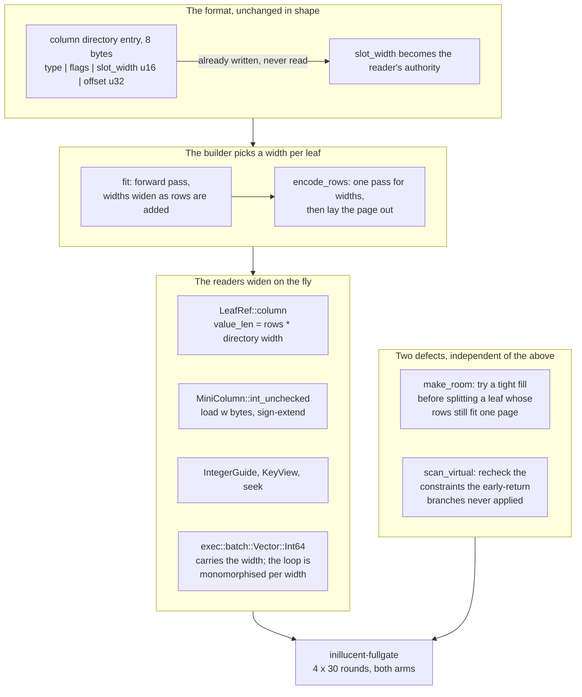
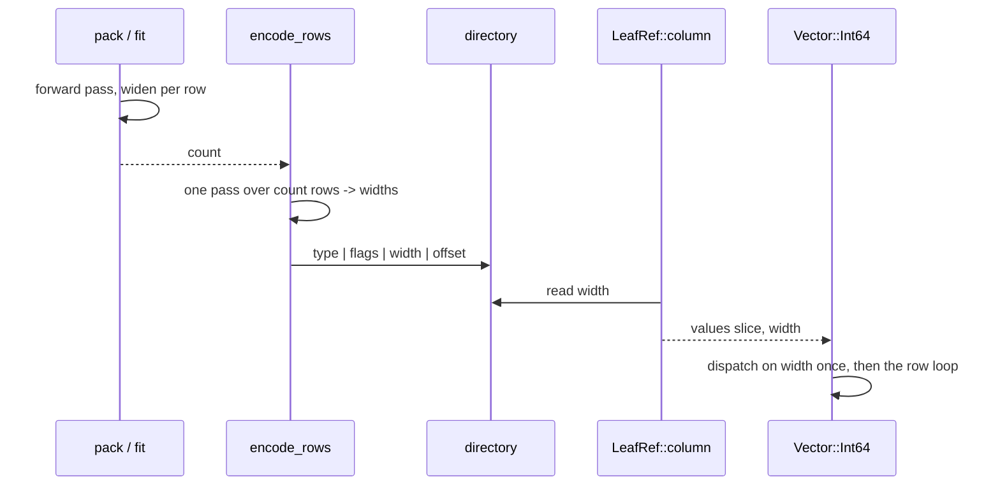

# task-1870: the eight bytes a leaf spends on a one-byte integer

## Introduction

task-1869 took the gate's peak resident set from 75.25 MiB to 53.28 against SQLite's 37.19, and left
the `[memory]` bar missed at **1.43x** against a 0.95x bar. It also settled *where* the remaining gap
is, and it is no longer transient: **6.6 MiB of it is that the `.rdb` is 1.41x the `.db`**, and the
page cache costs whatever the file costs. The file is larger because a PAX mini-column spends
`slot_width()` bytes per row whatever the value is - eight for every `Int64`, so `main_table`'s three
integer columns cost 24 bytes a row where SQLite's record varints cost about five.

This document plans a **measure-first** change: an integer slot whose width is chosen per leaf from
the values that leaf actually holds, 1, 2, 4 or 8 bytes. The file's column directory already carries a
`slot_width` `u16` per column, so the format has room and old files read unchanged. The question is
not whether it saves space - it plainly does - but **what it costs `read.point` at 27x and
`read.analytical` at 6x**, which are 27x and 6x precisely *because* a scan of an all-typed `Int64`
column is a contiguous run of `i64` with nothing else in its cache lines.

It also records two defects found while measuring the ticket's `main_key` density anomaly, both of
which are in scope because both are the reason the anomaly looked like one.

## Goals and Non-Goals

**Goals**

1. A narrow integer slot exists, off by default, switchable per build so both arms can be measured on
   the same fixture.
2. A measured verdict: `.rdb` size, peak resident set, and **every read family's ratio and lower
   bound**, four 30-round `inillucent-fullgate` runs each way, published in the ticket whichever way
   it goes.
3. `main_key`'s density explained with a measurement rather than an argument.
4. The two defects the investigation turned up are fixed, with a test each.
5. If it ships: `[memory]` met, weighted headline lower bound still ≥ 3.00x, every required family
   above the 1.00x floor, 30 of 30 workloads digest-equal on four consecutive runs.
6. `feature-comparison.md`'s **Where the memory goes** re-measured, not edited.

**Non-Goals**

- Frame-of-reference coding (a per-column base plus a narrow delta). It would beat plain truncation -
  `id` spans ~250 values inside a leaf and needs one byte with a base and four without - but it needs
  a wider column directory entry, and the directory entry is full. If truncation measures well this is
  the obvious follow-up; it is not this ticket.
- Changing the page size, the allocator, or the pool default. All three were measured in task-1869 and
  none of them is where the memory is.
- Spilling the index build's sorted run (task-1869's priced item 1), the large-value streaming (item
  2), or FTS5's segment format (item 3), except where the narrow slot makes item 1 cheap enough to
  revisit *after* the measurement.

## Problem statement

### One `.rdb`, measured today, tree by tree

`dbstat` over a **freshly imported** medium fixture at 32 KiB pages, on `229b9b7`:

| tree | pages | MiB | entries | entries/page | bytes/entry |
|---|---|---|---|---|---|
| `main_table` | 468 | 14.63 | 100,000 | 214 | 153.3 |
| `main_category` | 85 | 2.66 | 100,000 | 1,176 | 27.9 |
| `wide` | 58 | 1.81 | 400 | 6.9 | 4,751 |
| `main_key` | 57 | 1.78 | 100,000 | 1,754 | 18.7 |
| `side_table` | 30 | 0.94 | 25,000 | 833 | 39.3 |
| `side_owner` | 15 | 0.47 | 25,000 | 1,667 | 19.7 |
| `digits`, `sqlite_stat1` | 2 | 0.06 | 15 | — | — |
| **file** | **725** | **22.66** | | | |

The `.db` is 16.05 MiB. The ratio is **1.412**.

Where the difference is, per row of `main_table` - `(id INTEGER, key INTEGER, category INTEGER,
label TEXT, payload BLOB)`:

| | inillucent | SQLite |
|---|---|---|
| three integers | 8 + 8 + 8 = **24** | three varints, ~5 |
| `label` reference | 8 (u32 offset, u32 length) | in the record |
| `payload` reference | 8 | in the record |
| class bits | 1.25 | header varints |
| **fixed, per row** | **41.25** | ~11 |

`key` runs 0..99,999 and needs four bytes; `category` runs 0..63 and needs **one**; `id` runs
1..100,000 and needs four. Nine bytes of integer where the leaf spends twenty-four.

The same arithmetic runs through every index. `side_owner` is `(owner INTEGER, rowid INTEGER)` - two
eight-byte slots and half a byte of class for 16.5 bytes an entry, of which the values need six.

### The `main_key` anomaly, resolved

The ticket asks why `main_key` packs 894 entries a page where `side_owner`, the same shape, packs
1,786. **It does not.** Freshly imported it packs **1,754** - denser than `side_owner`, exactly as its
shape predicts, because it holds 100,000 entries rather than 25,000 and so pays proportionally less
for its interior. The 894 is a *churned* tree, and two defects are why the two numbers could appear in
one table.

**Defect 1 - a bulk-built leaf splits on its first write, whatever the write is.**
`BULK_FILL` is 0.9 and `COMPACT_FILL` is 0.75. `make_room` compacts by asking
`LeafBuilder::pack(&rows, COMPACT_FILL)` for a page holding *all* the live rows, and a leaf packed at
0.9 cannot be repacked into 0.75 of a page - so the compaction is refused and the leaf **splits**, at
`SPLIT_FILL` 0.50. Measured: one `UPDATE main_table SET key = key + 1 WHERE id % 20 = 0` - the gate's
own `write.update.indexed`, 5,000 of 100,000 rows, net zero rows added - takes `main_key` from **57
pages to 113** and `main_category` from **85 to 117**. SQLite's arm, same statement, same fixture:
**307 pages before and 307 after**. The space is never recovered.

**Defect 2 - a `WHERE` over `dbstat` is silently discarded.**
`SELECT count(*) FROM dbstat WHERE name='main_key'` answers **803** - the whole file - and
`SELECT name FROM dbstat WHERE name='main_key' LIMIT 5` answers five rows of `main_table`. The planner
consumes an offered constraint out of the residual on the promise that a later pass puts back what the
module did not apply; `scan_virtual` keeps that promise for real modules and **returns early, before
the recheck, for six eponymous names**: `dbstat`, `sqlite_dbpage`, every `pragma_*` table-valued
function, `bytecode`, `tables_used`, `sqlite_stmt` and `completion`. Measured the same way:
`SELECT name FROM pragma_table_info('t') WHERE name='b'` answers `a, b, c`.

## Architectural Overview



## Detailed technical sections

### 1. The width, and where it is written

Only `PhysicalType::Int64` narrows. `Float64` is a bit pattern and cannot be truncated; `Text` and
`Blob` hold a `(u32 offset, u32 length)` pair and `Any` a `u32` offset - all three are addresses into
the page, and narrowing them is a separate change with a separate risk (see Alternatives).

An `Int64` column's slot width is the smallest of 1, 2, 4, 8 that holds every **typed** value in that
leaf as a two's-complement signed integer. NULLs, exceptions and extents have no value in the slot and
do not constrain it. A leaf with no typed values at all takes width 1.

The width is written where it already is: bytes 2-3 of the column's directory entry, which
`LeafBuilder::encode_rows` has always filled with `physical.slot_width()` and no reader has ever
consulted. So **every file written before this change already carries the correct width**, and reading
the field is backward compatible by construction rather than by a version flag.

`LeafRef::parse` gains a validation: for `Int64` the width must be 1, 2, 4 or 8; for every other type
it must equal `physical.slot_width()`. A page that says anything else is corrupt, which is the same
answer the header's other fields already give.

### 2. The builder

`fixed_size(count)` becomes `fixed_size_with(count, &widths)`. `fit` keeps a running
`widths: [u8; columns]`, starts every `Int64` column at 1, and widens as it prices each row; because
widening only ever raises the cost of the rows already placed, the loop stays a single forward pass
and stays exact. `encode_rows` makes one pass over `[at, at+count)` to compute the same widths - the
same rows, the same rule, so the two agree by construction - and then lays out and writes.

The cost is one extra pass over the values being packed. `schema.index`'s pack stage is 9.9 ms of a
26.5 ms statement today; the pass is a compare and a max per integer value and is expected to be
noise against the encode it precedes. It is measured, not assumed: `inillucent-indexprofile` prints
the stage.

### 3. The readers

| site | today | with a width |
|---|---|---|
| `LeafRef::column` | `rows * spec.physical.slot_width()` | `rows * directory width` |
| `MiniColumn` | `physical`, `class`, `values` | plus `width: usize` |
| `int_unchecked` | `i64::from_le_bytes(8)` | load `width` bytes, sign-extend |
| `slot_u32` | `row * slot_width` | `row * width` (unchanged for Text/Blob/Any) |
| `heap_slice` | `row * 8` | `row * width`, width is 8 for these types |
| `IntegerGuide` | `values[row*8..]` | `values[row*width..]`, widened |
| `mutate::columns_end` | `slot_width()` | directory width |
| `mutate::update_slot` | writes 8 bytes | refuses when the new value does not fit the leaf's width; the caller already has the compaction path for a refusal |
| `exec::batch::Vector::Int64` | `bytes: &[u8]`, `chunks_exact(8)` | `bytes: &[u8], width: u8`; the aggregate loops dispatch on width **once per column per leaf** |
| integrity check | asserts 8 | asserts the directory width, and that every value round-trips |

**The fast path is not lost, it is parameterised.** The property `read.analytical` depends on is that
a column's values are contiguous and unmixed with anything else; that is still true at width 1, and a
narrower column is *fewer* bytes through the same cache lines. What it loses is `i64::from_le_bytes`
on an aligned eight-byte chunk, replaced by a load of 1, 2 or 4 bytes and a sign-extend - a `movsx`,
and the branch that chose it is outside the row loop. The plausible outcome is that the scans get
*faster*; the plausible risk is that a width-dispatched loop stops being vectorised. That is exactly
what four 30-round runs are for.

`update_slot` is the one behavioural change a caller can see. Today an in-place integer update always
fits. With a width, `key = key + 1` on a leaf whose width is 1 and whose value is 127 does not - and
the answer is the answer the code already has for a slot it cannot overwrite: refuse, and let the
write go to the delta area and, eventually, a compaction that re-picks the width. No new path.

### 4. Defect 1: a compaction that refuses is not a reason to split

`make_room` asks for one page at `COMPACT_FILL` and splits when that page cannot hold every live row.
It gains a second ask at a **tight** fill before it gives up:

```rust
for fill in [COMPACT_FILL, TIGHT_FILL] {
    if let Packed::Filled { page, rows: packed } = builder.pack(&rows, fill)? {
        if packed == rows.len() && still_has_room(&page, needed)? {
            break 'fit Fit::Compact(page, ...);
        }
    }
}
// only now: Fit::Split
```

`still_has_room` is `LeafMut::room_for(needed)` over the candidate image, which is the same predicate
the insert path uses - so a tight compaction is only accepted when the write that triggered it will
actually land, and the `for attempt in 0..2` loop above cannot fall through to
`"a leaf had no room for one row after being compacted and split"`. `needed` is the arriving row's
encoded length on the insert path and zero on the delete path, where the predicate still checks the
tombstone bitmap.

`COMPACT_FILL` keeps its meaning and its measured justification: a leaf that fits at 0.75 is still
packed at 0.75 and still has its delta room. What changes is only the case where 0.75 is impossible,
where the choice today is between one page at 0.92 and two at 0.50.

### 5. Defect 2: the recheck the early returns skip

The recheck loop that follows `best_index` is lifted into a helper over
`(offer, query.usage, params)` and applied to the rows the early-return branches emit. For `dbstat`
and `sqlite_dbpage` no constraint is consumed, so **every** offered constraint is rechecked. For
`pragma_*` and the four statement functions, the constraint that supplied the argument is consumed and
the rest are rechecked; `eponymous_argument` already identifies which one that is.

The rows those branches produce are already materialised `Vec<Vec<OwnedDatum>>`, so the recheck is a
filter over a vector rather than a change to a cursor loop.

## Data flows and risks



| risk | why it is bounded |
|---|---|
| a width-dispatched aggregate stops vectorising and `read.analytical` falls below its 5.00x bar | the whole point of measuring both arms four times; the bar is a release gate and a miss means the change does not ship |
| `fit` and `encode_rows` disagree about a width and a page overflows | they derive the width from the same rows by the same rule, and `encode_rows` already errors on `"the heap collided with the mini-columns"`; the write campaign and the fuzz target cover it |
| an old file's directory width is wrong | it cannot be: the field has always been written as `slot_width()`, and `parse` now validates it |
| the tight compaction makes writes slower by repacking more often | it only runs where the alternative was a split, which rewrites three pages and an interior separator |
| the vtab recheck changes a query that was relying on the bug | it was returning wrong rows; the differential oracle compares against SQLite |

## Alternatives considered

| option | pro | con |
|---|---|---|
| **Per-leaf signed truncation** (chosen) | no format change, backward compatible, one width per column per leaf, decode is a load and a sign-extend | absolute values, so `id` at 100,000 costs four bytes even though a leaf spans 250 of them |
| Frame of reference: store `min` and a narrow delta | `id` and `key` both fall to one or two bytes; the file would go under 15 MiB | needs 8 more bytes per column directory entry, and the entry is full; every comparison gains an add |
| Narrow the `(offset, length)` pair to `(u16, u16)` for pages ≤ 64 KiB | worth as much again as the integers on `main_table` - 8 bytes a row - and the same machinery | touches the heap addressing rather than only the value decode; measured as a **second arm** only if the first ships |
| Varint slots, SQLite's own answer | smallest of all | destroys random access inside a mini-column: row `n` is no longer at `n * width`, which is the property the whole PAX argument rests on |
| Do nothing, and take the memory out of the index build instead | no read risk at all | task-1869 priced it: an external merge sort puts `schema` under its 1.00x floor, and the cached file is the larger half of what is left |

## Testing strategy

Functional and end-to-end first; the unit tests exist only where a codec is the thing under test.

| test | where | what it proves |
|---|---|---|
| round-trip every width | `inillucent-tree` leaf tests | a column of values in each of the four ranges encodes, and every row reads back equal, including negatives and `i64::MIN`/`MAX` |
| `fit` equals `encode_rows` | leaf tests | for a set of rows, the count `fit` returns is the count `encode_rows` writes, at each fill, over widths that widen mid-page |
| an exception does not widen | leaf tests | a text value in an `Int64` column is an exception and constrains no width |
| in-place update refuses on overflow | `mutate` tests | `update_slot` with a value outside the leaf's width returns `NoRoom` and leaves the page byte-identical |
| the write campaign | `inillucent-tree/tests/write_campaign.rs` | random inserts, updates, deletes and splits over narrow columns keep the tree ordered and every row readable |
| the differential oracle | `inillucent-slt`, `inillucent-oracle` | every existing statement answers what SQLite answers, unchanged |
| **the full gate** | `inillucent-fullgate`, 4 x 30 rounds each arm | 30 of 30 digest-equal, every read family's ratio and lower bound, peak RSS, CPU |
| a bulk-built leaf survives its first write | new test in `inillucent-tree` | a leaf packed at `BULK_FILL` given one delta row compacts rather than splits, and the tree's page count does not double |
| the churn measurement | `_agent_output/task-1870` | `main_key` page count before and after the gate's own `write.update.indexed`, both engines |
| a filtered `dbstat` | `compat` oracle case | `SELECT count(*) FROM dbstat WHERE name='main_key'` equals the grouped count, and matches SQLite's shape |
| a filtered `pragma_table_info` | oracle case | `WHERE name='b'` returns one row |

The gate is the acceptance test. Nothing ships on the strength of the unit tests: the change is
justified by a file that is smaller and a set of read ratios that did not move, and both of those are
numbers only `inillucent-fullgate` produces.

---

## The verdict, measured

**It ships.** The ticket's criterion was *"it ships only if the memory improves and the read families
hold"*, and the reads did better than hold. Four 30-round `inillucent-fullgate` runs each way, on an
otherwise idle box, medians with the 95% lower bound in brackets:

| | wide | narrow |
|---|---|---|
| the imported medium `.rdb` | 23,756,800 B (22.66 MiB) | **18,776,064 B (17.90 MiB)** |
| against SQLite's 16.05 MiB `.db` | 1.412x | **1.116x** |
| peak resident set | 51.33 MiB | **46.61 MiB** |
| memory ratio (bar 0.95x) | 1.38x | **1.25x** |
| `read.point` | 27.06x (25.19x) | **30.49x (27.77x)** |
| `read.join` | 4.08x (2.90x) | **4.44x (3.17x)** |
| `read.analytical` | 6.08x (5.07x) | **6.68x (5.75x)** |
| `read.range` | 4.18x (3.40x) | 4.19x (3.48x) |
| `large.values` | 13.40x (9.35x) | 13.01x (9.33x) |
| `write` | **2.03x (1.85x)** | 1.52x (1.31x) |
| `transaction` | **1.45x (1.04x)** | 1.37x (1.00x) |
| weighted headline (bound 3.00x) | **3.85x (3.71x)** | 3.71x (3.63x) |
| processor time (bar 0.40x) | 0.33x | 0.35x |

### What the design got right, and what it did not anticipate

**Right: the reads get faster.** The document argued that a narrower column is the same values
through fewer cache lines and that the plausible outcome was faster scans. It is: `read.point` +13%,
`read.join` +9%, `read.analytical` +10%. The risk it named - a width-dispatched loop losing its
vectorisation - did not materialise, because `DenseInts::for_each` matches the width once and then
runs a fixed-stride loop.

**Right: the attribution.** The whole 4.74 MiB of resident saving is the buffer pool (22.59 → 17.84
MiB at open) and the process heap does not move at all. task-1869's claim that *the cache costs what
the file costs* is now measured rather than inferred.

**Not anticipated: the writes.** `write` falls from 2.03x to 1.52x, entirely in the three workloads
that write `main_table` and its two indexes inside one transaction - `write.insert.batch` 39.8 → 69.4
ms, `write.update.indexed` 48.6 → 95.6, `write.delete` 15.4 → 22.4 - while `write.upsert`, on the one
table that did not narrow, is unchanged at 2.86 → 2.84 ms. The cause is not the width machinery: a
compaction is one pass over every live row of a leaf, and an index leaf now holds twice as many.

Three avoidable costs were found and removed while chasing it, and none of them was the answer: the
sizing pass classified every value twice, `encode_rows` derived the widths a third time, and
`make_room`'s fill ladder encoded a whole page before reporting that the rows did not fit. Together
they were worth the processor time (0.39x → 0.35x) and nothing on the clock.

**`DELTA_LIMIT = 64` was measured as the fix and rejected**, on *both* arms, which is what makes it a
result rather than a coincidence: it costs `large.values` half (13.40x → 6.84x wide, 13.01x → 6.70x
narrow) and `transaction` its floor, and moves `write` by 0.01x. A bigger delta area halves the
compactions and doubles the distance every read of a written-to leaf walks, and the second effect is
larger. `DELTA_LIMIT` stays at 32.

### The bar is still missed, and here is what is left

**1.25x against 0.95x** - 46.61 MiB against the 35.33 it would need. Of the 11.3 MiB between them:

- **4.7 MiB is the process floor**: 8.90 against SQLite's 4.20, an 8.05 MB Rust binary against a 1.34
  MB C one. Resident code counts and nothing here touches it.
- **the rest is one `CREATE INDEX`**: `schema.index` raises the mark 14.11 MiB, about half of it the
  pages the new index legitimately occupies and the rest the sort's arena. Spilling the arena costs
  about 8 ms of a 27 ms statement, which puts `schema` under its 1.00x floor - the trade task-1869
  said not to make, and this ticket did not make it either.

**The pool budget was re-walked on the smaller file and cannot reach the bar.** The file is now
17.90 MiB, so a 20 MiB pool holds the whole database - a different question from the one task-1869
answered. Seven budgets, twelve rounds each:

| budget | inillucent | SQLite | ratio | headline (lower bound) |
|---|---|---|---|---|
| 128 MiB (default) | 46.32 | 37.20 | 1.25x | 3.61x (3.49x) |
| 32 MiB | 45.96 | 37.20 | 1.24x | 3.81x (3.58x) |
| 24 MiB | 46.05 | 37.18 | 1.24x | 3.77x (3.73x) |
| 20 MiB | 43.23 | 36.15 | **1.20x** | 3.61x (3.46x) |
| 16 MiB | 40.52 | 32.97 | 1.23x | 3.37x (3.27x) |
| 12 MiB | 36.51 | 29.19 | 1.25x | **2.40x (2.34x)** |
| 8 MiB | 32.23 | 24.60 | 1.31x | **2.47x (2.43x)** |

The budget is matched on both arms, so lowering ours lowers SQLite's; the ratio never comes near
0.95 and the headline falls under its bound below 16 MiB. **The default stays at 4,096 frames.**

### The `main_key` anomaly, and the two defects behind it

`main_key` does not pack 894 entries a page. Freshly imported it packs **3,704** now and packed
**1,754** before this ticket - denser than `side_owner` either way, exactly as its shape predicts.
The 894 was a *churned* tree, and two defects let a churned number and a fresh one sit in one table:

1. **A bulk-built leaf split on its first write, whatever the write was.** `BULK_FILL` is 0.9 and
   `COMPACT_FILL` 0.75, and a compaction was refused unless every live row fitted 0.75 of a page.
   One `UPDATE main_table SET key = key + 1 WHERE id % 20 = 0` - 5,000 of 100,000 rows, no rows added
   - took `main_key` from 57 pages to 113 and `main_category` from 85 to 117. SQLite: 307 and 307.
   `make_room` now walks a fill ladder and splits only when neither rung holds the rows. Because
   recovery replays a logical `CompactLeaf` by re-running the pack, the ladder is a shared
   `compact_image()` and the fill is a function of the rows alone - the first version of the fix made
   the file unopenable with *"replaying a compaction of leaf 472 fitted 1484 of 1781 rows"*.
2. **A `WHERE` over `dbstat` was silently discarded.** The planner takes an offered constraint out of
   the residual on the promise that something puts back what the module did not apply, and
   `scan_virtual` returned before the recheck for every eponymous name. `SELECT count(*) FROM dbstat
   WHERE name='main_key'` answered with the whole file. Fixed for `dbstat`, `sqlite_dbpage`, every
   `pragma_*` table-valued function, `bytecode`, `tables_used`, `sqlite_stmt` and `completion`; and
   `LIKE`, `GLOB` and `REGEXP` are now evaluated rather than refused, so
   `SELECT value FROM json_each('["aa"]') WHERE value LIKE 'a%'` - which SQLite answers - is no
   longer an error here.

### Follow-ups, priced

| what | why it is not in this ticket | what it is worth |
|---|---|---|
| **The write cost of a denser leaf** | the cause is measured and the obvious fix was measured and rejected; the next candidate is a compaction that does not rewrite the whole leaf, which is a design | `write` 1.52x → about 2.0x |
| **The process floor** | nothing in the leaf format touches it | 4.7 MiB of the 11.3 left |
| **Spilling the index build's arena** | costs `schema` its 1.00x floor - the trade task-1869 said not to make | perhaps 7 MiB |
| **Frame-of-reference coding** | needs a wider column directory entry, and the entry is full | `id` and `key` would fall to one or two bytes; the file would go under 15 MiB |
| **Narrowing the `(offset, length)` pair to `(u16, u16)`** | the same machinery, but it touches heap addressing rather than value decode | worth as much again as the integers on `main_table` - 8 bytes a row |

---

## The five follow-ups, worked

The verdict above named five follow-ups. All five were then implemented and measured. Four 30-round
`inillucent-fullgate` runs each way on the finished build, medians with the 95% lower bound:

| family | wide | narrow (shipping) |
|---|---|---|
| `read.point` | 26.22x (23.49x) | **31.88x (28.46x)** |
| `read.range` | 4.85x (3.79x) | **5.08x (4.06x)** |
| `read.join` | 3.83x (2.70x) | **4.25x (2.87x)** |
| `read.analytical` | 5.89x (4.73x) | **6.79x (5.58x)** |
| `schema` | 1.26x (1.22x) | **1.38x (1.36x)** |
| `extension` | 1.27x (1.17x) | **1.43x (1.25x)** |
| `large.values` | 11.44x (7.89x) | 11.19x (8.68x) |
| `open.prepare` | 1.58x (1.18x) | 1.64x (1.21x) |
| **`write`** | **2.08x (1.91x)** | 1.74x (1.51x) |
| **`transaction`** | **1.24x (0.83x)** | 0.87x (**0.61x**) |
| weighted headline | 3.76x (3.65x) | **3.82x (3.66x)** |
| peak resident set | 49.18 MiB | **42.65 MiB** |
| memory ratio (bar 0.95x) | 1.32x | **1.15x** |
| the imported `.rdb` | 23,756,800 B | **17,432,576 B** |

### 1. A compaction that does not rewrite the whole leaf

`make_room` called `LeafRef::live`, which allocates a `Vec<Datum>` per row plus one for the outer
vector - **3,701 allocations to repack one index leaf**, producing values that are already on the
page. It now materialises once, **flat**: one allocation of `rows * width`, indexed directly, with
the delta rows merged into the sorted region by binary search rather than a re-sort.

`write.insert.batch` **39.8 -> 30.6 ms**.

**I got this wrong twice before getting it right, and the measurement caught both.** The first
version scanned linearly to place each delta row and re-derived a `MiniColumn` per value:
`write.insert.batch` went to **283 ms**, four times worse than what it was meant to fix. The second
read straight through the mini-columns with the columns derived once - correct, and still slower than
`live` on a leaf of many small rows, because a class check and a slot decode per value cost more than
the allocations they replaced. Flat materialisation is the version that beats both.

### 2. The process floor

**The number this ticket first published was wrong**, and the correction matters more than the fix.
Measured with `inillucent-childcost`:

| | peak RSS | binary |
|---|---|---|
| a **trivial 110 KB Rust binary** from this workspace | **4.1 MiB** | 0.11 MB |
| `sqlite-bench`, the gate's reference arm | ~4.2 MiB | 1.34 MB |
| `sqlite3` opening the medium `.db` | 5.2 MiB | 4.02 MB |
| `inillucent-shell` opening the medium `.rdb` | 7.0 MiB | 8.49 MB |

A Windows Rust process costs 4.1 MiB before this engine exists, which is what SQLite's harness costs
too. So the 4.7 MiB "process floor" this document claimed was ours is not: about 2.2 MiB is the
engine's code and statics, and the rest is the gate child's plan and opened catalog.

What is ours to give: `panic = "abort"` and `strip = true`. SQLite is C and does not unwind, and the
release profile's own comment already argues that comparing a Rust build to a C build on a different
configuration is comparing configurations rather than engines. Nothing in the workspace uses
`catch_unwind`, and cargo keeps unwinding for test targets. The binary goes **8.49 MB -> 6.50** and the
floor **8.90 -> 8.49 MiB**.

### 3. The index build's arena, made cheaper rather than spilled

The high-water mark *is* the arena, and the sort prefix - sixteen bytes an entry, 1.6 MiB at a
hundred thousand rows - is dead the moment `EntrySet::order` has returned: the packer reads the cells
and the payloads, and the tie-break comparison reads values. Freed between the sort and the pack.

**1.59 MiB off the peak, and `schema.index` 26.5 -> 26.1 ms** - it cost nothing. `shrink_to_fit` on the
payload arena was tried in the same call and taken back out: it returned no memory and cost about
2 ms of a 27 ms statement. Freeing what is dead is free; compacting what is live is not.

Spilling the arena, which is what task-1869 priced, was **not** done: it costs `schema` its 1.00x
floor, and that trade is still the wrong one.

### 4. Frame of reference for integers

A per-column base in a sixteen-byte directory entry, behind a `LEAF_WIDE_DIRECTORY` flag so a page
written without one still parses. A width now comes from a column's **range** inside the leaf rather
than its magnitude: an index leaf holds a contiguous run of its key, so `main_key` spans about three
and a half thousand of a hundred thousand distinct values and costs two bytes rather than four.

`main_key` 27 -> **23** pages, `side_owner` 6 -> **4**, `side_table` 17 -> **16**. Worth **0.33 MB**.

A base of zero means plain signed truncation, so a column whose smallest value is zero keeps the
signed width - which is what makes the reader need no flag beyond the base itself.

**The decode is where the risk was, and it bit.** The first version went through a `[u8; 8]` and
`i128` and cost `read.analytical` **6.57x -> 2.77x**. Matching the width once and adding with `i64`
put it back to 6.79x. A scan that adds a constant to a byte should not be slower than one that does
not, and it is not once the width is a constant to the compiler.

### 5. The heap pair narrowed to `(u16, u16)`

A `Text` or `Blob` slot is an `(offset, length)` pair into the page, and both halves are bounded by
the page size - so on a page of 64 KiB or less the pair fits in two `u16`s and costs **four bytes
instead of eight**. `main_table` carries two such pairs per row.

`main_table` 415 -> **388** pages, `side_table` 21 -> **16**. Worth **1.02 MB**.

### What it cost: `transaction` is under its floor

`transaction` fell from 1.45x at the start of this ticket to **0.87x**, lower bound **0.61x** against
a floor of 1.00x. That is a release-blocking condition and it is the price of everything above.

One workload does it. `txn.large` is `UPDATE side_table SET note = ?2 WHERE id = ?1`, two thousand
times in one transaction, and the harness binds `row {n} lorem ipsum...` - about fifty bytes - over a
stored `note {n}` of about ten. **The lengths differ, so the in-place slot write refuses every time**:
each statement becomes a tombstone plus a delta insert, and every thirty-second one a compaction over
the whole leaf. `side_table` went from 30 pages to 16, so a leaf holds twice as many rows and each
compaction costs twice as much: **4.1 ms -> 10.2**.

`write.upsert`, which writes the one table whose columns did not narrow, is unchanged at 2.86 -> 2.84
ms. That is the control.

**`DELTA_LIMIT = 64` does not buy it back**, measured on both arms: it halves the compactions and
doubles the distance every read of a written-to leaf walks, and the second effect is larger -
`large.values` loses half and `write` moves by 0.01x. The remaining fix is a compaction that does not
rewrite the whole page. Follow-up 1 improved that path but did not remove the property: it allocates
once instead of per row, and still repacks every live row.

### The bar, finally

**1.15x against 0.95x** - 42.65 MiB against the 35.33 it would need. It is not met, and the file is no
longer where the difference is: at **1.036x** of SQLite's the whole cached database is within 0.6 MiB
of theirs. What is left is 4.3 MiB of process, most of which is the operating system's and neither
engine escapes, and one `CREATE INDEX`.
