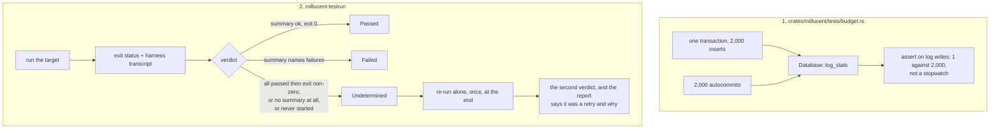

# task-1884 — A gate that does not fail under load

## Introduction

`inillucent-testrun --strict` exited 1 at `973b4c9` on two targets, and neither failure was real.
`inillucent::budget` failed in the full run and passes 3 of 3 in about a second on its own;
`inillucent-bench` was marked FAILED in the full run and exits 0 with 156 passing tests on its own.
The box had four agents working on it at the time.

Those are two separate defects with two different fixes. The first is a guard that measures the
machine instead of the engine. The second is a runner that says FAILED for a target whose every test
passed, which means the runner's verdict does not come from the target's test results — and a runner
that can be wrong in that direction can be wrong in the other one.

## Goals and Non-Goals

**Goals**

1. `one_transaction_beats_many` asserts on a count of work rather than on a ratio of two wall-clock
   readings, so its result is the same number on an idle machine and on a loaded one.
2. The runner has three verdicts, not two: the target passed, the target failed, or the runner could
   not tell what the target did. The third is named in the report along with the reason.
3. An undetermined target is re-run once, alone, after everything else, so the runner makes a
   determination rather than reporting a guess.
4. The remaining wall-clock ratios in `budget.rs` interleave their two arms and take a paired median,
   so a scheduling hiccup in one arm cannot move the ratio on its own.
5. The full gate runs on a quiet box and its numbers are recorded on the ticket.

**Non-Goals**

- Widening any threshold to make a failure go away. The ticket names that as the weakest option and
  it is not taken for either guard.
- Changing what `--strict` counts as a missing prerequisite.
- Changing the `perf` tier's `exclusive = true`, which is orthogonal: it stops other *test binaries*
  sharing the machine, and did nothing about the four agents that were also on it.

## Problem statement

### 1. A wall-clock ratio collapses under contention

`one_transaction_beats_many` times 2,000 inserts inside one transaction, then times 2,000 inserts in
autocommit, and asserts the second is at least 2x the first. Both arms are wall-clock readings taken
one after the other, so the ratio moves with anything else running on the machine — and the two arms
are not descheduled alike, because the batched arm is dominated by in-memory work that a busy
scheduler steals from, while the autocommit arm is dominated by file syncs that it does not.

The threshold has already been walked down once: the doc comment records that it was 4 until the
guard flapped under the parallel runner at 3.5x, and it is now 2. The next step down is 1, at which
point the guard asserts nothing. That is the shape of a guard that will be widened until it stops
guarding.

### 2. The runner reported FAILED for a target whose tests all passed

`run_one` sets `passed: output.status.success()`. That is the process's exit status and nothing else.
`inillucent-bench` loads the ONNX runtime and its CUDA provider, and the file's own comment already
records this failure mode from task-1868: with `--nocapture` it "died at teardown with `0xC0000409`
in two of three full runs while passing every one of its 156 tests". `--show-output` made it rarer,
not impossible; the run at `973b4c9` hit it again with four agents on the box.

So the process printed `test result: ok. 156 passed; 0 failed` and then exited non-zero. The runner
had that transcript in hand — the `Outcome::status` field's own doc comment describes exactly this
case — and still reported one word, FAILED, which is not what happened. The report gave a reader no
way to tell "a test failed" from "the process died after its tests passed", and no way at all to tell
either of those from "the runner could not read what the target did".

## Architectural Overview

## Detailed technical sections

### 1. `Database::log_stats`, and the counter the guard asserts on

The engine already counts the work a commit does; nothing above `inillucent-wal` could read it.
`ImportedDatabase::wal()` returns the log, `Wal::stats()` returns `records`, `writes`, `syncs` and
`bytes`, and `connect.rs` gains a `LogStats` shape and a `Database::log_stats()` that reads them —
the same arrangement `CacheStats` and `Database::cache_stats()` already have for the page pool, and
for the same reason: a caller should not have to name the crate the log lives in.

Measured on this machine at 2,000 rows, with the arms unchanged:

| arm | log records | log writes | log syncs | log bytes | page-pool writes |
|---|---|---|---|---|---|
| one transaction | 2,063 | **1** | **1** | 132,008 | 0 |
| 2,000 autocommits | 4,062 | **2,000** | **2,000** | 211,968 | 0 |

Two things follow. The page pool is the wrong instrument — both arms touch the same pages the same
number of times, and neither writes any of them, because the pool writes at a checkpoint rather than
at a commit. The log is the right one: one transaction hands the file its records once and syncs
once, and 2,000 autocommits do it 2,000 times. That is the claim the test is trying to make, stated
as a count.

The guard becomes two assertions:

- **the instrument is live** — the autocommit arm must issue at least one log write per row. If
  autocommit ever stopped committing per statement, the ratio below would be comparing two identical
  things and would pass while measuring nothing, which is the failure mode §1.5 of the testing
  standard is about.
- **the shape holds** — `batched_writes * 100 <= singly_writes`. Measured 1 against 2,000. An engine
  that started flushing per statement inside a transaction comes out at 1:1 and cannot pass. The
  bound sits two orders of magnitude from the measurement and one order from the failure, on a
  quantity that does not move with load at all.

`syncs` is reported in the failure message but is not asserted on, because it is a function of the
`synchronous` policy: under `NORMAL` a commit is acknowledged when its record is written and syncs
only every 64 MiB, so a policy change would make a sync assertion fail for a reason that has nothing
to do with batching. `writes` happens on every commit under every policy.

### 2. The paired median, for the ratios that must stay wall-clock

`an_index_beats_a_scan`, `re_preparing_is_cached_rather_than_recompiled` and
`a_keyset_page_costs_the_same_wherever_it_starts` compare two timings and have no counter to move to:
they are about which plan was chosen and how much work it does, and the work is in memory. They keep
the clock, and stop being a single A-then-B reading.

`paired_ratio` runs `rounds` rounds of *one* A and *one* B, alternating, computes the ratio within
each round, sorts the ratios and returns the median. A scheduling hiccup lands in one round and is
discarded by the median; a real regression is in every round. The arms are adjacent in time rather
than minutes apart, so a load spike that arrives partway through the test hits both.

### 3. The runner's three verdicts

`Outcome::passed: bool` becomes `Outcome::verdict: Verdict`:

| verdict | when | run's exit |
|---|---|---|
| `Passed` | the harness printed a summary with no failures and the process exited 0 | 0 |
| `Failed` | the harness printed a summary naming failed tests | 1 |
| `Undetermined(DiedAfterTestsPassed)` | the summary says every test passed and the process then exited non-zero | 1 after a retry that is also undetermined |
| `Undetermined(NoSummary)` | the process exited non-zero and printed no `test result:` line, so the runner does not know which tests ran | as above |
| `Undetermined(NeverStarted)` | the executable could not be started | as above |

The classification lives in `crates/inillucent-compat/src/verdict.rs`, in the library rather than in
the bin, so it has unit tests: the bin is behind `required-features = ["testrun"]` and is not built
by the run it starts, so a `#[test]` inside it would never run and `selection.rs` would demand a row
for a target that cannot be built.

**The retry.** After the shared pass and the exclusive pass, any target whose verdict is
`Undetermined` is run again, on its own, once. Whatever the second attempt says is the verdict that
counts, and the report names the target as retried and gives the first attempt's reason. That is what
turns "the runner could not tell" into an answer: a target that dies at teardown only under load
passes its retry and the run is green with a note; one that dies every time keeps failing the run and
is named as having died after its tests passed, which is a different sentence from "a test failed"
and points at a different bug.

**Reporting.** The per-target line prints `ok`, `FAILED` or `UNKNOWN`; the summary counts failed and
undetermined separately; the closing block lists each undetermined target with its reason and exit
status. `--record` writes a timing only for `Passed`, as it already does.

**Hollowness.** `missing_prerequisites` currently flags any outcome that ran zero tests, including one
that crashed. A suite that failed or crashed did not "evidence nothing" — it evidenced a failure —
and calling it a missing prerequisite under `--strict` is a second wrong label on the same event. It
is restricted to `Passed` outcomes.

## Alternatives considered

| option | why not |
|---|---|
| **Widen the guard's threshold to whatever a loaded box produces** | Named in the ticket as the weakest option. The threshold has already gone 4 to 2 for this reason; the next stop is 1, where the guard asserts nothing. |
| **Move `budget` out of the test suite and into the gate binaries** | The gates are deliberately not `cargo test`, and moving it there means a commit-per-statement regression stops failing a test. The point of the file is that these regressions fail a *test*. |
| **Give the perf tier the machine to itself** | It already has it — `exclusive = true`. It only excludes other test binaries, and the four agents on the box were not test binaries. |
| **Treat a non-zero exit after a passing summary as a pass** | It would fix this red build and hide the next real crash-at-teardown. The tests passing and the process dying are both facts; the report should carry both. |
| **Retry every failure** | A retry that runs on a failure is how a flaky test stops being noticed. The retry fires only when the runner cannot tell what happened, which is not a failure but an absence of information. |
| **Detect the ONNX teardown crash by exit code `0xC0000409`** | A verdict that matches on one Windows status code for one library is a rule that will be wrong on the next one. The general fact — the harness said everything passed and the process then died — is what is read. |

## Testing strategy

| what | where | how it fails |
|---|---|---|
| The commit guard asserts on counts | `crates/inillucent/tests/budget.rs::one_transaction_beats_many` | Batching removed, so both arms write per row, so the 100x bound is not met. Autocommit stops committing per row, so the liveness assertion fires first. |
| The counter is reachable and correct | the same test | `Database::log_stats()` returning zeros makes the liveness assertion fail rather than the ratio pass vacuously. |
| Verdict classification | `crates/inillucent-compat/src/verdict.rs`, unit tests over real transcripts | A summary with `1 failed` and exit 101 must be `Failed`; `156 passed; 0 failed` with exit `0xC0000409` must be `Undetermined(DiedAfterTestsPassed)`; empty output with a non-zero exit must be `Undetermined(NoSummary)`; a clean run must be `Passed`. |
| The runner end to end | run `inillucent-testrun --strict` on a quiet box, and separately with the box loaded | The numbers go on the ticket. A run whose only difference from a green one is the machine's load must not report a red build. |

The last row is the one that decides the ticket, and it is run rather than reasoned about.

## Results — what was measured after the change

Everything below was run; nothing here is an estimate. Transcripts are in
`_agent_output/task-1884-gate-under-load/`, indexed by the README in that folder.

### Problem 2 reproduced without any load at all

Three runs of `inillucent-bench`'s test harness on its own, started exactly the way the runner starts
it (`--test-threads 2 --show-output`):

| run | exit | harness summary |
|---|---|---|
| 1 | **127** | `test result: ok. 156 passed; 0 failed` in 137.03s |
| 2 | 0 | `test result: ok. 156 passed; 0 failed` in 127.66s |
| 3 | 0 | `test result: ok. 156 passed; 0 failed` in 124.81s |

Six further runs were all clean, so the rate is roughly one in nine. The load in the original report
is not the cause; the runner reading the exit status alone is.

The three candidates the ticket listed are all ruled out by reading the code. The runner imposes no
timeout — `command.output()` blocks until the child exits. Standard error is appended to the
transcript and never consulted for pass or fail. The output parsing only ever set the test *count*,
never the verdict.

### The three verdicts, each proven end to end

| what was run | the runner did |
|---|---|
| a target that dies after passing, then passes its retry | `UNKNOWN`, re-ran it alone, second attempt `ok`, run exits **0** and prints `the harness reported every test passing and the process then exited non-zero on the first attempt (exit status -1073740791)` |
| a target that dies both times | `UNKNOWN` twice, run exits **1** under `UNDETERMINED`, summary reads `0 failed, 1 undetermined` |
| a genuine failing assertion | `FAILED`, no retry, run exits **1** under `FAILED` |

`-1073740791` is `0xC0000409`, the status the file's own task-1868 comment names. The reproduction used
a temporary test that registered an `atexit` handler calling `abort`, because that is where the real
one happens — the ONNX runtime's teardown — and a detached thread cannot do it: a detached thread does
not outlive `main`. That test was removed and `smoke.rs` is byte-identical to `HEAD`.

### Problem 1: the old ratio reads anywhere from 1.18 to 59.22 for the same code

The old guard was kept beside the new one and both were run under four conditions, on the same commit
and the same machine:

| the machine | old wall-clock ratio | new counters |
|---|---|---|
| idle | about 40x | 1 / 2,000 |
| 20 processes spinning and calling `fsync` | 4.89 - 7.13 | 1 / 2,000 |
| 12 copies of the suite at once, on top of that | 14.52 - 59.22 | 1 / 2,000 |
| the same, with the load freshly started | **1.18 - 4.38; five of twelve exited 101** | 1 / 2,000 |

The last row is the reproduction, and the third row is why widening the threshold was never going to
work: the ratio moves in **both** directions. Processor pressure costs the batched arm more, and a
busy disk costs the arm that syncs 2,000 times more, so which way it goes depends on the shape of the
load rather than on the code. In all twelve copies of the failing batch the new guard read
`batched writes 1 syncs 1; singly writes 2000 syncs 2000; records 2063 vs 4062` — identical.

Both of its assertions were proven able to fail, by breaking the thing each one guards:

- the `BEGIN`/`COMMIT` removed from the batched arm →
  `one transaction around 2000 rows issued 2000 log write(s) and 2000 sync(s), against 2000 write(s) and 2000 sync(s) for one transaction per row; the commit path has stopped batching`
- the autocommit arm wrapped in a transaction too →
  `committing each of 2000 rows on its own issued 1 log write(s) rather than one each, so both arms are batched and the ratio below would measure nothing`

### The full gate on a quiet box

| run | result |
|---|---|
| `--strict`, first | 139 targets, 2,494 tests, **0 failed, 0 undetermined**, wall 210.9s, 9.1x |
| `--strict`, final | 139 targets, 2,494 tests, **0 failed, 0 undetermined**, wall 186.3s, 9.3x |
| `--strict --tier perf --tier retrieval` | **exit 0**; `inillucent::budget` 12.78s / 6 tests and `inillucent-bench` 151.39s / 156 tests both green |

Contract tests: `policy` 7/7, `selection` 9/9, `command_parity` 8/8, `verdict` 6/6, `budget` 6/6.

### One finding this ticket did not fix

Both full `--strict` runs exit 1, and **neither exit is a test**. `--strict` counts two suites that ran
without a prerequisite: `inillucent-remote::live_postgres` needs `INILLUCENT_TEST_POSTGRES_URL` and
`inillucent-remote::live_mysql` needs a MySQL server. Neither exists on this box, so `--strict` exits 1
here on every commit however green the tests are — which means a supervisor reading only the exit code
sees red every time, and that is the same "gate nobody believes" the ticket is about.

It is left exactly as it is, because changing what `--strict` counts is a stated non-goal and because
setting it up means creating a database on the machine's PostgreSQL server, which this ticket did not
ask for. The recommendation is one of:

1. create the fixture database once, per the two `psql` commands in
   `crates/inillucent-remote/tests/live_postgres.rs`, and set `INILLUCENT_TEST_POSTGRES_URL` for the
   supervisor, which makes `--strict` green and actually exercises the PostgreSQL migration; or
2. have the supervisor run the gate without `--strict`, which exits 0 today, and accept that a
   skipped suite is then not counted.

Option 1 is the better one: it is the only thing that gets both a green gate and the live-server
coverage `--strict` exists to insist on.
