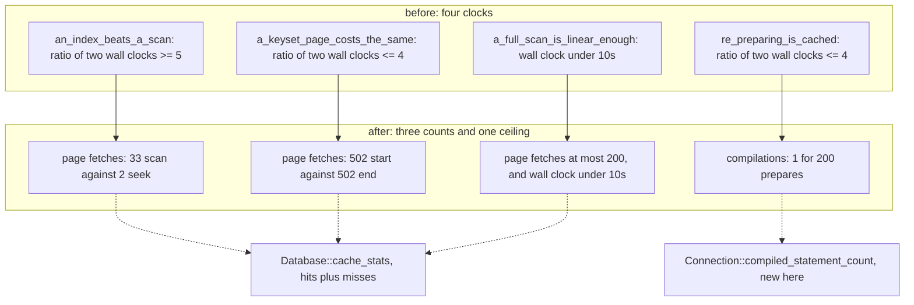
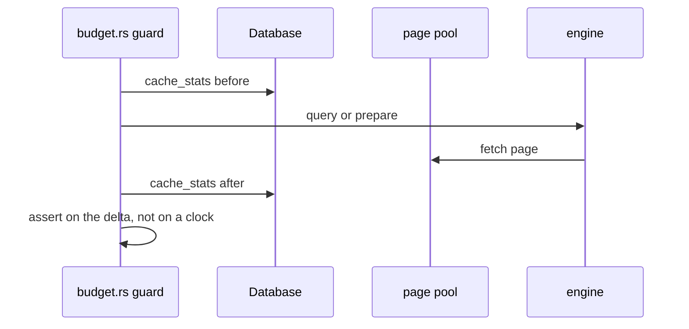

# task-1886: a guard the box cannot decide

## Introduction

`crates/inillucent/tests/budget.rs` holds the cost guards - the regressions a correctness suite
cannot see. Four of them are still decided by a stopwatch, and a stopwatch reading is decided by
whatever else is running on the machine. On this box that is four agent terminals, a training run,
and the test runner's own 24-wide pool, and under that load the same guards fail while the engine is
correct. Two `inillucent-testrun --strict` runs failed on two *different* tests in that one file, and
both passed in isolation six times out of six.

This change takes the clock out of the three assertions that flapped and puts a count in its place:
page fetches for the two plan-shape guards, and compilations for the plan-cache guard. It leaves one
wall-clock ceiling, which is measured here at 3 ms against a 10-second bound, and adds a page-fetch
ceiling beside it so that the flavour of quadratic a clock is needed for is the only flavour a clock
is asked about. It also fixes two things in the runner that made the failures harder to read than
they had to be.

## Goals and Non-Goals

**Goals**

1. No assertion in `budget.rs` that flapped under load is still asserted on a clock.
2. Every replacement number reads the same on an idle machine and on a loaded one, and every one is
   measured here before its bound is chosen.
3. Every guard can still fail. Where a lever exists to break what a guard guards, the test uses it,
   so the guard proves its own instrument is live in the same run.
4. No assertion states a conclusion about a cause. A guard reports what it measured and what it
   expected; naming the cause is the reader's job, and a timing guard that names one is wrong about
   it roughly as often as it is right.
5. The runner's `FAILED:` list names the exit status beside each target.
6. A tier declared `exclusive` stops its own tests contending with each other.

**Non-Goals**

- Widening a threshold. task-1857 established that widening is how the guard stops guarding, and
  every bound below moves in the other direction.
- Deleting an assertion.
- Adding the processor-time primitive the ticket proposes. The alternatives section says why, with
  the numbers: after this change there is no assertion left for it to serve, and it would cost
  `inillucent-base` its two documented properties - zero third-party dependencies and
  `forbid(unsafe_code)` - to serve none.
- The `inillucent-bench` half of the ticket. The supervisor's second run had it green, and
  task-1884 already built `inillucent_compat::verdict`, which reads the transcript and the exit
  status together for exactly this case.

## Problem statement

`budget.rs` has six timing sites across the file. Which one loses under load is decided by the
scheduler, so fixing the one test named in a report moves the failure rather than removing it.

| run | box | test that failed | what it read |
|---|---|---|---|
| 1 | 4 agents running | `one_transaction_beats_many` | batched 565.8 ms, singly 756.8 ms - 1.3x |
| 2 | 2 agents running | `re_preparing_is_cached_rather_than_recompiled` | rebound 7.5629 ms, reprepared 49.6265 ms |

Run 1's guard has since been replaced by a count of log writes (task-1884), and run 2's has not.

Two things make this worse than an ordinary flake.

**The load is not external.** The runner reported `139 target(s), 24 at a time, 2 thread(s) each`
and `wall 210.2s; the same work run one at a time is 2188.8s of processor time (10.4x)`. The suite
oversubscribes the box on its own. The `exclusive = true` tier gives `budget.rs` the machine to
itself among the *binaries*, and then still runs its own six tests two at a time inside it.

**The failure message states a false conclusion.** Run 2 printed
`the cache is not being consulted`. The cache was being consulted; the reprepare arm was
descheduled. Whoever read that message would go looking for a plan-cache bug that does not exist.

## Architectural overview



## Components and interfaces

### 1. `Connection::compiled_statement_count() -> u64` (new)

`ImportedDatabase` gains a `compiles: Cell<u64>` incremented at the top of `fn compile`, which is
the one function that turns SQL text into a plan. Counting there rather than at its three call sites
means a fourth path to a compilation cannot be added without moving the number with it.

`cached_plan_count` already exists and reports the cache's *size*. The two answer different
questions, and the difference is the defect this guard is for: a cache that holds one entry and
rebuilds it on every prepare has the size the first number reports and none of the behaviour it is
being trusted for.

Surfaced through `inillucent_engine::connect::Connection`, which is what `inillucent::Connection`
re-exports, so `budget.rs` reaches it without a new dependency.

### 2. The three guards, as counts

Measured on this machine at 20,000 rows, with `Database::cache_stats()` deltas taken around each
arm. `fetches` is `hits + misses`: every page the pool was asked for, whether or not it had to read
the file, which is the work the engine did rather than the work the disk did.

| guard | arm | measured | asserted | what breaking it reads |
|---|---|---|---|---|
| `an_index_beats_a_scan` | scan `+email` | 33 fetches | scan at least 4x seek | planner drops the index: both arms 33, ratio 1 |
| | seek `email` | 2 fetches | | |
| `re_preparing_is_cached_rather_than_recompiled` | 200 prepares of one statement | 1 compile | at most 1 compile | cache off: 200 compiles |
| `a_keyset_page_costs_the_same_wherever_it_starts` | page at row 0 | 502 fetches | start at most 4x end | TopN pipeline breaker: about 20,000 fetches at the start |
| | page at row 19,499 | 502 fetches | | |

Three notes on why these are the right counts.

- **Fetches, not reads.** `reads` is pages that missed the pool and went to the file, and it is 0 in
  all four arms here because the fixture fits in the pool. A guard on `reads` would be asserting
  something about the pool's size.
- **The seek arm's 2 fetches do not grow with the table** and the scan arm's 33 do, so the margin
  widens with `ROWS` rather than narrowing. The 4x bound is chosen against a measured 16x. (The seek
  reads 3 fetches cold and 2 once its plan is cached; the guard runs both arms once before it
  measures, so it reads the warmed number.)
- **The keyset arms are 502 and 502**, which is what a plan proportional to the limit looks like.
  Before the fix this test was written for, the start arm materialised every row after the key: at
  20,000 rows that is 40x the end arm, and the guard asks for 4x.

### 3. Each guard proves its own instrument in the same run

Section 1.5 of `tests/inillucent-testing-tdd.md`: a test that cannot fail is worse than no test.
`one_transaction_beats_many` already does this - it asserts that the autocommit arm really did commit
per statement, so the two arms cannot silently become the same arm. The two new count guards do the
same, and one of them can do it exactly:

- `re_preparing_is_cached_rather_than_recompiled` opens a second connection with
  `Levers::PLAN_CACHE` switched off through `disable_optimizations`, runs the same 200 prepares, and
  asserts that arm compiled 200 times. That is the guard's own failure mode, produced on purpose, in
  the same run, on the same machine. A counter that had stopped counting fails there.
- `an_index_beats_a_scan` keeps its existing `explain` assertion that the plan names `t_email`, so
  the ratio is known to be measuring a seek against a scan rather than a scan against a scan.

### 4. The one remaining clock

`a_full_scan_is_linear_enough_to_finish` stays a wall-clock ceiling and gains a fetch ceiling.

It is the only guard in the file that a count cannot fully replace, because the thing it is for - an
accidental quadratic - has two shapes. One re-descends the tree per row and shows up as fetches; the
other is quadratic inside the rows already fetched and shows up only as time. So both are asserted:
at most 200 fetches (measured 20) and under 10 seconds (measured 2.99 ms).

The clock is left because the headroom is 3,300x and the worst load factor this repository has
measured is about 50x - the same target taking 43 to 55 seconds under `--strict` against 1 to 3
seconds alone. A bound with sixty times more headroom than the worst observed load is not a bound the
box decides.

### 5. `exclusive` means one test thread

`testrun.rs` already splits the exclusive tiers out and runs them last with `jobs: 1`. It copies the
rest of the options, including `test_threads: 2`, so `budget.rs`'s six tests still run two at a time
against each other. The exclusive pass sets `test_threads` to 1.

This matters less once the assertions are counts, and it is still the difference between the one
remaining ceiling being measured on a quiet machine and on one running another guard beside it.

### 6. The `FAILED:` list names the exit status

The report already carries `Outcome::status`, and prints it for undetermined targets. A failed target
prints its label alone, so a reader sees a name without the one fact that separates "a test failed"
from "the process died after its tests passed". One line.

## Data flows and risks



| risk | why it is small | what it would look like |
|---|---|---|
| A fetch count is not the same on another machine | It is a function of page size (32,768, fixed by the engine) and row layout, not of hardware or load | A bound crossed on a machine that passes here |
| The 4x bounds are tighter than the timing bounds they replace | They are bounded away from a *broken* reading rather than from a slow one: 11x against 1x, 1x against 40x. A timing bound's margin was large because the noise was | A guard failing on a correct engine |
| `compiles <= 1` is too strict | The lever arm in the same test reads 200 with the cache off, so the counter is known live, and a cache invalidation inside the loop would be a real defect | A guard failing after an unrelated change that empties the cache mid-loop |
| Removing `paired_ratio` loses the interleaving argument | It has no callers left. The argument for it is preserved in the file header, as the reason a count is preferred to a well-built clock | Nothing |

## Alternatives considered

### A. Move a processor-time primitive into `inillucent-base` and assert on it

This is what the ticket proposes. `crates/inillucent-compat/src/procstat.rs` already reads
`GetProcessTimes` and `getrusage`, and `inillucent` cannot dev-depend on `inillucent-compat` because
`inillucent-compat` depends on `inillucent`, so the primitive would have to move to a crate both can
see.

Rejected, for three reasons that are all measurable.

1. **After this change there is no assertion left for it to serve.** Three of the four clocks become
   counts. The fourth is a ceiling with 3,300x headroom.
2. **`inillucent-base` would lose two documented properties to serve zero assertions.** Its module
   doc says it has "no third-party dependencies at all, so a bug in the layers above can never be
   blamed on something underneath them", and it is `#![forbid(unsafe_code)]`. `libc` and
   `windows-sys` in layer 0, with `unsafe` blocks, for a test's stopwatch, is the trade
   `docs/dependency-policy.md` exists to refuse.
3. **Processor time is less invariant than a count, not more.** `GetProcessTimes` and
   `getrusage(RUSAGE_SELF)` are per *process*, and libtest runs these tests on several threads in
   one process, so a process-wide reading includes the other test's work. The thread-scoped calls
   (`GetThreadTimes`, `CLOCK_THREAD_CPUTIME_ID`) fix that and still move with cache and memory
   bandwidth contention, which is exactly the pressure a 24-wide pool puts on a box: the arm that
   touches more memory loses more cycles, and the two arms of these guards touch very different
   amounts of memory. A count of fetches does not move at all.

If a future guard genuinely needs a stopwatch that load cannot move, the right shape is a
**test-only leaf crate** holding the thread-scoped calls, dev-depended by `inillucent` and depended
on by `inillucent-compat`, with `[[external]]` rows adding it to `libc` and `windows-sys`. That
keeps layer 0 clean and no production crate gains an edge. It is written down here rather than built,
because building it now would be adding a dependency for no caller.

### B. Keep the timings and run this target alone, outside the pool

The `exclusive` tier is already this, and it is what failed. It gives the guard the machine to itself
among the test binaries and says nothing about the four agents and the training run on the box.
Section 5 still narrows it to one thread, because that part is real; it is a supporting change rather
than the fix.

### C. Widen the bounds

Refused by the ticket and by the file's own header. `one_transaction_beats_many` went 4 to 2 to a 1.3
reading, and the next step down asserts nothing.

## Testing strategy

The guards *are* the tests, so the verification is that each one fails when the thing it guards is
broken, and passes when it is not, on a machine that is deliberately busy.

| # | check | how | pass |
|---|---|---|---|
| 1 | Each new count reads what the design says | probe run printing the deltas | 33/2, 1/200, 502/502, 20 fetches and 2.99 ms |
| 2 | `re_preparing_is_cached_rather_than_recompiled` can fail | the `PLAN_CACHE` lever arm inside the test itself | 200 compiles with the cache off, in every run |
| 3 | `an_index_beats_a_scan` can fail | temporarily force the seek arm to a scan | ratio falls to about 1, the guard fails |
| 4 | `a_keyset_page_costs_the_same_wherever_it_starts` can fail | temporarily make the plan materialise the range | the start arm's fetches rise, the guard fails |
| 5 | The perf tier is green alone | `inillucent-testrun --tier perf` | 6 of 6 |
| 6 | The perf tier is green **under load** | the same, with the box deliberately saturated | 6 of 6, and the counts identical to check 1 |
| 7 | Nothing else broke | `inillucent-testrun --changed`, then a full `--strict` run | no new failure |
| 8 | The contracts still hold | `cargo test -p inillucent-compat --test policy --test selection` | green |
| 9 | The runner prints the status | a target made to fail | its exit status appears beside its name |

Check 6 is the one that decides whether this ticket is finished. The counts must be **identical**
under load, not merely passing: a count that moved would mean it was not a count.

---

## What the work found after this design was written

Three things changed the shape of the change. They are recorded here rather than
folded silently into the sections above, because the third one is the reason the
ticket was worth filing.

### The sweep found the same defect in two more files

`budget.rs` was the file the ticket named, and it was not the only one. Running
the guards with the box deliberately saturated failed
`inillucent-compat::new_engine_vtab_stream`:

```
thread 'a_bounded_series_answers_immediately' panicked at
crates\inillucent-compat\tests\new_engine_vtab_stream.rs:142:5:
the whole run took 636.3788ms
```

A 500 ms wall-clock bound, in the `engine` tier, so it runs inside the 24-wide
pool. The engine was working. That file's own header already states the right
rule - its 10-second `DEADLINE` exists "to separate 'returned' from 'did not
return', not to grade a duration" - and three assertions underneath it graded a
duration anyway.

A grep of every test in the workspace found six sites in three files. All six are
gone:

| file | was | is |
|---|---|---|
| `crates/inillucent/tests/budget.rs` | 3 wall-clock ratios | 3 counts: pages fetched, statements compiled |
| `crates/inillucent-compat/tests/new_engine_vtab_stream.rs` | 3 wall-clock ceilings | the deadline, over a series a materialising scan cannot walk |
| `crates/inillucent-txn/tests/transactions.rs` | 2 wall-clock ceilings | the slot's own `waited` and `timed_out` counters |

The vtab case came out **stronger**, not merely quieter.
`SELECT value FROM generate_series(1,10) LIMIT 3` cannot fail on its own - ten
rows are cheap to materialise, so a scan that ignores the `LIMIT` still answers
it, which is why a stopwatch had been standing in for the missing evidence. It
now asks the same question of a four-billion-row series with the `stop` given.
Three rows come back instantly, and walking that series was measured **not** to
come back: `SELECT count(*)` over it hits the 10-second deadline.

The busy-timeout case kept both timings and moved the assertions onto counters
that were already being checked three lines below. `timed_out` rising with
`waited` unmoved is a refusal; `waited` rising on an acquisition that succeeded
is a wait that ended when the slot freed. The durations are still measured and
now appear in the failure messages. One of the two assertions had no message at
all.

### The plan cache came out of the engine's crate root

`compiled_statement_count` put `crates/inillucent-engine/src/lib.rs` two lines
over the ceiling `policy::no_module_grows_past_the_size_it_is_recorded_at`
records for it, and that test says to extract rather than raise the number.

The cohesive thing to lift was the plan cache: `plan_key`, `cacheable`,
`compiled`, `cached_plan_count` and the new counter are all about *whether* to
compile, and they are now `crates/inillucent-engine/src/plans.rs`. `compile`,
which is about *how*, stayed with the parser and binder plumbing it is written in
terms of. **lib.rs went from 8,128 lines to 8,068 and the ceiling was not
raised.**

### The testing standard was telling authors to do the wrong thing

`tests/inillucent-testing-tdd.md` §5.1 said, in bold: **"A guard that flaps gets
widened, never tightened."** That is the advice this ticket refutes, and
`budget.rs` had already retracted it in its own header - so the standard and the
code were describing two different things, which is the same shape as the
`--strict` skip-phrase defect that started this series.

The standard now has a seventh rule, **§1.7 A test asserts a count, not a
duration**, with the six sites and what each one reads under load; §5.1 is
rewritten around the counts; and §7.3 records the three gate defects - the skip
phrases, the target recorded FAILED with 156 tests passing, and this one.

## The verification, as run

| # | check | result |
|---|---|---|
| 1 | Each new count reads what the design says | 33/2, 1/200, 502/502, 20 fetches and 2.99 ms |
| 2 | The plan-cache guard can fail | with the lever call removed: `left: 1, right: 200` |
| 3 | The index guard can fail | both arms scanning: 33 against 33, ratio 1.00 against a bound of 4 |
| 4 | The keyset guard can fail | the whole range costs 20,014 fetches against the page's 502, 39.9x |
| 5 | The vtab guard can fail | walking four billion rows hits the 10-second deadline |
| 6 | The perf tier is green alone | 6 of 6, 26.4 s |
| 7 | **The counts are identical under load** | three rounds at 100% processor load: every count identical, the one clock 1.65 ms to 3.9 ms |
| 8 | Nothing else broke | full `--strict`: 146 targets, 2,626 tests |
| 9 | The contracts hold | `policy` and `selection`, 18 of 18 |
| 10 | The runner prints the exit status | `inillucent-compat::policy    exit status 101` |

Check 7 is the one that decided the ticket. The load was a full 24-wide
`--strict` run plus eight spinning processes, which stretched the same test
binary from 16.6 s to 64.4 s - a 3.9x slowdown - while every count came back with
the same digits.
