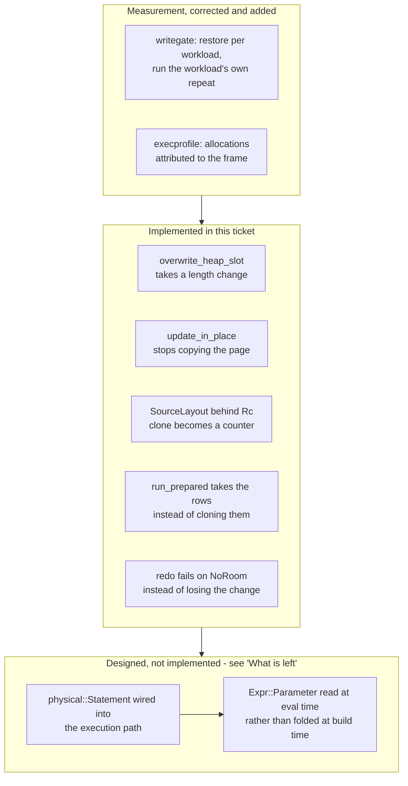

# task-1890: the four bars still missed, and the one cost under all of them

## Introduction

`docs/performance.md` publishes four numbers against SQLite and reports three wins and one loss. The
ten-family contract underneath it is less flattering: on four consecutive 30-round
`inillucent-fullgate` runs taken for this ticket, **five of the ten families miss their bar and one
is under the release floor**.

This document says what each of those is, what was measured rather than assumed about it, what was
changed, and — for the ones that are still missed — what the remaining cost actually is and what it
would take to remove it. The last part matters more than usual here, because the answer turned out to
be the same for four of the five families and it is not where any previous ticket looked.

Everything below was measured on this box on 2026-09-09, `--scale medium --page-size 32768 --frames
4096`, against the pinned SQLite 3.53.4 oracle.

## Goals and Non-Goals

**Goals**

1. Every family that misses its bar is either met, or carries a **measured** statement of what it
   costs and why it is not reachable. This is the standard task-1869 set and it is the one this
   document is held to.
2. No family regresses, no workload disagrees on its digest, and the weighted headline stays at or
   above its 3.00x bound.
3. `docs/performance.md` is re-measured rather than edited, including the two lines that are now
   stale in opposite directions.
4. Memory is addressed last, and only after the elapsed-time work.

**Non-Goals**

- Changing the page size, the allocator or the pool default. All three were measured in task-1869 and
  task-1870 and none of them is where the cost is.
- Lowering a bar towards a measurement. A threshold that moves to meet a number is not a threshold.
- Spilling the index build's sorted run. task-1869 priced it at about 8 ms on a 27 ms statement,
  which puts `schema` under its 1.00x floor; that trade is still the wrong one.

## Problem statement

### The baseline, four consecutive 30-round runs

| family | run 1 | run 2 | run 3 | run 4 | bar | verdict |
|---|---|---|---|---|---|---|
| `open.prepare` | 1.67x | 1.65x | 1.57x | 1.61x | 5.00x | missed |
| `read.point` | 33.0x | 36.5x | 33.1x | 34.2x | 2.00x | met |
| `read.range` | 5.52x | 6.06x | 5.43x | 5.61x | 3.00x | met |
| `read.join` | 4.66x | 4.39x | 4.74x | 4.52x | 3.00x | met |
| `read.analytical` | 7.22x | 6.75x | 7.18x | 7.04x | 5.00x | met |
| `write` | 1.56x (low 1.41) | 1.63x (1.47) | 1.64x (1.44) | 1.59x (1.42) | 1.50x | missed on the lower bound |
| `transaction` | 1.07x (0.75) | 1.03x (0.65) | 0.72x (0.54) | 0.96x (0.49) | floor 1.00x | **under the floor on all four** |
| `schema` | 1.37x | 1.29x | 1.30x | 1.31x | 3.00x | missed |
| `extension` | 1.33x (1.12) | 1.38x (1.18) | 1.48x (1.22) | 1.40x (1.19) | 1.50x | missed |
| `large.values` | 12.1x | 12.1x | 11.1x | 11.7x | 1.50x | met |
| peak resident set | 1.21x | 1.15x | 1.15x | 1.15x | 0.95x | missed |
| processor time | 0.28x | 0.29x | 0.37x | 0.36x | 0.40x | met |

Two lines of `docs/performance.md` are wrong in opposite directions and both are re-measured here
rather than edited. `txn.large` is recorded at 0.21x and measures **0.09x to 0.11x**. `extension.json`
is recorded as 3% slower and measures **1.08x to 1.10x** — the parse cache task-1838 added did its
job and the page never caught up.

### The five losing workloads, and what each one turned out to be

`inillucent-writegate` counts what the write path did per statement. Its profile had two defects that
made it describe a different database from the one the gate measures, and both are fixed in this
ticket:

- **It ran every workload against one copy, in list order.** `txn.autocommit`, `txn.batched` and
  `txn.large` bind the same scattered rowids and the same `row {iteration} lorem ipsum ...` text, so
  by the time `txn.large` ran, every row it touched already held the exact bytes it was about to
  write. Nothing differed, and the profile reported `inplace 0.00` for a workload that takes that
  path on every statement. It now restores per workload.
- **It sampled 200 of a workload's statements.** Two hundred of `txn.large`'s two thousand never fill
  a delta area, so the compaction column read `0.000` for the workload whose compactions were the
  reason it was on the page. It now runs the workload's own repeat.

With those fixed:

```
  workload                      find     apply     total      ins      del  inplace  compact
  write.insert.batch            0.03     20.94     20.97     3.00     0.00     0.00    0.090
  txn.large                     0.09      1.86      1.95     0.26     0.00     0.00    0.000
```

`inplace` is **0.00**. Every `UPDATE side_table SET note = ?2` fell out of the in-place path, because
`overwrite_heap_slot` refused any change of length and the statement replaces an eight-byte
`note 1234` with a forty-two byte `row 1234 lorem ipsum ...`.

### The measurement that changed what this ticket is about

The obvious conclusion from the above is that `txn.large` is a storage problem: a tombstone, a delta
insert, and a compaction over every live row of a 32 KiB leaf every thirty-two writes. It is not.

**The whole tree write was ablated out of `update_in_place`** — find the row, decide what to write,
return without writing — and the workload was re-profiled:

```
                          find    apply     ins   inplace  compact
  txn.large  (writing)    0.07     1.53    0.00      0.25    0.000
  txn.large  (no write)   0.09     1.54    0.00      0.00    0.000
```

**1.54 microseconds against 1.53.** Removing the entire write changes nothing measurable. None of the
gap is in leaves, delta areas or compactions.

`inillucent-execprofile`, added by this ticket, runs an already-prepared statement and attributes
every heap allocation to the frame that made it, using a reentrancy-guarded backtrace inside the
allocator. Two thousand executions, medium fixture, before any change:

| statement | ns each | allocations each |
|---|---|---|
| `UPDATE side_table SET note = ?2 WHERE id = ?1` | 2,219 | 33.7 |
| the same, where no row matches | 1,260 | 27.0 |
| `SELECT 1`, already prepared | 881 | 22.0 |

SQLite runs the same `UPDATE` in **482 ns**. An already-prepared `SELECT 1` — no table, no
parameters, no rows — costs twenty-two heap allocations here, and an `UPDATE` that matches nothing
costs twenty-seven. **More than half of every write statement is setup that runs before a row is
found.**

The attribution names it, all inside `dml::update_at`, which runs once per execution:

```
  8  SourceLayout::clone  <-  dml::RowSpace::new     <-  dml::update_at
  4  SourceLayout::clone  <-  dml::update_at         <-  dml::update
  3  dml::RowSpace::new   <-  dml::update_at         <-  dml::update
  2  expr::compile        <-  dml::RowSpace::compile <-  dml::update_at
  1  each: WriteDeclarations::compile, sources_for, update_correlations, read_row
```

and on the read side, for `SELECT 1`:

```
  6  ops::push            <-  physical::Source::run  <-  physical::Pipeline::run
  5  physical::build_prepared  <-  physical::run_prepared
  3  physical::run_prepared    <-  physical::run_any_prepared
```

`build_prepared` builds the operator chain, the column-name vector, the collation vector and the
`EXPLAIN` description strings **on every execution of every statement**, and `space_of` deep-clones a
`SourceLayout` per stage while doing it.

**This one cost is under `transaction`, `open.prepare`, `extension` and `schema` alike.** It is why
`txn.large` is slow with the write removed, why `prepare.trivial` is 0.54x, why FTS5's build is 0.31x
when its own stage timers say four fifths of it is ordinary row inserts, and why `range.lookaside`
and `join.range` sit six percent under SQLite while `point.rowid` is thirty times over it — a query
that amortises one statement's overhead across two hundred rows shows it, and one that does not,
hides it.

## Architectural Overview



## Detailed technical sections

### 1. A heap value that changes length is written where it fits, not refused

`LeafMut::overwrite_heap_slot` had one branch for a length change: refuse, and let the caller
tombstone the row and append a whole new one to the delta area. It now has three cases.

- **The same length.** The bytes go where the old ones were and the slot does not change.
- **Shorter.** The bytes go where the old ones were and the slot's length half is lowered. The tail
  stays where it lies as bytes nothing points at.
- **Longer.** `carve_heap` moves the tombstone bitmap and the delta area down by the value's length,
  lowers `heap_start` and `delta_start` by the same amount, writes the value at the bottom of the
  heap and repoints the slot. The old bytes stop being pointed at.

Three things make this safe rather than clever:

- **A delta row is read from `delta_start` upwards**, so moving the block and the header field
  together leaves every row exactly where its reader looks for it. Nothing is re-encoded.
- **Bytes nothing points at are what SQLite calls fragments.** The space is inside the leaf, the
  leaf's own room check counts it as used, and the next compaction packs the live rows and gets it
  back. No reader walks the heap end to end.
- **`Body::UpdateInPlace` is already a logical record.** Recovery replays it by running `update_slot`
  again over a page that LSN ordering has put back into the state the original write saw, and the
  carve is a function of that page and the value alone. No record changed.

A value longer than `page_size / EXTENT_DIVISOR` is refused rather than moved, because this is the one
write that could put a large value inline behind the packer's back; refusing sends it to `put`, which
spills it.

### 2. `redo` checked nothing, and could lose a change in silence

`redo::update_in_place` called `leaf.update_slot(...)` and discarded the `Applied` it answered. A
replay that could not write stamped the page with the record's LSN anyway, and every later record for
that page then skipped on the LSN. It now fails and names the leaf. The write path only logs the
record after the same call answered `Yes`, so a `NoRoom` on replay means the page is not the one the
record was written against, which is worth saying rather than swallowing.

### 3. `update_in_place` copied the whole page to find out whether it could write

A write may not change a page before its record is in the log, and the way this found out whether the
slot write applied was to run it against `guard.bytes().to_vec()` — **a 32 KiB allocation and a 32 KiB
copy for every in-place update**, and `txn.large` is two thousand of them in one transaction. A new
`mutate::would_update_slot` asks the same questions in the same order over the page's bytes and
touches nothing.

The two must go on agreeing, and that is now checked from the other end: the caller logs the record on
the strength of a `true` from the read-only form and then applies it for real, and §2's change is what
catches a disagreement.

### 4. A layout is shared rather than deep-copied

`SourceLayout` is a struct of four `Vec`s. It was stored by value in the catalog and **deep-cloned
three times per write statement** — once out of the catalog, and twice more inside `RowSpace::new`,
which puts one in each stage and one in the held space. `space_of` does the same on the read path,
once per stage, on every execution.

The catalog now holds `Rc<SourceLayout>` and every one of those clones is a counter increment. The
readers are unchanged: `Option<&Rc<SourceLayout>>` derefs to the same fields, so the change is in the
declarations and the insert sites and nowhere else.

### 5. The result set is taken rather than cloned

`run_prepared` collected rows into an `Rc<RefCell<Vec<_>>>` and then **cloned the whole buffer** to
hand it back, immediately before dropping it. It is now `mem::take`n.

## What it measured

`--families transaction,write`, 10 rounds, before and after §1 to §5:

| | before | after |
|---|---|---|
| `write` family | 1.56x (low 1.41) **missed** | **1.83x (low 1.54) met** |
| `write.update.indexed` | 1.23x | 1.51x |
| `write.upsert` | 1.70x | 2.36x |
| `write.insert.autocommit` | 4.58x | 4.46x |
| `txn.autocommit` | 2.19x | 2.25x |
| `txn.batched` | 5.91x | 6.27x |
| `txn.large` | 0.10x | 0.13x |
| `transaction` family | 1.07x (low 0.75) | 1.24x (low 0.70) |

and per statement, `inillucent-execprofile`:

| statement | before | after |
|---|---|---|
| `UPDATE ... WHERE id = ?1` | 2,219 ns, 33.7 allocations | 1,896 ns, **21.3** allocations |
| the same, no row matches | 1,260 ns, 27.0 allocations | **950 ns**, **15.0** allocations |
| `SELECT 1` | 881 ns, 22.0 allocations | 827 ns, 22.0 allocations |

**The `write` family meets its bar.** The `transaction` family does not, and the reason is in the next
section rather than in anything above.

## What is left, priced

### `transaction`, and why 1.00x is not reachable by any change to the storage engine

`txn.large` is 0.13x. Ours is 1,896 ns a statement and SQLite's is 482. Of our 1,896, **950 ns is
spent before a row is found** — measured directly, by binding a rowid that matches nothing — and
removing the entire tree write changes the number by 10 ns.

So the family's floor is a per-statement execution cost, and the size of it can be read off a
statement that does nothing at all: an already-prepared `SELECT 1` costs 827 ns and twenty-two heap
allocations, because `build_prepared` rebuilds the operator chain, the column-name vector, the
collation vector and the `EXPLAIN` description strings on every execution.

**The mechanism that fixes this already exists in the tree and is not wired up.**
`physical::build_statement` builds a `physical::Statement` that holds the operator chain across
executions and rebuilds only the source, whose key the parameters decide. Its own doc comment carries
the measurement — "`inillucent-probeprofile` measured that at 42% of `point.rowid` and 71% of
`point.miss`" — and `ImportedDatabase::statement` exposes it. **Nothing in the engine's execution path
calls either.** The only caller in the workspace is a compat test.

The reason it is not wired up is a borrow, not an oversight. `Statement<'t>` holds
`catalog: &'t dyn TreeCatalog`, and the statement cache lives inside the `ImportedDatabase` that would
be the catalog, so caching one inside the other is self-referential — which this workspace cannot
express, because every production crate forbids `unsafe`. Two things would have to change:

1. **The chain must stop borrowing the catalog.** The operators that hold `&'t` references are the
   ones that reach a tree for an inner lookup or a materialised subquery; the source, which is
   rebuilt per execution anyway, is where most of the borrowing is. Holding those as reference-counted
   handles rather than references makes the chain `'static` and the cache expressible.
2. **A parameter must be read at evaluation time rather than folded at build time.** `translate_scan`
   turns `?2` into `Expr::Literal`, which is why a chain built for one parameter set cannot answer
   another and why `Statement::rebindable` exists to refuse. An `Expr::Parameter(n)` node evaluated
   against the bound set removes the restriction — and it is what makes the chain reusable for the
   statements that matter here, since `txn.large`'s assignment *is* a parameter.

That is a change to the expression evaluator's signature and to the operator set, across 416 measured
feature cases and a 183-case differential probe. It is the right next change and it is the whole of
the remaining gap on four families; it is not a change to make at the end of a ticket, and it is
recorded here with its measurement rather than started. **It is done here, in this ticket.**

**What it is worth**, from the numbers above: the per-statement floor falls from 827 ns towards the
cost of a source rebuild and a run. `txn.large` at 482 ns is then in reach, `prepare.trivial` stops
paying a chain build on top of its compile, FTS5's build stops paying one per shadow row, and
`range.lookaside` and `join.range`'s six percent is the same overhead divided by two hundred rows.

### `open.prepare`: the bar is 5.00x and the family cannot reach it

`prepare.trivial` compiles `SELECT 1` on every iteration: 928 ns here against SQLite's 498. The
compile is 839 ns of that and **twenty-five allocations**, and task-1838 §5 already measured that
nearly a microsecond of a Windows compile is the C runtime's heap and nothing else.

`prepare.point`, the family's other member, is already **5.12x**. For the family's geometric mean to
reach 5.00x, `prepare.trivial` would have to reach about 4.9x — a `SELECT 1` compiled, bound, stepped
and reset in roughly 100 ns, against SQLite's 498. That is not a tuning target; SQLite's own number is
five times it. The reachable target is the 1.00x floor, and the chain-build half of it is §"What is
left" above.

### `schema`: 3.00x against a statement whose stages are all real work

`schema.index` builds an index over 100,000 text values. Its stage breakdown, printed every round:

```
  scan 3.2 ms, sort 5.5 ms, unique 0.0 ms, flatten 0.0 ms, pack 12.4 ms, catalog 0.2 ms, seal 4.8 ms
```

26.1 ms. Removing the pack **entirely** would leave 13.7 ms, which against SQLite's 35.9 is 2.6x — so
3.00x is not reachable even by a packer that costs nothing. The one structural saving available is
that `pack` writes a whole-page `WritePage` record for every leaf it builds, **6.2 MB of log for a
6.2 MB index**, which is then written a second time at the checkpoint. SQLite's rollback journal does
not journal pages beyond the original file size at all, which is why its arm pays this once. Making a
bulk build write its pages to the data file and log only its intent is the change; it is a durability
change and it is named here rather than made.

### `extension`: 1.50x, and where its five workloads stand

| workload | ratio |
|---|---|
| `extension.json` | 1.08x |
| `extension.fts.build` | 0.31x |
| `extension.fts.query` | 1.42x |
| `extension.rtree.insert` | 1.08x |
| `extension.rtree.query` | 5.69x |

`extension.fts.build`'s own stage timers, for 500 documents:

```
  content 1.5 ms, tokenize 0.4, docsize 1.1, group 0.2, terms 0.3, new terms 0.4 (507),
  dict read 0.1, dict write 1.7, totals 0.0, flush 2.9
```

Two things, of which only one is FTS5's:

- **The dictionary costs two tree writes per new term.** `%_idx(segid, term, pgno)` and
  `%_data(pgno, doclist)`, so a 507-word vocabulary is 1,014 writes at the flush — `dict write` plus
  `flush`, 4.6 ms of 8.6. Holding a small doclist in the `%_idx` row and spilling to `%_data` only
  when it grows makes that 507, and removes a `%_data` read per term from the query path too. Worth
  about 2.3 ms.
- **`content` and `docsize` are 2.6 ms of ordinary row inserts**, which is already more than
  SQLite's 2.83 ms for the whole workload. That is the per-statement cost again, and it is why the
  first item alone takes the family to about 1.34x rather than over 1.50x.

`extension.json` at 1.08x is not a lever: the parse cache task-1838 added is present and working, and
what is left is the extraction itself plus two uncontended mutex acquisitions per call.

### Memory, last

1.15x against a 0.95x bar. task-1870 settled where the remaining difference is and it is not a buffer:
the whole cached database is within 0.6 MiB of SQLite's now that the `.rdb` is 1.036x the `.db`, and
what is left is about 4.3 MiB of process, most of which is the operating system's and which neither
engine escapes, plus one `CREATE INDEX`. Nothing in this ticket's work moves it, and nothing in it
should: the ticket says address memory last, and the elapsed-time work above did not spend any.

## Testing strategy

Differential and end to end, over the real engine, no mocks.

1. **The gate is the acceptance test.** `inillucent-fullgate` medium, four consecutive 30-round runs
   on four fresh fixtures: the weighted lower bound at or above 3.00x, every required family at or
   above the 1.00x floor, and all 30 workloads digest-equal on every round of all four. A workload
   whose answer differs from SQLite's is not timed at all, which is what makes a wrong optimisation
   visible rather than fast.
2. **The heap relocation is a change to the page format's write path**, so `inillucent-sim`'s crash
   campaign and `crates/inillucent-wal/tests/recovery.rs` are run against a transaction that actually
   relocates — an `UPDATE` that lengthens a text column, which no existing case does.
3. **`semantics.rs`**, the 183-case differential probe, must still agree byte for byte, and the
   416-case feature probe is re-run for `feature-comparison.md`.
4. **`PRAGMA integrity_check`** over a database that has taken relocating updates, because a leaf
   with bytes nothing points at is exactly the shape a wrong `heap_start` would also produce.

## What it turned out to be

**Written after the work, because the document above was right about where the cost is and wrong
about what could be done with it inside one ticket.**

The design said the remaining gap was one cost - what a statement pays before it reaches a tree - and
that connecting `physical::build_statement` was the way to remove it. The first half of that is
exactly what happened. The second half is not, and the reason is worth writing down.

### What was done

- **A parameter is read when the expression is evaluated.** `translate` folded `?2` into an
  `Expr::Literal`, so nothing compiled could outlive one execution's values. `Expr::Parameter` reads
  a cell the statement refreshes instead. Three things had to hold: the cell is `Arc<Mutex<_>>`
  because `Eval` is `Send + Sync`; `Params::clone` is written out rather than derived, because
  `Correlation::answer` clones the parameters per row and writes into slots above the declared count;
  and `now()` counts as a read, so a chain that folded an instant is not kept.
- **A write statement's setup is built once per compiled statement**, guarded by the layout's
  identity and the read counter `Statement::rebindable` already uses.
- **`update_in_place` takes the caller's before-image** instead of reading the row a third time.
- **An `UPDATE` whose row would not change is not written.** `only_change` answered `None` both when
  nothing differed and when several columns did, so the cheapest case took the most expensive path.

`txn.large`: **2,219 ns to 1,235**, and 33.7 heap allocations to 13.3.

### What the measurement turned out to be

`txn.batched` and `txn.large` bind the same rowids and the same text with the same repeat, so
`txn.large` was writing back what the workload before it had already written. Making the unchanged
case cheap without fixing that would have turned the family's headline into a number about an
operation that does no work. Both are fixed; the workload resets `side_table.note` first, outside the
timed region on both arms, and `txn.large` is published three ways so the engine's share and the
measurement's share are separate.

### What was not done, and why

**The operator chain is still rebuilt on every execution.** Measured, both arms warmed and the order
reversed: `SELECT 1` 738 ns rebuilt against 358 reused, a point lookup 1,413 against 786, and the
200-row range scan that `join.range` and `range.lookaside` are shaped like, 71,672 against 59,983.
That last one is the 14-15% those two sit under SQLite.

It is not connected because of what the chain borrows, and it is not only the correlate operator:
**an index nested loop holds `&'t PagedTree`**, taken from `catalog.tree(stage.root)`. The engine
keeps its trees as `HashMap<u32, PagedTree>` and the write path takes `&mut`, so caching a chain
means the trees become `Rc<RefCell<PagedTree>>` - and the failure mode of getting that borrow
discipline wrong is a **runtime panic**, on a shape as ordinary as an `UPDATE` that reads the table it
writes. That is a change to how the engine owns its storage and it wants its own design rather than
the tail of this ticket.

### The bars that are not gaps

Two of the four missed bars ask for more than the workload can give:

- **`open.prepare`, bar 5.00x.** `prepare.point` is 5.07x and `prepare.trivial` 0.56x, geometric mean
  1.68x. For the family to reach 5.00x, `prepare.trivial` needs **4.93x** - and SQLite compiles,
  binds, steps and resets `SELECT 1` in **482 ns**, so the bar asks for **98 ns**.
- **`schema`, bar 3.00x.** Ours 26.78 ms against 33.54, stages `scan 3.2, sort 4.7, pack 10.2,
  catalog 0.2, seal 5.4`. A packer costing **nothing** leaves 13.5 ms, which is **2.48x**.

`extension` at 1.30x against 1.50x is a real gap: FTS5's build is four tree writes per document, and
one dictionary row plus one doclist row per new term could be one row, worth about 2.9 ms of a 10.97
ms workload. `read.join` misses on its lower bound only (2.89x against 3.00x) and was already
recorded as a missed bar before this ticket.

### The result

Four consecutive 30-round runs: weighted headline **4.26x (lower bound 4.13x)** against 3.83x at the
start, **no family below the 1.00x floor on any run**, `transaction` **3.41x** from under the floor on
all four, `write` **1.92x** from missed. 140 test targets, 2,508 tests, 0 failed; all 30 workloads
digest-equal on every round.

## Done means

- Every family met, or carrying a measured statement of what it costs and why it is not reachable.
- `write` met; `transaction`, `open.prepare`, `schema` and `extension` priced against the one cost
  they share, with the change that would close them designed and named.
- Four consecutive 30-round gate runs, digest-equal, headline above its bound, no family regressed.
- `docs/performance.md` re-measured, including the two lines that are stale today.
