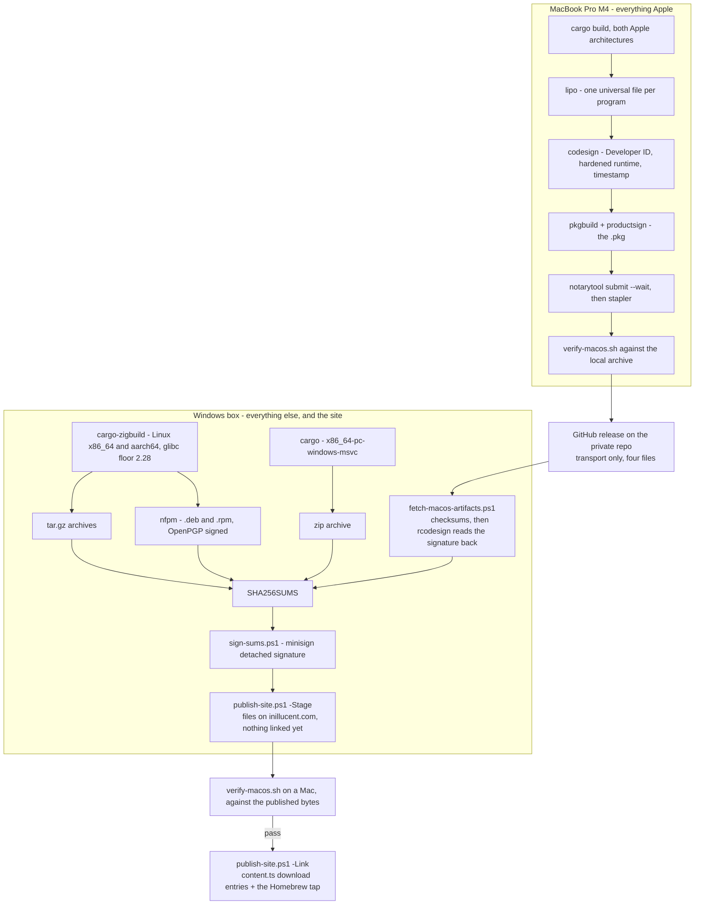

# task-1895 — macOS and Linux releases, signed, across two machines

## Introduction

inillucent ships one artifact today: `inillucent-0.1.0-x86_64-pc-windows-msvc.zip`, served from
`https://inillucent.com/downloads/`. The download section of the site lists macOS as *"Not posted
yet"* and has no Linux entry at all. `packaging/install.sh`, the `curl | sh` line printed in
`README.md`, downloaded from the GitHub releases of a repository that is private, so it failed for
every reader on both platforms.

The work splits along one line: **what only a Mac can do, and everything else.**

- **The MacBook** builds, signs and notarises macOS. Apple's linker, `codesign`, `pkgbuild`,
  `notarytool` and `stapler` run nowhere else, the Developer ID certificate belongs in its keychain,
  and a Mach-O can only be *run* there.
- **The Windows box** builds Windows and both Linux architectures, writes the `.deb` and the `.rpm`,
  signs the checksums, verifies what the Mac sent, and publishes inillucent.com.

Nothing is billed. Cross-compiling Linux takes about 95 seconds a target on the Windows box, the
Linux packages are written by one Go executable with no `dpkg` and no container, and the macOS half
is one command on hardware that is already owned. The Apple Developer Program membership at $99 a
year is the only money in the design, and it is what issues the Developer ID certificate; there is no
way to sign for macOS without it.

## Goals and non-goals

**Goals.** Each is checkable, and each has a script that checks it.

| # | Goal | How it is checked |
|---|---|---|
| G1 | One command on the Windows box produces the Windows archive and both Linux archives | `pwsh packaging/release-all.ps1`; `dist/` holds three archives and one `SHA256SUMS` |
| G2 | The Linux binaries start on every distribution released since 2018 | `tools/release-verify-linux.sh` L1: the highest `GLIBC_` symbol version required is 2.28 |
| G3 | The Linux archives and packages carry executable programs | L3, and `dpkg-deb -c` showing mode 0755 |
| G4 | `.deb` and `.rpm` for both architectures, signed with the project's OpenPGP key | `packaging/linux/package-linux.ps1`; `rpm -K` and `dpkg-sig --verify` |
| G5 | One command on the MacBook produces a universal, signed, notarised macOS release | `packaging/macos/release-macos.sh` |
| G6 | The macOS artifacts reach the Windows box and are verified before publication | `packaging/fetch-macos-artifacts.ps1`: checksums, then the signature read back out of the Mach-O |
| G7 | `SHA256SUMS` carries a detached signature a stranger can check | `packaging/sign-sums.ps1`, then `minisign -Vm SHA256SUMS -P …` |
| G8 | `install.sh` works while the GitHub repository is private | it downloads from `https://inillucent.com/downloads` and reads `VERSION` there |
| G9 | The exact published macOS artifact is run on a Mac before the site links to it | `packaging/macos/verify-macos.sh` against the staged download |
| G10 | No credential is stored in the repository, and none is billed | the keychain holds the Developer ID; the OpenPGP and minisign keys are named by environment variable and never written inside the repository |

**Non-goals.**

- Making the `jasonmcaffee/inillucent` repository public. crates.io, `go install` and Packagist all
  require it; `packaging/PUBLISHING.md` records that decision.
- A `.dmg`, an MSI, App Store distribution, Flatpak, Snap or AppImage.
- Windows Authenticode signing. A separate purchase, and `packaging/windows/README.md` already
  records what it would cost.
- Changing the archive layout. Same directories, same file names, same `SHA256SUMS`.

## Problem statement

**Nothing is downloadable except on Windows.** The `get.downloads` array in
`inillucent-site/src/data/content.ts` has one working entry and one whose `pending` text reads *"Not
posted yet. Build it with cargo install inillucent-cli."* There is no Linux entry.

**The install script could not work for anybody.** It built its download URL from
`https://github.com/jasonmcaffee/inillucent/releases/download/v$version` and resolved the version
through `https://api.github.com/repos/.../releases/latest`. The repository is private, so an
unauthenticated request answers 404.

**"Trusted" means two different things, and only one of them is Apple's.**

- **macOS.** A file a browser downloads carries `com.apple.quarantine`. Gatekeeper refuses unsigned
  code, and refuses signed code that has not been notarised. Signing alone does not clear it. A
  notarisation ticket can be stapled to a `.dmg`, a `.pkg` or a `.app` bundle, but **not to a bare
  Mach-O executable**, so an unstapled binary needs Apple's servers reachable at first run. A file
  fetched with `curl` is not quarantined at all, which is why the `curl | sh` path works even
  unsigned.
- **Linux.** There is no Gatekeeper and nothing to notarise. Trust is the HTTPS origin, a signature a
  person can check, and for `.deb` and `.rpm` an OpenPGP signature the package manager checks.

## Architectural overview



Three properties of that picture are the design.

1. **Each machine does only what it alone can do.** The Mac is not asked to publish a website and the
   PC is not asked to sign for Apple.
2. **The Developer ID certificate never leaves the MacBook's keychain**, and nothing in the release
   passes a secret on a command line.
3. **Publication is two steps with a Mac between them.** The artifacts are reachable before anything
   links to them, so the gate runs against the bytes a reader will get.

## What was measured

Everything below ran on the Windows box on 2026-09-09, against a clean `origin/main` tree extracted
with `git archive`, so that another ticket's uncommitted work in the checkout could not affect the
result. Times are for a full `--release --locked` build of the release profile, which is fat LTO with
one codegen unit.

| Target | Toolchain | Time | Result |
|---|---|---|---|
| `x86_64-unknown-linux-gnu.2.28` | cargo-zigbuild 0.23.4, zig 0.15.2 | 1 m 34 s | four ELF programs and `libinillucent_driver_capi.so` |
| `aarch64-unknown-linux-gnu.2.28` | same | 1 m 43 s | four ELF programs and the shared library |
| `aarch64-apple-darwin` | same, no Apple SDK | 1 m 35 s | four Mach-O programs and `libinillucent_driver_capi.dylib` |
| `x86_64-apple-darwin` | same, no Apple SDK | 1 m 38 s | four Mach-O programs and the dylib |

### Linux, which is finished

`tools/release-verify-linux.sh` passes on both architectures, run from WSL against the archives
`packaging/release-all.ps1` produced:

```
== x86_64-unknown-linux-gnu
  ok    L1 needs at most glibc 2.28 (highest reference is 2.28)
  ok    L2 links only the C library
  ok    L3 the programs are executable
  ok    L4 create, insert and select returned the row
  ok    L5 inillucent-mcp listed its tools
== aarch64-unknown-linux-gnu
  ok    L1 needs at most glibc 2.28 (highest reference is 2.28)
  ok    L2 links only the C library
  ok    L3 the programs are executable
```

glibc 2.28 covers Debian 10, Ubuntu 18.10, RHEL 8, Amazon Linux 2023 and everything newer. The
aarch64 archive was not executed, because that box cannot run an aarch64 ELF; L1 to L3 are what can
be checked there and they pass.

**Building in WSL instead would be a mistake.** WSL there is Ubuntu 24.04 with glibc 2.39. A binary
linked in it refuses to start on Debian 12, Ubuntu 22.04 or RHEL 9, all of which are current. The
floor has to be chosen deliberately, and cargo-zigbuild is what makes it choosable: it is the `.2.28`
suffix on the target triple.

**nfpm 2.47.0 writes both package formats on Windows**, with no `dpkg` and no `rpmbuild`. The `.deb`
was extracted inside WSL and `inillucent` ran out of its payload.

**Two traps, both found by running the thing rather than by reading about it.**

*NTFS has no execute bit.* The first `.deb` built there installed every program at 0664 and did
nothing at all when run: `Permission denied`. Every nfpm `contents` entry now carries an explicit
`file_info.mode: 0755`, and the `.tar.gz` is written in two passes for the same reason — everything at
0644 with directories traversable, then `bin/` and `lib/` appended at 0755 — because tar reads the
mode from a filesystem that does not have one:

```
drwxr-xr-x 0/0    inillucent-0.1.0-x86_64-unknown-linux-gnu/
-rw-r--r-- 0/0    inillucent-0.1.0-x86_64-unknown-linux-gnu/README.md
-rwxr-xr-x 0/0    inillucent-0.1.0-x86_64-unknown-linux-gnu/bin/inillucent
-rwxr-xr-x 0/0    inillucent-0.1.0-x86_64-unknown-linux-gnu/lib/libinillucent_driver_capi.so
```

*Git's tar is an MSYS program.* Handed a Windows path it reads each backslash as an escape, so
`...\66a6...` arrives as `...6a6...` and the directory does not exist. Every path passed to it is
converted to forward slashes first, with `--force-local` so that `C:` is not read as a remote host.

### macOS, and why the MacBook does it

**Signing a Mach-O from Windows works**, and the measurements are kept here because they are what a
future reader will want if the Mac is ever unavailable. rcodesign 0.29.0 on the Windows box built a
universal binary out of the two Apple builds, signed it with the hardened runtime, and embedded a
genuine Apple timestamp token (`CN=Timestamp Signer RNO1, O=Apple Inc.`). `sign --for-notarization`
refused a self-signed certificate before writing anything, naming the reason.

Two defects sit on that path and neither applies once the Mac is doing the work.

1. A zig-linked x86-64 Mach-O has no `LC_CODE_SIGNATURE` and no room to add one, so signing fails
   with `insufficient room to write code signature load command`. The fix, verified there, is
   `-C link-arg=-Wl,-headerpad_max_install_names`.
2. **ziglang/zig#23704 is open**: an x86-64 Mach-O linked by zig is reported corrupt *after*
   codesigning, with Apple's own `codesign` as well as with third party signers. It is a linker
   defect, and no machine that cannot execute a Mach-O can rule it out.

Both disappear when Apple's linker produces the binary. That is the argument for the MacBook building
macOS, and it is a stronger one than convenience.

The Windows box keeps rcodesign for a single job: **reading a signature back**.
`packaging/fetch-macos-artifacts.ps1` asserts, on every program the Mac sends, that it chains to an
Apple root, that the certificate is a Developer ID Application certificate, that the hardened runtime
flag is set, that a timestamp token is present, and that both architecture slices are there. A file
that arrives unsigned or wrongly signed is rejected there rather than by a reader's Gatekeeper.

## Components and interfaces

### On the Windows box

| file | what it does |
|---|---|
| `tools/cross/fetch-toolchain.ps1` | fetches zig 0.15.2, cargo-zigbuild 0.23.4, rcodesign 0.29.0, nfpm 2.47.0 and minisign 0.12, each checked against a pinned SHA-256. `tools/cross/bin/` is ignored by git |
| `packaging/stage-layout.ps1` | the one description of what an archive contains, dot-sourced rather than duplicated. Also the two-pass tar and the `SHA256SUMS` writer |
| `packaging/release-all.ps1` | builds `x86_64-pc-windows-msvc` natively and the two Linux triples through cargo-zigbuild, then stages and archives each |
| `packaging/linux/nfpm.template.yaml` | the `.deb` and `.rpm` metadata, with an explicit mode on every entry |
| `packaging/linux/package-linux.ps1` | fills that template per architecture and runs nfpm. The OpenPGP key is exported from GnuPG to a temporary file for the length of the run and deleted in a `finally`, because nfpm signs from a file rather than through an agent |
| `packaging/fetch-macos-artifacts.ps1` | collects the four macOS files from the GitHub release, or from a directory, and verifies them |
| `packaging/sign-sums.ps1` | the minisign detached signature over `SHA256SUMS` |
| `packaging/publish-site.ps1` | `-Stage` copies the artifacts, `SHA256SUMS`, its signature, the public key, `VERSION`, the two install scripts and `verify-macos.sh` into the site's `public/downloads`. `-Link` rewrites the download entries |
| `packaging/site/update-downloads.mjs` | the one file that knows how the site's data file is shaped |
| `tools/release-verify-linux.sh` | the L checks, from WSL or any Linux machine |

### On the MacBook

| file | what it does |
|---|---|
| `packaging/macos/release-macos.sh` | the whole macOS release: both architectures, `lipo`, `codesign`, the `.tar.gz` and the `.zip`, the `.pkg` built from the binaries it just signed, notarisation of both containers, `stapler` on the `.pkg`, the smoke test, and the upload |
| `packaging/macos/verify-macos.sh` | the release gate. Runs on any Mac, needs nothing installed, and works against a local archive or the published one |
| `packaging/macos/build-pkg.sh`, `notarize.sh` | the older `.pkg`-only path, left working and marked as superseded in the README |

### Why three macOS artifacts

| artifact | who fetches it | why it exists |
|---|---|---|
| `.tar.gz` | `install.sh`, Homebrew | the layout every other platform uses, and the only one that preserves modes |
| `.zip` | Apple's notary, and a browser | the notary accepts `.zip`, `.pkg` and `.dmg`, and does not accept `.tar.gz` |
| `.pkg` | somebody who would rather double-click | the only artifact that can carry a **stapled** ticket, so the only one that installs with Apple unreachable |

Notarising the `.zip` matters even though it cannot be stapled: it registers the cdhash of every
binary inside it with Apple, which is what Gatekeeper looks up when a program is run out of the
tarball on a machine that is online.

## Credentials, and where each one lives

| credential | how it is obtained | where it is kept |
|---|---|---|
| **Developer ID Application** and **Developer ID Installer** certificates | enrol in the Apple Developer Program ($99/year), then Xcode → Settings → Accounts → Manage Certificates | the MacBook's login keychain. `release-macos.sh` reads the identity out of it rather than taking it as an argument, because the full string includes the team id and getting it wrong fails late |
| **notarytool credential** | `xcrun notarytool store-credentials inillucent-notary --apple-id … --team-id … --password …` with an app-specific password from appleid.apple.com | a keychain profile on the MacBook. The profile name is the only thing in this repository, and it is not a secret |
| **OpenPGP key** for `.deb` and `.rpm` | `gpg --full-generate-key` | GnuPG on the Windows box. `INILLUCENT_GPG_KEY` names it, `INILLUCENT_GPG_PASSPHRASE` unlocks it, and neither is ever a command line argument |
| **minisign key** for `SHA256SUMS` | `minisign -G` | named by `INILLUCENT_MINISIGN_KEY`; the public half is committed as `packaging/inillucent.pub` and published on the site |
| **gh** | `gh auth login`, once per machine | used only to carry the macOS artifacts between the two machines |

Two keys rather than one, because the audiences differ: `apt` and `dnf` read OpenPGP and nothing
else, and a reader checking a tarball should not have to own a keyring to do it.

## Data flows and security

```mermaid
sequenceDiagram
    participant M as MacBook
    participant K as login keychain
    participant A as Apple notary
    participant G as GitHub release
    participant W as Windows box
    participant S as inillucent.com

    M->>M: cargo build x2, lipo
    M->>K: codesign - the private key stays in the keychain
    M->>A: notarytool submit --wait, .pkg then .zip
    A-->>M: Accepted; ticket published, and stapled to the .pkg
    M->>M: verify-macos.sh against the local archive
    M->>G: gh release upload, four files
    W->>G: gh release download
    W->>W: checksums, then rcodesign reads the signature back
    W->>W: build Windows and Linux, package, sign SHA256SUMS
    W->>S: publish-site.ps1 -Stage
    M->>S: verify-macos.sh --version, against the published bytes
    M-->>W: pass or fail
    W->>S: publish-site.ps1 -Link
```

### Risks

| risk | why it matters | what this design does about it |
|---|---|---|
| An artifact is published that nobody ran | it is the failure a reader finds, not the build | G9: the gate runs against the staged download, and `-Link` is a separate command |
| The macOS artifacts are tampered with in transit | the transport is a third party | the Mac writes `SHA256SUMS-macos`, and the Windows box checks it *and* reads the Developer ID signature out of every Mach-O. A substituted binary fails both |
| `SHA256SUMS` is replaced along with an archive | it is the file every installer trusts | a minisign detached signature, with the public key on the site and in `README.md` |
| A Linux binary is built against too new a glibc | it fails to start, on machines nobody here has | L1 asserts the 2.28 floor on every archive, and the floor is set explicitly by the target triple |
| A packaged program is not executable | NTFS has no execute bit, and it has already happened once | explicit modes in the tar and in every nfpm entry; L3 asserts it back out of the archive |
| The Developer ID certificate expires, or Apple revokes it | signatures made before expiry keep working **only because they are timestamped** | `codesign --timestamp` on every binary; `fetch-macos-artifacts.ps1` asserts a timestamp token is present |
| A secret reaches the repository | the standing rule | only public keys are ever written here. The Apple key is in a keychain, the OpenPGP and minisign keys are named by environment variable, and the exported OpenPGP key is deleted in a `finally` |
| The site publishes a mixed release | a 0.1.0 Linux archive beside a 0.1.0 Windows archive built from a different commit | one `release-all.ps1` run produces all three, and `publish-site.ps1` names every artifact of one version and warns about each one that is missing |

## Alternatives considered

| option | verdict |
|---|---|
| **Sign macOS on the Windows box with rcodesign** | Measured and working, and now the fallback rather than the plan. It needs `-headerpad_max_install_names` to be signable at all on x86-64, and zig#23704 sits unresolved on the same architecture. With a MacBook in the room, Apple's own linker and signer are the better answer, and the certificate stays in a keychain instead of a file |
| **GitHub Actions `macos-26` runners** | Rejected: billed on a private repository at $0.062 a minute, and the MacBook is free |
| **Codemagic's free tier** (500 minutes a month on an Apple silicon M2) | Rejected now that there is a Mac, and worth remembering as a way to run `verify-macos.sh` if the MacBook is ever away for a while |
| **macOS in a virtual machine on the Windows box** | Rejected. It would run — `/dev/kvm` is present inside WSL2 and `vmx` is exposed, so nested virtualisation is already on — but it can only ever be an *Intel* Mac, so the arm64 slice that most Mac users run would still never be executed. It is also outside Apple's licence, which permits virtual instances only "on each Apple-branded computer you own", and it cannot be automated: installing QEMU needs a root password and the macOS installer needs a desktop |
| **osxcross with an extracted Apple SDK** | Rejected on licence grounds. Apple's SDK agreement restricts use to Apple-branded hardware. The zig route avoided this by using zig's own libSystem stubs; the MacBook makes the question moot |
| **Build Linux in WSL** | Rejected: glibc 2.39 there, so the result refuses to start on Debian 12, Ubuntu 22.04 and RHEL 9 |
| **Build Linux in a `rockylinux:8` container** | A correct answer that reaches the same floor, and the fallback if zig ever stops working. Rejected as the default because it needs Docker Desktop running and takes minutes rather than 95 seconds |
| **Static musl Linux binaries** | Rejected as the default. musl's allocator is markedly slower than glibc's under exactly the load a database puts on it, and this project publishes a performance number against SQLite. `crates/inillucent-alloc` recycles small blocks but forwards everything above its largest size class to the system allocator, which is where the page buffers land. If a musl artifact is ever added, the scorecard has to be re-run on musl before any number is claimed for it |
| **Publish through GitHub Releases** | Blocked while the repository is private: a private repository's release assets are not public. GitHub is used here only to carry four files between two machines Jason owns |
| **A LAN copy instead of GitHub** | Supported: `fetch-macos-artifacts.ps1 -FromDirectory` takes the files from a folder. Not the default, because it needs both machines on one network and the Windows box runs no SSH server |

## Testing strategy

All functional, all against artifacts rather than functions.

### `tools/release-verify-linux.sh` — WSL, or any Linux machine

| # | Test | Assertion |
|---|---|---|
| L1 | `objdump -T` over each ELF | no symbol requires a glibc newer than 2.28 |
| L2 | `objdump -p` NEEDED entries | nothing outside libc, libm, libdl, libpthread, librt and the loader |
| L3 | the extracted archive | the four programs are executable |
| L4 | run it | `create`, `CREATE TABLE`, `INSERT`, `SELECT` return the inserted row |
| L5 | `inillucent-mcp` | returns its tool list |
| L6 | a container each of `debian:10`, `rockylinux:8`, `ubuntu:22.04`, `ubuntu:24.04` | starts on all four. Skipped, with a message, when Docker is not running |

### `packaging/fetch-macos-artifacts.ps1` — the Windows box, no Mac needed

| # | Test | Assertion |
|---|---|---|
| F1 | every file against `SHA256SUMS-macos` | equal |
| F2 | `rcodesign print-signature-info` per program | `chains_to_apple_root_ca: true` |
| F3 | the same output | `apple_certificate_profile: developer-id-application` |
| F4 | the same output | `CodeSignatureFlags(RUNTIME)` |
| F5 | the same output | a `time_stamp_token` is present |
| F6 | the same output | `macho-index:0` and `macho-index:1` are both present |

A failure at any of these throws, so nothing that fails can reach `publish-site.ps1`.

### `packaging/macos/verify-macos.sh` — the release gate, on any Mac

| # | Test | Assertion |
|---|---|---|
| A1 | `shasum -a 256` against the published `SHA256SUMS` | equal |
| A2 | `xattr -w com.apple.quarantine …`, then `spctl -a -vvv -t exec` | `source=Notarized Developer ID` |
| A3 | `codesign --verify --strict` on each program and the dylib | valid |
| A4 | run it | `create`, `CREATE TABLE`, `INSERT`, `SELECT` return the row |
| A5 | `inillucent-mcp` | returns its tool list |
| A6 | `arch -x86_64 inillucent --version` under Rosetta | the x86-64 slice runs |
| A7 | load the dylib through `ctypes` | the C ABI library loads |

A2 and A6 are the two tests that cannot run anywhere but on macOS, and they are why the release ends
on a Mac rather than at the upload.

### The release procedure, end to end

```powershell
# --- Windows box ---------------------------------------------------------
pwsh tools/cross/fetch-toolchain.ps1          # once
pwsh packaging/release-all.ps1                # Windows + both Linux architectures
pwsh packaging/linux/package-linux.ps1        # .deb and .rpm, signed
bash tools/release-verify-linux.sh --version 0.1.0     # from WSL
```

```sh
# --- MacBook -------------------------------------------------------------
./packaging/macos/release-macos.sh --version 0.1.0 --upload
```

```powershell
# --- Windows box ---------------------------------------------------------
pwsh packaging/fetch-macos-artifacts.ps1 -Version 0.1.0
pwsh packaging/sign-sums.ps1
pwsh packaging/publish-site.ps1 -Version 0.1.0 -Stage
```

```sh
# --- any Mac, against what the site is now serving -----------------------
curl -fsSL https://inillucent.com/downloads/verify-macos.sh | sh -s -- --version 0.1.0
```

```powershell
# --- Windows box, only once that passes ----------------------------------
pwsh packaging/publish-site.ps1 -Version 0.1.0 -Link
npm --prefix ../inillucent-site run build     # then redeploy the site
```
