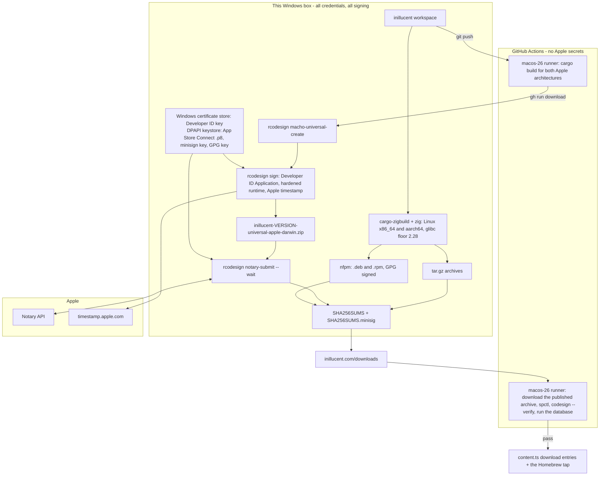
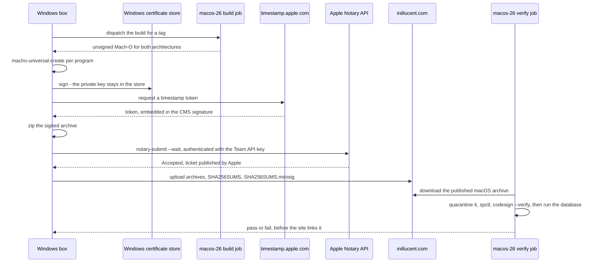

# task-1895 — macOS and Linux builds, signed, driven from the Windows box

## Introduction

inillucent ships one artifact today: `inillucent-0.1.0-x86_64-pc-windows-msvc.zip`, served from
`https://inillucent.com/downloads/`. The download section of the site lists macOS as *"Not posted
yet"* and has no Linux entry at all. `packaging/release.sh` already accepts `--target` and
`packaging/macos/` already carries a `.pkg` recipe, but neither has ever run, because there is no Mac
and no Linux machine here. This ticket asks for macOS and Linux artifacts that are signed and
trusted, produced from the Windows machine that holds the Apple Developer account and its API key.

Two findings shape the design, and both were measured on this box rather than assumed.

1. **Every Apple signing step runs on Windows.** `rcodesign` builds universal binaries, signs them
   with a Developer ID certificate under the hardened runtime, obtains a genuine Apple timestamp, and
   submits to the Notary API. The Apple private key never has to leave this machine, which is what
   the ticket asked for.
2. **Linux needs nothing but this box.** `cargo-zigbuild` cross-compiles the full release profile to
   `x86_64` and `aarch64` Linux with a chosen glibc floor of 2.28, in about 95 seconds per target,
   and the result runs.

macOS *compilation* is the one open choice. It also works here — the whole release profile
cross-compiles to both Apple architectures in about 96 seconds with no Apple SDK — but two defects in
zig's Mach-O linker sit on that path, one of which cannot be observed from a machine that cannot run
a Mach-O. This document recommends compiling macOS on a GitHub Actions `macos-26` runner, which is
already needed for the release smoke test, and keeping the local cross build as the measured
alternative.

## Goals and non-goals

**Goals.** Each one is checkable.

| # | Goal | How it is checked |
|---|---|---|
| G1 | One command on the Windows box produces the `x86_64-apple-darwin`, `aarch64-apple-darwin`, `x86_64-unknown-linux-gnu` and `aarch64-unknown-linux-gnu` archives, with the layout and the `SHA256SUMS` the Windows archive already uses | `dist/` holds every archive and one `SHA256SUMS` |
| G2 | The macOS archive carries one universal binary per program, both architectures | `rcodesign print-signature-info` lists `macho-index:0` and `macho-index:1` for each file |
| G3 | Every macOS executable and `libinillucent_driver_capi.dylib` is signed with a Developer ID Application certificate, with the hardened runtime and a secure timestamp | `rcodesign print-signature-info` shows `chains_to_apple_root_ca: true`, `CodeSignatureFlags(RUNTIME)` and a `time_stamp_token` |
| G4 | The macOS download is notarised, so a browser download from inillucent.com runs without a Gatekeeper refusal | `rcodesign notary-log` reports `status: Accepted`; `spctl -a -vvv -t exec` on a Mac says `source=Notarized Developer ID` |
| G5 | The Linux binaries start on every distribution released since 2018 | the highest `GLIBC_` symbol version required is 2.28, read with `objdump -T` |
| G6 | Linux artifacts can be verified by a stranger: a detached signature over `SHA256SUMS`, and `.deb` / `.rpm` signed with the project key | `minisign -V` passes; `dpkg-sig --verify` and `rpm -K` pass |
| G7 | `packaging/install.sh` installs on macOS and Linux while the GitHub repository is private | the script runs end to end against `https://inillucent.com` in a container |
| G8 | The exact published macOS artifact is executed on real macOS before the site links to it | the verification job runs `create`, `INSERT`, `SELECT` and the MCP tool list against the downloaded archive |
| G9 | No Apple credential is stored anywhere but this machine | the CI workflows contain no Apple secret; the key lives in the Windows certificate store and the `.p8` in the DPAPI keystore |

**Non-goals.**

- Making the `jasonmcaffee/inillucent` repository public. crates.io, `go install` and Packagist all
  require that; `packaging/PUBLISHING.md` already records the decision.
- A `.dmg`, an MSI, App Store distribution, Flatpak, Snap or AppImage.
- Windows Authenticode signing. It is a separate purchase and `packaging/windows/README.md` already
  records what it would cost.
- A macOS `.pkg`. Deferred, with the reason under *Alternatives considered*.
- Changing the archive layout. Same directories, same file names, same `SHA256SUMS`.

## Problem statement

**Nothing is downloadable except on Windows.** The `get.downloads` array in
`inillucent-site/src/data/content.ts` has one working entry and one whose `pending` text reads
*"Not posted yet. Build it with cargo install inillucent-cli."* There is no Linux entry.

**The install script cannot work for anybody.** `packaging/install.sh` builds its download URL from
`https://github.com/jasonmcaffee/inillucent/releases/download/v$version` and resolves the version
through `https://api.github.com/repos/.../releases/latest`. The repository is private, so an
unauthenticated request answers 404. The `curl | sh` line printed in `README.md` fails for every
reader, on both macOS and Linux.

**The macOS packaging assumes a Mac.** `packaging/macos/build-pkg.sh` calls `lipo`, `pkgbuild` and
`productbuild`; `packaging/macos/notarize.sh` calls `codesign` and `xcrun notarytool`. All five are
macOS programs, and `packaging/macos/README.md` says so in its first paragraph.

**"Trusted" means two different things, and only one of them is Apple's.**

- **macOS.** A file a browser downloads carries `com.apple.quarantine`. Gatekeeper refuses unsigned
  code, and refuses signed code that has not been notarised. Signing alone does not clear it. A
  notarisation ticket can be stapled to a `.dmg`, a `.pkg` or a `.app` bundle, but **not to a bare
  Mach-O executable**, so an unstapled binary needs Apple's servers reachable at first run. A file
  fetched with `curl` is not quarantined at all, which is why the `curl | sh` path would work even
  unsigned.
- **Linux.** There is no Gatekeeper and nothing to notarise. Trust is the HTTPS origin plus a
  signature a person can check, and for `.deb` and `.rpm` it is a GPG signature the package manager
  checks.

## What was measured

Everything below ran on this Windows box on 2026-09-09, against a clean `origin/main` tree extracted
with `git archive`, so that another ticket's uncommitted work in the checkout could not affect the
result. Times are for a full `--release --locked` build of the release profile, which is fat LTO with
one codegen unit.

| Target | Toolchain | Time | Result |
|---|---|---|---|
| `x86_64-unknown-linux-gnu.2.28` | cargo-zigbuild 0.23.4, zig 0.15.2 | 1 m 34 s | four ELF programs and `libinillucent_driver_capi.so` |
| `aarch64-unknown-linux-gnu.2.28` | same | 1 m 43 s | four ELF programs and the shared library |
| `aarch64-apple-darwin` | same, no Apple SDK | 1 m 35 s | four Mach-O programs and `libinillucent_driver_capi.dylib` |
| `x86_64-apple-darwin` | same, no Apple SDK | 1 m 38 s | four Mach-O programs and the dylib |

### Linux

**The binaries run, and their floor is glibc 2.28.** `objdump -T` on the x86-64 `inillucent` reports a
highest required symbol version of `GLIBC_2.28`, and `ldd` lists only `libm`, `libpthread`, `libc`,
`libdl` and the loader. Copied into WSL and driven end to end:

```
inillucent 0.1.0
created /tmp/probe.rdb
ok. 0 rows changed.
ok. 1 row changed.
id  body
--  ------------------------
1   hello from a cross build
```

glibc 2.28 covers Debian 10, Ubuntu 18.10, RHEL 8, Amazon Linux 2023 and everything newer. The
aarch64 build links against the same floor; it was not executed here, because this box cannot run an
aarch64 ELF.

**Building in WSL instead would be a mistake.** WSL here is Ubuntu 24.04 with glibc 2.39. A binary
linked there refuses to start on Debian 12, Ubuntu 22.04 or RHEL 9, all of which are current. The
floor has to be chosen deliberately, and cargo-zigbuild is what makes it choosable: it is the `.2.28`
suffix on the target triple.

**nfpm 2.47.0 builds Linux packages on Windows.** A `.deb` of 15,153,348 bytes and an `.rpm` of
15,020,162 bytes were produced from the cross-built binaries by one Go executable, with no `dpkg` and
no `rpmbuild`. The `.deb` was extracted inside WSL and `inillucent` ran straight out of its payload
against a real database.

**One trap, found the hard way.** NTFS carries no execute bit, so nfpm's first `.deb` installed every
program as `0664` and the package was inert: `Permission denied`. Every `contents` entry needs an
explicit mode.

```yaml
  - src: .../release/inillucent
    dst: /usr/bin/inillucent
    file_info:
      mode: 0755
```

The same applies to `tar` on Windows, so the release script sets the mode when it stages rather than
when it packages.

### macOS

**The cross-built binaries are real Mach-O and reference no Apple SDK.** `rcodesign extract
macho-target` reads them back as `Platform: macOS, Minimum OS: 13.0.0`. zig carries its own libSystem
stub files, which is also why the Xcode licence restriction that normally blocks cross-compiling to
macOS does not arise here. Nothing in the workspace links an Apple framework; the only crate with a C
dependency is `inillucent-bench`, which links PostgreSQL and is excluded from the release build.

**rcodesign 0.29.0 does the whole Apple side on Windows.**

- `macho-universal-create` replaced `lipo`: from a 25,307,360 byte arm64 file and a 26,605,552 byte
  x86-64 file it wrote a 51,935,216 byte universal binary. Run over inillucent's own output it
  produced a 14,086,272 byte universal `inillucent`.
- `sign` signed a universal binary with the hardened runtime and reached Apple's timestamp authority
  from this network. The embedded token is genuine: `CN=Timestamp Signer RNO1, O=Apple Inc., C=US`,
  issued by `Apple Timestamp Certification Authority`.
- `sign --for-notarization` **refused** a self-signed certificate before writing anything, naming the
  reason: *"--for-notarization requires use of a Developer ID signing certificate"*. The check that
  would otherwise fail at the notary happens locally, in about a second.

**Two defects sit on the zig macOS path. One has a fix; the other cannot be observed from here.**

*First:* an x86-64 Mach-O linked by zig has no `LC_CODE_SIGNATURE` load command and no room in its
header to add one, so signing fails outright:

```
Error: insufficient room to write code signature load command
```

The arm64 binary from the same build signs without complaint, because Apple silicon requires a
signature and zig's linker emits an ad-hoc one. The fix is a linker flag that reserves header space,
and it was verified here: rebuilt with

```
RUSTFLAGS="-C link-arg=-Wl,-headerpad_max_install_names"
```

the x86-64 binary signs. Whichever way the macOS build is produced, that flag belongs in the release
script. With it in place the whole chain ran here: all four programs and the dylib were rebuilt for
both Apple architectures, joined into universal binaries and signed, and
`rcodesign print-signature-info` reports `CodeSignatureFlags(RUNTIME)` and an Apple timestamp token on
**both** `macho-index:0` and `macho-index:1` of every one of the five.

A detail that came out of that run and belongs in the signing script: the two slices came back with
**different signing identifiers** - `inillucent-c76f482a4bb30f2b` on the arm64 slice, which inherits
the name from the ad-hoc signature zig wrote, and `inillucent` on the x86-64 slice, which rcodesign
derived from the file name. Passing `--binary-identifier inillucent` makes both slices agree, and it
was confirmed here.

*Second, and it is the reason for the recommendation below:* **ziglang/zig#23704, "x86_64 MachO is
corrupted after codesigning", is open.** Instructions in the signed binary are reported to come out
mangled, the corruption is specific to x86-64, and it reproduces with Apple's own `codesign` as well
as with third party signers, so it is a linker defect rather than a signing one. The report is
against a 0.15 development build and involves linked static objects, so it may well not touch a pure
Rust binary. **It cannot be ruled out from a machine that cannot execute a Mach-O**, and the failure
it describes is exactly the kind that reaches a user rather than a build log.

**The one thing that cannot be done here at all.** No Windows machine can execute a Mach-O.
Everything above proves the artifacts are *well formed*; none of it proves they *run*. That gap is why
G8 exists and why it is a release gate rather than a nicety.

## Architectural overview



Three properties of that picture are the design.

1. **No Apple credential ever leaves the Windows box.** The GitHub jobs receive source and produce
   unsigned binaries; the verification job downloads a finished public artifact. Neither holds a
   secret, so a compromise of the GitHub account cannot sign anything as inillucent.
2. **The Mac is used for the two things only a Mac can do**: producing Mach-O with Apple's own linker,
   and running the result.
3. **Linux never leaves this box**, from compile to signed package.

## Components and interfaces

### Linux build: cargo-zigbuild

| | |
|---|---|
| tools | `cargo-zigbuild` 0.23.4, `zig` 0.15.2 |
| where they live | `tools/cross/`, fetched by a script that checks a pinned SHA-256 |
| interface | `cargo zigbuild --release --locked --target <triple> -p inillucent-cli -p inillucent-migrate -p inillucent-driver-capi` |
| the glibc floor | the `.2.28` suffix, e.g. `x86_64-unknown-linux-gnu.2.28`. It is a cargo-zigbuild feature, not a rustc one |
| rust targets | `rustup target add x86_64-unknown-linux-gnu aarch64-unknown-linux-gnu` |

`packaging/release.sh` keeps its shape; a new `packaging/release-all.ps1` calls it once per target and
stages `dist/`.

### macOS build: a GitHub Actions macOS runner

`.github/workflows/build-macos.yml`, triggered by hand with a version input, on `macos-26` (Apple
silicon, and Xcode carries both SDKs so one runner builds both architectures):

```yaml
- run: rustup target add aarch64-apple-darwin x86_64-apple-darwin
- run: cargo build --release --locked --target aarch64-apple-darwin -p inillucent-cli -p inillucent-migrate -p inillucent-driver-capi
- run: cargo build --release --locked --target x86_64-apple-darwin  -p inillucent-cli -p inillucent-migrate -p inillucent-driver-capi
- uses: actions/upload-artifact@v4
```

It holds no secrets. The Windows box collects the output with `gh run download`, which needs
`gh auth login` once on this machine.

### Signing and notarisation: rcodesign, on Windows

| command | what it replaces | used for |
|---|---|---|
| `macho-universal-create` | `lipo` | one universal file per program |
| `sign` | `codesign` | Developer ID Application signature, `--code-signature-flags runtime`, `--binary-identifier <program name>`, `--for-notarization`, Apple timestamp |
| `notary-submit --wait` | `xcrun notarytool submit --wait` | the notarisation round trip |
| `staple` | `xcrun stapler` | only if a `.pkg` is added later; a bare Mach-O cannot be stapled |
| `print-signature-info` | `codesign -dv --verbose=4` | the assertions in the test plan |

Pin `apple-codesign` at 0.29.0 and check the download's SHA-256. The project is maintained (commits
through August 2026) but 0.29.0 is its last tagged release, from November 2024. If a Notary API change
ever breaks it, `cargo install --git https://github.com/indygreg/apple-platform-rs apple-codesign` is
one escape hatch, and signing on the macOS runner with Apple's own `notarytool` is the other. The
second one costs the property that keeps the key at home, so it is a fallback rather than a plan.

### Linux packages: nfpm

`nfpm` 2.47.0 is one Go executable. It writes `.deb`, `.rpm` and `.apk` on Windows with no `dpkg` and
no `rpmbuild`, and signs `.deb` and `.rpm` with a passphrase-protected GPG key, the passphrase coming
from `NFPM_DEB_PASSPHRASE` / `NFPM_RPM_PASSPHRASE`. `packaging/linux/nfpm.yaml` holds the metadata,
and every `contents` entry carries `file_info.mode: 0755`.

### Trust for the plain archives

`SHA256SUMS` already exists and every downloader in `packaging/` already checks it. What is missing is
a signature over `SHA256SUMS` itself, so the checksum file cannot be swapped along with the archive.
Use **minisign**: one short public key that fits in the site's download section, one
`SHA256SUMS.minisig`, and a verify command a reader can run without owning a keyring. The GPG key
nfpm uses is separate, because package managers want OpenPGP.

### install.sh

Two changes:

- a `--base-url` option, defaulting to `https://inillucent.com/downloads`, replacing the GitHub
  releases URL as the default;
- version resolution from `https://inillucent.com/downloads/VERSION` rather than the GitHub API.

That takes the private repository out of the install path. The GitHub route stays as an option for
the day the repository becomes public.

### Homebrew

The tap `jasonmcaffee/homebrew-inillucent` is a small public repository holding only the formula, so
`jasonmcaffee/inillucent` can stay private. The formula's `url` fields point at
`https://inillucent.com/downloads/...`, which is public already and serves range requests (verified:
HTTP 206 on a ranged GET of the Windows archive). `packaging/homebrew/update.sh` fills the checksums
from `dist/SHA256SUMS` and already refuses to finish while an archive is missing.

### The site

`inillucent-site/src/data/content.ts` gains a macOS entry and two Linux entries, each with its
`sha256`, and the macOS `pending` note goes away. The static export in `out/` is served by the Rust
server in `src-rust/`, so a new file under `public/downloads/` is all that is needed.

## Credentials, and where each one lives

| credential | how it is obtained | where it is kept |
|---|---|---|
| **Developer ID Application** certificate | `openssl genrsa -out devid.pem 2048`, then `rcodesign generate-certificate-signing-request --pem-file devid.pem --csr-pem-file devid-csr.pem`, then upload the CSR at developer.apple.com choosing profile type **G2 Sub-CA (Xcode 11.4.1 or later)**, download the `.cer`, and combine with `openssl pkcs12 -export`. **No Mac is involved at any point** | imported into the Windows certificate store with the private key marked non-exportable; rcodesign reads it with `--windows-store-name user` and a fingerprint |
| **App Store Connect API key** | appstoreconnect.apple.com, Users and Access, Integrations, App Store Connect API. It **must be a Team key with at least the Developer role. An Individual key cannot notarise**, and the failure does not say so. It yields an Issuer ID, a Key ID and one `AuthKey_<KeyID>.p8` that can be downloaded exactly once | `rcodesign encode-app-store-connect-api-key` folds all three into one JSON file, which is sealed in the DPAPI keystore. Never in the repository, never in `.env` |
| **minisign key** | `minisign -G` | secret key in the DPAPI keystore; public key published in the site's download section and in `README.md` |
| **GPG key for .deb and .rpm** | `gpg --full-generate-key` | secret key in the DPAPI keystore; public key served at `https://inillucent.com/inillucent.asc` |
| **Developer ID Installer** certificate | the same route as the Application certificate | only needed if the `.pkg` is built later |

The Apple Developer Program membership is $99 a year and is the only recurring cost in this design.

## Data flows and security



### Risks

| risk | why it matters | what this design does about it |
|---|---|---|
| ziglang/zig#23704: an x86-64 Mach-O linked by zig is reported corrupt after codesigning | it would ship a binary that crashes on Intel Macs, and no test on this box can see it | macOS is compiled with Apple's linker on a `macos-26` runner. The zig path stays documented and measured, gated behind G8 |
| A cross-compiled Mach-O differs subtly from what Apple's toolchain emits | the difference could appear only at run time | G8 runs the exact published artifact on real macOS before the site links to it, whichever way it was compiled |
| zig's x86-64 Mach-O has no room for a signature load command | signing fails outright, which at least fails loudly | `-C link-arg=-Wl,-headerpad_max_install_names`, verified here. The flag is in the release script for both compile routes |
| A future dependency needs an Apple framework | zig's libSystem stubs do not cover frameworks, and `SDKROOT` would then be required, which brings Apple's SDK licence restriction with it | the macOS build already uses a real Mac; the dependency policy gates new crates |
| apple-codesign has cut no release since November 2024 | a Notary API change could strand the release | pin and checksum 0.29.0; the git build and `notarytool` on the runner are both written down above |
| The `.p8` key is downloadable exactly once | losing it means minting a new one | sealed in the DPAPI keystore at the moment it is created; the scripts read the encoded JSON form |
| The Developer ID certificate expires, and Apple can revoke it | signatures made before expiry keep working **only because they are timestamped** | `--timestamp-url` is never set to `none`, and the test plan asserts a `time_stamp_token` is present |
| `SHA256SUMS` substituted along with an archive | it is the file every installer trusts | a minisign signature over `SHA256SUMS`, with the public key on the site and in the readme |
| A secret reaching the repository or a task comment | the standing rule in this repository | only public keys are ever written to disk here; private material lives in the Windows certificate store and the DPAPI keystore, and the CI workflows hold no Apple secret at all |
| Notary rejection | the round trip is where a signing mistake surfaces | `sign --for-notarization` runs the same checks locally first, and `notary-log` is captured to `_agent_output/` on failure |

## Alternatives considered

| option | cost | verdict |
|---|---|---|
| **Compile macOS here with cargo-zigbuild, sign here** | free, 96 s per architecture | **Measured and working, and it is the alternative rather than the plan.** It needs `-headerpad_max_install_names` to be signable at all on x86-64, and zig#23704 sits unresolved on the same architecture. Adopt it if the GitHub dependency ever becomes unwelcome, and only behind a green macOS smoke test |
| **Compile *and* sign macOS on the runner with `codesign` and `notarytool`** | $0.062 per minute, so well under a dollar per release | Rejected: it puts the Developer ID identity into GitHub Actions secrets, which is the opposite of what this ticket asked for. Retained as the fallback if rcodesign is ever stranded |
| **rcodesign remote signing** (`sign --remote-signer`; CI initiates, the Windows box joins and holds the key) | free | Rejected for now. It keeps the key at home, but it needs this box awake and joined at the moment CI builds. More moving parts than downloading an artifact and signing it |
| **Rent a Mac**: Scaleway Mac mini M4 at €0.22/hour with a 24 hour minimum, AWS `mac2.metal` at $0.65/hour with a 24 hour minimum, MacStadium at $119/month | about €5.30 or $16 per 24 hour block | Rejected as routine infrastructure; worth one block if a macOS problem ever needs interactive debugging |
| **Buy a Mac mini** (M4, from about $599) | one payment | Rejected for this ticket. It is the right answer the day macOS becomes a development target rather than a build target |
| **osxcross with an extracted Apple SDK** | free | **Rejected on licence grounds.** Apple's Xcode and SDK agreement restricts use of the SDK to Apple-branded hardware. The zig route avoids this by using zig's own libSystem stubs and never touching Apple's SDK |
| **Build Linux in WSL** | free | Rejected: WSL here is glibc 2.39, so the result refuses to start on Debian 12, Ubuntu 22.04 and RHEL 9 |
| **Build Linux in a `rockylinux:8` container** | free | A correct answer that reaches the same glibc 2.28 floor, and the fallback if zig ever stops working. Rejected as the default because it needs Docker Desktop running and takes minutes rather than 95 seconds |
| **Static musl Linux binaries** | free | Rejected as the *default*. musl's allocator is markedly slower than glibc's under exactly the load a database puts on it, and this project publishes a performance number against SQLite. `crates/inillucent-alloc` recycles small blocks but forwards everything above its largest size class to the system allocator, which is where the page buffers land. If a musl artifact is ever added, the scorecard has to be re-run on musl before any number is claimed for it |
| **A macOS `.pkg` built on Linux with bomutils and xar** (`ape-pkg` packages this) | free | **Deferred.** A `.pkg` is the only macOS artifact that can carry a stapled ticket, so it is the only one that installs with Apple unreachable. But `ape-pkg` has almost no users, and neither bomutils nor xar is in Ubuntu 24.04's repositories. If the `.pkg` is wanted later, building it on the `macos-26` runner with `pkgbuild` from already-signed binaries and signing it here with `rcodesign sign` is less work and less risk |
| **Publish through GitHub Releases** | free | Blocked while the repository is private: a private repository's release assets are not public. inillucent.com already serves the Windows archive, so it is the distribution point |

## Testing strategy

All functional, all against artifacts rather than functions. Three scripts and two CI jobs.

### `tools/release-verify-linux.sh` — containers, on this box

| # | Test | Assertion |
|---|---|---|
| L1 | `objdump -T` over each ELF | no symbol requires a glibc newer than 2.28 |
| L2 | `ldd` over each ELF | nothing outside libc, libm, libpthread, libdl and the loader |
| L3 | Run the archive's `inillucent` in `debian:10`, `rockylinux:8`, `ubuntu:22.04`, `ubuntu:24.04` | `create`, `CREATE TABLE`, `INSERT`, `SELECT` return the inserted row in every one |
| L4 | `dpkg -i` the `.deb` in `debian:12`, then run `/usr/bin/inillucent` | installs, and the program is mode 0755 |
| L5 | `rpm -i` the `.rpm` in `rockylinux:9`, then run it | same |
| L6 | `rpm -K` and `dpkg-sig --verify` after importing the public key | signature valid |
| L7 | `inillucent-mcp` in each container | returns its tool list |
| L8 | `minisign -V -p inillucent.pub -m SHA256SUMS` | valid |
| L9 | `install.sh --base-url https://inillucent.com/downloads` in a bare container | four programs on `PATH`, and a query runs |

### `tools/release-verify-macho.ps1` — on this box, no Mac needed

| # | Test | Assertion |
|---|---|---|
| M1 | `rcodesign print-signature-info` per program | both `macho-index:0` and `macho-index:1` are present, one arm64 and one x86_64 |
| M2 | `rcodesign extract macho-target` | `Platform: macOS`, and the configured minimum OS |
| M3 | `rcodesign print-signature-info` | `chains_to_apple_root_ca: true`, `apple_certificate_profile: developer-id-application` |
| M4 | the same output | `flags: CodeSignatureFlags(RUNTIME)` |
| M5 | the same output | a `time_stamp_token` issued by `Apple Timestamp Certification Authority` |
| M6 | `rcodesign notary-log <submission>` | `status: Accepted`, with an empty issues list |
| M7 | the archive's `SHA256SUMS` line | matches the file uploaded to the site |

### `.github/workflows/verify-macos.yml` — `macos-26`, no secrets

It downloads the published artifact from inillucent.com rather than receiving it from another job, so
what it tests is what a reader gets.

| # | Test | Assertion |
|---|---|---|
| A1 | `shasum -a 256` against the published `SHA256SUMS` | equal |
| A2 | `xattr -w com.apple.quarantine ...`, then `spctl -a -vvv -t exec inillucent` | `accepted`, `source=Notarized Developer ID` |
| A3 | `codesign --verify --deep --strict --verbose=2` on each program and the dylib | `valid on disk`, `satisfies its Designated Requirement` |
| A4 | run `inillucent`: create, `CREATE TABLE`, `INSERT`, `SELECT`, and a vector query | the rows come back |
| A5 | `inillucent-mcp` | tool list returned |
| A6 | `arch -x86_64 inillucent --version` under Rosetta on the Apple silicon runner | the x86-64 half runs, which is the assertion zig#23704 would break |
| A7 | load `libinillucent_driver_capi.dylib` from the Python binding in `packages/python` | a query returns rows through the C ABI |

A2 and A6 are the two tests that cannot run anywhere but on macOS, and they are the reason the
release procedure ends on a Mac rather than at the upload.

### The release procedure, end to end

```powershell
# 1. macOS binaries, on Apple hardware, no secrets in the job.
gh workflow run build-macos.yml -f version=0.1.0
gh run download <run-id> --dir dist/macos-unsigned

# 2. Linux, here, in about three minutes for both architectures.
pwsh packaging/release-all.ps1 -Version 0.1.0 -Targets linux

# 3. Universal binaries, then sign, with the key in the Windows certificate store.
pwsh packaging/macos/sign-windows.ps1 -Version 0.1.0

# 4. Notarise. Blocks for the round trip, usually a few minutes.
rcodesign notary-submit --api-key-path $env:ASC_KEY_JSON --wait `
  dist/inillucent-0.1.0-universal-apple-darwin.zip

# 5. Linux packages and every signature.
pwsh packaging/linux/package.ps1 -Version 0.1.0

# 6. Everything this box can check, checked.
pwsh tools/release-verify-macho.ps1 -Version 0.1.0
bash tools/release-verify-linux.sh --version 0.1.0

# 7. Publish to the site, then let the Mac verify what was published.
pwsh packaging/publish-site.ps1 -Version 0.1.0
gh workflow run verify-macos.yml -f version=0.1.0

# 8. Only once that job is green: the download entries in content.ts, and the Homebrew tap.
```

Step 8 comes last for the same reason `packaging/README.md` puts the GitHub release before the
registries: a download link pointing at an artifact nobody has run is worse than no link at all.
