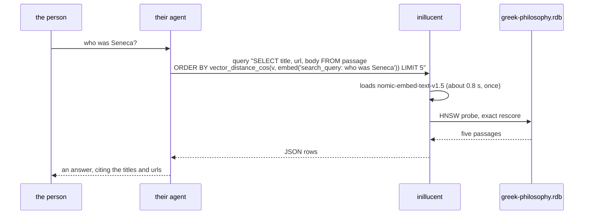

# task-1907 — A RAG example an agent can run

## Introduction

There is no way to try inillucent's retrieval half in under a minute. The documentation explains
`VECTOR(768)` columns, `inillucent_hnsw`, `embed(TEXT)` and `setup-embeddings`, and every one of
those pages assumes the reader will assemble a corpus, embed it, and build a database before
anything can be searched. That is hours of work before the first question gets an answer, and it is
the work that has nothing to do with the engine.

This task adds `examples/rag-agent/`: a database of Greek philosophy that is **already built and
already embedded, checked into the repository**, plus the page an AI coding agent reads to learn the
two commands that search it. Someone clones the repository, runs one install command, and asks their
agent "who was Seneca". The agent embeds the question with the database's own engine, runs one
`inillucent query`, and answers from the passages that come back.

## Goals and Non-Goals

### Goals

- `examples/rag-agent/greek-philosophy.rdb` is committed, holds the text **and** the vectors, and is
  searchable with no build step.
- The only setup a user performs is `inillucent setup-embeddings all`.
- An agent with the example directory as its working directory can answer a question about Greek
  philosophy by running inillucent commands, with no code written and no MCP server configured.
- The README walks a person through it end to end and shows screenshots of an agent actually doing
  it.
- The corpus is a real subset of the Wikipedia material this repository's own grading corpus is
  built from, with its CC BY-SA 4.0 attribution carried beside it.
- Verified by running it against a local model — Qwen through llama.cpp, driven by opencode — rather
  than by reasoning about whether it would work.

### Non-Goals

- No new engine feature. The example is assembled from commands that already exist.
- No scoring, grading or benchmark. `docs/retrieval-quality.md` already carries the measured
  comparison; this is a demonstration, not evidence.
- No second example. RAG is the one the retrieval half is for.
- Not a general purpose Wikipedia search. Eighty articles on one subject, chosen so that the
  answers are checkable by a reader who knows the subject.

## Problem statement

The retrieval half of this engine is the half that is hard to evaluate from a document. A person
reading `docs/vector-search.md` learns the constructs; they do not learn whether a search returns the
passage they wanted, because there is nothing on their disk to search.

Three things stand between a new reader and a first query today:

1. **A corpus.** `scripts/fetch-public-corpus.sh` downloads Wikipedia dumps and GitHub clones. It
   produces 249 MB and takes a couple of minutes on a good connection, and it is built for grading,
   not for reading.
2. **Embeddings.** Embedding that corpus takes **seven minutes on two RTX 5090s** and eight to
   twelve hours on a laptop processor. Nothing about the engine is being evaluated during those
   hours.
3. **A working `embed()`.** This is the one that is a defect rather than a cost, and it is described
   in its own section below.

The consequence is that the fastest honest answer to "show me this doing retrieval" is currently
"clear an afternoon".

### The defect this example exposes: `embed()` is not in the shipped binaries

`inillucent setup-embeddings all` is a shipped command. It downloads 620 MB of ONNX Runtime and
`nomic-embed-text-v1.5`, verifies every byte against a pinned digest, and records a residency
profile. `docs/embeddings.md` then shows what to do with it:

```sh
inillucent --db notes.rdb query "SELECT length(embed('hello'))"
3072
```

Against the binaries this repository actually ships, that command answers:

```
Error [not_found]: no such function: embed
```

`embed(TEXT)` sits behind `--features embed` on `inillucent-cli`, and neither `packaging/release.ps1`
nor `packaging/release.sh` nor `packaging/release-all.ps1` passes it. So `setup-embeddings` installs
620 MB that the program which installed it cannot use. Measured on this box: the same CLI built with
the feature is **9.7 MB against 6.5 MB**, and `ort` is linked with `load-dynamic`, so a machine with
no ONNX Runtime installed still runs every command that does not embed.

The example cannot work around this — an agent that cannot embed a question cannot search by
meaning — so the feature is turned on in the release builds as part of this task.

## Architectural Overview

```mermaid
flowchart TD
  subgraph build["Built once, here, and committed"]
    dumps["Wikipedia CirrusSearch extracts<br/>enwiki + simplewiki"]
    select["scripts/select-corpus.py<br/>an explicit list of 80 titles"]
    jsonl["corpus/greek-philosophy.jsonl<br/>one record per article"]
    chunk["scripts/chunk-corpus.py<br/>sentence packed, title breadcrumb"]
    csv["corpus/chunks.csv"]
    build["scripts/build-database.sh<br/>inillucent create / import / batch"]
    rdb[("greek-philosophy.rdb<br/>passage + FTS5<br/>committed")]
    dumps --> select --> jsonl --> chunk --> csv --> build --> rdb
  end

  subgraph use["What a user does"]
    install["inillucent setup-embeddings all"]
    agent["their coding agent"]
    cli["inillucent query ... embed('search_query: ...')"]
    answer["an answer, with the passages it came from"]
    install --> agent --> cli --> answer
  end

  rdb -.read by.-> cli
```

The build side runs on this machine and its output is committed. The use side is the only half a
reader ever executes.

## Detailed technical sections

### The corpus

Source: the two extracts `scripts/fetch-public-corpus.sh` already produces, which are
`enwiki-articles.jsonl` (60,000 English articles from the 20251222 CirrusSearch content dump)
and `articles.jsonl` (81,740 Simple English articles), under whatever directory that script was
pointed at.

Selection is **one explicit list of titles**, written out in `scripts/select-corpus.py`: 80 articles,
Thales to Proclus, plus the concept pages the demonstration questions land on.

**It was a category rule first, and the category rule is why it is not one now.** The first version
selected on an allowlist of forty-five exact Wikipedia category names that all sounded unambiguous —
`Presocratic philosophers`, `Neoplatonists`, `Stoic philosophers`, `4th-century BC Greek
philosophers`. It produced 117 articles, among them **Ayn Rand, Karl Popper, Franz Brentano, John
Henry Newman and Mortimer J. Adler**, all filed under `Aristotelian philosophers`, along with
**Druze** and **Augustinianism** under `Neoplatonism` and **Michel de Montaigne** under `Skeptic
philosophers`. Those categories reach across two thousand years and no wording of the rule separates
their ancient members from their modern ones.

A reader of this example has to be able to say whether the corpus contains the answer to their
question before they trust the answer. A list of titles can be read in ten seconds. The articles a
category rule admits by mistake are exactly the ones a search returns when the corpus has nothing
better.

An article is taken from the English extract when it is there and from the Simple English extract
when it is not. The English extract stops at 60,000 articles, so several important pages — `Socrates`
and `Stoicism` among them — exist only in the Simple English one. Both sources are recorded per
article in the JSONL, so a reader can see which they are reading.

### Chunking

The CirrusSearch `text` field is one continuous string. It has no newlines, and the `heading` array
that comes with it **cannot be located inside the body** — measured on `Seneca the Younger`, five of
its first ten headings do not appear in the text at all. So there are no section boundaries to split
on and the example does not pretend there are.

Chunks are packed from sentence boundaries to a target of about 1,100 characters with one sentence of
overlap, and each chunk's stored text begins with its article title, following the convention
`tests/synthetic-corpus.md` states for the graded corpus: *every chunk carries its document title in
its own text*. That is what lets a keyword search for "Seneca" reach a chunk that only says "he".

### Schema

```sql
CREATE TABLE passage (
  id    INTEGER PRIMARY KEY,
  title TEXT NOT NULL,          -- the Wikipedia article
  url   TEXT NOT NULL,          -- where it came from, for attribution and for citing an answer
  body  TEXT NOT NULL,          -- "Title > the chunk"
  v     VECTOR(768)             -- nomic-embed-text-v1.5, full precision
);

CREATE VIRTUAL TABLE passage_fts USING fts5(id, title, body);
```

Both search paths are present on purpose. Semantic search answers "who was Seneca"; BM25 answers
"Metrodorus", a name that appears four times in the corpus and that no embedding will rank reliably.
An agent that can run both, and knows when to run which, is the demonstration.

**There is no HNSW index, and that is a finding rather than a choice.** The design above had one. It
is not in the built database because `CREATE INDEX ... USING inillucent_hnsw (v)` makes the search
return nothing — see "What the build found" below. At 2,661 passages an exhaustive cosine is
milliseconds, and `docs/vector-search.md` already says to build the index when it is slow rather than
before, so the example loses nothing by leaving it off.

### The build, in the product's own commands

`scripts/build-database.sh` runs nothing but the CLI. **8 minutes 28 seconds** end to end on this
box, of which about eight are the embedding.

```sh
inillucent create chunks.rdb
inillucent --db chunks.rdb import corpus/chunks.csv --table chunk
inillucent create greek-philosophy.rdb
inillucent --db greek-philosophy.rdb batch "CREATE TABLE passage (...); CREATE VIRTUAL TABLE passage_fts ..."
INILLUCENT_EMBED_RESIDENCY=resident \
  inillucent --db greek-philosophy.rdb batch "
    ATTACH 'chunks.rdb' AS staging;
    INSERT INTO passage (id, title, url, body, v)
    SELECT CAST(id AS INTEGER), title, url, body, embed('search_document: ' || body) FROM staging.chunk;
    DETACH DATABASE staging;"
inillucent --db greek-philosophy.rdb import corpus/chunks-fts.csv --table passage_fts --skip 1
inillucent --db greek-philosophy.rdb checkpoint
```

The chunks are staged in a **second database file** rather than in a table beside the passages,
because a dropped table leaves its pages behind as free space and there is no `VACUUM` to reclaim
them: measured here, 2.9 MB of CSV left 3.4 MB of nothing in the file that gets committed.

The full-text table is loaded from its own CSV rather than copied across from `passage`, because
`INSERT INTO <virtual table> ... SELECT` is refused with the `unsupported` status and exit code 3.

Three more details decide whether this works at all.

**`INSERT ... SELECT`, never `INSERT ... VALUES`.** A registered function in a `VALUES` row, an
`UPDATE ... SET` or a `RETURNING` clause is refused with the `unsupported` status and exit code 3:
the write path builds its row space from a layout rather than from a catalog, so there is no function
body to look up. The `SELECT` form goes through the read path.

**`INILLUCENT_EMBED_RESIDENCY=resident` for the build.** Opening a session on the weights costs 650
to 800 ms and an embedding through an open one costs 12 to 36 ms. One statement embedding every chunk
in one process pays the load once.

**The prefixes are the caller's job.** `embed(TEXT)` embeds the text it is given and adds nothing.
`nomic-embed-text-v1.5` is trained with `search_document: ` on stored text and `search_query: ` on
questions, so the build applies the first and every documented query applies the second. Getting this
wrong does not fail; it silently returns worse neighbours, which is why it is stated in the README, in
`AGENTS.md`, and in a comment in the build script.

### What the agent reads

`examples/rag-agent/AGENTS.md` — read automatically by opencode and Codex when that directory is the
working directory — and `CLAUDE.md` beside it, which is one line importing the same file. It carries
the two commands, the `search_query: ` rule, and the instruction to cite the `title` and `url` of
every passage it used.

### Enabling `embed` in the shipped builds

`--features inillucent-cli/embed` is added to the three release build invocations:
`packaging/release.ps1`, `packaging/release.sh`, and `$packages` in `packaging/release-all.ps1`.

The risk is the cross compiled targets. The feature pulls `tokenizers`, which pulls `onig` (C) and
`esaxx-rs` (C++), and `packaging/release-all.ps1` builds Linux and macOS through `cargo-zigbuild`.
So the change is **verified per target on this box** — the Windows native build first, then the
Linux x86-64 zigbuild — and a target that cannot build the feature keeps the build it has today,
with the gap named in the task rather than guessed at.

Measured on the Windows build: **9.7 MB against 6.5 MB**, and nothing at run time, because `ort`
links `load-dynamic` — a machine with no ONNX Runtime installed still runs every command that does
not embed.

## What the build found

Four defects, all in the path this example walks, all found by walking it. The first was expected
from reading the packaging scripts; the other three were not.

### 1. `inillucent import` has never worked

Not the CSV parsing — the verb. It builds the line `.import --csv "file" "table"`, and `.import`
parsed no options at all, so it read `--csv` as the file name:

```
$ inillucent --db app.rdb import chunks.csv --table chunk
Error [syntax]: Error: cannot open "--csv"
```

Every invocation, every file, every format. **`.import`'s only coverage was a shell script that
passed no options, and the verb always passes one**, so the suite underneath the broken layer was
green throughout. `.import` now reads `--csv`, `--ascii`, `--colsep`, `--rowsep`, `--skip` and `-v`,
refuses an option it does not know by name rather than treating it as the file, and `--rowsep` turned
the row terminator into a parameter instead of a hardcoded newline. `crates/inillucent-compat/tests/
cli_import.rs` runs the verb.

### 2. Adding a vector index made the documented search refuse

`ORDER BY vector_distance_cos(v, embed('…')) LIMIT k` over a plain column works. Put
`CREATE INDEX ... USING inillucent_hnsw (v)` on the column and the same query answers
`Error [unsupported]: … a call to the registered function embed from here`. The planner turns the
query into a probe of the index, and the probe vector is folded through a `Space` built with
`catalog: None`, so the function's body cannot be looked up. Every call site that plans a probe
already has a catalog; it was not passed. Fixed — `literal_value_in` in
`crates/inillucent-exec/src/physical.rs`, with the constant fold now able to evaluate a function call
rather than only literals and arithmetic.

### 3. A vector index loses its most recent writes when the database is reopened

With the refusal gone the query returned **no rows at all**. The index is empty, and the shape of it
is precise:

| what was done | `<index>_state.rows` in that session | after reopening |
|---|---:|---:|
| 3 rows inserted, then `CREATE INDEX` | 3 | **0** |
| index created first, then 20 rows inserted | 20 | **19** |

It is one fault wearing two faces: **the store's newest writes are not persisted**. A backfill
happens inside a single statement, so all of it is newest and all of it is lost; a run of inserts
loses only the last. Once a backfilled index has been lost this way it does not recover - later
inserts into the table do not reach it either, and it stays at zero for good.

**An empty vector index does not fail. It answers zero rows**, which is the failure class this engine
is explicitly built not to have. `docs/roadmap.md` item 14 carries it with the reproduction, and
`a_vector_index_does_not_survive_a_reopen` pins both halves - three rows in the session that built
the index, none after reopening - so fixing it is a deliberate change to a named expectation.

**The reopen is the whole test**, and the first version of it did not have one: it asserted inside
the session that built the index, read back the rows the backfill had just written, and concluded
the backfill worked.

### 4. `embed()` is called once per row

Nothing folds a constant call to a registered function, so the documented query embeds the same
sentence once for every row in the table. On this corpus: **65 seconds**, of which 64 are 2,661
identical embeddings. A one-row subquery embeds it once — **0.9 seconds**, same rows, and it is what
the example, its README and `AGENTS.md` all use:

```sql
SELECT p.title FROM passage p, (SELECT embed('search_query: ' || ?1) AS q) AS probe
ORDER BY vector_distance_cos(p.v, probe.q) LIMIT 5;
```

`FunctionFlags::deterministic` already exists and already says "the planner may call it once".
Nothing reads it, and `embed` is not registered with it. Roadmap item 15 says what closing it takes
and why it is not simply a fold in `translate`.

### And one number that was wrong in the first draft of the README

The draft claimed an answerable question's nearest passage sits near 0.35 and an unanswerable one's
near 0.55. Measured, that is only half true, and the half it gets wrong is the half that matters:

| question | nearest |
|---|---:|
| the allegory of the cave | 0.153 |
| who was Seneca | 0.186 |
| **what did Kant think about the categories of understanding** | **0.189** |
| what did the Stoics believe about death | 0.239 |
| the best recipe for sourdough bread | 0.441 |
| how do I configure a Kubernetes ingress controller | 0.533 |

A question from another subject stands out. A philosophy question this corpus cannot answer does not
— there is no Kant in it and Kant scores as close as Seneca. So the distance is worth acting on when
it is large and proves nothing when it is small, and the only thing that catches the Kant case is
reading the passages. That is now what the README's table says and what `AGENTS.md` instructs.

## Data flows



**The failure that matters here is the one that does not announce itself**: a question the corpus
cannot answer. Asked about Kant, the corpus has nothing, and a nearest neighbour search always
returns its k nearest rows however far away they are. The README says so plainly and `AGENTS.md`
instructs the agent to answer "the corpus does not cover that" rather than build a paragraph out of
five unrelated passages.

### Licensing

Wikipedia text is CC BY-SA 4.0. This repository currently avoids the question by not committing any
of it — `.gitignore` says so in as many words. Committing this subset changes that, so the licence is
satisfied the way it is meant to be: `corpus/ATTRIBUTION.md` lists every article with its URL and its
dump date, names CC BY-SA 4.0, and the README repeats it. The `.gitignore` rules for `*.rdb` and
`corpus.jsonl` get a narrow negation for this directory, with the reason written beside it.

## Alternatives considered

| option | why not |
|---|---|
| **Ship the corpus, let the user embed it** | Restores the cost the example exists to remove. Even at a resident 20 ms a chunk it is a minute of unexplained waiting on a fast machine, and eight to twelve hours on a laptop. |
| **Ship a script that downloads a prebuilt `.rdb` from the GitHub release** | Adds a second artifact to every release and a network dependency to the first five minutes of using the repository. The database is 20 MB; Git holds it. |
| **Use `inillucent-mcp` instead of the CLI** | Better ergonomics for an agent, and it needs the user to edit an MCP config before anything works. The CLI needs nothing. `AGENTS.md` points at the MCP server as the next step. |
| **A synthetic corpus instead of Wikipedia** | The point is that a reader can check the answers. Nobody can check an answer about a generated document. |
| **A larger corpus, thousands of articles** | Bigger commit, slower clone, and no more convincing: 60 articles already demonstrate that the right passage comes back, and `docs/retrieval-quality.md` is where scale is argued. |
| **Give `embed()` a second argument for the prefix** | A real improvement and a change to a shipped SQL function. Out of scope here; recorded as a follow up. |

## Testing strategy

Integration first, and every check runs the shipped commands rather than a library.

| # | check | how |
|---|---|---|
| 1 | the committed database answers a semantic question | `inillucent --db greek-philosophy.rdb query "... ORDER BY vector_distance_cos(v, embed('search_query: who was Seneca')) LIMIT 5"` returns `Seneca the Younger` in the top three |
| 2 | ten questions, ten expected articles | a script over a fixed question set, each naming the article that must appear in the top five — including one on Stoicism, one on the theory of forms, and one rare name that only BM25 finds |
| 3 | an unanswerable question is visibly unanswerable | ask about Kant; the returned distances are conspicuously worse than an answerable question's, and the README shows both |
| 4 | keyword search works | `inillucent --db greek-philosophy.rdb search 'Metrodorus' --table passage_fts --k 5` |
| 5 | the build is reproducible | `scripts/build-database.sh` rebuilds the database from the committed corpus and the rebuilt file answers check 1 and check 2 identically |
| 6 | the vectors match the text | every row's `vector_dims(v)` is 768 and the count of rows with a NULL vector is zero — the failure `embed-check` exists for, in the form this example can express |
| 7 | a real agent, end to end | opencode driving local Qwen, in `examples/rag-agent/`, asked "who was Seneca" and "what did the Stoics believe about death" with no further instruction. Screenshots go in the README. |
| 8 | the shipped build carries `embed` | after the packaging change, `dist/.../bin/inillucent query "SELECT length(embed('hello'))"` answers 3072 |

### What the runs showed

Checks 1 to 6 are `scripts/verify.sh` and all pass: 2,661 passages, every vector 768 wide, all ten
questions finding their article, `Metrodorus` found by BM25 in the two Epicurean articles, and the
distance table above.

Check 7 ran twice and the second run found something the first did not. **An agent with an
`inillucent` MCP server already configured reaches for it instead of the command line**, and on this
box that server is an older build pointed at another database. It has no `embed`, so the semantic
half silently disappeared and the agent fell back to keyword search — which returns passages, so the
failure reads as a thin corpus rather than as a missing function. It also held the file open, so the
command line could not have it either. `AGENTS.md` now says to use the command line for this even
when an MCP server is configured, and to report a locked database rather than quietly answering from
keyword search.

Re-run without that in the way, the agent embedded the question, ran the documented query, and
answered "what did the Stoics believe about death" out of Chrysippus on the soul as fire, Marcus
Aurelius on meeting death, and the Stoicism and Substance theory articles, citing each. Both
screenshots are in the README.

Checks 1, 2, 4 and 6 are a single shell script, `scripts/verify.sh`, so the example can be re-checked
after any engine change. It is not registered in `tests/selection.toml`: it needs the model installed,
and the testing standard is explicit that a suite which reports success when its prerequisite is
absent is worse than no suite.

## Risks

| risk | what it costs | what is done |
|---|---|---|
| Cross compiled targets cannot build `tokenizers`' C and C++ dependencies | a release build fails on Linux or macOS | verify per target on this box before committing the change; leave any target that fails as it is and name it |
| The committed `.rdb` goes stale against a file format change | the example stops opening | `scripts/build-database.sh` rebuilds it from the committed corpus in about a minute |
| 20 MB in the repository | a slower clone | one file, once, and the alternative is an afternoon per reader |
| CC BY-SA attribution is wrong or missing | a licence breach | `corpus/ATTRIBUTION.md` per article, with URLs and the dump date |
