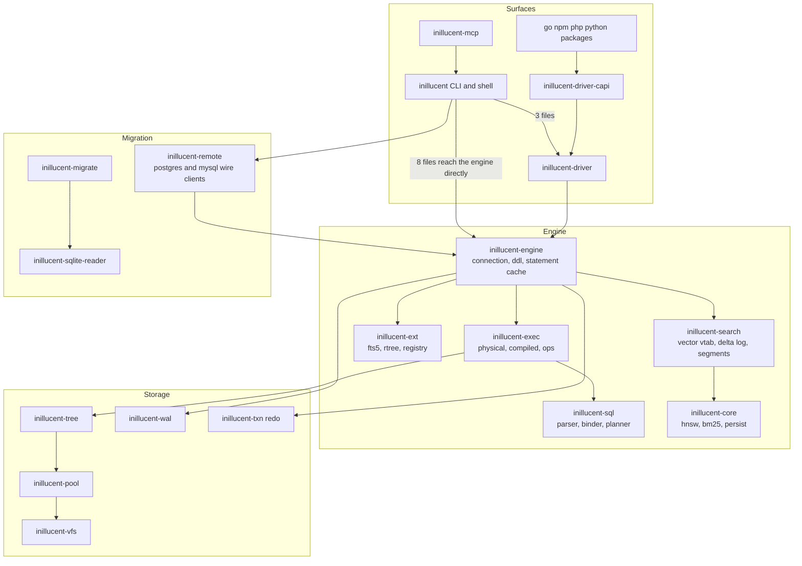
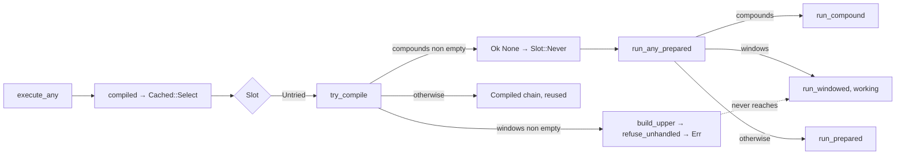
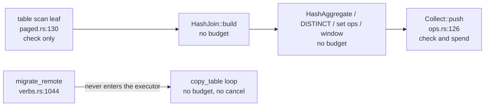

# task-1920 — inillucent code review: what to fix, and the order to fix it in

**Reviewed at commit `57c202b4865ac3ab5795c4a9c523d37da5080022`** (task-1911's last commit). Every
file and line number below is at that revision. task-1925 was editing documentation in the same
checkout while this review ran; the working tree held no changes to any file cited here when the
document was written, and each document finding in §5.9 was re-read at the pinned commit with
`git show`.

## Introduction

This is the second review of the inillucent workspace. The first (task-1892) found eleven defects and
task-1894 fixed them: path confinement, C API handle lifetimes, TLS on migration, the toolchain pin
and CI, MCP request budgets, release verification, bounded vector insertion. task-1911 then closed
eight roadmap items. This review starts where those stopped. It read every crate, the test harness,
the packaging, the language bindings and the agent documentation, and it reports what is wrong now,
with a file and line for each claim. Everything in `docs/roadmap.md` is deliberately not repeated
here.

The workspace is 400,000 lines of Rust across 27 crates plus two driver crates. The review was split
by subsystem: storage and durability, the SQL front end and executor, the engine and catalog, the
retrieval engine, the command line and language packages, and the assurance layer. Each finding
below was confirmed by reading the complete path; the ones marked *likely* were not traced to the
last line and say so.

The result is 41 findings, of which 12 are high. Five of the high findings are wrong answers or
process aborts on ordinary input. Three are tests that report green while checking nothing. The rest
are bounds that exist one layer down and are never reached from the surface an application uses.

## Goals and Non-Goals

**Goals.** The implementation ticket that follows this document is done when:

1. Every finding in §4 (high) is fixed and has the test named beside it, and that test fails on the
   commit before the fix.
2. Every finding in §5 (medium) is fixed or, where the finding is a design (M2, M3), the design is
   built as described.
3. Every document that this review found disagreeing with the code (§5.9) says what the code does.
4. `tools/validate.ps1 --strict` and `tools/validate.sh --strict` are green on a machine with the
   SQLite oracle built, and CI builds the oracle so that the same is true there.
5. The performance contract in `compat/perf/contract.toml` still passes after the changes. Two of the
   fixes (H6, M7) touch the executor's hot loops and one (H1) adds a check to the cached path; the
   gate is what says they cost nothing.

**Non-goals.**

- The performance bars in `docs/roadmap.md` items 1 through 6. They are measured, they have owners,
  and this review found nothing that changes their analysis.
- Threads inside one process (roadmap item 9), segmented generations (item 10), the FTS5 segment
  format (item 6) and the macOS build machine (item 11).
- Splitting the seventeen functions over 150 lines listed in §7. task-1894 split the largest and the
  size ratchet in `policy.rs` stops modules growing. This review recommends a function length ratchet
  rather than another mass refactor, because a refactor with no behaviour change is the change most
  likely to introduce one.
- Deleting the retired `inillucent-storage` and `inillucent-transaction` crates. §5.9 corrects what
  the code says about why they remain; the deletion is gated on the catalog rewrite in
  `tasks/task-1816-rearchitecture-tdd.md` Phase 5.

## Problem statement

Four things are true of the workspace today that were not visible from the roadmap.

**The cached execution path and the fresh execution path have drifted.** task-1911 added a compiled
chain that is reused across executions. It was built beside the original path rather than on top of
it, so there are now two dispatchers with two sets of exclusions. The fresh dispatcher routes a
window function to a working evaluator. The cached dispatcher does not know window functions exist
and refuses them. Every entry point an application uses goes through the cached dispatcher. The
compat manifest recorded the symptom as "the engine refuses every window function" and reclassified
the capability as missing. The same drift exists at a smaller scale in constant folding: the row
evaluator promotes integer overflow to REAL, the seek key folder wraps.

**Bounds exist one layer down and are not reached.** The request budget counts rows and bytes at the
result sink, so a hash join can build an unbounded table before the first row is counted. A cancel
flag exists in the driver and is honoured by the executor, but the command line and the MCP server
arm a fresh flag per call that nothing can flip. A remote migration bypasses the budget entirely and
holds the single threaded MCP server for its whole duration. Two decoders allocate from a length read
out of untrusted bytes before checking the bytes are there.

**The assurance layer reports green for suites that did not run.** Sixty nine differential tests
across ten files return early with a message when the SQLite oracle is absent. The strict runner
recognises that message, so `--strict` fails without the oracle, and nothing in CI builds the oracle.
Either CI is red and ignored, or the strict runner is not what gates a merge. Two other skip phrasings
are not recognised at all, and one of them is the TLS verification suite. The governed crate list
omits the one crate that may write `unsafe`, the crate that parses network bytes, and the crate that
decodes the retrieval index from disk.

**Documents claim what the code does not do.** The generated compat report says window functions and
commit hooks pass; the manifest it is generated from says missing. The C ABI manifest says `cancel`
returns unsupported; the header and the implementation say it works. Two agent skill pages name a
JSON field `elapsedMs` that the code emits as `elapsed_ms`. The Go and PHP installers ask for a macOS
archive by a name the release never publishes.

## Architectural overview

Two things in this picture are findings in themselves. The command line reaches `inillucent-engine`
directly from eight files and the driver from three, so the driver is not the one surface the
driver's own README says it is (M1). And `inillucent-core` sits under the engine, decodes bytes from
the database file, and is outside every lint and policy check the engine crates are held to (H9).

The two execution paths, which are the root of H1 and H7:

Where the request budget is charged today, which is H6 and H11:

## 4. High findings

Each entry names the site, what the code does, what a user sees, the change, and the test that
fails before the change and passes after it. Test placement follows `tests/inillucent-testing-tdd.md`
§2.1. Every new `tests/*.rs` file needs a row in `tests/selection.toml`.

### H1. Window functions are refused by the cache layer and nowhere else

- **Where.** `crates/inillucent-exec/src/compiled.rs:409` (`try_compile` bails on `plan.compounds`
  only), `crates/inillucent-exec/src/physical.rs:4792-4799` (`prepare_any` bails on both compounds
  and windows), `physical.rs:4808-4821` (`run_any_prepared` routes windows to `run_windowed`),
  `physical.rs:2018-2026` (`refuse_unhandled`), `crates/inillucent-engine/src/plans.rs:226`
  (`try_compile(...)?` propagates the refusal).
- **What happens.** `execute_any` builds a `Cached::Select` for every `SELECT`. `try_compile` has no
  check for `plan.select.windows`, so a windowed statement reaches `build_upper`, which calls
  `refuse_unhandled`, which returns `unsupported("a window function reaching the pipeline
  builder")`. That error propagates out of `run_cached_query` through `?`. It never reaches the
  `Slot::Never` fallback that a compound gets, so `run_windowed` is never called from any application
  entry point. `run_windowed` is about a thousand lines and is reachable from `run_with`, which only
  tests call.
- **What a user sees.** Every window function is refused with exit code 3. `compat/sqlite-3.53.4.toml`
  rows `sql.select.window` and `functions.window` were moved to `missing` on that evidence, with the
  note "a genuinely missing capability". The capability is not missing.
- **Change.** In `try_compile`, mirror `prepare_any`: return `Ok(None)` when
  `!plan.select.windows.is_empty()`. Then grade `run_windowed` against the oracle by restoring the
  `windows_match_the_oracle` cases that `advanced_sql.rs:326-335` retired, on the shipping engine.
  Flip the two manifest rows back to `pass` only if the oracle grading passes; if some frame or
  bound forms fail, keep the rows `missing` and record which forms, in the manifest note.
- **Test.** `crates/inillucent-compat/tests/compiled_chain_reuse.rs`, a case through its own
  `assert_cache_agrees_with_fresh` with `SELECT a, row_number() OVER (ORDER BY id) FROM t`. Today the
  cached call errors and the fresh call answers. Plus the revived oracle grading in
  `advanced_sql.rs`.
- **Confidence.** Confirmed by reading the complete path.

### H2. `batch` claims all or nothing and runs each statement in autocommit

- **Where.** `crates/inillucent-cli/src/command/registry.rs:535-538` ("Either all of them take
  effect or none of them do"), `crates/inillucent-cli/src/command/verbs.rs:273-292`,
  `crates/inillucent-cli/src/shell.rs:787-791`, `crates/inillucent-engine/src/connect.rs:416-440`
  (`execute_batch`, a loop of `execute_any` with nothing around it).
- **What happens.** Nothing opens a transaction. Each statement commits as it succeeds. The engine's
  transaction marker `batch` is set only by an explicit `BEGIN` (`lib.rs:2428`).
- **What a user sees.** `inillucent batch "INSERT ...; INSERT ...; GARBAGE"` leaves two rows committed
  and reports failure. The MCP tool `inillucent_batch` carries the same description.
- **Change.** In `verbs::batch`, if `connection().in_transaction()` is false, run `BEGIN` before the
  script, `COMMIT` on success and `ROLLBACK` on any error, and let an explicit `BEGIN` inside the
  script be refused by the engine's existing "cannot start a transaction within a transaction". If a
  transaction is already open, run the script inside it and do not commit; say so in `detail`.
- **Test.** A test in `crates/inillucent-compat/tests/` driving the real `inillucent` binary: a batch
  whose second statement fails, then a query asserting the first statement's row is absent. Today the
  row is present.
- **Confidence.** Confirmed.

### H3. A failed `ALTER TABLE ADD COLUMN` or `REINDEX` leaves the catalog and the tree disagreeing

- **Where.** `crates/inillucent-engine/src/ddl.rs:2159-2280` (`alter_table`), `ddl.rs:2408-2518`
  (`rebuild_table_tree`), `ddl.rs:2459` (`constant_default`, evaluated whether or not the table has
  rows), `ddl.rs:1012-1035` (`rewrite`, whose `WalLog.undo` is `open.then_some(&self.undo)` and
  `open` is true only inside an explicit transaction), `ddl.rs:2529-2607` (`reindex`).
- **What happens.** `alter_table` calls `rewrite` (catalog text now has the column), then
  `rebuild_tables` (the connection's schema now has the column), then `rebuild_table_tree`. Inside
  the last, `constant_default` runs `SELECT <default>` through the engine and can fail. The failure
  propagates with `?`. Nothing undoes the catalog write: outside an explicit transaction `rewrite`
  records no undo image, and `execute_ddl` has no rollback wrapper, unlike `write()`'s `abandon()`.
  `next_txn` was not advanced because `seal()` was never reached, so the half written records are
  committed by whatever the next successful statement commits. `REINDEX` has the same shape across
  several indexes.
- **What a user sees.** `ALTER TABLE t ADD COLUMN b INTEGER DEFAULT (no_such_function())` errors, and
  afterwards `PRAGMA table_info(t)` lists `b` while the tree has no such column. On an empty table
  the binder's eager check at `ddl.rs:2177-2183` does not fire, so this is reachable on the first
  `ALTER` a user runs.
- **Change.** Two parts. First, evaluate every `DEFAULT` before the first catalog write, so the
  ordinary failure has no side effect. Second, give DDL the statement atomicity DML has: take the undo
  floor before the first write of `alter_table`, `reindex` and any multi write directive, and on
  `Err` call `undo_to_floor(floor, true, txn)` before propagating. That requires `record`, `rewrite`
  and `forget` to pass `Some(&self.undo)` outside a transaction too.
- **Test.** `crates/inillucent-compat/tests/schema_forms.rs`, tier differential: the statement above,
  asserted to fail, then `SELECT * FROM t`, an `INSERT INTO t(a)`, and `PRAGMA table_info(t)` all
  behaving as if the `ALTER` never ran, and a reopen agreeing. A second case for `REINDEX` where the
  second index's rebuild is made to fail.
- **Confidence.** Confirmed for the ordering and the undo gate. The exact behaviour of a read against
  the mismatched layout was not traced into `inillucent-exec`.

### H4. The retrieval segment reader allocates up to 1 TiB from a length read out of the file

- **Where.** `crates/inillucent-core/src/persist.rs:747-772` (`read_section`), reached from
  `crates/inillucent-search/src/merge.rs:777-793` (`load_segment_bytes`) on an ordinary `SELECT`.
- **What happens.** The 8 byte length is checked against `CEILING = 1 << 40` and then
  `vec![0u8; length as usize]` runs before `read_exact` finds out whether the file has the bytes. A
  claimed length between a few gigabytes and a terabyte aborts the process through
  `handle_alloc_error`, which is not a `Result`. The function's own doc comment says this is the
  failure it exists to prevent. Compare `MAX_PART_LIST = 100_000_000` a few hundred lines later.
- **What a user sees.** One corrupt or crafted byte in a `.rdb` segment row aborts the whole process
  instead of returning `inillucent_search: unreadable segment`.
- **Change.** Bound the section length by the remaining bytes of the source when the source is
  seekable, and otherwise read in fixed chunks with `Read::take` so `UnexpectedEof` fires before any
  allocation larger than the chunk. Lower `CEILING` to something a section can need.
- **Test.** In `persist.rs`'s test module: a header followed by a section length of 2 GiB and four
  real bytes, asserting `read_index` returns `Err`. Today it aborts. `inillucent-core` is pinned by
  the baseline tool, so this change is a declared amendment with `--ticket`.
- **Confidence.** Confirmed.

### H5. The MySQL client sizes a `Vec` from an unchecked server sent column count

- **Where.** `crates/inillucent-remote/src/mysql.rs:403-410` (`stream_query`), `mysql.rs:799-801`
  (`decode_row`), `mysql.rs:887-896` (`lenenc_read`, up to `u64::MAX`).
- **What happens.** `Vec::with_capacity(columns)` runs on the decoded count. The 256 MiB message cap
  in `stream.rs` bounds the packet, not a number inside it. A twelve byte packet claims `u64::MAX`
  columns.
- **What a user sees.** A migration against a hostile or buggy server, or through a proxy, panics
  with capacity overflow or requests an allocation that exhausts memory, before the first row.
- **Change.** Refuse a column count above 4096 (MySQL's own limit) with the existing `protocol(...)`
  error, in both sites. Audit `postgres.rs:844,869` (`decode_row_description`, `decode_data_row`)
  for the same shape.
- **Test.** In `mysql.rs`'s test module: a hand built first packet with a lenenc count of
  `10_000_000`, asserting an `Err` naming the count.
- **Confidence.** Confirmed.

### H6. The request budget is charged at the result sink only

- **Where.** `crates/inillucent-exec/src/ops.rs:126-127` (`Collect::push`, the only `spend`),
  `crates/inillucent-exec/src/paged.rs:130` (scan leaf, `check` only), `join.rs:372-388`
  (`HashJoin::build`, nothing), `aggregate.rs`, `setop.rs`, `window.rs`, `recursive.rs` (nothing).
- **What happens.** The MCP server's 10,000 row and 256 MiB caps in `Limits::served()` bound what is
  handed back, not what is materialised. A join whose build side is the large table materialises all
  of it first. The only backstop is the wall clock at scan leaves.
- **Change.** Call `budget::check()` and, per row or batch, `budget::spend(rows, bytes)` inside
  `HashJoin::build`, the hash aggregate, the distinct accumulator, set operation dedup, window
  partition buffering and recursive CTE accumulation. Make `spend` count materialised bytes, and keep
  the sink's count of handed back rows separate so `Rows::total` stays exact.
- **Test.** `crates/inillucent-compat/tests/budget.rs` (new, tier engine): arm a small byte budget,
  run a join whose build side exceeds it while the output is one row, assert the statement is refused
  before it completes. Today it completes.
- **Confidence.** Confirmed.

### H7. The seek key folder wraps on integer overflow while the row evaluator promotes to REAL

- **Where.** `crates/inillucent-exec/src/constant.rs:188-197` (`fold`, `wrapping_add` and
  siblings), `crates/inillucent-exec/src/expr.rs:1044-1058` (`integer_arith`, checked with a fall
  back to `f64` and a comment saying both paths route through it so they cannot drift).
- **What happens.** `WHERE id = 9223372036854775807 + 1` folds the key to `i64::MIN`.
- **What a user sees.** If a row has rowid `i64::MIN`, it is returned. Otherwise an empty result that
  is correct by accident. `docs/feature-comparison.md:641` claims overflow becomes real everywhere.
- **Change.** Have `fold` call `integer_arith`. Delete the third implementation.
- **Test.** A unit test in `constant.rs` (it has none) folding `i64::MAX + 1` to
  `Real(9223372036854775808.0)`, and a differential case inserting a row at rowid `i64::MIN` and
  asserting the query above returns nothing.
- **Confidence.** Confirmed.

### H8. The parser's expression depth limit is declared and never enforced, and identifier interning is quadratic

- **Where.** `compat/limits.toml:40-46` (`ExprDepth`), `crates/inillucent-sql/src/parser/mod.rs:258-277`
  (`enter`/`leave` charge `ParserDepth` only), `crates/inillucent-sql/src/parser/expr.rs:557-572`,
  `crates/inillucent-sql/src/ast.rs:1264-1283` (`intern`, a linear scan of every name so far, with
  no count limit), `ast.rs:1258` (`charged_bytes`, read by a unit test only).
- **What happens.** A flat chain `a1=1 AND a2=2 AND ...` enters and leaves `parse_expr_bp` per term,
  so the recursion counter never accumulates, and the AST grows one level per term with nothing
  counting it. Every identifier scans every prior identifier, so N distinct names cost N² comparisons.
- **What a user sees.** Untrusted SQL text under the 1 GiB `SqlLength` default can hang the parser or
  overflow the stack of a later recursive walker. SQLite refuses at depth 1000.
- **Change.** Charge `Limit::ExprDepth` at `Ast::add_expr` by tracking each node's depth. Replace
  `intern`'s scan with a hash map keyed on `(folded, quote)`, and enforce a count limit at the same
  site.
- **Test.** Beside `adversarial_depth_is_refused_rather_than_crashing` in
  `crates/inillucent-compat/tests/syntax.rs`: a lowered `ExprDepth` and a flat chain, asserting a
  refusal; and a chain of 200,000 distinct identifiers asserting either a refusal or a parse under a
  bounded time.
- **Confidence.** Confirmed for the missing enforcement. The downstream overflow is likely.

### H9. The governed crate list omits the crates where the rules matter most, and one listed crate does not carry them

- **Where.** `crates/inillucent-compat/tests/policy.rs:18-49` (`GOVERNED`, 20 crates),
  `policy.rs:271-279` (`every_governed_crate_denies_undocumented_items`, a substring match),
  `crates/inillucent-scalar/src/lib.rs:44-53` (no `deny` for the four lints; the `cfg_attr(test,
  allow(...))` block mentions their names, which satisfies the substring match),
  `crates/inillucent-scalar/src/geopoly.rs` (22 direct index expressions),
  `crates/inillucent-core/src/lib.rs` (no lint attributes; 195 `unwrap`, 16 `expect`, roughly 470
  index sites; decodes the retrieval index from the file), `crates/inillucent-alloc/src/lib.rs` (the
  one crate allowed `unsafe`, no `tests/` directory, not in `GOVERNED`, not in `UNSAFE_CRATES`),
  `crates/inillucent-remote/src/lib.rs:52-56` (claims `policy.rs` checks its `SAFETY` notes; it does
  not, because the crate is not in `GOVERNED`; `tls/unix.rs` and `tls/windows.rs` hold 72 `unsafe`
  occurrences).
- **Change.** Add `inillucent-alloc`, `inillucent-remote`, `inillucent-migrate`, `inillucent-core`,
  `inillucent-driver` and `inillucent-driver-capi` to `GOVERNED`. Add the two TLS files and the
  allocator to `UNSAFE_ALLOWED` with their notes. Add the four `deny` lines to `inillucent-scalar` and
  rewrite `geopoly.rs`'s indexing with `get`. Change the policy test to match the literal
  `#![deny(clippy::<lint>)]` attribute. For `inillucent-core`, add the four `deny` lines and fix what
  clippy then reports; this is the largest single piece of work in the ticket and is a declared
  baseline amendment. Where an `unwrap` is on a path that cannot fail, the house pattern is a
  `get(..).ok_or_else(corrupt)` with the reason.
- **Test.** The existing policy suite, which fails the moment the list grows until the crates comply.
  A new `crates/inillucent-alloc/tests/concurrency.rs` that allocates on one thread and frees on
  another across every size class, because the crate's doc comment claims that is safe and nothing
  exercises it.
- **Confidence.** Confirmed.

### H10. The strict runner cannot see the oracle gated suites in CI, and misses two skip phrasings

- **Where.** `crates/inillucent-compat/tests/new_engine_ddl.rs:220-230` (`no_oracle`, an `eprintln`
  and a return; 69 tests across 10 files use it or an inlined copy),
  `crates/inillucent-compat/src/bin/testrun.rs:1093-1110` (the six recognised phrases),
  `.github/workflows/ci.yml` (no step runs `tools/sqlite-reference.*`; `.sqlite-ref/` is ignored),
  `tools/validate.ps1:141` and `tools/validate.sh` (run `--strict`, never build the oracle),
  `crates/inillucent-remote/tests/transport.rs:251-374` (`"...; case skipped"`, not recognised),
  `crates/inillucent-core/src/embed_onnx.rs:1037-1303` and `crates/inillucent-bench/src/models.rs:341`
  (`"skipping: ..."`, not recognised).
- **What happens.** Without the oracle, 69 differential tests pass with zero assertions. Their
  message does contain "is not built", so `--strict` should count them and fail, and nothing in CI
  builds the oracle. So either the CI `validate` job fails on every run and is not gating anything,
  or a runner outside the repository provisions the oracle. The repository cannot say which. The TLS
  suite's message contains neither phrase, and its binary runs other tests, so it is invisible to
  `--strict` by both routes: a CI image without Python's `ssl` module passes the TLS verification
  suite without running it.
- **Change.** Add a stage to both `validate` scripts that runs `tools/sqlite-reference.*` before the
  tests, and confirm CI is green with `--strict` afterwards. Replace the phrase list with one marker:
  every skip site ends its message with `; skipping`, and a test in `policy.rs` greps every test file
  for an `eprintln!` followed by an early `return` and asserts the marker is present. Make
  `no_oracle()` and its copies `panic!` under `--strict` rather than return, by reading the same
  environment variable the runner sets.
- **Test.** The `missing_prerequisites` unit tests in `testrun.rs`, with the literal transport and
  ONNX messages, classified hollow. And a green CI run whose log shows the oracle stage.
- **Confidence.** Confirmed for the code. Speculative on what a runner outside the repository does.

### H11. Cancellation cannot be reached from the command line or MCP, and a remote migration bypasses the budget

- **Where.** `crates/inillucent-cli/src/command/mod.rs:599-604` (`run` arms a fresh, unshared
  `AtomicBool` per call and drops it), `crates/inillucent-cli/src/mcp.rs:218-272` (`serve`, one
  request at a time, blocked inside the command), `drivers/inillucent-driver/src/lib.rs:598-620`
  (`Connection::cancel`, correct and unused by any front end),
  `crates/inillucent-cli/src/command/verbs.rs:1007-1049` (`migrate_remote` calls
  `inillucent_remote::migrate::migrate` directly), `crates/inillucent-remote/src/migrate.rs:661-702`
  (`copy_table`'s loop, no `budget::check`).
- **What happens.** Nothing can flip the flag the executor reads. The MCP server cannot read a
  `notifications/cancelled` message while a call runs. A migration runs outside the executor, so the
  60 second deadline never fires, and the server is held for hours.
- **Change.** Give `Context` one `cancel: Arc<AtomicBool>` per session. In `inillucent-mcp`, read
  stdin on a second thread so a cancellation notification for the running request flips the flag.
  Wire `Ctrl+C` in `inillucent` and `inillucent-shell` to the same flag. Pass the armed limits into
  `inillucent_remote::Plan` and call `budget::check()` in `copy_table` per batch.
- **Test.** An MCP integration test in `crates/inillucent-compat/tests/mcp*.rs` that starts a slow
  statement, sends the cancellation from a second writer, and asserts an interrupted status before
  the statement would finish. A test in `crates/inillucent-remote/tests/` that arms a one second
  budget and asserts a migration stops with the budget error.
- **Confidence.** Confirmed.

### H12. Packaging: two installers ask for archives that do not exist, two default to the newest binary, and none of the packages run in CI

- **Where.** `packages/go/cmd/inillucent-install/main.go:51-68,281-285` and
  `packages/php/bin/inillucent-install:57-68,89-109` (macOS resolves to `aarch64-apple-darwin` or
  `x86_64-apple-darwin`), `packaging/macos/release-macos.sh:88,240` (uploads only
  `universal-apple-darwin`), `packaging/install.sh:74-77` (does it right), `main.go:70-80,255` and
  `inillucent-install:89-99` (no version given means `downloads/VERSION` or `releases/latest`),
  `.github/workflows/ci.yml` (no `packages/` job, no `macos-latest` leg), `tools/validate.ps1:111-114`
  (the smoke stage runs the build and the runner as two statements with no exit code check between,
  so a stale `inillucent-testrun` passes smoke after a failed build), `packaging/stage-layout.ps1:217-240`
  (`Update-Sha256Sums` writes CRLF, the bug `PUBLISHING.md` records as fixed in `release.ps1`),
  `packages/npm/inillucent/resolve.mjs:20-26` (no `linux-arm64` though the release builds it).
- **Change.** Resolve macOS to the universal archive in Go and PHP. Embed the native version each
  wrapper was tested against and require an explicit flag for newest. Add a CI job per package that
  builds against the fresh native library and runs the package's tests. Add a `macos-latest` leg.
  Guard `$LASTEXITCODE` in the smoke stage. Make `Update-Sha256Sums` write LF. Add `linux-arm64` to
  npm.
- **Test.** A test per installer that builds the download URL for `darwin/arm64` and asserts it names
  the file `release-macos.sh` produces. The CI jobs themselves.
- **Confidence.** Confirmed for Go, macOS naming, CI and validate.ps1. Likely for PHP's version
  default and the CRLF site, which were read by a sub review and not re read byte for byte.

## 5. Medium findings

### 5.1 M1. The driver is not the one surface, and its API is missing the shapes an application needs

- **Where.** `crates/inillucent-cli/src/{command/mod.rs,command/verbs.rs,commands.rs,dbconfig.rs,diagnose.rs,import.rs,mcp.rs,shell.rs}`
  import `inillucent_engine` directly; `drivers/inillucent-driver/src/lib.rs:443-466`
  (`transaction` takes a fixed list of write statements), `lib.rs:387-398` (`execute_batch("BEGIN")`
  is the only interactive escape and the nesting guard does not see it), no `impl Drop` anywhere,
  `lib.rs:855-872` (`bind_all`, positional only, while `connect.rs:627-635` already exposes
  `parameter_names`), `crates/inillucent-engine/src/plans.rs:122-134` (the statement cache inserts
  unconditionally, keyed by SQL text, cleared only on schema change or function registration, with
  no accessor and no bound), `drivers/inillucent-driver/src/error.rs:36-40` and `value.rs:41-46`
  (`Status` and `ValueKind` promise additions are compatible and are not `#[non_exhaustive]`),
  `drivers/inillucent-driver/src/lib.rs` (no tests in the file; the four files under `tests/` never
  call `transaction`, `prepare` or `cancel`).
- **Change.** Add `Connection::begin() -> Transaction<'_>` whose `Drop` rolls back unless
  `commit()` or `rollback()` ran; have `transaction()` call it. Add `query_named` and `bind_named` on
  `parameter_names`. Bound the statement cache (an LRU by count, default in `OpenOptions`) and expose
  a count and a clear. Mark the two enums `#[non_exhaustive]`. Write `drivers/inillucent-driver/tests/transaction.rs`
  and `tests/statement.rs`. Then move the command line onto the driver: each of the eight files should
  reach the engine through `inillucent_driver` unless it needs something the driver does not offer,
  in which case the driver gains it. This is what makes the driver's README true.
- **Test.** A dropped uncommitted `Transaction` followed by a reopen shows no row. A named bind
  returns the right row. A `policy.rs` row that lists which `inillucent-cli` files may name
  `inillucent_engine`, ratcheting down.

### 5.2 M2. The virtual table lifecycle: `begin` fires once, `savepoint` and `release` never

- **Where.** `crates/inillucent-ext/src/vtab/mod.rs:184-250` (the trait),
  `crates/inillucent-engine/src/vtab.rs:832-834` (the only `begin`, at `CREATE VIRTUAL TABLE`),
  `vtab.rs:2042-2043` (`sync_modules`, per commit), `vtab.rs:2143-2144` (`rollback` and `rollback_to`),
  `crates/inillucent-engine/src/lib.rs:2862-2917` (`savepoint` and `release` never call the module).
  FTS5's `begin` at `fts5/mod.rs:634-638` gates on `self.creating` and does nothing afterwards.
- **Design.** Call `begin(&mut context)` at the start of every write transaction that reaches a
  module, from the same loop `sync_modules` uses. Call `savepoint(level)` from
  `ImportedDatabase::savepoint` where it already calls `sync_modules`, and `release(level)` from
  `ImportedDatabase::release` before `self.marks` is truncated. Add a default no op
  `fn schema_changed(&mut self)` to the trait, called from `refresh_catalog` (`ddl.rs:494-582`), so a
  module that caches anything derived from the catalog knows to drop it. Add a default no op
  `fn committed_elsewhere(&mut self)` called from `enter` when `reloaded` is true, so a module knows
  another process committed since it last looked. Together these are the prerequisite
  `docs/roadmap.md` item 6 names for caching a manifest.
- **Test.** A counting module in `crates/inillucent-compat/tests/vtab_lifecycle.rs` (new, tier
  engine): two write transactions and one `SAVEPOINT`/`RELEASE` pair give counts 2, 1, 1. Today 1,
  0, 0.

### 5.3 M3. Recovery reads pages before redo outside the catalog root's repair pass (roadmap item 12, root caused)

- **Where.** `crates/inillucent-engine/src/recovery.rs:175-207` (`open_file`,
  `read_checkpointed_catalog` fetches through `Pool::fetch` and turns a checksum failure into `Err`),
  `crates/inillucent-txn/src/redo.rs:693-708` (`Applier::page_lsn` answers `Ok(None)` for an
  unreadable page precisely so redo can rebuild it).
- **Design.** Every eager page read in `open_file` before the redo pass goes through the same tolerant
  path `Applier::page_lsn` uses, or the tolerant first pass that exists for the catalog root runs
  unconditionally before any direct fetch. Page 4 at cut 7 of
  `crates/inillucent-compat/tests/free_map_checkpoint_crash.rs` is the reproduction; the fix is
  judged by that campaign passing under `PRAGMA journal_mode = off` where the log holds a record for
  the page, and by the `journal_mode = off` documentation in `crates/inillucent-pool/src/journal.rs`
  staying true for the case where it does not.
- **Confidence.** Likely. The two code paths are confirmed; the exact read site for page 4 was not
  pinned.

### 5.4 M4. Retrieval: vectors, flags, the scorecard and the baseline pin

- **NaN and infinity are accepted.** `crates/inillucent-search/src/store.rs:1027-1045` (`vector_of`
  checks width only), `crates/inillucent-core/src/hnsw.rs:96-134` (`partial_cmp(..).unwrap_or(Equal)`
  makes a NaN distance tie with everything, which is not a total order for `BinaryHeap`). Refuse a
  non finite component in `vector_of` with the same error the width check uses. Test beside
  `a_vector_of_the_wrong_width_is_refused`.
- **Two answers to a width mismatch.** `store.rs:1027-1045` refuses; `crates/inillucent-search/src/merge.rs:398-408`
  (`embedding_of`) zero pads or truncates silently. Narrow `embedding_of` to the zero length case it is
  used for and make any other mismatch an error. Test: a three wide row folded at width eight errors.
- **A live `assert!` on the 33rd flag name.** `crates/inillucent-core/src/store.rs:508-512`. Return an
  error. Test: 33 distinct flag names through `push_document`.
- **The scorecard never drives `inillucent-search`.** `crates/inillucent-bench/src/engine.rs:29-31`
  imports `inillucent_core::index::Index` and builds in one pass; `crates/inillucent-compat/src/bin/baseline.rs:43`
  pins `inillucent-core` and `inillucent-bench` only. The delta log, the publish rule, the segment
  merge cascade and the tombstones are the code that changed in the last four commits, and nothing
  measures their recall. Add `crates/inillucent-compat/tests/search_recall.rs` (new, tier engine):
  a synthetic corpus of a few thousand rows written through the virtual table across several flush,
  merge and compact cycles, with recall@10 asserted against the same rows through one
  `Index::build`, within a declared tolerance.
- **The baseline verifier is a multiset check.** `baseline.rs:354-373` tests whether a file's hash
  appears anywhere in the recorded JSON, so two pinned files swapping contents verify clean. Compare
  per path. Test: capture, swap two files, assert `verify` reports both.
- **No graph invariant tests.** `hnsw.rs:1430-1996` checks recall and the parallel degree cap; nothing
  asserts every node is reachable from the entry point after a sequential build, or the degree cap
  on the sequential build. Add both to the existing test module.

### 5.5 M5. FTS5 substitutes `unicode61` for any tokenizer name it does not know, including `trigram`

- **Where.** `crates/inillucent-ext/src/vtab/fts5/tokenize.rs:46-89` (`Tokenizer::named`, "an
  unrecognised name is read as unicode61"), `fts5/mod.rs:193-218` (no validation),
  `docs/feature-comparison.md:922` (claims tokenizer options pass).
- **Change.** Return `unsupported` by name from `Tokenizer::named` for a name this build has not got,
  propagated from `CREATE VIRTUAL TABLE`. Correct the comparison row. `trigram` itself is a separate
  feature to build; refusing it is the immediate fix.
- **Test.** A differential case: `tokenize='trigram'` with a substring `MATCH` against the oracle.
  Today inillucent answers with whole word semantics and no error.

### 5.6 M6. A correlated subquery inside an aggregate argument is refused

- **Where.** `crates/inillucent-exec/src/correlate.rs:335-356` (`gather_select` walks columns,
  filter, having, group by, order by, constraints, never `select.aggregates`), the equivalent walk in
  `subquery.rs::gather`, `crates/inillucent-sql/src/bind.rs:1213-1220` (`gather_columns` has the
  loop that is missing), `crates/inillucent-exec/src/physical.rs:6133` (the misattributed
  `unsupported("a correlated subquery used as a value")`).
- **Change.** Add the aggregates loop to both gathers.
- **Test.** `SELECT team, SUM((SELECT b.amount FROM b WHERE b.team = a.team)) FROM a GROUP BY team`
  in `advanced_sql.rs` against the oracle.

### 5.7 M7. Planner gaps with a cost cliff

- **`LIKE 'prefix%'` never seeks.** `crates/inillucent-sql/src/plan.rs:2782-2831` and
  `plan/seek_union.rs` match `BoundExpr::Compare` only; a pattern binds to `BoundExpr::Pattern`.
  Recognise an anchored `LIKE` or `GLOB` with no escape on an indexed column, extract the literal
  prefix, and emit the `>=`/`<` bound pair with the predicate kept as a residual, the way SQLite does.
  Planner test asserting `SEARCH ... USING INDEX`.
- **`IN (...)` seeks only on the leading column, and loses every seek past 512 values.**
  `plan/seek_union.rs:92-183` and `:14-22`. Accept an equality prefix ahead of the `IN` column, and
  above the branch cap fall back to a single index range with the list as a residual rather than to a
  full scan. Planner tests for `a = 5 AND b IN (1,2,3)` on `(a, b)` and for 512 versus 513 values.
- **Order preservation is gated on `is_lookup` only.** `physical.rs:2258-2300` (`space_of`),
  `:4527-4559` (`order_equivalents`), `:1662-1878`. An index nested loop preserves the outer order by
  the code's own comment, but only the rowid lookup shape is flagged, so a join followed by
  `ORDER BY` or `GROUP BY` on the outer key pays a full sort and a hash aggregate. Broaden the flag to
  any `IndexNestedLoopJoin` stage that is not materialised. This is the change most likely to move
  `read.join`, and the performance gate is what judges it.
- **`NestedLoopJoin::push` clones both rows before testing the condition.** `join.rs:1052-1093`.
  Test the condition over borrowed data and clone only a surviving pair, as `TopN::push` does.
- **Per row allocations in `HashAggregate::push`, the `DISTINCT` accumulator and `HashJoin::push`.**
  `ops.rs:698-736`, `aggregate.rs:365-379`, `join.rs:464`. Reuse a scratch buffer the way
  `StreamAggregate` and `HashJoin::build` already do.

### 5.8 M8. Scalar functions that silently do less than SQLite

- **`printf`'s `,` and `!` flags are consumed and ignored.** `crates/inillucent-scalar/src/printf.rs:100-111`.
  Implement thousands grouping for the integer conversions and the UTF-8 width for `%s`, and add
  `printf('%,d', 1234567)` to `core_functions_match_the_oracle`.
- **`datetime(x, 'localtime')` returns NULL and `'utc'` is a no op.** `crates/inillucent-scalar/src/datetime.rs:508-511`.
  The determinism choice is defensible; the manifest row `functions.date-time` marked `pass` with
  neither modifier in its test list is not. Add a manifest note, a comparison table row, and a test
  asserting the NULL so it cannot change unnoticed.
- **A literal's length limit is checked after the literal is copied.** `crates/inillucent-sql/src/parser/expr.rs:64-79`.
  Check the token span length before decoding.

### 5.9 M9. Documents that disagree with the code

| document | says | code says | fix |
|---|---|---|---|
| `compat/compat-report.md:180,222,288,290,298,306` | `sql.select.window`, `functions.window`, `vm.bytecode.verifier`, `vm.statement.interrupt`, `txn.writer-contention`, `txn.hooks` pass | `compat/sqlite-3.53.4.toml` marks all six `missing` | regenerate, and add a test that the report and the manifest agree per id |
| `drivers/abi.toml:65-71` | `inillucent_cancel` returns UNSUPPORTED | `capability.rs:377-387` says partial, `lib.rs:906-918` always `Ok` | correct the note; extend `tests/abi.rs` to flag a note saying UNSUPPORTED on a symbol the capability table says works |
| `drivers/inillucent-driver-capi/src/lib.rs:223-224` | "every entry point wraps its body in `guarded`" | 15 of 53 exported functions do | route all 53 through `guarded`, and a test that greps every `extern "C" fn` for it |
| `agent-skills/inillucent-quickstart/SKILL.md:88`, `agent-skills/inillucent-mcp/SKILL.md:74-75` | JSON field `elapsedMs` | `outcome.rs:246` emits `elapsed_ms` | correct; add a test diffing one real `--output json` result's keys against every JSON block under `agent-skills/` |
| `agent-skills/inillucent-mcp/SKILL.md:8`, `inillucent-embed/SKILL.md:116`, `inillucent-quickstart/SKILL.md:111` | 27 tools, 29 commands | 28 tools, 30 commands | generate the numbers from `COMMANDS.len()` |
| `crates/inillucent-remote/src/lib.rs:52-56` | `policy.rs` checks its SAFETY notes | it does not (H9) | true after H9 |
| `crates/inillucent-sqlite-reader/src/lib.rs:20-24` | the retired crates survive for this reader | `inillucent-catalog` depends on `inillucent-storage` too, in `load.rs`, `ddl.rs`, `rebuild.rs` | say so, and point at task-1816 Phase 5 |
| `crates/inillucent-pool/src/pool.rs:1494-1510` | the `advance_log` borrow is released around the call | the `Ref` is held through the call | either release it or say what the code does |
| `packaging/macos/README.md:14`, `packaging/release-all.ps1:20,161` | run `packaging/macos/sign-macos.ps1` | no such file | point at `release-macos.sh` and `notarize.sh` |

### 5.10 M10. PostgreSQL and MySQL date and time values migrate as session dependent text

- **Where.** `crates/inillucent-remote/src/postgres.rs:738-762` (`kind_of` buckets `date`, `time`,
  `timestamp`, `timestamptz` and `interval` as text), `postgres.rs:196-199` (startup sets
  `client_encoding` only), `crates/inillucent-remote/src/mysql.rs:705-724` and `:310` (no
  `time_zone`), `crates/inillucent-remote/src/migrate.rs:105-155` (`RowDigest` hashes the carried
  bytes).
- **What happens.** A `timestamptz` renders according to the session's zone and `DateStyle`, which the
  client does not set. Two migrations of the same table can carry different text, and the digest that
  proves the copy matched then fails on a resumed migration that copied correctly.
- **Change.** Send `timezone = UTC` and `datestyle = ISO, MDY` at PostgreSQL startup, and
  `SET time_zone = '+00:00'` beside the MySQL isolation level statement.
- **Test.** In the transport fixture: the same value carried under two session zones is byte identical.

### 5.11 M11. Testing gaps

- **`tests/selection.toml:541-560`.** `segmented_generations`, `segment_merge_bound` and
  `segment_delta_chain` cover `inillucent-search` only, and `inillucent-search` does not depend on the
  tree, pool, log or transaction crates, so a change to `leaf.rs` never selects the tests written to
  catch a half merged segment. Add the four crates to `covers`, and a `selection.rs` case asserting
  `affected(["inillucent-tree"])` includes them.
- **No crash campaign for `VACUUM`, overflow chains, `REINDEX` or a fresh HNSW or BM25 build.** The
  only fault injected `VACUUM` test drives the retired pager. Add `vacuum_crash.rs`,
  `overflow_crash.rs`, `reindex_crash.rs`, and a fresh build arm in `search_crash.rs`, on the
  pattern `search_crash.rs:363` establishes.
- **`Site::Allocate` is declared and never injected.** `crates/inillucent-sim/src/failpoint.rs:48-73`;
  `crates/inillucent-pool/tests/fault_campaign.rs:504-538` asserts three of nine sites were reached.
  Wire the site into free map growth, and assert all nine.
- **`ImportedDatabase::execute_statement` has no schema generation check.** `crates/inillucent-engine/src/lib.rs:3673-3688`
  versus `connect.rs:836-846`. Make the pair `pub(crate)` or add the check.
- **Fuzzing reaches five crates and runs nowhere.** `fuzz/Cargo.toml`; no workflow mentions it. Add
  targets for `mysql.rs::{Greeting::decode, decode_column, decode_row}`,
  `postgres.rs::{decode_row_description, decode_data_row}`, `crates/inillucent-cli/src/json.rs::parse`
  (the MCP request parser), and `crates/inillucent-search/src/store.rs::{decode_segments,
  decode_merge_state, decode_vector}`, each with a seeded never panics unit test beside the decoder,
  and a scheduled workflow that runs every target for a bounded time.
- **No generator based differential testing.** `crates/inillucent-compat/tests/new_engine_differential.rs`
  enumerates templates. Add `tests/tlp_differential.rs`: a random predicate tree from the fixture
  schema, the base query and its `IS TRUE`, `IS FALSE`, `IS NULL` partitions run against this engine
  alone, the union asserted equal to the base with no duplicates; and a NoREC arm that runs the same
  predicate as an indexed query and as a full scan with the predicate applied in the executor, asserting
  equal counts. Both catch optimiser defects the oracle comparison cannot, because SQLite shares none
  of this engine's planner.
- **`tests/timings.toml:59-61`** names `inillucent-compat::capi`, deleted in `cb1dba5`.
  `tests/selection.toml:1143-1155` tags `inillucent-model::campaign` and `::minimal` with
  `requires = ["onnx"]`, which they do not need. Add a check that every timing row names a live target.

### 5.12 M12. `extent.rs` mixes checked and bare multiplication

`crates/inillucent-pool/src/extent.rs:292` uses `saturating_mul`; `:311,338,370` use `*`. Bounded
today by `MAX_SLOTS` and `u16`. Make the three sites saturating so the file is consistent.

## 6. Low findings and recommended deletions

Nothing here is deleted by this review. Each is listed for a person to act on.

- `crates/inillucent-catalog/src/rebuild.rs` (169 lines) has no caller. The only `rebuild_into` call in
  the workspace is `inillucent_engine::rebuild::rebuild_into`. Its last caller was
  `inillucent-session`, which is gone. Deleting it and the `pub mod rebuild;` at
  `crates/inillucent-catalog/src/lib.rs:47` removes one of the catalog's reasons to link the retired
  storage crate.
- `tests/timings.toml:59-61`, the `inillucent-compat::capi` row.
- `_junk/` holds three retired interop tests kept by ruling (task-1838 §9); no action.
- `smoke-capi.rdb` and `smoke-capi.rdb-wal.0000000009` sit at the repository root, untracked and
  ignored. They are test output from a C ABI smoke run. Delete or move under `_agent_output/`.

## 7. Function and file sizes

Files over 3,000 lines: `inillucent-engine/src/lib.rs` 7,863; `inillucent-exec/src/physical.rs`
6,663; `inillucent-sql/src/bind.rs` 5,315; `inillucent-tree/src/leaf.rs` 5,175;
`inillucent-tree/src/paged.rs` 3,682; `inillucent-exec/src/dml.rs` 3,122.

Functions over 150 lines, longest first: `gradeembed.rs::run` 531; `physical.rs::translate` 512;
`perf.rs::plan_for` 457; `fullgate.rs::run` 407; `physical.rs::build_upper` 402;
`physical.rs::plan_stages` 360; `join.rs::IndexNestedLoopJoin::push` 354; `vtab.rs::rows_of_module`
331; `bind.rs::authorize` 315; `directive.rs::refusal` 313; `bind.rs::bind_expr` 305;
`bind.rs::is_aggregate` 274; `paged.rs::skip_scan` 249; `synth.rs::build_source` 247;
`bind.rs::bind_call_with` 241; `leaf.rs::encode_rows_with` 239; `dml.rs::update_at_cached` 223;
`dml.rs::insert_at` 217; `bind.rs::sources_used` 216; `write.rs::write_row` 206.

**Recommendation.** Add `no_function_grows_past_the_length_it_is_recorded_at` to `policy.rs`
beside the module ratchet, recording each function over 150 lines at its current length. New code
cannot add to the list, and each fix in this ticket that touches one of these functions (H1 touches
`try_compile`, M7 touches `plan_stages` and `build_upper`, M6 touches `translate`'s neighbours)
leaves it no longer than it found it.

## 8. Components and interfaces

The changes touch these interfaces. Nothing else in the public surface moves.

| interface | change | who reads it |
|---|---|---|
| `physical::try_compile` | one more `Ok(None)` condition (H1) | `plans.rs::run_cached_query` |
| `constant::fold` | calls `expr::integer_arith` (H7) | seek key builders |
| `budget::spend` | called from build side and accumulators (H6) | executor operators |
| `Context` in `inillucent-cli` | gains `cancel: Arc<AtomicBool>` (H11) | every verb, `mcp::serve` |
| `inillucent_remote::Plan` | carries limits (H11) | `migrate_remote` |
| `VirtualTable` | two default methods, `schema_changed` and `committed_elsewhere`; `begin`, `savepoint`, `release` called (M2) | FTS5, rtree, `inillucent_search` |
| `inillucent_driver::Connection` | `begin()`, `Transaction`, `query_named`, `bind_named`, cache accessors (M1) | C ABI, command line |
| `Tokenizer::named` | returns `DbResult` (M5) | `fts5/mod.rs` |
| `policy.rs::GOVERNED` | six more crates (H9) | the policy suite |
| `testrun.rs` skip marker | one phrase (H10) | every skip site |
| `Ast::intern`, `Limit::ExprDepth` | hash map, enforced (H8) | the parser |

### Data flows and security

The two decoders in H4 and H5 read bytes an attacker can control: a database file somebody else
could write to, and a network peer. After the change, both fail with a named error before any
allocation sized by the untrusted number. The fuzz targets in M11 keep them that way.

H6 and H11 are the bounds an agent host relies on: after the change, a `tools/call` cannot
materialise more than the byte budget in any operator, cannot run longer than the deadline in any
code path including migration, and can be stopped by a cancellation notification while it runs.

H9 is what makes the other bounds durable. A crate outside `GOVERNED` can regain an `unwrap` on an
untrusted path in a routine edit and no test says so. After the change, the same edit fails the
policy suite.

Error handling does not change shape anywhere: every new refusal uses the existing `unsupported`,
`corrupt`, `protocol` or `refusal` constructors and the existing status names, so the driver's
status table and `--output json` are unaffected.

## 9. Alternatives considered

- **Fix H1 by deleting the fresh path and making the cached path handle windows.** Rejected. The
  cached path exists to reuse a chain across executions, and a windowed statement buffers whole
  partitions, so there is nothing to reuse; routing it to `run_windowed` is the fresh path's own
  design. Deleting the fresh path would also remove the ground truth `compiled_chain_reuse.rs`
  compares against.
- **Fix H2 by rewording `batch` to say it is autocommit.** Rejected. The command's `detail` says it is
  for creating a schema and loading related rows, which is exactly the case a half applied script
  hurts, and the MCP tool inherits the description. Making it transactional matches what every caller
  was told.
- **Fix H3 by evaluating defaults up front only.** Considered as the minimum. It fixes the reachable
  case and leaves `REINDEX` and any future multi write directive with the same shape. The undo floor is
  the fix DML already has, and it is the one that stops the next instance.
- **Fix H9 by adding lints to `inillucent-core` piecemeal.** Rejected. The crate decodes the index
  from the file, and a partial set of `deny` lines leaves the path that matters unchecked. The cost is
  one large amendment; the baseline tool exists for exactly that.
- **Fix H10 by having CI skip `--strict`.** Rejected. That is the failure `--strict` was written to
  make visible.
- **Fix H11 by making the MCP server multi threaded.** Rejected for this ticket. A second reader
  thread that only flips a flag keeps the engine single threaded by construction, which the roadmap
  says it is, and delivers cancellation without a concurrency model change.
- **A mass split of the functions in §7.** Rejected in favour of a ratchet, for the reason in the
  non goals.

## 10. Testing strategy

Every fix carries the test named beside it. In addition:

1. **Differential.** The revived `windows_match_the_oracle` (H1), the `ALTER` and `REINDEX` failure
   cases (H3), the overflow seek (H7), the aggregate argument subquery (M6), the `trigram` refusal
   (M5), the `printf` and `datetime` cases (M8). All in `crates/inillucent-compat/tests/` against the
   pinned oracle, which CI now builds (H10).
2. **Generator based.** `tlp_differential.rs` with TLP and NoREC arms (M11), run on every
   `--changed` that reaches `inillucent-sql` or `inillucent-exec`.
3. **Bounds.** `budget.rs` for the build side (H6), the MCP cancellation test and the migration budget
   test (H11), the decoder tests for H4 and H5, and the parser tests for H8.
4. **Policy.** The governed list (H9), the literal `deny` match, the skip marker grep (H10), the
   report versus manifest check (M9), the `elapsed_ms` key diff (M9), the `guarded` grep (M9), the
   timing row check (M11), the function length ratchet (§7).
5. **Durability.** The four new crash campaigns and the nine site assertion (M11), the item 12
   campaign under `journal_mode = off` (M3).
6. **Retrieval.** `search_recall.rs` (M4), the NaN and width tests, the flag count test, the
   reachability and degree property tests, the baseline swap test.
7. **Driver and packages.** `transaction.rs` and `statement.rs` (M1), the installer URL tests and the
   per package CI jobs (H12).
8. **Performance.** `compat/perf/contract.toml` through the release gate after everything, and
   `inillucent-execprofile` in paired mode on `join.selective` before and after M7, because that is
   the change with a predicted effect and the paired mode is what can measure it on a busy box.

Verification of the ticket is `tools/validate.ps1` and `tools/validate.sh` with `--strict`, green,
with the oracle stage in the log.

## 11. Implementation order

The order puts wrong answers first, then the tests that would have caught them, then bounds, then
packaging, then API and lifecycle. Each phase ends with `inillucent-testrun --changed` green and a
commit that names the findings it closes.

| phase | findings | why here |
|---|---|---|
| A. wrong answers and aborts | H1, H7, H3, H2, H4, H5, H8, M6, M5 | each is a wrong answer or a crash on ordinary input, and each is a small change |
| B. the assurance layer tells the truth | H10, H9, M9, M11 selection and timings | the tests in every later phase depend on `--strict` meaning something and on the governed list covering the crates being changed |
| C. bounds and control | H6, H11, M8 literal check | the agent host contract |
| D. packaging and CI | H12 | independent of the engine; can run in parallel with C |
| E. API and lifecycle | M1, M2, M4, M10, M12 | larger changes with their own suites |
| F. planner | M7 | last because it is the change the performance gate has to judge |
| G. new coverage | M11 crash campaigns, fuzz, TLP and NoREC, `search_recall.rs`, M3 | written last so they run against the fixed code |

## 12. Acceptance criteria for the implementation ticket

1. Every test named in §4 and §5 exists, is registered in `tests/selection.toml`, and a note in the
   commit says which ones fail on the parent commit.
2. `sql.select.window` and `functions.window` in `compat/sqlite-3.53.4.toml` are `pass`, or the
   manifest note lists the exact forms that failed oracle grading.
3. `inillucent batch` with a failing script leaves nothing committed.
4. `GOVERNED` in `policy.rs` names 26 crates and the suite is green.
5. CI builds the SQLite oracle and `--strict` is green on Windows, Linux and macOS.
6. `compat/compat-report.md` is regenerated and a test ties it to the manifest.
7. A `tools/call` on `inillucent-mcp` can be cancelled while it runs, and a migration stops on its
   budget.
8. The Go and PHP installers resolve macOS to the universal archive and pin the native version.
9. `drivers/inillucent-driver` has `begin()` with a guard, named binding, a bounded cache, and tests
   for all three.
10. `compat/perf/contract.toml` passes on four consecutive runs after phase F, and the `read.join`
    lower bound is reported beside its previous 3.00x.
11. Nothing listed in §6 was deleted by the agent; each is in a task comment for a person.
