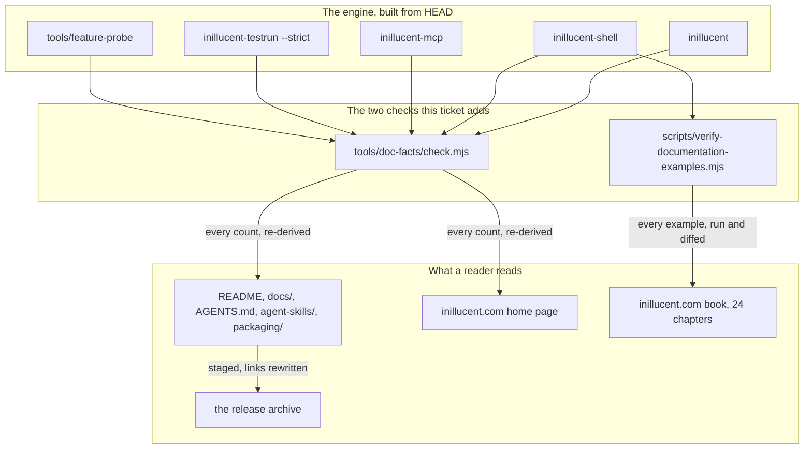
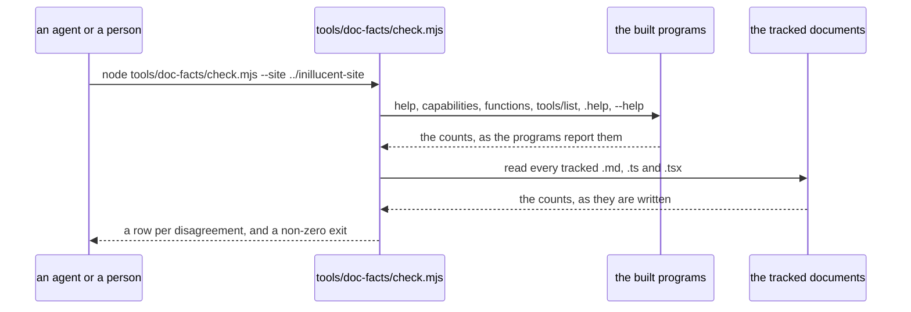

# Documentation that matches the engine, and a check that keeps it matching

task-1925. The repository documentation, `AGENTS.md`, the agent skills, the packaging pages and
inillucent.com are audited against the engine built from `57c202b`, corrected, and given an
automated check so the same drift cannot return silently.

## Introduction

Twenty-two Inillucent tickets landed in the September sprint after the last documentation pass
(task-1877 for the repository, task-1893 and task-1899 for the site). The engine grew a thirtieth
command line verb, a twenty-eighth MCP tool, an embedding installer, a published Linux archive, a
worked RAG example and a hundred and thirty-eight more tests. Every count, every headline number and
several whole paragraphs were left where they were.

The audit ran each claim against the program rather than against the previous write-up. Forty-three
claims are wrong. Four are worse than stale: two pages tell a reader that no statement is ever
refused, when twelve window function cases are; the documentation book's compatibility chapter
teaches a retired figure the repository readme itself calls retired; the book's own SQL tutorial does
not run as written, because chapter 5 creates a table without the column chapters 7, 8 and 9 select
from; and the page that says it reads the committed score card publishes numbers from a different
grading run.

## Goals and non-goals

**Goals.**

1. Every count in the repository documentation, `AGENTS.md`, `agent-skills/`, `drivers/README.md`,
   `packaging/` and inillucent.com matches what the engine reports when asked.
2. No page contradicts another page, and no page contradicts itself.
3. Every internal link and anchor in the tracked Markdown resolves.
4. Every SQL example in the documentation book runs, in the order a reader types it, and prints the
   output the book shows.
5. Two checks exist and are runnable: one that re-derives every published count from the engine, and
   one that runs the book's examples and diffs the printed result.
6. The prose follows the house style in `CLAUDE.md`.

**Non-goals.**

- **Re-running the retrieval grading.** The corpus cache is gone and rebuilding it is about ten
  hours of embedding plus a PostgreSQL with pgvector. The page will say which run each figure comes
  from instead, and a follow-up ticket asks for the re-grade.
- **Cutting a release.** Version 0.1.1 is what is published. Where the documentation promises
  something only a later build has, it will say so plainly rather than being made true by shipping.
- **Changing engine behaviour.** Two defects the audit found are recorded and handed on, not fixed
  here.

## Problem statement

### What the engine reports, against what the documentation says

Every measured figure below came from the binaries built from `57c202b`, or from the probe and the
test runner run for this ticket.

| claim | where it is written | documented | measured |
|---|---|---|---|
| command line verbs | `docs/getting-started.md`, site hero, site agents section | 29 | **30** |
| MCP tools | `README.md` prose, site hero, site agents section, site inside section | 27 | **28** |
| function names | `docs/sql.md` twice, `README.md`, site inside section, site book chapter 12 | 212 | **190** in the register; 172 of SQLite's 177 library names |
| JSON function names | `docs/sql.md`, site SQL section | 28 | **30** |
| tests | `docs/repository.md`, site Rust section | 2,508 across 140 targets | **2,646 across 149 targets** |
| failing tests | `docs/repository.md` | seventeen fail today | **none fail** |
| whole test run | `docs/repository.md`, `AGENTS.md` | about 155 s | **300.9 s** |
| crates denying `unwrap`, `expect`, `panic` and slice indexing | `docs/repository.md` | 23 of 29 | **26** |
| documentation book chapters | `docs/README.md`, `docs/getting-started.md`, site download section | 23 | **24** |
| tests in the two retrieval crates | `tests/synthetic-corpus.md` | 255 | **442** (`inillucent-core` 282, `inillucent-bench` 160) |
| the `read.point` family | site inside section and speed headline, against its own family table | 2,658% faster | **2,877% faster** (29.77x), which is what its own table already said |
| driver capabilities | site book chapter 24 | 23 supported, `cancel` not supported | **22 supported, 2 partial**: `cancel` and `readonly_open` |
| weighted headline | `docs/product-overview.md` twice, `docs/sql.md`, `docs/roadmap.md`, `docs/performance.md`, `README.md`, site book chapter 24 | 326% faster, 4.26x | **330% faster, 4.30x** |
| processor time | `docs/product-overview.md` | 67% less, 422 ms against 1,266 | **70% less, 390 ms against 1,320** |
| memory | `docs/product-overview.md` | 15% more, 42.6 MiB | **14% more, 42.40 MiB** |
| the `transaction` family | `docs/product-overview.md`, `docs/roadmap.md`, `docs/performance.md` (twice, against its own table) | 241% faster, 3.41x | **152% faster, 2.52x** |
| the six slower workloads | `README.md`, site endnote 2 | 178 / 98 / 72 / 15 / 14 / 5 per cent slower | **69 / 100 / 43 / 11 / 8 / 4** |
| abstention rate | `docs/retrieval-quality.md` against inillucent.com | page 0.0125, site 0.5% | the two runs disagree: the 2026-09-08 run reads **0.0125** and the committed score card reads 0.0050. Every surface now quotes the 09-08 run, and the page names the difference |
| the differential probe | site book chapter 24 | 403 same, none refused, 13 not byte equal | **391 same, 12 refused, 7 differ, 6 ours only** |

The probe's own totals were re-run and are correct everywhere else: 416 cases, 391 the same byte for
byte, 12 refused and every one a window function, 7 answering differently, 6 with no SQLite answer to
compare against. So are 67 pragmas of 67, 63 dot commands of 65, 5 collations of 5, and 48 shell
command line options.

### The release archive shipped seven dead links

`packaging/stage-layout.ps1` stages `drivers/README.md` as `DRIVER.md` and stages neither `drivers/`,
`compat/`, `tools/` nor `examples/`. Seven Markdown links across `README.md`, `AGENTS.md`,
`DRIVER.md` and `docs/feature-comparison.md` named those paths, so each one was dead in every archive
anybody downloaded. Nothing checked, because the repository copies resolve on GitHub.

### Four defects that are not a stale count

**A refusal the documentation denies.** `drivers/README.md` and
`agent-skills/inillucent-embed/SKILL.md` both say "No SQL statement answers `Unsupported` today", and
the second adds "the 416-case probe refuses nothing SQLite answers". Run a window function and the
driver answers `unsupported`, the command line exits 3, and the probe counts twelve such cases. A
binding author reading either page would write the arm the page tells them they will never reach and
never test it.

**A tutorial that does not run.** The documentation book's chapter 5 creates
`books(id, title, author_id, rating)`. Chapter 7 selects `year`, chapter 8 orders by `b.year` and
chapter 8's second example filters on `year`. Typed in order against a fresh file, chapter 7 is a
parse error and everything after it in that thread is unreachable. Chapters 7, 8 and 9 also print
rows for four books and three authors that no earlier chapter inserts, chapter 6 writes a book whose
author does not exist yet under the foreign key chapter 5 turns on, and every printed table is
hand-aligned rather than copied from the shell, which centres a header and right-aligns a number.
Chapter 22 teaches `inillucent-migrate --sqlite-file library.sqlite library.rdb`; the program's usage
is `inillucent-migrate <source-index-dir> <destination.db>`, and the SQLite import is
`inillucent migrate <file> --destination <db>`. Chapter 23 labels two pragma results `value` where
the shell prints `page_size` and `page_count`. Chapter 2 tells a reader to build the workspace, which
a reader of a private repository cannot do, and says multi-process access is outside the design,
which every other page says is supported under `PRAGMA locking_mode = normal` and measured over 37
stress rounds.

**A score card the page does not read.** `docs/README.md` says
`inillucent-scorecard.md` is the card a grading run writes and that `docs/retrieval-quality.md` is
"the page that reads it for you". The committed card is a run generated on 2026-09-01; the page
carries a re-grade from 2026-09-08 whose output survives nowhere in the repository. Seven of the
seventeen rows differ between them, the abstention rate among them. A reader who checks the page
against the evidence finds the evidence disagrees.

**Two promises about a build that does not exist.** `docs/embeddings.md`,
`agent-skills/inillucent-search/SKILL.md` and `examples/rag-agent/README.md` say the released
binaries carry the `embed` feature "from 0.1.2". There is no 0.1.2. The published 0.1.1 archives
answer `no such function: embed`, which was checked by running the documented query against the
archive on this machine. The readme's own first search example is written as though it works.
`packaging/release-all.ps1` does pass `--features inillucent-cli/embed`, so the next release will
carry it; until that release is cut the sentence is a promise rather than a fact.

### Contradictions between pages

- `README.md` says `examples/rag-agent` ships "an HNSW graph and a BM25 index, committed". The
  example's own readme says there is deliberately no vector index on that table, and
  `inillucent indexes` over the committed file returns nothing.
- `README.md`'s programs table says 28 MCP tools; its MCP section says 27.
- The site's download section publishes a Linux archive; the site's limits table says the Linux
  archive is not posted yet.
- `docs/README.md` says the book has 23 chapters; the book has 24.

### Links

`docs/repository.md` links `roadmap.md#7-deleting-the-old-engine`, which was renamed, and
`roadmap.md#the-failing-tests`, which is no longer a heading. `docs/feature-comparison.md` links
`#vector-search-against-postgresql--pgvector` twice and `tests/inillucent-testing-tdd.md` links
`#timings`; neither anchor exists. Inside the release archive, `README.md` and `AGENTS.md` link
`drivers/README.md`, which the staging script renames to `DRIVER.md`, so those links are dead in
every archive a person downloads.

## Architectural overview

The design point is that neither check reads a previous document. `check.mjs` asks the programs and
fails when a number written in a document is not the number the program gives. `verify-documentation-examples.mjs`
runs the book's SQL against a fresh file, in chapter order, and fails when the printed output differs
from the output the book shows.

## Components and interfaces

### `tools/doc-facts/check.mjs`, in the inillucent repository

Derives each fact from the engine, then greps the tracked documents for the written form of that fact
and reports every disagreement. It takes `--json` for a machine and prints a table otherwise.

| fact | how it is derived |
|---|---|
| command line verbs | `inillucent help`, the `Commands:` block |
| MCP tools | an `initialize` and a `tools/list` over standard input, counted |
| shell dot commands | `.help` through `inillucent-shell`, lines beginning with a full stop |
| shell command line options | `inillucent-shell --help`, the accepted list and the refused list |
| function names, and the families | `inillucent functions --output json --limit 0`, distinct names |
| pragmas, collations, modules | `_agent_output/feature-probe/registers/registers.json` |
| probe totals | `_agent_output/feature-probe/results.json` |
| driver capabilities | `inillucent capabilities --output json`, counted by support |
| tests and targets | `inillucent-testrun --strict`, the summary line |
| crates under each lint | the `lib.rs` of every workspace member |
| book chapters | `documentationChapters.length` in the site repository, when it is present |

The site is a separate repository, so the check takes `--site <path>` and skips the site facts when it
is not given.

### `scripts/verify-documentation-examples.mjs`, in the site repository

Imports `src/data/documentation.ts` directly under Node's type stripping, runs every example whose
`resultLabel` is absent through `inillucent-shell` against one database in chapter order with
`.mode markdown` and `.headers on`, and diffs the printed block against `example.result`. A
`resultLabel` of `Terminal` marks an example that is a shell transcript or Rust source; those are
listed and skipped, and each is checked by hand in this ticket.

For the book to run in order it needs the story to be coherent, so the chapters change as well as the
check:

- chapter 5 creates `books` with the `year` column chapters 7, 8 and 9 read, and inserts the three
  authors before the books that reference them;
- chapter 6 writes the four books the later chapters print;
- chapters 7, 8, 9, 18 and 23 print what the shell prints;
- chapter 22 teaches `inillucent migrate`;
- chapter 2 leads with the one line installer and keeps the build as the second route;
- chapter 24 carries the probe's real verdict and the capability table's real counts.

### The release archive

`packaging/stage-layout.ps1` gains one step: after the documents are staged, the links that name a
path the archive does not have are rewritten in the staged copy. `drivers/README.md` becomes
`DRIVER.md`, `drivers/conformance/suite.json` and `../compat/README.md` become plain text naming the
repository, and `../tools/feature-probe/README.md` likewise. The repository copies are untouched.

## Data flows and security

The checks read; they never write a document. A check that edited the prose to match would make every
number true by construction and measure nothing, which is the failure mode `tests/inillucent-testing-tdd.md`
calls a test that cannot fail.

No secret is involved. Both checks run offline against a local build. The publish step for the site
uses the existing Service Manager service and the existing `publish` script, with no new credential.

**The risk worth naming** is that a check keyed on a written phrase can be evaded by rewording the
sentence. `check.mjs` therefore matches on the number in the neighbourhood of a keyword rather than on
a whole sentence, and it reports a fact it could not find in any document as a failure of its own
rather than as a pass, so deleting the sentence does not make the check green.

## Alternatives considered

| option | for | against |
|---|---|---|
| **Correct the prose and add both checks** (chosen) | The numbers are right today and a later drift fails a command rather than waiting for a reader | Two new scripts to keep working |
| Correct the prose only | Nothing new to maintain | This is the third documentation pass on the same pages in five weeks, and the counts drifted again between the second and the third |
| Generate the counts into the documents at build time | Cannot drift at all | The repository documentation is read on GitHub and inside the archive as plain Markdown, so it has no build step; introducing one to hold four numbers is a worse trade |
| Re-run the retrieval grading so the page and the card agree | The strongest fix for the score card problem | About ten hours to rebuild and embed the corpus, plus a PostgreSQL with pgvector this box does not have configured. It is a measurement ticket, filed as a follow-up |
| Cut 0.1.2 so `embed` works in a published build | Makes the readme's first search example true | A release is not a documentation change, and the macOS half of the pipeline needs the MacBook. Filed as a follow-up |

## Testing strategy

Functional, against the built programs. No unit tests are added.

| # | check | how it fails |
|---|---|---|
| 1 | `node tools/doc-facts/check.mjs --site ../inillucent-site` | any number written in a tracked document disagrees with the program that reports it, or a fact appears in no document at all. `--run-tests` adds the test and target counts, which cost about five minutes |
| 2 | `node scripts/verify-documentation-examples.mjs` | a book example's printed output differs from the shell's, or the example errors |
| 3 | the link and anchor sweep, folded into check 1 | a relative link names a file that is not there, or an anchor names a heading no page has |
| 4 | `node tools/feature-probe/run.js` | the probe's totals move, which is what the sql and compatibility pages quote |
| 5 | `inillucent-testrun --strict` | the test and target counts move, which is what the repository page and the site quote |
| 6 | `node scripts/verify-runtime-parity.mjs https://inillucent.com` | the published site does not carry what the built site does |
| 7 | the archive's links, checked in a staged directory | a document in the archive links a path the archive does not contain |

Each of check 1 and check 2 was confirmed to be able to fail before it was trusted, by changing a
correct value by hand and watching the check name it:

- `docs/repository.md`'s `2,646 tests across 149 test targets` was changed to `2,647`. Check 1
  answered `FAIL tests - the engine says 2646 / docs
epository.md:107 says 2647` and exited 1.
  Restored, it answers `ok`.
- The documentation book's first chapter result was changed from `Inillucent is ready` to
  `Inillucent is nearly ready`. Check 2 printed both blocks and exited 1. Restored, 23 of 23 match.

Check 7 failed on its own first run, which is how three of the seven dead links were found: the
staged archive carried `DRIVER.md -> inillucent-driver-capi/include/inillucent_driver.h`,
`README.md -> examples/rag-agent/README.md` and `README.md -> LICENSE`, the last of them because the
repair ran before the licence was staged. A real archive staged from HEAD now has 0 broken links and
0 dead anchors across its 31 documents.

## What this ticket hands on

Two engine defects the audit found, neither fixed here:

1. **A mistyped verb silently creates a database.** `inillucent bogusverb` exits 0 and leaves a file
   called `bogusverb` and a log segment beside it, because an unrecognised first word falls through to
   the `inillucent <file> [SQL...]` shell form. The working tree of this repository's sibling already
   holds `--db`, `-d` and their log segments from earlier runs of the same shape.
2. **The `embed` feature is off in the published archive**, so `inillucent setup-embeddings all`
   downloads 620 MB that the program which downloaded it cannot use. The fix is a release cut with
   `release-all.ps1`, which already passes the feature.
