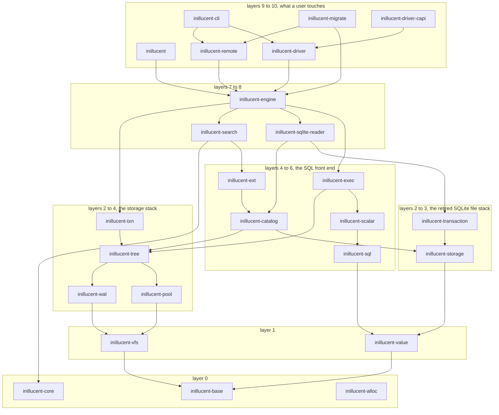

# task-1961 - inillucent code review, part four: architecture, tests, documentation, agent instructions, and the roadmap

Reviewed at commit `b467293`, the tip of `main` after the history rewrite this ticket carried out.
Every file and line cited below is at that revision. The tree at `b467293` is byte for byte the tree
that was at `888d9fc` before the rewrite, so a reader holding either sees the same files.

## Introduction

This is the fourth review of the repository. The first three (task-1892, task-1920, task-1946)
looked for defects: crash safety, wrong answers, secrets in tracked files, release readiness. Their
findings were implemented (task-1894, task-1932, task-1953) and each was confirmed closed by reading
the code. This round asks a different set of questions, the ones the ticket names:

1. Are the architectural choices sound?
2. Is test coverage good, and is it measured?
3. Is the code organised so a competent programmer who is not a database expert can find their way,
   and is it clear to read?
4. Is the code well commented?
5. Is the documentation good for a reader who has not written a database?
6. Do the agent instructions tell an AI coding agent how to install the database and how to find and
   use the skills, and are the skills well defined?

Two other things the ticket asked for were done inside the ticket rather than designed here, because
they were operations and not code: the git history of `jasonmcaffee/inillucent` was rewritten so
every commit is authored and committed by Jason McAffee with no Claude or Anthropic attribution
anywhere, and both `jasonmcaffee/inillucent` and `Black-Rainbow-Labs/Inillucent` were made public.
Section 8 records what that changed and what it left for the implementation ticket.

A comment on the ticket added a seventh question: `docs/roadmap.md`, which the public mirror serves at
`Black-Rainbow-Labs/Inillucent/blob/main/docs/roadmap.md`, must be current. The memory item is closed
and comes off it, anything already settled comes off it, and the items that are genuinely open are
designed here so the implementation ticket can build them. Section 9 is that.

Six read-only review lanes ran against the tree and their reports are under
`_agent_output/task-1961-code-review-part-4/` (`git-facts.md`, `agent-instructions-and-skills.md`,
`test-coverage.md`, `docs-and-comments.md`, `architecture.md`, `roadmap-status.md`,
`history-rewrite-report.md`). Every finding below was checked at the cited lines before it was
written down; the counts name the command that produced them.

### The short version

The engine is in better shape than most database code of its size. One error type with four
conversions and no error framework; a layering contract with 29 crates, no cycles and one stale row,
enforced by a test; 95% of functions carrying a doc comment under `#![deny(missing_docs)]` on 21
crates; 103 of 105 `unsafe` blocks carrying a `SAFETY:` comment and `#![forbid(unsafe_code)]` on every
crate on the query path; 2,807 tests with a runner that refuses to report a test that did not run.
None of that needs changing and section 4 says so, so a later pass does not "fix" it.

What needs changing is concentrated:

- **One type does everything.** `ImportedDatabase` in `inillucent-engine` has 63 fields and 284
  methods across 12 files, and `crates/inillucent-engine/src/lib.rs` is 7,273 lines. A newcomer
  cannot tell which five methods they need.
- **Two public Rust APIs and nothing that says which to use.** `inillucent` and `inillucent-driver`
  are both published over the same engine with different `Value`, `Error` and `Statement` types, and
  only one has a `Transaction`. The facade's own first paragraph names four crates that no longer
  exist.
- **The skills cannot be found.** Eight good `SKILL.md` files sit in `agent-skills/`, a directory no
  agent reads; `.claude/` at the root is empty; there is no root `CLAUDE.md`.
- **Half the documentation defines its words and half does not.** The retrieval half has a
  26 term glossary and five diagrams; the relational half uses B-tree, WAL, page, pragma, MVCC,
  rowid and collation with no definition anywhere, and there is no glossary file.
- **Coverage is not measured.** The only coverage numbers on record name crates that no longer
  exist. The 19,000 lines of gate programs under `inillucent-compat/src/bin/` that decide pass or
  fail have no test of their own, and the same class of gate has reported success while checking
  nothing twice this week.
- **The roadmap carries items that are closed or settled**, and the ones that are open have no
  design.

## Goals and Non-Goals

### Goals

- G1. Fix every finding in sections 4 to 9 so a competent programmer with no database background can
  open the repository, read one page that says how it fits together, find the API they should use,
  and find the skills from any of the five named agents.
- G2. Measure coverage on the current engine and publish the number, and put a test under the gate
  programs so a gate that checks nothing fails.
- G3. Make `docs/roadmap.md` true: only open items, each with a measurement and a design, nothing
  closed or settled.
- G4. Leave every existing contract green at every step: the differential gate, the five contracts
  `AGENTS.md` section 2 names, `tools/validate`, and the documentation tests.

### Non-goals

- Any change to on-disk formats except where a roadmap item in section 9 explicitly designs one, and
  those carry their own recovery tests and a legacy read test.
- The binder split. task-1913 owns `crates/inillucent-sql/src/bind.rs`; this document only points at
  it.
- Making the engine multi-threaded inside one process. Section 9 designs the step that is reachable;
  a parallel executor is not in scope.
- Performance work that is not a roadmap item.
- Re-running the three earlier reviews. Their findings are closed.

## Problem statement

The repository is public as of this ticket. A public reader arrives through one of three doors:
`README.md`, `AGENTS.md` if they are an agent, or `cargo add inillucent` if they are a Rust
programmer. Each door has a defect that the earlier reviews did not look for because they were
looking for bugs:

- The README's documentation table does not link `docs/relational-architecture.md`, so the SQL half
  of the engine has no entry from the front page, and the page it does link to for architecture
  covers only retrieval.
- `AGENTS.md` is good and points at `agent-skills/README.md`, which tells a person to run a
  symlink command by hand. Nothing in the repository runs it. Claude Code reads
  `.claude/skills/*/SKILL.md`, which is empty; Cursor and Gemini CLI have no file of their own at
  all.
- `crates/inillucent/src/lib.rs` promises a `Row` type that does not exist, describes four deleted
  crates as present, and has no example. The driver one directory over has the transaction type the
  facade lacks. Nothing says which crate to use.

Behind the doors, the engine's largest type and largest file are the ones a contributor has to read
first, and they are the two things in the workspace that no split has caught up with.

## Architectural overview

29 workspace members: 27 under `crates/`, 2 under `drivers/`. Production source is 219,109 lines;
the four test-only crates (`inillucent-bench`, `inillucent-compat`, `inillucent-model`,
`inillucent-sim`) add 51,973. Counted with `find <crate>/src -name '*.rs' | xargs wc -l` per crate.



The graph is the real one, read from each crate's `[dependencies]` and reduced to the edges that
carry a layer boundary. `docs/invariants/layering.toml` describes it and
`crates/inillucent-compat/src/layering.rs` checks it. There are no upward edges and no cycles. The one
stale row and the one direction the check does not look in are finding A13.

Two things a reader needs to know that the graph does not say. First, the retired SQLite file stack
(`inillucent-storage`, `inillucent-transaction`, 18,528 lines) is linked into every shipped binary,
unconditionally, because `inillucent-engine` depends on `inillucent-sqlite-reader` with no feature
gate (`crates/inillucent-engine/Cargo.toml:28`) so that `Database::import` can read a `.db` file.
`crates/inillucent-sqlite-reader/src/lib.rs:25-34` says so and names it as task-1816 phase 5.
Second, there is no connection pool anywhere; "the pool" in this workspace is always the buffer pool
in `inillucent-pool`, one per open file.

## 4. Architecture and code clarity

The full measurements are in `_agent_output/task-1961-code-review-part-4/architecture.md`. Each
finding here names the file, the count, and what to do.

### A1. `ImportedDatabase` is the file, the pool, the catalog, the transaction manager, the DDL engine, the pragma table, the statement cache, the function registry, the virtual table host, the integrity checker and the import tool

`grep -rn 'impl ImportedDatabase' crates/inillucent-engine/src/` returns 18 `impl` blocks over 12
files. Method counts per file: `lib.rs` 143, `ddl.rs` 41, `pragma.rs` 38, `vtab.rs` 21, `plans.rs` 13,
`analyze.rs` 8, `vectors.rs` 5, `attach.rs` 4, `introspect.rs` 4, `marks.rs` 3, `checkpoint.rs` 2,
`inspect.rs` 2: **284 methods on one type with 63 fields**. It sits behind one
`RefCell<ImportedDatabase>` (`crates/inillucent-engine/src/connect.rs:93`), so every operation borrows
the whole engine and no two operations can be shown independent even when they are. That cell is
also why `borrow_mut()` appears 24 times in the crate and why a user function that calls back into
its own connection panics (A11).

**Do this in three steps, each leaving the gate green.**

Step 1, the file split (mechanical, no behaviour change). `crates/inillucent-engine/src/lib.rs` is
7,273 lines and its method order already clusters. Move each cluster to a module:

| new module | lines today | contents |
|---|---|---|
| `engine/open.rs` | 1331 to 1868 | `import`, `import_with`, `import_into`, `settle_journal`, `create`, `create_on`, `open`, `open_on` |
| `engine/inspect.rs` (extend) | 1869 to 2023 | the 15 accessors: `catalog_view`, `tree_identifiers`, `frames`, `pool_bytes`, `page_count`, `pool_stats`, `byte_size`, `leaf_count`, `table_root`, `roots` |
| `engine/statements.rs` | 2024 to 2300 | `plan`, `execute`, `prepare`, `pipeline`, `statement`, `run`, `run_with`, `describe`, `describe_cached`, `build_stages` |
| `engine/counters.rs` | 2310 to 2405 | `autocommit`, `last_insert_rowid`, `total_changes`, `changes`, `record_changes`, `remember_rowid`, `next_seed` |
| `engine/batch.rs` | 2406 to 2977 | `begin_batch`, `undo_to`, `undo_to_floor`, `reload_entries`, `reattach_entries`, `rollback`, `commit_batch`, `commit_across`, `vote`. This is the transaction manager, 571 lines |
| `engine/integrity.rs` | 3085 to 3311 | `check_trees`, `write_index_entry_unchecked`, `check_indexes_agree` |
| `engine/functions.rs` | 3794 to 3970 | `external_functions`, `create_scalar_function`, `create_aggregate_function`, `register_function`, `remove_function`, `create_collation`, `set_defensive`, `set_authorizer` |
| `engine/compiled.rs` | 4251 to 5107 | `execute_compiled`, `apply_compiled`, `fold_values`, `compile_explain`, `compile`, `keys_plan`, `update_keys_plan`, `write`, `abandon`. The write path, 857 lines |
| `engine/explain.rs` | 5135 to 5308 | `returning_names`, `program_of`, `opcode_name`, `program_rows`, `query_plan_rows` |
| `engine/rowshape.rs` | 5761 to 6520 | `source_layout_of`, `logical_row`, `stored_as`, `import_table`, `table_shape`, `import_keyed_table`, `keyed_table_shape`, `import_index`, `load_schema` |

The same move for the three other large files in the crate: `ddl.rs` (2,753 lines, one impl block)
becomes `ddl/table.rs`, `ddl/index.rs`, `ddl/alter.rs`, `ddl/trigger.rs`, `ddl/view.rs`,
`ddl/vtab.rs` beside the existing `ddl/reindex.rs`; `pragma.rs` (1,930 lines, 85 pragma names in one
impl) becomes `pragma/schema.rs`, `pragma/tuning.rs`, `pragma/integrity.rs` and
`pragma/registry.rs` with the name to handler table in one place; `vtab.rs` (2,266) becomes
`vtab/shadow.rs` (`ReadStore`, `WriteStore`, `ShadowStore`, lines 68 to 682) and `vtab/host.rs`.

Step 2, group the 63 fields into the structs they already are: the file handle and pool, the catalog
and its generation, the session state (temp objects, attached databases, connection pragmas, the
function registry, the authorizer), the batch and undo state, the statement cache, the counters.
Each becomes a named field of `ImportedDatabase` holding a struct, and the methods that touch only
one group move onto that struct. No public signature changes.

Step 3, the type split. `Database` (file, pool, WAL, catalog: opened once), `Session` (what step 2
grouped as session state), `Writer` (the batch state from `engine/batch.rs`). `connect.rs` builds a
`Connection` from a `Session` and reaches the `Writer` through it. This is the step that lets the
single `RefCell` become three, and it is the one with risk: it touches every call site in
`inillucent-engine`, `inillucent`, `inillucent-driver` and `inillucent-cli`. It goes last, after A2
has decided which public surface survives, so the call sites are rewritten once.

### A2. Two public Rust APIs, and nothing that says which one to use

`crates/inillucent/src/lib.rs` (85 lines) re-exports the engine's `Database`, `Connection`,
`Statement`, `Params`, `Levers` and, under the name `Value`, `inillucent_tree::datum::OwnedDatum`.
`drivers/inillucent-driver/src/lib.rs` (1,303 lines) defines its own `Database`, `Connection`,
`Statement`, `Rows`, `Value`, `Error`, `Status`, `Transaction` and `Capability` over the same engine.
Both are published. `README.md`, `docs/getting-started.md` and the two crates' own documentation never
say which a Rust application should depend on. The CLI depends on both.

| job | `inillucent` | `inillucent-driver` |
|---|---|---|
| open | `Database::open`, `open_with(path, frames)`, `import` | `Database::open`, `open_with(path, OpenOptions)`, `import_sqlite` |
| execute | `Connection::execute(sql) -> DbResult<i64>` | `Connection::execute(sql, &[Value]) -> Result<u64>`, `execute_named` |
| query | `query(sql) -> DbResult<Vec<Vec<OwnedDatum>>>` | `query(sql, &[Value], limit) -> Result<Rows>`, `query_all`, `query_named` |
| bind and step | ten methods on `Statement` | none: `Statement::query(params, limit)` only |
| transaction | none, `BEGIN` through `execute_batch`, nothing rolls back on early return | `begin() -> Transaction`, `commit(self)`, `rollback(self)`, `Drop` rolls back, `transaction(work, check)` |
| rows | a matrix of an engine-internal enum, column names fetched separately | `Rows` with `column(name)` and `value(row, column)` |

**Decision: `inillucent-driver` is the public Rust API.** It has the transaction model, the `Rows`
type, the cancel flag and the capability table, and it is what the C ABI and the four language
packages already go through. `inillucent` becomes a re-export of `inillucent_driver` (`pub use
inillucent_driver::*;` plus a crate comment saying so), so `cargo add inillucent` keeps working and
the name on crates.io stays the entry point. The engine's `connect.rs` surface stays `pub` for the
CLI and the driver but is no longer re-exported from `inillucent`. `README.md` and
`docs/getting-started.md` each get one sentence naming the crate and one five line example.

Two things move down into the engine rather than up into the driver so the driver stays thin:
`Transaction` (A4) and the `OwnedDatum` to `Value` conversion (A6).

### A3. The facade's front page is false

`crates/inillucent/src/lib.rs:1` promises `Row`; there is no `Row` in the exports and no `pub struct
Row` a user can reach. Lines 24 to 33 say `inillucent-legacy`, `inillucent-capi`,
`inillucent-session` and `inillucent-vm` are in the tree and that "when the driver lands" they go
together. All four were deleted (roadmap item 7) and the driver has landed. `grep -c '```'
crates/inillucent/src/lib.rs` returns 0: no example. This is the first documentation a `cargo add
inillucent` user reads. A2 replaces the file; the replacement carries one `no_run` example covering
open, execute, query, prepare and a transaction, and a documentation test (`documentation.rs`)
checks that no crate under `crates/` or `drivers/` names a workspace member that does not exist.

### A4. The facade has no transaction type

A user of `inillucent` today issues `BEGIN` as SQL through `execute_batch` and nothing rolls it back
on an early return. `drivers/inillucent-driver/src/lib.rs:1032-1090` has the right design:
`Transaction` with `commit(self)`, `rollback(self)`, and `Drop` rolling back what was not settled.
Move it down into `inillucent_engine::connect` so the engine's own `Connection` has it and the driver
re-exports it. `Drop` interacts with the batch state in `engine/batch.rs` (A1 step 1), which is why
A1 step 1 goes first.

### A5. Two connections share one transaction, and only a doc comment says so

`crates/inillucent-engine/src/connect.rs:200-215`: a `BEGIN` on any handle opens a transaction every
other handle then joins, and a write through a second connection is undone by the first one's
`ROLLBACK`. `Database::connect()` returns something shaped exactly like an independent connection.
Anyone arriving from SQLite or rusqlite assumes isolation, and the failure is silent. Rename the
method `session()` on the engine and the driver, keep `connect()` as a deprecated alias for one
release, and put the rule in the type's own first paragraph. The type level version (a single writing
handle) is section 9's threads item and is not done here.

### A6. Five copies of the value conversion, two identical and one different, and three types called `Value`

| location | `Text` arm |
|---|---|
| `crates/inillucent-cli/src/shell.rs:1121` `value_of`, `:1136` `datum_of` | `text.raw().to_vec()` |
| `crates/inillucent-compat/src/facade.rs:50` `value_of`, `:70` `datum_of` | byte identical to the CLI copy |
| `crates/inillucent-exec/src/scalar.rs:68` `to_value`, `:126` `from_value` | `text.utf8_bytes().into_owned()`, different |
| `crates/inillucent-exec/src/expr.rs:1302` `as_value` | borrowed variant |
| `crates/inillucent-engine/src/vtab.rs:88` `as_values` | row at a time variant |

And `crates/inillucent-engine/src/lib.rs:176` is `pub use inillucent_value::Value as ExprValue;`
while `:200` is `pub use inillucent_tree::datum::OwnedDatum as Value;`, so `inillucent_engine::Value`
is not `inillucent_value::Value`, and the driver defines a third `Value` at
`drivers/inillucent-driver/src/value.rs:30`. `OwnedDatum::Int` against `Value::Integer` for the same
variant.

Put `impl From<&OwnedDatum> for Value<'static>` and `impl From<Value<'_>> for OwnedDatum` in
`inillucent-tree`, which both consumers already depend on; decide the `Text` arm once (the `raw()`
form, because a `Text` that is not valid UTF-8 must round trip unchanged, with a test that proves
it); delete the five copies; stop re-exporting `OwnedDatum` under the name `Value` from the engine
(A2 removes the facade's need for it). The driver keeps its own `Value` because it is the stable
surface, and its conversion uses the new `From` impls.

### A7. `crates/inillucent-exec/src/physical.rs` is 5,708 lines doing five jobs

| new module | lines today | contents |
|---|---|---|
| `physical/catalog.rs` | 94 to 500 | `SourceLayout`, `TreeCatalog`, `WithQueue`, `ForcePlan` |
| `physical/params.rs` | 614 to 1037 | `Params`, `split_mix`, binding and parameter lifetime |
| `physical/stages.rs` | 1038 to 2090 | `AccessKind`, `PreparedStage`, `Prepared`, `Pipeline`, `Source`, `prepare`, `plan_stages`, `push_stage`, `refuse_unhandled` |
| `physical/chain.rs` | 2091 to 3395 | `Space`, `HeldSpace`, `Chain`, `build_chain`, `Statement`, `build_statement`, `build_upper`, `source_for`, `build_source` |
| `physical/joins.rs` | 3396 to 4200 | `iterative_candidates`, `build_nested`, `build_lateral_join`, `build_materialised_join`, `materialise_stage`, skip scan and ordering predicates |
| `physical/run.rs` | 4203 to 4700 | `run`, `run_prepared`, `run_compound`, `run_arm`, `run_any`, `combine`, `order_compound` |
| `physical/translate.rs` | 4700 to 5708 | `translate`, `translate_scan`, `translate_post`, `rtree_check` |

`physical/keys.rs` already exists, so the directory is started and unfinished. The same treatment for
`dml.rs` (3,003: `dml/target.rs` for the `Trees`, `WriteTarget`, `RowSpace` traits first, then
`insert.rs`, `update.rs`, `delete.rs`, `conflict.rs`), `ops.rs` (2,177: by operator family),
`expr.rs` (1,758: `expr/tree.rs` and `expr/nodes.rs`, a clean line because nothing outside the file
names a node type) and `join.rs` (1,591: `join/store.rs`, `join/hash.rs`, `join/loop.rs`).

### A8. The long functions are where the doc comments are missing

62 functions exceed 150 lines; 39 in production crates, and 12 production crates have none. The four
that a contributor has to read, with the decomposition:

- `translate`, `crates/inillucent-exec/src/physical.rs:4725`, 494 lines, no doc comment. 60 lines of
  frame resolution then one `match` with about 35 arms. Split into `resolve_in_frame` (the two early
  returns at 4739 to 4790), `translate_literal`, `translate_reference`, `translate_logical`,
  `translate_comparison`, `translate_pattern`, `translate_call`; `translate` becomes a 30 line
  dispatcher and each helper is testable alone.
- `build_upper`, `physical.rs:2411`, 383 lines. One function per operator it may insert:
  `push_limit`, `push_distinct`, `push_sort`, `push_window`, `push_aggregate`, `push_projection`,
  each taking and returning `Box<dyn Sink>`; `build_upper` becomes the ordered list of those calls,
  which is what a reader wants to see.
- `IndexNestedLoopJoin::push`, `crates/inillucent-exec/src/join.rs:630`, 362 lines, no doc comment.
  Three interleaved concerns: `seek_key_for(outer_row)`, `inner_matches(key)`,
  `emit_unmatched(outer_row)`, with `push` as the loop over the outer batch.
- `plan_stages`, `physical.rs:1608`, 353 lines. `stage_for_term`, `order_stages`, `offsets_of`; and
  `push_stage` at 2017 takes a `StageRequest` struct instead of eight positional arguments.
- `load_schema`, `crates/inillucent-engine/src/lib.rs:6906`, 329 lines. Split by output:
  `read_catalog_rows`, `tables_from`, `indexes_from`, `layouts_from`; this is the natural content of
  `engine/rowshape.rs` in A1.
- `rows_of_module`, `crates/inillucent-engine/src/vtab.rs:940`, 313 lines, no doc comment. Gets one,
  and the cursor drive loop is split from the row collection.

Also `crates/inillucent-tree/src/leaf.rs` (5,026 lines) into `leaf/layout.rs`, `leaf/encode.rs`,
`leaf/read.rs`, `leaf/compare.rs`; `paged.rs` (3,565) into `paged/descent.rs`, `paged/cursor.rs`,
`paged/skip.rs`; `crates/inillucent-ext/src/vtab/fts5/mod.rs` (2,933) by `tokenize`, `index`,
`query`, `merge`; `drivers/inillucent-driver-capi/src/lib.rs` (1,852, 50 `extern "C"` functions in one
file) into `capi/db.rs`, `capi/stmt.rs`, `capi/value.rs`, `capi/error.rs`. `crates/inillucent-sql/src/ast.rs`
(1,583) stays one file: it is a data definition and splitting it hides the grammar.

### A9. Parameter lists that are undeclared types

60 functions take more than 6 parameters. The ones to fix, each becoming a request struct:

| params | location | struct |
|---|---|---|
| 14 | `crates/inillucent-exec/src/physical/keys.rs:184` `range_union_bounds` | `RangeUnionRequest` |
| 11 | `crates/inillucent-sql/src/plan.rs:2411` `index_candidate` | `CandidateContext` |
| 11 | `crates/inillucent-storage/src/check.rs:342` `check_tree` | `CheckState` (four of the eleven are `&mut` accumulators) |
| 10 | `crates/inillucent-exec/src/dml.rs:1524` `upsert_row` | `UpsertRequest` |
| 10 | `crates/inillucent-exec/src/physical.rs:3396` `iterative_candidates` | `CandidateProbe` |
| 10, 10 | `crates/inillucent-sql/src/plan/seek_union.rs:97` and `:274` | one struct, they share ten parameters |
| 9, 8 | `crates/inillucent-exec/src/dml.rs:1085` `write_one` and `:2323` `remove_with_triggers` | `WriteRequest`, six shared |
| 8, 8 | `crates/inillucent-exec/src/trigger.rs:209` `fire` and `:357` `run_body` | `TriggerFiring`, seven shared |
| 9 | `crates/inillucent-sql/src/directive.rs:1715` `bind_create_index` | `CreateIndexSpec`, and its two booleans become `Uniqueness` and `IfNotExists` enums |
| 8 | `crates/inillucent-engine/src/ddl.rs:2049` `create_bodiless` | the adjacent `exists: bool, if_not_exists: bool` become an enum |

Rule for the implementer: where two functions in one file share seven or more parameters, the
parameter list is a type that has not been declared. Adjacent boolean parameters
(`crates/inillucent-cli/src/setup.rs:423` `install_runtime(gpu, force)`;
`crates/inillucent-cli/src/command/mod.rs:333` `open(readonly)` becomes `OpenMode`;
`crates/inillucent-compat/src/corpus.rs:222` `scan_tree(is_table)` is two functions) become enums.

### A10. Three small signatures

- `Option<Option<String>>` at `crates/inillucent-engine/src/lib.rs:1199`,
  `crates/inillucent-engine/src/vtab.rs:916` and `crates/inillucent-exec/src/physical.rs:275`, destructured at
  `physical.rs:4707-4715`. Becomes `enum ModuleIntegrity { NoSuchModule, Clean, Report(String) }`.
- `build_stage_nanos() -> (u128, u128, u128, u128, u128, u128, u128)` at
  `crates/inillucent-engine/src/lib.rs:2269`. Becomes `struct StageTimings { parse, bind, plan,
  prepare, build, run, collect }`.
- `disable_optimizations(&self, mask: u32)` at `crates/inillucent-engine/src/connect.rs:619` takes
  `Levers`, the type the same crate exports for exactly this.
- `civil_from_days() -> (i64, i64, i64)` at `crates/inillucent-cli/src/archive.rs:483`,
  `crates/inillucent-ext/src/vtab/zipfile.rs:611` and `crates/inillucent-compat/src/bin/perfhistory.rs:844`
  are three copies of a routine that already exists with a named struct and a round trip test at
  `crates/inillucent-scalar/src/datetime.rs:453` (`civil_of`) and `:434` (`julian_of`). The three
  copies call it.
- `prepare_with_tail(&self, sql) -> DbResult<(Statement<'d>, usize)>` at `connect.rs:508` is public and
  the `usize` is unnamed. `struct Prepared { statement, consumed }`.

### A11. A reentrant borrow on the statement path panics

`RefCell::borrow_mut()` appears 24 times in `inillucent-engine` (`connect.rs` 5, `ddl.rs` 3, `lib.rs`
11, `plans.rs` 4, `session_changes.rs` 1) and 15 `try_borrow` calls exist elsewhere, so the safe
form is used in some places and not others. The reachable case is a user scalar function registered
through `create_scalar_function` (`connect.rs:552`) whose body calls back into the connection it was
registered on. `AGENTS.md` bans `panic!` on paths that read SQL text; a panicking `borrow_mut` is
the same failure. Every `borrow_mut` on a path a statement can reach becomes `try_borrow_mut` mapped
to the existing `DbError` for a reentrant call (the `misuse` code the driver already documents), with a
test that registers a function that calls `query` on its own connection and asserts an error, not a
panic. A1 step 3 removes most of these; this finding is the guard until then.

### A12. Duplicated implementations of things that must agree

- Keccak and SHA-256 twice: `crates/inillucent-base/src/sha3.rs` and `crates/inillucent-compat/src/hash.rs`
  have byte identical `theta` (`sha3.rs:226`, `hash.rs:149`) and `chi` (`sha3.rs:268`, `hash.rs:185`),
  and `sha256`/`sha256_hex` exist in both (`base/src/hash.rs:126,133`, `compat/src/hash.rs:23,28`).
  `inillucent-compat` depends on `inillucent-base`; delete the compat copy and keep its test vectors as
  a test of the base one.
- `read_varint` three times: `crates/inillucent-ext/src/vtab/fts5/doclist.rs:23` and
  `crates/inillucent-ext/src/vtab/fts5/vocab.rs:412` are both `fn read_varint(bytes, at) -> u64` in
  sibling modules of a crate that forbids slice indexing, beside the checked one in
  `crates/inillucent-base/src/varint.rs`. Both call the base one.
- The test harness helpers inside `inillucent-compat` (`pinned_shell` four times, `render` four,
  `bind_value` three, `eat_borrowed` three, `run_sqlite` three) move to `crates/inillucent-compat/src/`
  where the other shared helpers live.

### A13. The layering contract's two blind spots

`docs/invariants/layering.toml:277-285` lists `inillucent-transaction` in `inillucent-catalog`'s
`may_depend_on`; `crates/inillucent-catalog/Cargo.toml` has no such dependency. It survived because
`crates/inillucent-compat/src/layering.rs:392` reports an edge the contract forbids but never an edge
the contract allows and nobody uses. And `layering.rs:410-427` inspects `[dev-dependencies]` only for
the production to test-only case, so `inillucent-exec` and `inillucent-tree` each have a dev edge to
`inillucent-vfs` the contract does not describe; both are downward and harmless, but an upward one
would pass. Add a declared but unused report (a failure, so the contract stays true), run
`check_internal_edge` over `[dev-dependencies]` with the layer rule relaxed and the direction rule
kept, and remove the stale row. About twenty lines beside `check_internal_edge`.

### A14. The default build is never built

`tools/validate.sh:88,91` and `.github/workflows/ci.yml` use `--all-features`; `ci.yml:236` builds
`inillucent-cli` alone with defaults. `grep -rn 'no-default-features'` over every workflow, script
and manifest returns nothing. `inillucent-storage` has two independent features (`opcode-probe`,
`check`) with 15 `cfg(feature)` sites between them, and no job builds them crossed. Add `cargo check
--workspace --all-targets` (defaults) and `cargo check -p inillucent-storage --features check` to the
validate script and CI.

### A15. Identifiers are bytes in 88 signatures and strings in 22, in the same three crates

```sh
grep -rn 'name: &\[u8\]\|table: &\[u8\]\|database: &\[u8\]\|column: &\[u8\]' crates/inillucent-engine/src crates/inillucent-sql/src crates/inillucent-catalog/src | wc -l   # 88
grep -rn 'name: &str\|table: &str\|database: &str\|column: &str' crates/inillucent-engine/src crates/inillucent-sql/src crates/inillucent-catalog/src | wc -l          # 22
```

Both spellings are on the public surface of the same type: `connect.rs:654 imposter(name: &[u8])`,
`connect.rs:584 remove_function(name: &str)`, `lib.rs:1983 table_root(name: &str)`. The bytes form
is right (SQLite identifiers are bytes, folding is ASCII on bytes) and should win everywhere behind a
name: `Identifier<'a>(&'a [u8])` in `inillucent-base` with `folded()` and `as_str_lossy()`, and the 88
manual fold calls in the binder become one method. This one is scheduled after task-1913's binder
split lands, because most of the call sites are in `bind.rs`.

### A16. The pragma table is not generated into the documentation

`crates/inillucent-engine/src/pragma.rs` recognises 85 names; the docs mention 40. The command table
is already generated from `crates/inillucent-cli/src/command/registry.rs` and checked by
`--test command_parity`; do the same for pragmas from `crates/inillucent-sql/src/pragma_register.rs`
into `docs/pragmas.md`, with the test failing when they diverge. This also settles D3.

### What is already right

Recorded so a later pass does not change it: one error type with four `From` impls and no `anyhow`
or `thiserror` in anything a user links (`crates/inillucent-base/src/error.rs`), with the code table
generated from `compat/errors.toml` and `ExtendedCode` a newtype rather than an enum so unknown codes
round trip through C; the layering contract; 95% doc coverage under `#![deny(missing_docs)]` on 21
crates with comments that carry an argument (`connect.rs:200-215`, `error.rs:330-360`); 103 of 105
`unsafe` blocks with a `SAFETY:` comment, `#![forbid(unsafe_code)]` on every crate on the query path,
zero `UnsafeCell`, seven `Rc<RefCell>` in 219,000 lines; the seven `Levers` each with a paragraph
saying why it is a lever; the 25 row capability table checked in both directions; `docs/repository.md`;
and `ast.rs` as one file. The one bare `unsafe { std::mem::zeroed() }` without a `SAFETY:` line is at
`crates/inillucent-remote/src/tls/windows.rs:611`; give it one.

## 5. Test coverage

Numbers from `_agent_output/task-1961-code-review-part-4/test-coverage.md`: 1,509 `#[test]` functions
under `src/`, 1,041 under `tests/` across 138 files, 4 executable doctests in the workspace; the last
strict run (`c5e1471`, task-1913) reported 166 targets, 2,807 tests, 0 failed, and
`inillucent-testrun --list` enumerates 170 targets today. 28 of 29 crates deny `unwrap`, `expect`,
`panic` and slice indexing outside `#[cfg(test)]`, with two documented exceptions. There are no
`#[ignore]` tests and no flaky allowlist. `tools/validate.sh` is the one gate and is what CI runs on
Windows, Linux and macOS.

### T1. The gate programs have no test, and that is the defect class that shipped twice this week

`crates/inillucent-compat/src/bin/*.rs`: 30 files, about 19,000 lines (`fullgate.rs` 1,766,
`testrun.rs` 1,421, `readgate.rs` 1,081, `scorecard.rs` 895, `walperf.rs` 874, ...). They decide pass
or fail and none has a test of its own. Commit `888d9fc` (task-1951) fixed a packaging gate that
"said every check passed having checked nothing" on a missing `rcodesign`, and `c5e1471` (task-1913)
fixed an oracle whose counters silently read zero. `tests/inillucent-testing-tdd.md` section 9's six
phrase "; skipping" convention exists because the differential suites had this bug once, and the
`bin/` programs are not covered by it because they are the harness, not `#[test]` functions.

Add `crates/inillucent-compat/tests/gates_fail_closed.rs`: for each of `readgate`, `writegate`,
`fullgate`, `scorecard`, `walperf`, `searchgate` and `testrun`, run the built binary with its
prerequisite deliberately absent (no fixture directory, no oracle library, an empty corpus, an
unreadable database path) and assert a non-zero exit code and a message naming what was missing.
Then a second case per gate that runs it on the smallest real fixture and asserts the exit code is
zero and the report names a count greater than zero. A gate that prints a pass while measuring
nothing fails the second case.

### T2. Coverage has never been measured on the current engine

The only numbers on record are `_agent_output/task-1791/coverage-and-mutation.md`, which names
`rustdb-vm`, a crate that no longer exists. `cargo-llvm-cov 0.9.0` is installed and unused. Run
`cargo llvm-cov --workspace --branch --release --summary-only` (the retrieval tier excluded the way
`tests/selection.toml` already excludes it from the fast run), publish the per crate table in
`docs/repository.md` beside the crate map with the date and the command, and add the command to
`tools/validate.sh` behind a `--coverage` flag so the number can be re-measured by anyone. The
`docs/repository.md:140` claim of "100% branch coverage held on the page pool" gets the same treatment
as the crate count beside it: a test in `documentation.rs` that reads the published table and fails
if the claim is not in it.

### T3. The largest files have no test that names their own types

| file | lines | types nothing in `tests/` names |
|---|---:|---|
| `crates/inillucent-exec/src/physical.rs` | 5,708 | `Frame`, `AccessKind`, `ForcePlan`, `HeldSpace` |
| `crates/inillucent-sql/src/bind.rs` | 5,122 | `Binder` once, `Authorizer` and `AuthAction` never (task-1913 owns the file; the tests land after its split) |
| `crates/inillucent-exec/src/dml.rs` | 3,003 | `CompiledUpsert`, `Conflict`, `Difference` |
| `crates/inillucent-sql/src/dml.rs` | 1,771 | `BoundDelete`, `BoundAssignment`, `BoundDefault`, `BoundCheck` |
| `crates/inillucent-cli/src/diagnose.rs` | 1,048 | no `tests/` hit and no compat suite named for diagnostics |

Every SQL query exercises some path through these, which is legitimate for a SQL engine and is why
the 267 file "no in-file test" count is not the actionable list. The actionable part is that a defect
in `ForcePlan` handling or in how a conflict clause is compiled, as opposed to which SQL text triggers
it, has no test targeting it. After A7 splits `physical.rs`, each new module gets a `#[cfg(test)]`
block that constructs its own types: a `ForcePlan` that names an index and a plan that does not use
it must refuse; a `HeldSpace` released twice must not double free; a `Conflict` compiled from `ON
CONFLICT (a) DO UPDATE SET b = excluded.b` must carry the `excluded` column indexes the executor
reads. After task-1913's split, the same for the binder's authorization path: an `Authorizer` that
denies `SQLITE_READ` on one column must turn that column's reads into `NULL` and nothing else.

### T4. Platform specific paths

`crates/inillucent-vfs/src/os/windows.rs` (522 lines) and `os/unix.rs` (593) are exercised by
`inillucent-vfs/tests/conformance.rs` generically over three backends. task-1913 found a Windows only
silent no-op in `link_directory`. Add `crates/inillucent-vfs/tests/windows_locks.rs` under
`#[cfg(windows)]` asserting the lock retry path by name (a second handle holding the byte range, the
first retrying and then failing with the documented code), and its `unix_locks.rs` twin under
`#[cfg(unix)]`. `crates/inillucent-remote/src/tls/windows.rs` (929) and `tls/unix.rs` (487) are covered
only when a live PostgreSQL or MySQL server is reachable, which `tests/selection.toml` marks as commonly
absent; add a loopback TLS test that starts a local acceptor with a self signed certificate and
asserts the handshake, the certificate rejection path, and the redaction of the peer name in the
error, with no database server involved.

### T5. Fuzz seeded twins for every codec

`docs/repository.md` says every codec fuzz target has a seeded twin that runs under `cargo test`; the
pattern (`fuzz_seeded`) is confirmed by name only for `json`, `mysql`, `postgres` and `store`. The
eight codec targets in `fuzz/Cargo.toml` (`varint`, `bigendian`, `page_header`, `leaf_page`,
`interior_page`, `meta_page`, `memcmp_key`, `wal_record`) each get one, or the sentence in
`docs/repository.md` names the four that have one.

### T6. Doctests on the crate a user depends on

Four executable doctests in about 270,000 lines. After A2 the public crate is the driver; every
public type on its front page (`Database`, `Connection`, `Statement`, `Rows`, `Transaction`, `Value`,
`Error`) gets one runnable example, and `cargo test --doc -p inillucent-driver` joins
`tools/validate.sh`.

### T7. What a newcomer is not told about running tests

`tests/inillucent-testing-tdd.md` section 6 gives time and hardware expectations for every tier
except retrieval and fuzzing, and says `inillucent-core::lib` and `inillucent-bench` take 250 s
"under contention" without saying contention with what. State the hardware (a 5090 for the embedding
arm, the disk for the retrieval store), the quiet box time, and the busy box time, the same way the
other tiers are described.

## 6. Documentation for a reader who has not written a database

Grading in `_agent_output/task-1961-code-review-part-4/docs-and-comments.md`. The prose documents
are strong: `README.md`, `docs/architecture.md`, `docs/relational-architecture.md`, `AGENTS.md` and
`drivers/README.md` all say what the thing is before how it works. Code comments measure well: 98.81%
of public Rust items (3,969 of 4,017) carry a `///`, every crate has `#![deny(missing_docs)]` and a
crate level `//!`, every file over 200 lines has a module comment, and `cargo doc --workspace` gives
one warning (a cargo target name collision). The findings are about coverage of the reader, not
quality of the sentences.

### D1. The relational half never defines its words

`docs/architecture.md:20` "2. Words to know" defines 26 retrieval terms in plain language (HNSW,
quantisation, cosine distance, ...). `docs/relational-architecture.md`, `docs/sql.md` and
`docs/feature-comparison.md` use B-tree, page, frame, cell, overflow page, freelist, WAL, journal,
checkpoint, savepoint, MVCC, pragma, catalog, rowid, collation, affinity, covering index, planner,
binder, executor, schema cookie, with no definition anywhere, and there is no glossary file. Write
`docs/glossary.md` (60 to 80 lines): one table, one sentence per term, both halves of the engine,
matching the house style of the existing "Words to know" table, and link it second in
`docs/README.md`'s order (after the product overview, before getting started) and from the first
paragraph of `relational-architecture.md`, `sql.md` and `AGENTS.md` section 2. The retrieval table in
`architecture.md` stays where it is and links to the glossary for the storage terms.

### D2. There is no one page that shows both engines

`docs/architecture.md` covers retrieval with five diagrams; `docs/relational-architecture.md` covers
SQL, storage, transactions, the log and recovery. Nothing sits above them. Write
`docs/architecture-overview.md` (150 to 200 lines): what the two engines are; one Mermaid diagram of
SQL text through parser, binder, planner, executor, transactions, B+trees and WAL, VFS, with the
retrieval box attached where `inillucent_search` sits (`relational-architecture.md` section 9); the
lifecycle of one query across both halves; how a transaction commits in one paragraph (the write
ahead rule, pointing at `relational-architecture.md` section 5 for recovery); and where the bytes
live on disk, including the paragraph nothing currently states at the file level: the database file
holds a meta page, one B+tree per table and per index, and the free map, beside the four retrieval
index files `architecture.md` section 11 names. Link it from `README.md`'s documentation table and
`docs/README.md` fourth, and link `docs/relational-architecture.md` from `README.md:316-329`, which
today links only the retrieval half.

### D3. Numbers that disagree with the code

`README.md:207` and `docs/sql.md:29` say 67 pragmas; `compat/api/pragmas.toml`, generated from
`crates/inillucent-sql/src/pragma_register.rs`, has 68 entries. A16 generates the pragma table into
the docs and makes the count a checked fact in `tools/doc-facts/check.mjs` the way the version is;
until then the two lines say what the generated table says. `README.md:108` says "63 of its 65 dot
commands"; `AGENTS.md:28` and `agent-skills/inillucent-quickstart/SKILL.md:114` say "63 of its dot
commands" and drop the denominator; all three carry both numbers.

### D4. Stale text

- `crates/inillucent-pool/src/page.rs:56-57` says the page size default holds "until the Phase 1 sweep
  replaces it"; no such sweep exists anywhere in the repository. Name the ticket or delete the clause,
  per `AGENTS.md`'s rule that a comment may only claim what its test proves.
- `packages/go/README.md:88,94` tells a reader to install `@v0.1.0`, which `packages/go/go.mod` warns
  not to install. Use `@latest` and the current tag.
- `packages/npm/staged/inillucent/` is one version behind the published package. Either it is
  regenerated by the release script every time (then it is generated output and `dist/` treatment
  applies) or it is deleted; the release scripts decide, and the implementer records which in
  `packaging/PUBLISHING.md`.
- `dist/` duplicates files that live elsewhere in the tree. Add the top line note "frozen at release
  N, the live copy is at <path>" to each, or ignore the directory, whichever the release pipeline
  needs; the implementer reads `packaging/release.ps1` to decide and records it.

### D5. Each language package gets an API table

`packages/npm/`, `packages/python/`, `packages/php/`, `packages/go/`: each README has install and an
example and no method reference. Add a 20 to 30 line table per package (method, one line, link to the
worked example that uses it), modelled on `drivers/README.md`'s capability table, and a test in the
package's own suite that every method named in the table exists in the binding source.

### D6. `docs/README.md` order for a non-expert

```
1. What it is                 product-overview.md          exists
2. Words to know              glossary.md                  D1
3. Getting started            getting-started.md           exists
4. Architecture in one page   architecture-overview.md     D2
5. The retrieval engine       architecture.md              exists
6. The relational engine      relational-architecture.md   exists, now glossary backed
7. SQL support                sql.md                       exists
8. Pragmas                    pragmas.md                   A16, generated
9. Vector search              vector-search.md             exists
10. Embeddings                embeddings.md                exists
11. Migrating                 migrating.md                 exists
12. Performance               performance.md               exists
13. Feature comparison        feature-comparison.md        exists
14. Retrieval quality         retrieval-quality.md         exists
15. Repository and building   repository.md                exists, gains the coverage table (T2) and inillucent-alloc in the crate map
16. Dependency policy         dependency-policy.md         exists
17. Roadmap                   roadmap.md                   section 9
```

`documentation.rs` already fails on a page nothing links to; it should also fail on a page in
`docs/` that `docs/README.md` does not list, so the index cannot drift.

## 7. Agent instructions and skills

Inventory and grading in `_agent_output/task-1961-code-review-part-4/agent-instructions-and-skills.md`.
`AGENTS.md` (157 lines) is current and good: it says what the project is in two sentences, points at
install, points at the skills, and states the five contracts a test enforces. Spot checks of its
claims against the built binary and the source all verified (30 CLI commands, 28 over MCP, version
0.1.2 in `Cargo.toml`, `package.json` and `pyproject.toml`, every "not published yet" claim matching
`packaging/PUBLISHING.md`). The eight skills under `agent-skills/` have accurate frontmatter
descriptions that an agent can match on and correct commands. The problem is placement.

### S1. The skills are in a directory no agent reads

`.claude/` exists at the root and is empty (`ls -la .claude`: nothing). The eight `SKILL.md` files are
under `agent-skills/<name>/`. `agent-skills/README.md:28-44` tells a person to symlink them into
the agent's own skills directory by hand; nothing in the repository does it, so every fresh clone
starts with the skills invisible to Claude Code's own matcher.

Keep `agent-skills/` as the source of truth (it is the tool neutral copy the README describes) and
commit generated copies where each agent looks:

- `.claude/skills/<name>/SKILL.md` for Claude Code, which reads a project's `.claude/skills/`.
- `.agents/skills/<name>/SKILL.md` for Codex and the other adopters of the Agent Skills layout. The
  implementer checks the current Codex documentation for the project local path before committing to
  it and records the answer in `agent-skills/README.md`; if Codex reads a different path, use that
  one.

Copies rather than symlinks, because a symlink in a Windows checkout without `core.symlinks` is a
text file containing a path and Claude Code does not follow it. A script, `tools/sync-skills.mjs`,
regenerates the copies from `agent-skills/`, and a test in `crates/inillucent-compat/tests/documentation.rs`
fails when any copy differs from its source by a byte, so they cannot drift. `agent-skills/README.md`
replaces its symlink instructions with "they are already where your agent looks; `agent-skills/` is
the copy for anything else".

### S2. Only Codex has a root file of its own convention

`AGENTS.md` is the only root instruction file. `examples/rag-agent/CLAUDE.md` already shows the right
pattern: one line, `@AGENTS.md`. Add the same at the root as `CLAUDE.md`, and `GEMINI.md`, and
`.cursor/rules/inillucent.mdc` (a few lines of frontmatter and the same pointer), so Claude Code,
Gemini CLI and Cursor each find their own file and read the one shared document. No content is
duplicated; `documentation.rs` checks that each pointer file is under 20 lines and names `AGENTS.md`.

### S3. One stale path and one missing denominator

`agent-skills/inillucent-embed/SKILL.md:110` says `conformance/suite.json`; the file is
`drivers/conformance/suite.json`. The same bare string in `drivers/README.md` works only because that
file lives inside `drivers/`. Write the full path, as `README.md:199` already does. The dot command
denominator is D3.

### S4. Install instructions for an agent

The install story in `AGENTS.md` section 1 and `docs/getting-started.md` is correct and every claim
matched `packaging/PUBLISHING.md`. Two things change because the repositories are public now:
`packaging/PUBLISHING.md` and `packaging/install.sh`'s "build it yourself" fallback both describe the
repository as private, and the Go route through `proxy.golang.org` was blocked on that. The
implementer verifies `go install github.com/Black-Rainbow-Labs/Inillucent/packages/go/cmd/inillucent-install@latest`
from a machine or container with no git credential, records the result in `PUBLISHING.md`'s status
table, updates the fallback text, and wires `tools/check-public-urls.mjs` into `tools/validate` now
that it can be green (it was left out on purpose while it was red; commit `6d65281`'s message says
so). `AGENTS.md` section 1 gains the one line an agent needs for each of the five install routes once
they are verified, in the order a reader is most likely to have the tool (cargo, npm, pip, go,
composer).

### S5. Storage terms in the agent files

`AGENTS.md` and several skills use VFS, WAL, journal, B-tree and pragma undefined. Each first use
links to `docs/glossary.md` (D1). No new prose.

## 8. What the history rewrite and the public flip changed, and what they left

Done in this ticket, recorded in `_agent_output/task-1961-code-review-part-4/history-rewrite-report.md`:

- `jasonmcaffee/inillucent`: 342 commits on every branch and tag rewritten with `git filter-repo`
  (mailmap plus a message callback). Every commit is authored and committed by
  `Jason McAffee <account address>`; the four Dependabot commits on their own branches keep the
  bot identity. 90 `Co-Authored-By: Claude ...` trailers, 89 `Claude-Session:` lines, one "Written by
  Fable 5.1." sentence and two "on opus[1m]" phrases are gone; a grep over every message for
  `co-authored|claude|anthropic|fable|opus|sonnet|noreply@anthropic` returns 0. Every tree is byte
  identical (342 of 342), author and commit dates are unchanged, `v0.1.1` and `v0.1.2` are still
  annotated with their messages. filter-repo also remapped 22 abbreviated commit hashes cited inside
  commit messages, each checked against the map. New `main` is `b467293`.
- Both repositories are public. Anonymous `api.github.com` requests return 200 for both; an anonymous
  clone of origin shows one author; the three releases on `Black-Rainbow-Labs/Inillucent` still carry
  their assets. `Black-Rainbow-Labs/Inillucent` was already Jason only (ten squashed release commits
  built by `packaging/mirror-github.ps1`) and was not rewritten.
- The main checkout is on the new history, clean, with repo local `user.name` set to `Jason McAffee`.
  A full pre-rewrite mirror is at `<machine path>/_task1961/inillucent-backup.git` (51 MB) with
  `commit-map.txt` (342 old to new pairs) beside it.

Left for the implementation ticket, all of them edits to tracked files:

### P1. Documents that cite pre-rewrite shas

filter-repo remapped the hashes inside commit messages; it does not touch files. Using
`<machine path>/_task1961/commit-map.txt`:

| file | old | new |
|---|---|---|
| `tasks/task-1920-inillucent-code-review-tdd.md:3` | `57c202b4865ac3ab5795c4a9c523d37da5080022` | `593505f290d4` |
| `tasks/task-1920-inillucent-code-review-tdd.md:639` | `cb1dba5` | from the map |
| `tasks/task-1946-inillucent-code-review-round-two-tdd.md:3,34,175,215,244,280,307` | `b179c43` | `6e84068` |
| `tasks/rust-db-phase-2-tdd.md:6,13,407,416,422,455,718` | `b94b8da`, `d885e91`, `1854f3d` | from the map |
| `tasks/task-1836-cli-mcp-and-installers-tdd.md:8` | `dbe8b29` | from the map |
| `packaging/PUBLISHING.md:336` | `69ff7d9` | from the map |
| `packaging/PUBLISHING.md:396-399,443` | `739a1cb` | `458992d`; `b52e297`, `703de98`, `8afa290` are mirror commits and stay |

### P2. Text that says the repositories are private

`packaging/PUBLISHING.md` (the status table rows for GitHub release, Go and Packagist, and the
mirror section at 329 to 470) and `packaging/install.sh`'s fallback. S4 covers the verification; the
text changes with it. The `tools/doc-facts/check.mjs` rule that banned the word "private" from
`README.md` (task-1946 M6) is now simply true.

### P3. Personal strings still quoted in one tracked document

`tasks/task-1946-inillucent-code-review-round-two-tdd.md:289-290,310,313,321-322` quote the round two
findings verbatim: a machine path, a drive letter, an account address and a real looking test fixture
address. They were findings then and they are now text in a public repository. Replace each quoted
value with a placeholder of the same shape (`<machine path>`, `<account address>`,
`user@example.invalid`) and leave the finding's sense intact.

### P4. The Dependabot pull request refs

`refs/pull/1/head` to `refs/pull/4/head` on origin point at pre-rewrite Dependabot commits whose
parents carry the old trailers, and those commits stay fetchable by exact sha until GitHub garbage
collects. The four pull requests were closed at the force push; Dependabot opens fresh ones on its
next weekly run. Clearing the old objects is section 10 decision 1.

### P5. Two files over GitHub's recommended size are in a public history

`compat/release/large/pristine-sqlite.db` (88.46 MB) and `compat/release/large/pristine-rustdb.db`
(88.82 MB). Every clone pays for them. Decision 3 in section 10.

## 9. The roadmap

This section is written from `_agent_output/task-1961-code-review-part-4/roadmap-status.md`, which
checked each of the roadmap's thirteen items against the code, the scorecard, `docs/performance.md`,
the commit log and the Tasks board.

The roadmap was rewritten in this ticket (commit on `main` after `b467293`) so the public copy is
current now rather than after the implementation lands. What follows records what came off, why,
and the design for each item that stays. `docs/closed-items.md` is new: it holds the closed items
with the measurement that closed each, and the "What task-1911 closed" section that was 180 lines
of history inside a document titled "What is not there yet". The five documents that linked into the
old anchors (`docs/repository.md:59,115`, `docs/performance.md:56,64,77`, `docs/product-overview.md:95`,
`docs/feature-comparison.md:1412`) point at the new ones.

### 9.1 What came off, and the evidence

| old item | why it is off | evidence |
|---|---|---|
| 1. Memory | Closed by decision: 42.40 MiB against 37.20 is where it stays. | Jason's comment on this ticket. `docs/performance.md:20,166` keep the number. |
| 2. `open.prepare` and `schema` bars | Arithmetic: the bars ask for 96 ns and for a packer costing nothing. They are decision 5 in section 10, not work. | `docs/roadmap.md` (old) lines 30 to 37 gave the arithmetic. |
| 3. The operator chain is rebuilt on every execution | Built. The index nested loop tower and the write path slot the item called "not built yet" both exist. | `crates/inillucent-exec/src/compiled.rs:60` `struct JoinRecipe`, used by `Compiled::run`; `crates/inillucent-engine/src/plans.rs:451` `CachedQuery.slot: RefCell<Slot>` on `Cached::Insert`, `Update` and `Delete`. Same ticket (task-1911), later commit than the roadmap text. |
| 4. Linux | Settled by experiment: the platforms run the same absolute speed and it is SQLite's arm that moves. The re-measurement wants a separate Linux machine and is a caveat in `docs/performance.md:251-267`, not a roadmap item. | `docs/performance.md:251-267`. |
| 6. `extension.fts.build` | Settled: the segment format was built, measured, and reverted because a module could not learn that another connection had committed. That hook exists now: `schema_changed` and `committed_elsewhere` (task-1932). The number that remains is part of the `extension` bar, item 1 below. | `crates/inillucent-ext/src/vtab/mod.rs:262,273`; called from `crates/inillucent-engine/src/lib.rs:4032` and `crates/inillucent-engine/src/vtab.rs:2166`. |
| 7. The old engine is deleted | Done. | `ls crates/` has none of the four; `docs/dependency-policy.md:185-218` records the two that stay and why. |
| 10. A generation is one blob | Built. Segmented generations shipped in task-1911; the default delta log became a constant 1,024, which the old text still gave as `max(1024, rows / 8)`. | `crates/inillucent-search/src/module.rs` and `merge.rs` (`SegmentMeta`, `flush`, `merge_cascade`); `docs/relational-architecture.md:418,425`. |
| "What task-1911 closed" | History, not roadmap. Moved verbatim. | `docs/closed-items.md#what-task-1911-closed`. |

The check that would have caught items 3 and 10 going stale inside their own ticket: nothing tests
`docs/roadmap.md` (`grep -n roadmap tools/doc-facts/check.mjs crates/inillucent-compat/tests/documentation.rs`
returns nothing). Add to `documentation.rs`: every ratio (`N.NNx`) and every percentage with
"faster" or "slower" in `docs/roadmap.md` must also appear in `docs/performance.md`, so the roadmap
cannot carry a number the performance page has moved past (item 5's `0.50x` against the page's
`0.70x` is the case it catches).

### 9.2 What stays, renumbered, each with its measurement and its design

**Roadmap item 1. `read.join` and `extension` miss their bars on the lower bound.**
`read.join` reads 4.32x with a 95% lower bound of 3.00x, the bar itself: the four runs were 2.97,
3.00, 3.00 and 2.99. `extension` reads 1.52x with a lower bound of 1.36x against 1.50x
(`docs/performance.md:47-56`).

- `read.join`. The chain reuse of old item 3 is built and nothing has measured the family since.
  Step 1: four consecutive quiet box gate runs; if the lower bound clears 3.00x the item closes with
  the number. Step 2, if it does not: the remaining cost is `join.range`, 200 probes per statement,
  each a fresh root to leaf descent. Design: ordered probe reuse in `IndexNestedLoopJoin`
  (`crates/inillucent-exec/src/join.rs:630`). When the planner has marked the outer stage's rows as
  ordered on the join key (the information the `ORDERED_WALK` lever already puts on
  `PreparedStage`), the join keeps the inner cursor across probes and seeks forward from its current
  position, descending from the root only when the next key is below the cursor. Measured with
  `inillucent-execprofile --paired` on the point join and the 200 row range join. Test: a join whose
  outer side is ordered yields the same rows as the oracle with the lever on and off, and a counting
  VFS asserts fewer page reads with it on.
- `extension`. `extension.fts.build` at 0.59x drags the family. The segment format built in
  task-1911 halved `fts.query` because the manifest was re-read from disk on every query and could
  not be cached without a hook that says another connection committed. `committed_elsewhere` and
  `schema_changed` are that hook. Design: re-apply the reverted segment format (find it with
  `git log -S automerge -- crates/inillucent-ext/src/vtab/fts5`), cache the manifest in the module,
  drop it on both hooks, and measure `fts.query` and `fts.build` paired. Accept only if `fts.query`
  stays at or above its current 1.43x and the family's lower bound clears 1.50x; otherwise revert
  again and record both numbers in `docs/performance.md`. `crates/inillucent-compat/tests/fts5_legacy_layout.rs`
  gains a pre-segment file so old indexes still answer.

**Roadmap item 2. `write.insert.batch` is 43% slower than SQLite.** 0.70x (`docs/performance.md:71,78`);
the old text said 0.50x and 72%, which were the numbers before task-1911. Cause: `LeafRef::locate`
(`crates/inillucent-tree/src/leaf.rs:886`) walks the unsorted delta area calling `delta_key_matches`
per entry, a typed decode per key column, up to `DELTA_LIMIT` 32 entries (`leaf.rs:120`), on every
insert; `main_table` carries two secondary indexes, so a batch pays it three times a row. Design: a
fingerprint block. A new leaf header bit `LEAF_DELTA_FINGERPRINTS` (bit 3, beside `LEAF_HAS_DELTA` at
`leaf.rs:89`); when set, the delta area begins with a `DELTA_LIMIT` by `u16` block, 64 bytes, holding
a 16 bit hash of each entry's key in memcmp form. `locate` compares the probe's fingerprint against
the block and decodes an entry only on a match, so an insert that misses the delta area pays 32
halfword compares and no decode. A leaf without the bit takes today's path; a leaf gains the block
on its next delta write, which already rewrites the delta area, and every compaction writes it, so
no page is ever migrated. `locate` is shared with recovery (its own comment says why), so recovery
takes the same path unchanged; the leaf check at `leaf.rs:308` verifies each fingerprint against
its entry, so a torn block is detected the way a bad directory is. Tests:
`crates/inillucent-tree/tests/leaf_delta_fingerprints.rs` (a leaf written in the old layout reads
and locates identically; a tree mixing old and new leaves; a manufactured fingerprint collision
takes the decode path and answers correctly); the four crash campaigns extended with a delta heavy
schedule under `journal_mode = off` and the default; the paired measurement before and after on
`write.insert.batch` and the `write` family gate. If the paired saving is under a fifth of the gap,
record it and stop: the next lever is a sorted delta area, a larger format change, and it is not
designed here.

**Roadmap item 3. The retrieval index's footprint.** 1.3 GB resident for a 3.1 GB index of 600,589
chunks with vectors read from the file, 3.1 GB with them held; the graph and the keyword postings
are wholly in memory and nothing has tried to make either smaller. Design, in three landings each
with its number in `docs/performance.md`: (1) measure where the 1.3 GB goes (graph adjacency,
postings, dictionaries, vectors) with the `inillucent-shellrss` method and publish the table;
(2) the graph behind the buffer pool: the published generation's adjacency lists laid out as fixed
width pages (a node's neighbours per layer as `u32` ids in page sized blocks, an offset table page
per 4,096 nodes) read through `inillucent-pool` frames instead of deserialised into a `Vec`, with
`crates/inillucent-core/src/hnsw.rs` search taking a neighbour provider trait implemented by the
in-memory graph today and the paged one after; (3) postings the same way, one block per term with
delta coded document ids as the doclist already is. The resident set becomes the pool budget.
Acceptance on the 600,589 chunk corpus: resident under 512 MiB at the default pool with vectors on
disk; p50 query latency within 1.5x and p99 within 2x of today's over the `docs/retrieval-quality.md`
query set; identical top k.

**Roadmap item 4. Threads.** Access from several processes works (the SQLite lock protocol, 37 stress
rounds, no lost write). Threads inside one process do not: the pool and the trees use `RefCell`, a
connection borrows the database, there is no parallel scan. Design, the reachable step, which is
SQLite's serialized mode: make `Database: Send` (not `Sync`) after an audit for `Rc`, raw pointers
and thread locals (the VFS handles already carry `unsafe impl Send` at
`crates/inillucent-vfs/src/os/windows.rs:231` and `os/unix.rs:61`); then `SharedDatabase` in the driver,
an `Arc<Mutex<Database>>` whose `session()` returns a `SharedConnection` that locks for the
duration of each statement (a `Rows` is materialised, so nothing holds the lock between calls), and
whose `begin()` returns a `SharedTransaction` that owns the guard for its life, which is what makes
"one transaction at a time" true across threads rather than a doc comment. No statement runs in
parallel; the graph build keeps its own threads. Tests: 8 threads by 1,000 inserts each through one
`SharedDatabase` and `count(*)` reads 8,000; a reader thread during a writer's transaction sees the
before state or the after state and nothing between; a `Database` moved to a thread and dropped
there. `docs/architecture-overview.md` (D2) says this is serialized, not parallel, and why. The
parallel executor is a non-goal.

**Roadmap item 5. A macOS archive.** Every platform's archive is built on that platform and there is
no macOS build machine; `cargo install inillucent-cli` builds it from source meanwhile. task-1951
closed everything reachable without the machine; what is left is
`packaging/macos/release-macos.sh --version 0.1.2 --upload` on Jason's MacBook, after which the
Homebrew formula and the two npm platform packages that wait on it go live. Nothing for the
implementation ticket except keeping the two lines true.

**Roadmap item 6. Recovery can read a page before redo has had a chance to rewrite it.** Reproduced
at cut 7 of `crates/inillucent-compat/tests/free_map_checkpoint_crash.rs` under `journal_mode = off`;
`crates/inillucent-engine/src/recovery.rs:181-207` repairs only the catalog root. Design: (1) root
cause with that reproduction: instrument `open_file` to record which page read fails and from where;
the hypothesis is a read of page 4 on the open path before the tolerant pass. (2) Generalise the
tolerant first pass: before any page other than the meta page is read, apply every physical page
image record in the log above `checkpoint_lsn` to its page (physical redo needs no catalog and no
row decoder); then read the catalog root; then run logical redo as today. A page the log holds no
image for and whose checksum fails stays a failure under `off`, as `crates/inillucent-pool/src/journal.rs`
documents that mode. Tests: cut 7 opens; a new `torn_page_with_image.rs` that tears page 4 with an
image in the log (opens, and the row is there) and without one (fails with the documented corruption
code, not a panic); the five checkpoint campaigns unchanged at zero detected damage.

**Roadmap item 7. Five command line files still reach past the driver.**
`crates/inillucent-compat/tests/policy.rs:1692-1721` records `shell.rs` 10, `command/mod.rs` 8,
`commands.rs` 7, `command/verbs.rs` 2, `import.rs` 1 lines that import `inillucent_engine`. Design:
the driver grows what those lines reach for, each a thin wrapper of an engine method that exists:
`Connection::register_module(name, Box<dyn Module>)`, `Connection::set_authorizer(Box<dyn Authorizer>)`,
`Database::pool_stats() -> PoolStats`, `Connection::databases() -> Vec<AttachedDatabase>` (the
`ATTACH` list), `Connection::arm_budget(Budget)`, `Database::info() -> DatabaseInfo` for `.dbinfo`
and `.stats`, `Database::serialize()` and `deserialize()` for the serialisation verbs, and
`Transaction` (A4) for `migrate` and `batch`. The `REACHES` table ratchets to zero one file at a
time, and at zero the test becomes "no file under `crates/inillucent-cli/src` imports
`inillucent_engine`". This is A2's decision carried through to the command line, and it is what
makes `drivers/README.md`'s sentence true of this repository and not only of an application.

### 9.3 Order

Item 7 first (it is the driver work A2 already needs), then item 6 (a correctness item with a
reproduction), then item 2 (a bounded format change with its own campaign), then item 4 (serialized
mode), then item 1 (measure, then the two designs), then item 3 (the largest). Item 5 waits on a
machine. Each lands as its own commit with its own roadmap paragraph updated to the measured number.

## 10. Decisions for Jason, and files for Jason to delete

1. **Clearing the pre-rewrite objects from GitHub.** Two ways: ask GitHub Support to run a garbage
   collection on `jasonmcaffee/inillucent` (their documented step after a history rewrite; the request
   names the repository and says a history rewrite removed commit metadata), or delete the repository
   and recreate it from the local clone, which loses nothing except the four closed Dependabot pull
   requests. Recommendation: the support request, because it keeps the repository's URL history and
   the settings; the recreate is the fallback if support is slow.
2. **Two files to delete.** `crates/inillucent-compat/--db` (131,072 bytes) and
   `crates/inillucent-compat/--db-wal.0000000001` (64 bytes) are still tracked; task-1946 section 6
   listed them and they were not removed. They are a stray database a test wrote when a `--db` flag
   was read as a filename. `git rm` both; nothing references them.
3. **The two 88 MB fixtures in history.** Removing them is a second history rewrite
   (`git filter-repo --path compat/release/large --invert-paths`), which is cheap now and expensive
   after anyone has cloned. If they go, the release gate reads them from `dist/` or downloads them,
   which `tools/validate` would need to learn. Recommendation: leave them; a 100 MB clone is
   ordinary for a database repository with fixtures, and a second rewrite a day after going public is
   a worse signal than the size.
4. **Releases on origin.** All three releases and the `packages/go/*` tags live on the mirror. Now
   that both repositories are public, either origin also carries them (one more place to keep true)
   or the mirror stays the release home and origin's README says so in one line. Recommendation: the
   mirror stays the release home; origin's `README.md` names it.
5. **The two performance bars arithmetic cannot reach.** `compat/perf/contract.toml` asks
   `open.prepare` for 400% faster where SQLite compiles, binds, steps and resets `SELECT 1` in 483 ns,
   so the bar wants 96 ns; and `schema` for 200% faster where a packer costing nothing leaves 2.18x.
   The roadmap has carried both for three releases with the sentence "changing one to meet a number
   is not a decision this document makes". Recommendation: set `open.prepare` to 1.50x and `schema` to
   2.00x in `contract.toml`, with the arithmetic in the file's comment, so the roadmap can stop
   listing two items that cannot close. This is decision 5 and not a finding because the bars were
   written before any measurement and only Jason can move them.
6. **The three worktrees pinned to old commits.** `<machine path>/_task1935-grade`,
   `<machine path>/ai-service/_agent_output/task-1933-review/inillucent-6bcbf10`,
   `<machine path>/inillucent-baseline`. They still work; they are on history origin no longer has.
   `git worktree remove <path>` for each when the tickets that made them are closed.
7. **The pre-rewrite backup.** `<machine path>/_task1961/inillucent-backup.git`, 51 MB. Delete when
   satisfied the rewrite is right.

## 11. Components and interfaces

The public Rust surface after A2 and A4, all in `inillucent-driver` and re-exported by `inillucent`:

```rust
pub struct Database;                 // open(path), open_with(path, OpenOptions), import_sqlite(path)
impl Database {
    pub fn session(&self) -> Result<Connection<'_>>;     // was connect(); connect() deprecated one release
}
pub struct Connection<'d>;
impl<'d> Connection<'d> {
    pub fn execute(&self, sql: &str, params: &[Value]) -> Result<u64>;
    pub fn query(&self, sql: &str, params: &[Value], limit: Option<usize>) -> Result<Rows>;
    pub fn prepare(&self, sql: &str) -> Result<Statement<'d>>;
    pub fn begin(&self) -> Result<Transaction<'_>>;       // Transaction now lives in inillucent_engine::connect
    pub fn transaction<T>(&self, work: impl FnOnce(&Transaction) -> Result<T>) -> Result<T>;
    pub fn capabilities(&self) -> &[Capability];
}
pub struct Transaction<'c>;          // commit(self), rollback(self), Drop rolls back
pub struct Rows;                     // column(name) -> Option<usize>, value(row, column) -> &Value, len()
pub enum Value { Null, Integer(i64), Real(f64), Text(Vec<u8>), Blob(Vec<u8>) }  // From<&OwnedDatum>, Into<OwnedDatum>
pub struct Error { status: Status, code: ExtendedCode, message: String }
```

The engine after A1 step 3:

```rust
pub struct Database { file, pool, wal, catalog }          // opened once per file
pub struct Session  { temp, attached, pragmas, functions, authorizer, statements }
pub struct Writer   { batch, undo, marks }                 // one per Database; the type that says "one transaction"
pub struct Connection<'d> { database: &'d Database, session: RefCell<Session>, writer: &'d RefCell<Writer> }
```

`inillucent-engine` stops re-exporting `inillucent_base`, `inillucent_ext` and `inillucent_vfs` as
modules (`lib.rs:129,138,158`); the driver re-exports the three types a caller needs (`Vfs`,
`ExtendedCode`, `Capability`).

The skills after S1 and S2:

```
AGENTS.md                      the one instruction document
CLAUDE.md                      @AGENTS.md
GEMINI.md                      @AGENTS.md
.cursor/rules/inillucent.mdc   frontmatter + @AGENTS.md
agent-skills/<name>/SKILL.md   source of truth, eight skills
.claude/skills/<name>/SKILL.md generated copy, checked identical
.agents/skills/<name>/SKILL.md generated copy, checked identical
tools/sync-skills.mjs          regenerates the copies
```

## 12. Data flows and security

Nothing in this document changes what bytes reach a file or a socket, with the exceptions section 9
names for the roadmap items that touch the leaf format and the retrieval generation, each of which
carries its own recovery campaign and a legacy read test.

The history rewrite changed commit metadata only. `history-rewrite-report.md` records that every one
of the 342 trees is identical before and after, so no file content moved. The public flip exposes
what the tree already held; the round two review had already removed the credentials and addresses
from tracked files, and the git facts lane found no secret in any historical blob: every connection
string in history is a documentation placeholder or a `127.0.0.1` local default, and the only real
addresses are Jason's own git address and a deleted account's, quoted in one tracked document (P3).

`tools/check-public-urls.mjs` fetching every GitHub URL a shipped package names with no credential is
the check that keeps the public claim true; S4 wires it in.

## 13. Alternatives considered

- **Make `inillucent` the one API and fold the driver into it.** Rejected: the driver's `Transaction`,
  `Rows`, cancel flag and capability table are the better design and the C ABI and four language
  packages already depend on the driver crate by name.
- **Symlink the skills instead of copying them.** Rejected: a Windows checkout without `core.symlinks`
  gets a text file, and this repository is developed on Windows.
- **Split `ImportedDatabase` by type first, files second.** Rejected: the file split is mechanical and
  reviewable on its own and makes the type split a diff a reviewer can read.
- **Delete the retired SQLite stack instead of feature gating it.** Rejected: `Database::import` is a
  shipped feature and `inillucent-catalog` reads through the retired `Pager` on the live path;
  untangling that is task-1816 phase 5 and not a review finding.
- **Purge the 88 MB fixtures during the attribution rewrite.** Rejected: it would have changed trees,
  and "every tree byte identical" was the verification that made the rewrite safe to push.
- **Rewrite the mirror too.** Not needed: its ten commits were already Jason only, and its trees are
  the release tags' trees, which the rewrite did not change.

## 14. Testing strategy

- Every step of A1 leaves `tools/validate` green and the differential gate at 0 failed, and each of
  the three steps is its own commit so a regression bisects to a step.
- T1's `gates_fail_closed.rs` is written before any gate program is touched, so a gate that stops
  measuring during the split fails a test.
- T2's coverage run is taken before the first split and after the last, and both numbers go in
  `docs/repository.md`; the second must not be lower.
- A6's `From` impls carry a round trip test over a `Text` value that is not valid UTF-8.
- A11's reentrant call test asserts an error and the absence of a panic (`catch_unwind` around the
  statement, asserting `Ok`).
- S1's byte identity test and S2's pointer file test live in `documentation.rs` beside the link
  checks that already exist.
- D6's index test fails on a page in `docs/` that `docs/README.md` does not list.
- The roadmap items in section 9 each name their own test in their design.

## 15. Implementation order

A. The public surface: A3, A2, A4, A5, A6, A10 (small, user facing, no engine change).
B. Tests first: T1, T2 (the baseline number), T5, T6, T7.
C. Documentation and agents: D1, D2, D3, D4, D5, D6, S1, S2, S3, S4, S5, A16, P1, P2, P3.
D. The mechanical splits: A1 step 1, A7, A8, A12, A13, A14, and the `SAFETY:` line.
E. Types: A9, A1 step 2, A11.
F. A1 step 3, then T3's module tests against the new modules, then T4.
G. The roadmap items in section 9, in the order that section gives, each its own commit and its own
   roadmap paragraph update.
H. A15 after task-1913 lands.

## 16. Acceptance criteria for the implementation ticket

1. `cargo add inillucent` gives the driver API; `crates/inillucent/src/lib.rs` is under 40 lines, has
   one runnable example, and names no crate that does not exist; a test enforces the last.
2. `Connection::begin()` exists on the engine's own connection; a test drops a `Transaction` without
   committing and asserts the write is gone.
3. `Database::session()` exists; `connect()` compiles with a deprecation warning.
4. One `OwnedDatum` to `Value` conversion in the workspace; `grep -rn 'fn value_of\|fn datum_of\|fn to_value\|fn from_value'` over `crates/` and `drivers/` returns only the `From` impls.
5. No `Option<Option<` in `crates/`; `build_stage_nanos` returns a struct; `disable_optimizations` takes `Levers`.
6. `crates/inillucent-engine/src/lib.rs` under 1,500 lines; `crates/inillucent-exec/src/physical.rs` under 800; no file under `crates/inillucent-engine/src` or `crates/inillucent-exec/src` over 2,000 lines except `bind.rs`'s owner.
7. No production function over 300 lines; `translate`, `build_upper`, `IndexNestedLoopJoin::push`, `plan_stages`, `load_schema`, `rows_of_module` each under 100.
8. No function in `crates/` or `drivers/` with more than 8 parameters; the ten in A9 take structs.
9. A user scalar function that calls its own connection returns an error; the test asserts no panic.
10. `gates_fail_closed.rs` passes with two cases per gate program, and `tools/validate` runs it.
11. A dated coverage table in `docs/repository.md` naming the current crates, and `tools/validate --coverage` reproduces it.
12. `docs/glossary.md` and `docs/architecture-overview.md` exist, are listed in `docs/README.md` in the order D6 gives, and `documentation.rs` fails on an unlisted page.
13. `docs/pragmas.md` is generated and a test fails when it differs from the register; `README.md` and `docs/sql.md` carry the generated count.
14. `.claude/skills/` and `.agents/skills/` hold the eight skills, byte identical to `agent-skills/`, checked by a test; `CLAUDE.md`, `GEMINI.md` and `.cursor/rules/inillucent.mdc` exist and point at `AGENTS.md`.
15. `packaging/PUBLISHING.md` and `install.sh` say the repositories are public; the Go route is recorded as verified or as failing with the exact error; `tools/check-public-urls.mjs` runs in `tools/validate` and passes.
16. No tracked file cites a pre-rewrite sha (`grep` for each old hash in P1 returns nothing); `tasks/task-1946-...tdd.md` holds no machine path, drive letter or account address.
17. `docs/invariants/layering.toml` has no declared but unused edge and the check reports one when added; dev-dependencies are checked for direction.
18. `cargo check --workspace --all-targets` with default features and `cargo check -p inillucent-storage --features check` run in `tools/validate` and CI.
19. `docs/roadmap.md` matches section 9: no memory item, no settled item, every remaining item with a measurement and its design, every anchor other documents link to updated (`docs/repository.md:59,115`, `docs/performance.md:56,64,77`, `docs/product-overview.md:95`, `docs/feature-comparison.md:1412`).
20. The roadmap items section 9 marks as built in this ticket each pass the test their design names, and the roadmap paragraph for each is updated with the measured number.
